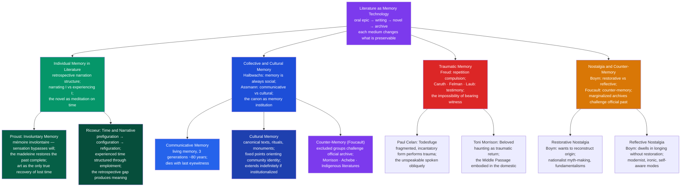

# Literature and Memory

> [!abstract] TL;DR
> Literature is humanity's primary memory technology — it preserves experience across generations, gives form to traumatic and collective pasts that individual memory cannot hold, and raises the question that haunts every archive: what a culture chooses to remember is always inseparable from what it chooses to forget, and whose memories are enshrined in the canon is a question of power as much as of aesthetics.

---

## Intuition

**Analogy:** Think of memory as water. A human lifespan is a cupped hand — it holds experience for a while, but it leaks, evaporates, and spills when the hand goes still. Writing is a clay vessel: it holds more, holds it longer, but it is fragile and someone has to carry it. Literature is a system of aqueducts and cisterns — it channels memory across centuries, distributes it to communities who were not there, and lets later generations drink from experiences they never lived.

But an aqueduct does not transport water unchanged. It filters it, selects what flows and what is diverted, and the channel itself alters the quality of what passes through. Literature shapes what is remembered, gives experience a beginning-middle-end it did not have in life, and makes permanent what was random and contingent. Every act of literary memory is also an act of literary forgetting — which is why the questions "what do texts remember?" and "whose memories are preserved?" are not supplementary to literary study but central to it.

---

## How It Works



The four branches represent the four major frameworks through which literary scholars have theorized memory. They are not competing but complementary: Proust describes the individual phenomenology of remembering; the Assmanns describe the social institutions that preserve what individuals cannot; trauma theory attends to memory that has been shattered and cannot easily be narrated; and counter-memory theory asks why certain kinds of experience never entered the official record in the first place.

---

## Key Concepts

### Secondary Level

**Literature as a Memory Technology**

Before writing, stories were the primary technology humans used to preserve experience across time and transmit it across generations. The Greek bards who performed the Iliad were not entertainment providers — they were the community's living archive, preserving the genealogies of heroes, the geography of a lost world, and the cultural values of a civilization that would otherwise have vanished. When Achilles chooses a short glorious life over a long obscure one, the epic records not just a plot event but a whole theology of honor, fame, and what makes a life worth living. Without Homer, that theology disappears.

Plato, in the *Phaedrus*, was aware of this function and suspicious of it. He put into Socrates's mouth a critique of writing itself: the god Theuth offers writing to the Egyptian king Thamus as "a remedy for memory and wisdom," but Thamus rejects it. Writing, he argues, will weaken memory — people will rely on external marks instead of cultivating internal knowledge; they will appear wise without being so; the written word cannot respond, defend itself, or know which reader needs what instruction. This critique is not merely an ancient curiosity. It identifies a real tension — between memory as living practice and memory as preserved artifact — that runs through every subsequent debate about canon, archive, and the difference between knowing and consulting.

Writing won. But the consequences Plato warned about are real: the history we know is the history that got written down by those with access to writing materials and the leisure to use them. The oral cultures whose literature survived — Homer, the Vedas, the Mahabharata, the West African griots — survived partly by accident, partly because someone eventually wrote them down. Countless oral traditions simply ended with the last speakers.

**The Retrospective Structure of Narrative**

Every narrative is already a memory act. To tell a story is to describe what happened — from a later vantage point, in the past tense, with the knowledge of how it ended. This retrospective structure is not just a grammatical convention; it is the fundamental epistemological condition of all storytelling.

Gérard Genette (drawing on Proust) distinguished between the *narrating I* — the self who tells the story from the present — and the *experiencing I* — the past self who lived through the events being described. This gap is the engine of first-person narrative. The narrating I knows things the experiencing I did not: that the marriage would fail, that the friend would betray, that the city would fall. The dramatic irony in a memoir comes from the reader watching the experiencing I approach what the narrating I already knows. When Jane Eyre narrates her time at Thornfield with the easy confidence of "Reader, I married him," she speaks from a position of retrospective security that reorganizes the chaos of her earlier experience into meaningful shape.

This means that autobiography and memoir are not transcriptions of lived experience but reconstructions of it. What happened is not the same as how it is remembered; how it is remembered is not the same as how it is narrated; and how it is narrated shapes what is subsequently remembered. Literature about the past is always, in some sense, literature about the act of remembering itself.

---

### Undergraduate Level

**Proust and Involuntary Memory**

Marcel Proust's *In Search of Lost Time* (1913–1927) is the supreme literary exploration of memory — seven volumes organized around the attempt to recover a lost past that voluntary effort cannot reach.

The novel's founding moment occurs in the first volume (*Swann's Way*) when the narrator dips a madeleine into a cup of lime-blossom tea. The taste and smell trigger an overwhelming, unexpected recovery of his childhood summers at Combray — not as a pale recollection but as a full sensory experience, as vivid as the original. Proust calls this *mémoire involontaire* (involuntary memory): a memory that comes unsought, triggered by sensation rather than deliberate effort.

Proust's theory rests on a sharp distinction:

| Type | Mechanism | Quality of recovered past |
|------|-----------|--------------------------|
| **Voluntary memory** (*mémoire volontaire*) | Deliberate recall; habit and intellect | Gives us facts without lived experience; the grandmother remembered is a photograph, not a person |
| **Involuntary memory** (*mémoire involontaire*) | Triggered by sensation — smell, taste, sound | Restores the past "in its original state"; the past surges back complete, overwhelming, immediate |

The philosophical claim behind this distinction is bold: voluntary memory is not a reliable guide to the past because it reconstructs experience through the intellect, which imposes its own order. Involuntary memory bypasses the intellect and makes contact with something that was preserved intact outside consciousness — sealed in sensation, waiting to be unlocked by the right key.

Proust's further thesis, developed across all seven volumes: the past can be recovered not through effort but through *art*. The novel itself is the recovery of lost time — the narrator, Marcel, finally understands at the novel's end that the suffering, waiting, disappointment, and loss he has experienced were the material for a work that could now make sense of them. Art is not an escape from time but the only form of victory over it. This is why Proust's novel is obsessively about reading, hearing music, and looking at paintings: every aesthetic experience is an instance of involuntary memory's deeper logic.

Henri Bergson, Proust's near-contemporary (and briefly his relative by marriage), had theorized *durée* (duration) as the lived experience of time — continuous, flowing, indivisible, quite unlike the clock time that science measures. Proust's *mémoire involontaire* is a literary instantiation of Bergson's concept: it restores time as it was lived, not as it is remembered by the intellect that has already chopped it into discrete measurable moments.

**Halbwachs and Collective Memory**

Maurice Halbwachs, a French sociologist (1877–1945, killed at Buchenwald), made a foundational claim in *On Collective Memory* (1925): memory is never purely individual. We remember within frameworks — the languages, categories, significant dates, and narrative structures — provided by our communities. A soldier remembers his war experience through the framework his society has provided for making sense of war; a bereaved person remembers through their culture's frameworks of grief and mourning. There is no memory outside a social framework.

This is a stronger claim than it might first appear. It means that when a community's frameworks change — when the ideological context that gave an experience meaning shifts — the memory itself changes, not just its interpretation. Veterans of a popular war remember their service differently from veterans of a war that later became shameful. The content of the memory is shaped by the social context of the remembering.

For literary study, the implication is that the canon is not a neutral collection of excellent texts but a social memory institution: it tells a community which past experiences are worth remembering and in what form. The texts a society teaches its children shape what those children will be capable of remembering — what narrative frameworks they have available for making experience meaningful.

**Jan and Aleida Assmann: Communicative and Cultural Memory**

The German scholars Jan and Aleida Assmann refined Halbwachs's concept with a crucial distinction:

| Memory Type | Time horizon | Carriers | Literary form |
|-------------|--------------|----------|---------------|
| **Communicative memory** | ~80 years (3 generations) | Living people; everyday interaction and oral testimony | Memoir, personal testimony, oral history |
| **Cultural memory** | Potentially indefinite | Texts, rituals, monuments, curriculum, canonical literature | Epic, scripture, national literature, canon |

Communicative memory lives in people. When the last survivor of an event dies, communicative memory of that event dies with them — unless it has been crystallized into cultural memory through institutionalization. This is the "biographical gap" or "memory cliff": approximately 80 years after a major event, the transition from communicative to cultural memory is completed (or failed). If the event failed to generate canonical texts, monuments, or ritual commemoration in that window, it may disappear from collective consciousness entirely.

The Holocaust, as a case study, crossed the memory cliff successfully: it generated an enormous body of literary testimony (Primo Levi, Elie Wiesel, Imre Kertész), historical scholarship, memorial sites, educational curriculum, and canonical films. The Armenian genocide, occurring a generation earlier and with far less institutional support for transmission, struggled — and the political contestation of its memory demonstrates exactly what is at stake when cultural memory crystallization fails or is actively blocked.

The literary canon is, in this framework, a list of which events and experiences a culture has decided to crystallize into cultural memory. The postcolonial critique of the Western literary canon is not merely a complaint about representation — it is an argument about which human experiences the culture has decided are worth remembering and which have been allowed to fall into the biographical gap.

---

### Graduate Level

**Ricoeur: Time and Narrative**

Paul Ricoeur's three-volume *Time and Narrative* (1983–1985) is the most philosophically ambitious account of the relationship between memory, time, and literary form. Ricoeur's central claim: human time is not objective time (the physicist's t, measurable in seconds) but *narrated time* — time given structure and meaning through the act of emplotment.

Ricoeur distinguishes three stages:

| Stage | Name | What happens |
|-------|------|-------------|
| **Prefiguration** (*mimesis I*) | The practical field | We always already understand action in terms of narrative structures — intentions, motives, temporal sequences; this is the pre-narrative structure of life that makes narrative possible |
| **Configuration** (*mimesis II*) | The text | The literary work "grasps together" (configurates) disparate events into a meaningful plot; this is the specifically literary act — the "synthesis of the heterogeneous" |
| **Refiguration** (*mimesis III*) | The reader's world | The reader applies the narrative configuration back to their own experience; the text reshapes how they understand their own past, present, and future |

The philosophical implications for memory are precise. Narrative does not describe lived time; it *constitutes* what lived time means retrospectively. When a memoirist writes their life, they do not transcribe experience — they perform a configurative act that, once done, shapes how they subsequently remember and experience their own past. Memory and narrative are co-constitutive: each shapes the other in an ongoing loop.

Ricoeur also theorized the ethics of historical memory in *Memory, History, Forgetting* (2000). He distinguishes *abused memory* (ideologically instrumentalized — nationalist myth, revisionism), *blocked memory* (traumatic — unable to achieve the narrative distance required for configuration), and *duty to remember* (the ethical obligation to those who suffered, which can be perverted into "commemoration duty" that becomes its own form of political manipulation). Literature occupies a privileged position here: its fictional mode allows it to achieve the configurative distance from traumatic events that direct testimony often cannot.

**Trauma Theory and the Impossibility of Testimony**

Freud's concept of trauma names a wound to the psyche that does not heal in the normal way: instead of being integrated into memory and given meaning by narrative, the traumatic event keeps returning — in dreams, flashbacks, and compulsive repetitions — without being processed. The *repetition compulsion* is the mind's attempt to master what it could not absorb at the moment of the event. Trauma is, in Freud's formulation, a memory that cannot be remembered in the ordinary sense — it is retained, involuntarily and intrusively, precisely because it could not be experienced as it happened.

Cathy Caruth, Shoshana Felman, and Dori Laub developed a specifically literary trauma theory in the 1990s (*Trauma: Explorations in Memory*, 1995; *Testimony*, 1992). Their central question: how can literature represent experiences that exceeded the capacity of the language and narrative frameworks available at the time? The Holocaust — Felman and Laub's primary case — was not only an extreme event; it was an event that shattered the very narrative frameworks (progress, civilization, justice, the meaningful suffering of the tragic hero) that would normally allow it to be given form.

Primo Levi's paradox articulates this aporia exactly: the complete witness — the one who saw the full truth of the extermination camps — is the one who did not survive. The survivors are, by definition, partial witnesses: those who survived because of some luck, privilege, or concession to the system. The truth of the camps is inaccessible except through testimony, and testimony is constitutively incomplete.

Paul Celan's "Death Fugue" (*Todesfuge*, 1948) is the canonical literary performance of this impossibility. The poem does not describe the death camp; it performs it — through its incantatory, fugue-like repetition, its horrifying pastoral imagery ("black milk of daybreak"), its fragmented syntax that mimics the dissociation of traumatic experience. The form is not a vehicle for content; the form *is* the content. To make this experience bearable through conventional narrative would be to falsify it.

Toni Morrison's *Beloved* (1987) extends trauma theory to the American slavery experience. The novel is organized around the return of the repressed: Sethe, an escaped slave who killed her daughter rather than allow her return to slavery, is haunted by that daughter's ghost. The ghost is not a supernatural conceit but a structural metaphor for traumatic memory — the past that cannot be left behind, that keeps returning to inhabit the present. Morrison's term for the traumatic persistence of slavery's memory is "rememory": not simply remembering, but a form of memory that exists in the world independently of the individual who carries it, available to ambush anyone who wanders near the original site of pain.

The ethics of writing about others' trauma — particularly across racial or cultural lines — generate ongoing debate. The question is not whether outsiders can write about experiences they have not lived but whether doing so requires acknowledging the difference between solidarity and appropriation, and whether the formal choices of the text perform that acknowledgment or efface it.

**Nostalgia and Counter-Memory**

The word "nostalgia" was coined in 1688 by the Swiss physician Johannes Hofer from the Greek *nostos* (homecoming, as in the *Odyssey*) and *algos* (pain). Hofer used it to describe a physical illness — specifically, the homesickness of Swiss soldiers serving abroad — but it has since become the name for a temporalized emotion: longing not for a place but for a time.

Svetlana Boym's *The Future of Nostalgia* (2001) distinguishes two modes that have very different political implications:

**Restorative nostalgia** treats the past as a lost original that can and should be recovered. Its literary forms are national epics (which claim to restore the founding moment of a people), historical romances that naturalize the past as a golden age, and political myths that invite followers to "make [country] great again." This mode is dangerous precisely because it refuses to acknowledge nostalgia as a feeling — it presents the longing as historical truth, the imagined past as real past, and the demand for restoration as legitimate historical program.

**Reflective nostalgia** dwells in the longing itself without attempting to make it good. It is aware of its own constructed quality, of the gap between the past as it was and the past as it is desired, and it explores that gap rather than closing it. This is the mode of Chekhov's plays (the cherry orchard that cannot be saved), Nabokov's exile fiction (the Russia that exists only in the remembered detail), and much contemporary postcolonial literature about pre-colonial life (which remembers fully that the version of "before" one longs for was itself never simple or pure).

Michel Foucault's concept of **counter-memory** (developed from Nietzsche's "use and abuse of history") operates against official or canonical memory. Every dominant cultural memory is also a suppression: the archive of the victors, the literature of the colonizers, the history written by those with access to printing presses. Counter-memory is the archive of those whose experiences were not preserved — the enslaved, the colonized, the imprisoned, the mad — assembled through the practices of those who insist on telling a different story.

Chinua Achebe's *Things Fall Apart* (1958) is the paradigmatic instance: against the colonial-era literary archive that preserved Africa as a primitive backdrop for European adventure, Achebe placed a detailed, dignified, internally complex portrait of Igbo civilization before colonization. It does not simply add a missing perspective — it challenges the entire memory framework that made Africa peripheral and Europe central. Morrison, Ngugi wa Thiong'o, Salman Rushdie, and countless Indigenous authors perform the same counter-archival function: they do not supplement the canonical memory; they demonstrate that the canonical memory was always partial, always the memory of some at the expense of others.

---

## Python Demo

```python
# Cultural Memory Model — Assmann's Two-Tier Memory Framework
#
# Simulates Jan and Aleida Assmann's distinction between:
#   COMMUNICATIVE MEMORY: living memory (eyewitnesses and immediate descendants)
#                         peaks at the time of an event, decays over ~80 years
#                         (sigma = 25 years) as the last eyewitnesses die.
#   CULTURAL MEMORY:      institutionalized memory (canonical texts, monuments,
#                         curriculum, ritual). Crystallizes with probability 0.3
#                         at ~80 years after the event; then decays very slowly
#                         (sigma = 200 years).
#
# 20 historical events occur at evenly spaced dates 1850–1980.
# For each event, we compute both memory curves over 1850–2100.
#
# Panel A: Overlapping area charts — communicative (solid fill) vs cultural
#          (hatched fill) memory for 5 selected events. Dotted verticals mark
#          the 80-year crystallization threshold for each event.
# Panel B: Bar chart — how many of the 20 events retain memory > 5% threshold
#          at year 2100, broken down by memory type.
#
# Uses numpy and matplotlib only.

import numpy as np
import matplotlib
matplotlib.use("Agg")
import matplotlib.pyplot as plt

RNG = np.random.default_rng(42)

# ── Parameters ────────────────────────────────────────────────────────────────
T_START    = 1850
T_END      = 2100
t          = np.arange(T_START, T_END + 1, dtype=float)

N_EVENTS   = 20
event_years = np.linspace(1850, 1980, N_EVENTS)

SIGMA_COMM = 25.0    # communicative memory decay width (years)
SIGMA_CULT = 200.0   # cultural memory decay width (years) — much slower
CRYST_LAG  = 80      # years before cultural crystallization kicks in
CRYST_PEAK = 0.75    # cultural memory peak relative to communicative (some richness lost)
CRYST_PROB = 0.30    # probability any given event gets crystallized into cultural memory


# ── Memory functions ──────────────────────────────────────────────────────────
def comm_mem(t_arr, event_year):
    """Gaussian communicative memory: peaks at event, decays over ~80 years."""
    mc = np.exp(-0.5 * ((t_arr - event_year) / SIGMA_COMM) ** 2)
    mc[t_arr < event_year] = 0.0
    return mc


def cult_mem(t_arr, event_year, is_crystallized):
    """Cultural memory: activates CRYST_LAG years after event if crystallized."""
    if not is_crystallized:
        return np.zeros_like(t_arr, dtype=float)
    t_cryst = event_year + CRYST_LAG
    mk = CRYST_PEAK * np.exp(-0.5 * ((t_arr - t_cryst) / SIGMA_CULT) ** 2)
    mk[t_arr < t_cryst] = 0.0
    return mk


# ── Determine crystallization for each event ─────────────────────────────────
crystallized = RNG.random(N_EVENTS) < CRYST_PROB

# ── Compute memory curves ─────────────────────────────────────────────────────
all_comm, all_cult = [], []
total_comm = np.zeros_like(t)
total_cult = np.zeros_like(t)

for i, ey in enumerate(event_years):
    mc = comm_mem(t, ey)
    mk = cult_mem(t, ey, crystallized[i])
    all_comm.append(mc)
    all_cult.append(mk)
    total_comm += mc
    total_cult += mk

# ── Select 5 events: mix of crystallized and not for visual contrast ──────────
cryst_idx    = np.where(crystallized)[0]
non_cryst_idx = np.where(~crystallized)[0]

n_cryst_pick = min(3, len(cryst_idx))
n_non_pick   = 5 - n_cryst_pick

picked_cryst = cryst_idx[np.round(
    np.linspace(0, len(cryst_idx) - 1, n_cryst_pick)).astype(int)]
picked_non   = non_cryst_idx[np.round(
    np.linspace(0, len(non_cryst_idx) - 1, n_non_pick)).astype(int)]
selected     = sorted(np.concatenate([picked_cryst, picked_non]))

# ── Survival at year 2100 ─────────────────────────────────────────────────────
SURVIVE_THRESHOLD = 0.05   # 5% of normalized peak
survived_comm = sum(1 for mc in all_comm if mc[-1] > SURVIVE_THRESHOLD)
survived_cult = sum(1 for mk in all_cult if mk[-1] > SURVIVE_THRESHOLD)

# ── Figure ────────────────────────────────────────────────────────────────────
fig, (ax1, ax2) = plt.subplots(2, 1, figsize=(14, 10))
fig.suptitle(
    "Assmann Cultural Memory Model (1850–2100)\n"
    f"20 historical events; crystallization prob = {CRYST_PROB:.0%}; "
    f"communicative σ = {int(SIGMA_COMM)} yrs; cultural σ = {int(SIGMA_CULT)} yrs",
    fontsize=12, fontweight="bold"
)

# ── Panel A: Area charts for 5 selected events ───────────────────────────────
PALETTE = plt.cm.tab10(np.linspace(0, 0.85, 5))

for j, (idx, color) in enumerate(zip(selected, PALETTE)):
    ey   = event_years[idx]
    mc   = all_comm[idx]
    mk   = all_cult[idx]
    cryst = crystallized[idx]

    cryst_label = "✓ crystallized" if cryst else "✗ not crystallized"
    ax1.fill_between(t, mc, alpha=0.35, color=color,
                     label=f"~{int(ey)} comm ({cryst_label})")
    if cryst:
        ax1.fill_between(t, mk, alpha=0.55, color=color, hatch="////",
                         label=f"~{int(ey)} cultural")
    ax1.plot(t, mc + mk, color=color, lw=1.8)
    # Mark the 80-year threshold as a dotted vertical
    ax1.axvline(ey + CRYST_LAG, color=color, lw=0.7, ls=":", alpha=0.55)

ax1.axvline(2026, color="#374151", lw=1.3, ls="--", alpha=0.75)
ax1.text(2028, 0.92, "2026", fontsize=8, color="#374151")
ax1.set_xlim(T_START, T_END)
ax1.set_ylim(0, 1.1)
ax1.set_ylabel("Memory Strength (normalized)", fontsize=10)
ax1.set_title(
    "Panel A — 5 Selected Events: communicative (solid fill) fades within ~80 yrs;\n"
    "cultural memory (hatched fill) activates at the dotted threshold if crystallized.",
    fontsize=10
)
ax1.legend(fontsize=7.5, loc="upper right", ncol=2)
ax1.grid(alpha=0.25)

# ── Panel B: Survival bar chart ───────────────────────────────────────────────
categories = [
    "Communicative Memory\n(eyewitness, 3 generations)",
    "Cultural Memory\n(texts, monuments, curriculum)"
]
counts    = [survived_comm, survived_cult]
bar_cols  = ["#2563eb", "#dc2626"]

bars = ax2.bar(categories, counts, color=bar_cols, alpha=0.82,
               edgecolor="white", linewidth=1.5, width=0.40)
for bar, val in zip(bars, counts):
    ax2.text(bar.get_x() + bar.get_width() / 2,
             bar.get_height() + 0.2,
             str(val), ha="center", fontsize=14,
             fontweight="bold", color="#111827")

ax2.set_ylim(0, N_EVENTS + 3)
ax2.set_ylabel(f"Events with memory > {SURVIVE_THRESHOLD:.0%} at year 2100", fontsize=10)
ax2.set_title(
    f"Panel B — Memory Survival at Year 2100 (out of {N_EVENTS} events)\n"
    "Communicative memory goes extinct; cultural memory preserves canonized events.",
    fontsize=10
)
ax2.grid(axis="y", alpha=0.30)
total_cryst = int(crystallized.sum())
ax2.annotate(
    f"{total_cryst}/{N_EVENTS} events crystallized → {survived_cult} survive to 2100",
    xy=(1, survived_cult), xytext=(0.6, survived_cult + 2),
    fontsize=9, color="#dc2626",
    arrowprops=dict(arrowstyle="->", color="#dc2626", lw=1.2)
)

plt.tight_layout()
plt.savefig("assmann_memory_model.png", dpi=130, bbox_inches="tight")
print("Saved: assmann_memory_model.png")

# ── Console summary ───────────────────────────────────────────────────────────
print(f"\n=== Assmann Memory Model: Simulation Summary ===")
print(f"Simulation: {T_START}–{T_END} | Events: {N_EVENTS} | "
      f"Crystallization prob: {CRYST_PROB:.0%}")
print(f"Events crystallized: {crystallized.sum()} / {N_EVENTS}")
print(f"\nMemory survival at year 2100 (threshold = {SURVIVE_THRESHOLD:.0%}):")
print(f"  Communicative: {survived_comm} / {N_EVENTS}")
print(f"  Cultural:      {survived_cult} / {N_EVENTS}")
print(f"\nSelected events for area chart:")
for idx in selected:
    ey  = int(event_years[idx])
    cs  = "CRYSTALLIZED" if crystallized[idx] else "not crystallized"
    mc2 = all_comm[idx][-1]
    mk2 = all_cult[idx][-1]
    print(f"  Event ~{ey}: {cs:16s} | comm@2100={mc2:.2e} | cult@2100={mk2:.3f}")

print("""
Interpretation:
  The 80-year memory cliff is visible in Panel A: communicative memory (solid
  fill) fades entirely as eyewitnesses die. For crystallized events, cultural
  memory (hatched fill) activates at the dotted threshold and persists.

  By year 2100 (120-250 years after the events), communicative memory of ALL
  events is effectively zero. Only crystallized events — those that generated
  canonical texts, monuments, or curriculum — survive. This demonstrates the
  Assmanns' central claim: literature is not optional decoration on collective
  memory but its structural precondition beyond the biological generational limit.
""")
```

---

## Real-World Applications

> **Application 1 — Homer as Collective Memory Archive.** The Homeric epics were not composed as literature in the modern sense; they were a living archive of the Mycenaean world, preserving geography, genealogies, ritual practices, and cultural values through formulaic oral performance. The epithets ("wine-dark sea," "rosy-fingered dawn," "swift-footed Achilles") were not decorative — they were memory anchors, fixed phrases that enabled the singer to reconstruct thousands of lines of verse from a skeletal schema. When the poems were written down (probably 8th century BCE), they crossed the Assmann threshold from communicative into cultural memory. Without that crystallization, the entire world of the Greek Bronze Age would be archaeologically visible but experientially inaccessible — we would have Mycenae's material remains without any sense of how its people understood themselves.

> **Application 2 — Holocaust Testimony and the Assmann Memory Cliff.** The 1990s–2000s saw an explosion of Holocaust documentation projects (USC Shoah Foundation's Visual History Archive; *Aufzeichnung* oral history initiatives) driven by explicit awareness that the last generation of living witnesses was dying. This is the Assmann memory cliff in real time: the transition from communicative to cultural memory for one of the defining events of the 20th century. Literary testimony (Levi, Wiesel, Kertész, Spiegelman's *Maus*) had already crystallized the Holocaust into cultural memory; the documentary projects were ensuring that the communicative residue was captured before biological extinction. The question that animates this work is precisely the Assmann question: what survives the biographical gap, in what form, and with whose experience at the center?

> **Application 3 — Toni Morrison and the Counter-Archive.** Morrison explicitly described her project as the recovery of suppressed memory. In *Playing in the Dark* (1992), she analyzed how African American presence had shaped American literature in ways that white literary scholarship systematically refused to see — the canonical "American" literary tradition was built on the effacement of slavery. *Beloved* performs counter-memory in its form: it refuses to allow the past to stay safely past, insisting through its supernatural structure that the unprocessed trauma of slavery continues to inhabit the present. Morrison was not writing historical fiction; she was writing about the costs of failed cultural memory — about what happens to a community when the crystallization of traumatic experience into cultural memory is prevented by the dominant culture's need not to remember.

> **Application 4 — Postcolonial Literatures and the Canon Debate.** The argument for expanding the Anglo-American literary canon in the 1980s–90s was, at its base, a memory argument: the existing canon was not a record of the best literature but a record of whose literature had been preserved, transmitted, and taught. Achebe, Ngugi, Rushdie, Achebe, and their contemporaries were not just adding diversity — they were demonstrating that entire civilizations, histories, and modes of experience had failed to crystallize into the canon, not because they lacked literary value but because the institutional machinery of cultural memory (publishers, universities, anthologies, review culture) was organized around the metropolitan center. The postcolonial canon-expansion is the Assmann cultural memory crystallization happening belatedly, against institutional resistance.

> **Application 5 — Boym's Nostalgia in Contemporary Nationalist Rhetoric.** Svetlana Boym wrote *The Future of Nostalgia* (2001) partly as a response to post-Soviet political culture, but her distinction between restorative and reflective nostalgia describes a ubiquitous political phenomenon. Political movements organized around restoring lost greatness (Trumpism, Brexit, Hindu nationalism, Russian imperialism) exhibit every characteristic of restorative nostalgia: a mythologized past treated as historical reality, a narrative of decline that locates the cause of present suffering in deviation from the founding moment, and a program of restoration presented not as political choice but as historical correction. The literary counterpart is national mythography — the genre that claims to recover the authentic founding tradition. Reflective nostalgia, by contrast, produces the ironic, ambivalent literature that knows the golden age was never golden: Chekhov's Russia, Kundera's Czechoslovakia, Achebe's pre-colonial Igboland, which is shown to have had its own internal tensions and contradictions rather than being a simple paradise before the colonial intrusion.

---

## Common Pitfalls

- **Conflating the narrator's memory with the author's** — In first-person retrospective fiction, the narrating I is a created character, not a transparent autobiographical voice. Proust's Marcel is not Proust; Nabokov's Humbert Humbert narrates his pedophilia from within his own self-serving memory — the novel's entire critique of him depends on the reader recognizing that the narrator's memory is unreliable and morally distorted. Treating the unreliable first-person narrator as a transparent conduit for authorial memory collapses the formal complexity that makes such fiction work.

- **Treating trauma theory as a license for any representation to claim authenticity** — The claim that traumatic experience resists narration (Caruth, Felman) is true of extreme experiences in specific structural ways. It does not mean that all broken or fragmented form is ipso facto authentic, or that any claim to represent trauma is exempt from aesthetic criticism. The difficult form of Paul Celan's "Todesfuge" earns its difficulty through what it is formally doing; a merely obscure poem does not become testimony by calling itself traumatic.

- **Reading the Assmann model as an explanation for why some events should be forgotten** — The communicative-to-cultural memory model is descriptive of how memory transmission actually works, not prescriptive of which events deserve cultural memory. The model illuminates why some events are forgotten (failed crystallization); it does not justify that forgetting. Counter-memory work is precisely the effort to crystallize into cultural memory what the dominant institutions allowed to fall through the biographical gap.

- **Confusing "involuntary memory" with unreliable memory** — Proust's *mémoire involontaire* recovers the past vividly and completely — it is the mode of memory he trusts most. He does not claim it is epistemically infallible; he claims it gives back the texture of lived experience that voluntary memory (which gives facts without experience) cannot. The distinction is between different kinds of access to the past, not between reliable and unreliable recall.

- **Taking "collective memory" to mean that all members of a community share the same memories** — Halbwachs's collective memory is a framework or infrastructure for individual remembering, not a shared content that every community member possesses identically. Different members of a community occupy different positions within the social memory framework and thus remember differently — which is why contested memory (arguments within a community about what the past means) is the norm, not the exception.

- **Equating nostalgia with sentimentality and dismissing it** — Nostalgia is a powerful literary emotion that encodes genuine truths about loss, change, and the ineradicability of the past. Boym's reflective nostalgia is not sentimentality; it is a fully cognizant relationship to longing that knows it cannot be satisfied and draws meaning from that very incapacity. Some of the most challenging literature about modernity (Chekhov, Woolf, Faulkner, García Márquez) operates in this mode.

- **Assuming that fragmentary or non-linear form is the only legitimate literary response to trauma** — While the formal argument for fragmentation (Celan, Sebald, Levi's later work) is compelling, other literary responses to traumatic memory — Morrison's sustained, novelistic engagement; Achebe's controlled realist narration; survivor testimony in direct prose — can be equally serious and formally sophisticated in different ways. The claim that trauma must fragment form is itself a historical and cultural argument, not a universal poetic law.

---

## Related Concepts

- [[Memory_Systems]] — the cognitive science of how individual human memory works — encoding, storage, consolidation, retrieval — provides the psychological substrate that literary memory exploits; schema theory (Bartlett's reconstructive memory) explains why readers actively reconstruct rather than passively receive narrative pasts; the distinction between episodic, semantic, and procedural memory maps onto Proust's distinction between voluntary and involuntary memory

- [[Learning_and_Memory_Systems]] — the neural basis of memory consolidation (hippocampus, amygdala, prefrontal cortex) underpins what Proust intuited phenomenologically; involuntary memory (the madeleine) corresponds to hippocampal-mediated associative retrieval triggered by sensory cues; traumatic memory's resistance to narrative integration corresponds to amygdala-dominated encoding that bypasses hippocampal consolidation

- [[Oral_Tradition_and_Narrative]] — oral literature is the original form of collective memory technology before writing; the shift from oral to literate culture (the "great divide" theorized by Ong and Goody) changes not just what is preservable but how memory is structured; formulaic composition (Milman Parry's oral-formulaic theory) is simultaneously a mnemonic technology and a poetic form

- [[Structuralism_and_Narratology]] — Genette's narratology, developed entirely through analysis of Proust, provides the technical vocabulary for retrospective narrative — anachrony, prolepsis, analepsis, the gap between story time and discourse time; the narrating I / experiencing I distinction is a core narratological concept that presupposes the temporal structure of memory

- [[Nationalism_Ethnicity_and_Collective_Identity]] — Halbwachs's and Assmann's collective memory frameworks explain how national identities are constructed through selective literary canons and commemorative practices; restorative nostalgia is the emotional engine of nationalist movements that mobilize around mythologized pasts

- [[Culture_Norms_Values_and_Ideology]] — the literary canon functions as a cultural memory institution that transmits dominant ideologies across generations by enshrining certain experiences as universally significant; Althusserian and Gramscian analysis of cultural hegemony applies directly to canon formation as the crystallization of ideological memory

- [[Feminist_and_Queer_Literary_Theory]] — gynocriticism (Showalter, Gilbert, Gubar) was explicitly a memory-recovery project: recovering the lost or suppressed archive of women's writing; the feminist canon-expansion argument is an Assmann cultural memory argument — these works failed to crystallize not because of aesthetic failure but because of institutional gatekeeping

- [[Colonialism_and_Postcolonial_Anthropology]] — postcolonial counter-memory (Morrison, Achebe, Ngugi, Indigenous literatures) challenges the colonial archive's claim to represent the authoritative past; Foucault's counter-memory concept is directly applied here; the failure to crystallize colonized peoples' experiences into dominant cultural memory is not a neutral absence but an active structural suppression

- [[Cognitive_Semantics_and_Metaphor]] — conceptual metaphor theory illuminates how literary language shapes the phenomenology of remembering: "memory as a container" (what we "hold onto"), "past as a place" (what we "return to," "revisit"), "forgetting as loss" — these structural metaphors organize not just how we talk about memory but how we experience it; Proust's involuntary memory is incomprehensible outside its sensory-metaphorical structure

- [[Classical_Literature_Greece_and_Rome]] — Homer and Virgil are the foundational instances of cultural memory crystallization in the Western tradition; the Iliad preserves Mycenaean memory across the Bronze Age collapse; the Aeneid performs Rome's cultural memory as imperial myth; reading them through the Assmann framework reveals how canonical literature does not merely preserve but actively constructs the past it claims to remember

---

## Review Questions

### Secondary

1. Plato's Socrates argues in the *Phaedrus* that writing will weaken memory because people will rely on external marks rather than cultivating internal knowledge. Given everything literature has preserved — Homer, the Mahabharata, the testimonies of Holocaust survivors — was Socrates simply wrong? Or was he pointing to something real about what is lost when memory becomes external? What might be genuinely different between knowing something through living practice and knowing it through reading?

2. Proust distinguishes between voluntary memory (deliberate recall, which gives us facts but not lived experience) and involuntary memory (triggered by sensation, which restores the past in its original vividness). Think of a memory from your own life that was triggered by a smell, song, or taste rather than deliberate recall. Did it feel different from memories you actively try to reconstruct? What does that difference tell us about what memory actually is?

3. Jan and Aleida Assmann argue that communicative memory — living, eyewitness memory — dies out approximately 80 years after an event as the last witnesses pass away. What literary forms exist specifically to capture experience before the biographical gap closes? What is lost in the transition from communicative to cultural memory, even when the transition succeeds?

### Undergraduate

4. Cathy Caruth argues that traumatic experience is characterized by the fact that it was not fully experienced at the time of the event — the shock exceeded the psyche's capacity to absorb it — and therefore keeps returning involuntarily rather than being integrated into narrative. What are the implications for literary form? Does this mean that formally fragmented texts are more "authentic" representations of trauma than realist narratives? What would you need to argue to defend or challenge this claim? Use two specific literary examples to support your position.

5. Paul Ricoeur's three-part model — prefiguration, configuration, refiguration — argues that narrative does not transcribe lived time but constitutes what lived time means retrospectively. Apply this model to a memoir or autobiographical novel you have read. What did the act of narration (configuration) do to the experience (prefiguration) that the experience alone could not have done? And what did reading it do to your own experience (refiguration) that the raw narrative did not?

6. Svetlana Boym distinguishes restorative nostalgia (which tries to reconstruct the lost past) from reflective nostalgia (which dwells in the longing without attempting restoration). Identify a contemporary political movement or cultural trend that exemplifies restorative nostalgia and a literary text that exemplifies reflective nostalgia. What is the structural difference in how each relates to the reality of the past? Is reflective nostalgia necessarily more intellectually honest, or does it risk a different kind of self-indulgence?

### Graduate

7. Primo Levi's paradox of the "complete witness" — the one who cannot speak because they did not survive — structures the epistemological problem of Holocaust testimony. Giorgio Agamben extended this in *Remnants of Auschwitz* (1999) by arguing that what the survivor testifies to is precisely the impossibility of testimony: the survivor speaks on behalf of the *Muselmann* (the person who had lost the capacity to speak, to witness, to be human). Evaluate this argument. Does it illuminate something about the structure of testimony that Levi's own formulation misses, or does it risk converting the Muselmann's suffering into a philosophical figure at the expense of the actual person? What does your answer imply about the ethics of literary theory's engagement with extreme historical events?

8. The Assmann model predicts a "memory cliff" at approximately 80 years, after which communicative memory is extinct and only what has been crystallized into cultural memory survives. This model assumes a relatively stable institutional infrastructure for cultural memory transmission (publishing, education, museums). What happens to this model in conditions where that infrastructure is itself contested or destroyed — under colonialism, under totalitarianism, in the aftermath of genocide? Does the 80-year threshold still apply? What alternative transmission mechanisms (diaspora literature, vernacular music, oral persistence, digital archives) operate outside or against the institutional crystallization process? What are their structural differences from canonical cultural memory?

9. Morrison in *Playing in the Dark* argues that the African American presence in American culture is the repressed content that has shaped — and been effaced from — the dominant tradition of American literature. This is a Freudian-structuralist claim: the absent term that secretly organizes the present text. How does this argument relate to Foucault's concept of counter-memory, which foregrounds the institutional production of forgetting rather than the psychic mechanism of repression? Are these two frameworks ultimately compatible? And what are the methodological implications of each for reading canonical American texts: does the Freudian model lead you to read *for* the absent presence (what is not said), while the Foucauldian model leads you to read *around* the text (at its institutional conditions of production)?

---

## Sources

- [Proust, M. (1913–1927). *In Search of Lost Time* (trans. C.K. Scott Moncrieff, T. Kilmartin, D.J. Enright, 6 vols.). Modern Library.](https://www.penguinrandomhouse.com/series/MLT/in-search-of-lost-time)
- [Halbwachs, M. (1925/1992). *On Collective Memory* (trans. L.A. Coser). University of Chicago Press.](https://press.uchicago.edu/ucp/books/book/chicago/O/bo3645001.html)
- [Assmann, J. (1992/2011). *Cultural Memory and Early Civilization* (trans. D.H. Wilson). Cambridge University Press.](https://www.cambridge.org/core/books/cultural-memory-and-early-civilization/B4F5ADE8B5BECF7A3FBF6B8B4C0CB2AA)
- [Assmann, A. (1999/2011). *Cultural Memory and Western Civilization: Functions, Media, Archives*. Cambridge University Press.](https://www.cambridge.org/core/books/cultural-memory-and-western-civilization/D3E2C47A5F15AAAF0E6D4D87EEF87A89)
- [Ricoeur, P. (1983–1985/1984–1988). *Time and Narrative* (3 vols., trans. K. McLaughlin, D. Pellauer, K. Blamey). University of Chicago Press.](https://press.uchicago.edu/ucp/books/book/chicago/T/bo5953863.html)
- [Ricoeur, P. (2000/2004). *Memory, History, Forgetting* (trans. K. Blamey, D. Pellauer). University of Chicago Press.](https://press.uchicago.edu/ucp/books/book/chicago/M/bo3533936.html)
- [Caruth, C. (Ed.). (1995). *Trauma: Explorations in Memory*. Johns Hopkins University Press.](https://www.press.jhu.edu/books/title/3265/trauma)
- [Felman, S. & Laub, D. (1992). *Testimony: Crises of Witnessing in Literature, Psychoanalysis, and History*. Routledge.](https://www.routledge.com/Testimony-Crises-of-Witnessing-in-Literature-Psychoanalysis-and-History/Felman-Laub/p/book/9780415903882)
- [Levi, P. (1986/1988). *The Drowned and the Saved* (trans. R. Rosenthal). Summit Books.](https://www.penguinrandomhouse.com/books/286282/the-drowned-and-the-saved-by-primo-levi/)
- [Celan, P. (1948/1995). "Death Fugue" (*Todesfuge*). In *Poems of Paul Celan* (trans. M. Hamburger). Persea Books.](https://www.perseabooks.com/products/poems-of-paul-celan)
- [Morrison, T. (1987). *Beloved*. Alfred A. Knopf.](https://www.penguinrandomhouse.com/books/117662/beloved-by-toni-morrison/)
- [Morrison, T. (1992). *Playing in the Dark: Whiteness and the Literary Imagination*. Harvard University Press.](https://www.hup.harvard.edu/catalog.php?isbn=9780674673779)
- [Boym, S. (2001). *The Future of Nostalgia*. Basic Books.](https://www.basicbooks.com/titles/svetlana-boym/the-future-of-nostalgia/9780465007042/)
- [Foucault, M. (1977). "Nietzsche, Genealogy, History." In *Language, Counter-Memory, Practice* (trans. D. Bouchard). Cornell University Press.](https://www.cornellpress.cornell.edu/book/9780801491757/language-counter-memory-practice/)
- [Achebe, C. (1958). *Things Fall Apart*. William Heinemann.](https://www.penguinrandomhouse.com/books/117623/things-fall-apart-by-chinua-achebe/)
- [Agamben, G. (1999/2002). *Remnants of Auschwitz: The Witness and the Archive* (trans. D. Heller-Roazen). Zone Books.](https://mitpress.mit.edu/9781890951146/remnants-of-auschwitz/)
- [Olick, J.K., Vinitzky-Seroussi, V., & Levy, D. (Eds.). (2011). *The Collective Memory Reader*. Oxford University Press.](https://global.oup.com/academic/product/the-collective-memory-reader-9780195337426) — Best single anthology for primary sources across Halbwachs, Assmann, Nora, Connerton, and critics
- [Genette, G. (1972/1980). *Narrative Discourse: An Essay in Method* (trans. J.E. Lewin). Cornell University Press.](https://www.cornellpress.cornell.edu/book/9780801492594/narrative-discourse/) — The technical vocabulary of retrospective narration, developed entirely through Proust

---

#LiteratureRhetoric #ReadingInterpretation #Memory #CulturalMemory
