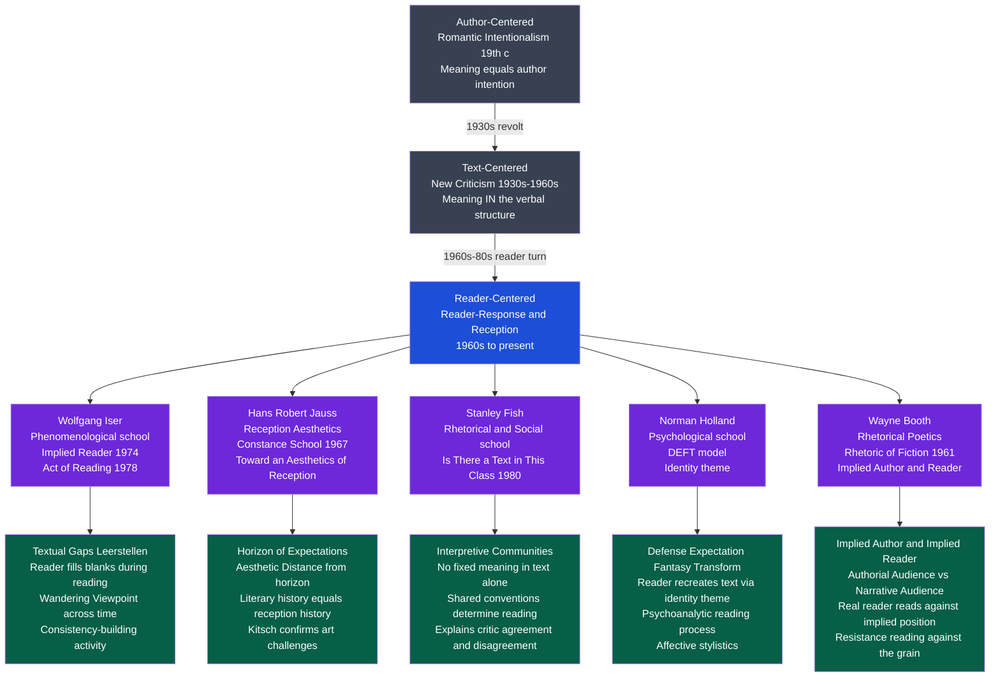

# The Reader and Reception Theory

> [!abstract] TL;DR
> Reader-response and reception theory (1960s–present) completed the Copernican revolution in literary studies: the site of literary meaning is neither the author's intention nor the text's verbal structure alone but the ACT OF READING — a transaction between a text that is structurally incomplete and a reader who fills its gaps from a historically located horizon of expectations; Iser showed how texts guide but cannot complete their own meaning; Jauss showed that a text's meaning is the history of its receptions; Fish showed that meaning is constituted by interpretive communities rather than individual readers or autonomous texts.

---

## Intuition

**Analogy:** A musical score sitting in a library drawer does not produce music. It becomes music only in the act of performance — and two conductors reading the same score will produce recognizably different performances, both legitimate, neither simply "wrong." The score constrains interpretation: it sets the notes, the tempo markings, the key. But it cannot specify everything. The silences between notes, the weight given to a phrase, the emotional arc of a movement — these require the performer's active contribution. Remove the performer entirely and there is no music at all, only ink on paper.

Literature works the same way. A novel sitting unread in a warehouse has no literary meaning — it is ink on paper. Meaning is produced in the encounter between the text's structures and a reader who brings to them a whole world of expectations, memories, cultural formations, and interpretive habits. The text sets the notes; the reader performs the symphony. And different readers — or the same reader at different historical moments — will perform it differently, neither identically nor arbitrarily.

This was the founding intuition of reader-response theory: that the New Critical bracketing of the reader (the Affective Fallacy) had excised from literary study the very mechanism by which literature exists and means.

---

## How It Works

Reader-response theory did not arrive as a single manifesto but as a convergence of independent approaches — phenomenological, historical, psychological, rhetorical — all sharing the conviction that a text-centered account of literary meaning was incomplete because it omitted the act of reading in which meaning is produced.



The diagram shows the three historical phases of literary theory and the five major schools of reader-response criticism, each with its core theoretical contribution.

---

## Key Concepts

### Secondary Level

**The Reader-Centered Turn**

Literary theory has moved through three major locations of meaning in roughly chronological order:

| Era | Dominant Framework | Where Meaning Lives | Key Claim |
|---|---|---|---|
| 19th c. | Romantic Intentionalism | In the author | To understand a poem, recover what the author meant |
| 1930s–60s | New Criticism / Formalism | In the text | The verbal structure is autonomous; meaning is immanent |
| 1960s–present | Reader-Response / Reception | In the reading act | A text unread means nothing; meaning is produced in the encounter |

The triggering insight sounds simple but is genuinely radical: **a text that no one reads does not "mean" anything.** Meaning requires a reading act. If a sealed crate of unpublished manuscripts were destroyed in a fire before anyone read them, no meanings would be lost — only potentials for meaning. This parallels the quantum mechanical observation that the act of observation affects the observed: meaning does not pre-exist reading, it is constituted by it.

This does not collapse into "it means whatever you want." The text constrains interpretation by virtue of its specific words and structures. But the text cannot complete its own meaning — it requires a reader to actualize the possibilities it opens.

**What Reader-Response Theory Was Rejecting**

New Criticism had produced the Affective Fallacy: the claim that reader response is irrelevant to textual meaning, that attending to what the text does to a reader "loses the poem in the reader's psychology." Reader-response theorists accepted the close-reading methodology but reversed the verdict: it is precisely what the text does to a reader — the structured sequence of responses, expectations, surprises, and revisions it produces — that constitutes literary meaning.

I.A. Richards had anticipated this in *Practical Criticism* (1929): he studied how real readers responded to poems, finding radical divergence even among educated readers. For Richards, this was a diagnostic problem to be corrected (readers needed better training). For reader-response theorists, it was theoretical data requiring explanation: what does this divergence tell us about how literary meaning works?

**Wolfgang Iser: Gaps and the Implied Reader (Basic Level)**

Wolfgang Iser's foundational insight: literary texts are **structurally incomplete**. Unlike a mathematical proof that specifies every step, a literary text deliberately leaves things unspecified — gaps, silences, jumps, inconsistencies. It is these gaps (he called them *Leerstellen*, "empty spaces" or "blanks") that engage the reader's imagination.

When a novel skips five years between chapters, or presents a character's behavior without explaining it, or uses a metaphor rather than a literal statement, it invites the reader to fill in the space. The reader does not receive meaning passively; they produce it actively, using the text's cues to do so.

The **implied reader** is not the real reader who happens to be holding the book. It is the position constructed by the text itself — "the role offered to the actual reader by the text." Every text constructs an implicit reading position: it assumes certain knowledge, certain cultural frames, certain emotional responses. Whether the real reader occupies that position or resists it is where meaning becomes complex.

**Hans Robert Jauss: The Horizon of Expectations (Basic Level)**

Hans Robert Jauss asked: why do texts mean differently in different historical periods? The answer he gave at his founding Constance lecture in 1967 was the **horizon of expectations** — the set of aesthetic, literary, and cultural norms that a reader brings to a text from their specific historical moment.

Every reader approaches a text with expectations formed by the literary tradition, genre conventions, and cultural norms of their time and place. The text either **confirms** those expectations (pleasurable, but aesthetically minor — what Jauss called "kitsch") or **challenges** and transforms them (producing the "aesthetic distance" that marks literary art). A text that challenged the horizon of its original audience may conform entirely to ours — which is why a successful work gradually loses its initial shock value.

This means literary history is not the history of production (when texts were written, by whom, under what influences) but the history of reception (how texts were read, understood, and valued at different historical moments). What Homer meant to a fifth-century Athenian, what he meant to a Renaissance humanist, and what he means to a twenty-first century student are three different literary-historical events — equally legitimate objects of study.

---

### Undergraduate Level

**Iser's Phenomenological Theory in Depth**

Iser's theoretical project in *The Act of Reading* (1978) is to describe the phenomenology — the lived experience — of reading literary prose. Three key mechanisms:

**1. The Wandering Viewpoint**

Reading is a temporal act. We move through the text in time, building up a picture of characters, events, and meanings as we go. Iser calls this the "wandering viewpoint": the reader is never simultaneous with the whole text but always positioned at a specific point, reading forward, carrying memory of what has come before and anticipating what is coming.

This temporal dimension is theoretically crucial. As we read, we form provisional "consistencies" — working hypotheses about what the text means, what will happen, what the characters are like. The text then either confirms these or disrupts them, forcing revision. Reading is a continuous process of consistency-building and consistency-breaking.

Iser draws on Husserl's phenomenology here: every act of perception involves "retention" (the just-past that we still hold) and "protention" (the anticipated future). Literary reading exploits both: the text controls what we retain (by what it emphasizes) and what we anticipate (by the genres and conventions it activates), then strategically disappoints our anticipations to produce meaning.

**2. Defamiliarization Operationalized**

The Russian Formalist concept of *ostranenie* (defamiliarization, making strange) described how literary texts disrupt habitual perception. Iser operationalizes this: the text's disruptions of the reader's consistency-building force the reader to revise their frameworks for understanding the fictional world — and, by extension, the real world they inhabit outside it.

This is the mechanism by which literature can expand consciousness: not by transmitting pre-formed meanings into a passive reader, but by forcing the reader to construct and reconstruct their models of human experience. The text is educative not because it contains wisdom but because its structural incompleteness forces the reader to actively think.

**3. The Implied Reader vs. the Real Reader**

The implied reader is a *textual construct*, not a psychological fact. It is the set of responses and competencies that the text presupposes in order for its effects to be possible. To read a Restoration comedy is to occupy a position that assumes familiarity with the social rituals of Restoration court culture, the conventions of the genre, the specific targets of satire. This position is built into the text.

Real readers may or may not occupy this position. A reader who lacks the cultural knowledge the implied position presupposes will "mis-read" not because they are unintelligent but because they are reading from a different position than the one the text constructs. A reader who recognizes the implied position but refuses to occupy it — reading against it — is performing what later critics called "resistance reading."

**Jauss: Reception History and Aesthetic Distance**

Jauss's major theoretical contribution was to show that literary history could be reconstructed on the basis of reception — the horizon of expectations — rather than production. The method involves:

1. **Reconstruct the original horizon of expectations.** Using contemporary documents — reviews, letters, reader diaries, other literary texts of the period — establish what aesthetic norms, genre conventions, and cultural expectations a first audience would have brought to the text.

2. **Measure aesthetic distance.** Compare the text against that reconstructed horizon. A text that conformed entirely to existing conventions (filled every expectation without disrupting any) was "culinary" or kitsch. A text that challenged the horizon — introduced formal innovations, refused generic expectations, presented morally ambiguous characters where conventions demanded clear heroes and villains — had "aesthetic distance."

3. **Trace the history of reception.** Show how the text's horizon of expectations changed across centuries: moments of high esteem, neglect, rediscovery, misreading, anachronistic reading. The "life" of the text in literary history is this succession of receptions, not the fixed meaning deposited by the author.

The practical implication: there is no "correct" reading of a text sub specie aeternitatis, from outside all historical horizons. Every reading is historically located. The goal is not to eliminate historical location but to be conscious of it — to understand what in our current horizon leads us to read Sophocles or Jane Austen the way we do.

**Stanley Fish and Interpretive Communities**

Fish's contribution, developed in a series of essays collected in *Is There a Text in This Class?* (1980), was to identify the locus of meaning as neither the text nor the individual reader but the **interpretive community**.

Fish's starting position was a radicalization of the reader-response critique: texts do not contain meanings that readers then extract, but neither do individual readers produce meanings idiosyncratically. Instead, meaning is produced by interpretive communities — groups of readers who share interpretive strategies, conventions, and assumptions. These shared strategies determine what readers "see" in a text: they constitute the reading rather than merely supplementing it.

**The Chalkboard Example**

Fish describes a classroom exercise that became the most cited demonstration in literary theory. At the end of a linguistics class, he left a list of linguists' names on the chalkboard (Jacobs, Rosenbaum, Levin, Thorne, Hayes, Ohman). The next class — a literary theory seminar — entered and, without explanation, Fish told them: "This is a poem. Consider it."

The students read it as a poem. They found the names rhythmically interesting, noticed potential allegorical resonances, identified structural patterns across the vertical arrangement. The names had not changed. What changed was the interpretive frame brought by the students — their interpretive community (literary critics trained in close reading) — which transformed the same marks into a different kind of object.

The lesson Fish draws: it is not the text that determines interpretation, because the same marks can be radically different texts depending on the interpretive frame applied. But it is also not the individual reader, because the students' interpretations were not idiosyncratic — they applied the same strategies because they shared the same community's conventions.

**The Social Constitution of Reading**

Fish's account explains three puzzling phenomena in literary criticism:

| Phenomenon | Text-Centered Explanation | Fish's Explanation |
|---|---|---|
| Critics within a tradition agree | The text's meaning is objectively there | They share interpretive conventions |
| Critics across traditions disagree | Some are misreading | They belong to different communities |
| The same text means differently over time | The text is reinterpreted | The interpretive community has changed |
| Some readings are recognized as wrong | The text rules them out | The community consensus rules them out |

The implication for literary pedagogy is significant: learning to read literature is learning to join an interpretive community, to acquire its conventions and strategies. Reading is not a natural act but a social and learned practice.

---

### Graduate Level

**Norman Holland and Psychological Reader-Response**

Holland's psychoanalytic approach — developed in *The Dynamics of Literary Response* (1968) and *5 Readers Reading* (1975) — locates the source of readerly variation not in community conventions but in individual psychology. Every reader brings an "identity theme" (a characteristic pattern of defenses, fantasies, and transformations that structures their personality) to the text and uses the text to replicate and confirm that theme.

The **DEFT model** describes the psychological process of reading:
- **Defense**: the text must be perceived as safe — it must be structured to prevent the reader's anxieties from overwhelming the reading experience
- **Expectation**: the text must create and satisfy narrative and aesthetic expectations that align with the reader's psychological needs
- **Fantasy**: the text activates the reader's characteristic fantasy patterns (desire, aggression, loss, reunion) and gives them a form
- **Transformation**: the text transforms raw fantasy into socially acceptable aesthetic pleasure through the formal devices of literature (irony, beauty, narrative closure)

Holland conducted empirical studies: he had five readers respond to a short story in detail and showed that each reader "re-created" the story according to their individual identity theme, attending to different elements, finding different meanings, being moved by different moments. The text was constant; the meanings varied systematically with the reader's psychology.

**The critique of Holland:** Judith Fetterley and other feminist critics argued that Holland's model naturalizes what is in fact an ideological problem. When a woman reads a canonically male-gendered text (Hemingway, Fitzgerald), she is not simply enacting her identity theme: she is being *asked* to identify against herself, to read as a man, to accept masculine subject positions as universal. The identity theme model cannot explain this structural asymmetry — it treats all reading as psychologically equivalent when the cultural politics of gender, race, and class make some readings coerced.

**Wayne Booth: The Rhetoric of Fiction and Implied Positions**

Wayne Booth's *The Rhetoric of Fiction* (1961) — written before reader-response theory was named as such — provided the most technically precise account of the positions embedded in narrative texts. Booth distinguished:

| Position | Definition | Example |
|---|---|---|
| **Real author** | The historical person who wrote the text | Gustave Flaubert |
| **Implied author** | The values, norms, and aesthetic choices constructed by the text — "the author's second self" | The aesthetic intelligence implied by *Madame Bovary*'s ironic structure |
| **Narrator** | The voice that tells the story within the text | The unnamed narrator of *Madame Bovary* |
| **Narratee** | The implied audience within the text | The "dear reader" addressed by Victorian narrators |
| **Implied reader** | The reader position the text constructs | The reader who can appreciate Flaubert's irony without moralizing about Emma |
| **Real reader** | The flesh-and-blood person holding the book | You |

The distinction between real author and implied author was theoretically powerful: it allowed Booth to explain unreliable narrators (narrators whose values diverge from the implied author's) without collapsing back into biographism. We judge the narrator by standards that come from the text itself — from the implied author — not from external knowledge about Flaubert's personal views.

**Peter Rabinowitz: Authorial Audience and Narrative Audience**

Rabinowitz (*Before Reading*, 1987) extended Booth's framework into a theory of reading conventions. He distinguished:

- **Authorial audience**: the hypothetical reader for whom the text was designed — the reader who shares the author's cultural knowledge, generic expectations, and value assumptions; reading *in* the authorial audience means reading with the competences the text presupposes
- **Narrative audience**: the in-text audience that the narrator addresses — the "you" invoked within the story's world; this audience exists within the fictional frame
- **Actual audience**: real readers who may or may not possess the competences the authorial audience requires

The practical implication: to read Austen's *Persuasion* in the authorial audience requires knowledge of Regency social codes, the class meanings of military ranks, the conventions of the marriage plot, and the generic expectations of the novel of manners. A reader without this knowledge reads a different book — not wrongly, but differently, occupying a different audience position. Literary education, on this account, is learning to occupy the authorial audience position for increasingly demanding texts.

**Ideological Interpellation and Resistance Reading**

The political critique of reading as a passive adoption of textually constructed positions was articulated through Louis Althusser's concept of **interpellation**: ideology "hails" subjects into pre-formed positions. A 19th-century English novel interpellates its readers as white, Protestant, middle-class, heterosexual, and male — not because all its readers were, but because these were the unmarked defaults, the "universal" reading position the text constructed as natural.

Feminist critics (Judith Fetterley in *The Resisting Reader*, 1978; Sandra Gilbert and Susan Gubar) argued that women reading canonical male texts are interpellated into positions that require them to identify against their own interests — to see the world as male-centered, to accept female characters' marginalization as natural. The appropriate critical response is **resistance reading**: reading against the grain, attending to what the text suppresses or marginalizes, refusing the implied reading position while analyzing what that position asks you to accept.

Postcolonial critics (Chinua Achebe's famous critique of *Heart of Darkness*, Homi Bhabha's theory of colonial mimicry) extended this: readers from colonized or formerly colonized cultures find Western canonical texts encoding colonial assumptions as universal human truths. Resistance reading for postcolonial critics means recovering what the colonial horizon of expectations erased and reading the canonical text against its own assumptions.

**The Relativism Problem and Its Resolution**

The most persistent objection to reader-response theory — pressed by E.D. Hirsch, M.H. Abrams, and Gerald Graff — is that it collapses into relativism: if meaning is produced by readers or communities rather than contained in texts, then any reading is as valid as any other.

Fish's answer: the objection misunderstands how interpretive communities work. Within a community, constraints on interpretation are real and powerful — they rule out bad readings just as effectively as the text-centered model claimed to do. The difference is that the authority for those constraints is located in community conventions rather than in the text's verbal structure. There is no interpretation-free standpoint from which to evaluate all communities' readings — but that does not mean that within any community, anything goes.

Iser's answer: the text constrains interpretation by its structures. The gaps are real gaps in a specific structure, not gaps in nothing. A reader cannot "fill in" a blank in just any way — the surrounding textual material conditions what is a plausible completion. The text is like a set of constraints that rules out many completions without uniquely determining one.

Jauss's answer: the historical specificity of the horizon of expectations provides both the condition of possibility for reading and a standard for evaluating the quality of a reading. A reading that ignores the historical horizon and projects current assumptions anachronistically onto an early modern text can be identified and corrected — not because there is a timeless correct reading, but because we can reconstruct the historical horizon against which the text was designed to work.

---

## Python Demo

```python
# Reader-Response Theory: Interpretive Community Simulation
#
# Models 100 readers as agents, each with 3 interpretive frame weights
# (romantic, political, formalist) drawn from a Dirichlet distribution
# representing 3 latent reading communities.
# Simulates reading a 3-scene story where each scene has a slight
# affordance bias toward one frame.
# Applies K-means clustering (numpy only) to recover interpretive communities.
#
# Computes:
#   (1) Inter-reader agreement per scene
#   (2) Interpretive community structure via K-means
#
# Visualizes:
#   Panel 1: Scatter of readers (Romantic vs Political frame), colored by cluster
#   Panel 2: Grouped bar chart of dominant interpretation per scene
#
# Uses numpy and matplotlib only.

import numpy as np
import matplotlib
matplotlib.use("Agg")
import matplotlib.pyplot as plt

RNG = np.random.default_rng(42)

N_READERS  = 100
N_FRAMES   = 3
N_SCENES   = 3
N_CLUSTERS = 3
FRAMES     = ["Romantic", "Political", "Formalist"]
SCENES     = ["Scene 1: The Garden Meeting",
               "Scene 2: The Factory Strike",
               "Scene 3: The Dream Sequence"]

# ── Generate reader frame profiles ───────────────────────────────────────────
# Three latent communities; each reader's frame weights are drawn from a
# Dirichlet distribution concentrated around the community's dominant frame.

alpha_sets = [
    np.array([6.0, 1.5, 1.5]),   # romantic-dominant community
    np.array([1.5, 6.0, 1.5]),   # political-dominant community
    np.array([1.5, 1.5, 6.0]),   # formalist-dominant community
]
community_sizes = [34, 33, 33]

profiles         = np.zeros((N_READERS, N_FRAMES))
true_communities = np.zeros(N_READERS, dtype=int)

idx = 0
for c, (alpha, size) in enumerate(zip(alpha_sets, community_sizes)):
    profiles[idx:idx + size] = RNG.dirichlet(alpha, size=size)
    true_communities[idx:idx + size] = c
    idx += size

# Shuffle readers so community membership is not trivially ordered
perm = RNG.permutation(N_READERS)
profiles         = profiles[perm]
true_communities = true_communities[perm]

# ── Simulate reading: each reader interprets each scene ───────────────────────
# Scene affordances add a small bias toward one frame per scene.
# Romantic frame favored in Scene 1, political in Scene 2, formalist in Scene 3.
scene_affordances = np.array([
    [ 0.06, -0.04,  0.00],   # Scene 1: slight romantic lean
    [-0.04,  0.10, -0.06],   # Scene 2: stronger political lean
    [ 0.01, -0.05,  0.04],   # Scene 3: slight formalist lean
])

noise_std      = 0.11
interpretations = np.zeros((N_READERS, N_SCENES), dtype=int)
for r in range(N_READERS):
    for s in range(N_SCENES):
        noisy = (profiles[r]
                 + scene_affordances[s]
                 + RNG.normal(0.0, noise_std, N_FRAMES))
        interpretations[r, s] = np.argmax(noisy)

# ── Inter-reader agreement per scene ─────────────────────────────────────────
print("=== Interpretive Community Simulation (N=100 readers) ===\n")
print("Inter-reader agreement per scene:\n")
for s in range(N_SCENES):
    counts   = np.bincount(interpretations[:, s], minlength=N_FRAMES)
    pct      = counts.max() / N_READERS * 100
    dominant = FRAMES[counts.argmax()]
    print(f"  {SCENES[s]}")
    for f in range(N_FRAMES):
        bar = "=" * int(counts[f] / 2)
        print(f"    {FRAMES[f]:12s}: {counts[f]:3d} readers  {bar}")
    print(f"    >> {pct:.0f}% agree on dominant frame: {dominant}\n")

# ── K-means clustering (numpy only) ──────────────────────────────────────────
def kmeans_np(X, k, max_iter=300, seed=7):
    rng        = np.random.default_rng(seed)
    centers    = X[rng.choice(len(X), k, replace=False)].copy()
    labels     = np.zeros(len(X), dtype=int)
    for iteration in range(max_iter):
        # Assignment: squared Euclidean distance
        dists      = np.sum((X[:, None, :] - centers[None, :, :]) ** 2, axis=2)
        new_labels = np.argmin(dists, axis=1)
        if iteration > 0 and np.all(new_labels == labels):
            break
        labels = new_labels
        # Update: recompute centroids
        for c in range(k):
            if (labels == c).any():
                centers[c] = X[labels == c].mean(axis=0)
    return labels, centers

cluster_labels, cluster_centers = kmeans_np(profiles, N_CLUSTERS)

# ── Cluster summary ───────────────────────────────────────────────────────────
print("K-means Interpretive Communities (k=3):\n")
for c in range(N_CLUSTERS):
    mask     = cluster_labels == c
    dominant = FRAMES[np.argmax(cluster_centers[c])]
    cc       = cluster_centers[c]
    print(f"  Community {c + 1}  ({mask.sum()} readers)  --  dominant frame: {dominant}")
    print(f"    Centroid: Romantic={cc[0]:.2f}  Political={cc[1]:.2f}  Formalist={cc[2]:.2f}")

# Adjusted Rand Index approximation: how well do clusters recover true communities?
# (manual implementation using contingency table)
contingency = np.zeros((N_CLUSTERS, N_CLUSTERS), dtype=int)
for r in range(N_READERS):
    contingency[true_communities[r], cluster_labels[r]] += 1
print(f"\nContingency table (true community rows vs cluster columns):")
print(f"  {'':12s}  " + "  ".join(f"Cluster {c+1}" for c in range(N_CLUSTERS)))
for row in range(N_CLUSTERS):
    cells = "  ".join(f"{contingency[row, c]:9d}" for c in range(N_CLUSTERS))
    print(f"  Community {row+1}:  {cells}")

# ── Visualization ──────────────────────────────────────────────────────────────
COMMUNITY_COLORS = ["#7c3aed", "#059669", "#dc2626"]
FRAME_COLORS     = ["#2563eb", "#e11d48", "#f59e0b"]

fig, axes = plt.subplots(1, 2, figsize=(14, 6))
fig.suptitle(
    "Reader-Response Theory: Interpretive Community Simulation  (N=100 readers, k=3 clusters)\n"
    "Left: Reader profiles by K-means interpretive community  (Romantic vs Political frame)  |  "
    "Right: Interpretation distribution per story scene",
    fontsize=9,
)

# Panel 1: scatter — Romantic (x) vs Political (y) frame weights
ax1 = axes[0]
for c in range(N_CLUSTERS):
    mask = cluster_labels == c
    dom  = FRAMES[np.argmax(cluster_centers[c])]
    ax1.scatter(
        profiles[mask, 0], profiles[mask, 1],
        c=COMMUNITY_COLORS[c], s=45, alpha=0.72,
        label=f"Community {c + 1}: {dom}-leaning  (n={mask.sum()})",
    )
# Cluster centroids as stars
for c in range(N_CLUSTERS):
    ax1.scatter(
        cluster_centers[c, 0], cluster_centers[c, 1],
        c=COMMUNITY_COLORS[c], s=240, marker="*",
        edgecolors="black", linewidths=0.8, zorder=5,
    )
ax1.text(0.02, 0.02,
         "Formalist-dominant readers\n(low Romantic and Political scores)",
         fontsize=7, color="#374151", alpha=0.85)
ax1.set_xlabel("Romantic Frame Weight", fontsize=10)
ax1.set_ylabel("Political Frame Weight", fontsize=10)
ax1.set_title("Reader Profiles by Interpretive Community\n(Stars = K-means centroids)", fontsize=9)
ax1.legend(fontsize=7.5, loc="upper right")
ax1.set_xlim(-0.03, 1.03)
ax1.set_ylim(-0.03, 1.03)
ax1.grid(alpha=0.2)

# Panel 2: grouped bar chart — interpretation distribution per scene
ax2    = axes[1]
x      = np.arange(N_SCENES)
bw     = 0.26
offset = (np.arange(N_FRAMES) - 1) * bw
for f in range(N_FRAMES):
    counts = np.array([(interpretations[:, s] == f).sum() for s in range(N_SCENES)])
    ax2.bar(
        x + offset[f], counts, bw,
        label=f"{FRAMES[f]} frame",
        color=FRAME_COLORS[f], alpha=0.85, edgecolor="white",
    )
ax2.set_xlabel("Story Scene", fontsize=10)
ax2.set_ylabel("Number of Readers", fontsize=10)
ax2.set_title(
    "Interpretation Distribution per Scene\n"
    "(Fish: shared conventions determine what readers 'see')",
    fontsize=9,
)
ax2.set_xticks(x)
ax2.set_xticklabels([f"Scene {i + 1}" for i in range(N_SCENES)], fontsize=9)
ax2.legend(fontsize=8)
ax2.set_ylim(0, 60)
ax2.grid(axis="y", alpha=0.2)

plt.tight_layout()
plt.savefig("reader_response_simulation.png", dpi=140, bbox_inches="tight")
print("\nFigure saved: reader_response_simulation.png")
```

---

## Real-World Applications

> **Example 1 — Book Clubs as Interpretive Communities.** Fish's interpretive communities are not only academic: a book club is a real-world interpretive community with shared conventions about what kinds of responses are appropriate (psychological identification with characters, discussion of "life lessons") that are different from an academic seminar's conventions (formal analysis, theoretical frameworks). The same novel — say, *The God of Small Things* by Arundhati Roy — will yield systematically different interpretations from the two groups, not because one is reading correctly and one wrongly, but because they are applying different community-specific interpretive strategies. The club member who says "I just didn't connect with the characters" and the seminar student who says "Roy deploys heteroglossia to resist the master narrative" are both reading legitimately — within their respective communities.

> **Example 2 — Film Criticism and the Horizon of Expectations.** Jordan Peele's *Get Out* (2017) illustrates Jauss's horizon of expectations in motion. For most white liberal reviewers at the 2017 Sundance premiere, the film appeared to be a thriller with a racial allegory. For Black American audiences who brought a different horizon of expectations — one formed by actual historical experiences of medical experimentation, cultural appropriation, and liberal racism — the film's horror read not as allegory but as intensified naturalism. The aesthetic distance was different: the film confirmed fears already present in Black cultural consciousness while defamiliarizing them for white liberal audiences. The "same" film had different literary-aesthetic status depending on the horizon from which it was received.

> **Example 3 — Legal Interpretation and the Authorial Audience.** Rabinowitz's authorial audience concept maps directly onto legal interpretation debates. Textualist judges (Scalia, Thomas) read statutes in the authorial audience the text constructs — the hypothetical reader who knows the ordinary public meaning of the words at the time of enactment. Purposivist judges read with attention to the implied intent behind the text, approximating what Booth would call the implied author's design. Dynamist judges (living constitutionalists) read from the present reader's horizon of expectations rather than the ratification-era horizon. These are not random interpretive choices — they are commitments to different audience positions, each with principled theoretical justification.

> **Example 4 — Algorithmic Reading and Computed Communities.** Netflix and Spotify recommendation systems operationalize the interpretive community concept without knowing it: they identify clusters of users with similar response patterns (viewing/listening histories) and use those clusters to generate recommendations. These are empirically discovered interpretive communities — groups of people who "read" (watch, listen) similarly. The practical problem is that the clusters encode existing cultural asymmetries: a user whose taste was formed in one cultural tradition will be clustered with similar users and never recommended work from outside that tradition. The algorithm creates echo chambers of taste that replicate existing community boundaries rather than challenging the horizon of expectations — the opposite of what Jauss identified as literarily valuable.

> **Example 5 — Resistance Reading in Publishing and Education.** The widespread adoption of "diverse voices" curricula in schools is a direct application of resistance reading theory: it recognizes that a curriculum built entirely on texts that interpellate students into white, male, Western subject positions asks non-white, female, and non-Western students to read against themselves. Including texts that construct different implied reader positions — whose authorial audience is Black American, or South Asian, or indigenous — does not replace close reading; it changes the default reading position from which close reading begins. This is Fetterley's *Resisting Reader* argument institutionalized.

---

## Common Pitfalls

- **Equating "the implied reader" with "the ideal reader" or "the author's intended reader"** — Iser's implied reader is a structural feature of the text: the role the text offers, not the reader the author wished for. A text can construct an implied reader whose values the author personally disagreed with (unreliable narrator scenarios), and a real author's intentions may diverge substantially from the implied reader position the text actually constructs.

- **Thinking Fish's interpretive communities = "anything goes"** — Fish never claimed that all readings are equally valid. Within a community, conventions rule out bad readings just as firmly as text-centered models claimed to. His point is not that there are no constraints but that the constraints are located in community conventions rather than in the text's autonomous verbal structure. The difference matters theoretically; practically, the constraints are real.

- **Applying Jauss's horizon concept without doing the historical work** — The horizon of expectations is not a license to speculate about what "people at the time" thought. It requires detailed reconstruction from primary sources: contemporary reviews, reader diaries, competing texts in the same genre, cultural documents that establish the norms against which the text worked. Invoking the horizon without this reconstruction is impressionism dressed as method.

- **Confusing the implied author with the real author** — Booth's distinction has a practical payoff: a morally repugnant implied author (the values embedded in a text) does not require us to conclude anything about the real author's personal ethics — and vice versa. A real author can construct an implied author whose values they wish to critique. Collapsing the distinction reintroduces the Intentional Fallacy that Booth's framework was designed to avoid.

- **Treating Holland's identity theme as a fixed essence** — Holland's "identity theme" can sound like a claim that each reader has a fixed psychological core that mechanically determines their reading. Holland's actual position is more dynamic: the identity theme is a characteristic *style* of engaging with texts, not a rigid algorithm. The same reader will respond differently to different texts, and the identity theme itself evolves. The psychoanalytic framework is meant to explain systematic patterns of variation, not to reduce reading to personality determinism.

- **Using "resistance reading" as a synonym for disagreeing with a text** — Resistance reading (Fetterley, postcolonial critics) is a specific theoretical practice: it involves identifying the implied reader position a text constructs, recognizing the ideological assumptions embedded in that position, and consciously reading from a position that exposes rather than accepts those assumptions. Simply disliking a novel or disagreeing with its protagonist's choices is not resistance reading — it is ordinary critical response. Resistance reading is a method for exposing the text's ideological structure, not a label for personal dissatisfaction.

- **Assuming reader-response theory makes close reading irrelevant** — All the major reader-response theorists were trained close readers and used close reading as their primary analytical tool. Iser's textual gaps are identified by close reading the specific structures that leave things unspecified. Jauss reconstructs the original horizon through close reading of contemporary documents. Fish's examples are always close readings of specific textual effects. Reader-response theory does not replace close reading — it embeds it in a theoretical account of what reading is and does.

---

## Related Concepts

- [[New_Criticism_and_Close_Reading]] — New Criticism's Affective Fallacy (excising reader response from legitimate critical inquiry) is the direct target of reader-response theory; Iser, Fish, and Holland are all explicitly reversing the Wimsatt-Beardsley verdict; at the same time, all major reader-response theorists retained close reading as their primary analytical method

- [[Poststructuralism_and_Deconstruction]] — Barthes's "Death of the Author" (1967) is the semiological formulation of the same move reader-response theory makes from a phenomenological direction: if the author is dead, the reader must produce the meaning; Derrida's *différance* and Fish's interpretive communities both deny that meaning is fully present in the text, but through different routes (textual undecidability vs. community conventions)

- [[Feminist_and_Queer_Literary_Theory]] — Fetterley's resistance reading, Gilbert and Gubar's account of women reading within male-constructed implied reader positions, and Adrienne Rich's "re-vision" (reading women's texts against the grain of androcentric canons) are the feminist applications of reader-response concepts; the implied reader analysis is the mechanism that explains the gendered politics of canonicity

- [[Structuralism_and_Narratology]] — Narratology's implied narrator and narratee (Genette) are the text-structural companions to Booth's implied author and implied reader; Iser's textual gap theory builds on narratological models of the text as a set of instructions for constructing a storyworld; reception theory required narratology's precision about what the text specifies before it could theorize what it leaves unspecified

- [[Literary_Theory_Overview]] — Reader-response theory represents the third major phase of 20th-century literary theory (after the biographical-historical and New Critical phases); it remains in active dialogue with the current dominant approaches (postcolonialism, ecocriticism, affect theory) rather than being a superseded historical position

- [[Pragmatics_and_Speech_Acts]] — Austin's speech act theory (illocutionary force — what utterances *do* rather than merely *say*) and Grice's conversational implicature (the pragmatic meanings that exceed literal content) are linguistic parallels to reader-response theory's insight that meaning exceeds the words on the page; Fish's interpretive community concept maps onto Grice's notion that conversational maxims are community-relative

- [[Discourse_Analysis]] — Reader-response theory and discourse analysis both reject the text-as-autonomous-object model; discourse analysis provides the broader sociolinguistic framework — texts embedded in institutional contexts, power relations, and social practices — within which the interpretive community concept can be situated and theorized more precisely

- [[Language_Identity_and_Power]] — Foucault's discourse theory (knowledge-power formations that constitute subjects) and Althusser's interpellation concept (ideology hails subjects into pre-formed positions) provide the political-theoretical underpinning for resistance reading; the analysis of how texts construct their implied readers as bearers of specific class, race, gender, and national identities is the point where literary reception theory and sociolinguistics converge

- [[Memory_Systems]] — Iser's wandering viewpoint depends on the reader's working memory (holding what has been read) and long-term memory (cultural and literary knowledge forming the horizon of expectations); cognitive poetics has operationalized reception theory by studying what readers actually remember, what narrative structures are cognitively salient, and how genre schemas function as expectations in the reading process

- [[Attitudes_and_Persuasion]] — The horizon of expectations is structurally similar to attitude priming: the cultural norms and aesthetic values a reader holds going into a text constitute a set of attitudes toward genre, character types, and narrative outcomes that condition response; Jauss's "aesthetic distance" — the gap between what a text does and what readers expected — maps onto the social psychology of attitude change through discrepancy

---

## Review Questions

### Secondary

1. Wolfgang Iser says that texts have "gaps" that readers must fill. Find a specific moment in a story or novel you know where the text deliberately leaves something unspecified (a character's motivation, the outcome of an event, the meaning of a symbol). What did you fill in? Would another reader fill it in differently? What in the text guided your choice?

2. Hans Robert Jauss claims that literary art "challenges" the reader's horizon of expectations while "kitsch" merely confirms it. Give one example of each from your reading. What specific expectations did the literary work challenge, and how did that challenge produce a richer reading experience than simply confirming what you expected?

### Undergraduate

3. Stanley Fish argues that meaning is produced by interpretive communities, not by individual readers or by autonomous texts. Test this claim: take a short poem or passage and ask two people with very different cultural backgrounds (or academic training) to describe what it means. In what ways does their divergence support Fish's argument? In what ways, if any, does it support the text-centered model instead?

4. Wayne Booth distinguishes the real author, the implied author, and the narrator. Why does this matter? Choose a novel with a first-person narrator (like *Lolita*, *Gone Girl*, or *The Remains of the Day*) and show how the implied author's values differ from the narrator's values. What textual evidence allows you to identify the implied author's perspective independently of what the narrator says?

5. Jauss reconstructs the "horizon of expectations" of a text's original audience. Choose a literary work whose reputation has changed significantly over time (a Dickens novel, a Shakespeare play, *Uncle Tom's Cabin*, or a more recent example). What elements of the original horizon of expectations were different from ours? How does that difference explain why the text was received differently in its own time than it is now?

### Graduate

6. Fish's interpretive community concept appears to resolve the relativism problem by locating authority in community consensus rather than in the text. But is this genuinely a solution or a displacement? If community consensus is the ultimate authority, what prevents a community from ratifying any interpretation whatever — including manifestly absurd or politically dangerous ones? Compare Fish's answer to this objection with Iser's more text-constrained account and evaluate which better preserves the possibility of critical judgment.

7. Fetterley's "resisting reader" and Iser's "implied reader" both describe a reader who is in tension with the position the text constructs. What is the difference between Iser's account of how a real reader diverges from the implied reader position (his phenomenological account) and Fetterley's account of how women are structurally positioned against themselves by male-centered implied reader positions (her political account)? Can these two frameworks be integrated, or do they rest on incompatible premises about what "the text" is and what "reading" does?

8. Jauss's reception aesthetics implies that a text's meaning is not fixed but varies systematically with the historical horizon of its readers. This seems to require that we abandon the goal of identifying what a text "really" means and replace it with the goal of tracing the history of its receptions. But does this historical relativism undermine the possibility of literary evaluation? Can Jauss say that one reception of a text is better than another without appealing to a standard that transcends the horizon of expectations — and if not, what becomes of the claim that literary art is distinguished by challenging rather than confirming the horizon?

---

## Sources

- [Iser, W. (1974). *The Implied Reader: Patterns of Communication in Prose Fiction from Bunyan to Beckett*. Johns Hopkins University Press.](https://www.goodreads.com/book/show/390390.The_Implied_Reader)
- [Iser, W. (1978). *The Act of Reading: A Theory of Aesthetic Response*. Johns Hopkins University Press.](https://www.goodreads.com/book/show/390322.The_Act_of_Reading)
- [Jauss, H.R. (1982). *Toward an Aesthetics of Reception*. Trans. Timothy Bahti. University of Minnesota Press.](https://www.goodreads.com/book/show/390400.Toward_an_Aesthetics_of_Reception)
- [Fish, S. (1980). *Is There a Text in This Class? The Authority of Interpretive Communities*. Harvard University Press.](https://www.goodreads.com/book/show/390317.Is_There_a_Text_in_This_Class_)
- [Booth, W.C. (1961). *The Rhetoric of Fiction*. University of Chicago Press.](https://www.goodreads.com/book/show/390350.The_Rhetoric_of_Fiction)
- [Holland, N.N. (1975). *5 Readers Reading*. Yale University Press.](https://www.goodreads.com/book/show/2064820.5_Readers_Reading)
- [Fetterley, J. (1978). *The Resisting Reader: A Feminist Approach to American Fiction*. Indiana University Press.](https://www.goodreads.com/book/show/390410.The_Resisting_Reader)
- [Rabinowitz, P.J. (1987). *Before Reading: Narrative Conventions and the Politics of Interpretation*. Cornell University Press.](https://www.goodreads.com/book/show/390420.Before_Reading)
- [Richards, I.A. (1929). *Practical Criticism: A Study of Literary Judgment*. Kegan Paul.](https://www.goodreads.com/book/show/390278.Practical_Criticism)
- [Suleiman, S.R. & Crosman, I. (Eds.) (1980). *The Reader in the Text: Essays on Audience and Interpretation*. Princeton University Press.](https://press.princeton.edu/books/paperback/9780691013978/the-reader-in-the-text)
- [Tompkins, J.P. (Ed.) (1980). *Reader-Response Criticism: From Formalism to Post-Structuralism*. Johns Hopkins University Press.](https://www.goodreads.com/book/show/390430.Reader_Response_Criticism)
- [Barry, P. (2009). *Beginning Theory: An Introduction to Literary and Cultural Theory* (3rd ed.). Manchester University Press.](https://www.goodreads.com/book/show/390341.Beginning_Theory)
- [Reader-Response Criticism — Wikipedia](https://en.wikipedia.org/wiki/Reader-response_criticism)
- [Reception Theory — Wikipedia](https://en.wikipedia.org/wiki/Reception_theory)
- [Horizon of Expectations — Wikipedia](https://en.wikipedia.org/wiki/Horizon_of_expectations)

---

#LiteratureRhetoric #ReadingInterpretation #ReceptionTheory #ReaderResponse #ImpliedReader #Iser #Jauss #Fish
