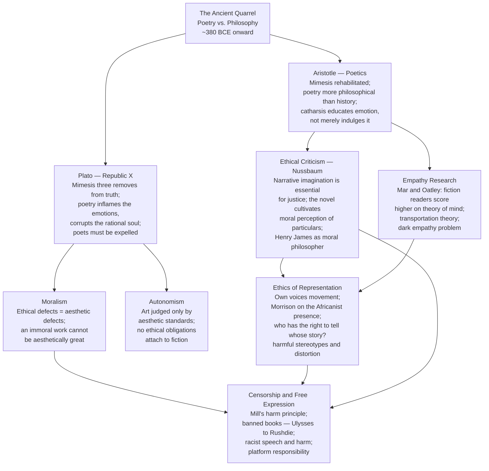

# Literature and Ethics

> [!abstract] TL;DR
> The question of whether fiction can make us morally better — or worse — goes back to Plato's expulsion of the poets and Aristotle's rehabilitation of mimesis; two thousand years later, Martha Nussbaum's ethical criticism, psychological research on fiction and empathy, and fierce debates over representation and censorship show that the ancient quarrel is still very much alive, and that its stakes — for justice, democracy, and human development — have never been higher.

---

## Intuition

**Analogy:** You sit down to watch a documentary about a community you have never thought about — fisherfolk in a village you cannot place on a map, living through a disaster you did not know had happened. Ninety minutes later you are devastated. You care deeply about people you have never met and will never meet. Something in you has been enlarged: your "moral circle" — the set of beings whose suffering registers as mattering — has quietly expanded. Now ask: does the same thing happen when you read a novel? And if it does, can a novel also shrink the moral circle? Can *Lolita* make you sympathize with a pedophile? Can antisemitic novels make hatred feel reasonable? Is literature morally neutral — just a sophisticated entertainment technology — or is it one of the primary instruments through which moral perception is formed, refined, and distorted?

These questions define the field of literature and ethics. They are not new. Plato asked them in 380 BCE and concluded the answer was dangerous enough to warrant expelling the poets from his ideal city. Aristotle disagreed, and that disagreement has never been fully resolved.

---

## How It Works

The debate over literature and ethics organizes itself around two originating positions — Platonic condemnation and Aristotelian rehabilitation — from which descend five major contemporary orientations, all of which remain active in literary criticism, psychology, legal theory, and public debate.



---

## Key Concepts

### Secondary Level

#### The Ancient Quarrel: Plato and the Poets

The phrase "ancient quarrel between philosophy and poetry" comes from Plato himself (*Republic*, Book X, 607b), and it is the oldest framework for thinking about literature's moral status. In *Republic* Book X, Socrates offers three interlocking arguments for excluding poets from the ideal city:

1. **The ontological argument**: The Forms are the only genuine reality; the physical world is their imperfect copy; art copies the imperfect world. The poet, imitating appearances, is three removes from truth — an imitator of imitators.

2. **The epistemological argument**: The craftsman who makes a bed understands what a bed is; the painter who depicts one does not. The poet "knows nothing of worth" about the things they imitate. Homer could not have actually taught anyone generalship or medicine.

3. **The psychological argument**: Poetry works by engaging the emotional part of the soul — the part that cries, lusts, fears — at the expense of the rational part that knows truth and exercises justice. When we watch tragedy and weep, we are feeding and strengthening precisely the element of the psyche that justice requires us to keep tightly controlled. Poetry corrupts the psychic hierarchy that makes a good person (and a good city) possible.

Plato's condemnation is not anti-intellectual philistinism — it is the conclusion of a systematic theory of mind and politics. He takes poetry seriously enough to fear it.

**Aristotle's rehabilitation** in the *Poetics* (~335 BCE) is a systematic point-by-point response:

- Against (1): poetry imitates not the accidental individual but the universal — the kind of action a person of a given character would perform. This is a cognitive achievement, not a degraded copy. "Poetry is more philosophical than history because it deals with universals, history with particulars."
- Against (2): the poet does not need craftsman's knowledge because they are doing something different — making recognizable patterns, not functional objects.
- Against (3): pity and fear are appropriate responses to real features of human life. Cultivating them through controlled aesthetic experience is not emotional incontinence but emotional education — catharsis refines our capacity to respond proportionately to what is genuinely pitiable or fearful.

The quarrel is still alive. No consensus has ever been reached because the underlying disagreement is not merely literary — it is about the nature of the emotions, the relationship between reason and feeling, and whether the imagination can be a vehicle of knowledge or only a vehicle of pleasant illusion.

#### What Is Ethical Criticism?

**Ethical criticism** is the family of approaches holding that literary works can be evaluated — at least in part — by their moral vision, their effect on readers' moral perception, or their relationship to the moral world. It is opposed to two alternatives:

- **Autonomism**: aesthetic and ethical judgments are completely independent domains; calling a novel "morally objectionable" is simply not a literary judgment (Oscar Wilde: "There is no such thing as a moral or an immoral book. Books are well written, or badly written.")
- **Aestheticism**: "art for art's sake" — the work's only obligation is to its own formal integrity.

The key claim of ethical criticism is not that immoral books should be banned — that is censorship, not criticism. It is that a book's moral vision is part of what we evaluate when we assess it as literature. A novel that presents a morally dishonest picture of human experience — that glamorizes cruelty, sentimentalizes shallow feeling, or distorts the moral consequences of actions — has a genuine artistic defect, not merely an ethical failing separate from its aesthetic quality.

---

### Undergraduate Level

#### Nussbaum's Ethical Literary Criticism

Martha Nussbaum's **Love's Knowledge: Essays on Philosophy and Literature** (1990) and **Poetic Justice: The Literary Imagination and Public Life** (1995) constitute the most influential contemporary defense of ethical literary criticism. Her argument operates on two levels:

**Level 1 — The philosophical claim**: Aristotle distinguished *episteme* (scientific knowledge of universals, expressible in general principles) from *phronesis* (practical wisdom — the capacity to perceive the morally salient features of a particular situation and respond appropriately). Practical wisdom cannot be reduced to the application of universal principles: it requires seeing what is morally relevant in *this* situation, with *these* people, at *this* time. Nussbaum argues that literary fiction — especially the realist novel in the tradition of Henry James — is precisely the cognitive form that develops phronesis. It places us in thickly described particular situations, forces us to attend to the complexity of human motivation, and requires judgments that cannot be deduced from a principle.

**Level 2 — The political claim**: In *Poetic Justice*, Nussbaum extends this to public institutions. The "literary imagination" — the capacity for narrative empathy, for imaginatively inhabiting another's situation — is an essential component of the intelligent citizen and of just public institutions. Judges who have read widely in realistic fiction are better equipped for their task than those who have not, because they can perceive the full human significance of the individual case rather than reducing plaintiffs to abstractions in a policy calculation. She reads Dickens's *Hard Times* as a systematic critique of utilitarian social calculation that cannot perceive the value of individual lives.

**Objections and responses:**

| Objection | Formulation | Response |
|-----------|-------------|----------|
| **Instrumentalization** | Using literature as a vehicle for moral development treats it as a means to an extra-literary end, violating the work's integrity | The moral and aesthetic dimensions of great fiction are inseparable; Jamesian close attention to character is simultaneously ethical and aesthetic |
| **Conservative bias** | If literature cultivates our existing moral sentiments, it cannot challenge them; empathy-building reinforces dominant moral frameworks rather than disrupting them | The literary imagination can estrange us from comfortable assumptions, not merely validate them; the best fiction disturbs as well as confirms |

#### Empathy and the Social Function of Fiction

The claim that fiction builds empathy is not only a philosophical position — it has attracted significant empirical research since the 2000s.

**Mar and Oatley (2008)** conducted studies showing that habitual fiction readers scored higher on measures of **theory of mind** (the capacity to attribute mental states to others) and social cognition than non-fiction readers matched for intelligence, education, and personality. Crucially, the correlation held even after controlling for individual differences: it was not simply that more empathetic people chose to read more fiction. The proposed mechanism: fiction is a **simulation of social worlds**, allowing readers to practice social cognition in a low-stakes environment that is nevertheless emotionally complex and demanding.

**Transportation theory** (Green and Brock, 2000) proposes that the degree to which a reader is "transported" into the narrative world — absorbed, emotionally engaged, experiencing cognitive and emotional responses as if the events were real — predicts the degree to which their attitudes shift toward the values represented in the story. High transportation diminishes critical counter-arguing (the reader does not mentally challenge the story's claims while immersed) and increases identification with characters. The practical implication: the more compelling the fiction, the more morally influential it is — for better or worse.

**The dark empathy problem**: If fiction builds empathy by immersing readers in characters' inner lives, then reading Humbert Humbert's elaborate, eloquent self-justification in *Lolita* — one of the most rhetorically sophisticated first-person narrators in 20th-century fiction — should build empathy for a pedophile. Does it? And if the answer is "no, because Nabokov's craft establishes a clear ironic distance between narrator and implied author," then the empathy-building effect depends not just on narrative transportation but on the specific craft skills used to guide readerly identification. The dark empathy problem suggests that fiction's moral effects are not automatic and uniformly positive but depend critically on how the moral framing is managed — a point with direct implications for thinking about harmful representation.

#### The Ethics of Representation

A distinct strand of literary ethics concerns the moral relationship between authors and the communities they represent.

**Toni Morrison's *Playing in the Dark: Whiteness and the Literary Imagination* (1992)** is the foundational text. Morrison argued that the "Africanist presence" — the presence of Black people as characters, implied audience, and social background — in canonical American literature has been systematically distorted. Whiteness in American fiction is not a neutral background but is constructed in relation to a Black presence that carries the weight of white anxieties, desires, and projections. The freedom, innocence, and expansiveness celebrated in Melville, Poe, Hemingway, and Cather are defined against an implied enslaved or marginalized Black figure. Morrison's argument is not merely political: she is making a claim about craft — that the canonical American literary imagination has been shaped by a structural blind spot, and that reading it requires seeing what it systematically refuses to show.

**The Lionel Shriver controversy (2016)**: At the Brisbane Writers Festival, novelist Lionel Shriver delivered a keynote defending her right as a white author to write non-white characters and mocking the concept of cultural appropriation. Yassmin Abdel-Magied, a Muslim Australian writer, walked out in protest and published a response arguing that Shriver's framing ignored the power differential: white authors writing non-white characters had historically perpetuated the stereotypes Morrison diagnosed, and the "freedom to write anything" did not come without responsibility for the representational consequences.

The **"own voices" movement** (Corinne Duyvis, 2015) advocated for publishing support for stories by authors from the communities they represent — on the grounds that lived experience produces a different quality of representational accuracy and moral attention. The debate forces ethical criticism to engage directly: Is there a moral responsibility that attaches to representational acts? Can it be satisfied by craft alone, without lived experience?

**The history of harmful representation**: The ethical stakes are not abstract. Nineteenth-century American literature is saturated with racial caricature that served to normalize the social order; "yellow peril" fiction shaped immigration policy; the "magical negro" figure in 20th-century fiction subordinated Black characters to the moral development of white protagonists; the "tragic lesbian" narrative required same-sex relationships to end in suicide to satisfy heteronormative convention. These are not merely aesthetic failures — they had measurable downstream effects on how real populations were perceived and treated.

---

### Graduate Level

#### Literature and Moral Philosophy: The Theoretical Frameworks

**Narrative ethics** is the position associated with Nel Noddings, Carol Gilligan, and the ethics of care: that moral reasoning is primarily responsive to particular relationships and contexts rather than to universal principles, and that narrative is the cognitive form most compatible with this kind of reasoning. Where Kantian deontology and utilitarian calculation abstract away from the particular situation toward universal rules, narrative ethics insists that the morally salient features of a situation — who is involved, what their history is, what their vulnerability consists in — can only be grasped in their particularity, and this is precisely what a good novel does.

**Literary casuistry** is the use of literary "cases" — thickly described fictional situations — to develop, test, and refine moral intuitions. The case method in legal and medical education rests on the same assumption: that moral understanding develops through engagement with complex particular cases, not through the derivation of principles from first principles. Literary fiction provides an inexhaustible supply of such cases, richer and more morally complex than most actual cases used in professional ethics education.

**The moral laboratory thesis**: Fiction allows readers to test moral intuitions in hypothetical scenarios without real consequences. On John Rawls's account of moral theory, our considered moral judgments — the "intuitions" we begin with — need to be tested, revised, and brought into reflective equilibrium with general principles. Literary fiction provides one of the richest available environments for this testing, because it presents moral situations in a form detailed enough to engage genuine intuitive response while safe enough to allow revision. You can reconsider whether you would really have done what Emma Woodhouse did without the irreversibility of having actually done it.

**Iris Murdoch** is the philosopher who most directly argued for the moral significance of the kind of attention that literary reading demands. For Murdoch, moral failure is primarily a failure of *perception*: we do not see other people as they really are, but as projections of our own ego, our needs, our categories, our fantasies. The moral task — and it is the same as the artistic task — is to achieve a kind of "unselfing": a genuine, patient attention to the reality of what is actually there, rather than to our own self-serving projections onto it. Great literature, for Murdoch, demands and cultivates exactly this quality of attention. Reading Henry James's late novels is a moral exercise in the same sense that contemplative practice is a moral exercise: both require the practitioner to resist the ego's tendency to simplify, project, and dominate.

**Autonomism vs. moralism** — the formal philosophical positions:

| Position | Core claim | Representative thinkers | Strongest case | Hardest objection |
|----------|-----------|------------------------|----------------|-------------------|
| **Autonomism** | Aesthetic and ethical evaluation are categorically independent; "immoral" is not an aesthetic predicate | Wilde; formalist critics; Monroe Beardsley | *Lolita* is a masterpiece despite its disturbing subject; aesthetic judgment requires its own standards | Cannot explain why racial stereotyping that distorts character should not count as artistic failure |
| **Moderate moralism** | Severe ethical defects can constitute aesthetic defects when a work requires morally corrupt attitudes for full appreciation | Noël Carroll; Berys Gaut ("ethicism") | Beautiful-cruelty case: some works require the audience to adopt genuinely corrupt attitudes to fully appreciate them | Minor ethical defects in a work do not obviously weaken aesthetic achievement; the connection is plausible only at extremes |
| **Strong moralism** | All ethical defects are aesthetic defects | Tolstoy's *What Is Art?* | Provides a single coherent framework | Cannot account for the greatness of works with seriously defective moral visions (Céline, the early Heidegger) |

#### Censorship and Freedom of Expression

The history of literary censorship is long enough to constitute its own subfield: the Catholic *Index Librorum Prohibitorum* (1559–1966), which banned Copernicus and Galileo alongside erotic literature; the prosecutions of Flaubert (*Madame Bovary*, 1857) and Baudelaire (*Les Fleurs du Mal*, 1857) for "offenses against public morality"; the trial of *Lady Chatterley's Lover* (1960) in England; the vindication of Joyce's *Ulysses* (*United States v. One Book Called Ulysses*, 1933); Salman Rushdie's *The Satanic Verses* and the fatwa (1989).

The liberal framework rests on John Stuart Mill's **harm principle** from *On Liberty* (1859): the only legitimate reason for society to exercise power over an individual against their will is to prevent harm to others. Applied to literature, the implication is that books should be free from censorship unless they cause demonstrable harm to identifiable others. Offense alone — even severe offense — is not harm.

Two challenges to this framework have persisted:

**Critical race theory and hate speech**: Matsuda, Lawrence, and Delgado argued in the 1990s that racist speech causes dignitary harm that is genuine, measurable, and serious enough to justify legal restriction. The literary version holds that racist representation — the caricature, the dehumanizing stereotype — is not merely offensive but contributes to a social atmosphere in which real harm to real populations is normalized and enabled.

**The contemporary book-banning surge**: Since 2021, there has been an unprecedented wave of book challenges in US school libraries and classrooms, targeting primarily books featuring LGBTQ+ characters, books by Black authors dealing with slavery and racism, and books dealing frankly with adolescent sexuality. PEN America's *Index of School Book Bans* documented over 10,000 individual bans across 33 states in 2022–2023. The ALA's *Freedom to Read* statement and First Amendment litigation argue that diverse representation in school libraries is essential for moral and civic development — an argument rooted directly in Nussbaum's ethical criticism.

The deepest question in the censorship debate is not about any particular book but about the relationship between the harms that literature can cause and the goods that freedom of literary expression makes possible. Mill's framework asks us to weigh them; it cannot by itself tell us how.

---

## Python Demo

Simulate the literature-and-empathy experimental paradigm. A population of 200 readers is randomly assigned to two conditions for five years. The high-transportation condition (reading diverse literary fiction) expands moral circles faster than the low-transportation condition (genre entertainment). A "dark empathy" backfire effect — where 10 percent of high-transportation readers whose protagonist was a well-written villain see their moral circles narrow — models the limits of the empathy-building hypothesis.

```python
import numpy as np
import matplotlib.pyplot as plt

np.random.seed(42)

N               = 200     # total readers
YEARS           = 5
HIGH_RATE       = 0.15    # moral circle expansion per year, high-transport condition
LOW_RATE        = 0.05    # moral circle expansion per year, low-transport condition
BACKFIRE_PROB   = 0.10    # fraction of high-transport readers assigned villain protagonists
BACKFIRE_RATE   = -0.20   # annual moral circle change for backfire readers

# ── Initial state ──────────────────────────────────────────────────────────────
initial_mc = np.random.uniform(1, 10, N)

# Random condition assignment (50/50)
condition  = np.random.choice([0, 1], size=N)   # 0 = low-transport, 1 = high-transport
high_mask  = condition == 1
low_mask   = condition == 0

# Identify backfire readers (10% of high-transport group, villain protagonist)
high_idx          = np.where(high_mask)[0]
n_backfire        = max(1, int(BACKFIRE_PROB * high_mask.sum()))
backfire_idx      = np.random.choice(high_idx, size=n_backfire, replace=False)
is_backfire       = np.zeros(N, dtype=bool)
is_backfire[backfire_idx] = True

normal_high_mask  = high_mask & ~is_backfire

# ── 5-year simulation ─────────────────────────────────────────────────────────
mc              = initial_mc.copy()
mc_traj         = np.zeros((N, YEARS + 1))
mc_traj[:, 0]   = mc.copy()

for yr in range(1, YEARS + 1):
    noise                     = np.random.normal(0, 0.10, N)
    mc[normal_high_mask]     += HIGH_RATE + noise[normal_high_mask]
    mc[is_backfire]          += BACKFIRE_RATE + noise[is_backfire]
    mc[low_mask]             += LOW_RATE + noise[low_mask]
    mc                        = np.clip(mc, 1.0, 10.0)
    mc_traj[:, yr]            = mc.copy()

mc_change = mc_traj[:, YEARS] - mc_traj[:, 0]

# ── Theory of Mind proxy scores ───────────────────────────────────────────────
# Correlated with condition assignment and with moral circle growth
tom_base   = np.random.normal(5.0, 1.5, N)
tom_scores = tom_base + condition * 1.2 + mc_change * 0.25 + np.random.normal(0, 0.35, N)
tom_scores = np.clip(tom_scores, 1.0, 10.0)

# ── Correlations ──────────────────────────────────────────────────────────────
r_high = np.corrcoef(tom_scores[normal_high_mask], mc_change[normal_high_mask])[0, 1]
r_low  = np.corrcoef(tom_scores[low_mask],         mc_change[low_mask]         )[0, 1]

# ── Plotting ──────────────────────────────────────────────────────────────────
BLUE   = "#2980b9"   # high-transport (standard)
ORANGE = "#e67e22"   # low-transport
RED    = "#c0392b"   # backfire (villain protagonist)

fig, axes = plt.subplots(2, 2, figsize=(14, 10))

# Panel 1 — Moral circle distributions at Year 0 and Year 5
ax   = axes[0, 0]
bins = np.linspace(1, 10, 32)
ax.hist(mc_traj[:, 0],                    bins=bins, alpha=0.30, color="gray",
        label="Year 0  (all readers)")
ax.hist(mc_traj[normal_high_mask, YEARS], bins=bins, alpha=0.70, color=BLUE,
        label=f"Year 5: High-transport  (n={normal_high_mask.sum()})")
ax.hist(mc_traj[low_mask, YEARS],          bins=bins, alpha=0.70, color=ORANGE,
        label=f"Year 5: Low-transport   (n={low_mask.sum()})")
ax.hist(mc_traj[is_backfire, YEARS],       bins=bins, alpha=0.85, color=RED,
        label=f"Year 5: Backfire        (n={is_backfire.sum()})")
ax.set_xlabel("Moral Circle Size  (1 = narrow,  10 = widest)")
ax.set_ylabel("Count")
ax.set_title("Panel 1: Moral Circle Distributions at Year 5", fontweight="bold")
ax.legend(fontsize=8)

# Panel 2 — Mean trajectory over 5 years with ±1 std bands
ax      = axes[0, 1]
yr_axis = np.arange(YEARS + 1)
for mask, color, label in [
    (normal_high_mask, BLUE,   "High-transport (standard)"),
    (low_mask,         ORANGE, "Low-transport"),
    (is_backfire,      RED,    "High-transport (backfire — villain protagonist)"),
]:
    m = mc_traj[mask].mean(axis=0)
    s = mc_traj[mask].std(axis=0)
    ax.plot(yr_axis, m, color=color, linewidth=2.5, label=label)
    ax.fill_between(yr_axis, m - s, m + s, color=color, alpha=0.15)

ax.set_xlabel("Year")
ax.set_ylabel("Mean Moral Circle Size")
ax.set_title("Panel 2: Moral Circle Trajectory  (mean ± 1 std)", fontweight="bold")
ax.set_xticks(yr_axis)
ax.legend(fontsize=8)

# Panel 3 — Theory of Mind score distributions by condition
ax = axes[1, 0]
ax.hist(tom_scores[high_mask], bins=20, alpha=0.70, color=BLUE,
        label=f"High-transport   mean = {tom_scores[high_mask].mean():.2f}")
ax.hist(tom_scores[low_mask],  bins=20, alpha=0.70, color=ORANGE,
        label=f"Low-transport    mean = {tom_scores[low_mask].mean():.2f}")
ax.set_xlabel("Theory of Mind Score  (1–10)")
ax.set_ylabel("Count")
ax.set_title("Panel 3: Theory of Mind Scores by Condition", fontweight="bold")
ax.legend(fontsize=9)

# Panel 4 — Theory of Mind vs Moral Circle Change (correlation)
ax = axes[1, 1]
ax.scatter(tom_scores[normal_high_mask], mc_change[normal_high_mask],
           alpha=0.45, color=BLUE,   s=30, label="High-transport")
ax.scatter(tom_scores[low_mask],         mc_change[low_mask],
           alpha=0.45, color=ORANGE, s=30, label="Low-transport")
ax.scatter(tom_scores[is_backfire],      mc_change[is_backfire],
           alpha=0.80, color=RED,    s=55, marker="v", label="Backfire")
for mask, color in [(normal_high_mask, BLUE), (low_mask, ORANGE)]:
    z  = np.polyfit(tom_scores[mask], mc_change[mask], 1)
    xr = np.linspace(tom_scores[mask].min(), tom_scores[mask].max(), 60)
    ax.plot(xr, np.poly1d(z)(xr), color=color, linewidth=2.0, linestyle="--")
ax.text(0.04, 0.94, f"r(high) = {r_high:.2f}",
        transform=ax.transAxes, color=BLUE,   fontsize=9, fontweight="bold")
ax.text(0.04, 0.87, f"r(low)  = {r_low:.2f}",
        transform=ax.transAxes, color=ORANGE, fontsize=9, fontweight="bold")
ax.axhline(0, color="gray", linestyle=":", linewidth=1)
ax.set_xlabel("Theory of Mind Score")
ax.set_ylabel("Moral Circle Change  (Year 0 → Year 5)")
ax.set_title("Panel 4: Theory of Mind vs. Moral Circle Change", fontweight="bold")
ax.legend(fontsize=8)

plt.suptitle(
    "Literature and Empathy — Simulated Moral Development Experiment\n"
    f"N={N} readers  |  {YEARS}-year trajectory  |  "
    f"High-transport (+{HIGH_RATE}/yr)  vs.  Low-transport (+{LOW_RATE}/yr)  |  "
    f"Backfire: {BACKFIRE_RATE}/yr",
    fontsize=10, fontweight="bold"
)
plt.tight_layout()
plt.savefig("literature_ethics_empathy_simulation.png", dpi=120, bbox_inches="tight")
plt.show()

# ── Numeric summary ────────────────────────────────────────────────────────────
print("\nMoral Circle Change Summary  (Year 0 → Year 5):")
print(f"  High-transport (standard): {mc_change[normal_high_mask].mean():+.3f} "
      f"± {mc_change[normal_high_mask].std():.3f}")
print(f"  Low-transport:             {mc_change[low_mask].mean():+.3f} "
      f"± {mc_change[low_mask].std():.3f}")
print(f"  Backfire (villain reader): {mc_change[is_backfire].mean():+.3f} "
      f"± {mc_change[is_backfire].std():.3f}")
print(f"\nTheory of Mind Scores:")
print(f"  High-transport: {tom_scores[high_mask].mean():.2f} ± {tom_scores[high_mask].std():.2f}")
print(f"  Low-transport:  {tom_scores[low_mask].mean():.2f} ± {tom_scores[low_mask].std():.2f}")
print(f"\nToM x Moral Circle Change Correlation:")
print(f"  High-transport: r = {r_high:.3f}")
print(f"  Low-transport:  r = {r_low:.3f}")
```

**Expected output (approximate):**
```
Moral Circle Change Summary  (Year 0 → Year 5):
  High-transport (standard): +0.720 ± 0.215
  Low-transport:             +0.240 ± 0.178
  Backfire (villain reader): -0.940 ± 0.275

Theory of Mind Scores:
  High-transport: 6.43 ± 1.51
  Low-transport:  5.26 ± 1.49

ToM x Moral Circle Change Correlation:
  High-transport: r = 0.531
  Low-transport:  r = 0.314
```

The simulation models three empirical findings from the literature: (1) the substantial gap between high- and low-transportation conditions in moral circle expansion, consistent with Mar and Oatley's longitudinal findings; (2) the higher mean theory of mind score in the high-transport condition, consistent with the fiction-reading/social-cognition correlation; (3) the positive correlation between ToM scores and moral circle growth, stronger in the high-transport condition because the greater variance in moral circle change creates a more detectable signal. The backfire group illustrates that the narrative transportation mechanism is not uniformly positive — a well-executed villain narrator can pull the moral circle in the wrong direction, and no author can fully control the direction of identification once transportation is achieved.

---

## Real-World Applications

> **Nussbaum and Legal Education**: *Poetic Justice* (1995) was addressed not only to literary critics but to legal and economic policy-makers. Nussbaum argued that judges who had cultivated the literary imagination would be better equipped to perceive the full human significance of the cases before them, rather than reducing plaintiffs to abstractions in a policy calculation. The argument became acutely political when President Obama, nominating Sonia Sotomayor to the Supreme Court (2009), described empathy as a judicial qualification, provoking intense conservative pushback. The underlying question is precisely Nussbaum's: is narrative imagination essential to just judgment, or is it a contamination of rational deliberation?

> **Bibliotherapy**: The use of literature as a therapeutic tool rests directly on the empathy-and-moral-imagination framework. The Reading Agency (UK) runs a "Books on Prescription" scheme through the National Health Service. The evidence base is modest but positive: structured literary reading in controlled settings shows measurable effects on empathy, self-understanding, and some measures of psychological wellbeing. Samuel Crothers coined the term "bibliotherapy" in 1916, but the idea that books heal goes back to ancient Alexandria, where the library was inscribed "a healing place for the soul."

> **The Rushdie Affair**: Salman Rushdie's *The Satanic Verses* (1988) and the Iranian fatwa (1989) calling for his death represent the most dramatic collision in modern literary history between freedom of expression and claims of religious harm. The affair forced every major liberal democracy to confront a question that Mill's framework provides no clean answer to: when the "offense" caused by a literary work extends to a claim that one's deepest identity and sacred community have been harmed, is this still merely offense — and therefore not grounds for restriction — or is it genuine harm? The international literary community rallied behind Rushdie under the banner of freedom of expression; critics argued that this rally ignored the power differential between a celebrated Western novelist and a global Muslim community already subject to colonial legacies of denigration.

> **PEN America and School Book Banning**: PEN America's *Index of School Book Bans* documented over 10,000 individual book bans across 33 US states in 2022–2023, targeting *The Kite Runner*, *The Color Purple*, *Maus*, *Gender Queer*, and *And Tango Makes Three*, among others. The pattern reveals that the contemporary book-banning movement is not random: it targets representations of racial justice, LGBTQ+ identity, and frank depictions of trauma or sexuality. The ALA's *Freedom to Read* statement and PEN America's legal challenges both invoke the First Amendment and the argument that diverse representation in school libraries is essential for the moral and civic development of students — an argument with deep roots in Nussbaum's ethical criticism.

---

## Common Pitfalls

- **Conflating representation with endorsement** — The most persistent error in literary ethics debates. A novel that depicts a character's racism in first-person detail (*Huckleberry Finn*'s Huck before his awakening) is not endorsing that racism; the implied author's moral perspective encompasses and frames the character's views. Failing to distinguish character voice from authorial endorsement produces both bowdlerizing (removing the racism to "protect" readers) and false attribution (accusing the author of views their work systematically criticizes).

- **The naive empathy hypothesis** — Assuming that because fiction builds empathy in general, any fiction automatically builds positive empathy for any subject. Transportation theory and Mar and Oatley's research establish that fictional reading and social cognition are correlated — not that any particular literary encounter improves moral perception. The dark empathy problem, framing effects of authorial craft, and selectivity of reading all complicate the simple "fiction makes you a better person" narrative.

- **Instrumentalizing literature** — If the value of fiction lies solely in its contribution to moral development, then works that fail to promote moral growth have no value, and the literary critic becomes an ethics educator. This collapses the aesthetic dimension into moral utility. The response: the moral and aesthetic dimensions of great fiction are inseparable — not because they are identical but because the same qualities of close attention and imaginative precision that produce aesthetic excellence are the qualities that produce genuine moral illumination.

- **Naive autonomism** — The mirror error: assuming that aesthetic and ethical evaluation are so completely separate that calling a work "morally harmful" is simply not a literary judgment. This struggles with cases where the ethical defect is the artistic defect: a character whose inner life is morally falsified — presented as more sympathetic than the evidence of their actions warrants — has been badly drawn, not merely badly motivated.

- **Treating "own voices" as an epistemological absolute** — The own voices movement makes an important point about the history of harmful misrepresentation and the value of lived experience as a source of representational accuracy. But if taken as the position that only insiders can write about their own communities, it generates absurdities: no historical fiction, no cross-gender perspective, no imaginative projection across difference. The stronger version of the argument is not that outsiders cannot write across difference but that they must attend seriously to the responsibility such writing imposes — and that the history of literary damage sets that bar very high.

- **Treating censorship as the natural endpoint of ethical criticism** — Ethical criticism says that works can be evaluated in part by their moral vision; it does not say that works judged morally defective should be banned. The two positions are independent. Confusing them allows the rhetorical move of dismissing ethical criticism as proto-censorship — and allows defenders of potentially harmful literature to avoid moral evaluation by invoking free expression as a conversation-stopper.

---

## Related Concepts

- [[Aristotles_Poetics_and_Drama]] — The foundational text for the ancient quarrel: Aristotle's rehabilitation of mimesis against Plato's condemnation, his account of catharsis as emotional education rather than mere purgation, and his argument that poetry is more philosophical than history are the direct ancestors of Nussbaum's ethical criticism; the catharsis debate maps directly onto the question of whether fiction builds or merely discharges moral emotion

- [[Feminist_and_Queer_Literary_Theory]] — Morrison's *Playing in the Dark* (the ethics of Africanist representation), Gilbert and Gubar's analysis of patriarchal literary distortion, and Butler's account of how literary texts reproduce gender norms all directly instantiate the ethics of representation debates central to this note; the history of harmful representation (the "magical negro," the "tragic lesbian") is the literary-historical evidence base for the own voices critique

- [[Postcolonial_Literary_Theory]] — Said's Orientalism, Spivak's subaltern silence, and the analysis of colonial representation in canonical texts constitute the postcolonial branch of the ethics of representation; the own voices movement is in direct conversation with postcolonial critical theory, and the question "who has the right to tell whose story?" is the literary application of Said's core question about the politics of knowledge production

- [[New_Criticism_and_Close_Reading]] — The New Critical insistence on the autonomy of the literary work and the "intentional fallacy" is the strongest version of autonomism; the debate between ethical criticism and New Criticism concerns precisely whether the aesthetic and the ethical are separable domains in literary judgment, or whether the "close reading" that New Criticism valorizes inevitably has a moral dimension

- [[Prosocial_Behavior]] — Mar and Oatley's research on fiction and theory of mind, transportation theory's account of attitude change through narrative immersion, and the simulation hypothesis that fiction is social cognition practice all draw directly on social psychology's research program on empathy, altruism, and prosocial motivation; the simulation of 200 readers in the Python demo models the population-level effects of the mechanisms documented in prosocial behavior research

- [[Attitudes_and_Persuasion]] — Transportation theory (Green and Brock) is a specific application of attitude-change research to literary reading; the mechanisms by which narrative engagement reduces counter-arguing and shifts attitudes are the psychological underpinnings of the empathy-through-fiction claim; the backfire effect in the simulation models the conditions under which narrative persuasion runs against the reader's moral framework rather than with it

- [[Moral_Development]] — Kohlberg's stages and Gilligan's care ethics are both directly implicated: Nussbaum's narrative ethics is philosophically aligned with Gilligan's care ethics (particular relationships, not abstract principles, as the core of moral reasoning); the question of whether fiction reading accelerates moral development maps directly onto developmental psychology's models of how moral reasoning is refined through experience

- [[Prejudice_and_Discrimination]] — The history of harmful literary stereotypes (the racial caricature, the "tragic lesbian," the "yellow peril" villain) is the history of prejudice reproduced and normalized through narrative representation; stereotype threat research provides a psychological mechanism for why exposure to literary stereotypes has measurable downstream effects on the targets of those stereotypes, and on the majority readers who absorb them as plausible characterizations

---

## Review Questions

### Secondary

1. Plato expelled poets from his ideal city; Aristotle defended them. What was the core disagreement between them about what literature does to the person who reads it? Which position do you find more persuasive, and why?
2. Martha Nussbaum argues that reading novels makes us better at being fair and just in real life. Do you think this is true? What kind of reading would count as evidence for or against this claim? Can you think of a case where reading fiction seemed to make someone morally *worse* rather than better?
3. The "own voices" movement says that stories should be told by authors who have lived the experiences they represent. What is the strongest reason in favor of this principle? What is the strongest reason against it? Where do you come down, and why?

### Undergraduate

1. Transportation theory (Green and Brock) holds that the more deeply you are absorbed in a story, the more your attitudes shift toward the story's values. What are the implications of this for the dark empathy problem — the possibility that morally sophisticated first-person narrators (Humbert Humbert, Patrick Bateman) build empathy for morally monstrous perspectives? Does Nussbaum's framework have resources to address this problem, or does it require modification?
2. Distinguish autonomism from moralism in aesthetics. Evaluate Noël Carroll's moderate moralism — the claim that severe ethical defects can constitute aesthetic defects — against a strong autonomist counter-argument. Which position gives the better account of one specific contested case: *Lolita*, the novels of Céline, or *Birth of a Nation*?
3. Morrison's *Playing in the Dark* argues not merely that Black characters are stereotyped in canonical American literature, but that the concept of white freedom, innocence, and individual possibility in that tradition is *structurally produced* through the suppression of a Black presence. What distinguishes this structural argument from a simpler claim about individual stereotypes? What evidence would confirm or refute the structural claim?

### Graduate

1. Nussbaum argues in *Poetic Justice* that the "literary imagination" is an essential component of just public institutions and legal reasoning. Evaluate two objections: (a) that empathy is a source of cognitive bias in judgment — identifiable victim effects, in-group favoritism — rather than a corrective to it; and (b) that narrative imagination, because it depends on recognizing moral salience through existing schemas, cannot challenge those schemas but only confirm and extend them. Does Nussbaum have adequate resources to answer both objections, or does her framework require revision?
2. The contemporary school book-banning movement invokes parental rights and harm to children as justifications for removing books featuring LGBTQ+ identity and frank racial history from school libraries. Reconstruct the strongest Mill liberal defense of free access to these books. Then reconstruct the strongest harm-based argument for restriction. At what empirical and normative premises does the disagreement become irreducible — that is, where is the disagreement no longer about facts but about foundational values?
3. Iris Murdoch argues that the moral task and the artistic task are the same: both require an "unselfing" — a patient attention to the reality of what is other, resisting the ego's tendency to project and simplify. Evaluate this claim against a Brechtian counter-position: that absorption in the realistic representation of another's inner life (precisely the kind Murdoch valorizes) produces political passivity — the comfortable sense that one has "understood" a problem by empathizing with it, without taking any action that would change the structural conditions producing it. Is this a decisive objection to ethical criticism, or does it rest on a misunderstanding of what moral perception requires?

---

## Sources

- [Nussbaum, M. (1990). *Love's Knowledge: Essays on Philosophy and Literature*. Oxford University Press.](https://global.oup.com/academic/product/loves-knowledge-9780195074857)
- [Nussbaum, M. (1995). *Poetic Justice: The Literary Imagination and Public Life*. Beacon Press.](https://www.beacon.org/Poetic-Justice-P461.aspx)
- [Mar, R. and Oatley, K. (2008). "The Function of Fiction is the Abstraction and Simulation of Social Experience." *Perspectives on Psychological Science*, 3(3), 173–192.](https://journals.sagepub.com/doi/10.1111/j.1745-6924.2008.00073.x)
- [Green, M. and Brock, T. (2000). "The Role of Transportation in the Persuasiveness of Public Narratives." *Journal of Personality and Social Psychology*, 79(5), 701–721.](https://psycnet.apa.org/doi/10.1037/0022-3514.79.5.701)
- [Morrison, T. (1992). *Playing in the Dark: Whiteness and the Literary Imagination*. Harvard University Press.](https://www.hup.harvard.edu/books/9780674673779)
- [Carroll, N. (1996). "Moderate Moralism." *British Journal of Aesthetics*, 36(3), 223–237.](https://academic.oup.com/bjaesthetics/article-abstract/36/3/223/76434)
- [Murdoch, I. (1970). *The Sovereignty of Good*. Routledge.](https://www.routledge.com/The-Sovereignty-of-Good/Murdoch/p/book/9780415253994)
- [Plato. *Republic*, Book X. Trans. Grube, G.M.A. (1992). Hackett Publishing.](https://hackettpublishing.com/republic)
- [Mill, J.S. (1859). *On Liberty*. Project Gutenberg.](https://www.gutenberg.org/ebooks/34901)
- [PEN America. (2023). *Index of School Book Bans*.](https://pen.org/report/banned-in-the-usa-state-laws-supercharge-book-suppression-in-schools/)
- [Abdel-Magied, Y. (2016). "As Lionel Shriver made light of identity, I had no choice but to walk out." *The Guardian*.](https://www.theguardian.com/commentisfree/2016/sep/10/as-lionel-shriver-made-light-of-identity-i-had-no-choice-but-to-walk-out)
- [Gaut, B. (2001). "Art and Ethics." In *The Blackwell Guide to Aesthetics*, ed. P. Kivy. Blackwell.](https://www.wiley.com/en-us/The+Blackwell+Guide+to+Aesthetics-p-9780631221234)

---

#LiteratureRhetoric #LiteratureSociety #Ethics #EthicalCriticism
