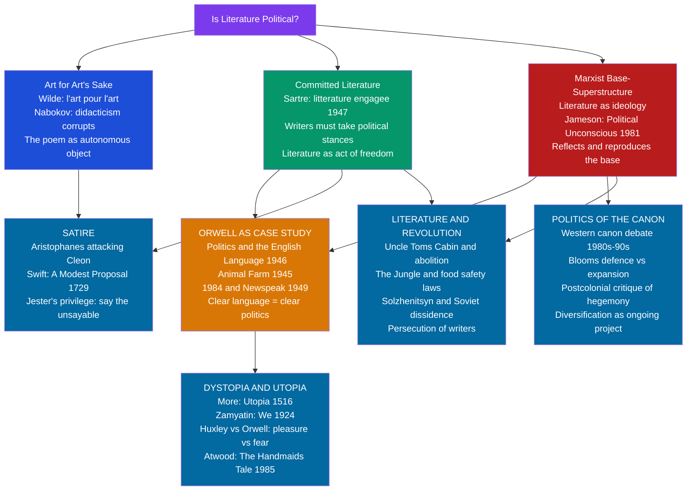

> [!abstract] TL;DR
> Every literary text takes a position — explicitly or by implication — on who matters, whose suffering counts, and what world is worth imagining; from Aristophanes mocking Athenian war-hawks and Swift proposing the Irish eat their babies, through Orwell's Newspeak and Atwood's Gilead, to the ongoing debate over whether the Western canon is a site of cultural hegemony, literature and politics are not two fields that occasionally intersect but a single question asked in two different languages.

---

## Intuition

**Analogy:** A city's public statues tell you who runs the place. They are never neutral: someone decided which generals and founders deserve pedestals, which battles deserve commemoration, and which people should be rendered in stone as universal and which as particular. The choice to erect a statue is a political act; so is the choice to topple one. Now consider that a literary canon — the shelf of "great books" — is a gallery of statues made of language. Someone decided which voices get taught in schools, which novels get reviewed in prestige journals, which stories count as universal human experience and which count as the experience of a specific, limited group.

That is the deepest sense in which literature is political: not merely when a novel argues for a cause, but always, structurally, in whose experience gets represented as central and whose gets represented as marginal. The political battle over literature is, at its core, a battle over who gets the statue.

---

## How It Works



The relationship between literature and politics organizes itself around three foundational positions — art for art's sake, committed literature, and the Marxist ideology critique — and then radiates outward into four domains of practical application: satire, dystopia/utopia, revolutionary literature, and canon politics.

---

## Key Concepts

### Secondary Level

#### Is All Literature Political?

The question sounds provocative but has a serious answer. Three positions have been argued with force:

**1. Art for art's sake** (*l'art pour l'art*). Oscar Wilde's preface to *The Picture of Dorian Gray* (1891) states baldly: "There is no such thing as a moral or an immoral book. Books are well written, or badly written. That is all." Nabokov made the same point more viciously, calling didactic novels "topical trash." On this view, literature that consciously serves a political agenda degrades itself — the demand that fiction be useful corrupts the only thing that distinguishes it from a pamphlet. The argument has genuine force: propagandistic novels, even in causes we approve, tend to be worse novels. Characters become mouthpieces; plots become parables; ambiguity — the defining texture of literary experience — collapses into moral clarity.

**2. Committed literature** (*littérature engagée*). Jean-Paul Sartre's *What is Literature?* (1947) mounted the most rigorous counter-argument. Sartre's claim: every text, including the refusal to be political, is already an act in the world. The writer who insists on pure art while, say, living under fascist occupation has made a political choice — to accommodate, to look away. Writing is a form of freedom, and the writer who invokes freedom for their own creative practice while denying it to others through silence is in bad faith. The committed writer does not subordinate art to a party line; they recognize that the act of naming injustice — clearly, in language that compels readers to see it — is itself a form of action.

**3. The Marxist base/superstructure model.** Marx's foundational claim is that a society's economic base (relations of production, class structure) generates an ideological superstructure — law, religion, philosophy, art — that reflects and reproduces the conditions of the base. Literature, on this model, is always ideologically positioned: it naturalizes existing social arrangements, or (in the hands of critical realists) exposes them. Fredric Jameson's *The Political Unconscious* (1981) developed the most sophisticated modern version: "there is nothing that is not social and historical — indeed, everything is 'in the last analysis' political." Even texts that seem purely aesthetic encode ideological content in their deepest structural choices — what counts as a satisfying resolution, who is the subject of a plot, whose desires drive the narrative.

The implication for New Criticism's "autonomy" thesis is sharp: the claim that the poem is a self-contained verbal object, innocent of history and ideology, is itself a political position — one that systematically insulates literary study from social critique. Calling a text "apolitical" is not a neutral description; it is an ideological choice that forecloses certain questions.

#### Orwell and the Language-Politics Bond

George Orwell is the century's most important thinker about the relationship between political language and political reality, and he argued his thesis through fiction as much as through criticism.

**"Politics and the English Language" (1946)** — Orwell's central claim is that political corruption and linguistic corruption are reciprocally related. Vague, abstract, bureaucratic language does not merely reflect dishonesty; it enables it. When a government writes "collateral damage" instead of "civilian deaths," or "enhanced interrogation" instead of "torture," it is not merely choosing neutral technical vocabulary — it is deploying language to make acts that could not be defended in plain speech appear defensible. Orwell's rules (prefer the concrete word, use the active voice, cut every unnecessary word) are not stylistic preferences; they are a political program. Clear language forces clarity of thought, and clarity of thought makes political evasion harder.

***Animal Farm* (1945)** — The fable of a farm whose animals expel their human owner and establish an egalitarian community, only to watch a pig oligarchy consolidate power, is the most economical account ever written of how revolutionary language gets corrupted into its opposite. The seventh commandment begins: "All animals are equal." It ends, as the pigs learn to walk upright and carry whips: "All animals are equal, but some animals are more equal than others." The sentence performs in miniature Orwell's entire argument: the language of equality is preserved while the reality of equality is destroyed. The pigs do not abandon the revolution's vocabulary; they hollow it out.

***Nineteen Eighty-Four* (1949)** — Newspeak, the novel's invented language being constructed to replace English, operates on the principle Orwell identified in *LTI*: if the vocabulary for a thought does not exist, the thought becomes literally unthinkable. "Crimestop" is the ability to halt a thought before it becomes thoughtcrime; "doublethink" is the capacity to hold two contradictory beliefs simultaneously and believe both, suppressing the awareness of contradiction. The Ministry of Truth falsifies historical records so that the Party is always right; the Ministry of Love uses torture. The Party's three slogans — "War is Peace / Freedom is Slavery / Ignorance is Strength" — are not claims to be believed but contradictions to be accepted, the acceptance itself being the act of submission. *1984* is the fullest literary demonstration of the thesis Orwell condensed in "Politics and the English Language": control language, and you control the thinkable.

**The paradox of politically effective fiction.** Orwell wrote politically effective fiction precisely by refusing abstraction. The animals in *Animal Farm* are specific, warm, individualised. Winston Smith's love affair, his varicose ulcer, his diary, the glass paperweight he purchases in a junk shop — these are not decorations on a political argument; they are the argument. The political stakes become unbearable exactly because they are incarnated in a particular human life. This is the answer to art-for-art's-sake: political art fails not when it has a political purpose, but when it sacrifices the specific and embodied for the abstract and didactic.

---

### Undergraduate Level

#### Utopia, Dystopia, and the Political Imagination

**Utopia as genre and argument.** Thomas More coined the word *utopia* in 1516 for his fictional island-commonwealth, exploiting a Greek pun: *ou-topos* (no-place) and *eu-topos* (good-place) are homophones. This double meaning — the good place is nowhere — is embedded in the genre's DNA. Utopia does not claim to describe reality; it uses an imagined ideal to measure and critique the present. The tradition is long: Plato's *Republic* is the first philosophical utopia (the ideal city-state as a thought experiment about justice); Francis Bacon's *New Atlantis* (1627) imagines a society organized around scientific knowledge; William Morris's *News from Nowhere* (1890) imagines a post-capitalist England of artisanal pleasure. The political function of each is the same: by imagining an alternative, the text makes visible the contingency of existing arrangements — what is, need not have been; what is, need not continue.

**Dystopia: the anti-utopian tradition.** Dystopia reverses the utopian impulse: rather than imagining a society we should strive toward, it imagines a society that realizes our worst tendencies — and uses that image as a warning. The genre's founding text is Yevgeny Zamyatin's *We* (1924), a Soviet novel about a mathematically organized One State where citizens live in glass apartments, sexuality is rationed, and the Benefactor rules by terrifying referendum. Zamyatin's influence is direct: both Huxley and Orwell acknowledged *We* as a source.

Aldous Huxley's *Brave New World* (1932) and Orwell's *Nineteen Eighty-Four* (1949) represent the two poles of dystopian control:

| Dimension | Huxley's World State | Orwell's Oceania |
|-----------|----------------------|------------------|
| Control mechanism | Pleasure (soma, sex, entertainment) | Fear (torture, surveillance, war) |
| Threat | Conditioning from birth | Violence from above |
| History | Abolished through happiness | Falsified through the Ministry of Truth |
| Warning | We will be controlled by what we love | We will be controlled by what we fear |
| Contemporary resonance | Algorithmic entertainment, distraction | Mass surveillance, authoritarian repression |

Neil Postman, in *Amusing Ourselves to Death* (1985), argued that Huxley's dystopia was more prophetic for Western democracies — not Big Brother watching us, but infinite entertainment making us incapable of the sustained attention democracy requires.

Margaret Atwood's *The Handmaid's Tale* (1985) constructs a theocratic patriarchal dystopia, Gilead, from existing historical precedents. Atwood's rule: nothing in the novel is invented; every form of oppression depicted has actually occurred somewhere. This methodological choice is the novel's political argument: Gilead is not science fiction but extrapolation. Kazuo Ishiguro's *Never Let Me Go* (2005) deploys dystopian premise (cloned humans raised for organ donation) through pastoral elegy, using the genre's defamiliarizing distance to examine how people collaborate in the conditions of their own exploitation.

**The utopian impulse in science fiction.** Ursula Le Guin's *The Dispossessed* (1974) is subtitled "An Ambiguous Utopia" — a twin-planet novel in which a liberated anarchist world (Anarres) and a capitalist world (Urras) are placed in genuine dialectical comparison. Le Guin refuses the simple inversion of dystopia's bad world and utopia's good one; Anarres has its own repressions. The political argument is encoded in the form: you cannot think about justice without attending to its costs, its trade-offs, its temptation toward new forms of conformity.

#### Satire as Political Critique

Satire is the oldest form of political literature. Aristophanes' *Knights* (424 BCE) mocked the Athenian demagogue Cleon so specifically and viciously that it required actors to play the role because no mask-maker would risk making Cleon's likeness. Horace and Juvenal established the Roman satirical tradition that Swift, Pope, and Dryden would inherit.

**Jonathan Swift's "A Modest Proposal" (1729)** is the master text of political irony. Its premise: an anonymous Irish projector suggests that the problem of Irish poverty can be solved if the children of the poor are sold as food to the rich English landlords, who would find them "delicious, nourishing, and wholesome." The proposal is developed with full actuarial precision — numbers of children, market price per head, best methods of preparation — in the cool, rational tone of an Enlightenment economic pamphlet. The argument is unanswerable because it takes the logic of English colonial exploitation of Ireland to its literal conclusion: you have already been treating the Irish as less than human; why not complete the inference? The rage is expressed through exact calculation, not through denunciation. That displacement of emotion into technical prose is what makes the text devastating.

**The political power of satire rests on four mechanisms:**

1. **The jester's privilege.** Satire says what cannot be said directly — exaggeration and comedy provide deniability ("it's only a joke") while the point lands with full force.
2. **Defamiliarization.** By presenting recognizable power structures in absurdly literal form (the pigs managing the farm, the Lilliputian court factions disputing which end of the egg to break), satire forces the reader to see arrangements they have stopped noticing.
3. **Moral inversion.** Swift's projector is not a villain; he is a rational benefactor. The inversion reveals that the existing arrangement is already the horror being satirized.
4. **Coalition-building.** Political satire creates communities of recognition among those who "get it" — the shared laugh is itself a political act, a mutual acknowledgment of what is being endured.

**The limits of satire** are equally important:

- Satire tends to preach to the choir. People who do not recognize the target as wrong do not recognize the satire as satire; they take it at face value or as an attack.
- Satire can normalize what it mocks. When satirical exaggeration tracks reality too closely (as with the Trump era's relationship to *The Daily Show*), the gap between satirical excess and actual policy narrows, and the critique becomes mere description.
- No evidence that satire causes political change. Aristophanes mocked the Athenian war party for twenty years; Athens fought the Peloponnesian War to catastrophic defeat. Swift's "Modest Proposal" did not improve conditions in Ireland.

---

### Graduate Level

#### Literature and Revolution: Does Fiction Change the World?

**The "Uncle Tom's Cabin" model.** Harriet Beecher Stowe's *Uncle Tom's Cabin* (1852) is the paradigm case of politically transformative fiction. The claim — attributed to Lincoln's greeting of Stowe as "the little woman who wrote the book that started this great war" — that a novel helped cause the Civil War is not literally true but points to something real: the novel reached three million readers in its first year, made the suffering of enslaved people visible and particular to a mass Northern audience that had regarded slavery as an abstraction, and generated the emotional infrastructure of abolitionism. The political mechanism was not argument but identification: readers wept over Uncle Tom and Eliza because they were rendered as suffering human beings, not as categories.

Upton Sinclair's *The Jungle* (1906) provides the counter-case. Sinclair wrote his novel about the meatpacking industry to expose the exploitation of immigrant workers and argue for socialism. The novel generated massive public outrage and led directly to the Pure Food and Drug Act (1906) — but in response to the contaminated meat, not the workers' suffering. As Sinclair famously put it: "I aimed at the public's heart, and by accident I hit it in the stomach." The political effect was real but not the intended one; the part of the novel that succeeded was its visceral description of what went into the sausages, not its socialist argument.

**The dissident tradition.** Alexander Solzhenitsyn's *One Day in the Life of Ivan Denisovich* (1962) — published in the Soviet literary journal *Novy Mir* under Khrushchev's de-Stalinization — was the first Soviet literary text to describe the Gulag system from the inside. Its political effect was structural: it made credible public acknowledgment of a system that had officially not existed. *The Gulag Archipelago* (1973), unpublishable in the USSR, circulated in *samizdat* (self-published typescript copies passed hand to hand) and was finally published in Paris, becoming a major factor in the delegitimization of Soviet communism in Western liberal opinion.

The cases of writers killed by authoritarian regimes constitute the most direct evidence for literature's political weight. Osip Mandelstam wrote a sixteen-line poem mocking Stalin in 1933; he died in a transit camp in 1938. The Nigerian writer Ken Saro-Wiwa was hanged by the Sani Abacha regime in 1995 for his activism and writing on behalf of the Ogoni people against Shell's oil extraction. Federico García Lorca was shot by Francoist forces in 1936. Regimes that imprison and kill writers understand something that purely aesthetic theories of literature do not: that stories shape what people believe is possible, who counts as a person, and what arrangements deserve to be endured.

**The problem of efficacy.** The question of whether literature "causes" political change is unanswerable in any strong causal sense. Political change is overdetermined; you cannot run the counterfactual (what would have happened without *Uncle Tom's Cabin*?). What can be argued is that literature participates in the formation of the moral imaginaries within which political action makes sense. It does not cause revolutions; it makes certain revolutions imaginable and others unimaginable. It does not change laws; it changes the emotional and cognitive frameworks within which laws are argued over.

#### The Politics of the Literary Canon

**The debate's structure.** In the 1980s and 1990s, American universities became the site of a sustained cultural battle over which texts should constitute the core reading list of a liberal education. The conservative position was argued most forcefully by Allan Bloom (*The Closing of the American Mind*, 1987) and E.D. Hirsch (*Cultural Literacy*, 1987): the Western canon — Homer, Plato, Dante, Shakespeare, Austen, Tolstoy — represents the accumulated achievement of civilization, the common cultural inheritance that makes democratic deliberation possible; to replace it with texts chosen for political representation is to sacrifice depth for relevance. The progressive counter-argument: the canon is not the distillation of universal human wisdom but a site of cultural hegemony — it reflects and reproduces the perspectives of white, male, European culture as though those perspectives were universal, and it systematically excludes the voices of women, people of color, and non-Western traditions.

**The Marxist framing.** For cultural critics in the tradition of Gramsci and the Frankfurt School, the debate was not merely about fairness in representation but about ideological reproduction. The canon is part of the apparatus through which a society's dominant cultural values are transmitted and naturalized; to change the canon is to intervene in that apparatus. The institution of literary study — what counts as "literature," which texts deserve scholarly attention, which critical approaches are legitimate — is not a neutral professional enterprise but a site of cultural power.

**The outcome and its limits.** Most Western university literature curricula today are substantially more diverse than they were in 1980. Women writers, writers of color, and non-Western literary traditions are now taught alongside the traditional canon rather than as supplementary units. This represents a genuine institutional transformation. Its limits are also visible: texts are sometimes added to an unchanged evaluative framework (still judged by the criteria developed to assess the old canon), which produces the effect Spivak warned against — inclusion without structural transformation. The deeper question — whose aesthetic categories determine what counts as excellent? — is harder to resolve than which titles are on the syllabus.

---

## Python Demo

Model political ideology in a literary character network using the Deffuant bounded-confidence model. Characters hold stances on a 0–1 scale; connected characters interact only if their stance difference is within a threshold — otherwise they entrench.

```python
import numpy as np
import matplotlib.pyplot as np_plt   # alias to avoid shadowing
import matplotlib.pyplot as plt

np.random.seed(42)

N_CHARS = 30
N_STEPS = 50
THRESHOLD = 0.3   # Deffuant bounded-confidence threshold
MU = 0.4          # convergence rate when within threshold

# --- Initialise characters -------------------------------------------------
# Stances uniform on [0, 1]: 0 = maximally conservative, 1 = maximally progressive
stances = np.random.uniform(0, 1, N_CHARS)

# --- Build a sparse random social network (2-4 connections per character) --
rng = np.random.default_rng(42)
connections = [set() for _ in range(N_CHARS)]
for i in range(N_CHARS):
    n_friends = rng.integers(2, 5)          # 2 to 4 connections
    pool = [j for j in range(N_CHARS) if j != i]
    friends = rng.choice(pool, size=min(n_friends, len(pool)), replace=False)
    for j in friends:
        connections[i].add(j)
        connections[j].add(i)

# --- Record snapshots -------------------------------------------------------
history = [stances.copy()]   # t=0

# --- Run Deffuant dynamics --------------------------------------------------
for step in range(N_STEPS):
    # Pick a random pair of connected characters
    i = rng.integers(0, N_CHARS)
    neighbours = list(connections[i])
    if not neighbours:
        history.append(stances.copy())
        continue
    j = rng.choice(neighbours)
    diff = stances[j] - stances[i]
    if abs(diff) <= THRESHOLD:
        # Bounded confidence: move toward each other
        stances[i] += MU * diff
        stances[j] -= MU * diff
    history.append(stances.copy())

history = np.array(history)   # shape: (N_STEPS+1, N_CHARS)

# --- Compute polarization metric: variance of stances over time ------------
variance_over_time = history.var(axis=1)

# --- Visualise --------------------------------------------------------------
fig, axes = plt.subplots(1, 3, figsize=(16, 5))
fig.suptitle(
    "Political Stance Dynamics in a Literary Character Network\n"
    "Deffuant Bounded-Confidence Model  (threshold = 0.3, N = 30 characters)",
    fontsize=11, fontweight="bold"
)

snapshots = [(0, "t = 0\n(Initial)"), (25, "t = 25\n(Mid)"), (50, "t = 50\n(Final)")]
colors = ["#1d4ed8", "#d97706", "#dc2626"]
labels = ["Progressive", "Centrist", "Conservative"]

for ax, (t, title), color in zip(axes, snapshots, colors):
    data = history[t]
    ax.hist(data, bins=10, range=(0.0, 1.0),
            color=color, alpha=0.80, edgecolor="black", linewidth=0.5)
    ax.axvline(data.mean(), color="black", linestyle="--", linewidth=1.4,
               label=f"Mean = {data.mean():.2f}")
    ax.axvline(0.33, color="grey", linestyle=":", linewidth=0.9, alpha=0.6)
    ax.axvline(0.67, color="grey", linestyle=":", linewidth=0.9, alpha=0.6)
    ax.set_title(title, fontsize=10)
    ax.set_xlabel("Stance (0 = conservative, 1 = progressive)", fontsize=9)
    ax.set_ylabel("Number of characters", fontsize=9)
    ax.set_xlim(0, 1)
    ax.set_ylim(0, N_CHARS // 2)
    ax.legend(fontsize=8)
    ax.text(0.05, ax.get_ylim()[1] * 0.88,
            f"Variance = {data.var():.3f}", fontsize=8, color="black")

plt.tight_layout()
plt.savefig("literary_politics_deffuant.png", dpi=150, bbox_inches="tight")
plt.show()

# --- Console summary -------------------------------------------------------
print(f"\nStep  |  Mean stance  |  Variance  |  Interpretation")
print("-" * 60)
for t, label in [(0, "Initial"), (25, "Mid"), (50, "Final")]:
    m = history[t].mean()
    v = history[t].var()
    interp = "polarizing" if v > history[0].var() * 1.05 else "converging"
    print(f"  {t:>2}  |    {m:.3f}      |   {v:.4f}  |  {label}: {interp}")
```

**What the output reveals:**

- At **t = 0**, stances are roughly uniformly distributed — no camps yet, variance is high in range.
- At **t = 25** and **t = 50**, the distribution typically clusters into two or three groups — characters whose stances fall within the 0.3 threshold of each other converge, while those separated by more than the threshold stop interacting and maintain their divergent stances.
- **Variance evolution:** if the initial distribution is bimodal (by chance or design), the model accelerates polarization; if unimodal, it can produce a single central cluster. The bounded-confidence mechanism shows how moderation clusters and extremes entrench — a structural property that arises purely from the topology of social connection, not from individual irrationality.
- **The literary application:** think of this as modeling the fate of a political novel's character community (the society of *Animal Farm*, the residents of *Parable of the Sower*, the players in Dostoevsky's *Demons*) — showing how social-network structure and interaction thresholds, more than individual intelligence or virtue, determine whether a community reaches consensus or fractures into irreconcilable camps.

---

## Real-World Applications

> **"A Modest Proposal" (Swift, 1729) — Satire as Colonial Critique:** Swift's pamphlet operates through perfect ironic mimicry of the tone of Enlightenment economic rationalism — the same tradition that produced proposals for managing Irish poverty through various schemes of improvement. By pushing that logic to its literal conclusion (eat the children), Swift reveals the premise all the reasonable proposals share: that the Irish poor are not fully persons whose suffering is a moral concern, but a resource to be managed for the benefit of the English landlord class. The text's power is inseparable from its form: denunciation would allow the target to dismiss it as sentiment; the actuarial calm forces the target to reject the conclusion while squirming at the logic. The text has not lost any of its force in three hundred years precisely because colonial extraction of this structure has not ended.

> **Solzhenitsyn's *Gulag Archipelago* (1973) — Literature as Historical Evidence:** The work, compiled from testimony of more than 250 former prisoners, documented the Soviet forced-labor camp system in detail that the Soviet state had been able to deny for decades. Published in the West, it reframed Western left-wing debate about the Soviet Union at a critical moment in the Cold War, providing evidence against the persistent Western leftist argument that Stalinist crimes were exaggerated by Cold War ideology. Solzhenitsyn's Nobel Prize (1970, accepted in absentia) and eventual expulsion from the Soviet Union (1974) demonstrate the mechanism by which authoritarian regimes simultaneously prove a work's political importance and attempt to neutralize it: state persecution is the involuntary tribute that power pays to the texts it fears.

> **The Western Canon Debate (1987–1994) — Stanford and the Culture Wars:** Stanford University's 1988 decision to replace its required "Western Culture" reading list with a more diverse "Cultures, Ideas, and Values" course — including texts by women, people of color, and non-Western traditions — became the symbolic flashpoint of the American culture wars. The confrontation produced arguments that have not been resolved: can a diverse curriculum still provide the common cultural foundation that civic deliberation requires (Hirsch's worry)? Or does the traditional canon, transmitted as universal, perform the ideological function of making one culture's values feel like civilization itself (the postcolonial counter)? The Stanford debate's real importance was making visible a question that had always been present but unasked: the choice of which texts to call "literature" was never innocent.

> **Atwood's *The Handmaid's Tale* and the Present Tense:** The novel's adaptation for television (2017–) acquired new political salience with the rollback of reproductive rights in the United States from 2022 onward. Demonstrators at legislative buildings wore the red robes and white bonnets of Atwood's Handmaids — the costume functioning as a quotation from a dystopian novel deployed as political argument. This is the most compact possible illustration of dystopia's political mechanism: the novel did not predict the future, but it had supplied an image vivid enough to function as political language decades later, making recognizable a political development that, without the novel's vocabulary, would have been harder to name.

---

## Common Pitfalls

- **Confusing political purpose with didacticism** — the failure mode of politically committed literature is not having a political purpose but sacrificing ambiguity to it. Characters become representatives of positions rather than people; outcomes are predetermined by argument rather than generated by character. Orwell's *Animal Farm* succeeds precisely because Boxer the horse is a fully realised emotional presence, not a symbol; his betrayal lands as a specific loss, not an illustrated thesis.

- **Assuming satire preaches only to the choir** — this is largely true empirically, but the choir matters: satire builds and sustains communities of critical awareness that are prerequisites for political organization. The question is not whether satire converts opponents but whether it energizes and clarifies the already-convinced.

- **Treating dystopia as prediction** — Orwell explicitly denied that *1984* was a prediction about 1948 England; it was a warning about tendencies he observed, projected to their extreme conclusion to make them visible. Reading dystopia as prophecy literalizes what is meant as a diagnostic: the political function is "if this continues" not "this will happen."

- **Assuming the text's political meaning is its author's political intention** — Sinclair wanted to write a socialist novel; he produced a food-safety scandal. The text's political effects are shaped by the cultural and institutional contexts of its reception, which the author cannot control. This is not a failure; it is the irreducibly social nature of literary meaning.

- **Treating canon diversification as political resolution** — adding diverse texts to an unchanged evaluative framework does not transform the politics of the canon; it performs diversity while preserving the structural advantage of dominant critical categories. The more radical question — whose criteria determine what counts as excellence? — is not answered by a longer reading list.

- **Overlooking state censorship as the most direct evidence of literature's political weight** — the banning, burning, and criminalizing of texts by authoritarian regimes is the most reliable indicator of which texts authorities regard as politically threatening. Index Librorum Prohibitorum, Soviet *samizdat*, Nazi book-burnings, the Iranian fatwa against Rushdie: these are not evidence that literature is dangerous, but evidence that those in power believe it is.

---

## Related Concepts

- [[New_Criticism_and_Close_Reading]] — New Criticism's "autonomy thesis" (the poem as self-contained verbal object) is itself a political position, one that insulates literary study from social and historical critique; Jameson's counter-argument is the direct theoretical response to this claim.

- [[Postcolonial_Literary_Theory]] — postcolonial theory is the most systematic application of the political analysis of literature to questions of representation, canon, and whose voice is authorized as literary; Said, Spivak, and Bhabha are all working within the tradition that asks whose literature the canon reflects.

- [[Feminist_and_Queer_Literary_Theory]] — feminist literary criticism applies the same structural argument (whose experience is represented as universal?) to gender; the canon debates of the 1980s were fought simultaneously on racial/postcolonial and feminist fronts.

- [[Literary_Theory_Overview]] — provides the broader theoretical context within which the three positions (art for art's sake, committed literature, ideology critique) are situated across the full history of literary theory.

- [[Modern_and_Contemporary_Literature]] — the period in which political literature as a self-conscious genre took its modern form: realism, naturalism, modernism's political discontents, postwar dystopian fiction, and contemporary political novel.

- [[Genre_and_Literary_Form]] — dystopia and utopia are genres with their own formal conventions; satire is a genre with a distinct rhetorical mode; understanding what makes these genres politically effective requires attention to form as well as content.

- [[Political_and_Public_Rhetoric]] — the companion note on rhetoric's political function; Orwell's argument about language and political corruption bridges literary and rhetorical analysis; propaganda literature is the overlap zone between the two fields.

- [[Classical_Rhetoric_and_Aristotle]] — satire's critique operates through rhetorical modes (irony, amplification, reductio ad absurdum); the political functions of epideictic literature (praise, blame, commemoration) connect directly to Aristotle's rhetorical genres.

- [[Socialism_Marxism_and_Communism]] — Marxist base/superstructure theory, Gramsci's hegemony concept, and the concept of ideological apparatus are the political-theoretical foundations of the literary ideology critique; understanding Jameson requires understanding Marx.

- [[Media_Propaganda_and_Political_Communication]] — propaganda literature and propaganda communication studies share a subject; Orwell's Newspeak analysis prefigures Ellul's sociological propaganda theory; the political novel and political communication are different instruments for the same question.

- [[Democratic_Backsliding_and_Polarization]] — dystopian fiction, from *1984* to *The Handmaid's Tale*, is a primary cultural vocabulary for understanding democratic backsliding; Atwood's Gilead and its recent political use demonstrate the genre's diagnostic function.

- [[Authoritarianism_and_Hybrid_Regimes]] — authoritarian regimes' systematic persecution of writers and control of literary culture (Soviet Socialist Realism, Nazi Kulturpolitik, Iranian censorship) is the most direct evidence for literature's political significance.

- [[Human_Rights_and_International_Law]] — the persecution of writers — Saro-Wiwa, Mandelstam, Lorca — is a human rights question; PEN International's defense of imprisoned writers is the institutionalization of the argument that literary freedom is a political right.

- [[Social_Movements_and_Revolution]] — literature's role in creating the moral imaginaries that make social movements possible; *Uncle Tom's Cabin* and abolitionism, *The Jungle* and labor rights, *The Handmaid's Tale* and reproductive rights activism.

- [[Culture_Norms_Values_and_Ideology]] — the sociological account of how culture reproduces ideology; the literary canon is one of the primary vehicles through which a society's dominant values are transmitted and made to feel natural.

- [[Conflict_Theory_and_Critical_Theory]] — the Frankfurt School's analysis of the culture industry and the ideological function of aesthetic production; Gramsci's hegemony concept as the theoretical basis for understanding the canon as a political institution.

- [[Media_Culture_and_Cultural_Industries]] — the structural conditions of literary production — publishing markets, prize systems, university curricula — determine which political literature reaches audiences; Casanova's World Republic of Letters maps these structural advantages.

---

## Review Questions

### Secondary

1. Orwell argues in "Politics and the English Language" that vague language enables political dishonesty. Find a recent political speech or press release and identify two moments where abstract language is being used to describe something concrete. What would Orwell's plain-English version of each moment look like, and how does the rewrite change what is being admitted?
2. Swift's "A Modest Proposal" argues against British colonial exploitation of Ireland by pretending to endorse it. Identify another real or fictional example of irony used for political ends. What makes irony politically effective, and what are its risks? Who might take Swift's proposal literally, and what would that tell us?
3. *Animal Farm* and *The Handmaid's Tale* are both political fictions that have been deployed in real political arguments. Choose one and explain: what makes the text's political argument effective? Is it the story, the characters, the language, the genre, or some combination? Would a political essay making the same argument be as powerful?

### Undergraduate

1. Fredric Jameson claims that everything is "in the last analysis" political, including texts that claim political neutrality. New Criticism claims that the literary text is a self-contained verbal object whose meaning is wholly internal. Reconstruct the strongest version of each position. Is it possible to read a poem — say, Keats's "Ode on a Grecian Urn" — both as a self-contained aesthetic object and as an ideologically positioned cultural artifact? Does the choice of method yield different or complementary meanings?
2. Sartre argues that the writer who refuses political commitment makes a political choice — accommodation to the status quo. Wilde and Nabokov argue that politically committed literature degrades itself. Using *Animal Farm* or *The Handmaid's Tale* as your test case: does the novel's political purpose strengthen or weaken it as a work of literature? What formal features does a political novel need to avoid becoming propaganda?
3. The Western canon debate (Bloom vs. the diversification movement) was not primarily about which texts are intrinsically better but about what the university literature curriculum is for. Articulate the two strongest competing positions on this question. What would a literature curriculum look like that takes both positions seriously — that maintains standards of literary quality and dismantles cultural hegemony? Is such a curriculum possible, or are the two goals structurally incompatible?

### Graduate

1. Jameson's "political unconscious" thesis claims that even texts which resist political reading encode ideological content in their deepest structural choices — what counts as a resolution, who is the subject of desire, which forms of suffering are made visible or invisible. Apply this thesis to a canonical "apolitical" text of your choice (a Romantic lyric, a Modernist novel, a Victorian domestic realist text). What does a symptomatic reading reveal that a formalist close reading leaves latent? Does Jameson's method risk over-determination — finding ideology everywhere — or does it correct for the formalist's systematic under-reading of the social?
2. The persecutions of Mandelstam, Saro-Wiwa, and Lorca demonstrate that authoritarian states take literature's political weight seriously. Yet the literary left has often debated whether literature actually changes political conditions, or merely reflects and reinforces existing political tendencies. Develop a theoretically rigorous position on what literature can and cannot do politically. Draw on at least three historical cases (one from each of the abolitionist, Soviet dissident, and postcolonial traditions) and assess the mechanisms of literary political efficacy: consciousness-raising, imagination-formation, community-building, or something else?
3. The canon debate's unresolved question is whether aesthetic value judgments are separable from ideological ones — whether "this is a great novel" is a claim that can be made independently of "this novel represents experience I recognize as central." Bourdieu argues that aesthetic judgment is always a legitimation of cultural capital, and that claims to universal aesthetic value are the most effective form of ideological naturalization. Develop and then challenge this position using the careers of two writers: one from the Western canon and one from outside it. Can a text be ideologically compromised and aesthetically major simultaneously? What would it take to answer that question honestly?

---

## Sources

- Orwell, G. (1946). Politics and the English Language. *Horizon*, 13(76), 252–265.
- Orwell, G. (1945). *Animal Farm*. London: Secker and Warburg.
- Orwell, G. (1949). *Nineteen Eighty-Four*. London: Secker and Warburg.
- Sartre, J.-P. (1988). *What is Literature? and Other Essays*. Trans. B. Frechtman. Cambridge, MA: Harvard University Press.
- Jameson, F. (1981). *The Political Unconscious: Narrative as a Socially Symbolic Act*. Ithaca, NY: Cornell University Press.
- Wilde, O. (1891). Preface to *The Picture of Dorian Gray*. London: Ward, Lock and Company.
- Huxley, A. (1932). *Brave New World*. London: Chatto and Windus.
- Atwood, M. (1985). *The Handmaid's Tale*. Toronto: McClelland and Stewart.
- Swift, J. (1729). A Modest Proposal. Dublin: S. Harding.
- Solzhenitsyn, A. (1974). *The Gulag Archipelago*. Trans. T.P. Whitney. New York: Harper and Row.
- Bloom, A. (1987). *The Closing of the American Mind*. New York: Simon and Schuster.
- Hirsch, E.D. (1987). *Cultural Literacy: What Every American Needs to Know*. Boston: Houghton Mifflin.
- Postman, N. (1985). *Amusing Ourselves to Death: Public Discourse in the Age of Show Business*. New York: Viking.
- Le Guin, U.K. (1974). *The Dispossessed: An Ambiguous Utopia*. New York: Harper and Row.
- Stowe, H.B. (1852). *Uncle Tom's Cabin*. Boston: John P. Jewett.
- Sinclair, U. (1906). *The Jungle*. New York: Doubleday, Page and Company.
- More, T. (1516). *Utopia*. Trans. P. Turner. London: Penguin Books, 2003.
- Zamyatin, Y. (1924). *We*. Trans. C. Brown. New York: Penguin Books, 1993.
- Casanova, P. (2004). *The World Republic of Letters*. Trans. M.B. DeBevoise. Cambridge, MA: Harvard University Press.
- Bourdieu, P. (1993). *The Field of Cultural Production*. Trans. R. Johnson. Cambridge: Polity Press.

---

#LiteratureRhetoric #LiteratureSociety #Politics #PoliticalLiterature
