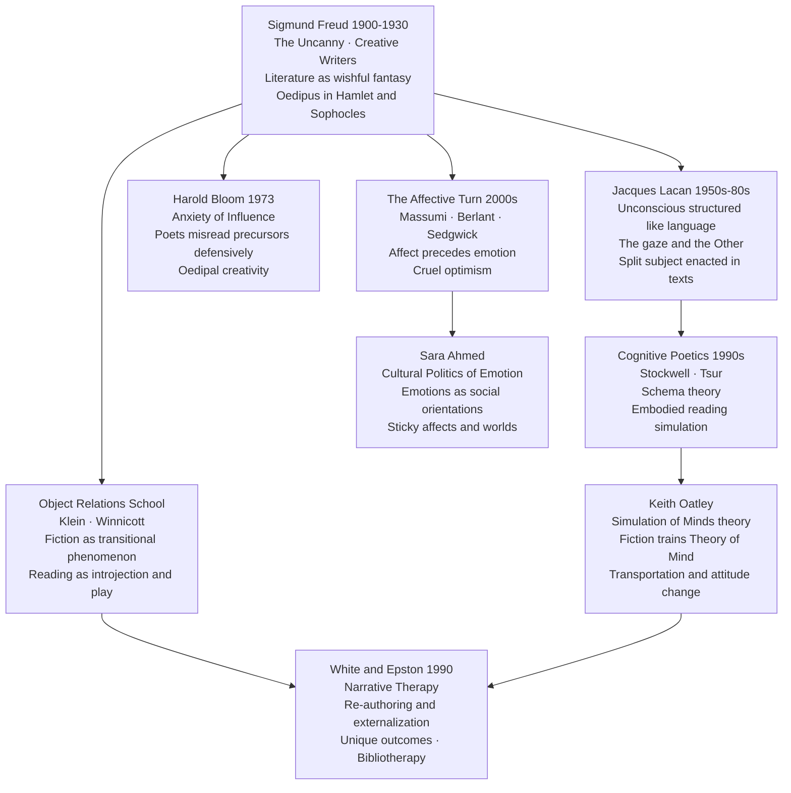

# Literature and Psychology

> [!abstract] TL;DR
> The encounter between literature and psychology runs in both directions: psychoanalysis from Freud onward has used literary texts as evidence and illustration of unconscious life; cognitive science has shown that reading fiction is a form of mental simulation that trains empathy and theory of mind; and narrative therapy has turned the literary insight that identity is a story into a clinical practice of re-authoring lives — together these movements reveal that fiction is not escapism but one of the mind's primary instruments for making, testing, and revising the self.

---

## Intuition

**Analogy:** Imagine a vivid dream in which you murder a rival — you wake horrified, then relieved, and finally curious: where did that come from? You did not choose the dream's plot; it arrived already charged with desire and anxiety you had not consciously acknowledged. Freud's answer was that the dream is a safe stage where the unconscious can rehearse its forbidden scripts under cover of sleep. Now replace "dream" with "novel." Reading a revenge thriller, weeping over a fictional death, feeling inexplicably elated when a character escapes — these are not passive entertainments. They are the waking mind doing exactly what the sleeping mind does in dreams: staging, without real-world consequence, emotions and desires that are too dangerous or too painful to experience directly.

This analogy captures the founding insight of psychoanalytic literary theory: literature and the unconscious run on the same mechanism of wish-fulfilment, displacement, and disguised revelation. But it is only the beginning. Cognitive scientists have since shown that when we read a description of reaching for a cup, the motor cortex fires as though we were actually reaching; when we follow a character's reasoning, we run that reasoning in our own minds. Literature is not a representation of experience — it is, neurologically, a form of experience. And if the therapist's consulting room is the site where destructive life-stories are revised into liveable ones, then literary critics and narrative therapists are practising, in very different registers, the same art: the art of re-authoring.

---

## How It Works

The field divides into four partially overlapping domains, each asking a different question about the literature-psychology relation:

1. **Psychoanalytic literary criticism** — What does a text reveal about unconscious desire? (Freud, Lacan, Bloom, Klein, Winnicott)
2. **The psychology of reading** — What happens in the mind and brain when a person reads? (cognitive poetics, schema theory, mental simulation, theory of mind)
3. **Narrative therapy** — How can the act of re-storying a life become a therapeutic intervention? (White, Epston, Foucault)
4. **Affect theory and literature** — How do texts move bodies before they move minds? (Massumi, Berlant, Sedgwick, Ahmed)



---

## Key Concepts

### Secondary Level

**Literature as wishful fantasy.** Freud's 1908 essay "Creative Writers and Day-Dreaming" made the simplest and most lasting claim in psychoanalytic literary theory: the creative writer is an adult day-dreamer who has found a way to share their fantasies without embarrassment. The literary work is a disguised wish-fulfilment, just like a dream — the fantasy is made socially acceptable by being dressed in aesthetic form, displaced onto fictional characters, and softened by the "fore-pleasure" of the text's beauty. The reader, in turn, gets to enjoy the fantasy vicariously without guilt, because it is "only a story." This is why popular narratives of wealth, revenge, romance, and power have bottomless audiences: they feed the fantasy life that ordinary social existence demands we suppress.

**The Oedipus complex in literary criticism.** Freud's analysis of Sophocles' *Oedipus Rex* and Shakespeare's *Hamlet* is the founding gesture of psychoanalytic criticism. Freud argued that *Oedipus* achieves its devastating theatrical force not because we pity a man who accidentally committed the crimes but because we recognize those crimes as our own repressed wishes: to possess the mother, to eliminate the father. *Hamlet*'s famous paralysis, Freud and Ernest Jones argued, is explained by the fact that Claudius has done exactly what Hamlet himself unconsciously wished to do — a man cannot murder the figure who mirrors his own unconscious desire. Whether or not these interpretations are historically plausible, they introduced a method that has been applied to virtually every canonical text since: reading surface narrative as the disguised expression of unconscious conflict.

**The uncanny (Das Unheimliche).** Freud's 1919 essay identified a specific aesthetic effect — the feeling of something simultaneously familiar and strange, intimate and alien — as a distinctive category of literary experience. The German *unheimlich* means both "uncanny" and literally "not of the home," while *heimlich* means both "familiar/homely" and (paradoxically) "secret/hidden." This semantic doubling is Freud's point: the uncanny is the return of something that was once known but has been repressed. Its literary sources include the double (the *Doppelgänger*), the automaton (Olympia in Hoffmann's *The Sandman*), and severed body parts. Freud's essay spawned an enormous secondary literature and remains essential for horror theory, gothic studies, and the analysis of any text that makes you feel you have been in this place before.

**What is psychoanalytic literary criticism?** It is the practice of reading literary texts using psychoanalytic concepts as interpretive tools. This does not mean treating texts as symptoms requiring diagnosis, or authors as patients on a couch. At its best it means asking: what structures of desire, anxiety, or repression make this text cohere? What does it need to disguise, displace, or condensate in order to say what it cannot say directly? What is the text's dream-work?

---

### Undergraduate Level

**Lacanian criticism.** Jacques Lacan's revision of Freud — using Saussurean structural linguistics — produced the most influential post-Freudian framework for literary theory. Lacan's central claim: the unconscious is structured like a language. The primary processes Freud identified in dreams (condensation and displacement) are, Lacan argued, the rhetorical operations of metaphor and metonymy. This means that literary language — which traffics in metaphor and metonymy — is not merely analogous to unconscious process but is actually continuous with it.

For literary study, two Lacanian concepts are especially productive. The **split subject**: the ego Descartes imagined as transparent and unified is, for Lacan, radically split — between the "I" that speaks and the "I" that is spoken, between conscious self-representation and the chain of signifiers that speak through us. Literary texts enact this splitting: the narrator who claims authority over the story is always undermined by what the text cannot control saying. The **gaze** (*regard*): the subject's desire is always triangulated through the Other's recognition. Characters in fiction desire not simply objects but the Other's desire for them — they want to be wanted in ways they cannot consciously articulate. Lacan's reading of Poe's "The Purloined Letter" (in which the letter functions as a "pure signifier," circulating between subjects who are defined by their relation to it) remains the model of a Lacanian close reading.

**Harold Bloom and the anxiety of influence.** Bloom's *The Anxiety of Influence* (1973) applied an essentially psychoanalytic framework to the history of poetry. Every strong poet, Bloom argued, faces an Oedipal crisis with respect to their literary precursor: they cannot simply imitate the great dead without being crushed by them; they must *misread* the precursor — swerve from them, complete what the precursor "left undone," or rewrite the precursor's achievement as a preliminary sketch for their own. This "misreading" (*clinamen*) is not a failure of comprehension but a creative defense mechanism. Milton's Satan, Bloom famously argued, is Milton's misreading of Shakespeare's Iago: you can only be Milton by first being *not-Shakespeare*. Bloom's framework transformed the history of literary influence from a map of debts into a drama of psychic defense.

**Object relations and the transitional space of reading.** Melanie Klein's concept of introjection — the child takes in (mentally incorporates) love objects to build an internal world — was extended to reading by theorists who noticed that readers similarly "take in" characters: identifying with them, mourning their deaths, defending against their failures. D.W. Winnicott's concept of the **transitional object** (the teddy bear, the blanket — the first "not-me" object the infant invests with inner-world meaning) maps strikingly onto fiction. Winnicott identified a **transitional space** — neither inner subjective world nor external reality — as the zone of play, culture, and art. Reading is a transitional phenomenon: the fictional world is neither hallucination (purely internal) nor reality (purely external) but a third space in which the inner and outer can be explored without the stakes of either. This is why reading feels both deeply personal and simultaneously public, why it can be both escapism and the most serious engagement with reality we can manage.

**Narrative therapy: core concepts.** Michael White and David Epston's *Narrative Means to Therapeutic Ends* (1990) is the founding text of narrative therapy. Its central insight, drawn from Bateson's cybernetics and Geertz's interpretive anthropology, is that people make sense of their lives through stories. The stories we tell about ourselves are not neutral descriptions but *constitutive* narratives: they select some events as significant, connect them causally, assign roles (victim, survivor, failure, hero), and project forward into future possibilities. When a person is suffering, they are typically captured by what White called a **problem-saturated story** — a dominant narrative in which the problem (depression, addiction, failure, abuse) becomes the totalizing definition of who they are.

Therapy involves four moves:

1. **Externalization** — the therapist treats the problem as a separate entity from the person. "You are not depressed; you have a relationship with Depression that has been getting too much influence over your life." This is not a semantic trick but a fundamental reorientation: when the problem is not the person, the person can observe it, describe its history, and investigate what it needs to survive.

2. **Unique outcomes** — the therapist excavates exceptions: moments when the dominant problem story did not hold. "Was there a time last month when Depression came for you and you did something different?" These "unique outcomes" (White borrowed the term from Goffman) become the seeds of an alternative narrative.

3. **Re-authoring** — the therapist and client collaboratively build a thicker alternative narrative, elaborating the unique outcomes into a new story about the person's preferred identity: not "I am a person who fails" but "I am a person who persisted through extraordinary difficulty."

4. **Outsider witnesses** — the new preferred narrative is witnessed and acknowledged by significant others, creating a social structure that sustains it against the pull of the old story.

The connections to literary theory are explicit: White drew on Foucault's discourse analysis (dominant stories are power/knowledge regimes that subject persons) and on Derrida's deconstruction of fixed identity. The person is not a substance but a narrative effect — and narratives can be revised.

**The psychology of reading: schema theory and mental simulation.** Two findings from cognitive psychology have reshaped literary theory since the 1980s:

*Schema theory*: readers bring prior knowledge structures (schemas) to texts. When you read the word "restaurant," you activate a schema that predicts menus, servers, and payment — and you fill gaps in the text using that schema automatically. Literary texts routinely *violate* schemas for artistic effect: the story begins with what appears to be a murder investigation but turns out to be an estate dispute; the character described as a hero turns out to be the villain. This schema-violation is a major source of aesthetic pleasure and defamiliarization (the Russian Formalists' *ostranenie* can be partly reinterpreted as strategic schema disruption).

*Mental simulation*: when you read "he reached for the knife," mirror-neuron systems in your motor cortex activate as though you were reaching for the knife. Reading is not passive symbol processing — it recruits the same sensorimotor and emotional systems that handle real experience. This "embodied simulation" account (Gallese, Barsalou) explains why skilled narrative can evoke genuine physiological responses: your heart rate rises during thriller climaxes; you flinch at described pain; you feel genuine grief over fictional deaths.

---

### Graduate Level

**Theory of mind, empathy, and the "simulation of minds" hypothesis.** Keith Oatley and Raymond Mar's research programme (2006 onward) tested a specific hypothesis: reading literary fiction, because it requires continuous modelling of characters' mental states, exercises the cognitive capacity known as theory of mind (ToM) — the ability to attribute beliefs, desires, and intentions to other minds. Their experimental findings (replicated and refined over two decades):

- Frequent fiction readers score higher on standard ToM measures (*Reading the Mind in the Eyes*, Strange Stories task) than frequent non-fiction readers, even when controlling for personality and general verbal intelligence.
- Narrative transportation — the experience of being absorbed into a fictional world — predicts attitude change and increased empathy toward out-groups, but only when the fictional characters are themselves complex and psychologically specific (not stereotyped).
- Reading literary fiction induces a "narrative mode" of mind (Bruner) that is specifically organized around agent, intention, and circumstance — the basic grammar of social cognition.

Oatley's theoretical account: fiction is a *simulation of social worlds*, running in a quarantined mental space. Like a flight simulator that trains pilots without crashing planes, fiction trains social cognition — the ability to navigate complex interpersonal environments — at no real-world cost. The literary text is not a mirror of reality but a mind-modeling engine: it runs models of other minds that readers can inhabit, test, revise, and integrate into their own social repertoire.

The **transportation-imagery model** (Green and Brock 2000) identifies narrative transportation as the mechanism: readers transported into a story world reduce counter-arguing, lower cognitive resistance, and become more susceptible to the story's implicit claims about the world. This is why propaganda works better as fiction than as argument — and why literary education, at its best, is genuinely an expansion of moral imagination rather than mere aesthetic refinement.

**Affect theory and literature.** The "affective turn" in the humanities, associated with Brian Massumi, Eve Kosofsky Sedgwick, and Lauren Berlant, shifted attention from *meaning* (what texts signify) to *feeling* (what texts do to bodies). Massumi drew on Deleuze and Spinoza to distinguish:

| Affect | Emotion |
|--------|---------|
| Pre-conscious, pre-linguistic bodily intensity | Named, socially recognized, consciously felt feeling |
| Autonomous: fires before cognition catches up | Structured by cultural codes and social norms |
| Potential: can flow in multiple directions | Qualified: fixed in a semantic slot ("I am anxious") |
| Operates at the level of the nervous system | Operates at the level of narrative self-understanding |

For literary study, the affect/emotion distinction asks us to attend to what texts do before readers interpret them: the rhythmic acceleration of a thriller, the texture of Dickinson's long dashes, the syntactic claustrophobia of Kafka's prose — these produce bodily effects that precede and partly determine the cognitive meaning we subsequently assign. The reader is moved before they understand why they are moved, and affect theory insists that the moving is often more politically consequential than the understanding.

**Cruel optimism (Lauren Berlant).** Berlant's *Cruel Optimism* (2011) introduced one of the most generative concepts for the study of how readers and viewers relate to fictional characters and narrative scenarios. A "cruel optimism" is an attachment to an object or scenario that is itself an obstacle to the flourishing it promises. The classic examples from Berlant's readings of novels and film: the ordinary person's attachment to the "good life fantasy" (stable employment, home ownership, companionate love) even as the material conditions that once made that fantasy attainable have been systematically dismantled by neoliberal economic restructuring. Characters in post-war fiction — and, by extension, readers who identify with those characters — sustain attachments to scenarios of the good life not despite but because of the precarity those scenarios generate: the fantasy of what could be keeps one invested in the system that produces the suffering.

For reading practice, cruel optimism names the dynamic by which a reader may identify deeply with a character whose situation the reader simultaneously recognizes as impossible — and in doing so, reproduce the ideological structure that makes them both complicit in their own immiseration. The concept connects literary affect theory to political economy in a way that neither Freudian nor cognitive approaches can achieve.

**Sara Ahmed and the social life of emotions.** Ahmed's *The Cultural Politics of Emotion* (2004) argued against both the psychological view that emotions are private internal states and the performative view that emotions are purely discursive constructs. Ahmed's claim: emotions are *relational* — they circulate between objects, bodies, and social surfaces, "sticking" to some objects (the stranger, the queer body, the immigrant) and sliding off others (the normative). Literature participates in the emotional economy of a culture by thickening or thinning the affect that sticks to certain figures: canonical novels that generate sympathy for colonial subjects (or fail to) are doing political work at the level of emotion-circulation. Reading is not a private psychological event but an entry into a shared emotional economy whose shape is political.

**The paradox of negative affect in fiction.** Why do readers seek out literature that makes them frightened, sad, or angry? This "paradox of tragedy" (addressed by Aristotle's *catharsis*, Hume's essay "Of Tragedy," and Noel Carroll) has psychological answers that cut across the traditions surveyed here:

- *Psychoanalytic*: tragedy allows the safe discharge of repressed aggressive and mournful energies; the aesthetic frame makes enjoyment of negative affect guiltless.
- *Cognitive*: negative emotional simulations provide rehearsal for real-world challenges; fear in fiction inoculates against real-world fear responses; sadness trains the reader in the grammar of loss.
- *Affective*: the intensity of affect — regardless of its valence — is itself pleasurable; the body values excitation over flatness; tragedy, horror, and melodrama deliver high-amplitude affective events that ordinary life rarely provides.

No single answer is complete, but the convergence of all three points toward a common principle: fiction is a technology for managing the emotional life at a level of intensity and precision that ordinary social experience cannot provide.

---

## Python Demo

```python
"""
Narrative Therapy: Computational Model of Story Revision
=========================================================
Models a therapy client as having 10 life events, each scored on:
  - problem_dominance (pd): 0 to 1  (how much the problem story owns the event)
  - emotional_valence  (ev): -1 to +1 (negative = suffering, positive = flourishing)

At each of 5 therapy sessions, the therapist identifies the "unique outcome" target
— the event with the highest pd * |ev| where ev < 0 — and re-authors it:
    pd_new = pd - 0.20 + N(0, 0.05)
    ev_new = ev + 0.30 + N(0, 0.05)

We track narrative_suffering_score = sum(pd_i * |min(ev_i, 0)|) across sessions.
Three panels show: narrative landscape scatter, suffering score trajectory,
and problem-dominance heatmap across events x sessions.
"""

import numpy as np
import matplotlib.pyplot as plt

np.random.seed(42)

N_EVENTS = 10
N_SESSIONS = 5

event_labels = [
    "Childhood illness",  "Early failure",     "Bullying episode",
    "Parental conflict",  "Career setback",    "Relationship loss",
    "Academic struggle",  "Social isolation",  "Grief and loss",
    "Financial stress"
]

# Initial problem-saturated narrative: high pd, mostly negative ev
pd0 = np.array([0.85, 0.90, 0.75, 0.80, 0.70, 0.88, 0.78, 0.82, 0.91, 0.72])
ev0 = np.array([-0.80, -0.90, -0.85, -0.70, -0.65, -0.92, -0.75, -0.80, -0.88, -0.60])

rng = np.random.default_rng(7)

pd_hist = [pd0.copy()]
ev_hist = [ev0.copy()]

for _ in range(N_SESSIONS):
    pd = pd_hist[-1].copy()
    ev = ev_hist[-1].copy()

    # Unique outcome target: event most saturated by problem story
    suffering = np.where(ev < 0, pd * np.abs(ev), 0.0)
    target = int(np.argmax(suffering))

    # Therapist re-authors the target event (White and Epston 1990)
    pd[target] = float(np.clip(pd[target] - 0.20 + rng.normal(0, 0.05), 0.0, 1.0))
    ev[target] = float(np.clip(ev[target] + 0.30 + rng.normal(0, 0.05), -1.0, 1.0))

    pd_hist.append(pd)
    ev_hist.append(ev)


def narrative_suffering(pd, ev):
    """Sum of problem_dominance * |negative valence| — the client's story weight."""
    return float(np.sum(np.where(ev < 0, pd * np.abs(ev), 0.0)))


scores = [narrative_suffering(pd_hist[s], ev_hist[s]) for s in range(N_SESSIONS + 1)]

# ── Visualisation ──────────────────────────────────────────────────────────────
fig, axes = plt.subplots(1, 3, figsize=(16, 5))
fig.suptitle("Narrative Therapy — Computational Model of Story Revision", fontsize=13)

palette = plt.cm.plasma(np.linspace(0.1, 0.9, N_SESSIONS + 1))

# Panel 1: Narrative landscape (problem_dominance × emotional_valence)
ax = axes[0]
for s in range(N_SESSIONS + 1):
    alpha = 0.35 + 0.65 * (s / N_SESSIONS)
    label = f"Session {s}" if s in (0, N_SESSIONS) else None
    ax.scatter(pd_hist[s], ev_hist[s], color=palette[s], alpha=alpha,
               s=90, zorder=s + 1, label=label)

# Arrows from session-0 to session-5 position for each event
for i in range(N_EVENTS):
    dx = pd_hist[-1][i] - pd_hist[0][i]
    dy = ev_hist[-1][i] - ev_hist[0][i]
    if abs(dx) + abs(dy) > 0.01:
        ax.annotate(
            "", xy=(pd_hist[-1][i], ev_hist[-1][i]),
            xytext=(pd_hist[0][i], ev_hist[0][i]),
            arrowprops=dict(arrowstyle="->", color="gray", alpha=0.55, lw=1.2)
        )

ax.axhline(0, color="black", linestyle="--", linewidth=0.8, alpha=0.4)
ax.axvline(0.5, color="black", linestyle=":", linewidth=0.8, alpha=0.4)
ax.set_xlabel("Problem Dominance")
ax.set_ylabel("Emotional Valence")
ax.set_title("Narrative Landscape\n(arrows: Session 0 to Session 5)")
ax.set_xlim(-0.05, 1.05)
ax.set_ylim(-1.1, 0.35)
ax.legend(loc="lower right", fontsize=8)

# Panel 2: Narrative suffering score per session
ax = axes[1]
ax.plot(range(N_SESSIONS + 1), scores, "o-", color="crimson", linewidth=2.5, markersize=9)
ax.fill_between(range(N_SESSIONS + 1), scores, alpha=0.15, color="crimson")
for s, sc in enumerate(scores):
    ax.text(s, sc + 0.07, f"{sc:.2f}", ha="center", fontsize=8)
ax.set_xlabel("Therapy Session")
ax.set_ylabel("Narrative Suffering Score")
ax.set_title("Suffering Score Reduction\nover 5 Sessions")
ax.set_xticks(range(N_SESSIONS + 1))
ax.set_xticklabels([f"S{i}" for i in range(N_SESSIONS + 1)])
ax.set_ylim(0, max(scores) * 1.25)

# Panel 3: Heatmap of problem dominance — sessions × events
ax = axes[2]
pd_matrix = np.array(pd_hist)          # shape (N_SESSIONS+1, N_EVENTS)
im = ax.imshow(pd_matrix, aspect="auto", cmap="RdYlGn_r", vmin=0, vmax=1)
ax.set_xticks(range(N_EVENTS))
ax.set_xticklabels([f"E{i + 1}" for i in range(N_EVENTS)],
                   rotation=45, ha="right", fontsize=8)
ax.set_yticks(range(N_SESSIONS + 1))
ax.set_yticklabels([f"S{i}" for i in range(N_SESSIONS + 1)])
ax.set_xlabel("Life Event")
ax.set_ylabel("Therapy Session")
ax.set_title("Problem Dominance Heatmap\n(red = problem-saturated)")
plt.colorbar(im, ax=ax, label="Problem Dominance")

plt.tight_layout()
plt.savefig("narrative_therapy_model.png", dpi=100)
plt.show()
```

**What the simulation demonstrates:**

- Panel 1 (scatter) tracks each of the 10 life events as they migrate from the high-pd / negative-ev quadrant (bottom-right: problem-saturated) toward lower problem dominance and higher valence over 5 sessions — directly visualizing White's "re-authoring."
- Panel 2 shows the steady reduction in narrative suffering score; note that improvement is non-linear — the highest-suffering event is re-authored first (greedy selection), yielding large initial gains that diminish as less-saturated events remain.
- Panel 3 (heatmap) makes the sequencing of therapeutic targets visible: the heatmap shows a "diagonal lightening" from session to session as each targeted event transitions from red toward green.
- Changing `0.20` (pd reduction) and `0.30` (valence shift) to smaller values models a less successful therapy or a client with high resistance; increasing them models rapid cognitive reframing.

---

## Real-World Applications

**Hamlet and the Oedipus complex.** The most famous example of psychoanalytic literary criticism is Ernest Jones's *Hamlet and Oedipus* (1949), a book-length expansion of Freud's paragraph in *The Interpretation of Dreams*. Jones argued that Hamlet's inexplicable delay in killing Claudius is explained by the fact that Claudius has fulfilled Hamlet's own repressed Oedipal wishes: to kill the father and sleep with the mother. Hamlet cannot execute Claudius without punishing himself; his madness (real or performed) is a symptom of the psychic conflict between consciously endorsed duty and unconsciously recognized identification. Whether or not this is a correct reading of Shakespeare's intentions, it transformed Hamlet scholarship for decades and produced a generation of psychoanalytic critics who extended the method to every canonical text — demonstrating both the productivity and the limitations of pathography applied to fiction.

**Narrative therapy in clinical practice.** Narrative therapy is widely practiced in family therapy, community mental health, and trauma recovery. A practitioner working with a survivor of domestic violence might begin by mapping the history and effects of the problem story ("Abuse has told you that you are worthless"). Externalizing conversations create space: "When did Abuse first start winning those arguments with you? Were there times it didn't win?" The unique outcomes — moments of resistance, resourcefulness, or connection — are densified into a counter-narrative: "the story of a woman who protected her children under impossible conditions." This counter-narrative is then made real by being witnessed: in a re-telling ceremony, family members or friends respond to what they heard and what it told them about the person's values. The therapeutic mechanism is explicitly literary: it is the revision of a story, with an audience.

**The fiction-empathy research programme.** Mar, Oatley, and colleagues' experimental work has shown measurable effects of fiction reading on social cognition in controlled studies:
- Participants assigned to read a short story (vs. a matched essay) subsequently scored higher on the *Reading the Mind in the Eyes* test.
- Long-term fiction readers show greater "need for cognition" directed at social situations specifically, not general problem-solving.
- Narrative transportation during fiction reading predicts reduced prejudice toward out-groups depicted in the story, but only when counterarguing is suppressed by the transportation state.
These findings have been applied to diversity and inclusion training, counter-radicalization programmes (where fiction about "the other" is used to disrupt dehumanizing narratives), and empathy development in medical and legal education.

**Bibliotherapy.** The systematic use of reading as a therapeutic tool — bibliotherapy — has a long clinical and popular history. Hospital and prison library programmes have used it since the early 20th century. Contemporary bibliotherapy distinguishes:
- *Prescriptive bibliotherapy*: recommending self-help books, psychoeducation materials, or CBT workbooks to supplement formal treatment.
- *Creative bibliotherapy*: using literary fiction, poetry, and memoir to open emotional processing through identification, catharsis, and narrative distance — the therapeutic analogue of Winnicott's transitional space.
Reading groups in psychiatric rehabilitation settings have documented reduced social isolation, improved articulation of emotional experience, and increased sense of agency among participants — precisely the outcomes predicted by the simulate-social-worlds and re-authoring frameworks.

---

## Common Pitfalls

- **The psychobiographical fallacy** — reducing literary interpretation to the reconstruction of the author's psychology. Freud himself was alert to this: he argued that the literary work transforms raw biographical material beyond recognition, and that the analyst of a text faces a different object from the analyst of a patient. Applying DSM criteria to long-dead authors (diagnosing Poe's alcoholism, Woolf's bipolar disorder) typically tells us less about the text than about the diagnostician's assumptions.

- **Pathologizing characters** — treating fictional characters as case studies in psychopathology. Characters are not people; they are narrative functions. Hamlet is not a patient with a diagnosable condition; he is a dramatic device through which a play produces its meanings. Psychoanalytic criticism is most productive when it asks what structural logic of desire or anxiety makes a text cohere, not when it mistakes the character for a person who could be cured.

- **Conflating affect with emotion** — affect theory insists on a sharp distinction: affect is pre-conscious, pre-linguistic bodily intensity; emotion is its named, socially organized aftermath. Critics who use "affect" simply to mean "feeling" or "emotion expressed in a text" miss the theoretical point, which concerns the body's autonomous response to the text before cognition qualifies it. The distinction matters because it names a site of literary power that cognitive and psychoanalytic approaches both miss: the purely rhythmic, sonic, and textural dimensions of prose that move readers before they mean.

- **Universalizing Freudian assumptions** — Freud's account of the Oedipus complex was developed from a specific (late 19th-century, Viennese, bourgeois) cultural context and was universalized without adequate cross-cultural testing. Anthropological evidence (Malinowski's work on the Trobriand Islands, where the mother's brother rather than the father is the authority figure) challenged the universality of the specific Oedipal triangle. Lacanian accounts partly address this by arguing that the Oedipus complex is a structural position (the entry into the symbolic order under the name-of-the-father) rather than a biographical event — but this only displaces the problem onto the question of whether the symbolic order is itself universal.

- **Expecting narrative therapy to be literary criticism** — narrative therapy uses literary concepts (story, re-authoring, unique outcomes) but is not literary criticism. The therapist is not interested in the text's aesthetic qualities, formal complexity, or intertextual resonance; they are interested in the client's lived experience of their own story. Importing the hermeneutic richness of literary criticism into the consulting room risks "interpretation creep" — the therapist offers sophisticated readings of the client's life that actually foreclose the client's own re-authoring. The founding principle of narrative therapy is that the client, not the therapist, is the expert on their own life.

- **The transportation paradox** — the research on narrative transportation shows that readers absorbed in stories reduce counter-arguing and become more susceptible to the story's implicit beliefs. This has implications beyond empathy expansion: propaganda, radicalization, and the naturalization of violence can also be transported into readers without critical resistance. The claim that literary fiction straightforwardly increases empathy ignores the evidence that fiction has been used throughout history to normalize racism, dehumanize enemies, and secure consent for oppression. Transportation is a mechanism, not a value.

---

## Related Concepts

- [[Literary_Theory_Overview]] — psychoanalytic criticism is one of the major schools surveyed there; understanding it requires the broader map of how 20th-century theory developed.
- [[Poststructuralism_and_Deconstruction]] — Lacan's psychoanalytic revision of Freud is inseparable from the Saussurean linguistics that also underpins Derrida and Barthes; Lacanian criticism and deconstruction are rival (and mutually contaminating) approaches to the same texts.
- [[Feminist_and_Queer_Literary_Theory]] — feminist critics (Cixous, Kristeva, Irigaray) engaged extensively with both Freud and Lacan, accepting the structural centrality of the unconscious while rejecting phallocentrism; queer theory (Sedgwick) is a major contributor to affect theory.
- [[Hermeneutics_and_Interpretation]] — psychoanalysis is one of Ricoeur's three "masters of suspicion"; his account of the "conflict of interpretations" maps the tension between hermeneutics (understanding from within) and the hermeneutics of suspicion (unmasking what is hidden beneath the surface).
- [[Structuralism_and_Narratology]] — narrative therapy's account of "re-authoring" and "unique outcomes" draws on narratological concepts; Greimas's actantial model and Propp's morphology inform White's understanding of the problem story's grammar.
- [[Aristotles_Poetics_and_Drama]] — the ancient account of catharsis in tragedy is the first systematic attempt to explain why negative emotions in fiction are pleasurable; Aristotle's answer pre-empts both the psychoanalytic (discharge) and cognitive (rehearsal) explanations.
- [[Emotion_Theories]] — the affect/emotion distinction (Massumi, Berlant) runs directly parallel to debates within psychology about whether emotions are universal biological programs (Ekman), socially constructed (Barrett), or cognitive appraisals (Lazarus); literary affect theory makes the psychologists' debate visible at the level of cultural texts.
- [[Memory_Systems]] — the embodied-simulation account of reading implicates memory: reading a description activates episodic and procedural memory traces; schema theory is a theory of how stored knowledge structures guide text comprehension; transportation involves dissociative suspension of autobiographical memory.
- [[Language_and_Thought]] — cognitive poetics and the simulation-of-minds hypothesis depend on claims about how linguistic representation engages conceptual and motor systems; the debate between Whorfian linguistic relativity and universal conceptual structure has direct implications for what fiction can do across cultural contexts.
- [[Attachment_Theory]] — Winnicott's transitional objects connect directly to attachment theory; secure attachment in infancy creates the psychological conditions for the kind of absorptive, trusting engagement with fiction that transportation research measures; readers with insecure attachment may find it harder to be transported.
- [[Cognitive_Behavioral_Therapy]] — narrative therapy developed partly as a reaction to CBT's focus on cognitive distortions as internal processes to be corrected; narrative therapy insists the problem is not inside the person but in the story-world co-produced by person, language, and power; both, however, see belief-change as central to therapeutic improvement.
- [[History_and_Schools_of_Psychology]] — Freud's psychoanalysis is the discipline-founding movement for a whole lineage of psychological and literary-theoretical work; understanding psychoanalytic literary criticism requires knowing where Freud stood in the history of psychology and what the major revisions (Lacan, ego psychology, object relations) changed.
- [[Language_and_the_Brain]] — the neuroscientific findings that underwrite cognitive poetics (mirror neurons, embodied simulation, default mode network activation during narrative absorption) come from cognitive neuroscience; the claim that reading literary fiction changes the brain structurally (increased white matter connectivity in language areas after intensive literary reading) connects to neuroplasticity research.
- [[Discourse_Analysis]] — narrative therapy's concept of "problem-saturated stories" as power/knowledge regimes draws directly on Foucauldian discourse analysis; the discourses of psychiatry, addiction, and criminality are the dominant narratives that narrative therapy works to thin; discourse analysis and narrative therapy share the claim that naming is never neutral.
- [[Cognitive_Semantics_and_Metaphor]] — Ricoeur's account of living metaphor as cognitively constitutive (metaphor creates new ways of understanding, not merely decorates existing ones) intersects with Lakoff and Johnson's conceptual metaphor theory; literary texts are the primary site where conventional metaphors (LIFE IS A JOURNEY) are revitalized, extended, or subverted.
- [[Culture_Norms_Values_and_Ideology]] — affect theory's political edge: the emotions that circulate in and around literary texts are not merely private responses but are produced by and reproduce the ideological formations of the culture; Ahmed's "sticking" of affect to racialized or queered bodies is a mechanism of ideology at the level of feeling, not just belief.

---

## Review Questions

### Secondary

1. Freud compared the creative writer to a day-dreamer. In what sense does the literary work function like a dream? What is the "disguise" that the aesthetic form provides, and why does it matter for the reader's enjoyment?
2. The uncanny is defined as the experience of something simultaneously familiar and strange. Think of a film, story, or experience that gave you this feeling. What was familiar about it, and what was strange? Can you identify a "return of the repressed" in your example?
3. White and Epston argue that people are not their problems — "the problem is not the person; the problem is the problem." What does this mean practically in a therapy context? Can you think of a way this principle applies to how stories about groups (not just individuals) work?

### Undergraduate

1. Lacanian criticism claims that literary texts enact the "split subject" — the impossibility of self-transparent, unified identity. Choose a first-person narrator from a novel you know well and analyze the ways in which the narrator's account of themselves is undermined by what the text cannot control saying. What would Lacan's concepts of the split subject and the gaze add to your reading?
2. Bloom's "anxiety of influence" argues that poets must misread their precursors to create original work. Does this model apply beyond poetry — to novelists, philosophers, or scientists? What does Bloom assume about creativity, and do you find those assumptions convincing?
3. White and Epston's narrative therapy draws on both Foucault's discourse analysis and Derrida's deconstruction. Explain how each of these theoretical resources contributes to the practice: what does Foucault's concept of power/knowledge add, and what does Derrida's critique of fixed identity add?

### Graduate

1. Oatley's "simulation of minds" hypothesis holds that literary fiction trains theory of mind. Assess this claim against three objections: (a) that the causal arrow runs in the opposite direction (people with high ToM are drawn to fiction, not made empathetic by it); (b) that not all fiction increases empathy — some may reduce it by reinforcing stereotypes; (c) that "theory of mind" as measured in experimental psychology is too thin a concept to capture what literary reading cultivates. Which objections survive, and what modifications to Oatley's account do they require?
2. Lauren Berlant's concept of "cruel optimism" posits that attachment to impossible ideals is the dominant affective structure of late capitalism. Analyze a canonical novel — *The Great Gatsby*, *Middlemarch*, or a text of your own choosing — using cruel optimism as your analytical frame. What does the concept reveal that psychoanalytic, Marxist, or formalist approaches would miss? Are there features of the text it cannot explain?
3. Narrative therapy explicitly rejects the view that the self is a substance with fixed, inner properties — it holds instead that the self is a narrative effect, always revisable through the retelling of its constituting stories. This claim has profound implications for both ethics and politics: if identity is revisable, who controls the revision? Analyze the power dynamics of narrative therapy itself: who authorizes the "preferred narrative"? Whose values determine which alternative stories count as "thicker"? Can narrative therapy escape the Foucauldian critique it deploys against psychiatric diagnosis?

---

## Sources

- [Freud, Sigmund. "Creative Writers and Day-Dreaming" (1908) — in *The Standard Edition*, vol. 9](https://www.sigmundfreud.net/creative-writers-and-day-dreaming-pdf-ebook.jsp)
- [Freud, Sigmund. "The Uncanny" (1919) — in *The Standard Edition*, vol. 17](https://web.mit.edu/allanmc/www/freud1.pdf)
- [Jones, Ernest. *Hamlet and Oedipus* (1949) — Norton](https://www.amazon.com/Hamlet-Oedipus-Ernest-Jones/dp/0393001482)
- [Bloom, Harold. *The Anxiety of Influence* (1973) — Oxford UP](https://global.oup.com/academic/product/the-anxiety-of-influence-9780199774814)
- [Winnicott, D.W. "Transitional Objects and Transitional Phenomena" (1953) — *International Journal of Psychoanalysis* 34:89–97](https://www.pep-web.org/document.php?id=IJP.034.0089A)
- [White, Michael and Epston, David. *Narrative Means to Therapeutic Ends* (1990) — Norton](https://www.amazon.com/Narrative-Means-Therapeutic-Michael-White/dp/0393700984)
- [Mar, Raymond A. and Oatley, Keith. "The Function of Fiction is the Abstraction and Simulation of Social Experience" — *Perspectives on Psychological Science* 3/3 (2008): 173–192](https://journals.sagepub.com/doi/10.1111/j.1745-6924.2008.00073.x)
- [Stockwell, Peter. *Cognitive Poetics: An Introduction* (2002) — Routledge](https://www.routledge.com/Cognitive-Poetics-An-Introduction/Stockwell/p/book/9780415258777)
- [Berlant, Lauren. *Cruel Optimism* (2011) — Duke UP](https://www.dukeupress.edu/cruel-optimism)
- [Ahmed, Sara. *The Cultural Politics of Emotion* (2004/2014) — Edinburgh UP](https://edinburghuniversitypress.com/book-the-cultural-politics-of-emotion-second-edition.html)
- [Massumi, Brian. *Parables for the Virtual* (2002) — Duke UP](https://www.dukeupress.edu/parables-for-the-virtual)
- [Green, Melanie C. and Brock, Timothy C. "The Role of Transportation in the Persuasiveness of Public Narratives" — *Journal of Personality and Social Psychology* 79/5 (2000): 701–721](https://psycnet.apa.org/record/2000-13649-010)
- [Stanford Encyclopedia of Philosophy: Psychoanalysis and Literary Theory](https://plato.stanford.edu/entries/psychoanalysis/)
- [Lacan, Jacques. "Seminar on 'The Purloined Letter'" (1956) — in *Écrits* (trans. Fink, 2006) — Norton](https://www.amazon.com/Ecrits-Selection-Jacques-Lacan/dp/0393329259)

---

#LiteratureRhetoric #LiteratureSociety #Psychology #PsychoanalyticCriticism
