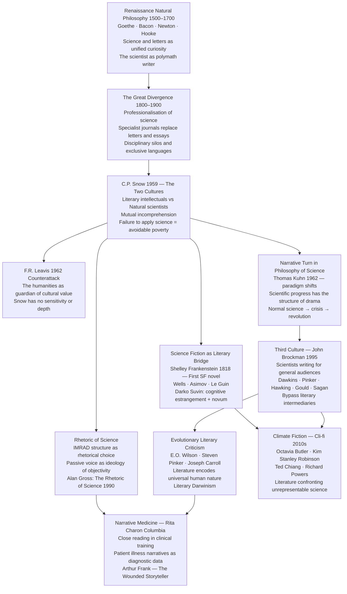

# Literature and Science

> [!abstract] TL;DR
> The relationship between literature and science is not merely a question of which texts belong to which department — it is a live argument about how human beings construct, communicate, and inhabit knowledge: C.P. Snow's 1959 diagnosis of two mutually incomprehensible intellectual cultures catalysed a debate that has expanded into the rhetoric of science, the narrative structure of scientific revolutions, science fiction as a laboratory of ideas, evolutionary literary criticism, and narrative medicine — each strand a different answer to the question of whether the two cultures can ever genuinely speak to each other, and what they stand to lose if they cannot.

---

## Intuition

**Analogy:** Imagine two great river systems — literature and science — that once flowed as a single wide current from their shared mountain source (Renaissance natural philosophy, the unified curiosity of a Goethe or a Da Vinci). Then, in the 18th and 19th centuries, the valley narrowed and the river bifurcated: one channel specialized in measurement, replication, and mathematical abstraction; the other in narrative, metaphor, and moral imagination. Over two centuries the channels carved their beds deeper and farther apart until the people on each bank could no longer hear each other shouting across the gorge. C.P. Snow stood at the divide in 1959 and listened to the silence.

This bifurcation is not natural — it is historical. It has a date of origin (the professionalization of science in the 19th century), institutional causes (the research university, peer-reviewed journals, specialist training), and social consequences (scientists who cannot communicate their findings to the public; humanists who cannot understand the science reshaping the world they study). The study of literature and science asks: how did the split happen, what has been lost, what bridges have been built, and what would a genuine intellectual reunion look like?

---

## How It Works



The diagram traces two parallel movements from Snow's 1959 diagnosis. The **left strand** — SF, rhetoric of science, cli-fi — asks how literature has always engaged science and what literary forms have evolved to handle scientific content. The **right strand** — the Third Culture, evolutionary literary criticism, narrative medicine — asks how scientific thinking has entered literary studies and clinical practice. Both strands converge at the practical zones where the opposition between literary and scientific knowledge has become most consequential.

---

## Key Concepts

### Secondary Level

**C.P. Snow and the Two Cultures Diagnosis**

Charles Percy Snow (1905–1980) was uniquely positioned to observe the cultural divide he diagnosed: he was both a professional scientist (low-temperature physics, Cambridge) and a published novelist (the *Strangers and Brothers* sequence). His 1959 Rede Lecture, "The Two Cultures and the Scientific Revolution," proposed that Western intellectual life had fractured into two cultures that no longer communicated.

Snow's description was deliberately provocative. When, in the company of literary intellectuals, he mentioned the second law of thermodynamics, he was met with cold silence — equivalent, he argued, to a scientist who had never heard of Shakespeare. Literary intellectuals considered scientific ignorance socially acceptable; Snow saw it as a scandal comparable to functional illiteracy.

The stakes were political as well as cultural. The failure of literary intellectuals to understand science meant they were unable to think clearly about the 20th century's most urgent social question: the development of poor nations. World poverty was scientifically soluble, Snow believed, but literary intellectuals — who set the terms of educated discourse — were blocking that understanding with their indifference to science.

The response to the lecture was immediate and divided:

| Response | Representative | Core Claim |
|----------|---------------|------------|
| Support | Scientists and science educators | Scientific literacy is a democratic necessity |
| Savage rejection | F.R. Leavis (1962) | Snow lacks intellectual depth; his lecture symptomizes the philistinism it claims to diagnose |
| Partial accommodation | Lionel Trilling | The diagnosis is real but more science education ignores the humanistic function of literature |
| Extension | John Brockman (1995) | A "Third Culture" of scientist-writers has already emerged, bypassing literary intellectuals entirely |

**F.R. Leavis's 1962 response** in the *Richmond Lecture* is one of the most ferocious pieces of polemical literary criticism ever written in English. Leavis denied that Snow was a novelist (his books were "not literature") and dismissed his science. More substantively, Leavis argued that the humanities were not a complement to science but its necessary cultural ground — the "realm of human values" that gave scientific progress its direction and meaning. Science without humanistic culture was not neutral but dangerous: it produced the mechanized, dehumanizing efficiency already visible in Soviet industrial planning.

The Leavis-Snow debate has never been fully resolved, because both parties were right about different things: Snow was right that scientific ignorance among educated people is socially costly; Leavis was right that purely scientific training without humanistic education produces moral impoverishment; and both were wrong that the other side had nothing of value to offer.

**Science Fiction as Thought Experiment**

Science fiction (SF) is the literary genre most centrally organized around the encounter between human beings and scientific or technological change. Its generally recognized origin is Mary Wollstonecraft Shelley's *Frankenstein; or, The Modern Prometheus* (1818).

*Frankenstein* establishes the central ethical question of SF in its opening move: Victor Frankenstein uses electrical principles to animate a creature assembled from corpses. He succeeds. The creature lives. Frankenstein then abandons it in horror. The rest of the novel asks: what are the moral responsibilities of a creator toward creation? What happens when scientific ambition outruns ethical reflection? These are not merely fictional questions — they reappear in every biotechnology controversy (IVF, genetic engineering, synthetic biology, AI) that existing moral frameworks were not designed to handle.

H.G. Wells (~1895–1910) brought scientific extrapolation to the center of popular fiction:

| Novel | Scientific Basis | Central Question |
|-------|-----------------|-----------------|
| *The Time Machine* (1895) | Thermodynamics, entropy | Where does civilization lead if its energy runs down? |
| *The War of the Worlds* (1898) | Evolutionary theory | What would it mean to be treated as humans treat animals? |
| *The Island of Doctor Moreau* (1896) | Vivisection, experimental biology | What is the line between human and animal? |
| *The Invisible Man* (1897) | Optics, physics | What does power without accountability produce? |

Wells used science not as decorative backdrop but as the active generator of the moral dilemma — the science *is* the plot. This is the hallmark of what theorist Darko Suvin called **hard SF**: science fiction in which speculation is extrapolated from real scientific principles, and narrative consequences flow from those principles rather than from arbitrary invention.

Suvin's theoretical contribution (*Metamorphoses of Science Fiction*, 1979) gave SF criticism its central vocabulary:

- The **novum** (Latin: "new thing") — the scientifically rational device that creates the story's premise. In *Frankenstein*, the novum is electrical reanimation. In *The Time Machine*, it is a device for temporal displacement. The novum is not magic; it is a scientific or technological possibility, however speculative.
- **Cognitive estrangement** — the alienation effect the novum produces on the familiar world. By introducing something scientifically rational but absent from the present, SF forces the reader to see the familiar world from outside — to estrange what is normally invisible. Wells's Martians make the reader see human colonialism from the colonized perspective.

Contemporary SF and the scientific issues it engages:

| Work | Author | Scientific Issue | Mode |
|------|--------|-----------------|------|
| *The Ministry for the Future* (2020) | Kim Stanley Robinson | Climate change, carbon economics | Near-future policy scenario |
| *Story of Your Life* (1998) | Ted Chiang | Linguistics, Sapir-Whorf hypothesis | Cognitive thought experiment |
| *Oryx and Crake* (2003) | Margaret Atwood | Genetic engineering, corporate science | Dystopian extrapolation |
| *Diaspora* (1997) | Greg Egan | Quantum mechanics, identity | Mathematical hard SF |
| *Parable of the Sower* (1993) | Octavia Butler | Climate change, social collapse | Character-driven near-future |

---

### Undergraduate Level

**The Rhetoric of Science**

The phrase "scientific objectivity" conceals a rhetorical infrastructure. Scientific papers do not describe nature directly — they produce *texts* that argue for particular interpretations of experimental results, constructed according to conventions as rhetorically sophisticated as any legal brief or sermon.

The standard scientific article format — **IMRAD** (Introduction, Methods, Results, And Discussion) — is not a natural or necessary structure for communicating knowledge. It is a historical convention that crystallized in the mid-20th century and makes specific rhetorical choices:

| IMRAD Section | Rhetorical Function |
|---------------|-------------------|
| **Introduction** | Constructs a "problem space," surveys the literature, justifies the current study as filling a gap |
| **Methods** | Performs methodological authority — procedures were rigorous, replicable, controlled; written in passive voice to suggest the experiment conducted itself |
| **Results** | Presents data stripped of interpretation; the choice of what to report and how to visualize it is a rhetorical decision |
| **Discussion** | Interprets findings, hedges claims, acknowledges limitations, situates results in the broader research conversation |

The passive voice is the most discussed rhetorical feature of scientific prose: "The solution was heated to 100°C" rather than "We heated the solution." This is not mere convention — it performs an ideology. The passive voice suggests that the scientist is an instrument through which nature reports itself, rather than an agent making decisions, constructing apparatus, and interpreting results. It enacts the fiction that the scientist's perspective does not shape what is observed.

Alan Gross's *The Rhetoric of Science* (1990) was the foundational text of rhetoric of science as a subdiscipline. Gross argued that scientific discourse is no more transparent than any other form of persuasion: it makes arguments, uses metaphors, constructs personae, and appeals to ethos (institutional authority and credentials), logos (logical structure and statistical significance), and pathos (the research community's shared values of rigor and progress). Science is different from other discourse in the methods it uses to generate and test claims — but the *communication* of those claims is as rhetorical as any other public discourse.

The implications extend to science popularization. When Dawkins writes *The Selfish Gene* (1976) or Sagan writes *Cosmos* (1980), the rhetorical choices are entirely different: metaphor becomes central (DNA as "blueprint," the gene as "selfish"), narrative structure is essential (science as a human drama of discovery), and the *persona* of the scientist-hero replaces passive-voice impersonality. The popular science text is a distinct genre with its own conventions, and those conventions shape what the audience learns about science — and which misconceptions they absorb.

**The Narrative Turn in Philosophy of Science**

Thomas Kuhn's *The Structure of Scientific Revolutions* (1962) is the most influential book in the 20th-century philosophy of science — and it is also, at a structural level, a work of narrative theory. Kuhn proposed that scientific progress does not proceed through the gradual accumulation of facts. It proceeds through discontinuous **paradigm shifts** — dramatic moments in which the entire conceptual framework of a science is replaced.

Kuhn's account of scientific change has the structure of a five-act narrative:

1. **Normal science** — the community works within a shared paradigm; most work is "puzzle-solving" within its boundaries
2. **Anomalies** — results accumulate that the paradigm cannot accommodate; initially set aside or attributed to experimental error
3. **Crisis** — anomalies multiply; the paradigm's authority is seriously challenged; open contest between competing frameworks begins
4. **Revolution** — a new paradigm is proposed that reorganizes the field; a period of conversion in which the community shifts allegiance
5. **New normal science** — the new paradigm becomes the basis for the next phase of puzzle-solving

This is recognizable as the structure of tragedy (crisis and resolution) and, at a larger scale, of the historical novel (a period defined by its relationship to a foundational transformation). The drama of scientific change is structurally literary.

The **narrative turn in philosophy of science** refers to a broader recognition — in Stephen Jay Gould on evolutionary biology, Donna Haraway on primatology, Bruno Latour on laboratory practice — that scientific inquiry is not merely a logical operation on data but a social practice embedded in narrative frameworks: stories about what questions are worth asking, what counts as evidence, and what kind of world the data is embedded in. This does not mean science is "just narrative." It means that the cultural and narrative dimensions of science are constitutive features of how scientific communities function, not impurities to be purged.

**Hard SF versus Soft SF**

The distinction between "hard" and "soft" SF maps roughly onto science as the generative engine of plot versus science as backdrop for social, political, or psychological exploration:

| Category | Definition | Representative Works |
|----------|-----------|---------------------|
| **Hard SF** | Extrapolation from actual or plausible science; scientific detail is load-bearing for the plot | Greg Egan's *Permutation City*, Kim Stanley Robinson's *Mars* trilogy, Ted Chiang's *Story of Your Life* |
| **Soft SF** | Science as setting; emphasis on social, anthropological, or psychological questions | Ursula Le Guin's *The Left Hand of Darkness*, Samuel Delany's *Babel-17* |
| **Speculative Fiction** | Uses speculative premise to examine current social structures without scientific plausibility commitment | Margaret Atwood's *The Handmaid's Tale*, Kazuo Ishiguro's *Never Let Me Go* |

The hard/soft distinction is contested: it risks reproducing a hierarchy that privileges physics and mathematics over biology and social science. Le Guin's anthropological speculation is as rigorously extrapolative as Egan's mathematical speculation, just from different scientific premises. The distinction is most useful as a description of *where in the scientific spectrum* a work draws its novum, not as a qualitative ranking.

---

### Graduate Level

**Does Literature Influence Science? The Feedback Hypothesis**

The standard assumption about the literature-science relationship is asymmetric: science produces knowledge that literature then processes. But there is substantial evidence that the influence runs in the other direction as well.

The most famous example is Charles Darwin's acknowledgment that reading Thomas Malthus's *Essay on the Principle of Population* (1798) gave him the concept of natural selection. Malthus's argument — that population grows geometrically while food supply grows only arithmetically, generating constant competitive pressure — is a demographic and economic argument, not a biological one. Darwin applied it to species variation and saw that the same competitive pressure would differentially select heritable traits that improved survival. A biological mechanism (natural selection) was conceptually derived from a humanistic text (political economy). Gillian Beer's *Darwin's Plots* (1983) extended this insight, showing how *The Origin of Species* is structured as a narrative — nature's hidden agency — that drew on Victorian literary conventions and in turn reshaped them.

Albert Einstein reportedly attributed to Dostoyevsky a formative influence on his capacity for the imaginative thought experiments (*Gedankenexperiment*) that generated special relativity — riding a beam of light, experiencing a falling elevator. Whether or not the anecdote is precisely accurate, it points to a genuine hypothesis: **literary imagination and scientific imagination draw on the same cognitive resources** — the capacity to inhabit a perspective radically different from one's own, to follow a hypothetical scenario to its consequences, to feel the force of a possibility before it has been formalized.

The **embodied simulation hypothesis** (Vittorio Gallese and colleagues, drawing on mirror neuron research) proposes a neurological basis for this intuition: reading fiction activates many of the same neural systems as actually experiencing the events described — motor systems, emotional systems, sensory cortex. If correct, reading fiction is not merely passive consumption of propositions but a form of practice for the neural systems involved in social understanding, creative hypothesis generation, and imaginative scenario construction.

**Conversely — How Scientific Thinking Changes Literary Form**

The influence also runs from science to literary form, reshaping not just subject matter but structural and stylistic possibility:

- **Darwinism and the naturalist novel**: Zola's *Rougon-Macquart* cycle (20 novels, 1871–1893) explicitly modelled itself on Darwinian theory — Zola conceived the novels as an experiment tracing how heredity and environment shaped members of a single family across generations. The naturalist novel is a literary application of scientific method.

- **Freudian psychology and stream of consciousness**: Woolf, Joyce, and Faulkner absorbed the Freudian insight that the most important material of consciousness is associative, fragmented, and desire-driven. Stream of consciousness technique is a literary form for representing a model of mind — it does not merely describe psychology, it enacts it.

- **Relativity and the modernist novel**: Bergson's work on *durée* (the subjective experience of time as continuous flow, against objective clock time) and Einstein's demonstration that simultaneity is relative both fed into modernist fiction's characteristic temporal dislocations — Woolf's one-day novels, Proust's involuntary memory, Faulkner's fragmented chronologies. These are literary attempts to represent what physics and psychology were independently discovering about the nature of time.

- **Chaos theory and the postmodern novel**: The non-linear dynamics of chaos theory — sensitive dependence on initial conditions, the impossibility of long-range prediction in complex systems — provided a scientific vocabulary for what postmodern novelists had been doing formally: DeLillo's contingently crossing narrative lines, Pynchon's entropic social systems, Stoppard's *Arcadia* (1993), which dramatizes the encounter between Newtonian determinism and Romantic unpredictability by literally staging both in the same theatrical space.

**Evolutionary Literary Criticism (Literary Darwinism)**

One of the most contested intersections of science and literary studies is the attempt — associated with E.O. Wilson, Steven Pinker, David Sloan Wilson, and Joseph Carroll — to apply Darwinian evolutionary theory directly to literary texts. The central claims are:

1. Human nature is substantially shaped by natural selection
2. Literature represents human nature — it tells stories about humans acting in ways that reflect evolved motivational systems (kin selection, status competition, mate choice, alliance formation, parental investment)
3. Cross-culturally recurrent themes in literature (love and jealousy, parent-child conflict, alliance and betrayal, status and humiliation) reflect underlying evolved psychology; the study of these themes can be informed by evolutionary biology

**The contestation** has been sustained and powerful:

- **The ethnocentrism objection**: What counts as "great literature" is itself a culturally specific selection process; the canon used to derive "universal human nature" is overwhelmingly Western, white, and male. The universals found may be Western cultural specificities rather than evolutionary universals.
- **The intentional fallacy objection**: Evolutionary criticism bypasses the text's meaning — its historical situation, formal choices, rhetorical specificity — in favour of what it symptomatically reveals about the author's evolved psychology. This risks treating literature as merely a symptom of biology.
- **The indeterminacy objection**: Evolutionary stories are easily generated after the fact (any cultural phenomenon can be given a plausible evolutionary narrative) but are difficult to falsify. The methodology is story-telling, not science.

Nevertheless, evolutionary criticism has produced genuinely interesting observations: the near-universal presence of kinship stories in world literature; the cross-cultural consistency of physical attraction cues in romantic fiction; the function of tragedy as a simulation environment for high-stakes social decisions. The field is most productive when it engages with evolutionary hypotheses as heuristics for generating questions rather than as explanatory mechanisms that override historical and cultural analysis.

**Narrative Medicine**

Rita Charon's development of **narrative medicine** at Columbia University (from the mid-1990s) represents perhaps the most practically consequential intersection of literary studies and science. Charon's argument — developed in *Narrative Medicine: Honoring the Stories of Illness* (2006) — is that clinical medicine is fundamentally a narrative practice and that the clinical skills required for good medicine overlap substantially with the skills developed by literary close reading.

A physician who imposes a diagnostic template onto the patient's narrative rather than hearing what the narrative actually says will miss crucial clinical information. The patient's story contains diagnostic signals: the sequence and timing of symptoms, the metaphors the patient uses to describe pain and dysfunction, the social and emotional context in which the illness occurs. These signals require interpretation — careful, patient, contextually sensitive, attentive to what is said and what is omitted — and this is the skill that literary close reading develops.

Arthur Frank's *The Wounded Storyteller* (1995) provided the theoretical complement. Frank proposed that illness narratives are not merely subjective reports but distinct literary forms with identifiable structures:

| Narrative Type | Structure | Function for the Patient |
|----------------|-----------|--------------------------|
| **Restitution narrative** | "I was well, I became ill, I will be well again" | Most culturally dominant in Western medicine; restores the "normal" life narrative |
| **Chaos narrative** | No sequence, no causality — illness overwhelms narrative order | Reflects genuine loss of coherence; often rejected by clinical interlocutors |
| **Quest narrative** | Illness as a journey that changes the patient; seeks meaning in the experience | Memoir and autobiography; the transformed patient as witness |

Understanding which type of narrative a patient is constructing — and why — is clinically useful. A patient locked in a restitution narrative who is facing a terminal diagnosis will be poorly served by clinical communication designed to reinforce that narrative.

**The Third Culture and Science Communication**

John Brockman's *The Third Culture* (1995) described a phenomenon that had already emerged: the rise of scientists — Dawkins, Pinker, Gould, Hawking, Sagan, Dennett — who communicated directly with educated general audiences, bypassing the literary intellectual intermediaries who had previously shaped public intellectual discourse.

**What the thesis got right**: The rise of popular science as a major publishing category, with scientists producing bestselling books that reach educated general audiences, is real and significant. Dawkins's *The Selfish Gene*, Hawking's *A Brief History of Time*, Pinker's *The Language Instinct*, Sagan's *Cosmos* have been among the most culturally influential texts of the last fifty years.

**What it oversimplified**: The Third Culture has its own rhetorical blind spots — a tendency to oversimplify social science, to extrapolate from biology into ethics without philosophical care, and to treat science as the sole measure of intellectual seriousness. The literary intellectual's critique of scientism is not always mere defensiveness — sometimes it is a legitimate observation that scientific methods are inappropriate for certain questions.

**The actual relationship**: The most productive science communication happens at the intersection — books like Oliver Sacks's neurology-as-narrative, Atul Gawande's surgical memoir, Robert Macfarlane's geology-inflected nature writing, or Rebecca Solnit's environmental essays are neither pure science nor pure literature but hybrid forms that require both scientific knowledge and literary skill to produce and both scientific and literary attentiveness to read fully.

---

## Python Demo

```python
# The Two Cultures Simulation — C.P. Snow (1959)
#
# Model: 100 agents in a 2D "intellectual space"
#   x-axis: science orientation  (0 = none, 1 = maximal)
#   y-axis: humanities orientation (0 = none, 1 = maximal)
#
# Dynamics:
#   Each step, each agent picks a random peer.
#   If cultural leans are aligned (both science- or both humanities-dominant),
#   the agent moves slightly TOWARD the peer  --> attraction / conformity
#   If cultural leans are opposed, the agent moves slightly AWAY  --> polarisation
#
# Intervention at step 100:
#   Five "bridge" agents are introduced at the centre (0.5, 0.5)
#   Their presence attracts adjacent agents from both clusters
#
# Visualisation:
#   Top row: scatter plots at t=0, t=100, t=200
#   Bottom:  cluster-distance time series with bridge intervention marked
#
# Uses numpy and matplotlib only.

import numpy as np
import matplotlib.pyplot as plt
import matplotlib.gridspec as gridspec

np.random.seed(42)

N = 100
STEPS = 200
BRIDGE_STEP = 100
N_BRIDGE = 5

# Initialise: each agent has (science_orientation, humanities_orientation) in [0,1]^2
positions = np.random.rand(N, 2)


def cultural_lean(pos):
    """Positive = science-dominant, negative = humanities-dominant."""
    return pos[:, 0] - pos[:, 1]


def cluster_distance(pos, n_orig):
    """Euclidean distance between science-cluster centroid and humanities-cluster centroid."""
    lean = cultural_lean(pos[:n_orig])
    sci_mask = lean > 0.1
    hum_mask = lean < -0.1
    if sci_mask.sum() < 2 or hum_mask.sum() < 2:
        return np.nan
    sci_ctr = pos[:n_orig][sci_mask].mean(axis=0)
    hum_ctr = pos[:n_orig][hum_mask].mean(axis=0)
    return float(np.linalg.norm(sci_ctr - hum_ctr))


def agent_colours(pos, n_orig):
    """Blue = science-dominant, red = humanities-dominant, grey = bridge zone."""
    lean = cultural_lean(pos[:n_orig])
    return np.where(lean > 0.1, '#1d4ed8',
           np.where(lean < -0.1, '#dc2626', '#9ca3af'))


# --- Main simulation loop ---
snapshots = {}
dist_series = []
pos = positions.copy()

for t in range(STEPS + 1):
    if t in (0, BRIDGE_STEP, STEPS):
        snapshots[t] = pos.copy()

    dist_series.append(cluster_distance(pos, N))

    if t == BRIDGE_STEP:
        bridge = np.clip(
            np.random.normal(loc=0.5, scale=0.04, size=(N_BRIDGE, 2)), 0.0, 1.0
        )
        pos = np.vstack([pos, bridge])

    if t == STEPS:
        break

    n_now = len(pos)
    new_pos = pos.copy()
    for i in range(n_now):
        j = np.random.randint(n_now)
        if i == j:
            continue
        diff = pos[j] - pos[i]
        lean_i = pos[i, 0] - pos[i, 1]
        lean_j = pos[j, 0] - pos[j, 1]
        if lean_i * lean_j < -0.04:       # opposite cultures --> repel
            new_pos[i] -= 0.008 * diff
        else:                             # same culture or bridge --> attract
            new_pos[i] += 0.015 * diff
        new_pos[i] = np.clip(new_pos[i], 0.0, 1.0)
    pos = new_pos


# --- Plotting ---
def draw_snapshot(ax, snap_pos, n_orig, title, has_bridge=False):
    colours = agent_colours(snap_pos, n_orig)
    ax.scatter(snap_pos[:n_orig, 0], snap_pos[:n_orig, 1],
               c=colours, s=35, alpha=0.75, zorder=3)
    if has_bridge and len(snap_pos) > n_orig:
        ax.scatter(snap_pos[n_orig:, 0], snap_pos[n_orig:, 1],
                   c='gold', s=100, marker='*', zorder=5,
                   edgecolors='black', linewidths=0.6, label='Bridge agents\n(Third Culture)')
        ax.legend(fontsize=8, loc='lower right')
    ax.set_xlim(-0.05, 1.05)
    ax.set_ylim(-0.05, 1.05)
    ax.set_xlabel('Science Orientation', fontsize=9)
    ax.set_ylabel('Humanities Orientation', fontsize=9)
    ax.set_title(title, fontsize=10, fontweight='bold')
    ax.axhline(0.5, color='#e5e7eb', lw=0.8, ls='--')
    ax.axvline(0.5, color='#e5e7eb', lw=0.8, ls='--')
    ax.text(0.03, 0.97, 'Humanities\ndominant', transform=ax.transAxes,
            fontsize=7.5, color='#dc2626', va='top', style='italic')
    ax.text(0.60, 0.03, 'Science\ndominant', transform=ax.transAxes,
            fontsize=7.5, color='#1d4ed8', va='bottom', style='italic')
    ax.text(0.52, 0.97, 'Bridge zone\n(Third Culture)', transform=ax.transAxes,
            fontsize=7, color='#374151', va='top', style='italic')
    ax.grid(alpha=0.15)


fig = plt.figure(figsize=(16, 10))
gs = gridspec.GridSpec(2, 3, figure=fig, hspace=0.45, wspace=0.35)
ax_bottom = fig.add_subplot(gs[1, :])

fig.suptitle(
    "The Two Cultures Simulation — C.P. Snow (1959)\n"
    "Science vs. Humanities Orientation in a 100-Agent Intellectual Space",
    fontsize=13, fontweight='bold'
)

draw_snapshot(fig.add_subplot(gs[0, 0]), snapshots[0], N,
              't = 0 : Random Initialisation')
draw_snapshot(fig.add_subplot(gs[0, 1]), snapshots[BRIDGE_STEP], N,
              f't = {BRIDGE_STEP} : Polarised (pre-bridge)')
draw_snapshot(fig.add_subplot(gs[0, 2]), snapshots[STEPS], N,
              f't = {STEPS} : After Bridge Intervention', has_bridge=True)

# Distance time series
dist_arr = np.array(dist_series, dtype=float)
ts = np.arange(len(dist_arr))
valid = ~np.isnan(dist_arr)

ax_bottom.plot(ts[valid], dist_arr[valid], color='#374151', lw=2.0,
               label='Science -- Humanities cluster distance')
ax_bottom.axvline(BRIDGE_STEP, color='gold', lw=2.2, ls='--',
                  label=f'Bridge agents introduced (t = {BRIDGE_STEP})')
ax_bottom.fill_between(ts[:BRIDGE_STEP], dist_arr[:BRIDGE_STEP],
                       where=valid[:BRIDGE_STEP],
                       alpha=0.18, color='#dc2626', label='Polarisation phase')
ax_bottom.fill_between(ts[BRIDGE_STEP:], dist_arr[BRIDGE_STEP:],
                       where=valid[BRIDGE_STEP:],
                       alpha=0.18, color='#1d4ed8', label='Bridge phase')
ax_bottom.set_xlabel('Simulation Step', fontsize=10)
ax_bottom.set_ylabel('Mean Cluster Distance', fontsize=10)
ax_bottom.set_title(
    "Snow's Two Cultures: Intellectual Polarisation and the Bridge Effect\n"
    "Polarisation force drives cultures apart -- Bridge agents partially close the gap",
    fontsize=10
)
ax_bottom.legend(fontsize=9, loc='upper left')
ax_bottom.grid(alpha=0.25)
ax_bottom.set_xlim(0, STEPS)

plt.savefig('two_cultures_simulation.png', dpi=150, bbox_inches='tight')
plt.show()

# Console summary
pre = dist_arr[:BRIDGE_STEP][valid[:BRIDGE_STEP]]
post = dist_arr[BRIDGE_STEP:][valid[BRIDGE_STEP:]]
mean_pre = float(pre.mean()) if len(pre) > 0 else float('nan')
mean_post = float(post.mean()) if len(post) > 0 else float('nan')
pct = 100.0 * (mean_pre - mean_post) / mean_pre if mean_pre > 0 else 0.0

print("\n-- Two Cultures Simulation Results --")
print(f"  Original agents (N):                   {N}")
print(f"  Bridge agents introduced:              {N_BRIDGE} at step {BRIDGE_STEP}")
print(f"  Mean cluster distance pre-bridge:      {mean_pre:.4f}")
print(f"  Mean cluster distance post-bridge:     {mean_post:.4f}")
print(f"  Bridge effect:                         {pct:.1f}% reduction in polarisation")
print(f"  Final cluster distance at t={STEPS}:       {dist_arr[-1]:.4f}")
print("\nInterpretation:")
print("  Pre-bridge: polarisation force drives science- and humanities-dominant")
print("  agents toward opposite corners of the intellectual space.")
print("  Bridge agents (positioned at 0.5, 0.5) attract agents from both clusters,")
print("  reducing the mean centroid distance -- the Third Culture effect.")
print("  Reduction is measurable but incomplete: the two clusters remain distinct,")
print("  consistent with empirical observation that science communication reduces")
print("  but does not eliminate disciplinary segregation.")
```

**What the output demonstrates:**

- At t = 0, agents are uniformly distributed — the pre-disciplinary condition of the Renaissance polymath
- By t = 100, the polarisation force has separated agents into a science-dominant cluster and a humanities-dominant cluster — Snow's diagnosis visualised as a dynamic process
- After bridge agents are introduced at t = 100, the time-series distance curve shows a measurable reduction — the Third Culture effect, partial but real
- The scatter at t = 200 shows that complete integration is not achieved: the two clusters remain distinct but are drawn toward the bridge zone, consistent with the empirical observation that science communication reduces but does not eliminate disciplinary segregation

---

## Real-World Applications

> **Application 1 — Narrative Medicine at Columbia.** Since the mid-1990s, Rita Charon's Programme in Narrative Medicine at Columbia University's College of Physicians and Surgeons has required medical students to take seminars in close reading of literary fiction alongside clinical training. Students read Tolstoy, Chekhov, Virginia Woolf, and physician-writers like William Carlos Williams; they write their own narratives of clinical encounters; they analyse how their own cultural assumptions shape what they notice and miss in patient presentations. Clinical outcomes research associated with the programme has documented improvements in physician-patient communication, diagnostic accuracy, and reduction in physician burnout — demonstrating that literary skills are clinically useful, not as soft supplements to "real" medical training, but as core competencies for clinical reasoning.

> **Application 2 — Ted Chiang and the Philosophy of Science in Fiction.** Ted Chiang's collections *Story of Your Life and Others* (2002) and *Exhalation* (2019) are among the clearest demonstrations in contemporary literature of how rigorous scientific thinking generates genuinely literary fiction. "Story of Your Life" — the basis for the film *Arrival* (2016) — is built on the Sapir-Whorf hypothesis and uses it to generate a narrative about time, causality, and free will. "Exhalation" is built on the second law of thermodynamics and the heat death of the universe, generating a meditation on consciousness and mortality. Chiang's stories do not use science as decoration — the philosophical and emotional content *requires* the scientific premise to be correctly understood. They are the fullest realisation in contemporary fiction of Suvin's ideal: the novum as a conceptually generative device rather than spectacular backdrop.

> **Application 3 — Kim Stanley Robinson and Climate Science Communication.** Robinson's *The Ministry for the Future* (2020) is simultaneously a work of literary fiction and a document of climate policy analysis. Robinson drew on IPCC reports, consultations with economists and scientists at the Institute for New Economic Thinking, and detailed knowledge of institutional mechanisms (carbon coins, geoengineering proposals, central bank interventions) through which climate change might be addressed. The novel has been discussed in policy circles alongside academic papers — the *Financial Times* cited it in coverage of central bank climate policy; climate scientists have recommended it to students as a more effective motivational tool than technical literature. This is not SF as escapism but SF as *anticipatory governance* — a form of social imagination enabling policy conversations that technical documents cannot generate.

> **Application 4 — Dawkins and the Rhetoric of Popularisation.** Richard Dawkins's *The Selfish Gene* (1976) is one of the most rhetorically sophisticated works of science popularisation in history. Dawkins's central innovation was to tell evolutionary biology as a story from the gene's perspective. This metaphor captured public attention, explained complex evolutionary dynamics accessibly, and generated decades of productive research. It also generated significant misunderstanding: the gene is not "selfish" in any motivational sense; the metaphor invites anthropomorphism of a chemical process. Dawkins's book is a case study in both the power of narrative for science communication and its costs — the very precision that makes the story compelling also makes it available for misapplication (the "selfish gene" was invoked to justify social Darwinism in ways Dawkins explicitly repudiated).

> **Application 5 — CRISPR, Bioethics, and the Literary Imagination.** The development of CRISPR-Cas9 gene editing (2012) raised ethical questions — about germline editing, designer children, equitable access to genetic enhancement — that bioethicists, scientists, and policy makers recognized needed broader public deliberation. One of the tools recruited for that deliberation was literary fiction: Huxley's *Brave New World* (1932) was cited in virtually every bioethics discussion of genetic enhancement; Atwood's *Oryx and Crake* (2003) was assigned in bioethics courses; Michael Sandel's *The Case Against Perfection* (2007) drew explicitly on literary examples. This is not decorative citation — it reflects the genuine function of speculative literature as a **moral laboratory**: a space in which the consequences of technically possible scenarios can be imagined and experienced before they are technically achievable.

---

## Common Pitfalls

- **Conflating science fiction with scientific prediction** — SF is not a forecasting technology. Wells and Verne did not "predict" submarines and atomic bombs; they imagined speculative possibilities using the science of their day. Treating SF as proto-prediction misunderstands its genre function (cognitive estrangement, thought experiment) and misses what it actually does: models the ethical and social implications of possibility rather than the technical details of actualization.

- **Reading the rhetoric of science as mere deception** — The insight that scientific communication is rhetorical does not entail that scientific claims are merely rhetorical. The IMRAD structure and passive voice serve genuine epistemic functions (reproducibility, separation of data from interpretation) even while they also perform ideological functions. The critique of scientific rhetoric is most productive when it distinguishes between features that serve the epistemic goals of science and features that distort or obscure.

- **Treating Kuhn's "paradigm shift" as synonymous with "big change"** — In popular usage "paradigm shift" has become synonymous with any significant change in any field. In Kuhn's original use, it names a specific and rare phenomenon: the replacement of the entire conceptual framework of a mature scientific discipline, as in the Copernican revolution, the chemical revolution (Lavoisier), or the Darwinian revolution. Business processes and product strategies do not undergo Kuhnian paradigm shifts.

- **Using "The Two Cultures" as if the debate ended in 1959** — Snow's diagnosis was contextually specific: post-war British university culture with its rigid Oxbridge divide between arts and sciences. The contemporary situation — in which scientists produce bestselling popular books, computational methods are transforming literary studies (digital humanities), and climate science requires political and narrative communication — is substantially different. The two-cultures framework is a useful diagnostic starting point, not a permanent description.

- **Evolutionary literary criticism as biological reductionism** — The most mechanistic versions of Literary Darwinism reduce textual meaning to genetic function: literature exists to transmit fitness-maximising strategies. This is methodologically equivalent to explaining the Sistine Chapel ceiling by noting that it depicts human figures. The evolved cognitive capacities that literature exercises (social intelligence, narrative cognition, emotional simulation) are genuine and interesting; reducing literary meaning to their output is a category error.

- **Assuming narrative medicine requires all medicine to be narrative** — The claim that illness narratives are clinically important does not mean that all clinical reasoning is narrative or that quantitative medicine (RCTs, statistical analysis, genomic data) is insufficiently attentive to patients. Narrative medicine and evidence-based medicine are complementary; the tension between them is productive, not zero-sum.

---

## Related Concepts

- [[Literary_Theory_Overview]] — Provides the broader theoretical context within which science-and-literature studies sit; formalism, structuralism, cultural studies, and poststructuralism all have distinct approaches to the literature-science relationship; rhetoric of science draws on speech act theory and discourse analysis; evolutionary literary criticism is in dialogue (often hostile) with cultural constructivism

- [[Genre_and_Literary_Form]] — Science fiction is a major genre of modern literature; the hard/soft SF distinction maps onto genre theory's long debate about form versus function; Suvin's cognitive estrangement thesis is simultaneously a generic theory and a theory of literary cognition; the emergence of cli-fi as a distinct genre is a real-time test case for Miller's social-action model of genre formation

- [[Modern_and_Contemporary_Literature]] — Modernism's formal innovations (stream of consciousness, fragmented chronology, multiple perspectives) were shaped by scientific revolutions (Freud, Einstein, Bergson); Woolf's engagement with physics and psychology is a case study in how scientific paradigm shifts enter literary form; the contemporary cli-fi genre is the most recent instance of literary form adapting to scientific discovery

- [[Hermeneutics_and_Interpretation]] — Provides the philosophical foundation for narrative medicine's close-reading practice; the hermeneutic circle (part understood through whole, whole through parts) describes the interpretive process that a physician applies to a patient's illness narrative; Ricoeur's theory of narrative identity — the self understood as a narrative construction — is central to understanding why illness threatens personal identity

- [[Classical_Rhetoric_and_Aristotle]] — The rhetoric of science draws directly on classical categories: scientific discourse uses ethos (institutional authority and peer review), logos (statistical significance and logical structure), and pathos (the research community's shared values of rigour and progress); the Aristotelian distinction between demonstrative and rhetorical argument is the predecessor of the modern distinction between proof and persuasion in scientific communication

- [[Postcolonial_Literary_Theory]] — The postcolonial critique of science studies how Western science has been deployed as an instrument of colonial epistemology — the delegitimisation of indigenous knowledge systems, the extraction of traditional biological knowledge without acknowledgment, the Eurocentrism of the scientific canon; this is the most politically charged intersection of literature and science studies, and the one most directly relevant to evolutionary literary criticism's "universalism" claims

- [[Language_and_the_Brain]] — Neurolinguistic research on the brain's response to narrative (default mode network activation, embodied simulation) provides the neuroscientific basis for the claim that literary reading and scientific imagination share cognitive infrastructure; the hypothesis that fiction activates the same motor and emotional systems as actual experience supports both the narrative medicine programme and the embodied simulation account of how literature influences scientific thinking

- [[Corpus_Linguistics]] — Computational corpus analysis of scientific texts (IMRAD structure, hedging language, citation patterns) provides quantitative evidence for the rhetorical claims made in the rhetoric of science tradition; digital humanities methods (topic modelling, stylometric analysis) now apply corpus linguistics tools to literary texts, bridging the two-cultures divide methodologically

- [[Language_and_Thought]] — The Sapir-Whorf hypothesis — that linguistic structure shapes thought — is central to Ted Chiang's "Story of Your Life" and to the broader question of whether scientists trained in different disciplinary languages literally think differently; the relationship between conceptual metaphor, linguistic structure, and scientific cognition connects the rhetoric of science to cognitive linguistics

---

## Review Questions

### Secondary

1. C.P. Snow argued that a literary intellectual who does not know the second law of thermodynamics is as ignorant as a scientist who has never read Shakespeare. Is this a fair comparison? What would it mean to take both kinds of ignorance equally seriously in education — and who would that inconvenience more?

2. Mary Shelley's *Frankenstein* is often called a novel about "scientific hubris." Is the problem that Victor Frankenstein was *wrong* to create life, or that he was *irresponsible* in how he handled his creation? What is the difference between these two charges, and why does it matter for how we think about scientific ethics today?

### Undergraduate

1. Darko Suvin defines science fiction by two features: the novum (a scientifically rational speculative device) and cognitive estrangement (the effect of making the familiar world strange through that device). Apply this framework to one contemporary SF work of your choice. Does the work fit Suvin's definition? If it does, what does cognitive estrangement allow the work to say that conventional realist fiction could not? If it does not, what does the failure of fit reveal about the limits of Suvin's theory?

2. Alan Gross argues that the passive voice in scientific writing performs an ideology of objectivity rather than merely following a stylistic convention. Defend or challenge this claim with reference to a scientific paper you have read. What would be gained and what lost if scientific papers were written throughout in the active voice? Does your answer change depending on the field — physics versus psychology versus medicine?

3. Thomas Kuhn's account of scientific revolutions claims that normal science and revolutionary science are qualitatively different activities and that a scientist inside a paradigm cannot evaluate it by standards external to it. If this is true, what are the implications for science education, for peer review, and for the public's ability to evaluate competing scientific claims in controversies like climate science or vaccine safety?

### Graduate

1. Rita Charon's narrative medicine programme claims that close reading of literary fiction develops the same interpretive skills that physicians need for clinical diagnosis. Construct the strongest version of this argument — drawing on Ricoeur's narrative theory, Gallese's embodied simulation hypothesis, and the documented clinical outcomes — and then identify its most serious theoretical vulnerability. Is the connection between literary skill and clinical skill an identity claim, an analogy claim, or a claim about shared cognitive infrastructure? Does the answer matter for the programme's institutional justification?

2. The evolutionary literary criticism programme (Carroll, Pinker, Wilson) claims that cross-culturally recurrent literary themes reflect underlying evolved psychology, and that this psychology explains both why literature has the content it does and why it is universally valued. The strongest poststructuralist critique is that "universal human nature" is a European Enlightenment construction projected onto the anthropological record and the literary canon, and that what looks universal is Western hegemony in disguise. Is there a version of evolutionary literary criticism that takes the postcolonial critique seriously without abandoning the evolutionary research programme? What would that version look like methodologically?

3. John Brockman's "Third Culture" thesis claims that scientists who write for general audiences have replaced literary intellectuals as the primary definers of public intellectual discourse. Evaluate this claim against the actual sociology of intellectual culture — consider the institutional positions of science communication, the economics of popular science publishing, the role of social media, and the documented effects of science communication on public trust during the COVID-19 pandemic. Does the Third Culture still represent an adequate bridge between Snow's two cultures, or has the rise of post-truth politics, algorithmic media, and organised science denial created a situation that Snow's framework cannot adequately diagnose?

---

## Sources

- [Snow, C.P. (1959/1993). *The Two Cultures*. Cambridge University Press.](https://www.cambridge.org/core/books/two-cultures/7D98C71A26C17A2D57B7B36E1AB78C42)
- [Leavis, F.R. (1962). *Two Cultures? The Significance of C.P. Snow*. Chatto & Windus.](https://archive.org/details/twoculturesignif0000leav)
- [Brockman, J. (1995). *The Third Culture: Beyond the Scientific Revolution*. Simon & Schuster.](https://www.edge.org/conversation/the-third-culture)
- [Suvin, D. (1979). *Metamorphoses of Science Fiction: On the Poetics and History of a Literary Genre*. Yale University Press.](https://yalebooks.yale.edu/9780300024029)
- [Kuhn, T.S. (1962/2012). *The Structure of Scientific Revolutions* (50th Anniversary Ed.). University of Chicago Press.](https://press.uchicago.edu/ucp/books/book/chicago/S/bo13179781.html)
- [Gross, A.G. (1990). *The Rhetoric of Science*. Harvard University Press.](https://www.hup.harvard.edu/catalog.php?isbn=9780674768765)
- [Charon, R. (2006). *Narrative Medicine: Honoring the Stories of Illness*. Oxford University Press.](https://global.oup.com/academic/product/narrative-medicine-9780195340228)
- [Frank, A.W. (1995). *The Wounded Storyteller: Body, Illness, and Ethics*. University of Chicago Press.](https://press.uchicago.edu/ucp/books/book/chicago/W/bo3623583.html)
- [Beer, G. (1983). *Darwin's Plots: Evolutionary Narrative in Darwin, George Eliot and Nineteenth-Century Fiction*. Routledge.](https://www.routledge.com/Darwins-Plots/Beer/p/book/9780521786959)
- [Dawkins, R. (1976). *The Selfish Gene*. Oxford University Press.](https://global.oup.com/academic/product/the-selfish-gene-9780198788607)
- [Chiang, T. (2002). *Story of Your Life and Others*. Tor Books.](https://us.macmillan.com/books/9781101972120/story-of-your-life-and-others)
- [Robinson, K.S. (2020). *The Ministry for the Future*. Orbit Books.](https://www.orbitbooks.net/orbit-excerpts/the-ministry-for-the-future/)
- [Pinker, S. (2002). *The Blank Slate: The Modern Denial of Human Nature*. Viking.](https://www.penguinrandomhouse.com/books/173133/the-blank-slate-by-steven-pinker/)
- [Carroll, J. (2004). *Literary Darwinism: Evolution, Human Nature, and Literature*. Routledge.](https://www.routledge.com/Literary-Darwinism-Evolution-Human-Nature-and-Literature/Carroll/p/book/9780415969987)
- [Csicsery-Ronay Jr., I. (2008). *The Seven Beauties of Science Fiction*. Wesleyan University Press.](https://www.wesleyan.edu/wespress/catalog/9780819568601.html)

---

#LiteratureRhetoric #LiteratureSociety #Science #TwoCultures
