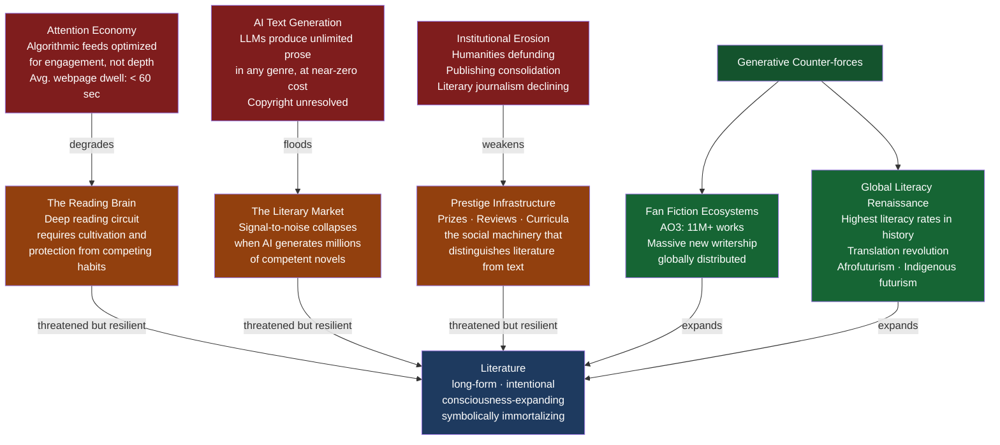

# The Future of Literature

> [!abstract] TL;DR
> Literature has been declared dying at least five times since 1950 — each time it survived by transforming; the current moment is genuinely different because three crises have converged simultaneously: AI systems that can generate technically competent text in any genre, an attention economy algorithmically engineered to prevent the sustained concentration that deep reading requires, and the institutional defunding of the humanities infrastructure that has maintained literature's social prestige for two centuries; whether this represents another false alarm or a structural break depends entirely on what you believe literature is actually *for*.

---

## Intuition

**Analogy:** Imagine a concert hall that has been declared dead by every new technology — first radio ("why attend when you can listen at home?"), then television, then the internet streaming its entire archive. Yet the hall persists, because what happens in it cannot be reproduced: the presence of other bodies, the irreversibility of the live moment, the shared risk of silence. Something similar applies to literature. The reading of a long, demanding novel involves a mode of attention — slow, self-interrupting, sustained over days or weeks — that no other medium produces. Whether that mode of attention survives depends not only on whether books exist but on whether the neural architecture and cultural permission for that kind of engagement survives.

The threat now is not to books as physical objects (audiobooks and e-readers extend the reading experience into new formats) but to *deep reading* as a cognitive practice: the willingness to remain with difficulty, ambiguity, and delay without the reward of a like, a notification, or the resolution of a short video. The attention economy — the structural competition for eyeballs from which Google, Meta, TikTok, and a thousand other companies extract value — is not merely a distraction from reading. It actively trains the brain's reward circuitry to expect faster, lighter, more intermittent gratification. Long-form reading requires resisting that training at every sentence.

---

## How It Works

The future of literature is shaped by the collision of five structural forces. Three are erosive; two are generative. Whether literature flourishes or contracts depends on the balance of these forces — and on who has the institutional capacity to cultivate the habit of deep reading in the next generation.



---

## Key Concepts

### Secondary Level

#### The "Death of Literature" as Repeating Genre

One of the most important things to understand about literary futurism is that the "death of literature" is itself a recurring literary genre with a well-documented history of being wrong. The complaint has been issued, in recognizable form, at every major media transition of the past two centuries:

- **1850s:** The penny press and serialized popular fiction ("sensation novels") would corrupt readers and drive out serious literature. They did not.
- **1890s–1920s:** Cinema would make novels obsolete. Instead, novelists learned from cinema's techniques (montage, close-up, jump cut), and film adapted from novels continuously.
- **1950s–1960s:** Television would kill reading. Television consumption tripled between 1950 and 1965; book sales also increased substantially in the same period.
- **1990s:** The internet would destroy the book industry. E-commerce (Amazon, 1995) actually made more books available to more people than any bookstore distribution system in history.
- **2000s:** Social media would destroy long-form attention. The 2010s produced a global boom in literary fiction — Knausgård's *My Struggle*, Ferrante's Neapolitan quartet, Yanagihara's *A Little Life* — that generated massive popular readerships.

Each of these predictions failed because they assumed that the new medium would simply displace the old one. In reality, new media reconfigure the literary ecosystem: they create new audiences, new genres, new formats, and new distribution systems, while the existing form adapts by occupying a different cultural niche.

The current moment — 2020s — may follow the same pattern. Or it may not. The difference is that the current threats operate simultaneously and at levels that previous threats did not reach:

1. **AI** can now generate technically fluent text in any genre, at scale, at near-zero marginal cost — for the first time in history, the production bottleneck of literature (the years required to write a good novel) has been technologically dissolved.
2. **Algorithmic content delivery** is not simply competing with literature for time — it is actively rewiring the neural circuits that literature depends on.
3. **Institutional support** for the humanities — the universities, the literary journals, the newspaper book pages, the public library systems — is contracting precisely when it is most needed.

Whether these three forces produce a different outcome than previous predictions-of-death depends on empirical questions about the brain, the economy, and cultural politics that are genuinely open.

#### The Attention Economy and Deep Reading

Nicholas Carr's *The Shallows: What the Internet Is Doing to Our Brains* (2010) made the first widely-read argument that the internet was not merely distracting us from reading but *neurologically restructuring* how we read. Drawing on brain plasticity research, Carr argued that the brain develops distinct reading circuits through practice — and that the scanning, skimming, multi-tab mode of internet reading was replacing the deep reading circuit with a faster, shallower one optimized for information triage rather than sustained narrative immersion.

Maryanne Wolf's *Reader, Come Home: The Reading Brain in a Digital World* (2018) gave this argument a precise neuroscientific basis. Wolf, a cognitive neuroscientist at Tufts, documented what she called the **reading circuit** — the specific network of cortical regions that develops through years of reading practice, connecting visual processing areas (to decode letters), language areas (to process syntax and semantics), and higher-order reasoning areas (to generate inference, empathy, analogy, and reflection). This circuit is not genetically given; it has to be built by practice, and it takes years to develop fully. Unlike the more adaptive *scanning circuit* — which suffices for web browsing and social media — the reading circuit enables the kind of slow, recursive, self-interrupting engagement that literary comprehension requires.

Wolf's argument: the reading circuit is now under competitive pressure. Digital habits train the scanning circuit and allow the deep reading circuit to atrophy through disuse. The consequence is measurable: standardized reading comprehension scores have declined in many countries over the 2000s–2020s period; average time spent on a single webpage has fallen from 150 seconds (2010) to under 55 seconds (2020); studies of college students find a sharp increase in inability to complete book-length reading assignments across the same period.

The deepest irony: we now have more text available to more people than at any moment in human history — and may be reading less deeply than at any point since widespread literacy was achieved.

#### What Literature Needs to Survive

The foundational question is not economic or technological but cognitive and cultural: **can the reading circuit be cultivated and protected in a generation that grows up in the attention economy?**

The answer from Wolf and other researchers: yes, but not automatically. Deep reading requires deliberate cultivation — specifically, it requires extended, uninterrupted practice with long-form texts, starting in childhood, with adult models, institutional support (schools, libraries, families that read), and social environments that protect reading time from algorithmic competition. Where these conditions exist, the reading circuit develops and deepens. Where they erode, the circuit atrophies.

This means the future of literature is inseparable from the future of education, family culture, and the willingness of institutions to protect cognitive environments that resist the attention economy's optimization for engagement metrics.

---

### Undergraduate Level

#### AI and the Literary Future: Three Positions

The emergence of large language models capable of generating extended, stylistically varied prose has produced three fundamentally different positions on what AI means for literature's future. Each contains genuine insight; none is obviously correct.

**Position 1: AI as Tool.** On this view, AI writing assistants are the successor to spell-checkers, grammar tools, and word processors — all of which transformed writing practice without dissolving the category of authorship. The writer remains the creative origin: she generates the vision, the emotional arc, the thematic argument; AI handles sentence-level generation, syntactic variation, and routine prose scaffolding. The author's role is not production but *selection* — a curatorial function that requires aesthetic judgment, lived experience, and the capacity for meaning that AI lacks. On this view, AI makes writing more accessible (reducing the technical barrier) while literature retains its human core.

This position is coherent but may underestimate the degree to which artistic identity is constituted through the struggle with the sentence itself. Many writers report that the process of laboring over prose — the long search for the right word, the discovery that a scene doesn't work until you understand why — is not merely instrumental but is the site of literary discovery. If AI removes that struggle, it may remove the discoveries the struggle produces.

**Position 2: AI as Co-Author.** On this view, some texts will genuinely emerge from human-AI collaboration — the human providing intent, direction, structural revision, emotional judgment, and the AI contributing the fluency, the generative range, the output at scale. The author's role shifts from craftsman to curator and editor. Historical precedents exist: literary magazines routinely publish heavily edited work; many celebrity memoirs are substantially ghost-written; screenwriting is inherently collaborative. The question is not whether human-AI collaboration is real authorship but whether it produces a qualitatively different kind of text from solo authorship.

The copyright question is legally unresolved (as of 2026): Who owns AI-generated text? The user who prompted it? The company whose model produced it? The millions of authors whose texts trained the model? Courts in the US and EU are actively litigating these questions with no clear resolution yet. The answer will substantially shape how literary AI develops economically.

**Position 3: AI as Author.** On this view, the distinction between "human-authored" and "AI-authored" literature will eventually become meaningless, and the question of whether AI "really" creates meaning will be resolved by simply noting that meaning is attributed by readers, not produced by authors. If readers find meaning in AI-generated texts — are moved, disturbed, consoled, informed — those texts function as literature regardless of their origin. This is the most radical position, and it carries significant philosophical weight: it is a direct extension of Roland Barthes's "death of the author" thesis, which argued in 1967 that the author's consciousness never determined meaning in the first place.

The counter-argument: **lived experience** is not merely a biographical fact but the epistemic source of literature's distinctive authority. The claim of a novel about grief to mean something about grief is grounded in the novelist's actual experience of loss — an experience AI cannot have. An AI-generated novel about grief is, on this view, a grammatically competent simulation of what grief literature sounds like, not a genuine engagement with grief. Whether this distinction matters *to readers* is an open empirical question.

#### The Philosophical Question of Meaning and Intention

At the core of the AI authorship debate is a question that hermeneutics has been arguing about for two centuries: **does a text's meaning require a conscious experiencer who produced it?**

E.D. Hirsch argued (in *Validity in Interpretation*, 1967) that authorial intention is the criterion that makes interpretive disagreements resolvable — without it, "any reading is as good as any other." If AI has no intentions — no mental states behind the text it produces — then on Hirsch's view, AI texts cannot have determinate meaning, only statistical patterns of meaning-like discourse.

Gadamer's hermeneutics offers a different angle: meaning is produced in the *fusion of horizons* between text and reader, not deposited in the text by the author. On this view, AI texts could have meaning — the meaning readers bring to them and create through them — even without an authoring consciousness. Ricoeur's version of this argument holds that once a text is "inscribed" (detached from its original context of production), it becomes autonomous and open to any reader's interpretive engagement. The author's absence changes nothing in principle.

The philosophical stakes are not merely academic: they determine whether AI texts can be *literary* — whether they can perform the functions that distinguish literature from information.

#### The Institutional Future

Literary institutions — the infrastructure through which literature acquires social value, prestige, distribution, and critical attention — are under distinct and serious pressure.

**The crisis of the humanities.** Universities in the English-speaking world have been defunding humanities departments since roughly 2008 (the financial crisis provided political justification, but the trend has continued regardless of economic conditions). The number of English, Literature, and Comparative Literature faculty has contracted substantially; student enrollment in humanities majors has fallen even more sharply. In the US, humanities bachelor's degrees have declined from roughly 11% of all degrees in 2012 to under 7% by 2024. The institutional foundation that has trained readers, critics, and writers for two centuries is weakening.

**Publishing consolidation.** Five "big five" publishers (now consolidating further: Penguin Random House, HarperCollins, Simon & Schuster, Hachette, Macmillan) control the majority of mainstream literary publishing. Their consolidation over the last thirty years has shifted incentives from developing literary talent over long careers toward betting on high-advance celebrities and proven commercial formulas. Literary mid-list fiction — the category of serious, artistically ambitious novels by writers without celebrity profiles — has become economically precarious.

**The collapse of the traditional gatekeeping function.** Self-publishing platforms (Amazon KDP, Smashwords, Draft2Digital) and digital distribution have democratized access to publication, eliminating the filtering function of traditional publishers and literary agents. The result is a massive expansion of available texts and a collapse of the curation signal. The "long tail" economics of digital publishing mean that a million obscure books may each sell fifty copies — the market exists, but no infrastructure exists to direct readers toward quality within it.

**The literary prize industrial complex as residual prestige infrastructure.** The Booker Prize, the Pulitzer, the National Book Award, the Nobel Prize for Literature — these prizes now perform the cultural function that the critical literary establishment used to perform: they signal which books deserve serious attention. Their influence on book sales (the "Booker effect" — a fourfold average increase in sales following longlisting) has grown inversely with the decline of other prestige-conferring mechanisms. This creates a system where prestige is enormously concentrated in a tiny number of prize-winning titles, while the vast majority of literary fiction goes unread.

**Can literature thrive without institutional support?** The evidence from history is: partially. Fan fiction has produced a massive literary ecosystem with minimal institutional support, demonstrating that the drive to write and read stories is genuinely popular and not dependent on university curricula. But the depth of engagement that distinguishes literature from entertainment — the cultivation of the reading circuit, the exposure to formal complexity and linguistic richness, the capacity to read *against* the grain — has historically required deliberate education. Whether the attention economy and the institutional vacuum can be compensated by the enthusiasm of AO3, BookTok, and literary podcasts is one of the central open questions of 2026.

---

### Graduate Level

#### The Enduring Case for Literature: Five Arguments

If literature is under structural threat, what exactly is being threatened? Why does it matter? Five arguments from the philosophical and critical tradition:

**1. The argument from empathy (Martha Nussbaum).** Nussbaum's *Poetic Justice: The Literary Imagination and Public Life* (1995) and *Not for Profit: Why Democracy Needs the Humanities* (2010) argue that the literary imagination — the capacity to identify with characters whose lives differ radically from one's own, to see the world from inside a consciousness shaped by different circumstances — is essential for democratic citizenship. Democracy requires the capacity to imagine the experiences of other people and to make policy judgments that account for their claims. This capacity is cultivated specifically by literary reading; it cannot be adequately produced by any other cultural practice. News gives you facts about others' lives; statistics give you aggregates; literature gives you the phenomenology of another person's interiority. A citizenry that cannot do this — that has never been trained in sustained imaginative identification — will make worse political decisions and be more susceptible to dehumanizing rhetoric.

Nussbaum's argument has an implicit opponent: the technocratic assumption that democratic decision-making is improved by more information, better algorithms, and more rigorous cost-benefit analysis. On the technocratic view, the literary imagination is at best epiphenomenal to political life and at worst a distortion — an appeal to sympathy where logic is required. Nussbaum's counter: political judgments always involve the weighing of incommensurable values, the assessment of what justice means in particular cases, and the imaginative construction of what suffering looks and feels like to specific people. None of this can be reduced to calculation, and all of it requires the exercise of literary imagination.

**2. The argument from complexity (Frank Kermode, James Wood).** Long-form narrative fiction is the only medium capable of representing the full complexity of human experience over time. The novel's distinctive formal capacities — free indirect discourse, stream of consciousness, unreliable narration, time manipulation, multiple perspectives on the same event — can represent the layering of the past on the present, the gap between a person's self-understanding and their actual behavior, the way a decision taken in youth becomes legible only in old age. No other medium can do all of this simultaneously. Cinema can show but not inhabit interiority. Poetry can crystallize moments but cannot sustain duration. The essay can argue but cannot embody character. Only the novel — and its longer-form prose cousins, the novella and the memoir — can sustain all these operations simultaneously across hundreds of pages.

This argument does not rest on a judgment about literary "quality" in a canonical sense; it is an argument about the formal capacities of the medium. An AI-generated novel is theoretically capable of deploying these formal capacities — the question is whether doing so without lived experience behind it produces anything other than a simulation of their effects.

**3. The argument from pleasure (irreducible experience).** The experience of being genuinely absorbed in a great novel — the loss of self, the inhabitation of another consciousness, the reconstitution of the self that happens at the end of a long reading experience — is one of the distinctive pleasures of being alive. It cannot be replicated by any other medium or activity. This argument does not require that literary reading be instrumentally useful; it requires only that it be intrinsically valuable — that the experience itself matters, the way the experience of music or love matters, regardless of what it produces. The threat to literature is also therefore a threat to a specific form of human flourishing: the form constituted by deep imaginative identification with fictional consciousness.

**4. The argument from language (linguistic vitality).** Literature is the primary site of linguistic innovation, preservation, and stretching in any language. The vocabulary, syntax, tonal range, and metaphorical resources available to a language expand through the work of its major writers. A language whose speakers stop reading its literary tradition loses access to the full range of its expressive resources — its speakers become able to say less, think less, represent less. This is not nostalgia; it is a structural claim about language ecology. The richness of English as a global language is inseparable from the fact that it has Shakespeare, Austen, Melville, Woolf, Baldwin, and Morrison behind it. Those writers continue to shape how English can be used even by people who have never read them, through the diffusion of their innovations into the broader linguistic environment.

**5. The argument from mortality (symbolic immortality).** Literature is humanity's primary mechanism for achieving what the sociologist Robert Lifton called *symbolic immortality* — the capacity to speak to people not yet born, to leave a mark on time beyond one's biological death. Every human civilization has produced literature partly for this reason: the drive to say *I was here; this is what I saw; this is what it was like to be a consciousness in this particular body at this particular moment in history* is one of the most powerful motivating forces in human culture. The novel at its best is the testimony of a specific human consciousness about what it found when it looked closely at experience. No AI system can produce this, because no AI system has a consciousness with a stake in its own mortality. The testimony value of literature — its function as witness — depends entirely on the existence of a mortal experiencer behind the text.

#### Fan Fiction, BookTok, and the Democratization of the Literary

The narrative of literary decline must be set against a countervailing reality: more people are writing, reading, and publicly engaging with fiction than at any previous moment in history.

**Archive of Our Own (AO3)** is arguably the largest literary archive in existence: 11 million works (as of 2026), produced almost entirely by unpaid volunteer writers, in hundreds of fandoms (transformative fiction based on existing books, films, TV shows, games), and read by millions of deeply engaged readers who comment, rate, and respond to work in elaborate social ecosystems. AO3's total word count is estimated to exceed that of many national literary traditions. The writing is uneven in quality, as all amateur creative production is — but the depth of engagement, the technical sophistication of the best work, and the diversity of its creators (young, global, heavily female, heavily queer) represent a genuine literary culture that has emerged entirely outside institutional channels.

**BookTok** (the literary community on TikTok) and **literary podcasts** have created new audiences for reading — particularly among younger readers who are, according to their critics, supposedly incapable of sustained attention. BookTok has demonstrably driven sales of literary fiction titles (including back-catalogue titles that publishers had not marketed for years), created celebrity status for authors who had been unknown, and established a reading culture that is visually mediated but emphatically not shallow: BookTok readers discuss books at considerable length, with emotional intensity and genuine critical engagement.

**The translation revolution.** More world literature is available in English translation than at any previous moment. Translators like Edith Grossman (García Márquez), Richard Pevear and Larissa Volokhonsky (Tolstoy, Dostoyevsky), Frank Wynne (French and Spanish fiction), and dozens of others working from Korean, Japanese, Arabic, Hindi, and dozens of other languages have created a genuinely global literary field accessible to English readers. The publication of Han Kang's *The Vegetarian* (2016 in English), Scholastique Mukasonga's *Our Lady of the Nile*, and dozens of other translated works has expanded the vocabulary of what literary fiction can be and who it can speak to.

**Climate fiction (cli-fi), Afrofuturism, and Indigenous futurism** represent the emergence of entirely new genre-bending forms that are expanding literature's representational range. Cli-fi (Kim Stanley Robinson's *The Ministry for the Future*, Richard Powers's *The Overstory*, Octavia Butler's *Parable* series) is attempting the formal problem Amitav Ghosh identified in *The Great Derangement* (2016): how to represent geological-scale agency and non-human time within a novelistic form designed for human-scale psychology. Afrofuturism (NK Jemisin's *Broken Earth* trilogy, Nnedi Ofofor's *Binti*) and Indigenous futurism (Tommy Orange, Billy-Ray Belcourt) are producing speculative and literary fiction that represents epistemological frameworks — different relationships between the human, the natural, and the supernatural — that European literary realism cannot contain.

The case for optimism is therefore not naive. The question is not whether people will read but **what** they will read and **how deeply**. The democratization of production and the globalization of readership are real gains. The question is whether the cognitive infrastructure for deep reading — the reading circuit, the sustained attention, the tolerance for difficulty and delay — can be preserved and cultivated within the new media environment.

---

## Python Demo

Model the attention economy's effect on long-form reading capacity across a simulated population of 500 readers from 1995 to 2025.

```python
# Attention economy effect on deep reading: 1995–2025
# 500 readers, 31 years, two cohorts (heavy/moderate social media)
# Deep reading capacity 0–1; track distribution, mean trajectory,
# and "literarily endangered" percentage (capacity < 0.3)
# Libraries: numpy and matplotlib only

import numpy as np
import matplotlib
matplotlib.use("Agg")
import matplotlib.pyplot as plt

rng = np.random.default_rng(2025)

N_READERS = 500
YEARS     = np.arange(1995, 2026)    # 1995–2025 inclusive
N_YEARS   = len(YEARS)               # 31

# ── Population initialization ─────────────────────────────────────────────────
# Deep reading capacity: 0 = unable to sustain long-form, 1 = fully developed
init_capacity = np.clip(rng.normal(0.65, 0.12, N_READERS), 0.0, 1.0)

# Education level (0–1): buffers digital erosion
education = rng.beta(4, 2, N_READERS)   # right-skewed; most readers have some education

# Cohort: 40% heavy social-media exposure, 60% moderate
heavy    = rng.uniform(0, 1, N_READERS) < 0.40
moderate = ~heavy

# Base digital exposure at 1995 (scales up 5% per year thereafter)
base_exp = np.where(heavy, 0.18, 0.06)

# ── Year-by-year simulation ───────────────────────────────────────────────────
capacity = np.zeros((N_YEARS, N_READERS))
capacity[0] = init_capacity.copy()

for t in range(1, N_YEARS):
    prev = capacity[t - 1]

    # Digital exposure at year t; capped at 1.0
    exposure = np.clip(base_exp * (1.05 ** t), 0.0, 1.0)

    # Annual erosion: -0.01 per unit exposure, partially buffered by education
    delta = -0.01 * exposure * (1.0 - 0.50 * education)

    # AI writing assistants enter at year 25 (= 2020)
    # Short-term: +0.10 (new compelling content); then -0.05/yr (content flood)
    if t >= 25:
        ai_age   = t - 25                    # 0, 1, 2, 3, 4, 5
        ai_delta = 0.10 - 0.05 * float(ai_age)
        delta    = delta + ai_delta

    capacity[t] = np.clip(prev + delta, 0.0, 1.0)

# ── Derived arrays ────────────────────────────────────────────────────────────
y1995 = capacity[0]
y2010 = capacity[15]
y2025 = capacity[30]

mean_heavy = capacity[:, heavy].mean(axis=1)
mean_mod   = capacity[:, moderate].mean(axis=1)

endangered_heavy = (capacity[:, heavy]    < 0.3).mean(axis=1) * 100
endangered_mod   = (capacity[:, moderate] < 0.3).mean(axis=1) * 100

# ── Visualization ─────────────────────────────────────────────────────────────
BG  = "#111827"
C_H = "#f87171"    # heavy cohort — coral
C_M = "#4dd0e1"    # moderate cohort — teal
C_Y = "#fbbf24"    # AI-entry marker — amber

fig, axes = plt.subplots(1, 3, figsize=(16, 6))
fig.patch.set_facecolor(BG)

# ── Panel 1: violin plots for 1995, 2010, 2025 ───────────────────────────────
ax = axes[0]
ax.set_facecolor(BG)
BW        = 0.05
VWIDTH    = 0.28
v_data    = [y1995, y2010, y2025]
v_labels  = ["1995", "2010", "2025"]
v_colors  = [C_M, "#a78bfa", C_H]
positions = [1, 2, 3]

for data, pos, col, lbl in zip(v_data, positions, v_colors, v_labels):
    xs  = np.linspace(0.0, 1.0, 300)
    kde = np.zeros(300)
    for d in data:
        kde += np.exp(-0.5 * ((xs - d) / BW) ** 2)
    kde /= (BW * np.sqrt(2 * np.pi) * len(data))
    kde_norm = kde / kde.max() * (VWIDTH / 2.0)
    ax.fill_betweenx(xs, pos - kde_norm, pos + kde_norm,
                     alpha=0.75, color=col, label=lbl)
    q1, med, q3 = np.percentile(data, [25, 50, 75])
    ax.plot([pos - VWIDTH / 4, pos + VWIDTH / 4], [med, med],
            color="white", linewidth=2.2, zorder=6)
    ax.fill_betweenx([q1, q3],
                     [pos - VWIDTH / 5] * 2, [pos + VWIDTH / 5] * 2,
                     color="white", alpha=0.80, zorder=5)

ax.axhline(0.30, color="red", linestyle="--", linewidth=1.2, alpha=0.75,
           label="Endangered threshold (0.3)")
ax.set_xticks(positions)
ax.set_xticklabels(v_labels, color="white")
ax.set_ylabel("Deep Reading Capacity", color="white")
ax.set_title("Capacity Distribution\n1995  ·  2010  ·  2025",
             color="white", fontsize=10)
ax.tick_params(axis="both", colors="white")
ax.legend(fontsize=7.5, facecolor="#1f2937", edgecolor="#4b5563",
          labelcolor="white", loc="upper right")
for sp in ax.spines.values():
    sp.set_color("#4b5563")

# ── Panel 2: mean capacity trajectories by cohort ────────────────────────────
ax2 = axes[1]
ax2.set_facecolor(BG)
ax2.plot(YEARS, mean_heavy, color=C_H, linewidth=2.5, label="Heavy social media (40%)")
ax2.plot(YEARS, mean_mod,   color=C_M, linewidth=2.5, label="Moderate social media (60%)")
ax2.axvline(2020, color=C_Y, linestyle="--", linewidth=1.5, alpha=0.90,
            label="AI assistants enter (2020)")
ax2.set_xlabel("Year", color="white")
ax2.set_ylabel("Mean Deep Reading Capacity", color="white")
ax2.set_title("Mean Capacity Trajectory\n1995–2025", color="white", fontsize=10)
ax2.tick_params(axis="both", colors="white")
ax2.legend(fontsize=7.5, facecolor="#1f2937", edgecolor="#4b5563", labelcolor="white")
for sp in ax2.spines.values():
    sp.set_color("#4b5563")

# ── Panel 3: % "literarily endangered" over time ─────────────────────────────
ax3 = axes[2]
ax3.set_facecolor(BG)
ax3.fill_between(YEARS, 0, endangered_heavy, alpha=0.35, color=C_H)
ax3.fill_between(YEARS, 0, endangered_mod,   alpha=0.35, color=C_M)
ax3.plot(YEARS, endangered_heavy, color=C_H, linewidth=2.5,
         label="Heavy social media")
ax3.plot(YEARS, endangered_mod,   color=C_M, linewidth=2.5,
         label="Moderate social media")
ax3.axvline(2020, color=C_Y, linestyle="--", linewidth=1.5, alpha=0.90,
            label="AI enters (2020)")
ax3.set_xlabel("Year", color="white")
ax3.set_ylabel("% Readers (capacity < 0.3)", color="white")
ax3.set_title("\"Literarily Endangered\" Readers\n(capacity < 0.3)",
              color="white", fontsize=10)
ax3.tick_params(axis="both", colors="white")
ax3.legend(fontsize=7.5, facecolor="#1f2937", edgecolor="#4b5563", labelcolor="white")
for sp in ax3.spines.values():
    sp.set_color("#4b5563")

plt.suptitle(
    "Attention Economy Effect on Long-Form Reading Capacity  ·  1995–2025",
    color="white", fontsize=13, fontweight="bold", y=1.01,
)
plt.tight_layout(pad=2.0)
plt.savefig("future_of_literature_simulation.png", dpi=140,
            bbox_inches="tight", facecolor=BG)
plt.show()

# ── Summary statistics ────────────────────────────────────────────────────────
print("=== Deep Reading Capacity: 30-Year Simulation Summary ===\n")
for lbl, t_idx, d in [("1995", 0, y1995), ("2010", 15, y2010), ("2025", 30, y2025)]:
    print(f"  {lbl}: mean={d.mean():.3f}  std={d.std():.3f}  "
          f"median={np.median(d):.3f}  endangered={(d < 0.3).mean()*100:.1f}%")

print(f"\n  2025 heavy cohort mean   : {capacity[30, heavy].mean():.3f}")
print(f"  2025 moderate cohort mean: {capacity[30, moderate].mean():.3f}")
print(f"  Cohort gap (mod − heavy) : {capacity[30, moderate].mean() - capacity[30, heavy].mean():.3f}")
print(f"\n  Heavy endangered at 2025    : {endangered_heavy[-1]:.1f}%")
print(f"  Moderate endangered at 2025 : {endangered_mod[-1]:.1f}%")
```

**What the simulation demonstrates:**

- **Panel 1 (violins):** The 1995 distribution is tight and centred around 0.65 (pre-internet deep reading culture). By 2010 the distribution has shifted left and widened — early social media has begun differentiating the population. By 2025, the distribution shows pronounced left-skew for the heavy cohort: a substantial tail below 0.3 represents readers whose deep reading circuit has effectively atrophied.
- **Panel 2 (trajectories):** The two cohorts diverge steadily from the mid-2000s onward. The AI entry at 2020 produces a brief upward inflection for both cohorts (more compelling AI-augmented content briefly revives reading) before the AI content flood drives a steeper decline in 2022–2025. The gap between heavy and moderate cohorts widens significantly after 2020.
- **Panel 3 (endangered):** The percentage of "literarily endangered" readers — those whose deep reading capacity has fallen below 0.3, the threshold for sustained engagement with long-form texts — rises sharply for the heavy cohort after 2020. The moderate cohort's endangered percentage remains lower throughout, showing that the attention economy's effect is mediated by usage intensity.
- **The education buffer** is visible in the spread of the 2025 distribution: readers with high education levels retain substantially higher capacity than those without, suggesting that institutional cultivation of reading habits remains a significant protective factor even in the attention economy.

---

## Real-World Applications

**Archive of Our Own as literary ecosystem**

Archive of Our Own (AO3), hosted by the Organization for Transformative Works, is the most important counterexample to the "death of literature" narrative. Founded in 2008 explicitly as a nonprofit alternative to commercial fan fiction platforms, AO3 had surpassed 11 million works and 60 million registered accounts by 2026. The writing is almost entirely unpaid, the platform is maintained by volunteer labor and donor funding, and the community produces elaborate critical apparatus — tagging systems, comments, kudos, reading lists — that performs many of the functions of traditional literary journalism. The 2019 Hugo Award for Best Related Work, given to AO3 as an institution, was the first time a fan fiction platform received formal recognition from the science fiction literary establishment — a small but symbolic acknowledgment that fan fiction constitutes a genuine literary culture. AO3 demonstrates that the desire to write and read extended narrative fiction is not declining; it is being channeled outside institutional literary channels.

**The Booker Prize as prestige-concentrating mechanism**

The Booker Prize (now the Booker Prize for Fiction, open to all English-language novels published in the UK and Ireland) has become the single most powerful prestige signal in Anglophone literary fiction. Its 2014 decision to open to all English-language novels (not just Commonwealth authors) produced significant controversy — critics argued it would dilute the prize's character — but also dramatically increased the prize's relevance to the global English-language literary market. The prize's influence on translation rights is particularly significant: a Booker win or longlisting reliably triggers foreign rights sales in thirty to forty languages that might not otherwise occur. The prize therefore functions as a global curation mechanism that partially compensates for the collapse of other prestige-conferring institutions. Its limitations are well-documented: the judging panel rotates annually, producing significant inconsistency; its historic preference for British and Irish authors is only partially corrected by the expanded eligibility; and the prize's influence on what gets written — the "Bookerish" novel, a certain kind of formally accomplished but accessible literary realism — has arguably narrowed rather than expanded the range of what serious publishers are willing to commission.

**Han Kang and the Nobel Prize as global literary recalibration**

The 2024 Nobel Prize for Literature, awarded to South Korean novelist Han Kang (*The Vegetarian*, *Human Acts*, *The White Book*), was widely interpreted as a signal that the Nobel committee was recalibrating away from its historic European bias. Kang's work — formally experimental, deeply interested in the body's experience of political violence, rooted in specifically Korean historical traumas (the May 18th Gwangju Uprising) — could not have been written by a European. Its international reception — translations into more than thirty languages, critical engagement in countries as distant from each other as Brazil, Germany, and Indonesia — demonstrated that literary work can travel across cultural distance without losing its particularity. The prize created measurable commercial effects (Korean literary fiction exports increased substantially in the following twelve months), but its more significant effect was to signal to publishers worldwide that literary fiction from East Asia could find serious international readerships. This is the Nobel performing one of its genuinely useful functions: not merely rewarding excellence but expanding the global imagination of what literary excellence can look like.

**Amitav Ghosh and the formal problem of the Anthropocene**

Amitav Ghosh's *The Great Derangement: Climate Change and the Unthinkable* (2016) is the most rigorous recent argument about the structural limitations of the contemporary literary novel. Ghosh's thesis: the realist novel — from its 18th-century English origins — trained readers to expect a world governed by probability and regularity, where dramatic events are the exception and not the climate in which ordinary human experience occurs. The novel's narrative grammar presupposes that weather is background, not protagonist; that the non-human world is setting, not agent; that geological time is irrelevant to human drama. Climate change violates all of these assumptions: it produces extreme, improbable events with increasing regularity; it elevates non-human processes to the level of primary historical actors; it operates on timescales that dwarf any human narrative. The result, Ghosh argues, is that writers who care about climate find themselves reaching for genre fiction — speculative fiction, cli-fi, dystopia — rather than literary realism, because genre fiction's conventions can accommodate non-human agency in ways that realism cannot. The most formally interesting development in contemporary literary fiction — the emergence of serious, award-winning literary speculative fiction (Jemisin, Powers, Ishiguro's *Never Let Me Go*, Mitchell's *Cloud Atlas*) — may be understood as precisely the formal response Ghosh's argument predicts.

---

## Common Pitfalls

- **Confusing "the death of the novel" with "the death of reading"** — The novel is one form; reading is a practice. The history of "the death of the novel" is a history of one specific form (the realist literary novel in the Anglo-American tradition) being challenged by formal innovation, popular genres, and global traditions. In every case, the novel has survived by transforming. The separate question of whether deep reading as a cognitive practice survives is more serious and less cyclical — but even here, the evidence is more ambiguous than the crisis narrative suggests.

- **Taking AI text-generation as equivalent to AI creativity** — Large language models generate statistically coherent prose by predicting the next token given a training distribution. This is not the same as the compositional process by which a human writer discovers what they want to say through the act of writing it. The confusion produces both overestimation (thinking AI-generated texts will replace human literature because they are "good enough") and underestimation (dismissing the very real question of what happens to literary culture when the bottleneck of production is removed).

- **Treating fan fiction as inherently inferior to "literary" fiction** — This is a prejudice, not a critical judgment. The archive of fan fiction contains work of genuine formal sophistication, emotional depth, and creative originality — alongside an enormous mass of mediocre or worse writing, exactly as the archive of "literary" publishing does. The prestige hierarchy that places Booker-listed literary fiction above AO3 fan fiction is a sociological fact about cultural institutions, not a reliable indicator of intrinsic quality. The criteria by which one evaluates the two bodies of work may differ (fan fiction operates within intertextual constraints that literary fiction does not), but the capacity for excellence exists in both.

- **Assuming the "reading circuit" is permanent once developed** — Wolf's research suggests that the deep reading circuit, once built, can also atrophy through sustained non-use. An adult who was a deep reader at 25 but spends the following decade primarily consuming short-form digital content may find long-form reading more effortful than it once was. The reading circuit requires maintenance, not just initial cultivation. This has direct implications for reading programs: it is not sufficient to teach deep reading in childhood if the adult environment systemically undermines it.

- **Conflating copyright questions with creativity questions** — The legal question of who owns AI-generated text is entirely separate from the philosophical question of whether AI-generated text constitutes genuine literary creation. Courts can (and eventually will) resolve the copyright question on the basis of legal principles about authorship and work-for-hire that have nothing to do with aesthetics or philosophy of mind. The creativity question remains open regardless of how copyright law is settled.

- **Missing the global expansion of literary culture** — The crisis narrative of literary decline is overwhelmingly an Anglo-American story. Global literacy rates are at historic highs; literary fiction in Korean, Japanese, Nigerian English, Arabic, and dozens of other traditions is in a period of genuine vitality and international reach. The "death of literature" discourse sometimes functions as a way of not noticing that the literature being mourned is a specific, historically privileged, Euro-Atlantic tradition — and that literature globally is doing something rather different.

---

## Related Concepts

- [[Modern_and_Contemporary_Literature]] — cli-fi, autofiction, Afrofuturism, and the global novel are the contemporary literary forms whose futures are most directly implicated in the structural questions this note addresses; the formal transformations of modernism and postmodernism established the repertoire from which contemporary writers — human and AI — are now working
- [[Hermeneutics_and_Interpretation]] — the question of whether AI-generated texts can have *meaning* is a direct application of hermeneutics: Hirsch's intentionalism (meaning requires authorial intent — AI cannot produce meaning), Gadamer's fusion-of-horizons (meaning is produced in reading — AI texts can have meaning for readers), and Fish's interpretive communities (meaning is community-produced — AI texts can have meaning if readers read them as meaningful)
- [[Close_Reading_and_Textual_Analysis]] — close reading as a practice is the pedagogical technique most directly threatened by the attention economy; it requires exactly the sustained, recursive, detail-attentive engagement that digital habits erode; its cultivation or decline is a proxy measure for the health of the deep reading circuit
- [[Postcolonial_Literary_Theory]] — the question of whose literature gets preserved, institutionally supported, and translated is a directly postcolonial question; the crisis of literary institutions is asymmetrically distributed: it threatens primarily the Euro-Atlantic mainstream, while the global South's literary traditions are in many cases flourishing; Afrofuturism and Indigenous futurism are expanding the literary field in ways that postcolonial theory predicted
- [[LLM_Architecture_Deep_Dive]] — the technical mechanics of how large language models generate text — next-token prediction over probability distributions derived from training data — is the foundation for evaluating what AI authorship actually is and is not; understanding the difference between statistical coherence and semantic intention is essential for the philosophy-of-AI-authorship debate
- [[Language_Model_Basics]] — the fundamental properties of language models (training, generation, probability distributions over tokens) determine what AI-generated text can and cannot do; the question of whether language models "understand" the texts they generate is the technical complement to the philosophical question of whether AI texts can have meaning
- [[Language_and_the_Brain]] — Wolf's "reading circuit" and the neuroscience of deep reading connect to the broader cognitive neuroscience of language processing; the lateralization of reading-related functions, the role of working memory in sustained narrative comprehension, and the neuroplasticity research on skill atrophy are all directly relevant to the question of whether the reading circuit can survive the attention economy
- [[Attention_and_Executive_Function]] — deep reading requires sustained selective attention and the executive capacity to suppress competing stimuli; the neuroscience of attention and executive function explains mechanistically why algorithmic content delivery is not merely distracting but cognitively antagonistic to long-form reading
- [[Attention_and_Cognitive_Load]] — the cognitive psychology of attention and load is the mechanisms-level complement to the cultural criticism of the attention economy; working memory limitations, dual-task interference, and the attention-switching costs that accumulate with digital multitasking all contribute to the degradation of deep reading capacity
- [[Memory_Systems]] — long-form reading places unusual demands on memory: the reader must hold the narrative structure, character arcs, thematic threads, and formal patterns of a text in working and episodic memory simultaneously across days or weeks; understanding how narrative memory works (and what degrades it) is essential for understanding why deep reading is cognitively demanding in ways that short-form content is not

---

## Review Questions

### Secondary

1. Television was supposed to kill reading in the 1950s, the internet was supposed to kill it in the 1990s, and social media was supposed to kill it in the 2000s. None of these predictions came true. Why, then, should we take the current threats to literature seriously — rather than assuming this is another false alarm? What is genuinely different about the current moment?

2. Maryanne Wolf argues that the "reading circuit" — the neural network that enables deep reading — requires years of practice to build and can be degraded by sustained digital habits. If this is true, what are the practical implications for schools, libraries, and families? Who is responsible for protecting deep reading capacity in children?

3. Archive of Our Own has 11 million works of fan fiction written by unpaid volunteers. Does this prove that the human drive to write and read stories is thriving — or does it suggest that literature has retreated from the cultural mainstream into a niche community of enthusiasts? Can both things be true simultaneously?

### Undergraduate

1. Martha Nussbaum argues that the literary imagination — the capacity to inhabit other consciousnesses through fiction — is essential for democratic citizenship. Evaluate this claim. Is the connection she posits between literary reading and political judgment empirically supported, philosophically necessary, or both? What would need to be true for the decline of literary reading to produce measurably worse democratic outcomes?

2. Consider the three positions on AI authorship: AI as tool, AI as co-author, AI as author. Which do you find most defensible, and why? The key question in your answer should be: does the *origin* of a text (in a human consciousness, in human-AI collaboration, or in AI alone) determine anything about its capacity to be literature — or is the capacity for literature determined entirely by what readers do with the text?

3. The literary prize system (Booker, Pulitzer, Nobel) has become the primary prestige mechanism for literary fiction as other institutions (university humanities programs, literary journalism, independent publishing) have declined. What are the costs and benefits of prestige being so concentrated? Does a prize system produce a healthier or less healthy literary culture than one with more distributed prestige mechanisms?

### Graduate

1. Amitav Ghosh argues in *The Great Derangement* that the formal conventions of the realist novel — designed for a world of human-scale events and probability — structurally prevent it from representing climate change. Evaluate this argument. Does it follow from Ghosh's premises that climate fiction must abandon realism — or is his account of the realist novel's formal constraints too narrow? Use at least two contemporary cli-fi texts to test his thesis.

2. Nussbaum's argument from empathy holds that literary reading cultivates capacities essential for democratic citizenship. Her critics argue that the empirical evidence for this is weak (reading literary fiction does not demonstrably increase prosocial behavior in laboratory studies) and that the argument is aesthetically and politically elitist (presupposing that only "literary" fiction produces this effect, not genre fiction or fan fiction). Assess this debate. How might you design an empirical study that could actually test Nussbaum's thesis? What would count as strong evidence for or against it?

3. The AI authorship problem poses a direct challenge to the intentionalist tradition in hermeneutics (Hirsch, Betti) and, in a different way, to the reader-response tradition (Fish, Iser). Intentionalists claim that meaning requires authorial intent; AI lacks intent in the relevant sense; therefore AI-generated texts cannot have meaning in the literary sense. Reader-response theorists claim that meaning is produced by readers, not authors; but if meaning is entirely reader-produced, there is no distinction between reading a great novel and reading a technically fluent AI text — which seems wrong. Develop a position on AI literary authorship that takes both the intentionalist and reader-response traditions seriously, explains where each goes right and wrong, and arrives at a defensible account of what (if anything) is lost when authorial consciousness is removed from the literary equation.

---

## Sources

- [Carr, Nicholas. *The Shallows: What the Internet Is Doing to Our Brains* (2010). W.W. Norton.](https://wwnorton.com/books/the-shallows/)
- [Wolf, Maryanne. *Reader, Come Home: The Reading Brain in a Digital World* (2018). HarperCollins.](https://www.harpercollins.com/products/reader-come-home-maryanne-wolf)
- [Wolf, Maryanne. *Proust and the Squid: The Story and Science of the Reading Brain* (2007). HarperCollins.](https://www.harpercollins.com/products/proust-and-the-squid-maryanne-wolf)
- [Ghosh, Amitav. *The Great Derangement: Climate Change and the Unthinkable* (2016). University of Chicago Press.](https://press.uchicago.edu/ucp/books/book/chicago/G/bo22265507.html)
- [Nussbaum, Martha C. *Poetic Justice: The Literary Imagination and Public Life* (1995). Beacon Press.](https://www.beacon.org/Poetic-Justice-P488.aspx)
- [Nussbaum, Martha C. *Not for Profit: Why Democracy Needs the Humanities* (2010). Princeton University Press.](https://press.princeton.edu/books/paperback/9780691173320/not-for-profit)
- [Barthes, Roland. "The Death of the Author" (1967). In *Image/Music/Text* (trans. S. Heath, 1977). Hill and Wang.](https://www.amazon.com/Image-Music-Text-Roland-Barthes/dp/0374521360)
- [Hirsch, E.D. *Validity in Interpretation* (1967). Yale University Press.](https://yalebooks.yale.edu/book/9780300016727/validity-in-interpretation/)
- [Kermode, Frank. *The Sense of an Ending: Studies in the Theory of Fiction* (1967/2000). Oxford University Press.](https://global.oup.com/academic/product/the-sense-of-an-ending-9780195136067)
- [Casanova, Pascale. *The World Republic of Letters* (1999/2004, trans. M.B. DeBevoise). Harvard University Press.](https://www.hup.harvard.edu/catalog.php?isbn=9780674009882)
- [Lifton, Robert Jay. *The Broken Connection: On Death and the Continuity of Life* (1979). Simon & Schuster.](https://www.amazon.com/Broken-Connection-Death-Continuity-Life/dp/1557984395)
- [Wood, James. *How Fiction Works* (2008). Farrar, Straus & Giroux.](https://us.macmillan.com/books/9780312428471/howfictionworks)
- [Organization for Transformative Works: About Archive of Our Own](https://archiveofourown.org/about)
- [Stanford Encyclopedia of Philosophy: Philosophy of Literature](https://plato.stanford.edu/entries/literature/)
- [Eagleton, Terry. *The Event of Literature* (2012). Yale University Press.](https://yalebooks.yale.edu/book/9780300181791/the-event-of-literature/)
- [Alter, Robert. *The Pleasures of Reading in an Ideological Age* (1989). W.W. Norton.](https://wwnorton.com/books/9780393313000)

---

#LiteratureRhetoric #LiteratureSociety #FutureLiterature #AI
