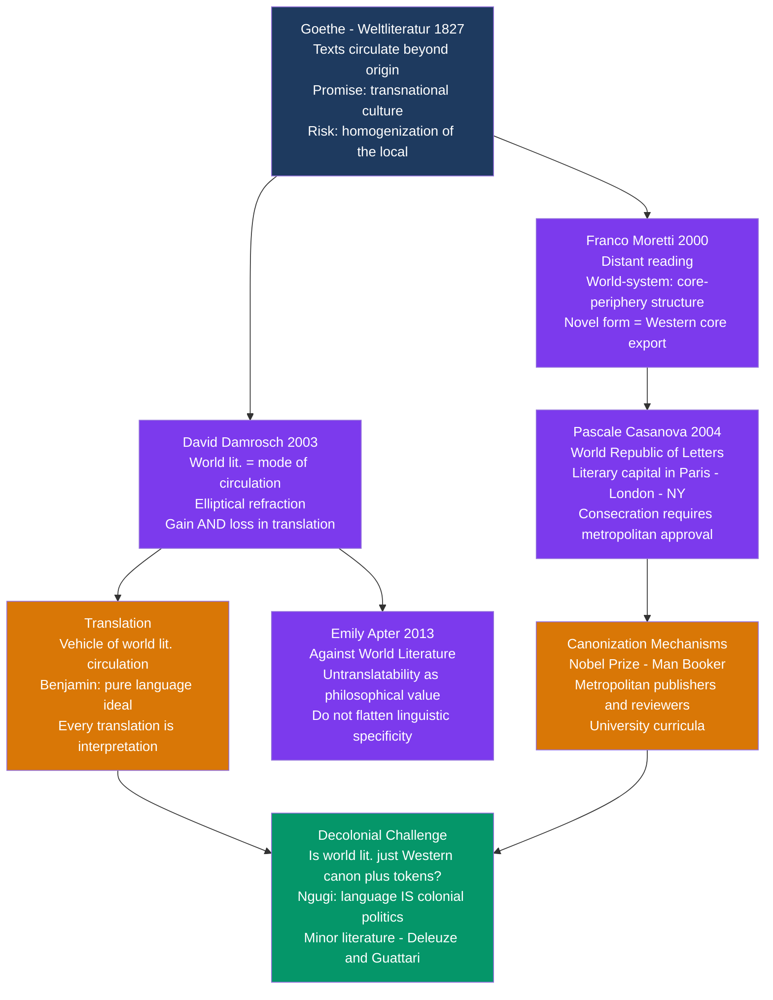

# World Literature and Globalization

> [!abstract] TL;DR
> "World literature" is not a fixed canon of great books from every continent — it is, in David Damrosch's defining formulation, a **mode of circulation**: what happens to texts when they travel beyond the culture that produced them; Goethe coined the concept (*Weltliteratur*, 1827) as a promise of transnational connection, Moretti diagnosed its structural inequality (core Western literatures export form; the periphery receives and adapts), Casanova mapped its institutional power (literary prestige concentrates in Paris and London), and postcolonial critics from Ngugi to Apter asked whether the whole project is liberation or imperialism in academic dress.

---

## Intuition

**Analogy:** Think of a folk tale — the story of Cinderella, or of a clever youngest child who outwits giants, or of a girl who descends into the underworld. The "same" story exists in Chinese, European, West African, Native American, and Pacific Island versions. Each version has absorbed the local ecology, family structure, and moral system. The story gains things in each retelling — richer local imagery, new emotional stakes — and loses things: the Egyptian version loses the glass slipper, the Chinese version loses the European stepmother's social dynamics. The story is not any single version. It is the entire network of transformations, the circuit of circulation, each version slightly refracting the others.

This is David Damrosch's core insight: world literature is not a list of canonical texts but the circuit itself. A text enters world literature not when it is judged "great" by a universal standard but when it begins to travel — to be translated, read across cultural distances, and transformed by new reading contexts. The refraction is not a corruption of the original; it is where world literature actually happens.

---

## How It Works

### Core Mechanics

1. **Goethe's founding moment (1827):** Reading Chinese novels and Serbian folk poetry, Goethe told his secretary Eckermann that "national literature is now a rather unmeaning term; the epoch of world literature is at hand." His vision: as peoples came into contact through trade and travel, their literatures would circulate globally, producing a transnational literary culture that transcended any single language or nation. The concept was utopian but already anxious — Goethe worried that world literature might produce a homogenized global culture that erased the local distinctiveness that made any literature worth reading.

2. **Damrosch's mode of circulation (2003):** His *What Is World Literature?* redefines the object of study. World literature is not a corpus but a practice — the mode in which we encounter texts from other cultures. When a text travels beyond its culture of origin, it undergoes **elliptical refraction**: it enters a new orbit, acquiring meanings it did not have at home and losing some it did have. Translation is the primary vehicle, but refraction occurs in reception even without translation. Damrosch's key claim: world literature both gains and loses in circulation — this is not a problem to solve but the condition of the field.

3. **Moretti's world-system (2000):** Drawing on Wallerstein's world-systems theory, Moretti argued in "Conjectures on World Literature" that the global literary field has a core-periphery structure. The novel form originated in Western Europe (the core) and was adopted by writers in the periphery, who faced a **formal compromise**: the imported form (Western plot structure, psychological interiority, free indirect discourse) did not organically fit local materials (oral traditions, kinship structures, non-linear temporality). The literary initiative — the formal template — always came from the core.

4. **Casanova's literary capital (2004):** *The World Republic of Letters* applies Bourdieu's field theory globally. Literary prestige is not distributed equally — it concentrates in metropolitan centers, historically Paris, now shared with London and New York. Consecration works institutionally: a novel from Lagos enters the world literary circuit when a major French or English publisher translates it, when it wins the Booker or Nobel, when it is assigned in university curricula. A Yoruba-language novel of great power that never crosses this institutional circuit does not enter world literature — not from lack of merit but from structural disadvantage.

5. **Translation as vehicle and problem:** Most readers encounter world literature in translation. Two positions define the debate. Damrosch's optimism: what is gained in accessibility can compensate for what is lost in specificity. Apter's warning (*Against World Literature*, 2013): the pressure for translatability rewards writing that uses globally recognizable tropes and punishes writing whose power is inseparable from its language — the push for world literature can become a push for one global literary register dressed in ethnic costumes.

---

### Theoretical Landscape



---

## Key Concepts

### Secondary Level

**What Is World Literature?**

The simplest answer — world literature is the greatest books from every culture — is also the least useful. It implies a fixed hierarchy of quality that floats free of history, politics, and language. The problems begin immediately: who decides what counts as "great"? Early 20th-century world literature anthologies typically included one Japanese text (*The Tale of Genji*), one Chinese text (*Dream of the Red Chamber*), one Indian text (*Shakuntala*) — texts already validated by European Orientalist scholarship. The texts chosen confirmed existing European aesthetic categories; the vast majority of non-Western literary production remained invisible.

The more useful definition: world literature is **what happens when texts travel beyond their culture of origin**. A text enters the world literary circuit when it is translated, read, reviewed, taught, and argued about in contexts beyond the culture that produced it. This definition is dynamic, not canonical.

**Core vocabulary:**

| Term | Definition |
|------|-----------|
| **Weltliteratur** | German: "world literature." Goethe's 1827 coinage for the anticipated global circuit of literary exchange |
| **Mode of circulation** | Damrosch's definition: world literature is not a corpus but a way texts travel and transform in reading |
| **Elliptical refraction** | Damrosch's metaphor: a text in world literature enters a new orbit and is seen slightly distorted by the new reading context |
| **Distant reading** | Moretti's method: computational analysis of thousands of texts to track global literary patterns rather than close-reading individual works |
| **Core-periphery structure** | Moretti from Wallerstein: a few Western European literatures generate dominant forms; peripheral literatures receive and adapt them |
| **Formal compromise** | Moretti's term: peripheral novelists combine an imported Western form with local materials, producing a hybrid that is neither fully local nor fully Western |
| **Literary capital** | Casanova's Bourdieusian term: the accumulated prestige that certain languages, cities, and publishing institutions possess |
| **Untranslatability** | The property of textual features — phonetic patterning, culturally embedded idiom, polysemy — that resist adequate rendering in another language; Apter elevates this to a philosophical value |
| **Minor literature** | Deleuze and Guattari from Kafka: literature produced in a major language by a minority group, which deterritorializes that language and gives collective voice to marginal experience |

**Goethe's vision and its tensions:** Goethe was not proposing a curriculum. He was making a historical prediction: the movement of goods, people, and ideas across national boundaries would carry literature with it. But his vision contained a tension he partly acknowledged. The most commercially accessible literatures — with the largest publishing industries, the best-funded translation programs — would dominate the circuit. What traveled first and furthest would shape what subsequent readers expected. This is precisely the dynamic Casanova would later map structurally.

---

### Undergraduate Level

#### David Damrosch: Circulation, Refraction, and Gain

Damrosch's *What Is World Literature?* begins from a methodological crisis in comparative literature: no one can possibly read more than a fraction of the world's literary production in the original languages. The response that preceded him — assembling anthologies of "the best" works from each tradition — reproduced the presuppositions it should have questioned.

Damrosch's solution: redefine the object of study. The target of world literary scholarship is not the original text in its native context (that is national literary study) but the **translated, circulating, refracted text** — the work as it encounters new readerships.

**The ellipse metaphor:** An ellipse has two foci, not one. A world-literary text has two foci: its originating culture and its receiving culture. To read a world-literary text is to hold both foci in view — to attend simultaneously to what the text means in its origin and what it means in reception. Most readers do one or the other: they either collapse the distance (reading a foreign text as if it were native) or emphasize it into pure exoticism. The world-literary reader refuses both moves.

**Gain in translation:** Against the assumption that translation involves only loss, Damrosch argues that translation opens genuine gains. A Portuguese reader encountering Chekhov brings a reading competence shaped by different fictional conventions, different relationships to silence and indirection. The encounter produces readings a Russian reader saturated in the original cultural context might not arrive at. Translation opens texts to readings their original languages cannot quite authorize.

**What is lost:** Phonetic texture, wordplay, culturally embedded allusion, syntactic ambiguity — all undergo transformation or disappearance. The question is not whether something is lost (it always is) but whether what is gained justifies the loss. The reader should remain aware of the translation as a translation, not mistake the refraction for the original.

---

#### Franco Moretti: Distant Reading and the World Literary System

Moretti's 2000 essay opened with a challenge: the full corpus of world literature is too vast for any individual to read. There are hundreds of thousands of novels across dozens of literary traditions in dozens of languages. Close reading cannot scale to the global literary record. To understand world literature, we need a different method.

**Distant reading:** Moretti proposed that literary scholars stop being ashamed of working mostly with secondary sources — maps of novelistic geography, graphs of genre prevalence, trees of formal evolution — and recognize that these aggregate methods reveal patterns that close reading misses. Where close reading asks "what does this text mean?", distant reading asks "how did this kind of text come to exist, spread, and change across a century and multiple continents?"

**The world-system of literature:** Moretti made an empirically strong claim: the dominant forms of modern world literature (above all the novel) originated in a small number of Western European centers and diffused outward. Peripheral literary cultures did not independently generate equivalent forms; they received the novel form through translation and imitation and then adapted it to local conditions — producing **formal compromise**. The African, Latin American, or Japanese novelist of the 19th and early 20th centuries inherited a form whose conventions were not derived from local literary history. The novel's assumption of middle-class interior domestic life, its free indirect discourse, its linear plotting of individual development — none of these mapped organically onto oral-tradition cultures or non-individualist philosophies of personhood.

**Reception and critics:** The essay provoked fierce response. Rasheed El-Morssy argued that Moretti had analyzed critics' reports rather than primary texts and reproduced the Eurocentric hierarchy he claimed to analyze structurally. Jale Parla argued that Moretti's account of the Turkish novel was empirically wrong. Jonathan Arac questioned whether "the novel" was unified enough a form for the analysis to hold. The methodological debate continues, but the world-system framework has become one of the field's unavoidable reference points.

---

#### Pascale Casanova: The World Republic of Letters

Casanova applied Bourdieu's theory of cultural fields to the global scale. The international literary field is structured not by merit but by power; literary prestige circulates unequally; the rules are set by the dominant centers.

**Literary capital and its geography:** Paris, Casanova argues, was for three centuries the undisputed capital of the world republic of letters. A writer from any periphery who wanted their work to "count" as literature needed Parisian consecration: publication by a prestigious French press, positive reviews in major French publications, championing by a recognized Parisian literary figure. This was not cultural snobbery but structural reality — the French publishing industry had the translation networks, the reviewing circuits, and the international prestige to make reputations. In the 20th century, with the relative decline of French cultural hegemony, London and New York became co-centers.

**The Nobel Prize as consecration machine:** The Nobel Prize functions as the world literary field's highest consecrating institution. Its political dynamics are instructive: Solzhenitsyn (1970) was awarded partly as a Cold War statement; Soyinka (1986) was the first African laureate; Morrison (1993) the first African-American. Recent awards to Abdulrazak Gurnah (2021) and Mo Yan (2012) reflect increasing recognition of non-Western production — but critics note that the Swedish Academy's evaluative frameworks remain grounded in European literary traditions, and the Nobel consistently rewards writers who have already entered the metropolitan circuit through prior translation and prize recognition. The prize does not discover writers; it consecrates them.

---

#### Translation, Untranslatability, and Emily Apter's Critique

**Walter Benjamin's "The Task of the Translator" (1923):** Benjamin argued that translation is not about conveying content but about recovering what he called the **pure language** (*reine Sprache*) — the underlying linguistic intention that both source and target language attempt, incompletely, to express. No language fully achieves pure language; translation is the attempt to reveal it through the complementarity of two incomplete attempts. This makes translation a philosophical enterprise, not a technical service, and implies that every translation is provisional.

**The politics of translation routes:** The global translation market is dramatically unequal. Approximately 50–60% of all books translated globally each year are translated from English; translations into English represent only 2–3% of books published in the UK and US. A writer in Norwegian or Swahili who wants global reach must first be translated into English. The English translation then shapes all subsequent translations — the English translator has disproportionate power over the global reception of a non-English text.

**Emily Apter's "Against World Literature" (2013):** Apter argues at two levels. Empirically: the drive toward world literature rewards writing that is easily translatable — globally recognizable plots, universally legible psychology, imagery that travels without loss. Writing whose power is inseparable from its language — Arabic poetry, classical Chinese *fu*, the untranslatable puns of *Finnegans Wake* — is systematically disadvantaged. The push for world literature is also a push for a certain kind of writing: accessible, psychologically universal, plot-driven.

Philosophically: untranslatability is not a problem to solve but a value to preserve. The fact that some conceptual structures, some aesthetic experiences, some ways of meaning cannot cross linguistic boundaries is evidence that languages are not parallel encoding systems for the same underlying reality but genuinely different ways of carving up experience. To treat untranslatability as a temporary obstacle that better translation technology will eventually overcome is to miss what it reveals about the nature of language itself.

---

### Graduate Level

#### The Decolonial Challenge: Ngugi, Achebe, and Minor Literatures

The postcolonial critique of world literature asks a deeper question than "are there enough non-Western texts in the curriculum?": does the concept of "world literature" — as institutionally practiced — reproduce the colonial hierarchy it claims to transcend?

**Ngugi wa Thiong'o and the language question:** In *Decolonising the Mind* (1986), Ngugi argued that language is not neutral — it carries the entire cultural world of its users, their epistemological categories, their aesthetic traditions. To write Kenyan experience in English is not a neutral technical choice; it structures that experience through the cognitive framework of a language imposed by conquest. English-language African literature, however formally sophisticated, addresses a global English-language readership while remaining structurally inaccessible to the farmers and workers whose lives it claims to represent. After *Decolonising the Mind*, Ngugi switched to Gikuyu. His novel *Matigari* (1986) circulated in rural Kenya — reportedly being read aloud in homes and marketplaces. Reports reached the Kenyan government of a man called "Matigari" wandering the country preaching against oppression; the government issued an arrest warrant before realizing the character was fictional. The novel was banned. This episode encapsulates the political stakes: writing in English insulates the author within a global literary circuit relatively protected from local state censorship; writing in Gikuyu creates direct political exposure while achieving direct connection to the intended audience.

**Achebe's opposing position:** In "The African Writer and the English Language" (1965), Achebe argued that the choice between indigenous and colonial languages was not as stark. English had become an African language — spoken, transformed, and inhabited by African writers and communities for generations. The task was not to abandon English but to **transform** it: bend it, load it with Igbo proverbs, interrupt it with untranslatable names — so that it carried the weight of African experience without pretending to be a neutral global medium. These positions are not simply contradictory; they identify two different objectives (reaching the global literary circuit vs. reaching the local political community) that are difficult to achieve simultaneously.

**Minor literature (Deleuze and Guattari):** In *Kafka: Toward a Minor Literature* (1975), they developed the concept of **minor literature** — not a literature of minor importance but one produced by a minority group in a major language. Kafka wrote in Prague German — a German inflected by Czech, Yiddish, and the psychic situation of a Jewish intellectual using the language of the Austro-Hungarian bureaucratic power that governed him. Minor literature does three things: it **deterritorializes** the major language (makes it strange, uncomfortable, foreign to itself), it makes the **political** immediately relevant (there is no private literary territory; everything is politically charged), and it takes on a **collective** value (the minor writer speaks not only for themselves but for a people without adequate representation in dominant literary institutions). The framework applies to any literature produced in conditions of cultural marginalization within a dominant language: African-American writing, Chicano literature, Gaelic writing in English, Indian writing in English.

**The "small literatures" problem:** Moretti's world-system raises the question of literatures produced in languages with small numbers of speakers and limited translation resources — Icelandic, Welsh, Catalan, Swahili, Kannada. These literatures may have rich internal traditions but face structural barriers to entering the world literary circuit: too few translators, too few publishers with the relevant language capacity, too few metropolitan reviewers. Casanova's model predicts this: literary capital is concentrated, and small literatures must pass through the consecrating centers of dominant languages to enter the world circuit.

---

#### Computational Approaches and the Limits of Distant Reading

Moretti's distant reading has developed into a substantial research program. The **Stanford Literary Lab** (founded 2010) has produced pamphlets applying computational methods to literary history: tracking the semantic fields of character description across 1,000 novels, mapping the geographic settings of world literary production, analyzing features that distinguish prize-winning from non-prize-winning novels.

Key findings from computational world literature research:
- The geographic center of gravity of world literature publication has shifted eastward over the 20th century, but English-language centers continue to dominate translation markets.
- The Nobel Prize consistently rewards novels over poetry and drama, and works in the European realistic tradition over formally experimental work — suggesting the prize's evaluative framework, despite its claims to cultural universality, operates within a narrow aesthetic range.
- Literary translation flows are asymmetric: high-prestige languages translate from a wide range of sources; low-prestige languages translate almost exclusively from dominant languages, often via English. This reproduces the core-periphery structure at the level of individual translation decisions.

**The limit:** Distant reading can tell us how many novels were published in a given decade and what their formal features were, but it cannot tell us why those novels matter, what they meant to their readers, or what is lost when formal patterns are extracted from the texture of individual reading. Distant and close reading answer different questions; neither is sufficient alone. The debate between them is not methodological but philosophical — about what literary study is for.

---

## Python Demo

```python
"""
Simulating the World-System of Literary Translation (Moretti / Casanova model).

20 fictional national literatures modelled as nodes in a directed translation network.
  - 5 "core" literatures: prestige 7-10 (Western Europe / North America analogues)
  - 15 "peripheral" literatures: prestige 1-5

Translation probability per event:
  source selected proportional to prestige
    (prestigious literatures are translated more -- high out-degree)
  target selected proportional to appetite = 10 - prestige
    (low-prestige literatures import more -- high in-degree)

1 000 translation events are simulated.
Moretti's prediction: positive prestige-vs-out-degree correlation;
negative prestige-vs-in-degree correlation.
"""

import numpy as np
import matplotlib.pyplot as plt
import matplotlib.patches as mpatches

rng = np.random.default_rng(seed=42)

# ----- Setup -----
N = 20
N_CORE = 5
N_EVENTS = 1000

labels = (
    [f"Core-{i+1}" for i in range(N_CORE)]
    + [f"Periph-{i+1}" for i in range(N - N_CORE)]
)

prestige = np.concatenate([
    rng.uniform(7.0, 10.0, N_CORE),
    rng.uniform(1.0,  5.0, N - N_CORE),
])

appetite_raw = 10.0 - prestige           # peripheral literatures import more
source_prob  = prestige / prestige.sum() # source selected proportional to prestige

in_degree    = np.zeros(N, dtype=int)
out_degree   = np.zeros(N, dtype=int)
trans_matrix = np.zeros((N, N), dtype=int)

# ----- Simulate 1 000 translation events -----
for _ in range(N_EVENTS):
    src = int(rng.choice(N, p=source_prob))
    tgt_w = appetite_raw.copy()
    tgt_w[src] = 0.0
    tgt_w /= tgt_w.sum()
    tgt = int(rng.choice(N, p=tgt_w))
    trans_matrix[src, tgt] += 1
    out_degree[src] += 1
    in_degree[tgt]  += 1

node_colors = ["#d97706" if i < N_CORE else "#1e3a5f" for i in range(N)]

# ----- Plot -----
fig, axes = plt.subplots(1, 2, figsize=(14, 6))
fig.suptitle(
    "World-System of Literary Translation\n"
    f"Moretti / Casanova core-periphery model  |  {N_EVENTS} simulated translation events",
    fontsize=11, fontweight="bold",
)

# Left: prestige vs. in/out degree scatter
ax1 = axes[0]
ax1.scatter(prestige, out_degree, marker="^", c=node_colors, s=90,
            alpha=0.9, label="Out-degree (translated FROM)")
ax1.scatter(prestige, in_degree,  marker="o", c=node_colors, s=90,
            alpha=0.5, label="In-degree (translated INTO)")
for i in range(N):
    y_ref = max(out_degree[i], in_degree[i])
    ax1.annotate(labels[i], (prestige[i], y_ref),
                 fontsize=6.5, ha="left", xytext=(3, 2),
                 textcoords="offset points", alpha=0.75)
ax1.set_xlabel("Literary Prestige Score", fontsize=10)
ax1.set_ylabel("Translation Count (out of 1 000 events)", fontsize=10)
ax1.set_title("Prestige vs. Translation Flow Direction", fontsize=10)
core_p = mpatches.Patch(color="#d97706", label="Core lit. (prestige 7-10)")
peri_p = mpatches.Patch(color="#1e3a5f", label="Peripheral lit. (prestige 1-5)")
ax1.legend(handles=[core_p, peri_p], fontsize=8)
ax1.grid(True, alpha=0.3)

# Right: network visualization (prestige on x-axis, random y)
ax2 = axes[1]
np.random.seed(7)
xpos = prestige + np.random.uniform(-0.4, 0.4, N)
ypos = np.random.uniform(0.5, 9.5, N)

THRESHOLD = 3
max_flow = max(trans_matrix.max(), 1)
for i in range(N):
    for j in range(N):
        if trans_matrix[i, j] >= THRESHOLD:
            lw = 0.4 + 2.5 * (trans_matrix[i, j] / max_flow)
            ax2.annotate(
                "", xy=(xpos[j], ypos[j]), xytext=(xpos[i], ypos[i]),
                arrowprops=dict(arrowstyle="-|>", color="#888888",
                                lw=lw, alpha=0.40),
            )

node_sz = 80 + prestige * 35
ax2.scatter(xpos, ypos, s=node_sz, c=node_colors, zorder=3, alpha=0.90)
for i in range(N):
    ax2.annotate(labels[i], (xpos[i], ypos[i]),
                 fontsize=6.5, ha="center", va="bottom",
                 xytext=(0, 7), textcoords="offset points", zorder=4)
ax2.set_xlabel("Prestige (left = low, right = high)", fontsize=10)
ax2.set_title(
    f"Translation Network\n(node size = prestige, edges shown where flow >= {THRESHOLD})",
    fontsize=10,
)
ax2.set_yticks([])
ax2.set_xlim(0, 12)
ax2.grid(True, alpha=0.20)

plt.tight_layout()
plt.savefig("world_literature_network.png", dpi=150, bbox_inches="tight")
plt.show()

# Console summary
print(f"\n{'Literature':<14}  {'Prestige':>9}  {'Out-deg':>8}"
      f"  {'In-deg':>8}  {'Net-flow':>9}")
print("-" * 58)
for i in np.argsort(prestige)[::-1]:
    print(f"{labels[i]:<14}  {prestige[i]:>9.2f}  {out_degree[i]:>8}"
          f"  {in_degree[i]:>8}  {out_degree[i] - in_degree[i]:>+9}")
```

**What the simulation shows:**

- **Out-degree and prestige:** Core literatures (prestige 7–10) are selected as translation sources far more often. Their high prestige drives high out-degree — they are translated frequently into many other literatures. This models the empirical reality that English, French, and German literary production generates far more global translations than any peripheral literature.
- **In-degree and appetite:** Peripheral literatures (prestige 1–5) have high appetite (10 − prestige) and therefore receive more translations — they import more than they export. This models the asymmetric translation flows documented empirically: small-language literatures translate overwhelmingly from dominant-language sources; major-language literatures translate relatively little from small-language sources.
- **Net flow:** Core literatures show strongly positive net flow (out-degree − in-degree): they are net exporters. Peripheral literatures show negative or neutral net flow: they are net importers. The scatter plot makes this structural inequality visible at a glance.
- **The network diagram** shows arrows predominantly flowing from high-prestige to low-prestige nodes, with denser, thicker clusters around core nodes. Peripheral nodes have thinner incoming arrows from a narrower range of sources.

---

## Real-World Applications

> **Haruki Murakami and elliptical refraction:** Murakami is Japan's most internationally translated contemporary novelist, with works in over 50 languages. He is frequently analyzed through Western existentialist frameworks — and this is both a tribute to his translational accessibility and a symptom of refraction. The Murakami that foreign readers receive is the Murakami whose cultural references are most accessible from a position formed by Western literary culture. The Murakami that Japanese readers read — embedded in specific Tokyo neighborhoods, specific popular culture references, specific registers of Japanese that have no English equivalents — is a richer, denser object. Damrosch's elliptical model predicts exactly this: the world-literary Murakami is not the Japanese-literary Murakami but a legitimate and valuable refraction of it.

> **Ngugi's Gikuyu experiment and state censorship:** After *Decolonising the Mind*, Ngugi's novel *Matigari* (1986) circulated in rural Kenya as oral performance as well as print. Reports reached the Kenyan government of a real man called "Matigari" preaching against oppression; the government issued an arrest warrant before discovering he was a fictional character. The novel was banned. This episode encapsulates the stakes of the language choice: writing in English insulates the author within a global literary circuit relatively protected from local censorship; writing in Gikuyu creates direct political exposure while achieving direct connection to the intended community. Ngugi was detained without charge in 1977 and has lived in exile since 1982.

> **The Nobel Prize as consecration mechanism:** In 2021, the Nobel was awarded to Abdulrazak Gurnah, a Tanzanian-born novelist writing in English who had taught at the University of Kent. Before the announcement, Gurnah was not widely known outside specialist African literature circles. Within days, his out-of-print novels were reissued globally, translated into dozens of languages, and assigned in university curricula worldwide. This instantiated Casanova's model precisely: metropolitan institutional consecration transformed a writer's position in the world literary field more dramatically than decades of specialist critical praise.

> **The *Dream of the Red Chamber* problem:** The 18th-century Chinese novel *Hongloumeng* is widely considered the pinnacle of classical Chinese fiction. It has five major English translations, each making radically different choices: the Hawkes/Minford (1973–1986) translation preserves formal density and accepts opacity; the Yang Xianyi (1978) translation prioritizes accessibility. Each translation is a different refraction of the same ellipse. The fierce reader debates about which translation is "best" are themselves evidence of untranslatability: the disagreement is about which losses are acceptable, because some loss is always inevitable.

> **English dominance in global translation routes:** Approximately 50–60% of all books translated globally each year are translated from English; translations into English represent only 2–3% of books published in the UK and US. A writer in Norwegian or Swahili who wants global reach must first be translated into English. The English translation then shapes all subsequent translations into other languages — giving the English translator disproportionate power over the global reception of any non-English text.

---

## Common Pitfalls

- **Treating world literature as a list rather than a process** — the "50 books from 50 countries" approach reproduces the presuppositions it should question: who selected the books, and by what criteria? The more productive approach asks how specific texts circulate, how they are read across distances, and what those readings reveal about the structure of the global literary field.

- **Treating translation as neutral transport** — every translation is a set of decisions reflecting the translator's reading, the target culture's expectations, and market incentives. Reading Dostoevsky in the Constance Garnett translation (Victorian English, smoothing syntactic roughness) is a different experience from reading him in Pevear/Volokhonsky (preserving more of the Russian's forward-lurching energy). Neither is "the real Dostoevsky."

- **Conflating world literature with cosmopolitanism** — the enthusiastic embrace of world literature can shade into a cultural cosmopolitanism that celebrates global circulation while ignoring the structural inequalities that govern it. Damrosch's framework asks how texts circulate, not just that they do; Casanova makes the inequality of that circulation visible. World literature is not inherently progressive.

- **Accepting the Nobel as a quality benchmark** — the Nobel is an important consecration mechanism, but its aesthetic and political criteria have changed substantially over its history and have often reflected geopolitical considerations as much as literary quality. Casanova's structural analysis explains the Nobel's authority without validating it as a judgment of universal merit.

- **Underestimating what Moretti's distant reading loses** — computational methods produce genuinely interesting results at the macro level but are blind to what makes individual texts matter: the specific texture of a sentence, the weight of a particular metaphor, the formal choice that produces an uncanny reading experience. The debate between close and distant reading is philosophical — about what literary study is for — not merely methodological.

- **The token diversity trap** — adding one text from each major cultural region to a syllabus otherwise organized by European literary periodization does not transform the framework; it decorates it. The organizing concepts (Renaissance, Romanticism, Modernism), the default aesthetic criteria, and the close-reading methods remain those of a particular tradition. Genuine engagement requires rethinking the organizing framework, not adding entries.

---

## Related Concepts

- [[Postcolonial_Literary_Theory]] — the single most important adjacent framework; postcolonial theory asks who is represented, whose voice has authority, and how colonial power shapes both literary production and canonization; world literature theory and postcolonial theory are in continuous dialogue, with Casanova and Moretti frequently criticized by postcolonial scholars for insufficiently attending to colonial power.

- [[Globalization_and_Cultural_Change]] — Wallerstein's world-system theory (the direct source for Moretti's literary adaptation), Appadurai's scapes model of uneven cultural flows, and Glissant's creolization concept all recur in world literature theory; the anthropological and literary accounts of globalization's cultural effects are mutually illuminating.

- [[Translation_and_Interpretation]] — since most readers encounter world literature in translation, translation theory is constitutive of the field; Benjamin's philosophy of translation, Nida's equivalence theory, and the debate between foreignization (Venuti) and domestication (Schleiermacher) bear directly on how world literature circulates and what it becomes in transit.

- [[Modern_and_Contemporary_Literature]] — the contemporary global novel (Murakami, Achebe, Rushdie, Bolaño, Pamuk, Adichie) is the primary site where world literature is produced and received; the formal features of magical realism, postcolonial English, and world-historical fiction require the combined frameworks of modernism/postmodernism and world literature theory.

- [[Literary_Theory_Overview]] — world literature theory is a sub-field of literary theory; its relationship to New Criticism (individual text vs. distant reading), formalism (form vs. content in cultural transfer), and reader-response theory (reception and refraction) requires the broader theoretical map.

- [[Colonialism_and_Postcolonial_Anthropology]] — the colonial archive that produced representations of non-Western peoples is also the archive that shaped the initial global reception of non-Western literatures; the anthropological history of colonial knowledge-production illuminates why certain non-Western texts entered the world literary circuit while others were classified as folklore or anthropological document rather than literature.

- [[Migration_and_Diaspora]] — a substantial portion of contemporary world literature is produced by writers in diaspora (the Caribbean British tradition, the South Asian British tradition, the African American tradition, the Latin American exile tradition); the sociology of diaspora and the literary theory of exile writing are structurally related.

- [[Conflict_Theory_and_Critical_Theory]] — Wallerstein's world-system theory (the foundation of Moretti's model) is a neo-Marxist framework; Bourdieu's field theory (the foundation of Casanova's model) is indebted to the Frankfurt School's analysis of the culture industry; understanding these inheritances clarifies the political valence of structural accounts of world literary circulation.

---

## Review Questions

### Secondary

1. Goethe coined "Weltliteratur" partly from reading Chinese novels and Serbian folk poetry — texts he could not read in their original languages and encountered only in translation. What does this founding moment reveal about the relationship between world literature and translation? Is translation a problem for world literature or a precondition of it?

2. If your school had to choose between a world literature course built around a fixed canon of great books from every continent, and one using Damrosch's framework — studying how specific texts circulate and transform as they travel — what would be different in each classroom? Which would you find more valuable, and why?

3. Ngugi wa Thiong'o gave up writing in English and switched to Gikuyu; Chinua Achebe wrote in English but bent and transformed it to carry Igbo experience. Both claimed to be decolonizing African literature. Can both positions be right simultaneously? What would it take to choose between them?

### Undergraduate

1. Damrosch argues that a text can "gain" something in translation even as it loses something. Using either *Dream of the Red Chamber* reaching English readers, or a text you know well in two languages, explain specifically what might be gained and what might be lost. Does Damrosch's model adequately account for the power asymmetry between source and target languages?

2. Moretti's world-system predicts that peripheral novelists will make a "formal compromise" between an imported Western form and local content. Assess this claim using two literary examples — consider the Yoruba novel in English, the Latin American *Boom* novel, or the Indian English novel. What does the model explain? What does it fail to explain? Is Moretti's framework a structural insight or a reproduction of the Eurocentrism it claims to analyze?

3. Casanova argues that a writer from the literary periphery cannot enter the world literary circuit without metropolitan consecration. What evidence from the contemporary literary field supports this claim? What evidence might count against it? Does the rise of social media and digital self-publishing change the structure Casanova described?

### Graduate

1. Apter's *Against World Literature* (2013) argues that untranslatability is a philosophical and political value — that the pressure toward translatable, globally accessible literature is homogenizing and epistemically dangerous. Reconstruct her argument carefully and assess it: is Apter's defense of untranslatability itself a cosmopolitan gesture — requiring a multilingual reader to appreciate it — and if so, does this undermine her critique of world literature's cultural politics?

2. Moretti's application of Wallerstein's world-system theory to literary history has been criticized for reproducing Eurocentrism in structural-analytical guise, for empirical inaccuracy in its accounts of specific peripheral literatures, and for methodological reductionism. Assess these criticisms: does the world-system model illuminate something real about the global circulation of literary form that no other framework captures? If the model's structural truth is accepted, what follows for the practice of literary scholarship and pedagogy?

3. "World literature" can mean: (a) a universal canon of the greatest texts from every culture; (b) a mode of reading attending to how texts transform in circulation (Damrosch); (c) the aggregate corpus of all literary production globally (Moretti); or (d) an institutional field structured by unequal cultural capital (Casanova). Show how each of Goethe, Damrosch, Moretti, and Casanova fits primarily into one of these definitions. Then argue — drawing on postcolonial theory, translation studies, and at least two specific literary examples — for the definition most adequate to the political, aesthetic, and pedagogical demands of 21st-century literary education.

---

## Sources

- [Damrosch, David. *What Is World Literature?* Princeton University Press, 2003.](https://press.princeton.edu/books/paperback/9780691049489/what-is-world-literature)
- [Moretti, Franco. "Conjectures on World Literature." *New Left Review* 1 (Jan–Feb 2000): 54–68.](https://newleftreview.org/issues/ii1/articles/franco-moretti-conjectures-on-world-literature)
- [Casanova, Pascale. *The World Republic of Letters* (1999). Trans. M.B. DeBevoise. Harvard University Press, 2004.](https://www.hup.harvard.edu/catalog.php?isbn=9780674021853)
- [Apter, Emily. *Against World Literature: On the Politics of Untranslatability*. Verso, 2013.](https://www.versobooks.com/products/175-against-world-literature)
- [Ngugi wa Thiong'o. *Decolonising the Mind: The Politics of Language in African Literature*. Heinemann, 1986.](https://en.wikipedia.org/wiki/Decolonising_the_Mind)
- [Benjamin, Walter. "The Task of the Translator" (1923). In *Illuminations*, ed. Hannah Arendt. Schocken Books, 1969.](https://en.wikipedia.org/wiki/The_Task_of_the_Translator)
- [Achebe, Chinua. "The African Writer and the English Language" (1965). In *Morning Yet on Creation Day*. Anchor Press, 1975.](https://en.wikipedia.org/wiki/Chinua_Achebe)
- [Deleuze, Gilles, and Felix Guattari. *Kafka: Toward a Minor Literature* (1975). Trans. Dana Polan. University of Minnesota Press, 1986.](https://www.upress.umn.edu/book-division/books/kafka)
- [Wallerstein, Immanuel. *The Modern World-System I*. Academic Press, 1974.](https://en.wikipedia.org/wiki/The_Modern_World-System)
- [Goethe, Johann Wolfgang von. Remarks on Weltliteratur to Eckermann (1827). In *Goethe's World View*, ed. Frederick Ungar. Frederick Ungar Publishing, 1963.](https://en.wikipedia.org/wiki/Conversations_with_Eckermann)
- [Venuti, Lawrence. *The Translator's Invisibility: A History of Translation*. Routledge, 1995.](https://www.routledge.com/The-Translators-Invisibility-A-History-of-Translation/Venuti/p/book/9780415806473)
- [Prendergast, Christopher, ed. *Debating World Literature*. Verso, 2004.](https://www.versobooks.com/products/1741-debating-world-literature)

---

#LiteratureRhetoric #LiteratureSociety #WorldLiterature #Globalization
