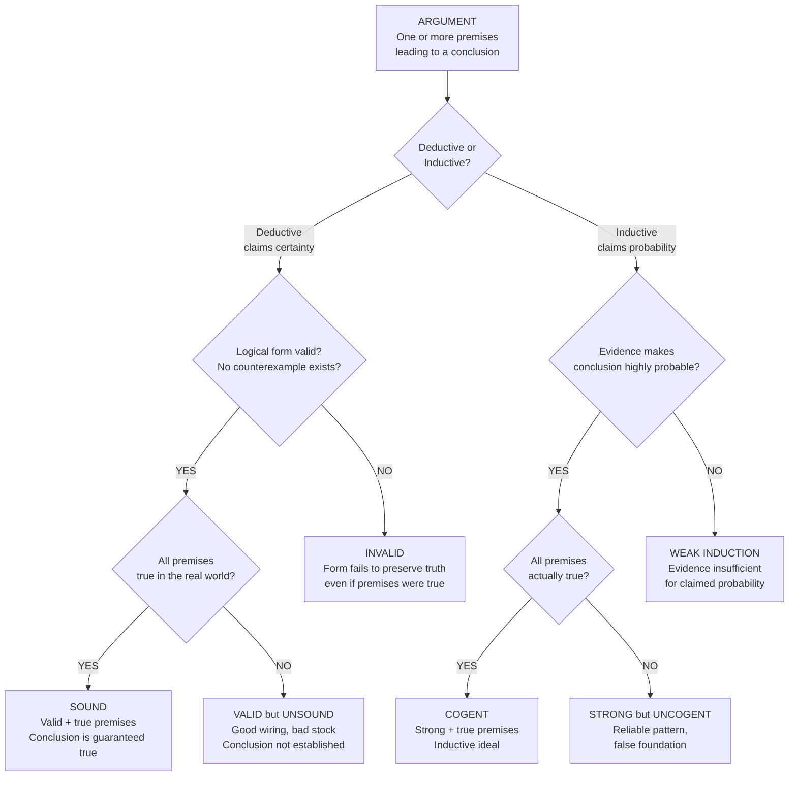

# Arguments, Validity, and Soundness

> [!abstract] TL;DR
> An argument is a set of premises offered as reasons for a conclusion; a deductive argument is **valid** when its logical form guarantees that true premises cannot produce a false conclusion, and **sound** when it is valid AND all its premises are actually true. Mastering this distinction — between good logic and true content — is the single most important skill in critical thinking, because it separates the question "does the conclusion follow?" from "should I believe the conclusion?"

---

## Intuition

**Analogy:** Imagine a vending machine. You insert a coin (premise), press button B3 (premise), and the machine dispenses a chocolate bar (conclusion). The machine's *mechanism* is like logical form — if the wiring is correct, coins + B3 always yield chocolate, regardless of what brand of chocolate is inside. A valid argument is a machine whose wiring is perfect: if real coins go in, real chocolate must come out. A sound argument adds the guarantee that the coins are genuine and B3 is actually stocked — the real world matches the mechanism.

Now consider: someone hands you a machine that looks identical but is secretly wired to drop chocolate only *sometimes* when coins are inserted. The machine is **invalid** — you cannot rely on the output even with correct inputs. Or consider a perfectly wired machine stocked with imaginary chocolate: the mechanism is flawless (valid), but the output is still fake (unsound). These two failure modes — broken wiring vs. bad stock — map exactly onto invalidity vs. unsoundness.

---

## How It Works

### Argument Anatomy

Every argument has exactly two components:

1. **Premises** — statements offered as evidence or reasons (P1, P2, …, Pn). Premises are truth-bearers: they are either true or false in the real world.
2. **Conclusion** — the statement the argument is trying to establish. It is distinguished by inference indicators: *therefore*, *thus*, *hence*, *it follows that*, *so*.

Identifying which statements are premises and which is the conclusion is the first non-trivial skill: natural language buries argument structure in narrative, and the same sentence can be a premise in one argument and a conclusion in another.

### Deductive Validity

A deductive argument is **valid** if and only if it is *impossible* for all premises to be true and the conclusion false simultaneously — or equivalently, every truth-value assignment that makes all premises true also makes the conclusion true.

> **Crucial insight:** Validity is a property of the *logical form*, not the *content*. The argument "All unicorns are blue; Pegasus is a unicorn; therefore Pegasus is blue" is **valid** — the form preserves truth — even though both premises are false. The word "valid" in formal logic does not mean "good" or "convincing." It means truth-preserving.

**Formal test (counterexample method):** To show an argument is *invalid*, produce a **counterexample** — a scenario in which all premises are true but the conclusion is false. One counterexample is sufficient to defeat any claim of validity.

### Soundness

A deductive argument is **sound** if and only if:
1. It is **valid** (form preserves truth), AND
2. All its **premises are true** (in the actual world).

Sound arguments guarantee a true conclusion. This is the gold standard for deductive reasoning. Note: you cannot have a sound argument with a false conclusion — validity plus true premises logically compel a true conclusion.

### Inductive Strength and Cogency

Inductive arguments do not claim to *guarantee* the conclusion, only to make it *probable*. The parallel terms are:

| Property | Deductive | Inductive |
|----------|-----------|-----------|
| Good logic | Valid | Strong |
| Good logic + true premises | Sound | Cogent |

An **inductively strong** argument is one where, if the premises are true, the conclusion is *highly probable* (not certain). A **cogent** argument is strong with actually true premises.

### Formal vs Material Validity

- **Formal validity** (logical form) — captured by argument schemas such as modus ponens. Any substitution of actual content into the schema yields a valid argument.
- **Material validity** — validity that depends on the meaning of specific non-logical terms (e.g., "It is raining; therefore the ground is wet" is materially valid because of the causal relationship between rain and wet ground, not purely formal structure).

---

### Argument Evaluation Flowchart



---

### Standard Valid Argument Forms

These four schemas are *formally* valid — any substitution of propositions preserves validity.

**Modus Ponens (MP)**
```
If P then Q
P
∴ Q
```
*Example:* If it is raining then the street is wet. It is raining. Therefore the street is wet.

**Modus Tollens (MT)**
```
If P then Q
Not Q
∴ Not P
```
*Example:* If the server is overloaded then response time exceeds 2s. Response time does not exceed 2s. Therefore the server is not overloaded.

**Hypothetical Syllogism (HS)**
```
If P then Q
If Q then R
∴ If P then R
```
*Example:* If we cache aggressively then memory usage rises. If memory usage rises then GC pressure increases. Therefore if we cache aggressively then GC pressure increases.

**Disjunctive Syllogism (DS)**
```
P or Q
Not P
∴ Q
```
*Example:* Either the bug is in the frontend or the backend. It is not in the frontend. Therefore it is in the backend.

---

### Standard Invalid Argument Forms

These two schemas are formally **invalid** — they have counterexamples.

**Affirming the Consequent (fallacy)**
```
If P then Q
Q
∴ P        ← INVALID
```
*Why invalid:* Q might be true for many reasons other than P. "If it rains the street is wet; the street is wet; therefore it rained" — but a fire hydrant could have caused the wet street.

**Denying the Antecedent (fallacy)**
```
If P then Q
Not P
∴ Not Q    ← INVALID
```
*Why invalid:* Even without P, Q might hold through another cause. "If it rains the street is wet; it is not raining; therefore the street is not wet" — ignores sprinklers, spills, etc.

---

## Code Demo

```python
import numpy as np
import matplotlib.pyplot as plt


def check_validity(var_names, premise_fns, conclusion_fn, title="Argument"):
    """
    Test argument validity across all truth-value combinations.

    Parameters
    ----------
    var_names    : list[str]   — propositional variable names e.g. ["P", "Q"]
    premise_fns  : list[fn]   — each fn(*bools) -> bool encodes one premise
    conclusion_fn: fn          — fn(*bools) -> bool encodes the conclusion
    title        : str         — label shown on the plot

    Returns
    -------
    bool  True if the argument is valid, False otherwise
    """
    n = len(var_names)
    num_rows = 2 ** n

    # Generate all truth-value combinations via bit extraction (no itertools)
    indices = np.arange(num_rows, dtype=np.int32)
    combos = np.array(
        [[(int(indices[r]) >> (n - 1 - k)) & 1 for k in range(n)] for r in range(num_rows)],
        dtype=bool,
    )

    # Evaluate each premise column
    prem_cols = np.column_stack(
        [np.array([fn(*row) for row in combos], dtype=bool) for fn in premise_fns]
    )
    conc_col = np.array([conclusion_fn(*row) for row in combos], dtype=bool)

    all_prems = prem_cols.all(axis=1)          # rows where ALL premises are true
    violation = all_prems & ~conc_col          # rows that falsify validity
    is_valid = not violation.any()

    # --- Build string table ---
    tf = lambda b: "T" if b else "F"
    headers = (
        var_names
        + [f"Prem {i + 1}" for i in range(len(premise_fns))]
        + ["Concl", "All Prems", "Valid Row?"]
    )
    rows_str = [
        [tf(v) for v in combos[i]]
        + [tf(v) for v in prem_cols[i]]
        + [tf(conc_col[i]), tf(all_prems[i]), tf(not violation[i])]
        for i in range(num_rows)
    ]

    # --- Plot ---
    fig, ax = plt.subplots(
        figsize=(max(8, len(headers) * 1.35), max(4, num_rows * 0.6 + 2.2))
    )
    ax.axis("off")

    tbl = ax.table(cellText=rows_str, colLabels=headers, cellLoc="center", loc="center")
    tbl.auto_set_font_size(False)
    tbl.set_fontsize(10)
    tbl.scale(1.2, 1.7)

    HEADER_BG = "#2c3e50"
    VIOLATE   = "#f1948a"   # red   — premises true but conclusion false
    VALID_ROW = "#a9dfbf"   # green — all premises true, conclusion holds
    NEUTRAL_T = "#fdfefe"
    NEUTRAL_F = "#f2f3f4"

    for (ri, ci), cell in tbl.get_celld().items():
        if ri == 0:
            cell.set_facecolor(HEADER_BG)
            cell.set_text_props(color="white", fontweight="bold")
        else:
            di = ri - 1
            if violation[di]:
                cell.set_facecolor(VIOLATE)
                cell.set_text_props(color="#7b241c", fontweight="bold")
            elif all_prems[di]:
                cell.set_facecolor(VALID_ROW)
                cell.set_text_props(color="#1e8449")
            else:
                cell.set_facecolor(NEUTRAL_T if rows_str[di][ci] == "T" else NEUTRAL_F)

    status = "VALID" if is_valid else "INVALID"
    title_color = "#1a7a2e" if is_valid else "#c0392b"
    ax.set_title(
        f"{title}  ——  {status}",
        fontsize=12, fontweight="bold", color=title_color, pad=18,
    )
    plt.tight_layout()
    plt.show()
    return is_valid


# ── Demonstrate four argument forms ──────────────────────────────────────────

# 1. Modus Ponens — VALID
#    Premises: P→Q, P    Conclusion: Q
check_validity(
    var_names=["P", "Q"],
    premise_fns=[
        lambda p, q: (not p) or q,   # P implies Q
        lambda p, q: p,               # P
    ],
    conclusion_fn=lambda p, q: q,
    title="Modus Ponens:  P→Q, P  /  Q",
)

# 2. Modus Tollens — VALID
#    Premises: P→Q, ~Q    Conclusion: ~P
check_validity(
    var_names=["P", "Q"],
    premise_fns=[
        lambda p, q: (not p) or q,   # P implies Q
        lambda p, q: not q,           # not Q
    ],
    conclusion_fn=lambda p, q: not p,
    title="Modus Tollens:  P→Q, ~Q  /  ~P",
)

# 3. Affirming the Consequent — INVALID
#    Premises: P→Q, Q    Conclusion: P
check_validity(
    var_names=["P", "Q"],
    premise_fns=[
        lambda p, q: (not p) or q,   # P implies Q
        lambda p, q: q,               # Q
    ],
    conclusion_fn=lambda p, q: p,
    title="Affirming the Consequent:  P→Q, Q  /  P  [FALLACY]",
)

# 4. Denying the Antecedent — INVALID
#    Premises: P→Q, ~P    Conclusion: ~Q
check_validity(
    var_names=["P", "Q"],
    premise_fns=[
        lambda p, q: (not p) or q,   # P implies Q
        lambda p, q: not p,           # not P
    ],
    conclusion_fn=lambda p, q: not q,
    title="Denying the Antecedent:  P→Q, ~P  /  ~Q  [FALLACY]",
)
```

Running this produces four colored truth tables. Green rows highlight cases where all premises are true — in valid arguments, those rows always have a true conclusion. Red rows are counterexamples: premises all true, conclusion false — present only in invalid forms.

---

## Key Concepts

### Secondary (High School)

- **Premise vs. conclusion** — every argument has statements that give reasons (premises) and a statement being argued for (conclusion). Inference indicators signal the conclusion: *therefore, thus, so, hence, it follows that*.
- **Valid does not mean true** — a valid argument can have false premises and a false conclusion. Validity is about *structure*, not *facts*.
- **Modus Ponens** — the most basic valid form: "If P then Q; P; therefore Q."
- **Modus Tollens** — the second fundamental valid form: "If P then Q; not Q; therefore not P." The contrapositive in action.
- **Counterexample** — a concrete scenario where all premises are true but the conclusion is false; one counterexample destroys any claim of validity.

### Undergraduate

- **Truth-preservation definition** — an argument is valid iff there is no possible world (truth-value assignment) in which all premises are true and the conclusion is false. This is the semantic definition of validity.
- **Soundness theorem** — every sound argument has a true conclusion. Proof: by validity, all-premises-true forces conclusion-true; by soundness definition, all premises are true; therefore conclusion is true. QED.
- **Formal validity schema** — validity that holds in virtue of logical form alone, independent of what the atomic propositions P, Q, R refer to. Valid schemas include MP, MT, HS, DS; invalid schemas include affirming the consequent and denying the antecedent.
- **Inductive strength and cogency** — inductive arguments do not claim certainty. A strong inductive argument is one where true premises would make the conclusion very probable. Cogency requires strength plus true premises.
- **Formal vs material validity** — formal validity: substitution of any content preserves validity (schema-based). Material validity: relies on extra-logical meaning ("John is a bachelor, so John is unmarried" — valid because of the meaning of "bachelor," not logical form).
- **The argument/statement distinction** — validity and soundness are properties of *arguments* (structured sets of statements), not of individual statements. A statement is true or false; an argument is valid or invalid, sound or unsound.

### Graduate

- **Semantic consequence vs. syntactic derivability** — validity defined model-theoretically (P1, …, Pn ⊨ C: no model makes all premises true and conclusion false) is logically distinct from syntactic derivability (P1, …, Pn ⊢ C: there is a proof in a formal system). Gödel's Completeness Theorem (1930) proves these coincide for first-order logic: ⊨ iff ⊢.
- **Monotonicity** — classical deductive validity is monotonic: adding new premises to a valid argument cannot invalidate it. This distinguishes deduction from defeasible reasoning, where additional information can retract conclusions.
- **Non-monotonic and defeasible validity** — in legal, medical, and everyday reasoning, arguments are typically defeasible: "Birds fly; Tweety is a bird; therefore Tweety flies" is defeated by "Tweety is a penguin." Default logic, answer set programming, and abstract argumentation frameworks (Dung 1995) formalize this.
- **Validity in higher-order logics** — in second-order logic, the equivalence between semantic and syntactic consequence breaks: there are second-order valid sentences with no complete proof system (Gödel's incompleteness results). Validity becomes sensitive to the background set theory.
- **Argument strength metrics** — Bayesian epistemology replaces binary strength/cogency with probabilistic strength: an argument is strong to degree P(C | P1 ∧ P2 ∧ … ∧ Pn), lifting the categorical framework into a graded one better suited to scientific inference.

---

## Real-World Applications

1. **Software verification (formal methods)** — tools like Coq, Isabelle, and TLA+ use formal validity to certify that a program or protocol satisfies a specification. A verified proof is a sound argument: every premise (axiom, type rule, protocol invariant) is known true, so the conclusion (no buffer overflow, deadlock freedom) is guaranteed.

2. **Medical diagnosis (modus tollens in practice)** — "If the patient has disease D, then marker M will be elevated. Marker M is not elevated. Therefore the patient does not have disease D." Clinicians implicitly apply MT to rule out conditions, making the form of their diagnostic reasoning as important as their clinical knowledge.

3. **Legal reasoning (burden of proof and counterexamples)** — courts operationalize validity through counterexample challenges: defense counsel demonstrates invalidity of a prosecution inference by constructing a scenario consistent with all the prosecution's evidence but inconsistent with guilt. The adversarial system is a structured counterexample machine.

4. **Automated theorem provers and SAT solvers** — a SAT solver tests whether a propositional formula is satisfiable by systematically exploring truth-value assignments — exactly the truth-table method. Testing argument validity reduces to checking whether the negation of the conclusion is inconsistent with the conjunction of premises (unsatisfiable).

5. **Scientific hypothesis testing** — the hypothetico-deductive method is a chain of modus tollens: "If theory T is true, then observation O follows; O is not observed; therefore T is false (or at minimum needs revision)." This is why falsifiability (Popper) is tied to the logical form of scientific inference, not just to empirical accessibility.

---

## Common Pitfalls

- **Conflating validity with truth** — students frequently say "the argument is valid because the premises are true" or "invalid because the conclusion is false." Validity is entirely about form. A wildly false argument (all mammals are reptiles; whales are mammals; therefore whales are reptiles) is formally valid. Keep the two questions strictly separate.

- **Accepting affirming the consequent** — "If you study hard you will pass; you passed; therefore you studied hard" is a seductive but fallacious inference. The conditional only guarantees passage *given* study; it says nothing about what else might cause passage. This fallacy underlies many post-hoc attribution errors.

- **Ignoring implicit premises** — natural language arguments routinely suppress premises (enthymemes). "She has a Harvard degree, so she's obviously competent" suppresses "Harvard graduates are competent." Making implicit premises explicit often reveals where the real argumentative work is being done — and where the argument is most vulnerable.

- **Confusing deductive and inductive standards** — demanding deductive certainty from an inductive argument ("but you can't be *sure* smoking causes cancer") is a category error. Inductive arguments are evaluated on probabilistic strength, not truth-preservation.

- **Assuming sound arguments are persuasive** — validity and soundness are epistemic ideals, not rhetorical guarantees. An interlocutor who rejects a premise will not accept a sound argument. Real persuasion requires the additional step of establishing shared premises — the territory covered by rhetoric and dialectic.

- **Treating syntactic similarity as logical equivalence** — "If P then Q" is NOT the same as "If Q then P" (the converse). These two forms have entirely different validity properties. Confusing a conditional with its converse is the root of the affirming-the-consequent fallacy.

---

## Related Concepts

- [[Argumentation_Theory_and_Dialectic]] — extends the formal validity framework to real-world discourse: Toulmin's model covers warrants, backing, and rebuttals that pure deductive analysis ignores; Dung's abstract argumentation formalizes attack relations between argument graphs.
- [[Classical_Rhetoric_and_Aristotle]] — Aristotle's *Prior Analytics* (syllogistic logic) was the first systematic account of formal validity; his *Rhetoric* then asked what makes an argument *persuasive* — the complement to what makes it logically sound.

---

## Review Questions

**Foundational**
1. An argument has the form "All A are B; all B are C; therefore all A are C." Construct a specific instance with *false premises* and a *true conclusion*. Does your instance show the argument is invalid? Why or why not?

**Applied**
2. A doctor says: "If a patient has appendicitis, their white blood cell count will be elevated. This patient's white blood cell count is elevated. So this patient has appendicitis." Identify the argument form, explain why it is logically invalid, and describe what the doctor should say instead to make a logically defensible inference.

**Advanced**
3. Gödel's Completeness Theorem says that for first-order logic, semantic validity and syntactic provability coincide. Gödel's Incompleteness Theorem says that for any sufficiently powerful consistent formal system, there are true statements that cannot be proved within the system. Are these two results in tension? Explain by carefully distinguishing what each theorem asserts about "truth," "validity," and "provability."

---

## Sources

- Hurley, Patrick J. *A Concise Introduction to Logic*, 13th ed. Cengage Learning, 2018. — The standard undergraduate treatment of validity, soundness, and argument forms (Chapters 1–2).
- Copi, Irving M., Carl Cohen, and Victor Rodych. *Introduction to Logic*, 14th ed. Routledge, 2016. — Covers formal and informal validity, inductive strength, and argument schema analysis.
- Tarski, Alfred. "The Semantic Conception of Truth and the Foundations of Semantics." *Philosophy and Phenomenological Research* 4.3 (1944): 341–376. — Original formalization of truth-preservation as the basis for validity.
- Dung, Phan Minh. "On the Acceptability of Arguments and Its Fundamental Role in Nonmonotonic Reasoning, Logic Programming and n-Person Games." *Artificial Intelligence* 77.2 (1995): 321–357. — Seminal generalization of validity to defeasible, attack-based argumentation.
- Stanford Encyclopedia of Philosophy. ["Validity and Soundness"](https://plato.stanford.edu/entries/logic-validity/). Zalta, Edward N. (ed.), 2022. — Authoritative philosophical reference covering semantic, syntactic, and modal conceptions of validity.

---

#logic #arguments #validity #soundness #reasoning
