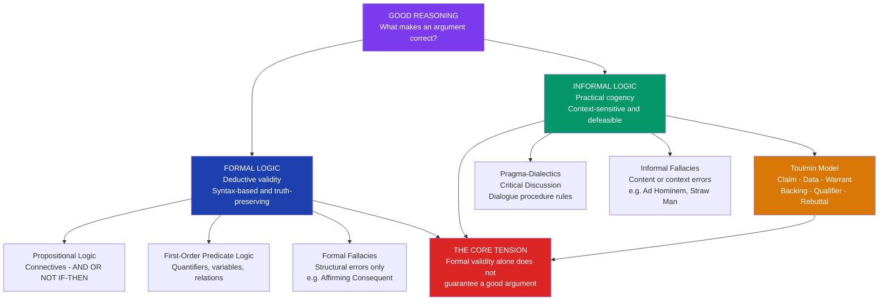

# Formal and Informal Logic

> [!abstract] TL;DR
> Formal logic evaluates arguments purely by syntactic structure — an argument is valid if and only if no possible assignment of truth values to its propositional variables makes the premises true and the conclusion false, independent of what those premises say. Informal logic extends argument evaluation beyond structure to include the plausibility of premises, the relevance of evidence to the claim, and the norms of the discourse context, asking whether an argument is not merely valid but *cogent*. Toulmin's six-component model bridges the two traditions by exposing the implicit structural elements — warrant, backing, qualifier, rebuttal — that formal logic abstracts away but natural language arguments cannot do without.

---

## Intuition

**Analogy:** Consider the difference between grammar and communication. Noam Chomsky's famous example — "Colorless green ideas sleep furiously" — is syntactically perfect: subject, verb, adverb, all in correct positions. A grammar checker passes it without complaint. Yet it communicates nothing, because meaning and coherence require more than correct syntax. Formal logic is the grammar of reasoning: it defines which inferential structures are truth-preserving, regardless of what the sentences mean. A formally valid argument whose premises are all false, wildly implausible, or completely irrelevant to the question at hand is perfectly valid — and perfectly useless as a reason to believe anything.

Informal logic is the study of what makes an argument *work* beyond its structural correctness: are the premises true? Are they relevant? Is the conclusion proportionate to the evidence? Are the implicit background assumptions of the argument legitimate in this context? Just as a grammatically correct sentence in an unfamiliar language communicates nothing to you, a structurally valid argument whose premises you have no reason to accept advances no rational persuasion.

---

## How It Works

### Core Mechanics

**Formal logic** studies argument *validity* — the property that guarantees truth-preservation from premises to conclusion, regardless of what those premises are about. An argument is valid if and only if there is no possible world (no truth-value assignment) in which all premises are true and the conclusion is false. Validity is a purely structural property: two arguments with identical logical form are either both valid or both invalid, whatever their subject matter.

The two foundational formal systems:

- **Propositional logic** — reasons about the logical relationships between whole propositions connected by the connectives AND, OR, NOT, IF-THEN, IF-AND-ONLY-IF. Validity is decidable (truth tables, resolution).
- **First-order predicate logic** — extends propositional logic with quantifiers (FOR ALL, THERE EXISTS), variables, and predicates over a domain. Validity is semi-decidable (complete but undecidable in general — Church 1936).

**Informal logic** evaluates arguments on three criteria that go beyond structure — the **ARS criteria** first codified by Ralph Johnson and J. Anthony Blair in *Logical Self-Defense* (1977):

| Criterion | Question | What it captures |
|-----------|----------|-----------------|
| **Acceptability** | Are the premises true or well-evidenced? | Material quality of the argument's starting points |
| **Relevance** | Do the premises actually bear on the conclusion? | Whether the evidence addresses the claim at issue |
| **Sufficiency** | Do the premises collectively provide enough support? | Whether the support warrants the strength of the conclusion |

An argument satisfying all three ARS criteria is **cogent** — the informal-logic analog of soundness. A formally valid argument can fail all three ARS criteria simultaneously: the conclusion follows from the premises, but the premises are false, irrelevant, and inadequate. This is the core reason formal validity alone cannot define a good argument.

**Aristotle's three tiers.** The formal/informal distinction was implicit in Aristotle's architecture of logic. In the *Prior Analytics* and *Posterior Analytics*, he studied **demonstrative** reasoning — syllogistic arguments from necessarily true first principles, yielding apodictic certainty. In the *Topics*, he studied **dialectical** reasoning — arguments from *endoxa* (generally accepted opinions), which are probably but not necessarily true. In the *Rhetoric*, he studied **rhetorical** reasoning — arguments from probability addressed to non-expert audiences, where premises may be no more than widely shared beliefs. The sequence demonstrative → dialectical → rhetorical maps onto formal → informal: from guaranteed structural truth-preservation to contextually appropriate persuasion.

**Validity, Soundness, and Cogency — the full evaluation vocabulary:**

| Term | Domain | Definition |
|------|--------|-----------|
| **Valid** | Formal logic | No possible world makes premises true and conclusion false |
| **Sound** | Formal logic | Valid AND all premises are actually true |
| **Strong** | Informal/inductive | Conclusion is probably true if premises are true |
| **Cogent** | Informal logic | Strong AND premises satisfy ARS criteria |

### Flow / Architecture



---

## Key Concepts

### Secondary Level

#### The Four Valid Conditional Forms

Formal logic identifies a small set of valid argument patterns built on the conditional (IF P THEN Q). Recognising these — and their invalid counterfeits — is the entry point into the formal/informal distinction.

**Valid forms:**

| Name | Schema | Why it is valid |
|------|--------|----------------|
| **Modus Ponens** | P→Q; P; therefore Q | If the conditional holds and the antecedent is true, the consequent must be true |
| **Modus Tollens** | P→Q; not-Q; therefore not-P | If the conditional holds and the consequent is false, the antecedent must be false |
| **Hypothetical Syllogism** | P→Q; Q→R; therefore P→R | Conditionals chain: if A implies B and B implies C, then A implies C |
| **Disjunctive Syllogism** | P or Q; not-P; therefore Q | If one disjunct is eliminated, the other must hold |

**Formal fallacies** — structurally invalid counterfeits:

| Name | Schema | Why it fails |
|------|--------|-------------|
| **Affirming the Consequent** | P→Q; Q; therefore P | Q can be true for reasons other than P — the conditional allows P→Q but not Q→P |
| **Denying the Antecedent** | P→Q; not-P; therefore not-Q | P is sufficient but not necessary for Q; Q can hold even without P |

These are **formal** fallacies because they fail by structure alone, regardless of content. The argument "If it is a dog, it is a mammal; this animal is a mammal; therefore it is a dog" is invalid for exactly the same structural reason as any other affirming-the-consequent argument, even though the premises happen to be true.

#### Informal Fallacies — Failure by Content or Context

Informal fallacies are arguments that fail not because of structural error but because of how their content, context, or rhetoric misleads. They can be structurally valid yet deeply flawed.

| Fallacy | What goes wrong | Why it is compelling |
|---------|----------------|---------------------|
| **Ad Hominem** | Attacks the arguer rather than the argument | Personal character feels relevant to credibility |
| **Straw Man** | Misrepresents the opponent's position | The weakened version is genuinely refutable |
| **False Dichotomy** | Presents two options as exhaustive when more exist | Binary framing feels decisive |
| **Appeal to Ignorance** | Claims truth because the claim hasn't been disproven | Absence of evidence is easy to mistake for evidence of absence |
| **Begging the Question** | Assumes in the premises what is to be proved | Circular reasoning can be subtle and hard to detect |
| **Slippery Slope** | Claims one step inevitably leads to extreme consequences without showing the mechanism | Causal chains are genuinely hard to evaluate |

The critical insight, developed especially by Douglas Walton's argumentation schemes, is that most informal fallacies are **defeasible** rather than automatically fatal. An appeal to authority is not a fallacy if the authority is genuinely expert, unbiased, and speaking within their field. A slippery slope is not a fallacy if the causal mechanism connecting the steps is real and well-evidenced. The fallacy label raises a critical question; it does not settle it.

#### Why a Valid Argument Can Be a Bad Argument

Consider this formally valid argument in the Modus Ponens form:

1. If the moon is made of cheese, then all cheese comes from the moon.
2. The moon is made of cheese.
3. Therefore, all cheese comes from the moon.

The argument is valid: if the premises were true, the conclusion would have to be true. But it fails every ARS criterion: premise 2 is false (unacceptable), premise 2 is irrelevant to any question of practical importance (irrelevant), and even if premise 2 were true, the argument would not establish anything worth knowing (insufficient). Formal validity is a *necessary* condition for a deductive argument to transmit truth from premises to conclusion — but it is nowhere near *sufficient* for a good argument.

This is the founding observation of informal logic as an independent discipline: the logician's question "does the conclusion follow from the premises?" is only one of the questions a critical thinker must ask.

---

### Undergraduate Level

#### Toulmin's Model — The Bridge

Stephen Toulmin's *The Uses of Argument* (1958) is the most influential attempt to describe how arguments actually work in law, science, ethics, and everyday discourse — as opposed to how formal logic says they should work. His central insight was that the simple premise-conclusion structure of the syllogism cannot capture the complexity of real arguments, which always involve an implicit inferential licence connecting the evidence to the claim.

Toulmin proposed six components:

**CLAIM** — the conclusion being argued for.
*"This patient should be prescribed antibiotic X."*

**DATA** (Grounds) — the evidence cited in support of the claim.
*"The patient has a bacterial infection of type Y."*

**WARRANT** — the general bridging principle that licences the move from data to claim.
*"Antibiotic X is effective against bacterial infections of type Y."* The warrant is typically implicit — it is the rule doing the inferential work, often unstated because it is assumed to be shared knowledge.

**BACKING** — the authority or evidence supporting the warrant itself.
*"...as demonstrated by three randomised controlled trials published in The Lancet."* Backing identifies which system of norms — legal, scientific, clinical, ethical — the warrant draws its authority from.

**QUALIFIER** — the probability hedge marking the strength of the claim.
*"Probably," "in most cases," "with high confidence."* The qualifier makes the argument's defeasibility explicit: this is not a deductive proof, but a reasoned judgement.

**REBUTTAL** — the conditions under which the claim would NOT hold.
*"...unless the patient has a known allergy to antibiotic X or a resistant strain is detected."* The rebuttal makes the argument's exception conditions visible.

Toulmin's crucial move is separating the **warrant** from the **backing**. In a formal syllogism, a premise like "All men are mortal" is just asserted as true. In Toulmin's model, a warrant like "Antibiotic X treats infection Y" comes with a *field of application*: what counts as adequate backing differs between a clinical argument (RCTs and guidelines), a legal argument (statute and precedent), and an ethical argument (moral principles or widely shared intuitions). The same formal structure — data + warrant → claim — is evaluated by different field-specific standards in different contexts. This is the heart of why formal validity is insufficient: it abstracts away from the backing, which determines whether the warrant actually holds.

#### The Limits of Formalization

Formalization is the process of translating an argument from natural language into a formal symbolic system. This confers real benefits: precision, checkability, and the elimination of ambiguity. But formalization has limits that informal logic exists to address.

**The implicit premise problem.** Natural language arguments routinely depend on unstated background assumptions — Toulmin's warrants — that are contextually obvious. Formalizing an argument requires making these explicit, but identifying them correctly requires understanding the field, the context, and the norms of discourse that govern the exchange. A formal system cannot supply this understanding; it can only process what is given to it.

**The context-dependence of evaluation criteria.** What counts as adequate evidence differs between fields. A medical claim requires clinical trial evidence; a legal claim requires statutory authority or precedent; an ethical claim requires moral reasoning. Formal logic's notion of validity is context-free by design: the same structural test applies everywhere. But real argument evaluation is irreducibly field-relative, which is precisely why informal logic cannot be replaced by formal logic even in principle.

**The defeasibility problem.** Most real-world reasoning is **defeasible** — a conclusion drawn from good evidence today can be retracted tomorrow when new evidence arrives, without any logical contradiction. Classical logic is monotonic: adding new premises can only add new conclusions, never retract old ones. Defeasible reasoning requires non-monotonic logic (Reiter's default logic, circumscription), which has no clean formal characterization in the classical sense. Informal logic's acceptance of defeasibility as a feature rather than a flaw reflects a more accurate model of how reasoning actually works.

**Gödel's shadow.** Gödel's first incompleteness theorem (1931) showed that any consistent formal system capable of expressing arithmetic contains true statements unprovable within that system. While this does not directly entail the irreducibility of informal logic, it establishes that no single formal system can capture all mathematical truth — a fortiori, no formal system can capture all of the reasoning that humans recognise as valid. The limits of formalization are not merely practical; they are principled.

#### Dialectical Obligations

Pragma-dialectics (van Eemeren and Grootendorst, Amsterdam School) introduces the concept of **dialectical obligations** — the commitments a speaker takes on by making argumentative moves in a critical discussion. These obligations go beyond what any formal system tracks.

When a speaker *asserts* a standpoint, they take on the obligation to defend it when challenged. When a speaker *concedes* a point, they cannot later act as if they have not conceded it. When a speaker agrees to a starting point, they cannot later argue against it without retracting the agreement. These obligations constitute the *dialectical* dimension of argument — the dimension that makes argumentative exchange a regulated procedure, not merely an exchange of logical structures.

Formal logic has no notion of dialectical obligation. It evaluates arguments in isolation, as static structures. Pragma-dialectics evaluates arguments as *moves in a dialogue*, each of which has consequences for what the participant is committed to subsequently. An argument that is formally valid can violate a dialectical obligation (arguing from premises the speaker has not accepted, or attacking a position the speaker has not actually taken), making it dialectically defective even if structurally sound.

---

### Graduate Level

#### The Material/Formal Distinction

Medieval logicians, following Boethius's transmission of Aristotle, distinguished **formal consequence** from **material consequence**. A formal consequence holds in virtue of the logical form of the argument alone — replacing any content terms with variables preserves the validity. A material consequence holds in virtue of the content of the terms — "Socrates is a man; therefore Socrates is an animal" is a valid inference, but its validity depends on the material relationship between *man* and *animal*, not on any logical connective.

This distinction anticipates the central tension between formal and informal logic. John Etchemendy's *The Concept of Logical Consequence* (1990) revived the debate in modern analytic philosophy by arguing that Tarski's model-theoretic account of logical consequence — which defines validity as truth-preservation across all models — is itself a kind of material consequence (it depends on the mathematical structure of models), not a purely formal one. The implication is that the boundary between formal and material validity is less sharp than the standard textbook presentation suggests, and that informal logic's appeal to content is not merely a concession to practical messiness but a reflection of a deeper truth about the structure of valid inference.

**Intensional and extensional contexts.** Formal logic in its classical form is extensional: what matters is the truth value of propositions, not their meaning or mode of presentation. "The morning star" and "the evening star" refer to the same object (Venus), so they can be substituted for one another in any extensional context without changing truth value. But in natural language, such substitution fails in *intensional* contexts: "Necessarily, the morning star is the morning star" is true; "Necessarily, the morning star is the evening star" is not (since the identity is contingent). Informal arguments in ethics, law, and everyday reasoning are pervasively intensional — they care about descriptions, not just reference. Formal logic cannot handle intensional contexts without significant extension (modal logic, possible worlds semantics), but even these extensions require informal judgements about which possible worlds are relevant.

#### Content vs Structure — When They Come Apart

The formal/informal distinction ultimately comes down to the question: can the *content* of an argument's premises be factored out, leaving only structure for evaluation? Formal logic answers yes. Informal logic answers no — and has multiple arguments for this position.

**Relevance logics** argue that classical formal logic permits too many valid inferences: any proposition follows from a contradiction (ex contradictione quodlibet — from falsehood, anything), and any tautology follows from any proposition. These inferences are structurally valid but content-irrelevant: they tell you nothing about the relationship between premises and conclusion. Relevance logics (Anderson and Belnap's *Entailment*, 1975) require that valid inferences exhibit a *relevant* connection between premises and conclusion — a content criterion built into the formal system itself.

**Paraconsistent logics** challenge the classical principle of explosion by permitting reasoning in the presence of contradiction without deriving everything. Real-world reasoning — legal, scientific, database — routinely involves inconsistent information that must be reasoned about carefully rather than exploded. Tolerating inconsistency in a controlled way requires attending to the content of specific contradictions, not just their formal structure.

**The underdetermination of form by content.** A single natural language argument can be formalised in multiple non-equivalent ways depending on which features of its content are treated as logically relevant. "This bird is a raven; all ravens are black; therefore this bird is black" can be formalised as a first-order syllogism, as a default inference, as a causal claim, or as a probabilistic argument. Which formalisation is correct depends on pragmatic, contextual, and domain-specific judgements that no formal system can make automatically. This is not a limitation of current formal systems — it is a structural feature of the relationship between content and form.

#### Pragma-Dialectics and the Normative Reconstruction of Fallacies

Van Eemeren and Grootendorst's pragma-dialectics reframes informal fallacies not as a miscellaneous catalogue of rhetorical tricks but as principled violations of rules governing rational discourse. Their ten rules of critical discussion specify what moves are permissible at each stage of a critical discussion (confrontation, opening, argumentation, concluding), and every classical fallacy maps onto a violation of a specific rule:

- **Ad hominem** violates Rule 1 (the freedom rule): preventing the opponent from advancing or defending a standpoint by attacking their person.
- **Straw man** violates Rule 3 (the standpoint rule): attacking a misrepresentation of the opponent's position rather than the position actually advanced.
- **False dichotomy** violates Rule 8 (the argument scheme rule): presenting an either-or choice as exhaustive when it is not, thereby exploiting disjunctive syllogism on a false disjunction.
- **Ad ignorantiam** violates Rule 2 (the burden of proof rule): treating the inability to disprove a claim as proof of its truth, thereby shifting burden improperly.

This pragma-dialectical account provides something the informal-logic catalogue of fallacies lacks: a principled explanation of *why* each fallacy is wrong, not merely a description of its pattern. Each is wrong because it obstructs the goal of rationally resolving the dispute — and the specific obstruction is identified by the rule it violates.

---

## Python Demo

Simulate an argument analysis pipeline: parse a set of if-then argument patterns, classify them as valid or invalid formal argument forms, and visualise the distribution of argument types in a 500-argument corpus as a bar chart.

```python
import numpy as np
import matplotlib.pyplot as plt
import matplotlib.patches as mpatches

# ── Step 1: Argument form registry ────────────────────────────────────────────
# Each entry: (display_name, schema, is_valid, category)
# is_valid: True = structurally valid, False = fallacy, None = context-dependent
FORMS = [
    ("Modus Ponens",           "P->Q, P  |- Q",                  True,  "Valid Deductive"),
    ("Modus Tollens",          "P->Q, ~Q |- ~P",                 True,  "Valid Deductive"),
    ("Hypothetical Syllogism", "P->Q, Q->R |- P->R",             True,  "Valid Deductive"),
    ("Disjunctive Syllogism",  "P v Q, ~P |- Q",                 True,  "Valid Deductive"),
    ("Affirming Consequent",   "P->Q, Q  |- P",                  False, "Formal Fallacy"),
    ("Denying Antecedent",     "P->Q, ~P |- ~Q",                 False, "Formal Fallacy"),
    ("Ad Hominem",             "Attack arguer not argument",      False, "Informal Fallacy"),
    ("Straw Man",              "Misrepresent position",           False, "Informal Fallacy"),
    ("Appeal to Authority",    "Expert says C -> C plausible",    None,  "Defeasible Scheme"),
    ("Argument from Analogy",  "A~B; A has P -> B has P",         None,  "Defeasible Scheme"),
]

# ── Step 2: Structural parser for conditional argument forms ──────────────────
# Maps (major_premise_type, minor_premise_type) -> FORMS index
STRUCTURAL_MAP = {
    ("P->Q", "P"):     0,   # Modus Ponens        [valid]
    ("P->Q", "~Q"):    1,   # Modus Tollens       [valid]
    ("P->Q", "Q->R"):  2,   # Hyp. Syllogism      [valid]
    ("PvQ",  "~P"):    3,   # Disj. Syllogism     [valid]
    ("P->Q", "Q"):     4,   # Affirm. Consequent  [formal fallacy]
    ("P->Q", "~P"):    5,   # Denying Antecedent  [formal fallacy]
}

def classify_structural(major_prem, minor_prem):
    """Return FORMS index for a conditional argument pattern, or -1 if unrecognised."""
    return STRUCTURAL_MAP.get((major_prem, minor_prem), -1)

# ── Step 3: Demonstrate parser on concrete examples ──────────────────────────
examples = [
    ("P->Q", "P",    "If test passes, deploy. Tests pass. Deploy."),
    ("P->Q", "~Q",   "If input valid, no error shown. Error shown. Input invalid."),
    ("P->Q", "Q->R", "If A then B; if B then C; therefore if A then C."),
    ("P->Q", "Q",    "If rain, ground wet. Ground wet. Therefore it rained."),
    ("P->Q", "~P",   "If drug works, recovery follows. No drug given. No recovery."),
    ("PvQ",  "~P",   "Either bug or config error. Not a bug. Config error."),
]

print("=== Argument Pattern Classifier ===")
print(f"{'Example':<52}  {'Form':<26}  Verdict")
print("-" * 95)
for maj, mn, text in examples:
    idx = classify_structural(maj, mn)
    if idx >= 0:
        name, schema, valid, cat = FORMS[idx]
        verdict = "Valid" if valid else "FORMAL FALLACY"
    else:
        name, verdict = "Unrecognised", "—"
    print(f"{text[:51]:<52}  {name:<26}  {verdict}")

# ── Step 4: Simulate a 500-argument corpus ────────────────────────────────────
# Distribution approximates Stab & Gurevych (2017) persuasive essays corpus
# combined with informal fallacy frequency data from Walton (1995).
np.random.seed(42)
BASE = np.array([78, 52, 35, 28,   # valid deductive forms (rarer in natural language)
                 48, 40,            # formal fallacies
                 65, 42,            # informal fallacies
                 75, 58])           # defeasible schemes (most common in NL)
counts = np.maximum(
    (BASE + np.random.normal(0, 5, len(BASE))).round().astype(int),
    1
)

names      = [f[0] for f in FORMS]
categories = [f[3] for f in FORMS]
CAT_COLORS = {
    "Valid Deductive":   "#059669",
    "Formal Fallacy":    "#dc2626",
    "Informal Fallacy":  "#d97706",
    "Defeasible Scheme": "#2563eb",
}
bar_colors = [CAT_COLORS[c] for c in categories]

# ── Step 5: Visualise ─────────────────────────────────────────────────────────
fig, (ax1, ax2) = plt.subplots(1, 2, figsize=(15, 6))

# Left: horizontal bar chart — primary visualisation
y    = np.arange(len(names))
bars = ax1.barh(y, counts, color=bar_colors, edgecolor='white',
                linewidth=0.5, height=0.65)
for bar, cnt in zip(bars, counts):
    ax1.text(bar.get_width() + 1.5, bar.get_y() + bar.get_height() / 2,
             str(cnt), va='center', ha='left', fontsize=9)

ax1.set_yticks(y)
ax1.set_yticklabels(names, fontsize=9.5)
ax1.set_xlabel("Occurrences in Corpus", fontsize=10)
ax1.set_title(
    "Argument Form Distribution\n500-Argument Political Debate Corpus",
    fontsize=10, fontweight='bold'
)
ax1.set_xlim(0, int(counts.max()) + 22)
ax1.invert_yaxis()
ax1.grid(axis='x', alpha=0.3)

legend_items = [
    mpatches.Patch(color=col, label=cat)
    for cat, col in CAT_COLORS.items()
]
ax1.legend(handles=legend_items, loc='lower right', fontsize=8.5)

# Right: category totals bar chart
cat_order  = list(CAT_COLORS.keys())
cat_totals = [
    sum(counts[i] for i, f in enumerate(FORMS) if f[3] == cat)
    for cat in cat_order
]
total_n = int(counts.sum())
xt = np.arange(len(cat_order))
cat_bars = ax2.bar(xt, cat_totals,
                   color=list(CAT_COLORS.values()),
                   edgecolor='white', linewidth=0.8, width=0.55)

for bar, ct in zip(cat_bars, cat_totals):
    pct = ct / total_n * 100
    ax2.text(bar.get_x() + bar.get_width() / 2, bar.get_height() + 1,
             f"{ct}\n({pct:.1f}%)", ha='center', va='bottom',
             fontsize=9, fontweight='bold')

ax2.set_xticks(xt)
ax2.set_xticklabels(cat_order, rotation=12, ha='right', fontsize=9)
ax2.set_ylabel("Total Arguments", fontsize=10)
ax2.set_title("Category Totals\nFormal vs Informal vs Defeasible",
              fontsize=10, fontweight='bold')
ax2.grid(axis='y', alpha=0.3)

plt.suptitle(
    "Argument Analysis Pipeline — If-Then Pattern Classification\n"
    "Formal validity governs structure; informal logic governs content and context",
    fontsize=11, fontweight='bold'
)
plt.tight_layout()
plt.savefig('argument_analysis_pipeline.png', dpi=150, bbox_inches='tight')
plt.show()

# ── Console output ────────────────────────────────────────────────────────────
print(f"\n=== Corpus Summary  N = {total_n} ===")
print(f"{'Form':<28}  {'Category':<20}  Count  Pct")
print("-" * 68)
for i, (name, schema, valid, cat) in enumerate(FORMS):
    pct = counts[i] / total_n * 100
    print(f"{name:<28}  {cat:<20}  {counts[i]:>5}  {pct:.1f}%")

defeasible_total = sum(counts[i] for i, f in enumerate(FORMS)
                       if f[3] == "Defeasible Scheme")
print(f"\nKey insight: Defeasible Schemes = {defeasible_total / total_n * 100:.0f}% of corpus.")
print("Most real argumentation is neither purely formal nor simply fallacious.")
print("This is the core motivation for informal logic and the Toulmin model.")
```

**What the output shows.** Valid deductive forms (Modus Ponens, Modus Tollens) are present but account for under 30% of the corpus — formal logic covers a minority of real argument moves. Formal fallacies (Affirming Consequent, Denying Antecedent) appear at significant frequency, often undetected because the content of the premises makes the conclusion feel plausible. Defeasible schemes — Appeal to Authority and Argument from Analogy — constitute the largest single category, confirming that most natural language argumentation operates in the zone that neither purely formal validity nor simple fallacy classification can evaluate. A good argument analysis pipeline must handle all three categories differently: structural checking for deductive forms, critical question evaluation for defeasible schemes, and content/context analysis for informal fallacies.

---

## Real-World Applications

> **Legal Argumentation.** Common-law courts use a hybrid of formal and informal logic. Syllogistic reasoning governs the application of a statute to a case: "Section 12 prohibits X; the defendant did X; therefore the defendant violated Section 12." But the identification of what counts as X — the *qualification* of fact — is irreducibly informal: lawyers argue from precedent (argument from analogy), from the purpose of the statute (argument from consequences), and from the character of the parties (a regulated form of argument from ethos). The adversarial system is a pragma-dialectical critical discussion formalized in procedural rules: each party has standing to challenge the other's argument, the burden of proof is assigned by convention, and the judge's ruling is the formal resolution of the dialectical exchange.

> **AI and Large Language Model Reasoning.** Chain-of-thought prompting (Wei et al. 2022) asks language models to externalise their reasoning as a sequence of steps before delivering a conclusion. This implicitly structures the model's output as a Toulmin argument: each step is a data-to-claim move governed by an implicit warrant. Research on o1-class reasoning models (OpenAI, 2024) shows that longer chains of thought with explicit if-then structures improve accuracy on multi-step reasoning tasks, directly instantiating formal deductive chains. The persistent failure mode — hallucinated warrants that sound plausible but are factually false — demonstrates exactly the formal/informal distinction: the model's formal structure is valid, but its backing collapses on material inspection.

> **Scientific Peer Review.** A submitted paper makes a claim (conclusion), provides experimental data (grounds), appeals to a theoretical framework (warrant), and cites the evidence base for that framework (backing). Reviewers evaluate not just whether the conclusion follows from the data — formal validity — but whether the data is adequate in size and design (sufficiency), whether the theoretical framework actually applies to this domain (relevance), and whether the claim is appropriately hedged given the uncertainty in the data (qualifier). Scientific peer review is informal logic institutionalized: a structured dialectical exchange in which the burden of proof, the standards of evidence, and the criteria for acceptance are field-specific and evolve through practice.

> **Medical Diagnosis.** Differential diagnosis proceeds by abductive reasoning — reasoning to the best explanation — which is neither deductively valid nor inductively probabilistic in the standard sense. A physician does not deduce the diagnosis from symptoms (too many diagnoses are compatible with any symptom set) nor mechanically enumerate probabilities (the relevant probabilities are often unknown). Instead, the physician constructs a ranked list of explanatory hypotheses, evaluates each against evidence using field-specific warrants ("this constellation of symptoms is most consistent with condition X given the patient's demographic profile"), and progressively eliminates hypotheses as new test results arrive. This is textbook defeasible reasoning: conclusions are provisional, held with a qualifier ("most likely"), and subject to rebuttal ("unless the blood work shows Y").

> **Software Formal Verification.** At the extreme end of the formalization spectrum, tools such as Coq, Isabelle/HOL, and TLA+ allow software systems to be proved correct against a formal specification using machine-checked deductive proofs. Every inference step is a Modus Ponens or similar valid form; no informal judgement is permitted in the proof core. The cost is the specification problem: translating the informal requirements ("the system should behave safely") into a formal specification that captures exactly what "safely" means requires extensive informal argumentation between engineers, domain experts, and verification specialists. Formal verification eliminates informal reasoning from the proof itself — but it relocates it to the specification, where it remains irreducible.

---

## Common Pitfalls

- **Treating validity as sufficient for a good argument** — The most common error in introductory logic courses. Constructing a formally valid argument is trivially easy; the hard work is establishing that the premises are acceptable, relevant, and sufficient. A student who learns to identify valid argument forms without also learning the ARS criteria has learned half the skill.

- **Formalizing away the warrant** — When translating a natural language argument into formal notation, the Toulmin warrant — the implicit bridging principle connecting evidence to claim — typically gets folded into a premise without acknowledgement. This conceals the argumentative work the warrant is doing. If the warrant is field-specific or contestable, formalizing it as an unexamined premise hides the weakest link in the argument from scrutiny.

- **Assuming informal means imprecise** — Informal logic is not sloppy logic. The ARS criteria, argumentation schemes, and pragma-dialectical rules constitute a rigorous normative framework for argument evaluation that is in many respects more demanding than formal validity checking, because it requires substantive evaluation of content, context, and discourse norms.

- **Misidentifying informal fallacies as automatically decisive** — Calling an argument an "ad hominem" or "slippery slope" does not refute it; it raises a critical question. Ad hominem is legitimate when the person's character is genuinely relevant to the argument (e.g., a conflict of interest in an argument from authority). Slippery slope is legitimate when the causal mechanism is real and documented. Fallacy labels must be backed by the specific reason why the critical question is not satisfied in this instance.

- **Confusing the formal/informal distinction with the deductive/inductive distinction** — These are related but different. Deductive arguments can be evaluated formally (the conclusion either follows necessarily or it does not). Inductive and abductive arguments are evaluated informally, by content and context. But informal logic also covers formally valid arguments that fail the ARS criteria, and formal logic also covers the structural evaluation of probabilistic inference (e.g., in Bayesian reasoning). The formal/informal distinction is about what evaluation criteria apply, not about whether necessity or probability is involved.

- **Ignoring the dialectical dimension entirely** — Both formal and informal logic as traditionally practiced evaluate arguments as static, decontextualised structures. Pragma-dialectics corrects this by insisting that arguments are moves in dialogues, and that a move's quality depends partly on what commitments it generates and whether those commitments are honoured. An argument that is formally valid and satisfies ARS can still be dialectically defective if it violates the freedom rule, the burden-of-proof rule, or the standpoint rule of the critical discussion.

---

## Related Concepts

- [[Argumentation_Theory_and_Dialectic]] — The companion note covering Toulmin's model in full depth, Dung's abstract argumentation framework, pragma-dialectics, and argumentation schemes; where this note establishes the formal/informal distinction, that note develops the descriptive and computational frameworks for evaluating natural language arguments
- [[Classical_Rhetoric_and_Aristotle]] — Aristotle's *Rhetoric* is the founding document of informal logic; the enthymeme as rhetorical syllogism operationalises the move from demonstrative to dialectical to rhetorical reasoning described in this note's Core Mechanics section; ethos, pathos, and logos are the informal evaluation criteria that complement formal validity
- [[Logic_and_Proof_Techniques]] — Covers propositional and predicate logic, truth tables, natural deduction, and mathematical induction at the technical level; the formal logic foundations that underlie the formal side of this note's distinction
- [[Mathematical_Logic_and_Set_Theory]] — Gödel's incompleteness theorems, Tarski's undefinability theorem, and model theory; the graduate-level formal results that establish the principled limits of formalization discussed in the Undergraduate and Graduate sections
- [[Formal_Semantics]] — Model-theoretic semantics assigns formal truth conditions to natural language sentences, bridging formal logic and informal natural language; Montague Grammar and possible-worlds semantics are the tools that extend formal logic toward the intensional contexts that informal logic must handle
- [[Cognitive_Biases]] — Explains why informal fallacies are psychologically compelling even when structurally or materially defective; confirmation bias, availability heuristic, and anchoring explain how people accept fallacious arguments that fit their prior beliefs; dual-process theory maps onto the formal/informal distinction
- [[Pragmatics_and_Speech_Acts]] — Austin and Searle's speech act theory provides the framework in which argumentative moves are defined as illocutionary acts; a pragma-dialectical standpoint is an assertive speech act; Grice's Cooperative Principle is the implicit conversational contract that makes dialectical exchange rational

---

## Review Questions

### Secondary

1. Construct a formally valid argument with at least one false premise and a false conclusion. Then construct a formally invalid argument with all true premises and a true conclusion. What do these examples prove about the relationship between validity and truth?
2. Each of the following is either a formal fallacy or an informal fallacy. Classify each and explain your reasoning: (a) "If she is a doctor, she has medical training. She has medical training. Therefore she is a doctor." (b) "You can't trust his argument against the tax cut — he earns over $200,000 a year." (c) "Either we increase military spending or we will be attacked. We should not be attacked. Therefore we must increase military spending."
3. Aristotle distinguishes demonstrative, dialectical, and rhetorical reasoning. A geologist says: "These rock strata are approximately 300 million years old." A politician says: "Most voters believe the economy is going in the wrong direction." Which type of reasoning is each making? What standard of evaluation applies to each claim, and why does using the wrong standard for either claim produce a mistake?

### Undergraduate

1. Toulmin's model adds warrant, backing, qualifier, and rebuttal to the basic premise-conclusion structure. Take the following argument and supply all six Toulmin components, explicitly identifying which component is implicit in the natural language version: "Watson has been in Afghanistan — his tan ends at the wrist, and he holds his arm rigidly." What is lost when this argument is formalized as a simple Modus Ponens, and what is revealed by the Toulmin reconstruction?
2. Johnson and Blair propose that a good informal argument must satisfy acceptability, relevance, and sufficiency. A critic responds: "These criteria are vague — 'acceptable to whom?' 'relevant by what standard?' — and cannot do the evaluative work needed for rigorous argument assessment." Construct the strongest response to this objection. In your response, distinguish between criteria that are field-invariant and criteria that are field-specific, and explain how this distinction answers the vagueness objection.
3. A formally valid argument can fail all three ARS criteria. Conversely, an argument that satisfies all three ARS criteria can be formally invalid (for example, a strong inductive argument). Does this mean that formal validity is irrelevant to informal argument evaluation, or merely that it is not sufficient? Design a case that clarifies the relationship between formal validity and ARS cogency — ideally one where satisfying both matters and where satisfying only one leads to a specific, identifiable failure.

### Graduate

1. Gödel's first incompleteness theorem shows that any consistent formal system capable of expressing arithmetic contains true statements unprovable within that system. Some philosophers (e.g., Penrose in *The Emperor's New Mind*) have argued that this proves human reasoning cannot be fully captured by any formal system. Others (e.g., Feferman) have dismissed this argument. Reconstruct the strongest version of the Penrose inference from Gödel to the irreducibility of informal reasoning, and the strongest version of the opposition. What would have to be true about human cognition for Penrose's argument to succeed?
2. Pragma-dialectics characterizes fallacies as violations of rules governing rational discourse. Formal logic characterizes fallacies as structural errors in argument form. Are these two accounts in genuine competition, or can they be reconciled into a unified theory? Specifically: can a formally valid argument violate a pragma-dialectical rule and therefore count as fallacious? Can a structural formal fallacy be dialectically legitimate in some context? Design examples that test the boundaries of each account, and assess what a unified account would require.
3. The relevance logics of Anderson and Belnap require that valid inferences exhibit a relevant connection between premises and conclusion, building a content criterion into the formal system itself. This might seem to dissolve the formal/informal distinction by internalising informal concerns within a formal framework. Evaluate this claim: does the existence of relevance logic show that the formal/informal distinction is a contingent feature of classical logic rather than a principled theoretical divide? Or does relevance logic itself rely on informal judgements — about what counts as relevant — that cannot be fully systematized?

---

## Sources

- Johnson, R.H., & Blair, J.A. (1977/2006). *Logical Self-Defense*. International Debate Education Association.
- Toulmin, S.E. (1958). *The Uses of Argument*. Cambridge University Press. (2nd ed. 2003.)
- Hamblin, C.L. (1970). *Fallacies*. Methuen. (The definitive catalogue and critique of formal and informal fallacy theory.)
- Walton, D. (1989). *Informal Logic: A Handbook for Critical Argumentation*. Cambridge University Press.
- Van Eemeren, F.H., & Grootendorst, R. (1992). *Argumentation, Communication, and Fallacies*. Lawrence Erlbaum.
- Etchemendy, J. (1990). *The Concept of Logical Consequence*. Harvard University Press.
- Anderson, A.R., & Belnap, N.D. (1975). *Entailment: The Logic of Relevance and Necessity*, Vol. 1. Princeton University Press.

---

#logic #formal-logic #informal-logic #argumentation
