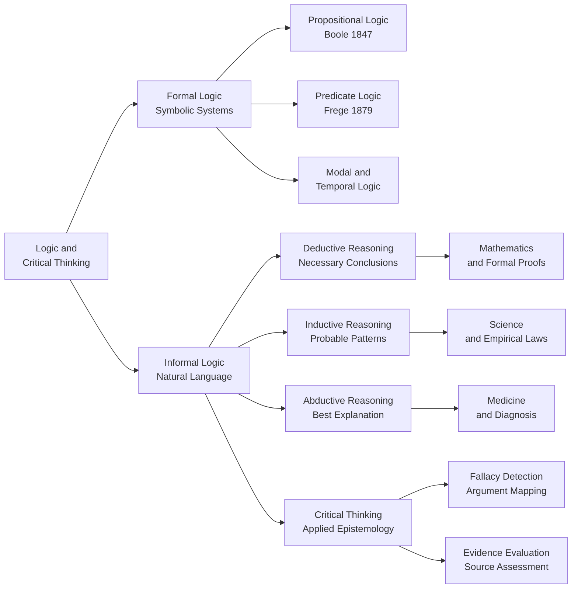

# Logic and Critical Thinking Overview

> [!abstract] TL;DR
> Logic is the systematic study of valid inference — the rules that determine when a conclusion genuinely follows from its premises. Critical thinking applies those rules to real-world arguments, evidence, and claims, functioning as practical epistemology for everyday reasoning. Together they underpin mathematics, science, law, AI, and any domain where getting things right matters.

---

## Intuition

**Analogy:** Imagine a quality-control inspector on a factory floor. Every product arriving at her station carries a tag with two premises and a conclusion. Her job is not to decide whether she *likes* the conclusion — it is to check whether the conclusion *must be true* if the premises are true (deduction), *probably follows* given the evidence so far (induction), or represents *the best available explanation* for an observed anomaly (abduction). If she catches a broken chain of reasoning before the product ships, she saves enormous downstream cost.

Logic is the engineering discipline that designs the inspector's checklist. Critical thinking is the skill of actually *using* that checklist under real-world conditions — noisy premises, missing data, motivated reasoning, and adversarial rhetoric.

---

## How It Works

### Core Mechanics

**Arguments** are the basic unit. An argument is a set of statements (premises) offered as grounds for accepting another statement (conclusion). Logic studies when that support relationship holds.

**Three modes of reasoning differ in the strength of the support:**

1. **Deductive** — The conclusion is *guaranteed* if the premises are true. The inference is valid or invalid; soundness requires additionally that the premises are actually true. Example: All mammals are warm-blooded; dolphins are mammals; therefore dolphins are warm-blooded.

2. **Inductive** — The conclusion is *made probable* by the premises, but not guaranteed. The logic of science: repeated observation builds confidence without certainty. Example: Every raven I have observed is black; therefore ravens are probably black.

3. **Abductive** — Choose the *best explanation* for a surprising observation. The logic of diagnosis and detective work. Example: The patient has fever, cough, and chest crackles; the best explanation is bacterial pneumonia.

**Formal vs. Informal Logic:**

- **Formal logic** abstracts away content and studies *form*. A schema like `P → Q; P; therefore Q` (modus ponens) is valid regardless of what P and Q say. Tools: propositional calculus, predicate logic, modal logic, sequent calculi.
- **Informal logic** deals with arguments as they appear in natural language, focusing on fallacy identification, argument mapping, and practical evaluation of real discourse.

**Critical thinking** integrates both: it uses formal tools to check argument structure, and informal tools to evaluate source credibility, identify hidden assumptions, detect rhetorical manipulation, and handle ambiguity.

### Historical Spine

| Era | Figure | Contribution |
|-----|--------|-------------|
| ~350 BCE | Aristotle | Syllogistic logic — first formal system of valid inference |
| ~300 BCE | Stoics | Propositional connectives — precursor to modern propositional calculus |
| 1847 | George Boole | *Laws of Thought* — algebra of logic, binary truth values |
| 1879 | Gottlob Frege | *Begriffsschrift* — predicate logic with quantifiers, foundation of modern logic |
| 1910–13 | Russell and Whitehead | *Principia Mathematica* — attempt to ground mathematics in logic |
| 1930s | Gödel, Turing, Church | Incompleteness theorems, decidability, computational logic |
| 1950s–now | Computational logic | SAT solvers, type theory, automated theorem provers, LLM reasoning |

### Flow / Architecture



---

## Key Concepts

### Secondary

- **Proposition** — A statement that is either true or false. "It is raining" is a proposition; "Is it raining?" is not.
- **Premise / Conclusion** — Premises are the supporting statements; the conclusion is what is argued for.
- **Validity** — An argument is valid if the conclusion cannot be false when all premises are true, regardless of whether the premises actually are true.
- **Soundness** — Valid argument with all premises actually true.
- **Logical connectives** — NOT, AND, OR, IF...THEN (implication), IF AND ONLY IF (biconditional).
- **Modus ponens** — The core inference rule: if P implies Q, and P is true, then Q must be true.
- **Modus tollens** — If P implies Q, and Q is false, then P must be false.
- **Fallacy** — An error in reasoning that renders an argument invalid or misleading (e.g., ad hominem, straw man, false dichotomy).

### Undergraduate

- **Propositional calculus** — A formal language with variables (P, Q), connectives, and inference rules. Every well-formed formula is either a tautology, a contradiction, or contingent.
- **Predicate logic** — Extends propositional logic with quantifiers (∀, ∃) and predicates over domains, enabling reasoning about objects and their properties.
- **Truth tables** — Systematic enumeration of all truth-value combinations for a formula's variables, used to test validity and identify tautologies.
- **Natural deduction** — A proof system that mirrors human reasoning, building proofs from assumptions using introduction and elimination rules.
- **Soundness and completeness** — A logic is sound if every provable theorem is valid; complete if every valid formula is provable. Propositional logic is both; first-order predicate logic is complete but not decidable.
- **Inductive strength** — Analogous to validity for inductive arguments; an inductively strong argument makes the conclusion highly probable given the premises.
- **Cognitive biases** — Systematic errors in human reasoning that critical thinking must actively counteract (confirmation bias, availability heuristic, anchoring).

### Graduate

- **Gödel's Incompleteness Theorems** — Any consistent formal system powerful enough to express arithmetic contains true statements it cannot prove. Completeness and consistency cannot both hold for rich enough systems.
- **Modal logic** — Extends propositional logic with operators for necessity (□) and possibility (◇), enabling reasoning about what must be, might be, or ought to be true.
- **Non-monotonic reasoning** — Classical logic is monotonic: adding premises can never retract valid conclusions. Real-world reasoning is non-monotonic (default logic, defeasible reasoning, answer set programming).
- **Paraconsistent logic** — Tolerates contradictions without explosion (ex contradictione quodlibet), relevant to inconsistent knowledge bases.
- **Bayesian epistemology** — Treats degrees of belief as probabilities updated via Bayes' theorem, providing a formal foundation for inductive and abductive reasoning.
- **Automated theorem proving** — Computational search for formal proofs; underpins program verification, SAT/SMT solvers, and type checkers.
- **Argumentation frameworks** — Dung's abstract argumentation (1995): directed graphs of arguments with attack relations, used in AI for defeasible reasoning and multi-agent systems.

---

## Python Demo

```python
import numpy as np

# Demonstrate hypothetical syllogism as a tautology:
# (P -> Q) AND (Q -> R)  ->  (P -> R)
# In material conditional form: A -> B  ===  (NOT A) OR B

# Generate all 8 truth-value combinations for P, Q, R
combos = np.array([[bool((i >> 2) & 1), bool((i >> 1) & 1), bool(i & 1)]
                   for i in range(8)])
P = combos[:, 0]
Q = combos[:, 1]
R = combos[:, 2]

# Compute each sub-formula  (numpy ~ = bitwise NOT, | = OR, & = AND on bool arrays)
p_implies_q = ~P | Q       # P -> Q
q_implies_r = ~Q | R       # Q -> R
p_implies_r = ~P | R       # P -> R

premise   = p_implies_q & q_implies_r      # (P->Q) AND (Q->R)
formula   = ~premise | p_implies_r         # Premise -> (P->R)  [the full syllogism]

header = f"{'P':<7}{'Q':<7}{'R':<7}{'P->Q':<8}{'Q->R':<8}{'P->R':<8}{'Premise':<10}{'Formula'}"
print(header)
print("-" * len(header))
for i in range(8):
    row = (f"{str(P[i]):<7}{str(Q[i]):<7}{str(R[i]):<7}"
           f"{str(p_implies_q[i]):<8}{str(q_implies_r[i]):<8}"
           f"{str(p_implies_r[i]):<8}{str(premise[i]):<10}{str(formula[i])}")
    print(row)

print(f"\nAll 8 rows True (tautology): {formula.all()}")
print("Hypothetical syllogism is logically valid in all cases.")
```

**Expected output — every row in the Formula column is `True`, confirming the schema is a tautology.**

---

## Real-World Applications

1. **Mathematics** — Every proof in mathematics is a sequence of deductive steps from axioms. The formal logic underpinning this was made explicit by Frege, Russell, and Whitehead and is now mechanised in proof assistants like Lean and Coq.

2. **Legal reasoning** — Courts assess whether conclusions (guilt, liability) follow from evidence (premises) under applicable rules (warrants). Formal structures like modus tollens appear in burden-of-proof arguments; informal logic governs the treatment of testimony and expert opinion.

3. **AI and automated reasoning** — SAT solvers (used in chip design verification), Prolog (logic programming), SMT solvers (software verification), and modern LLM reasoning chains all depend directly on formal logic. Chain-of-thought prompting attempts to recover step-by-step deductive structure.

4. **Scientific method** — Hypothesis testing is structured abductive inference: observe anomaly, generate best explanation, design experiment to test it. Inductive generalisation from repeated experiment is evaluated with probability theory and statistical inference.

5. **Everyday critical thinking** — Identifying advertising fallacies (false dichotomy: "you either buy this or you accept second best"), evaluating health claims (absence of evidence vs. evidence of absence), fact-checking political arguments (hidden premises, equivocation on key terms).

---

## Common Pitfalls

- **Confusing validity with truth** — An argument can be valid (structurally sound) while having false premises and a false conclusion. Validity is about the *form* of the inference, not the actual truth of the statements. New learners conflate "this argument seems wrong" with "this argument is invalid."

- **Affirming the consequent** — Treating `P → Q; Q; therefore P` as valid. It is not. If it rains the ground is wet; the ground is wet; therefore it rained — but maybe a sprinkler ran. A classic confusion in diagnostic and scientific contexts.

- **Inductive overreach** — Treating a strong inductive argument as deductively certain. No matter how many confirming instances you have, universal generalisation remains defeasible. The classic example: every swan observed in Europe was white — until Australia.

- **Equivocation** — Using the same word in two different senses across premises. "A bank supports its customers; a river bank supports the land; therefore rivers support customers" — laughable here, but common in subtle philosophical and political arguments.

- **Strawman** — Attacking a distorted version of an opponent's argument rather than the actual claim. The distorted version is easier to refute, but defeating it says nothing about the original.

- **Appeal to authority without evaluation** — Treating expert consensus as a logical proof. Experts provide strong inductive evidence, not deductive certainty. The relevant question is: what are the expert's credentials *in this specific domain*, what is the quality of the underlying evidence, and are there credible dissenting experts?

- **Ignoring base rates** — Failing to apply Bayes' theorem intuitively. A test that is 99% accurate for a disease that affects 0.1% of the population has a positive predictive value well below 50%. Critical evaluation of probabilistic claims requires understanding prior probabilities.

---

## Related Concepts

- [[Argumentation_Theory_and_Dialectic]] — The applied theory of how arguments function in real dialogue: Toulmin's model, pragma-dialectics, Dung's attack frameworks, and fallacy taxonomies all build directly on the formal/informal logic foundations covered here.
- [[Classical_Rhetoric_and_Aristotle]] — Aristotle's *Organon* established syllogistic logic; his *Rhetoric* showed how logic interacts with persuasion (ethos, pathos, logos). The two works should be read together.
- [[Cognitive_Biases]] — The empirical catalogue of ways human intuitive reasoning systematically deviates from logical norms. Critical thinking is partly the skill of detecting and correcting these biases in oneself and others.
- [[Problem_Solving_and_Decision_Making]] — Decision theory and heuristic-based problem solving are applied extensions of the reasoning frameworks studied here, particularly inductive and abductive modes.
- [[Decision_Making_and_Reward_Circuits]] — Neuroscience of how the brain implements value-based decisions, providing a biological substrate for why deductive reasoning is effortful while heuristic reasoning is fast (dual-process theory).
- [[Probability_and_Statistics]] — Bayesian epistemology grounds inductive and abductive reasoning in probability theory; statistical inference is formalised inductive logic and is essential for scientific critical thinking.
- [[Reasoning_Models]] — Modern large language models trained specifically for multi-step reasoning attempt to replicate formal deductive chain-of-thought in neural architectures, with formal logic as the benchmark.

---

## Review Questions

### Secondary

1. What is the difference between a valid argument and a sound argument? Can a valid argument have a false conclusion?
2. Give an everyday example of deductive reasoning and one of inductive reasoning. What makes them different in the strength of the guarantee they offer?
3. Identify the logical fallacy: "You can't trust Jane's argument about climate policy — she drives a petrol car."

### Undergraduate

1. Construct a truth table for the formula `(P ∧ Q) → P`. Is it a tautology, a contradiction, or contingent? Explain why this is always the case without using a table.
2. Modus tollens says: if `P → Q` and `¬Q`, then `¬Q`. How does this differ from the fallacy of denying the antecedent (`P → Q; ¬P; therefore ¬Q`)? Give a concrete example where confusing the two would lead to a dangerous error.
3. A medical test has 95% sensitivity and 90% specificity. The disease prevalence is 1%. Using Bayes' theorem, what is the probability that a patient who tests positive actually has the disease? What does this tell us about critical evaluation of test results?

### Graduate

1. Gödel's first incompleteness theorem shows that sufficiently powerful consistent formal systems have true statements that cannot be proved within the system. What are the implications of this for the logicist program (Russell and Whitehead's attempt to ground all mathematics in logic)?
2. Classical logic is monotonic: if a conclusion follows from a set of premises, it still follows when you add more premises. Real-world reasoning is non-monotonic (defaults can be overridden). Describe one formalisation of non-monotonic reasoning and explain a scenario where it is essential for AI planning systems.
3. Compare Bayesian epistemology and formal deductive logic as foundations for scientific reasoning. Under what conditions does each framework give the "right" answer, and what are the limits of applying each to the other's domain?

---

## Sources

- [Aristotle, *Prior Analytics* (c. 350 BCE) — foundational syllogistic logic, Hackett translation by Robin Smith, 1989](https://hackettpublishing.com/prior-analytics)
- [Boole, G. *An Investigation of the Laws of Thought* (1854), Dover reprint](https://www.gutenberg.org/ebooks/15114)
- [Frege, G. *Begriffsschrift* (1879), translated in van Heijenoort *From Frege to Gödel*, Harvard University Press, 1967](https://www.hup.harvard.edu/books/9780674324497)
- [Hurley, P. J. *A Concise Introduction to Logic*, 13th ed. Cengage, 2018 — standard undergraduate textbook](https://www.cengage.com/c/a-concise-introduction-to-logic-13e-hurley-watson/9781305958098/)
- [Walton, D., Reed, C., and Macagno, F. *Argumentation Schemes*, Cambridge University Press, 2008](https://www.cambridge.org/core/books/argumentation-schemes/B507D8BF5ABEAB2F7F54BB22C10BAA0E)

---

#logic #critical-thinking #reasoning #formal-logic #informal-logic #epistemology #deduction #induction #abduction
