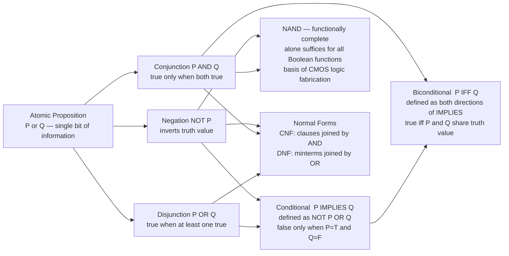

# Logical Connectives and Boolean Algebra

> [!abstract] TL;DR
> Logical connectives — negation, conjunction, disjunction, conditional, biconditional — are the operators that combine atomic propositions into complex truth-functional statements, each fully defined by its truth table. George Boole's 1854 algebra showed that these operations obey a compact set of identities (De Morgan, distributivity, absorption, duality) and that NAND alone suffices to express every Boolean function, making it the universal building block of all digital hardware. Mastering these connectives also means understanding the gap between the material conditional's truth-table definition and how "if-then" works in everyday language — a distinction that catches every beginner at least once.

---

## Intuition

**Analogy:** Imagine a burglar alarm with multiple sensors: a door sensor D and a window sensor W. The alarm policy is a Boolean function of those sensors. "Trigger if D AND W are both tripped" is conjunction. "Trigger if D OR W is tripped" is disjunction. "Silence the alarm if D is NOT tripped" is negation. "IF D is tripped THEN alert the police" is a conditional. The security engineer's job is to combine sensor signals with these logical operators to build an arbitrarily complex policy — and every such policy can be expressed using just five primitive connectives.

Boolean algebra is the mathematics that governs these combinations. Once you see that P AND Q is a function that outputs True exactly when both inputs are True, and that this function obeys the same structural laws as multiplication and addition in a two-element number system, the entire edifice — De Morgan's laws, distributivity, NAND universality, canonical normal forms — follows from a handful of axioms.

---

## How It Works

### Core Mechanics: The Five Standard Connectives

Each connective is entirely defined by its truth table — the exhaustive mapping from every input combination to an output truth value.

| P | Q | ¬P | P ∧ Q | P ∨ Q | P → Q | P ↔ Q |
|---|---|----|-------|-------|-------|-------|
| F | F |  T |   F   |   F   |   T   |   T   |
| F | T |  T |   F   |   T   |   T   |   F   |
| T | F |  F |   F   |   T   |   F   |   F   |
| T | T |  F |   T   |   T   |   T   |   T   |

Reading notes:
- **¬P (Negation)** — unary; flips the truth value.
- **P ∧ Q (Conjunction)** — True only when both inputs are True.
- **P ∨ Q (Disjunction)** — True when at least one input is True (inclusive OR).
- **P → Q (Conditional)** — the single False row is (T, F): P is true but Q is false. Both False-antecedent rows output True — this is vacuous truth.
- **P ↔ Q (Biconditional)** — True exactly when P and Q share the same truth value.

Three key derivations tie the five together:

```
P → Q      ≡  ¬P ∨ Q                     (conditional as disjunction)
P ↔ Q      ≡  (P → Q) ∧ (Q → P)          (biconditional as mutual implication)
¬(P ∧ Q)   ≡  ¬P ∨ ¬Q                    (De Morgan's first law)
¬(P ∨ Q)   ≡  ¬P ∧ ¬Q                    (De Morgan's second law)
```

### Boolean Algebra Laws

Boole (1854) showed that ∧, ∨, ¬ over {True, False} satisfy the following identities, all verifiable by truth table:

| Law | AND form | OR form |
|-----|----------|---------|
| Identity | P ∧ T = P | P ∨ F = P |
| Null | P ∧ F = F | P ∨ T = T |
| Idempotent | P ∧ P = P | P ∨ P = P |
| Complement | P ∧ ¬P = F | P ∨ ¬P = T |
| Double negation | ¬¬P = P | — |
| Commutative | P ∧ Q = Q ∧ P | P ∨ Q = Q ∨ P |
| Associative | P ∧ (Q ∧ R) = (P ∧ Q) ∧ R | P ∨ (Q ∨ R) = (P ∨ Q) ∨ R |
| Distributive | P ∧ (Q ∨ R) = (P∧Q) ∨ (P∧R) | P ∨ (Q∧R) = (P∨Q) ∧ (P∨R) |
| De Morgan | ¬(P∧Q) = ¬P∨¬Q | ¬(P∨Q) = ¬P∧¬Q |
| Absorption | P ∧ (P∨Q) = P | P ∨ (P∧Q) = P |

The **duality principle**: replacing every ∧ with ∨, every ∨ with ∧, every T with F, and every F with T turns any true identity into another true identity. De Morgan's two laws are duals of each other.

### Flow / Architecture



---

## Key Concepts

### Secondary

**Propositions and truth values.** A proposition is any declarative statement that is either True (1) or False (0). "It is raining" is a proposition; "Is it raining?" is not. Connectives combine propositions into compound propositions whose truth value is determined entirely by the truth values of their components — this property is called **truth-functionality**.

**Tautologies and contradictions.** A formula that is True in every row of its truth table is a **tautology** (e.g., P ∨ ¬P — the law of excluded middle). One that is False in every row is a **contradiction** (e.g., P ∧ ¬P). One that is True in some rows and False in others is **contingent**.

**Reading the conditional.** P → Q is False only at (T, F) — P true, Q false. Intuitively: "I promised that if P then Q; I broke my promise only by making P true while Q was false." The surprising rows are the two (F, _) rows: if P is false, the conditional is vacuously True regardless of Q. A promise that precondition is never met cannot be broken.

**Operator precedence (high to low):** ¬, then ∧, then ∨, then →, then ↔. So ¬P ∧ Q means (¬P) ∧ Q, not ¬(P ∧ Q). These have different truth tables, and this error is extremely common.

---

### Undergraduate

**Boolean algebra as a formal system.** The two-element structure ({F, T}, ∧, ∨, ¬, F, T) satisfying the laws above is a **Boolean algebra** in the sense of the abstract algebra definition. The same axioms are satisfied by power-set algebra (∩, ∪, complement over subsets of a set) and by propositions in any classical logic. The two-element Boolean algebra is the simplest non-trivial model.

**Functional completeness and NAND universality.** A set of connectives S is **functionally complete** if every Boolean function can be expressed using only the connectives in S. The set {¬, ∧} is functionally complete; so is {¬, ∨}; so is {NAND} alone:

```
NOT P         =  NAND(P, P)
P AND Q       =  NAND(NAND(P, Q), NAND(P, Q))
P OR Q        =  NAND(NAND(P, P), NAND(Q, Q))      (De Morgan)
```

Similarly, {NOR} alone is functionally complete. This is why CMOS chips are fabricated almost entirely from NAND gates: one physical gate type covers the entire Boolean universe.

**Canonical Normal Forms.** Every Boolean function has exactly one canonical DNF and one canonical CNF, read directly from the truth table:

- **DNF (Disjunctive Normal Form, sum of products):** For each row where the output is True, write an AND of all variables (positive if the variable is True in that row, negated if False). OR all these minterms together.

  XOR example: output is True at (F,T) and (T,F), giving DNF = (¬P ∧ Q) ∨ (P ∧ ¬Q).

- **CNF (Conjunctive Normal Form, product of sums):** For each row where the output is False, write an OR of all variables (negated if the variable is True in that row, positive if False). AND all these clauses together.

  XOR example: output is False at (F,F) and (T,T), giving CNF = (P ∨ Q) ∧ (¬P ∨ ¬Q).

CNF is the canonical input format for SAT solvers because AND-of-clauses maps cleanly onto unit propagation algorithms (DPLL, CDCL).

**XOR: exclusive disjunction.** P ⊕ Q is True when exactly one input is True. It equals (P ∨ Q) ∧ (¬P ∨ ¬Q). XOR is its own inverse: P ⊕ P = F, P ⊕ F = P. It is commutative, associative, and self-inverse. In GF(2) arithmetic, XOR is addition — which is why XOR appears in every parity-based error detection and correction scheme (CRC, Hamming, RAID-5 parity stripes).

---

### Graduate

**Shannon Expansion (cofactor decomposition).** Claude Shannon (1938) proved that any Boolean function f(x₁, …, xₙ) can be decomposed on any variable xᵢ as:

```
f(x₁, ..., xₙ) = (xᵢ ∧ f⁺ᵢ)  ∨  (¬xᵢ ∧ f⁻ᵢ)
```

where f⁺ᵢ is the **positive cofactor** (f with xᵢ fixed to True) and f⁻ᵢ is the **negative cofactor** (f with xᵢ fixed to False). Applying this recursively to every variable produces a Binary Decision Diagram (BDD). The Reduced Ordered BDD (ROBDD) is canonical and can represent structured Boolean functions exponentially more compactly than a full truth table. ROBDDs are the data structure behind hardware model checkers (NuSMV, Cadence JasperGold).

**Boolean ring and Algebraic Normal Form.** Replace ∨ with XOR (⊕) as ring addition and keep ∧ as ring multiplication. Then {0,1} with XOR and AND forms GF(2), the finite field with two elements. Over GF(2), every Boolean function has a unique **Algebraic Normal Form (ANF)**, also called the Reed-Muller expansion:

```
f(x₁, ..., xₙ) = a₀ ⊕ a₁x₁ ⊕ a₂x₂ ⊕ a₁₂x₁x₂ ⊕ ... ⊕ a₁₂...ₙx₁x₂...xₙ
```

where each coefficient aᵢ ∈ {0,1}. The algebraic degree of f in ANF — the size of the largest term with a non-zero coefficient — measures resistance to algebraic attacks in cryptography. A cipher S-box with low algebraic degree is vulnerable.

**The paradoxes of material implication.** P → Q is defined as ¬P ∨ Q — a purely truth-functional definition that causes three well-known "paradoxes":

1. **Paradox of the false antecedent (vacuous truth):** If P is false, P → Q is true for any Q. "If 0 = 1, then all mathematicians are wrong" is logically True.
2. **Paradox of the true consequent:** If Q is true, P → Q is true for any P. "If pigs can fly, then 2 + 2 = 4" is logically True.
3. **Failure of relevance:** Material implication requires no logical connection between P and Q. The causal, temporal, or explanatory relationship that "if-then" carries in natural language is entirely absent.

These are not contradictions — they follow rigorously from the definition. They are "paradoxes" in that they diverge from pre-theoretic intuition. **Relevance logics** (Anderson and Belnap 1975) require that P must contribute to establishing Q for P → Q to hold. **Counterfactual conditionals** (Lewis 1973) use possible-worlds semantics to capture "if P were true, Q would be true" without treating all false-antecedent conditionals as trivially true.

---

## Python Demo

```python
"""
Logical Connectives and Boolean Algebra — Python Demo
Implements the 7 named Boolean operations, enumerates all 16 binary
Boolean connectives with truth tables, verifies De Morgan's laws,
demonstrates Shannon expansion on MAJORITY(A,B,C), and visualises
the 16 connectives as a matplotlib heatmap.
numpy and matplotlib only.
"""
import numpy as np
import matplotlib.pyplot as plt

# ─── 1. The seven named Boolean operations ───────────────────────────────────
def bool_and(p, q):   return p and q          # conjunction   P ∧ Q
def bool_or(p, q):    return p or q           # disjunction   P ∨ Q
def bool_not(p):      return not p            # negation      ¬P
def bool_xor(p, q):   return p ^ q            # exclusive-or  P ⊕ Q
def bool_nand(p, q):  return not (p and q)    # NAND          ¬(P ∧ Q)
def bool_nor(p, q):   return not (p or q)     # NOR           ¬(P ∨ Q)
def bool_xnor(p, q):  return not (p ^ q)      # biconditional P ↔ Q

INPUTS = [(False, False), (False, True), (True, False), (True, True)]

# Print truth table for each named binary operation
print("Named Boolean Operations — Truth Tables")
print(f"  {'Operation':<22}  {'F,F':>5}  {'F,T':>5}  {'T,F':>5}  {'T,T':>5}")
print("  " + "-" * 48)
for name, fn in [
    ("AND   P ∧ Q",  bool_and),
    ("OR    P ∨ Q",  bool_or),
    ("XOR   P ⊕ Q",  bool_xor),
    ("NAND  ¬(P∧Q)", bool_nand),
    ("NOR   ¬(P∨Q)", bool_nor),
    ("XNOR  P ↔ Q",  bool_xnor),
]:
    vals = "   ".join(str(int(fn(p, q))) for p, q in INPUTS)
    print(f"  {name:<22}  {vals}")

print(f"\n  NOT (unary):  NOT(F)={int(bool_not(False))}  "
      f"NOT(T)={int(bool_not(True))}")

# ─── 2. All 16 binary Boolean connectives ────────────────────────────────────
# There are 2^(2^2) = 16 distinct functions from {F,T}^2 to {F,T}.
# Each is identified by its 4-bit output pattern for inputs (F,F),(F,T),(T,F),(T,T).

CONNECTIVES_16 = [
    ("00  FALSE",               lambda p, q: False),
    ("01  AND     P∧Q",         lambda p, q: bool_and(p, q)),
    ("02  P and not-Q",         lambda p, q: p and not q),
    ("03  P  identity",         lambda p, q: p),
    ("04  not-P and Q",         lambda p, q: not p and q),
    ("05  Q  identity",         lambda p, q: q),
    ("06  XOR     P⊕Q",         lambda p, q: bool_xor(p, q)),
    ("07  OR      P∨Q",         lambda p, q: bool_or(p, q)),
    ("08  NOR     ¬(P∨Q)",      lambda p, q: bool_nor(p, q)),
    ("09  XNOR    P↔Q",         lambda p, q: bool_xnor(p, q)),
    ("10  not-Q   identity",    lambda p, q: not q),
    ("11  Q→P     converse",    lambda p, q: (not q) or p),
    ("12  not-P   identity",    lambda p, q: not p),
    ("13  P→Q     conditional", lambda p, q: (not p) or q),
    ("14  NAND    ¬(P∧Q)",      lambda p, q: bool_nand(p, q)),
    ("15  TRUE",                lambda p, q: True),
]

# Build 16x4 truth-table matrix
matrix = np.zeros((16, 4), dtype=np.uint8)
for i, (name, fn) in enumerate(CONNECTIVES_16):
    for j, (p, q) in enumerate(INPUTS):
        matrix[i, j] = int(fn(p, q))

print("\nAll 16 Binary Connectives  (columns: F,F | F,T | T,F | T,T)")
for i, (name, _) in enumerate(CONNECTIVES_16):
    bits = "  ".join(str(v) for v in matrix[i])
    print(f"  {name:<30}  {bits}")

# ─── 3. Verify De Morgan's laws ───────────────────────────────────────────────
print("\nDe Morgan's Laws Verification:")
all_ok = True
for p, q in INPUTS:
    law1 = bool_nand(p, q) == (bool_not(p) or bool_not(q))   # ¬(P∧Q) ≡ ¬P∨¬Q
    law2 = bool_nor(p, q)  == (bool_not(p) and bool_not(q))  # ¬(P∨Q) ≡ ¬P∧¬Q
    if not (law1 and law2):
        all_ok = False
        print(f"  FAIL at P={int(p)}, Q={int(q)}")
print(f"  ¬(P∧Q) ≡ ¬P∨¬Q  and  ¬(P∨Q) ≡ ¬P∧¬Q  — verified for all inputs: {all_ok}")

# ─── 4. Shannon expansion — cofactor demo on MAJORITY ─────────────────────────
# Shannon: f(P,Q,...) = (P ∧ f_pos) ∨ (¬P ∧ f_neg)
# MAJORITY(A,B,C) = (A∧B) ∨ (B∧C) ∨ (A∧C)
# Expanding on A gives: (A ∧ (B∨C)) ∨ (¬A ∧ (B∧C))
def majority(a, b, c):
    return (a and b) or (b and c) or (a and c)

print("\nShannon Expansion of MAJORITY(A,B,C) expanded on variable A:")
print("  Reconstruction: f = (A ∧ f_A1) ∨ (¬A ∧ f_A0)")
for b in [False, True]:
    for c in [False, True]:
        f_pos = majority(True, b, c)    # positive cofactor: A=True
        f_neg = majority(False, b, c)   # negative cofactor: A=False
        # Shannon reconstruction at each value of A:
        shannon_at_T = (True  and f_pos) or (False and f_neg)  # = f_pos
        shannon_at_F = (False and f_pos) or (True  and f_neg)  # = f_neg
        direct_T = majority(True,  b, c)
        direct_F = majority(False, b, c)
        ok = (shannon_at_T == direct_T) and (shannon_at_F == direct_F)
        print(f"  B={int(b)}, C={int(c)}:  pos_cofactor={int(f_pos)}"
              f"  neg_cofactor={int(f_neg)}  verified={ok}")
print("  Interpretation: with A=True we need 1 more vote (B∨C);"
      "\n  with A=False we need both remaining votes (B∧C).")

# ─── 5. Heatmap: all 16 connectives ──────────────────────────────────────────
fig, ax = plt.subplots(figsize=(6, 9))

ax.imshow(matrix, cmap="RdYlGn", aspect="auto", vmin=0, vmax=1)

ax.set_xticks(range(4))
ax.set_xticklabels(["P=F, Q=F", "P=F, Q=T", "P=T, Q=F", "P=T, Q=T"],
                   rotation=20, ha="right", fontsize=9)
ax.set_yticks(range(16))
ax.set_yticklabels([name for name, _ in CONNECTIVES_16], fontsize=8)

# Annotate each cell
for i in range(16):
    for j in range(4):
        val = matrix[i, j]
        ax.text(j, i, "T" if val else "F",
                ha="center", va="center", fontsize=10, fontweight="bold",
                color="white" if val else "#222222")

ax.set_title(
    "All 16 Binary Boolean Connectives\n"
    "green = True output   red = False output",
    fontsize=10, pad=12)
ax.set_xlabel("Input pair (P, Q)")
ax.set_ylabel("Connective index and name")

plt.tight_layout()
plt.savefig("boolean_16_connectives.png", dpi=130, bbox_inches="tight")
plt.show()
```

**Expected output highlights:**
```
Named Boolean Operations — Truth Tables
  Operation               F,F    F,T    T,F    T,T
  ------------------------------------------------
  AND   P ∧ Q             0   0   0   1
  OR    P ∨ Q             0   1   1   1
  XOR   P ⊕ Q             0   1   1   0
  NAND  ¬(P∧Q)            1   1   1   0
  NOR   ¬(P∨Q)            1   0   0   0
  XNOR  P ↔ Q             1   0   0   1

De Morgan verified: True
Shannon expansion verified for all B,C inputs: True
```

---

## Real-World Applications

> **SAT Solvers and Hardware Verification.** Every VLSI chip design is verified using Boolean satisfiability. The gate netlist is compiled to CNF (each gate becomes one or more clauses), and a SAT solver — running DPLL or CDCL with clause learning — either finds an input that triggers a bug or proves no such input exists. Intel's Jasper and Cadence Conformal use this pipeline for every production processor.

> **SQL Query Optimisation.** Database query planners parse WHERE clauses as Boolean expressions and apply distributive and absorption laws automatically. The predicate `WHERE (city='NY' OR city='LA') AND (city='NY' OR age>18)` simplifies by distribution to `WHERE city='NY' OR (city='LA' AND age>18)`, enabling a narrower index scan and cutting execution time dramatically.

> **CMOS Logic Synthesis.** Physical chips are built from NAND (and NOR) gates because NAND's functional completeness means any Boolean function maps to a NAND-only netlist. CAD tools such as Synopsys Design Compiler accept RTL Verilog, convert it to a Boolean network in CNF or DNF, then synthesise a minimal NAND circuit meeting area, power, and timing constraints.

> **Cryptographic S-Box Design.** Block ciphers (AES, DES) use substitution boxes whose security is measured by their Boolean algebraic properties: nonlinearity (distance from affine functions in ANF), algebraic degree, and differential uniformity. S-box designers maximise nonlinearity using the GF(2) Boolean ring structure to resist linear and differential cryptanalysis.

> **Binary Decision Diagrams in Model Checking.** Tools like SPIN and NuSMV represent concurrent program state spaces as ROBDDs built via Shannon expansion. A safety invariant — "no two threads hold the mutex simultaneously" — becomes a Boolean formula checked by BDD manipulation rather than explicit-state enumeration. For structured state spaces, ROBDDs shrink exponential truth tables to polynomial size.

---

## Common Pitfalls

- **Inclusive vs exclusive OR** — Mathematical disjunction (∨) is inclusive: P ∨ Q is True even when both are True. Natural-language "or" is frequently exclusive ("soup or salad"). Always verify which meaning is intended when translating English to logic.

- **Vacuous truth of the conditional** — P → Q is True whenever P is False. "If pigs can fly, the Earth is flat" is logically True. This is not a flaw — it is the definition ¬P ∨ Q — but beginners who read → as causal implication are surprised every time.

- **De Morgan misapplication** — The most common algebraic error is writing ¬(P ∧ Q) = ¬P ∧ ¬Q. The correct identity is ¬(P ∧ Q) = ¬P ∨ ¬Q. The negation distributes and flips the connective: AND becomes OR, OR becomes AND.

- **Operator precedence** — Without parentheses, ¬P ∧ Q means (¬P) ∧ Q, not ¬(P ∧ Q). Precedence from highest to lowest: ¬, ∧, ∨, →, ↔. The two versions have different truth tables at (T, T): (¬T) ∧ T = F but ¬(T ∧ T) = F too — same result here, but (F, T): (¬F) ∧ T = T vs ¬(F ∧ T) = T — still the same, but at (T, F): (¬T) ∧ F = F vs ¬(T ∧ F) = T — here they diverge.

- **CNF and DNF row direction** — DNF reads minterms from rows where the output is True (positive rows). CNF reads maxterms from rows where the output is False (negative rows), and in each maxterm the polarity of each variable is flipped. Getting the direction reversed produces the dual of the intended normal form.

- **NAND self-composition confusion** — NAND(P, P) = ¬(P ∧ P) = ¬P by idempotence, not ¬P ∧ ¬P. The output is ¬P (a single bit), which is what is intended. The confusion arises from mentally distributing the negation before applying idempotence.

---

## Related Concepts

- [[Logic_and_Critical_Thinking_Overview]] — provides the broader propositional calculus framework; this note supplies the detailed connective mechanics and algebraic structure that underlie everything described there
- [[Boolean_Algebra_and_Logic_Gates]] — the hardware realisation of these Boolean laws: AND, OR, NOT, NAND, NOR, XOR as physical gate circuits; K-map minimisation for gate-count reduction directly applies the absorption and distributive laws from this note
- [[Combinational_Circuits]] — adders, MUXes, and ALUs implement Boolean functions in silicon; the 2-to-1 MUX is exactly Shannon expansion made physical, with the select line acting as the cofactor variable
- [[Logic_and_Proof_Techniques]] — uses propositional connectives throughout proof structure; modus ponens is the conditional's (T,T)→T row made into an inference rule; De Morgan is the key equivalence behind contrapositive proofs
- [[Mathematical_Logic_and_Set_Theory]] — propositional Boolean algebra is the zeroth-order fragment; this note's material lives inside the larger landscape of first-order predicate logic, Gödel completeness, and ZFC foundations studied there
- [[Formal_Semantics]] — natural language "and," "or," "not," and "if" are given truth-conditional meanings using exactly these Boolean connectives; the material conditional's paradoxes directly motivate the intensional extensions (strict implication, possible worlds) that formal semantics adds on top
- [[Bit_Manipulation]] — at machine level, bitwise &, |, ^, ~ apply the Boolean connectives to all 64 bits of a CPU register simultaneously; the algebraic identities (n & (n-1) clears the lowest set bit, n ^ n = 0) are direct applications of Boolean laws
- [[Set_Theory_and_Relations]] — set intersection, union, and complement are isomorphic to ∧, ∨, ¬ under the characteristic function mapping; every Boolean algebra identity translates verbatim into a set-algebra identity, and De Morgan's laws are the same equation in both languages

---

## Review Questions

### Secondary

1. Construct the truth table for P → Q. Identify the one row where it is False and explain in plain English — using the "promise" analogy — why the two rows with P = False output True.
2. Apply De Morgan's law to negate the statement "It is raining AND cold." Write the negated formula using OR and simplified negations. Verify with a small example.
3. Which of the five standard connectives can be defined in terms of the others? Write P ↔ Q and P → Q each using only ¬ and ∨.

### Undergraduate

1. Prove that {NAND} is functionally complete by expressing NOT P, P AND Q, and P OR Q using only NAND gates. Then express NOR purely in terms of NAND.
2. Convert f(P, Q, R) = (P ∨ Q) ∧ ¬R into full canonical CNF and DNF. Count the minterms and clauses — how do they relate to the number of True and False rows in the 8-row truth table?
3. The absorption law states P ∨ (P ∧ Q) = P. Prove this from the Boolean algebra axioms (identity, complement, distributive) alone, without a truth table. Then state and prove its dual.

### Graduate

1. Apply Shannon expansion to f(A, B, C) = A ⊕ B ⊕ C (three-variable XOR) on variable A. Write the positive and negative cofactors. Sketch the top two levels of the ROBDD for this function. Is the ROBDD smaller than the full 8-row truth table? Justify.
2. Explain why {∧, ∨} without negation is not functionally complete. Hint: every function expressible with only ∧ and ∨ must be monotone (adding more True inputs cannot turn a True output into False). Prove this monotonicity property and use it to exhibit a function that {∧, ∨} cannot express.
3. The material conditional P → Q makes "if 0 = 1, then 0 = 2" logically True (vacuous truth). Relevance logic requires that P must be relevant to Q for P → Q to hold. Describe one formal account of relevance implication and identify the specific Boolean-algebra property it adds or removes compared to the truth-functional definition ¬P ∨ Q.

---

## Sources

- [Boole, G. "An Investigation of the Laws of Thought" (1854) — Project Gutenberg full text](https://www.gutenberg.org/ebooks/15114)
- [Shannon, C. E. "A Symbolic Analysis of Relay and Switching Circuits," Trans. AIEE 57:713–723 (1938)](https://doi.org/10.1109/T-AIEE.1938.5057767)
- [Stanford Encyclopedia of Philosophy — Classical Logic (rev. 2022)](https://plato.stanford.edu/entries/logic-classical/)
- [Enderton, H. B. "A Mathematical Introduction to Logic" 2nd ed., Academic Press (2001)](https://www.sciencedirect.com/book/9780122384523/a-mathematical-introduction-to-logic)
- [Knuth, D. E. "The Art of Computer Programming" Vol. 4A Ch. 7 — Boolean Functions and Related Topics (2011)](https://www-cs-faculty.stanford.edu/~knuth/taocp.html)

---

#logic #boolean-algebra #logical-connectives #propositional-logic
