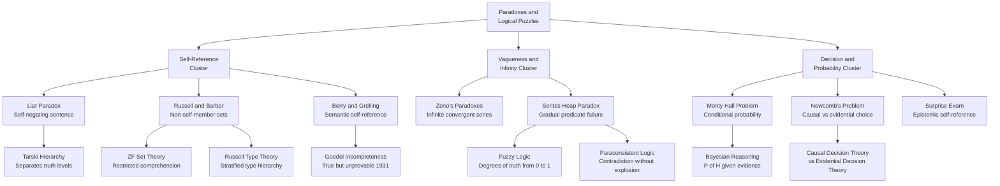

# Paradoxes and Logical Puzzles

> [!abstract] TL;DR
> A paradox is an argument that proceeds from apparently acceptable premises through apparently valid steps to an apparently unacceptable — often self-contradictory — conclusion. Far from mere curiosities, paradoxes are fault lines in formal systems: historically they forced the invention of type theory, ZF set theory, fuzzy logic, and paraconsistent logic. Understanding them means understanding exactly where classical logic, naive set theory, and ordinary language each break down.

---

## Intuition

**Analogy:** Imagine a security badge that reads "This badge is invalid." If the badge is valid, its claim is true, so it must be invalid. If it is invalid, its claim is false, so it must be valid. The badge cannot consistently be either. Now replace the badge with a sentence, a set, a barber's rule, or a probability puzzle — and you have the family of paradoxes studied in logic.

The badge example reveals the root cause of most paradoxes: **self-reference** (a statement talks about itself), **unrestricted abstraction** (any description defines an object), or **vagueness** (a predicate that admits borderline cases). Each class demands a different formal fix.

---

## How It Works

### Core Paradoxes

#### 1. The Liar Paradox
Statement L: "This sentence is false."

- If L is true, then what it says holds, so L is false. Contradiction.
- If L is false, then what it says fails, so L is true. Contradiction.

**Strengthened Liar:** "This sentence is not true." — eliminates the loophole of assigning a third truth value "undefined."

**Resolution:** Tarski's hierarchy of metalanguages. A sentence can only predicate truth or falsity of sentences in a lower-level language. L attempts to be in the same level as what it talks about — an illegal move in a properly stratified system.

#### 2. Russell's Paradox
Let R = { x | x ∉ x } — the set of all sets that do not contain themselves.

- If R ∈ R, then by definition R ∉ R. Contradiction.
- If R ∉ R, then by definition R ∈ R. Contradiction.

This demolished **naive set theory** (Cantor–Frege: any predicate defines a set). Russell communicated it to Frege in 1902, destroying the almost-complete *Grundgesetze*.

**Resolutions:**
- **Russell's Type Theory (1903):** Objects are stratified into types (individuals, sets of individuals, sets of sets, …). A set can only contain objects of a strictly lower type, so R cannot be formed.
- **ZF Set Theory (Zermelo 1908, Fraenkel 1922):** The **Axiom of Separation** replaces unrestricted comprehension: you may only form subsets of an already-existing set. There is no "set of all sets" to serve as the domain.

#### 3. The Barber Paradox
In a village, a barber shaves all and only those villagers who do not shave themselves. Who shaves the barber?

- If the barber shaves himself, he is someone who shaves himself, so by rule he must not. Contradiction.
- If the barber does not shave himself, he is someone who does not shave himself, so by rule he must. Contradiction.

**Resolution:** No such barber can exist. The paradox is a proof by contradiction that the described rule is inconsistent, not a paradox about logic itself. It is a concrete illustration of the set-theoretic issue: the "barber" corresponds to the Russell set, and the "village" corresponds to the supposed universal set.

#### 4. Grelling's Paradox
Call an adjective **autological** if it describes itself ("short" is short, "English" is English), and **heterological** if it does not ("long" is not long, "French" is not French).

Is "heterological" heterological?
- If yes: "heterological" describes itself, so it is autological — contradiction.
- If no: it fails to describe itself, so it is heterological — contradiction.

This is Russellian self-reference applied to **semantic properties of words** rather than sets, showing the paradox is not limited to set theory.

#### 5. Berry's Paradox
Consider: "The smallest positive integer not definable in fewer than twelve words."

That phrase has eleven words and defines a number — a contradiction. It implies no sharp boundary exists between "definable" and "not definable" in a fixed language; the concept of definability is not formalizable within the language itself. Berry's paradox is closely related to **Gödel's incompleteness theorems**: Gödel's 1931 proof constructs a sentence that says "I am not provable in this system," a numerical encoding of the Liar Paradox.

#### 6. Zeno's Paradoxes
Achilles gives the tortoise a head start. Before Achilles reaches where the tortoise was, the tortoise moves ahead. Before he covers that gap, the tortoise moves again. Infinite steps — can he ever catch up?

Classically the apparent problem is that infinitely many steps seem to require infinite time. The modern resolution: an infinite **convergent series** sums to a finite number. If each step takes half the previous time, total time = 1 + 1/2 + 1/4 + ... = 2 (finite). Zeno's deeper challenge — whether actual infinity is coherent — required the development of rigorous real analysis (Weierstrass, Cauchy) and ultimately axiomatic set theory to settle.

**Arrow Paradox:** At any instant, a flying arrow occupies a fixed position and is therefore at rest. Motion requires an interval of time, not just an instant. This foreshadows issues in the foundations of calculus about instantaneous rates of change.

#### 7. The Sorites Paradox (Heap)
One grain of sand is not a heap. Adding one grain to a non-heap never creates a heap. Therefore: no amount of grains is ever a heap.

The argument is structurally valid but the conclusion is absurd. The fault lies in **vagueness**: "heap" has borderline cases and no sharp threshold. Classical two-valued logic cannot handle predicates with gradual truth.

**Responses:**
- **Fuzzy logic (Zadeh 1965):** Truth values are real numbers in [0, 1]. "1000 grains is a heap" might have truth value 0.95; "5 grains" might be 0.02. The sorites premise becomes: adding one grain raises truth value by a tiny amount — which is acceptable.
- **Supervaluationism:** A sentence is supertrue if true on all acceptable ways of drawing the sharp boundary, and superfalse if false on all. Borderline sentences are neither.
- **Paraconsistent logic:** Tolerate the contradiction rather than resolve it; a statement and its negation can both hold without the system collapsing into trivialism.

#### 8. The Surprise Exam Paradox
A teacher says: "I will give a surprise exam sometime next week. You will not be able to deduce the day of the exam the evening before it."

Student's reasoning: The exam cannot be on Friday (by Friday evening, only Friday is left and you would know). So it cannot be Thursday either (given it cannot be Friday, by Thursday evening Thursday is the only remaining day). By backward induction, the exam cannot occur any day — yet the teacher gives it on Wednesday and the student is indeed surprised.

The paradox exposes a **fixed-point problem** in common knowledge and self-referential announcements. The statement "you will not know" is itself an epistemic statement whose truth depends on the student's reasoning, which depends on the statement — a circular dependency. Formal resolution requires modal logic or epistemic logic where "knowledge" and "surprise" are precisely defined.

#### 9. Newcomb's Problem
A super-being Omega has predicted your choices perfectly in millions of trials. Two boxes: Box A is transparent and contains $1 000. Box B is opaque: Omega put $1 000 000 in it if and only if Omega predicted you would take only Box B; otherwise it is empty.

- **One-boxer (evidential decision theory):** Taking only Box B is evidence that Omega predicted you would, so it very likely contains $1 000 000. Take only B.
- **Two-boxer (causal decision theory):** Omega has already placed or not placed the money; your choice now cannot causally affect the past. Conditional on either state of Box B, two-boxing gives $1 000 more. Take both.

This is a genuine open problem in decision theory. It forces a distinction between **evidential** and **causal** notions of expected utility, and shows that "rational choice" is not well-defined without specifying which decision theory you use.

#### 10. The Monty Hall Problem
You are on a game show. Three doors: one hides a car, two hide goats. You pick Door 1. The host (who knows what is behind each door) opens Door 3 to reveal a goat. Should you switch to Door 2?

**Answer: yes — switching wins 2/3 of the time.**

Intuition: Your initial pick is correct 1/3 of the time. The host's reveal contains information. If you picked wrong (2/3 probability), the host is forced to open the one remaining goat door, leaving the car behind Door 2. Switching wins whenever your initial pick was wrong, which happens 2/3 of the time.

Marilyn vos Savant published this answer in 1990 and received 10 000 letters — many from PhDs — insisting she was wrong. The paradox illustrates how badly human intuition handles **conditional probability**.

---

### How Paradoxes Drive Formal Development

| Paradox | Problem Exposed | Formal Response |
|---------|-----------------|-----------------|
| Liar Paradox | Self-referential truth predicate | Tarski's truth hierarchy; object vs meta-language |
| Russell's Paradox | Unrestricted set comprehension | ZF Set Theory; Russell Type Theory |
| Berry's / Grelling's | Self-referential definability | Gödel incompleteness; formal metalanguage theory |
| Sorites Paradox | Classical bivalence fails for vague predicates | Fuzzy logic; supervaluationism |
| Liar variants | Classical logic explodes under contradiction | Paraconsistent logic (da Costa, Priest) |
| Monty Hall | Intuitive probability reasoning is unreliable | Rigorous Bayesian conditional probability |
| Newcomb's Problem | "Rational choice" is ambiguous | Causal vs Evidential Decision Theory |
| Surprise Exam | Self-referential epistemic statements | Modal / Epistemic logic |

---

### Flow / Architecture



---

## Key Concepts

### Secondary

- **Paradox** — An argument with plausible premises and valid-seeming steps that leads to an unacceptable or self-contradictory conclusion.
- **Self-reference** — When a statement, set, or rule refers to itself, enabling the construction of fixed-point contradictions.
- **Naive set theory** — The pre-Russell assumption that any property P defines the set { x | P(x) }. Russell's paradox shows this is inconsistent.
- **Conditional probability** — P(A | B) = P(A ∩ B) / P(B). The Monty Hall answer requires correctly conditioning on the host's reveal.
- **Bivalence** — The classical principle that every proposition is either true or false, with no third option. The Sorites paradox challenges it.

### Undergraduate

- **Zermelo-Fraenkel Axioms (ZF):** Replace naive comprehension with Axiom of Separation (subsets only from existing sets), Axiom of Replacement, Power Set, Union, Infinity, Foundation, and Choice. Collectively they prevent the formation of self-containing sets or the universal set.
- **Type theory:** Objects are assigned a type (rank); set-formation is only allowed across type boundaries. Russell's set R requires a set of type n containing itself (type n) — illegal.
- **Tarski's Undefinability Theorem:** No consistent language can define its own truth predicate. Formal truth must be defined in a metalanguage strictly richer than the object language.
- **Fuzzy logic:** Extends classical propositional logic so truth values range over [0, 1]. The negation of a proposition p has value 1 − p; conjunction is min(p, q); disjunction is max(p, q). The Sorites premise "adding one grain does not change heap-ness" becomes a claim about infinitesimal changes in truth value — which is acceptable.
- **Paraconsistent logic:** Revokes the classical rule *ex falso quodlibet* ("from a contradiction, anything follows"). A contradictory pair {A, ¬A} does not allow the derivation of an arbitrary sentence B. Inconsistent knowledge bases — common in databases and AI — can be reasoned about without everything becoming provable.
- **Evidential vs Causal Decision Theory:** Evidential DT maximises expected utility conditional on what your action is evidence for; Causal DT maximises expected utility considering only causal consequences of the action. They diverge exactly on problems like Newcomb's where a predictor's past action correlates with your present choice.

### Graduate

- **Gödel's First Incompleteness Theorem (1931):** Any consistent formal system F that can express basic arithmetic contains a sentence G_F such that: G_F is true (in the standard model), but G_F is not provable in F. G_F encodes "This sentence is not provable in F" — a numerical Liar. Consequence: no single formal system can capture all mathematical truth.
- **Gödel's Second Incompleteness Theorem:** F cannot prove its own consistency (assuming F is consistent). This directly undermines Hilbert's program of founding all mathematics on a provably consistent formal base.
- **Löb's Theorem:** If F proves "if G is provable then G is true," then F proves G. This is the formal dual of the Liar Paradox and has applications in modal logic and proof theory.
- **Fixed-point lemma:** For any formula φ(x), there exists a sentence S such that F proves S ↔ φ("S"). The Liar is the fixed point of ¬□x (negation of provability); Gödel's sentence is the fixed point of ¬Provable(x).
- **Hyperintensional contexts and impossible worlds:** Some logics for paradox tolerance use possible-worlds semantics extended with impossible worlds (worlds where A and ¬A both hold), providing a model-theoretic basis for paraconsistent reasoning.
- **Epistemic logic and common knowledge:** The Surprise Exam paradox is dissolved in logics where knowledge is a modal operator; "knowing that you cannot know" requires iterated belief operators and a distinction between first-order and higher-order knowledge.

---

## Python Demo

```python
import numpy as np
import matplotlib
matplotlib.use("Agg")
import matplotlib.pyplot as plt

# ─────────────────────────────────────────────────────────────────────────────
# PART 1: Monty Hall Simulation
# Shows empirically that switching wins ~2/3 of the time.
# ─────────────────────────────────────────────────────────────────────────────

rng = np.random.default_rng(seed=42)
N = 100_000

# Step 1 — assign car and initial player pick uniformly
car  = rng.integers(0, 3, size=N)   # door with car: 0, 1, or 2
pick = rng.integers(0, 3, size=N)   # player's first choice

# Step 2 — host opens a door that is neither the car nor the player's pick
host = np.empty(N, dtype=int)
for i in range(N):
    valid = [d for d in range(3) if d != car[i] and d != pick[i]]
    host[i] = rng.choice(valid)

# Step 3 — switch: the only remaining door (doors are labelled 0,1,2)
switch = 3 - pick - host

stay_win   = (pick   == car)
switch_win = (switch == car)

print(f"Stay   strategy win-rate: {stay_win.mean():.4f}  (theory = 1/3 = 0.3333)")
print(f"Switch strategy win-rate: {switch_win.mean():.4f}  (theory = 2/3 = 0.6667)")

# Rolling average over the last 500 trials
w = 500
stay_roll   = np.convolve(stay_win.astype(float),   np.ones(w) / w, mode="valid")
switch_roll = np.convolve(switch_win.astype(float), np.ones(w) / w, mode="valid")

fig, ax = plt.subplots(figsize=(10, 4))
x = np.arange(len(stay_roll))
ax.plot(x, switch_roll, label="Switch strategy", color="steelblue", linewidth=1.5)
ax.plot(x, stay_roll,   label="Stay strategy",   color="tomato",    linewidth=1.5)
ax.axhline(2 / 3, color="steelblue", linestyle="--", alpha=0.5, label="2/3 theory")
ax.axhline(1 / 3, color="tomato",    linestyle="--", alpha=0.5, label="1/3 theory")
ax.set_xlabel("Trial number")
ax.set_ylabel("Rolling win rate (window = 500)")
ax.set_title("Monty Hall Problem — Empirical Win Rates over 100 000 Trials")
ax.legend(loc="center right")
fig.tight_layout()
fig.savefig("monty_hall.png", dpi=120)
print("Chart saved to monty_hall.png")


# ─────────────────────────────────────────────────────────────────────────────
# PART 2: Self-Reference Circular Checker
# Detects cycles in a directed statement-reference graph (models the Liar).
# ─────────────────────────────────────────────────────────────────────────────

def find_cycles(graph: dict) -> list:
    """
    DFS cycle detector for a directed reference graph.
    graph: {statement_name: [list of statement names it references]}
    Returns a list of cycles (each cycle is a list of node names).
    """
    visited, in_stack, cycles = set(), set(), []

    def dfs(node, path):
        visited.add(node)
        in_stack.add(node)
        path.append(node)
        for ref in graph.get(node, []):
            if ref not in visited:
                dfs(ref, path)
            elif ref in in_stack:
                start = path.index(ref)
                cycles.append(path[start:] + [ref])
        path.pop()
        in_stack.discard(node)

    for node in graph:
        if node not in visited:
            dfs(node, [])
    return cycles


# Liar Paradox: S1 = "This statement is false" — self-loop
liar_graph = {
    "S1": ["S1"],
}

# Strengthened mutual-reference: S2 says S3 is true; S3 says S2 is false
mutual_graph = {
    "S2": ["S3"],
    "S3": ["S2"],
    "S4": ["S5"],   # acyclic chain: no paradox
    "S5": ["S6"],
    "S6": [],
}

# Acyclic chain: represents a non-self-referential proof
acyclic_graph = {
    "Axiom1": ["Lemma1"],
    "Lemma1": ["Theorem1"],
    "Theorem1": [],
}

for label, g in [
    ("Liar paradox (self-loop)", liar_graph),
    ("Mutual-reference pair",   mutual_graph),
    ("Acyclic proof chain",     acyclic_graph),
]:
    cycles = find_cycles(g)
    status = f"CIRCULAR REFERENCE: {cycles}" if cycles else "No circular references"
    print(f"  {label:35s} -> {status}")
```

**Expected output:**
```
Stay   strategy win-rate: 0.3332  (theory = 1/3 = 0.3333)
Switch strategy win-rate: 0.6668  (theory = 2/3 = 0.6667)
Chart saved to monty_hall.png
  Liar paradox (self-loop)            -> CIRCULAR REFERENCE: [['S1', 'S1']]
  Mutual-reference pair               -> CIRCULAR REFERENCE: [['S2', 'S3', 'S2']]
  Acyclic proof chain                 -> No circular references
```

---

## Real-World Applications

1. **Type systems in programming languages.** Russell's Type Theory is the direct ancestor of typed lambda calculus (Church, 1940), which underpins every modern typed language (Haskell, TypeScript, Rust). Dependent types — as in Coq and Lean proof assistants — are a direct engineering response to the self-reference problem in logic. The compiler's type checker is literally an automated inconsistency guard.

2. **Database integrity and circular foreign keys.** Russell's paradox surfaces when a database schema allows a table to contain a foreign key referencing itself without restriction. Relational systems use constraints analogous to the Axiom of Foundation (no infinite descending membership chains) to prevent pathological self-referential records. Graph databases with cycle detection implement the same idea computationally.

3. **Halting problem and Gödel-Turing undecidability.** Turing's 1936 proof that no algorithm can decide whether an arbitrary program halts is structurally a Berry/Liar paradox: assume a HALT(P, I) oracle exists, construct a program that halts if and only if HALT says it does not, and derive a contradiction. Every "there are problems that cannot be solved" result in computer science traces back to this family of self-reference arguments.

4. **Fuzzy logic in control systems.** Industrial control systems for HVAC, automotive braking, and washing machine load sensing use fuzzy logic to handle vague predicates like "temperature is warm" or "load is heavy" — direct descendants of the formal response to the Sorites paradox. Fuzzy PID controllers allow smooth, human-like linguistic rules rather than brittle Boolean thresholds.

5. **Bayesian spam filters and the Monty Hall insight.** Naive Bayes spam classifiers update posterior probabilities as each word is observed — precisely the conditional probability reasoning that the Monty Hall problem tests. The lesson from Monty Hall (evidence from a knowledgeable source must shift your priors) is operationally implemented in every Bayesian classifier, medical test interpretation framework, and A/B testing pipeline.

---

## Common Pitfalls

- **Treating all paradoxes as the same kind of problem.** The Liar is a semantic paradox; Russell's is set-theoretic; the Sorites is about vagueness; Monty Hall is about conditional probability. Each requires a different fix. Trying to resolve the Liar with fuzzy logic (assigning it truth value 0.5) fails: the Strengthened Liar ("This sentence does not have truth value 1") recreates the contradiction at the new level.

- **Assuming ZF set theory "solves" all set-theoretic paradoxes.** ZF avoids known paradoxes, but Gödel's Second Incompleteness Theorem means ZF cannot prove its own consistency. You have exchanged a demonstrated inconsistency for an unprovable consistency. The foundation is solid enough to do mathematics, but not absolutely secure in the philosophical sense.

- **Confusing the Monty Hall host's action with a random door opening.** The key assumption is that the host *knows* where the car is and *always* opens a goat door. If the host opens a random door (possibly revealing the car), the probability analysis changes entirely and switching no longer confers an advantage. Failing to track what the host's action tells you is the classic error.

- **Applying backward induction uncritically.** The Surprise Exam paradox shows that backward induction can unravel an argument that then fails in practice. The same error occurs in game theory (the Centipede game: backward induction predicts no cooperation, yet humans cooperate in experiments). Backward induction requires common knowledge of rationality — a strong assumption that does not always hold.

- **Ignoring the fixed-point structure in Gödel's theorem.** Students often summarise incompleteness as "there are things math cannot prove" — which is true but incomplete. The theorem is specifically about **self-referential sentences about provability**. This is not a global limitation on what can be proved; it is a precise structural claim about sentences that talk about the proof system itself.

- **Conflating paraconsistent logic with accepting contradictions as facts.** Paraconsistent logic does not say contradictions are true; it says that the presence of a contradiction in a knowledge base does not trivialise all reasoning. It is a containment strategy, not an endorsement of inconsistency.

---

## Related Concepts

- [[Logic_and_Critical_Thinking_Overview]] — The parent framework: formal and informal logic, deductive/inductive/abductive reasoning, Gödel's theorems as a key Graduate-level result. Paradoxes are the stress-tests of that entire framework.
- [[Probability_and_Statistics]] — Conditional probability and Bayes' theorem are the formal tools needed to correctly solve the Monty Hall problem and analyse Newcomb's problem from an evidential decision-theory perspective.
- [[Information_Theory]] — Shannon entropy and Kolmogorov complexity connect to Berry's paradox: the complexity of a string is the length of its shortest description, and Berry's argument shows that "shortest description" cannot be uniformly computed — a finite information-theoretic undecidability result.
- [[Combinatorics]] — Counting arguments (inclusion-exclusion, pigeonhole principle) generate their own family of puzzles that border on paradox, such as the Birthday Problem and the Banach-Tarski paradox's roots in the combinatorics of infinite sets.
- [[Number_Theory]] — Gödel's proof encoded statements about formal systems as arithmetic statements (Gödel numbering), making number theory the medium through which logic became self-aware. Prime factorisation and modular arithmetic are the tools of the encoding.
- [[Reasoning_Models]] — Modern LLMs trained on chain-of-thought reasoning struggle systematically with self-referential and counterfactual problems, providing an empirical measure of how far machine reasoning still is from handling paradox correctly.

---

## Review Questions

### Secondary

1. State the Liar Paradox in your own words and explain why simply assigning it the truth value "undefined" does not fully resolve the problem.
2. A friend says the Monty Hall answer is obviously wrong: "After the host opens a door, there are two doors left, so it must be 50/50." Identify the precise error in this reasoning and correct it.
3. What is the Barber Paradox and what does its resolution tell us — not about barbers, but about formal systems?

### Undergraduate

1. Russell's paradox and the Barber paradox have the same logical structure. Identify the shared structure and explain how ZF set theory's Axiom of Separation blocks the paradox without also blocking ordinary useful set constructions.
2. The Sorites paradox can be stated as a valid modus-ponens chain: "1 grain is not a heap; if n grains is not a heap then n+1 grains is not a heap; therefore no number of grains is a heap." Classical logic cannot fault the form. What specifically does fuzzy logic change in this argument, and what new philosophical problem does the fuzzy-logic response introduce?
3. Write the conditional probability calculation for the Monty Hall problem in full: define events, compute P(car behind Door 2 | host opens Door 3), and verify the answer is 2/3. What additional assumption must hold for this calculation to be valid, and how does relaxing it change the answer?

### Graduate

1. Gödel's proof constructs a sentence G that says "G is not provable in F." Walk through the key steps: Gödel numbering, the diagonal lemma, the construction of G, and why G is true but unprovable if F is consistent. Then explain what Gödel's Second Incompleteness Theorem adds.
2. Newcomb's problem is a genuine open problem in decision theory because causal and evidential decision theories give different answers and both are internally coherent. Describe a modified version of Newcomb's problem where causal decision theory clearly gives the better outcome, and another modification where evidential decision theory clearly gives the better outcome. What does this tell us about the limits of a single unified theory of rational choice?
3. Paraconsistent logic tolerates contradictions without explosion; fuzzy logic assigns partial truth values; supervaluationism uses truth across all admissible sharpenings. Compare these three frameworks as responses to the Sorites paradox: which preserves classical tautologies, which changes the semantics of connectives, and which requires giving up the principle of bivalence? Under what practical conditions would you choose each?

---

## Sources

- [Priest, G. *An Introduction to Non-Classical Logic: From If to Is*, 2nd ed. Cambridge University Press, 2008](https://www.cambridge.org/core/books/an-introduction-to-nonclassical-logic/8FC27E82E3A6ECCB95DD0EC4A43B9B2B)
- [Sainsbury, R. M. *Paradoxes*, 3rd ed. Cambridge University Press, 2009 — the standard undergraduate survey of all major paradoxes](https://www.cambridge.org/core/books/paradoxes/B2F48494C0DCE2D06F69A5F27C01DD71)
- [Smullyan, R. *What Is the Name of This Book? The Riddle of Dracula and Other Logical Puzzles*. Prentice-Hall, 1978 — self-reference puzzles from a master logician](https://www.doverpublications.com/products/9780486481982)
- [Tarski, A. "The Concept of Truth in Formalized Languages." in *Logic, Semantics, Metamathematics*, Oxford University Press, 1956 — the definitive treatment of truth hierarchies](https://philpapers.org/rec/TARTCO-5)
- [vos Savant, M. "Ask Marilyn." *Parade Magazine*, September 9, 1990 — the original published Monty Hall solution and its subsequent controversy](https://web.archive.org/web/20130121183432/http://www.marilynvossavant.com/game-show-problem/)

---

#logic #paradoxes #puzzles #self-reference #set-theory
