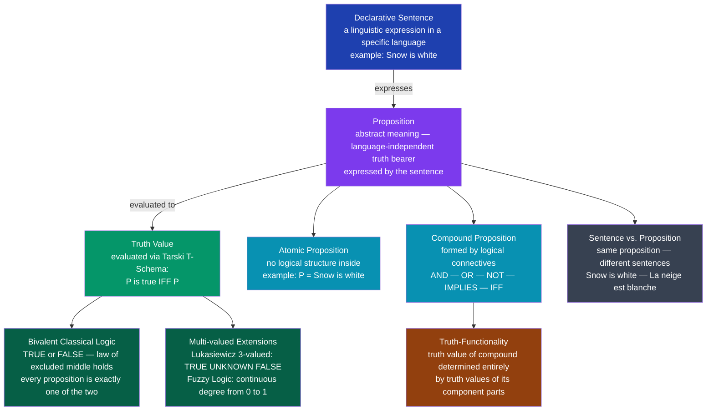

# Propositions and Truth Values

> [!abstract] TL;DR
> A proposition is an abstract meaning-bearer — the content expressed by a declarative sentence — that has exactly one truth value: TRUE or FALSE in classical logic. Truth values are not properties of the sentences themselves but of the propositions they express, which is why two sentences in different languages can express the same proposition. Tarski's T-schema gives the foundational account of what it means for a proposition to be true, while multi-valued and fuzzy logics extend the classical two-value framework to handle uncertainty, vagueness, and future contingents.

---

## Intuition

**Analogy:** Imagine a courtroom verdict form. The judge fills it in for a specific case — "Defendant committed the act: YES / NO." The physical piece of paper (the sentence) is just paper and ink; the verdict itself (the proposition) is the legal determination, which is either true or false independent of how many copies of the form exist, what language they are printed in, or who reads them. Two identical forms filled in identically in French and English express the same verdict — the same proposition — with the same truth value.

This captures the core distinction in logic: a proposition is not the sentence but the abstract claim the sentence makes. "It is raining" in English, "Il pleut" in French, and "Es regnet" in German all express the same proposition — and right now, that proposition is either true or false, regardless of which language you use to assert it.

---

## How It Works

### Core Mechanics

A proposition is the smallest unit of logical reasoning: a claim that can be evaluated as TRUE or FALSE. The process from natural language to logical evaluation has four stages:

1. **Identify a declarative sentence** — "The reactor is at critical temperature." Questions, commands, and exclamations do not express propositions because they cannot be straightforwardly assigned truth values.
2. **Abstract the proposition** — the meaning the sentence conveys, independent of speaker, context, and language. The proposition is what varies when you translate the sentence; the sentence is the particular linguistic vehicle.
3. **Apply a truth value** — assign TRUE or FALSE based on how the world actually is (in classical logic, exactly one of the two applies).
4. **Build compound propositions** — combine atomic propositions with logical connectives whose outputs depend only on the truth values of their inputs (truth-functionality).

### The Five Classical Connectives

| Connective | Symbol | True when | False when |
|---|---|---|---|
| Negation | NOT P | P is false | P is true |
| Conjunction | P AND Q | both P and Q are true | at least one is false |
| Disjunction | P OR Q | at least one is true | both are false |
| Implication | P IMPLIES Q | P is false, OR Q is true | P is true AND Q is false |
| Biconditional | P IFF Q | P and Q have the same value | P and Q differ in value |

### Flow / Architecture



---

## Key Concepts

### Secondary

**What makes something a proposition.** Not every sentence expresses a proposition. "Close the door" is a command — neither true nor false. "Is it cold?" is a question. "What a sunset!" is an exclamation. Only *declarative sentences* — sentences that assert something — express propositions. The test is simple: can you sensibly ask "Is that true?" about it? If yes, it expresses a proposition.

**Atomic and compound propositions.** An atomic proposition cannot be broken into simpler propositional parts. "Paris is the capital of France" is atomic — it is a single claim. A compound proposition is formed by joining atomic propositions with logical connectives. "It is raining AND the ground is wet" is compound: it has two atomic parts joined by AND, and its truth value depends on the truth values of both parts.

**Truth tables.** A truth table exhaustively lists every possible combination of truth values for the atomic propositions in a compound expression and shows the resulting truth value of the whole expression. For two atomic propositions P and Q, there are exactly four rows (FF, FT, TF, TT). Every logical connective can be fully characterized by its truth table.

**The law of excluded middle.** In classical logic, every proposition is either true or false — there is no middle ground. "The next coin flip will be heads" is either true or false right now (we just do not know which). This principle, together with the law of non-contradiction (no proposition is both true and false), defines classical bivalent logic.

---

### Undergraduate

**Truth-functionality.** A connective is truth-functional if the truth value of the compound proposition it creates is fully determined by the truth values of its constituent propositions — nothing else matters. All five classical connectives (NOT, AND, OR, IMPLIES, IFF) are truth-functional. This is what makes a truth table a complete description of a connective: once you know the values of P and Q, you can compute the value of any compound expression built from them using classical connectives.

Not all natural language operators are truth-functional. "It is necessarily the case that..." is not truth-functional — knowing that P is true today does not tell you whether it is necessarily true. Modal operators, tense operators, and belief operators all fall outside truth-functional logic.

**Proposition vs. sentence: the use-mention distinction.** A single proposition can be expressed by many different sentences. "Snow is white" and "La neige est blanche" express the same proposition. Conversely, a single sentence token can express different propositions in different contexts: "The bank is closed" expresses a different proposition depending on whether it is uttered near a river or a financial institution.

The *use-mention distinction* is the related principle that there is a difference between *using* a sentence to assert something and *mentioning* that sentence as a linguistic object. When you say: Snow is white, you are using the sentence to make an assertion. When you say: "Snow is white" is a seven-word sentence, you are mentioning the sentence as an object and saying something about it. Quotation marks mark the shift from use to mention. This distinction is crucial in Tarski's theory of truth.

**Tarski's semantic theory of truth.** Alfred Tarski (1935) proposed that the truth conditions for a proposition are captured by the T-schema:

> "P" is true if and only if P.

Concretely: `"Snow is white" is true if and only if snow is white.`

This deceptively simple schema does real philosophical work. It ties the semantic predicate "is true" to the actual facts of the world: the sentence on the left side is *mentioned* (it is the subject of the claim), and the condition on the right side is *used* (it states when that sentence is true). Tarski showed that a complete truth theory for a formal language can be built by providing a T-sentence for every sentence in the language — and that attempting to do this for a language that can refer to its own truth predicate leads to paradox (the Liar: "This sentence is false").

**Paradoxes of material implication.** The classical implication P IMPLIES Q is defined as: false only when P is true and Q is false. This means a false antecedent makes any implication true: "If the moon is made of cheese IMPLIES Paris is in France" is TRUE, because the antecedent is false. This is counterintuitive — we normally expect an implication to express some connection between its parts. The classical treatment is called *material implication* and is a deliberate idealization; it captures the minimum condition required for valid inference (if P is false, you cannot derive a false conclusion from a true implication), but it does not capture the causal or explanatory import of ordinary "if...then" language.

**Propositional attitudes.** A propositional attitude is a mental state defined by its relationship to a proposition: believing, knowing, desiring, fearing, hoping that P. "Alice believes that it is raining" attributes to Alice an attitude (belief) toward the proposition that it is raining. Propositional attitudes create *intensional contexts*: within a belief report, you cannot substitute co-referring expressions freely. Even if the Morning Star and the Evening Star are the same object (Venus), "Bob believes that the Morning Star is visible" does not entail "Bob believes that the Evening Star is visible" — Bob may not know they are identical.

---

### Graduate

**Multi-valued logics.** Classical bivalent logic assumes every proposition is either true or false. There are principled reasons to relax this:

- **Lukasiewicz 3-valued logic (1920):** Adds a third value, typically "unknown" or "indeterminate," denoted ½. This was motivated by *future contingents* — "The sea battle will take place tomorrow." Aristotle worried that if this is already determinately true or false, fatalism follows. Lukasiewicz assigned ½ to future contingents and redefined the connectives so that NOT ½ = ½, T AND ½ = ½, etc.

- **Kleene strong 3-valued logic:** Treats the third value as "undefined" — the proposition lacks a truth value due to reference failure or computation non-termination. Used in database theory (SQL NULL semantics) and denotational semantics for partial functions.

- **Fuzzy logic (Zadeh 1965):** Truth values are real numbers in the interval [0, 1]. A proposition like "John is tall" has a degree of truth that depends on John's height relative to context — 0.3 for someone at 165 cm, 0.9 for someone at 195 cm. Connectives are redefined: NOT P = 1 − P; P AND Q = min(P, Q); P OR Q = max(P, Q). This allows formal reasoning about inherently vague predicates.

**Bivalence, excluded middle, and their independence.** Two principles that hold in classical logic are often conflated:

- *Law of excluded middle (LEM):* For any proposition P, "P OR NOT P" is a tautology — always true.
- *Principle of bivalence:* Every proposition is either true or false.

These are logically distinct. Intuitionistic logic rejects LEM while retaining the standard connectives — a proposition is only true when there is a constructive proof of it. A proposition for which no proof or disproof exists is neither. This is *not* the same as adding a third truth value; in intuitionism the semantic framework is proof-theoretic rather than model-theoretic.

**The Liar Paradox and Tarski's hierarchy.** The sentence "This sentence is false" is a self-referential proposition that generates a contradiction in any language that can form its own truth predicate. If it is true, then it is false; if it is false, then it is true. Tarski's resolution: no formally consistent language can contain its own truth predicate. Truth must be defined in a *metalanguage* that stands above the *object language*. Formal systems therefore have a hierarchy of languages — L₀, L₁ (which can talk about truth in L₀), L₂ (which can talk about truth in L₁), and so on — preventing circular self-reference.

**Propositions as sets of possible worlds.** A powerful alternative to the truth-conditional T-schema treats a proposition not as a sentence but as the *set of possible worlds in which it is true*. The proposition that it is raining is the set of all possible states of affairs where rain falls. This allows propositions to be compared set-theoretically: P entails Q iff the worlds where P is true are a subset of the worlds where Q is true; P and Q are logically equivalent iff they correspond to exactly the same set of worlds. This is the foundation of Kripke's possible worlds semantics and the modal logic of necessity and possibility.

---

## Python Demo

```python
"""
Propositional Logic Truth Table Generator.

Uses Python's eval() with a variable dictionary to compute truth values
for 7 standard connectives across all 4 input combinations of P and Q.
Displays the result as a color-coded matplotlib table.
"""

import numpy as np
import matplotlib.pyplot as plt
import matplotlib.patches as mpatches

# ---------------------------------------------------------------------------
# 1. Define compound propositions as Python eval-ready expressions.
#    Variables P and Q are injected as True/False via a dict at eval time.
# ---------------------------------------------------------------------------
CONNECTIVES = {
    "P":         "P",
    "Q":         "Q",
    "P AND Q":   "P and Q",
    "P OR Q":    "P or Q",
    "NOT P":     "not P",
    "P IMPLIES Q": "(not P) or Q",   # material conditional: false only when P=T, Q=F
    "P IFF Q":   "P == Q",           # biconditional: true when both have same value
}

# ---------------------------------------------------------------------------
# 2. All 4 truth-value combinations for two atomic propositions
# ---------------------------------------------------------------------------
combos = [
    (False, False),
    (False, True),
    (True,  False),
    (True,  True),
]

# ---------------------------------------------------------------------------
# 3. Evaluate each expression for each (P, Q) pair
# ---------------------------------------------------------------------------
col_labels = list(CONNECTIVES.keys())
cell_text  = []   # display strings
cell_bool  = []   # raw booleans for color mapping

for p_val, q_val in combos:
    env = {"P": p_val, "Q": q_val}
    row_text = []
    row_bool = []
    for name, expr in CONNECTIVES.items():
        result = bool(eval(expr, {"__builtins__": None}, env))
        row_text.append("T" if result else "F")
        row_bool.append(result)
    cell_text.append(row_text)
    cell_bool.append(row_bool)

# ---------------------------------------------------------------------------
# 4. Print to stdout
# ---------------------------------------------------------------------------
header = " | ".join(f"{c:>12}" for c in col_labels)
print(f"{'P':>5}  {'Q':>5} | {header}")
print("-" * (len(header) + 15))
for (p_val, q_val), row in zip(combos, cell_text):
    p_str = "T" if p_val else "F"
    q_str = "T" if q_val else "F"
    row_display = " | ".join(f"{v:>12}" for v in row)
    print(f"  {p_str}      {q_str}   | {row_display}")

# ---------------------------------------------------------------------------
# 5. Render as color-coded matplotlib table
# ---------------------------------------------------------------------------
row_labels = ["P=F  Q=F", "P=F  Q=T", "P=T  Q=F", "P=T  Q=T"]

TRUE_COLOR   = "#bbf7d0"  # green tint
FALSE_COLOR  = "#fecaca"  # red tint
HEADER_COLOR = "#dbeafe"  # blue tint

cell_colors = [
    [TRUE_COLOR if v else FALSE_COLOR for v in row]
    for row in cell_bool
]

fig, ax = plt.subplots(figsize=(14, 4))
ax.axis("off")

tbl = ax.table(
    cellText=cell_text,
    rowLabels=row_labels,
    colLabels=col_labels,
    cellColours=cell_colors,
    cellLoc="center",
    loc="center",
)
tbl.auto_set_font_size(False)
tbl.set_fontsize(11)
tbl.scale(1.3, 2.2)

# Highlight header row and row-label column
for col_idx in range(len(col_labels)):
    tbl[0, col_idx].set_facecolor(HEADER_COLOR)
    tbl[0, col_idx].set_text_props(weight="bold")

for row_idx in range(1, len(combos) + 1):
    tbl[row_idx, -1].set_facecolor(HEADER_COLOR)
    tbl[row_idx, -1].set_text_props(weight="bold")

ax.set_title(
    "Propositional Logic — Complete Truth Table\n"
    "All 7 connectives for P and Q across all 4 input combinations",
    fontsize=12,
    pad=16,
)

true_patch  = mpatches.Patch(color=TRUE_COLOR,  label="TRUE")
false_patch = mpatches.Patch(color=FALSE_COLOR, label="FALSE")
ax.legend(handles=[true_patch, false_patch], loc="lower right", fontsize=10)

plt.tight_layout()
plt.savefig("propositions_truth_table.png", dpi=120, bbox_inches="tight")
plt.show()
```

**Expected output (stdout):**

```
     P       Q |            P |            Q |    P AND Q |     P OR Q |        NOT P | P IMPLIES Q |    P IFF Q
---------------------------------------------------------------------------
  F      F   |            F |            F |          F |          F |            T |           T |          T
  F      T   |            F |            T |          F |          T |            T |           T |          F
  T      F   |            T |            F |          F |          T |            F |           F |          F
  T      T   |            T |            T |          T |          T |            F |           T |          T
```

Note: P IMPLIES Q is FALSE only in row 3 (P=T, Q=F) — the unique combination where a true hypothesis leads to a false conclusion. This is the classical paradox of material implication: a false P makes any implication vacuously true.

---

## Real-World Applications

> **Example 1 — Digital circuit design.** Every digital logic circuit is a physical implementation of truth-functional propositional logic. An AND gate computes P AND Q; an OR gate computes P OR Q; an inverter computes NOT P. A processor's arithmetic logic unit (ALU) evaluates compound Boolean expressions across registers. The entire design flow — from specification to synthesis to physical layout — is grounded in the fact that truth tables completely characterize truth-functional connectives. Karnaugh maps minimize compound expressions to reduce gate count, which is truth-table simplification applied to hardware.

> **Example 2 — SAT solvers in software verification.** A SAT solver answers: "Is there an assignment of TRUE/FALSE to the propositional variables P₁, P₂, ..., Pₙ that makes this compound formula true?" Modern SAT solvers (CDCL algorithm, used in MiniSAT, Z3) can handle millions of variables and are the core of hardware and software model checkers. Intel uses SAT-based verification to catch logic bugs in microprocessors before fabrication — formally checking that the chip's Boolean behavior matches the specification across all input combinations.

> **Example 3 — Natural Language Inference in AI.** Systems like Stanford NLI and the RTE benchmark check whether a premise proposition entails, contradicts, or is neutral with respect to a hypothesis proposition. "Every dog barks" and "Rex is a dog" together entail "Rex barks" — this is modus ponens applied to propositions. Large language models are evaluated on tasks like MultiNLI, which requires correctly computing propositional entailment across diverse text genres. The underlying formal notion is direct from propositional and predicate logic.

> **Example 4 — SQL NULL and three-valued logic.** SQL databases implement Kleene's strong 3-valued logic. A database column value can be NULL (unknown), and SQL boolean expressions evaluate to TRUE, FALSE, or NULL. The WHERE clause predicate `salary > 50000` returns NULL for any row where salary is NULL, and that row is excluded from results. This is not classical bivalence: `NULL = NULL` returns NULL, not TRUE. Understanding this requires knowing that SQL departed from classical two-valued propositional logic deliberately, to handle missing data — a practical deployment of multi-valued logic in production systems used by every relational database.

> **Example 5 — Fuzzy control systems.** Household appliances like washing machines and air conditioners use fuzzy logic controllers. Instead of "water level is HIGH (TRUE) or NOT HIGH (FALSE)," the system computes a truth degree — "water level is 0.7 HIGH, 0.3 MEDIUM" — and the control output is a weighted defuzzification. This avoids the discontinuous, brittle behavior of purely binary decision thresholds and allows smooth, human-like control. Zadeh's fuzzy logic, rooted in extending propositional truth values to the interval [0, 1], is the direct theoretical foundation.

---

## Common Pitfalls

- **Treating a sentence as identical to a proposition** — A sentence is a linguistic object; a proposition is an abstract meaning. "Bachelors are unmarried" in English and its German translation express the same proposition. Confusing the two leads to errors when analyzing statements across languages or formalizations, and it undermines Tarski's T-schema (which requires mentioning the sentence while using the proposition it expresses).

- **Misreading material implication as causation** — P IMPLIES Q in classical logic means only "it is not the case that P is true and Q is false." It carries no causal, temporal, or explanatory force. "The moon is made of cheese IMPLIES Paris is in France" is TRUE under the classical definition, because the antecedent is false. This shocks new students every time; the solution is to remember that material implication is a minimum sufficient condition for valid modus ponens, not a claim about meaning or causation.

- **Vacuous truth of universally quantified propositions over empty sets** — "Every unicorn is purple" is TRUE in classical logic because the universal quantifier "for all x, if x is a unicorn then x is purple" is vacuously satisfied when there are no unicorns. Students who expect it to be meaningless or undefined are applying an informal intuition that classical bivalence does not honor.

- **Assuming excluded middle holds in all logical frameworks** — In intuitionistic logic, "P OR NOT P" is not a tautology. A proposition is only accepted as true when there is a constructive proof; "either Goldbach's conjecture is true or it is false" cannot be asserted in intuitionistic mathematics until a proof or counterexample exists. When working in constructive type theory (Coq, Agda) or formalizing constructive proofs, importing classical reasoning about excluded middle silently breaks the proof framework.

- **Conflating propositional attitudes with plain propositions** — "Alice believes that P" is not the same as "P." Belief creates an intensional context: you cannot substitute co-referring expressions within it. Failing to track this is the source of subtle errors in natural language processing (entailment models that treat belief contexts as transparent), knowledge representation (inserting believed facts directly into a world model), and formal epistemology.

- **Ignoring the distinction between syntax and semantics** — A propositional formula is a syntactic object (a string of symbols). Its truth value is a semantic object (the result of evaluating it against an assignment of values to variables). "P AND Q" without specifying what P and Q stand for has no truth value — only a truth table (a function from assignments to values). Jumping straight to "P AND Q is true or false" without specifying the assignment conflates the syntactic formula with the specific proposition it expresses under an interpretation.

---

## Related Concepts

- [[Logic_and_Proof_Techniques]] — covers propositional connectives and proof strategies built on top of propositional logic (direct proof, contradiction, contrapositive); this note provides the semantic grounding for the syntactic rules applied there.
- [[Boolean_Algebra_and_Logic_Gates]] — the hardware application of propositional truth-functionality: Boolean variables are propositional atoms taking values 0/1, AND/OR/NOT gates are physical implementations of the connectives, and Karnaugh map minimization is truth-table simplification for circuit design.
- [[Formal_Semantics]] — extends propositional truth-functionality to full model-theoretic semantics over natural language: lambda calculus, type theory, and generalized quantifiers build on the propositional foundation covered here; Tarski's T-schema is the bridge.
- [[Semantic_Theory]] — the broader linguistic question of how expressions acquire meaning; truth-conditional semantics (Frege, Tarski, Davidson) treats propositions as the primary meaning units, and Frege's sense/reference distinction applies directly to propositional content.
- [[Pragmatics_and_Speech_Acts]] — propositional attitudes (belief, desire, knowledge) are the central objects of pragmatics; speech acts perform propositions rather than just stating them; Grice's maxims explain how speakers communicate more than the literal propositional content.
- [[Set_Theory_and_Relations]] — the possible-worlds treatment of propositions identifies each proposition with a set of worlds; logical relations between propositions (entailment, equivalence, contradiction) become set-theoretic relations (subset, equality, disjointness), grounding propositional logic in set theory.

---

## Review Questions

### Secondary

1. A classmate claims that "Stop talking!" expresses a proposition because it is either true or false whether people stop talking. Is the classmate right? What is the actual criterion for a sentence to express a proposition, and why does this sentence fail it?
2. Write out the truth table for "P IMPLIES Q" for all four combinations of P and Q. Which row surprises most people, and what is the classical logical justification for that surprising value?
3. "Snow is white" and "La neige est blanche" — do these two sentences express one proposition or two? What does your answer reveal about the relationship between language and propositional content?

### Undergraduate

1. Tarski's T-schema states: `"S" is true if and only if S.` Explain the use-mention distinction that makes this schema non-trivial. What goes wrong if a language is allowed to contain its own truth predicate, and how does Tarski resolve the resulting Liar Paradox?
2. Truth-functionality is the principle that the truth value of a compound proposition is determined entirely by the truth values of its parts. Give one example of a natural language operator that is NOT truth-functional and explain precisely why truth-functionality fails for it — construct a case where the propositional parts have fixed truth values but the compound can be either true or false depending on something other than those values.
3. Compare classical bivalent logic with Lukasiewicz 3-valued logic on the proposition "The first prime number greater than 10^100 is odd." What truth value does each system assign, and what philosophical motivation justifies the Lukasiewicz treatment?

### Graduate

1. The possible-worlds treatment identifies a proposition with the set of possible worlds in which it is true. Under this treatment, what is the propositional content of a necessary truth such as "2 + 2 = 4"? What about a necessarily false proposition? Does this framework successfully individuate propositions — can two distinct propositions have the same truth value in all possible worlds, and if so, how should the framework handle them?
2. Fuzzy logic assigns truth degrees in [0, 1] and defines conjunction as min(P, Q) and disjunction as max(P, Q). Show that the distributive law P AND (Q OR R) = (P AND Q) OR (P AND R) holds in fuzzy logic under the min/max definitions. Then identify one classical propositional law that does NOT hold in the Lukasiewicz 3-valued system and explain what this failure implies for inference rules that rely on it.
3. Propositional attitudes create intensional contexts where the substitutivity of co-referring expressions fails. Alice believes that the morning star rises before 6am. The morning star is Venus. Does it follow that Alice believes that Venus rises before 6am? Analyze this case using the possible-worlds semantics of belief (doxastic accessibility), explain precisely at which step substitution fails, and describe how the standard semantic framework handles the de dicto/de re ambiguity in attitude reports.

---

## Sources

- [Tarski, A. (1944). "The Semantic Conception of Truth and the Foundations of Semantics." *Philosophy and Phenomenological Research* 4(3), 341–376.](https://doi.org/10.2307/2102968)
- [Frege, G. (1892). "Über Sinn und Bedeutung." *Zeitschrift für Philosophie und philosophische Kritik*, 100, 25–50. (tr. "On Sense and Reference")](https://www.jstor.org/stable/2181485)
- [Zadeh, L. A. (1965). "Fuzzy Sets." *Information and Control* 8(3), 338–353.](https://doi.org/10.1016/S0019-9958(65)90241-X)
- [Lukasiewicz, J. (1920). "On Three-Valued Logic." In McCall, S. (ed.) *Polish Logic 1920–1939*. Oxford University Press, 1967.](https://archive.org/details/polishlogic19201967mcca)
- [Priest, G. (2008). *An Introduction to Non-Classical Logic: From If to Is* (2nd ed.). Cambridge University Press.](https://doi.org/10.1017/CBO9780511801174)

---

#logic #propositions #truth-values #formal-logic
