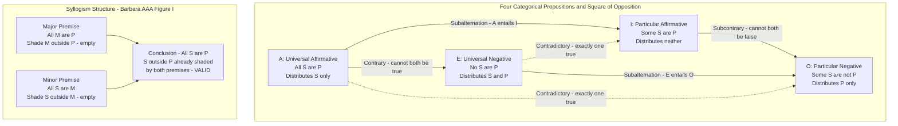

# Categorical Logic and Syllogisms

> [!abstract] TL;DR
> Categorical logic is Aristotle's formal system — the first in human history — for determining whether a conclusion about class membership necessarily follows from two premises about class membership; its core instrument is the categorical syllogism, built from four proposition forms (A, E, I, O) arranged across four figures and 256 moods, of which exactly 19 are unconditionally valid. Mastering it means understanding not just which arguments work, but *why* — through distribution of terms, the square of opposition, and the Venn diagram test — and recognizing its 2,400-year legacy in medieval scholasticism, Boolean algebra, and modern first-order predicate logic.

---

## Intuition

**Analogy:** Imagine a warehouse with rooms labelled by category — "Mammals," "Warm-Blooded," "Whales." Each room may fully contain another, partially overlap it, or be entirely separate. A categorical syllogism is a rule for discovering hidden containment relationships: if the Mammals room is entirely inside the Warm-Blooded room, and the Whales room is entirely inside the Mammals room, you can guarantee — without ever walking into the Warm-Blooded room — that Whales must be inside it too. You are not making an empirical observation; you are reading off a structural necessity from two containment facts.

This is the whole of Aristotle's syllogistic. The "rooms" are categories (classes); the containment facts are propositions; the derived containment is the conclusion. The question is never whether the premises are actually true — that is a question for biology. The question is whether the conclusion is *forced* by the structural relationship between the premises, whatever the facts turn out to be.

---

## How It Works

### Core Mechanics

**The Four Categorical Propositions**

Every categorical proposition asserts a relationship between two class terms (subject S and predicate P) through a copula. Medieval logicians named the four standard forms using the vowels from the Latin *AffIrmo* ("I affirm") and *nEgO* ("I deny"):

| Label | Standard Form | Name | Terms Distributed |
|-------|--------------|------|-------------------|
| **A** | All S are P | Universal Affirmative | S only |
| **E** | No S are P | Universal Negative | S and P |
| **I** | Some S are P | Particular Affirmative | Neither |
| **O** | Some S are not P | Particular Negative | P only |

**Distribution** is the key technical concept: a term is *distributed* in a proposition when the proposition makes a claim about *every member* of that class. "All S are P" quantifies over every S (so S is distributed) but says nothing about whether all P are S (P is not distributed). "No S are P" quantifies over every S and implicitly over every P — because ruling out every S from P simultaneously rules out every P from S — so both terms are distributed. Distribution determines whether a syllogism illicitly over-extends its conclusion beyond what the premises warrant.

---

**The Square of Opposition (Traditional Aristotelian)**

When two propositions share the same S and P, four logical relationships hold between the AEIO forms:

- **Contradictory** (A/O, E/I): cannot both be true *and* cannot both be false. Exactly one must hold.
- **Contrary** (A/E): cannot both be true simultaneously, but *can* both be false. ("All ravens are black" and "No ravens are black" cannot both hold, but both could be false if some ravens are black and some are not.)
- **Subcontrary** (I/O): cannot both be false, but *can* both be true.
- **Subalternation** (A→I, E→O): the universal proposition entails the particular of the same quality. "All S are P" entails "Some S are P."

Subalternation depends on **existential import** — the assumption that the subject class S is non-empty. Aristotle assumed this; George Boole did not. The Boolean reinterpretation (covered below) collapses subalternation and changes which syllogistic moods count as valid.

---

**Structure of the Categorical Syllogism**

Every standard categorical syllogism contains exactly three terms, each appearing in exactly two propositions:

- **Middle term (M)**: appears in both premises, eliminated in the conclusion
- **Major term (P)**: predicate of the conclusion; appears in the major premise
- **Minor term (S)**: subject of the conclusion; appears in the minor premise

The **figure** of a syllogism is determined by the position of M in the two premises:

| Figure | Major Premise | Minor Premise | Key Characteristic |
|--------|--------------|---------------|--------------------|
| **I** | M — P | S — M | M is subject in major, predicate in minor |
| **II** | P — M | S — M | M is predicate in both premises |
| **III** | M — P | M — S | M is subject in both premises |
| **IV** | P — M | M — S | M is predicate in major, subject in minor |

With 4 forms (AEIO) for each of 3 propositions, there are 4³ = 64 possible *moods* per figure, and 4 × 64 = **256 syllogistic forms** total. Of these, only **19 are unconditionally valid** (on the Boolean interpretation); 5 more hold conditionally on existential import.

---

**The Valid Moods — Named by Medieval Logicians**

Each name encodes the proposition forms: vowels = AEIO for major premise, minor premise, conclusion.

*Figure I (strongest — middle is subject in major):*
- **Barbara** (AAA): All M are P; All S are M; ∴ All S are P
- **Celarent** (EAE): No M are P; All S are M; ∴ No S are P
- **Darii** (AII): All M are P; Some S are M; ∴ Some S are P
- **Ferio** (EIO): No M are P; Some S are M; ∴ Some S are not P

*Figure II (middle is predicate in both):*
Cesare (EAE), Camestres (AEE), Festino (EIO), Baroco (AOO)

*Figure III (middle is subject in both):*
Darapti (AAI)†, Datisi (AII), Disamis (IAI), Felapton (EAO)†, Bocardo (OAO), Ferison (EIO)

*Figure IV:*
Bramantip (AAI)†, Camenes (AEE), Dimaris (IAI), Fesapo (EAO)†, Fresison (EIO)

*† Conditionally valid only — require the subject class to be non-empty*

---

**Six Rules for Syllogistic Validity**

A syllogism is invalid if it violates *any* of these rules:

1. **Three terms only** — the same word must be used in the same sense throughout; equivocation creates a "four-term" fallacy.
2. **Middle term must be distributed at least once** — if M is never fully quantified in either premise, it cannot guarantee the link between S and P. This is the *undistributed middle* fallacy.
3. **No term may be distributed in the conclusion unless distributed in its premise** — *illicit major* (P over-extended) and *illicit minor* (S over-extended) are separate errors.
4. **No valid conclusion from two negative premises** — two negative premises leave the relationship between S and P entirely indeterminate.
5. **A negative premise forces a negative conclusion** — and vice versa: a negative conclusion requires at least one negative premise.
6. **No particular conclusion from two universal premises** (Boolean rule) — on the Boolean interpretation, universal propositions carry no existential commitment, so they cannot ground a claim that "some S exist."

---

**The Venn Diagram Method**

John Venn (1880) provided a diagrammatic decision procedure that makes syllogistic validity fully mechanical:

1. Draw three overlapping circles labelled S, P, M — creating 7 distinct regions.
2. For each **universal** premise (A or E): **shade** the regions the proposition declares *empty*.
   - A (All X are Y): shade X∩¬Y
   - E (No X are Y): shade X∩Y
3. For each **particular** premise (I or O): place an **∃ marker** in the region the proposition declares *non-empty*. If that region has been partially shaded, force the marker into the surviving sub-region.
4. **Test the conclusion** against the diagram: a universal conclusion is valid iff all its required regions are already shaded; a particular conclusion is valid iff an ∃ marker already appears in a required region.
5. If the conclusion diagram is not already displayed, the syllogism is **invalid** — regardless of how plausible it sounds.

---

### Flow / Architecture



---

## Key Concepts

### Secondary

**Proposition vs. Sentence** — Not every sentence is a categorical proposition. A categorical proposition must have a subject term, a copula ("are"/"are not"), and a predicate term, and must be classifiable as A, E, I, or O. Questions, commands, and conditionals are not categorical propositions.

**The Middle Term as Bridge** — The logical work of the syllogism is entirely done by the middle term M. M links S to P; if M is never fully accounted for (distributed) in either premise, it cannot certify that what is said about M-in-relation-to-P also applies to S-in-relation-to-P. This is the intuition behind Rule 2.

**Validity vs. Soundness** — "All bachelors are unmarried; Socrates is a bachelor; therefore Socrates is unmarried" is valid (the conclusion follows necessarily) but may be unsound (if Socrates was actually married). Categorical logic evaluates validity — the structural guarantee — not the truth of premises.

**Enthymeme** — A syllogism with a suppressed premise. "Socrates must die — he's human." The missing major premise ("All humans die") is so widely shared it goes unstated. Aristotle discussed enthymemes in the *Rhetoric* as the rhetorical counterpart to the fully explicit syllogism of the *Analytics*.

**The 256 Forms** — 4 choices for major premise × 4 for minor × 4 for conclusion = 64 moods per figure × 4 figures = 256. Most fail immediately on Rule 4 (two negatives) or Rule 2 (undistributed middle). The exercise of working through why 237 of them fail is the classical training ground for logical precision.

---

### Undergraduate

**Distribution — Precise Characterization**

The traditional distribution table follows from the semantics of quantifiers:

| Proposition | Subject Distributed? | Predicate Distributed? | Reason |
|-------------|---------------------|----------------------|--------|
| A: All S are P | Yes | No | Refers to all S; says nothing about all P |
| E: No S are P | Yes | Yes | Excludes all S from P and all P from S |
| I: Some S are P | No | No | Refers to some S only; some P only |
| O: Some S are not P | No | Yes | Refers to some S; excludes them from all of P |

The O proposition distributes P because saying "some S are *not* P" means those S are excluded from the *entire* class P — every single member of P is being excluded from membership for those S. This is the distribution that catches the *illicit major* fallacy: you cannot conclude "No P are S" (which distributes P in the conclusion) from premises that never distributed P.

**Reducing Figures to Figure I**

Aristotle proved in *Prior Analytics* that every valid mood in Figures II–IV can be *reduced* to Figure I through one of three operations:
- **Conversion**: "No S are P" converts to "No P are S" (valid for E); "Some S are P" converts to "Some P are S" (valid for I); "All S are P" converts only *per accidens* to "Some P are S."
- **Obversion**: "All S are P" obverts to "No S are non-P"; "No S are P" obverts to "All S are non-P."
- **Contraposition**: "All S are P" contraposes to "All non-P are non-S."

This reduction shows that Barbara, Celarent, Darii, and Ferio are in a precise sense the *fundamental* valid forms; all others are derived.

**Proving Barbara is Valid — Dictum de Omni et Nullo**

The foundational principle: *what is predicated universally of a subject is predicated of everything falling under that subject*. Formally: if all M are P, and x is M, then x is P. Barbara is simply the general form of this principle applied to a class S rather than an individual. Every other Figure I mood is a variation on this kernel.

**The Boolean Reinterpretation and Existential Import**

George Boole's *Laws of Thought* (1854) reinterpreted universal propositions as lacking existential import: "All unicorns are white" is vacuously true if no unicorns exist, because there are no counterexamples. Under this interpretation:
- "All S are P" means: there is nothing that is S and not P (i.e., S∩¬P = ∅)
- "No S are P" means: there is nothing that is S and P (i.e., S∩P = ∅)
- "Some S are P" means: there exists at least one thing that is S and P (non-empty)
- "Some S are not P" means: there exists at least one thing that is S and not P (non-empty)

Under this reading, **subalternation fails**: "All S are P" no longer entails "Some S are P" because the universal could be vacuously true while the existential is false (if S is empty). The five moods marked with † above (Darapti, Felapton, Bramantip, Fesapo, and the subaltern moods) are invalid on the Boolean interpretation precisely because they draw particular conclusions from universal premises, implicitly assuming the subject class is non-empty.

This is not merely a technical quibble: it matters for any domain where the subject class might be empty — "all software bugs satisfying condition X are critical" should not automatically imply "some software bugs satisfy condition X."

**First-Order Logic Translation**

Modern predicate logic makes the categorical forms fully precise:

| Form | First-Order Translation |
|------|------------------------|
| A: All S are P | ∀x (S(x) → P(x)) |
| E: No S are P | ∀x (S(x) → ¬P(x)) |
| I: Some S are P | ∃x (S(x) ∧ P(x)) |
| O: Some S are not P | ∃x (S(x) ∧ ¬P(x)) |

Barbara (AAA-1) becomes: ∀x(M(x)→P(x)) ∧ ∀x(S(x)→M(x)) ⊢ ∀x(S(x)→P(x)), which is trivially provable by hypothetical syllogism in predicate logic. The categorical syllogism is a *fragment* of first-order logic; predicate logic is vastly more expressive.

---

### Graduate

**Aristotle's Prior Analytics — The First Formal Logic**

Aristotle's *Prior Analytics* (c. 350 BCE) is the founding document of formal logic. Its key innovation is abstraction: Aristotle replaced content-bearing terms with schematic letters (A, B, C) to show that validity is a property of *form*, not content. This was genuinely revolutionary — no preceding tradition had isolated logical form from logical content. The *Organon* (Aristotle's collected logical works) contains six treatises; the *Prior Analytics* is where syllogistic theory lives; the *Posterior Analytics* covers demonstrative science (how syllogisms are used to derive scientific knowledge from first principles).

Aristotle proved completeness of his system: he believed every valid deductive argument of the categorical type could be expressed as a chain of syllogisms. This claim was essentially correct for the fragment he studied, though predicate logic with relations (e.g., "Everyone loves someone") lies outside his system.

**Medieval Scholastic Developments**

The *memoria technica* (Barbara, Celarent, ...) was systematized by Peter of Spain (*Summulae Logicales*, c. 1230). William of Ockham (*Summa Logicae*, c. 1323) gave the first comprehensive treatment of the theory of *suppositio* — roughly, reference — addressing how terms in categorical propositions pick out objects. John Buridan extended syllogistic to cover modal operators (necessary, possible) and temporal contexts.

Medieval universities taught the *trivium* (grammar, rhetoric, logic) as the foundation of all learning; syllogistic logic was the backbone of scholastic *disputatio* — formal structured debates in which every theological and philosophical claim had to withstand syllogistic challenge. The scholastic tradition preserved and extended Aristotle's logic for roughly 1,500 years, until Leibniz and then Boole and Frege fundamentally transformed it.

**Leibniz's Vision and the Gap to Modern Logic**

Leibniz dreamed of a *characteristica universalis* — a universal formal language in which all reasoning could be reduced to calculation. His *calculus ratiocinator* was an early attempt to algebraize Aristotle's system. He proved several syllogistic laws algebraically but could not extend the system to relational reasoning. The limitation is structural: categorical syllogistic can only handle one-place predicates (properties of individuals), not two-place or higher relations. "Everyone who teaches someone is wiser than that person" is inexpressible in pure categorical logic.

Frege's *Begriffsschrift* (1879) resolved this by introducing quantifiers and variables, making relational reasoning fully formalizable. From a modern perspective, Aristotelian logic is the universally and existentially quantified fragment of monadic predicate logic — a well-behaved but severely limited system.

**The Boolean Algebra of Classes**

Boole showed that Aristotle's propositions can be expressed as equations in a two-valued algebra where class terms are variables taking values 0 (empty) or 1 (non-empty) and operations are class intersection (multiplication), union (addition), and complement (1-x). The universal affirmative "All S are P" becomes S(1-P) = 0 (the class of things that are S and not-P is empty). Barbara then becomes: if M(1-P)=0 and S(1-M)=0, then S(1-P)=0. Boole proved this algebraically, showing that syllogistic validity is a species of algebraic identity. This was the first step toward Boolean logic and, ultimately, digital circuit design.

---

## Python Demo

The following implements a Venn diagram visualizer for categorical syllogisms. Given two premises and a conclusion in A/E/I/O form, it shades the appropriate regions of a 3-circle Venn diagram using matplotlib and numpy. The `check_valid` function implements the Venn diagram decision procedure; the demo tests four classical valid moods (Barbara, Celarent, Darii, Ferio) and two classic invalid forms (undistributed middle, illicit major).

```python
import numpy as np
import matplotlib.pyplot as plt

# ─── Region algebra ────────────────────────────────────────────────────────────
# Each of the 7 non-empty Venn regions is described by membership in S, P, M.
# Tuple layout: (in_S, in_P, in_M)
REGIONS = {
    'S':   (1, 0, 0),
    'P':   (0, 1, 0),
    'M':   (0, 0, 1),
    'SP':  (1, 1, 0),
    'SM':  (1, 0, 1),
    'PM':  (0, 1, 1),
    'SPM': (1, 1, 1),
}
TERM_IDX = {'S': 0, 'P': 1, 'M': 2}


def empty_regions(form, t1, t2):
    """Regions that proposition (form, t1, t2) asserts are empty."""
    i1, i2 = TERM_IDX[t1], TERM_IDX[t2]
    return [r for r, mem in REGIONS.items()
            if (form == 'A' and mem[i1] == 1 and mem[i2] == 0) or
               (form == 'E' and mem[i1] == 1 and mem[i2] == 1)]


def nonempty_regions(form, t1, t2):
    """Regions that proposition (form, t1, t2) asserts are non-empty."""
    i1, i2 = TERM_IDX[t1], TERM_IDX[t2]
    return [r for r, mem in REGIONS.items()
            if (form == 'I' and mem[i1] == 1 and mem[i2] == 1) or
               (form == 'O' and mem[i1] == 1 and mem[i2] == 0)]


def prop_str(form, t1, t2):
    return {'A': f'All {t1} are {t2}',
            'E': f'No {t1} are {t2}',
            'I': f'Some {t1} are {t2}',
            'O': f'Some {t1} are not {t2}'}[form]


def check_valid(premises, conclusion):
    """
    Test conclusion validity via the Venn diagram method.
    1. Shade all regions declared empty by the premises.
    2. For I/O premises: if all but one candidate region is shaded, force
       the survivor non-empty.
    3. Test whether the conclusion's required shading/marking is already present.
    """
    shaded = set()
    for p in premises:
        shaded.update(empty_regions(*p))

    forced = set()
    for p in premises:
        if p[0] in ('I', 'O'):
            live = [r for r in nonempty_regions(*p) if r not in shaded]
            if len(live) == 1:
                forced.add(live[0])

    c_form, c_t1, c_t2 = conclusion
    if c_form in ('A', 'E'):
        needed = empty_regions(c_form, c_t1, c_t2)
        return bool(needed) and all(r in shaded for r in needed)
    cands = nonempty_regions(c_form, c_t1, c_t2)
    live  = [r for r in cands if r not in shaded]
    return any(r in forced for r in live)


# ─── Venn geometry (computed once at module level) ─────────────────────────────
NX = 220
XV = np.linspace(-2.0, 2.0, NX)
YV = np.linspace(-2.0, 2.0, NX)
XX, YY = np.meshgrid(XV, YV)

# Circle centres and radius (normalised coordinate space)
CX = {'S': -0.55, 'P':  0.55, 'M':  0.00}
CY = {'S':  0.25, 'P':  0.25, 'M': -0.45}
RAD = 0.82

IN_C = {c: (XX - CX[c])**2 + (YY - CY[c])**2 <= RAD**2
        for c in ('S', 'P', 'M')}

# Build pixel masks for each of the 7 regions
REG_MASKS = {}
for _rname, (_ms, _mp, _mm) in REGIONS.items():
    _m = (IN_C['S'] if _ms else ~IN_C['S'])
    _m = _m & (IN_C['P'] if _mp else ~IN_C['P'])
    _m = _m & (IN_C['M'] if _mm else ~IN_C['M'])
    REG_MASKS[_rname] = _m

IN_ANY = np.zeros((NX, NX), dtype=bool)
for _m in REG_MASKS.values():
    IN_ANY |= _m


def centroid(rname):
    rows, cols = np.where(REG_MASKS[rname])
    if len(rows) == 0:
        return 0.0, 0.0
    return float(XV[cols].mean()), float(YV[rows].mean())


# ─── Draw one Venn panel ───────────────────────────────────────────────────────
CIRC_COLORS = {'S': '#1d4ed8', 'P': '#b91c1c', 'M': '#065f46'}
SHADE_RGBA  = np.array([0.28, 0.33, 0.62, 0.75])   # blue-grey for empty regions
BASE_RGBA   = np.array([0.88, 0.92, 1.00, 0.35])    # light blue for circle interiors


def draw_venn(ax, premises, conclusion, name):
    """Render a single syllogism panel."""
    shaded = set()
    for p in premises:
        shaded.update(empty_regions(*p))

    forced = set()
    for p in premises:
        if p[0] in ('I', 'O'):
            live = [r for r in nonempty_regions(*p) if r not in shaded]
            if len(live) == 1:
                forced.add(live[0])

    valid   = check_valid(premises, conclusion)
    v_color = '#065f46' if valid else '#9b1c1c'
    verdict = 'VALID' if valid else 'INVALID'

    # Build RGBA image: transparent outside, light blue inside, dark blue for shaded
    img = np.zeros((NX, NX, 4), dtype=float)
    img[IN_ANY] = BASE_RGBA
    for r in shaded:
        img[REG_MASKS[r]] = SHADE_RGBA

    ax.imshow(img, extent=[-2, 2, -2, 2], origin='lower', zorder=1)

    # Circle outlines
    for c in ('S', 'P', 'M'):
        ax.add_patch(plt.Circle(
            (CX[c], CY[c]), RAD,
            fill=False, edgecolor=CIRC_COLORS[c], linewidth=2.2, zorder=3
        ))

    # Term labels
    ax.text(-1.25,  1.08, 'S', fontsize=13, fontweight='bold',
            color=CIRC_COLORS['S'], zorder=5)
    ax.text( 1.05,  1.08, 'P', fontsize=13, fontweight='bold',
            color=CIRC_COLORS['P'], zorder=5)
    ax.text(-0.15, -1.32, 'M', fontsize=13, fontweight='bold',
            color=CIRC_COLORS['M'], zorder=5)

    # Existential markers for forced non-empty regions
    for r in forced:
        cx, cy = centroid(r)
        ax.text(cx, cy, '∃', ha='center', va='center',
                fontsize=15, fontweight='bold', color='#7c3aed', zorder=6)

    # Panel title with verdict
    p1s = prop_str(*premises[0])
    p2s = prop_str(*premises[1])
    cs  = prop_str(*conclusion)
    ax.set_title(
        f"{name}  [{verdict}]\n"
        f"P1: {p1s}\n"
        f"P2: {p2s}\n"
        f"∴ {cs}",
        fontsize=8.5, color=v_color, pad=4, loc='left'
    )

    # Coloured border indicates validity
    for spine in ax.spines.values():
        spine.set_visible(True)
        spine.set_edgecolor(v_color)
        spine.set_linewidth(2.8)

    ax.set_facecolor('white')
    ax.set_xlim(-2, 2)
    ax.set_ylim(-2, 2)
    ax.set_aspect('equal')
    ax.tick_params(left=False, bottom=False, labelleft=False, labelbottom=False)


# ─── Syllogism showcase ────────────────────────────────────────────────────────
# Encoding: (display_name, major_premise, minor_premise, conclusion)
# Each premise/conclusion: (form, term1, term2)
DEMOS = [
    ("Barbara  AAA-1",
     ('A', 'M', 'P'), ('A', 'S', 'M'), ('A', 'S', 'P')),
    ("Celarent  EAE-1",
     ('E', 'M', 'P'), ('A', 'S', 'M'), ('E', 'S', 'P')),
    ("Darii  AII-1",
     ('A', 'M', 'P'), ('I', 'S', 'M'), ('I', 'S', 'P')),
    ("Ferio  EIO-1",
     ('E', 'M', 'P'), ('I', 'S', 'M'), ('O', 'S', 'P')),
    ("Undistributed Middle\nAAA-2  invalid",
     ('A', 'P', 'M'), ('A', 'S', 'M'), ('A', 'S', 'P')),
    ("Illicit Major\nAEE-1  invalid",
     ('A', 'M', 'P'), ('E', 'S', 'M'), ('E', 'S', 'P')),
]

fig, axes = plt.subplots(2, 3, figsize=(16, 12))
for idx, (name, p1, p2, conc) in enumerate(DEMOS):
    draw_venn(axes.flatten()[idx], [p1, p2], conc, name)

plt.suptitle(
    "Categorical Syllogism Venn Diagram Validator\n"
    "Shaded regions = declared empty by premises  |  ∃ = forced non-empty  "
    "|  Green border = valid  |  Red border = invalid",
    fontsize=11, fontweight='bold'
)
plt.tight_layout(rect=[0, 0, 1, 0.95])
plt.savefig('categorical_syllogism_venn.png', dpi=130, bbox_inches='tight')
plt.show()

# ─── Console report ────────────────────────────────────────────────────────────
print("Categorical Syllogism Validity Report")
print("=" * 56)
for name, p1, p2, conc in DEMOS:
    valid = check_valid([p1, p2], conc)
    print(f"\n{name.replace(chr(10), ' ')}")
    print(f"  P1: {prop_str(*p1)}")
    print(f"  P2: {prop_str(*p2)}")
    print(f"  C:  {prop_str(*conc)}")
    print(f"  => {'VALID' if valid else 'INVALID'}")
```

**What the output shows:**

- **Barbara**: shading "All M are P" (empties M∩¬P) and "All S are M" (empties S∩¬M) together shade *every* region where S is true and P is false. The conclusion "All S are P" requires exactly those regions to be empty — they already are. Green border.
- **Darii**: "All M are P" shades M∩¬P; "Some S are M" places an ∃ in S∩M. With S∩M∩¬P shaded by the first premise, the ∃ is forced into S∩M∩P. The conclusion "Some S are P" requires an ∃ in S∩P — it is already there.
- **Undistributed Middle (AAA-2)**: "All P are M" shades P∩¬M; "All S are M" shades S∩¬M. The region S∩¬P (required empty for "All S are P") includes S∩¬P∩M, which neither premise touches. Red border.
- **Illicit Major (AEE-1)**: "All M are P" shades M∩¬P; "No S are M" shades S∩M. The conclusion "No S are P" requires S∩P empty, but S∩P∩¬M is untouched by either premise. Red border.

---

## Real-World Applications

> **Medieval University Disputatio** — Every major theological and philosophical claim in 12th–16th century European universities was required to withstand syllogistic challenge in a formal *disputatio*. Thomas Aquinas's *Summa Theologica* (c. 1265–1274) is structured as a sequence of syllogistic arguments: each article states an objection (major premise), a counter-principle (minor premise or authority), and derives a conclusion. The syllogism was not merely a pedagogical exercise but the operating logic of an entire civilisation's intellectual culture. Philosophical errors were diagnosed as specific violations: a charge of "undistributed middle" against an opponent's argument was the scholastic equivalent of a fatal counterexample.

> **Legal Subsumption Arguments** — Legal reasoning routinely takes the form of Barbara: the major premise is a legal rule ("All acts of deception for financial gain are fraud"), the minor premise is a finding of fact ("Defendant's conduct was an act of deception for financial gain"), and the conclusion is the legal determination ("Defendant's conduct is fraud"). Appellate courts review whether the rule was correctly stated (major premise), whether the facts were correctly found (minor premise), and whether the subsumption follows (validity). The formal structure is syllogistic; the hard cases arise precisely at the point where ordinary syllogistic runs out — at contested definitions of terms, which require prior legal construction rather than logical inference.

> **Boolean Algebra and Digital Logic** — Boole's algebraization of categorical logic is the direct ancestor of logic gates. AND, OR, NOT gates implement the Boolean operations that Boole derived from Aristotle's class calculus. A NAND gate computing A NAND B = NOT(A AND B) is the hardware realization of the obversion and De Morgan principles that medieval logicians applied to categorical propositions. Every modern CPU executes billions of categorical inferences per second in silicon.

> **Prolog and Logic Programming** — The programming language Prolog (1972) executes Horn clauses — a subset of first-order logic that generalizes Barbara to arbitrary predicate arities. A Prolog database of facts and rules is a categorical knowledge base; a query triggers backward-chaining inference that is a direct descendant of Aristotle's syllogistic reduction procedure. IBM's Watson and many early expert systems were built on Prolog-style categorical inference engines.

> **Diagnostic Reasoning in Medicine** — Clinical guidelines are often formalized as categorical syllogisms: "All patients with fever over 38.5°C for more than 5 days without identified cause should receive bone marrow evaluation" (major), "This patient has fever over 38.5°C for more than 5 days without identified cause" (minor), therefore "This patient should receive bone marrow evaluation" (conclusion). Errors in clinical reasoning often trace to distributional fallacies: treating "All patients with this finding have this disease" as if it were convertible to "All patients with this disease have this finding" is the illicit conversion of an A proposition — a classic categorical error with real diagnostic consequences.

---

## Common Pitfalls

- **Equivocation on the middle term** — Using M in two different senses across the two premises creates a four-term syllogism that only *looks* like a three-term one. "Banks hold money; river banks hold water; therefore river banks hold money" has three different things called "bank." The formal structure is valid but the argument is not — the middle term shifts meaning between premises, violating Rule 1.

- **Confusing figure with mood** — Beginners often test a syllogism by checking only whether the mood (e.g., AAA) is in their list of valid moods without checking the figure. Barbara (AAA) is valid only in Figure I; AAA in Figure II or III is invalid. The figure determines the position of the middle term, which determines whether it is actually distributed.

- **Ignoring existential import** — Applying Aristotle's subalternation and the conditionally valid moods (Darapti, etc.) to domains where the subject class might be empty produces false conclusions. "All unicorns are white; therefore some unicorns are white" is only valid if unicorns exist. The Boolean reinterpretation is the right default for formal logic; the traditional interpretation requires explicit commitment to non-empty classes.

- **Mistaking formal validity for material correctness** — "All mammals are warm-blooded; all integers are mammals; therefore all integers are warm-blooded" is formally valid (Barbara) but materially absurd because the minor premise is false. Categorical logic certifies the *conditional*: *if* both premises are true, *then* the conclusion must be. Certifying the premises requires evidence, not logic.

- **Over-trusting vernacular "all"** — Natural language "all" is context-sensitive: "All the students passed" may mean only those who showed up, not the entire class. Categorical logic requires *universal* quantification over the full extension of the term. Careful translation from natural language into AEIO form is a precondition for valid syllogistic analysis.

- **The existential fallacy under the Boolean interpretation** — Drawing a particular conclusion (I or O) from two universal premises (A and E) is always invalid on the Boolean interpretation, even when the mood is otherwise valid under the traditional interpretation. Students who memorize Darapti (AAI-3: All M are P; All M are S; ∴ Some S are P) as valid are implicitly using the traditional interpretation; in Boolean logic, Darapti is invalid.

- **Circular reduction attempts** — When reducing Figure II or III moods to Figure I, the conversion steps must be applied in the correct order and to the correct premises. Applying conversion to the wrong proposition, or confusing simple conversion (valid for E and I) with *per accidens* conversion (only valid for A, changing to the weaker I form), produces a fallacious reduction that appears to validate an invalid mood.

---

## Related Concepts

- [[Logic_and_Critical_Thinking_Overview]] — The parent note covering the full spectrum of formal and informal logic; categorical syllogistic is the first formal deductive system treated there, and the historical spine (Aristotle → Boole → Frege) is the bridge from syllogistic to modern logic.
- [[Classical_Rhetoric_and_Aristotle]] — Aristotle's *Rhetoric* deploys the *enthymeme* as the rhetorical counterpart of the syllogism: a syllogism with a suppressed premise that recruits shared audience assumptions; the *Prior Analytics* and the *Rhetoric* are companion works on the two modes of reasoning, demonstrative and persuasive.
- [[Argumentation_Theory_and_Dialectic]] — Toulmin's model of argumentation (claim, data, warrant, backing) can be read as a generalization of the categorical syllogism to non-deductive contexts; the warrant plays the role of the major premise; Dung's abstract argumentation framework is the graph-theoretic extension of syllogistic attack relations.

---

## Review Questions

### Secondary

1. What is the difference between a *valid* syllogism and a *sound* one? Construct an example of a valid syllogism with a false conclusion, and explain why its validity is not undermined by the false conclusion.
2. Translate these two sentences into AEIO form and identify which of the four categorical proposition types each represents: "Every software engineer who deploys to production on Fridays is a risk-taker" and "At least one software engineer at this company is not a risk-taker."
3. Apply the Venn diagram test to the following argument and state whether it is valid: "No bureaucrats are creative; all managers are creative; therefore no managers are bureaucrats." Identify which syllogistic figure and mood this is, and which medieval name (if any) it bears.

### Undergraduate

1. The rule against the undistributed middle states that M must be distributed at least once across the two premises. Explain *why* an undistributed middle prevents the syllogism from yielding a valid conclusion — do not just state the rule, give the semantic reason in terms of what "distribution" means for the inference. Then construct an invalid syllogism that violates only this rule and no other.
2. Under the traditional (Aristotelian) interpretation, "All S are P" entails "Some S are P" via subalternation. Under the Boolean interpretation, this inference is invalid. Design a real-world domain where the Boolean interpretation is clearly the right one and the traditional interpretation would produce a false conclusion, then design a domain where the traditional interpretation is clearly the right one (i.e., where existential import is genuinely assumed). What does the contrast reveal about the relationship between formal logic and the ontological commitments of its application domain?
3. Translate the mood Baroco (AOO-2: All P are M; Some S are not M; ∴ Some S are not P) into first-order predicate logic and prove its validity using natural deduction. Then identify which distribution rules it satisfies and verify that it violates none of the six syllogistic validity rules.

### Graduate

1. Aristotle claimed his syllogistic was *complete* — every valid categorical deductive argument could be expressed as a syllogism or chain of syllogisms. Modern logic shows this claim fails for relational predicates. Construct the simplest possible argument involving a two-place relation that is (a) intuitively valid, (b) expressible in first-order predicate logic, and (c) not expressible as any finite chain of categorical syllogisms. Explain precisely where the categorical framework breaks down.
2. The Boolean reinterpretation (Boole 1854) renders five traditionally valid moods invalid by removing existential import from universal propositions. One response is to add an explicit existence axiom (∃x S(x)) as an additional premise wherever needed, recovering the traditional moods. Evaluate this response: does it make the traditional and Boolean systems equivalent, or do they differ in expressive power or inferential behavior in ways that the axiom cannot bridge? Relate your answer to the Aristotelian notion of *scientific demonstration* in the *Posterior Analytics*.
3. Duns Scotus and William of Ockham disputed the theory of *suppositio* — how terms in categorical propositions refer to their extensions. Ockham's nominalist position held that universal terms have no real referent beyond the individuals they collect; Scotus's realist position held that universals have a real but not fully individual mode of being. Does the choice between nominalism and realism affect which syllogistic inferences are valid? If so, construct an example where the two positions yield different verdicts. If not, explain why the formal structure of syllogistic is neutral between the two metaphysical positions.

---

## Sources

- [Aristotle. *Prior Analytics*. Trans. Robin Smith. Hackett Publishing, 1989.](https://hackettpublishing.com/prior-analytics)
- [Boole, G. *An Investigation of the Laws of Thought*. Macmillan, 1854. (Dover reprint available via Project Gutenberg)](https://www.gutenberg.org/ebooks/15114)
- [Copi, I.M., Cohen, C., and McMahon, K. *Introduction to Logic*, 14th ed. Pearson, 2014 — standard treatment of distribution, figures, and Venn method](https://www.pearson.com/en-us/subject-catalog/p/introduction-to-logic/P200000003235)
- [Hurley, P.J. *A Concise Introduction to Logic*, 13th ed. Cengage, 2018 — thorough coverage of syllogistic rules and Venn diagram testing](https://www.cengage.com/c/a-concise-introduction-to-logic-13e-hurley-watson/9781305958098/)
- [Łukasiewicz, J. *Aristotle's Syllogistic from the Standpoint of Modern Formal Logic*, 2nd ed. Oxford University Press, 1957 — the classic axiomatic reconstruction of Aristotle's system in modern terms](https://global.oup.com/academic/product/aristotles-syllogistic-from-the-standpoint-of-modern-formal-logic-9780198241041)

---

#logic #syllogisms #categorical-logic #aristotle #deductive-reasoning
