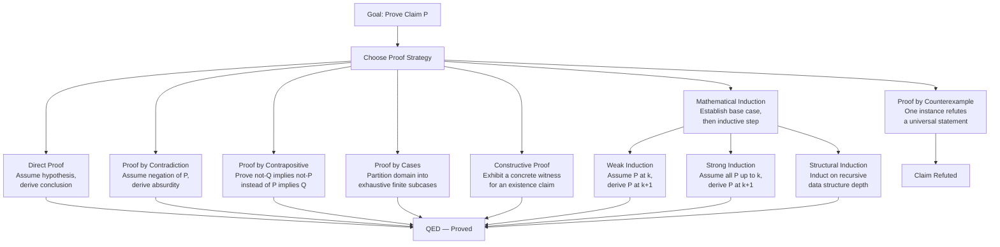

# Mathematical Proof Strategies

> [!abstract] TL;DR
> A mathematical proof is an airtight logical argument that a statement must be true — no empirical sampling, no "it looks right," just iron-clad deduction from axioms. Mathematicians have developed a toolkit of distinct strategies — direct proof, contradiction, contrapositive, induction, construction, and others — each suited to different claim shapes. Choosing the right strategy is as much a craft as a science, informed by Poincaré's observation that intuition suggests the route while rigour secures the destination.

---

## Intuition

**Analogy:** Think of a proof strategy as a route through a maze. The maze is the space of logical consequences; the exit is your target conclusion. A direct proof walks straight from the entrance to the exit. Proof by contradiction starts by assuming you are already outside the maze and then demonstrating that this is geometrically impossible. Proof by contrapositive walks the maze backwards. Mathematical induction builds a staircase one step at a time, trusting that if any step holds and each step implies the next, all steps are reachable.

No single route works for every maze. Experienced mathematicians develop an eye for which maze shape calls for which route — an instinct Hadamard and Poincaré described as "mathematical intuition" and Lakatos dissected in *Proofs and Refutations* as a back-and-forth between conjecture, proof, and counterexample.

---

## How It Works

### Core Mechanics

**1. Direct Proof** — Assume the hypothesis and derive the conclusion through a chain of valid inference steps. This is the cleanest route when the hypothesis provides enough structure. Classic example: proving that the sum of two even integers is even by writing them as 2m and 2n and observing 2m + 2n = 2(m + n).

**2. Proof by Contradiction (Reductio ad Absurdum)** — Assume the negation of the claim, then derive a statement that contradicts a known truth (or contradicts the assumption itself). The contradiction shows the negation is untenable, so the original claim must hold. This is the most powerful non-constructive technique; it proves irrationality of sqrt(2), the infinitude of primes, and the undecidability of the halting problem.

**3. Proof by Contrapositive** — Instead of proving P implies Q, prove not-Q implies not-P (the logically equivalent contrapositive). Useful when not-Q gives a richer hypothesis than P does. Example: to prove "if n-squared is odd then n is odd," it is easier to prove "if n is even then n-squared is even."

**4. Proof by Cases (Exhaustion)** — Partition the domain into finitely many exhaustive, mutually exclusive cases and prove the claim in each. Valid because at least one case must apply. The Four Colour Theorem's 1976 computer-assisted proof checked 1,936 cases — the first major proof to use exhaustive computer verification.

**5. Mathematical Induction — Weak Form** — For a predicate P(n) on natural numbers: (i) verify P(1) as the base case; (ii) show that P(k) implies P(k+1) as the inductive step. Then P(n) holds for all n. The key insight is that the natural numbers have no "first gap" — once the base fires and each step propagates, every rung of the staircase is reachable.

**6. Mathematical Induction — Strong Form** — The inductive hypothesis assumes P(j) for all j at most k, not just P(k). Necessary when proving P(k+1) requires reaching back further than one step. Example: proving every integer at least 2 has a prime factorisation (you may need to factor into smaller pieces that are already handled).

**7. Structural Induction** — Generalises mathematical induction to arbitrary well-founded recursive structures (trees, lists, expressions). Prove the claim for base structures; then prove that if it holds for all sub-structures, it holds for any structure built from them. This is how program correctness proofs work over recursive data types.

**8. Proof by Construction (Existence Proof)** — To prove there exists an object with property P, exhibit one. Constructive proofs are especially valued in computer science because they yield algorithms. Euclid's proof of the infinitude of primes is constructive: given any finite list, construct a new prime not in it.

**9. Proof by Counterexample** — Universal claims (for all x, P(x)) are disproved by exhibiting a single x for which P(x) is false. This is the fastest possible refutation. Lakatos showed that in mathematical practice, counterexamples do not merely refute — they force the community to sharpen definitions, often leading to richer theorems.

**10. Cantor's Diagonalisation** — A specific proof by contradiction for infinite sets: assume a supposed complete enumeration exists, then construct an object that differs from each enumerated item in at least one position, contradicting completeness. Cantor used this to prove the reals are uncountable; Turing used the same idea to prove the halting problem is undecidable; Gödel's incompleteness theorem is diagonalisation in formal syntax.

**11. Probabilistic Proofs** — Prove existence by showing a random object has the desired property with positive probability. If Pr(X has P) greater than 0 then at least one such X exists, even when you cannot construct it. Paul Erdos pioneered this in combinatorics; it yields non-constructive bounds impossible to achieve by construction.

**12. Computer-Assisted Proofs** — Use computation to check finitely many cases or verify formal proof certificates. Examples: the Four Colour Theorem (Appel-Haken 1976), Kepler's Sphere Packing Conjecture (Hales 1998, formally verified by Flyspeck 2014). Critics note these proofs provide no intuitive understanding; proponents note they are more reliable than human proof-checking of 300-page arguments.

### Informal vs. Formal Proofs

Mathematicians routinely write informal proofs — natural-language arguments that convey logical structure without filling every gap. The implicit contract is that a trained reader could, in principle, expand the argument into a fully formal derivation in a system like ZFC set theory. Proof assistants such as Lean and Coq force full formalisation; they find errors humans miss but at the cost of extreme verbosity.

### Lakatos and the Social Life of Proofs

Imre Lakatos's *Proofs and Refutations* (1976) showed through the history of Euler's polyhedron formula (V - E + F = 2) that mathematical truth is not established by a single proof and then set in stone. Each proof attempt provokes counterexamples; each counterexample forces refinement of concepts; refined concepts reveal a deeper, more general theorem. Proof is a social, iterative process, not a one-shot logical deduction.

### Flow / Architecture



---

## Key Concepts

### Secondary

- **Axiom** — A statement accepted without proof, forming the bedrock from which all theorems are derived.
- **Theorem** — A statement proved to be true from axioms and previously proved theorems.
- **Lemma** — A helper result proved on the way to a larger theorem.
- **Corollary** — A result that follows easily from a theorem just proved.
- **Conjecture** — A statement believed to be true but not yet proved (Goldbach's Conjecture, Riemann Hypothesis).
- **Hypothesis vs. conclusion** — In a conditional P implies Q, P is the hypothesis (what you are given) and Q is the conclusion (what you must derive).
- **Vacuous truth** — P implies Q is true whenever P is false, regardless of Q. This makes base-case checking necessary in induction.

### Undergraduate

- **Well-ordering principle** — Every non-empty set of natural numbers has a least element. This is equivalent to induction and underpins strong induction and minimal counterexample arguments.
- **Minimal counterexample technique** — A variant of contradiction: assume a smallest counterexample to P exists, then derive a contradiction — either showing no counterexample exists or constructing a smaller one.
- **Invariant method** — Identify a quantity that does not change under the allowed operations; if the initial and desired final states have different invariant values, the transformation is impossible.
- **Double counting** — Prove an identity by counting the same set in two different ways (a direct proof technique pervasive in combinatorics).
- **Existence vs. uniqueness** — Existence proofs show at least one object satisfies the property; uniqueness proofs show at most one does. Many theorems require proving both.

### Graduate

- **Well-founded induction** — The most general form: induction over any well-founded partial order, not just the naturals. Underpins termination proofs for recursive programs.
- **Transfinite induction** — Induction extended to ordinals: prove the claim for 0, prove it for successor ordinals, and prove it for limit ordinals. Used in set theory and logic to prove theorems about all ordinals.
- **Cantor's diagonalisation argument** — Constructs an object differing from each item in a supposed complete enumeration; proves uncountability of the reals, undecidability of the halting problem (via Turing 1936), and Gödel's incompleteness (via self-referential Gödel sentences).
- **Probabilistic method** — Shows existence without construction; the non-constructive power comes from the fact that Pr(P) greater than 0 suffices, even when Pr(P) is exponentially small. Core technique in combinatorics (Ramsey theory, random graphs).
- **Proof by reflection (proof assistants)** — In Coq and Lean, a computation inside the type theory can serve as a proof; a Boolean decision procedure whose output type-checks is an automatic proof.
- **Poincaré on intuition** — Henri Poincaré (1908) argued that mathematical intuition precedes formal proof; the unconscious mind performs combinatorial search, surfacing "likely fruitful" combinations to conscious attention. Rigour then checks whether the intuitive route is sound.

---

## Python Demo

```python
import numpy as np
import matplotlib.pyplot as plt

fig, axes = plt.subplots(1, 3, figsize=(15, 5))
fig.suptitle("Mathematical Proof Strategies — Three Visual Demonstrations", fontsize=13)

# ── (a) Direct Proof ─────────────────────────────────────────────────────────
# Claim: the sum of the first n odd numbers equals n^2
# Odd numbers: 1, 3, 5, ..., (2n-1)
# We verify empirically for n = 1 to 20; a direct algebraic proof closes the gap.

n_vals = np.arange(1, 21)
odd_sums = np.array([np.sum(2 * np.arange(1, n + 1) - 1) for n in n_vals])
n_squared = n_vals ** 2

ax = axes[0]
ax.plot(n_vals, odd_sums, "bo-", label="Sum of first n odd numbers", markersize=6)
ax.plot(n_vals, n_squared, "r--", linewidth=2, label="n squared")
ax.set_title("Direct Proof\nSum of first n odd numbers = n squared")
ax.set_xlabel("n")
ax.set_ylabel("Value")
ax.legend(fontsize=8)
ax.grid(True, alpha=0.3)
assert np.all(odd_sums == n_squared), "Verification failed — direct proof"

# ── (b) Proof by Contradiction ────────────────────────────────────────────────
# Claim: sqrt(2) is irrational.
# Proof sketch: assume sqrt(2) = p/q in lowest terms; derive that both p and q
# are even, contradicting the lowest-terms assumption.
# Visual: for every integer denominator q, the nearest-integer numerator p
# never achieves |p/q - sqrt(2)| = 0; the error is always strictly positive.

q_vals = np.arange(1, 201)
sqrt2 = np.sqrt(2)
p_best = np.round(q_vals * sqrt2).astype(int)
approx_errors = np.abs(p_best / q_vals - sqrt2)

ax = axes[1]
ax.semilogy(q_vals, approx_errors, "g.", markersize=3, alpha=0.6)
ax.axhline(y=0, color="r", linestyle="--", linewidth=1.5, label="Zero — never reached")
ax.set_title("Proof by Contradiction\nRational approx error for sqrt(2)")
ax.set_xlabel("Denominator q")
ax.set_ylabel("Absolute error |p/q - sqrt(2)|  [log scale]")
ax.legend(fontsize=8)
ax.grid(True, alpha=0.3)
assert np.all(approx_errors > 0), "Found exact rational — impossible"

# ── (c) Mathematical Induction ────────────────────────────────────────────────
# Claim: 1 + 2 + ... + n = n*(n+1)/2
# Inductive proof:
#   Base case n=1: 1 = 1*2/2 = 1. True.
#   Inductive step: assume true for k; add (k+1) to both sides.
#     k*(k+1)/2 + (k+1) = (k+1)*(k/2 + 1) = (k+1)*(k+2)/2. QED.
# Visual: actual running sum matches closed-form formula for all n = 1..50.

n_ind = np.arange(1, 51)
actual_sum = np.cumsum(n_ind)
formula = n_ind * (n_ind + 1) // 2

ax = axes[2]
ax.plot(n_ind, actual_sum, "b-", linewidth=2.5, label="Actual: 1+2+...+n")
ax.plot(n_ind, formula, "r--", linewidth=1.5, label="Formula: n*(n+1)/2")
ax.set_title("Mathematical Induction\nVerify triangular number formula")
ax.set_xlabel("n")
ax.set_ylabel("Value")
ax.legend(fontsize=8)
ax.grid(True, alpha=0.3)
assert np.all(actual_sum == formula), "Induction verification failed"

plt.tight_layout()
plt.savefig("proof_strategies.png", dpi=150, bbox_inches="tight")
plt.show()
print("All three proof demonstrations verified — assertions passed.")
```

---

## Real-World Applications

1. **Algorithm correctness — loop invariants and induction.** Proving that a sorting algorithm is correct requires identifying a loop invariant (a predicate that holds before and after every iteration) and applying structural or weak induction over the number of steps. Every Dijkstra correctness proof and every merge-sort correctness argument is a disguised induction.

2. **Cryptography — proof by contradiction for security reductions.** A cryptographic scheme is proven secure by contradiction: assume an adversary breaks the scheme; construct from that adversary a procedure that solves a problem assumed computationally hard (integer factorisation, discrete logarithm). If the hard problem is indeed hard, no such adversary can exist.

3. **Type systems and the Curry-Howard correspondence.** The correspondence between type theory and logic (types are propositions; programs are proofs; type-checking is proof verification) means that writing a well-typed program in a dependently typed language such as Agda or Coq is literally writing a constructive proof. Software verification at this level runs in production in CompCert (a verified C compiler) and seL4 (a verified microkernel).

4. **Cantor diagonalisation in computing — undecidability.** Turing's 1936 proof that no algorithm can decide whether an arbitrary program halts (the Halting Problem) is a direct application of diagonalisation. The same argument underlies Rice's theorem (no non-trivial semantic property of programs is decidable), which shapes the theoretical limits of static analysis tools.

5. **Combinatorics and the probabilistic method — network design.** Paul Erdos used probabilistic proofs to show the existence of graphs with high girth and high chromatic number — properties that seemed contradictory. These existence results guided the design of expander graphs, which underpin error-correcting codes, pseudorandom generators, and communication network topologies.

---

## Trade-offs

| Aspect | Pro | Con |
|--------|-----|-----|
| Constructiveness | Direct and construction proofs produce explicit witnesses and algorithms | Contradiction and contrapositive are non-constructive — they prove existence without exhibiting an example |
| Power and reach | Induction handles infinite families with finite effort; diagonalisation handles cardinality and computability | Proof by cases requires exhaustive enumeration — becomes infeasible with exponentially many subcases |
| Formal verifiability | Computer-assisted proofs are machine-checkable and scale to enormous case spaces | Verified proofs can be thousands of lines long and yield zero human understanding of why the result is true |

---

## When to Use vs Avoid

**Use when:**
- Direct proof: the hypothesis has rich algebraic or structural content that directly implies the conclusion through a short derivation chain.
- Contradiction: the claim involves irrationality, non-existence, infinitude, or unprovability — any situation where the negation produces a bounded, manipulable object.
- Induction: the claim is universally quantified over natural numbers, or the domain has a recursive structure (trees, strings, programs).
- Contrapositive: the negation of the conclusion is a stronger, more concrete hypothesis than the original premise.
- Probabilistic method: you need a non-constructive existence result and explicit construction is either unknown or exponentially hard.

**Avoid when:**
- Proof by cases with infinitely many or exponentially many cases — find a structural argument instead.
- Induction when the inductive step requires the full strength of every earlier case but strong induction has not been invoked — use strong induction explicitly.
- Computer-assisted proof for results where the mathematical community requires an explanatory proof, not just verification (e.g., the Riemann Hypothesis would require more than a finite computation).

---

## Common Pitfalls

- **Circular induction** — Assuming P(k+1) rather than P(k) in the inductive step, or implicitly using the conclusion while proving the inductive step. The error is subtle and appears in famous "proofs" that all horses are the same colour.
- **Missing or invalid base case** — A proof of the inductive step alone proves nothing. Even more dangerously, a wrong base case propagates silently through all downstream cases. Induction requires both parts to be valid.
- **Confusing contrapositive with converse** — The contrapositive of P implies Q is not-Q implies not-P (logically equivalent). The converse is Q implies P (a completely different claim that may be false). Using the converse in a proof is a formal fallacy.
- **Non-constructive existence mistaken for construction** — A probabilistic proof that a red-blue colouring with a certain property exists does not tell you which colouring to use. Engineering applications requiring a specific object need a constructive proof or a derandomisation procedure.
- **Diagonalisation applied to the wrong domain** — Cantor's argument requires an enumeration to be well-defined and the diagonal object to stay in the same universe. Misapplying this outside its preconditions yields paradoxes (Russell's paradox arises from an uncritical self-reference) rather than valid proofs.
- **Lakatos traps: monstrous counterexamples ignored** — Dismissing a counterexample by narrowing the definition of terms ("that is not a proper polyhedron") is a rhetorical move, not a proof. Lakatos documented how this historically delayed the correct statement of Euler's formula for decades.

---

## Related Concepts

- [[Logic_and_Critical_Thinking_Overview]] — the parent overview for the logical foundations from which all proof strategies derive; covers the deductive/inductive/abductive taxonomy and the distinction between validity and soundness.
- [[Logic_and_Proof_Techniques]] — the undergraduate discrete mathematics treatment of the same core proof methods; complementary coverage with propositional logic, quantifiers, and worked examples.
- [[Mathematical_Logic_and_Set_Theory]] — covers the formal foundations: ZFC axioms, Gödel's incompleteness theorems, and the Continuum Hypothesis; the advanced context for understanding the limits of the proof enterprise.
- [[Set_Theory_and_Relations]] — Cantor's diagonalisation, the uncountability of the reals, and well-orderings all live here; directly relevant to the diagonalisation and transfinite induction strategies.
- [[Real_Numbers_and_Completeness]] — the completeness of the reals (every bounded monotone sequence converges) is itself a celebrated existence proof; many analysis proofs use the least upper bound property as their core contradiction vehicle.
- [[Number_Theory_Elementary]] — the canonical training ground for direct proofs, contradiction, and induction: divisibility, primes, modular arithmetic, and Fermat's little theorem are all proved using the strategies catalogued here.
- [[Generating_Functions_and_Recurrences]] — recurrence relations are solved and verified using strong induction; generating functions provide an alternative algebraic proof route to the same identities.

---

## Review Questions

### Secondary

1. What is the difference between a direct proof and a proof by contradiction? For which type of claim is contradiction typically more natural than a direct approach?
2. To prove "if n is odd then n-squared is odd," which is easier — a direct proof or a proof by contrapositive? Write out both and compare their lengths.
3. Explain in plain language why a single counterexample is sufficient to disprove a universal claim, but no finite number of confirming examples is sufficient to prove one.

### Undergraduate

1. Prove by induction that for all n at least 1, the sum 1 + 3 + 5 + ... + (2n - 1) = n-squared. Identify the base case, the inductive hypothesis, and the inductive step explicitly. Where would a careless student introduce a circular step?
2. Prove by contradiction that there is no largest prime. Then provide a constructive proof of the same fact. Discuss: do the two proofs give equal confidence? Equal insight?
3. A proof by cases argument for the claim "for all integers n, n-squared + n is even" could split into "n is even" and "n is odd." Write each sub-case. Could you also write a one-line direct proof? What does this suggest about case analysis?

### Graduate

1. Cantor's diagonalisation proves that the set of all infinite binary sequences is uncountable. Turing's halting-problem proof follows the same logical skeleton. Write out both proofs side-by-side and identify exactly how each step in one corresponds to a step in the other.
2. Lakatos argues in *Proofs and Refutations* that the history of Euler's polyhedron formula is a sequence of conjectures, proofs, counterexamples, and redefinitions. Does this historical account support or undermine the view that mathematical truth is objective and proof-independent? Defend your position.
3. The probabilistic method proves existence of objects with certain combinatorial properties without constructing them. What is the significance of "derandomisation" — turning a probabilistic existence proof into a deterministic construction algorithm — for theoretical computer science and for our epistemological attitude toward non-constructive proofs?

---

## Sources

- [Velleman, Daniel J. *How to Prove It: A Structured Approach*, 3rd ed., Cambridge University Press, 2019](https://www.cambridge.org/us/universitypress/subjects/mathematics/logic-categories-and-sets/how-prove-it-structured-approach-3rd-edition)
- [Lakatos, Imre. *Proofs and Refutations: The Logic of Mathematical Discovery*, Cambridge University Press, 1976](https://www.cambridge.org/us/universitypress/subjects/mathematics/history-mathematics/proofs-and-refutations-logic-mathematical-discovery)
- [Aigner, Martin and Ziegler, Gunter M. *Proofs from THE BOOK*, 6th ed., Springer, 2018](https://link.springer.com/book/10.1007/978-3-662-57265-8)
- [Polya, George. *How to Solve It*, 2nd ed., Princeton University Press, 1957](https://press.princeton.edu/books/paperback/9780691164076/how-to-solve-it)
- [Gowers, Timothy (ed.). *The Princeton Companion to Mathematics*, Princeton University Press, 2008 — Part IV: Branches of Mathematics, section on mathematical logic and foundations](https://press.princeton.edu/books/hardcover/9780691118802/the-princeton-companion-to-mathematics)

---

#logic #mathematical-proof #induction #proof-by-contradiction #mathematics
