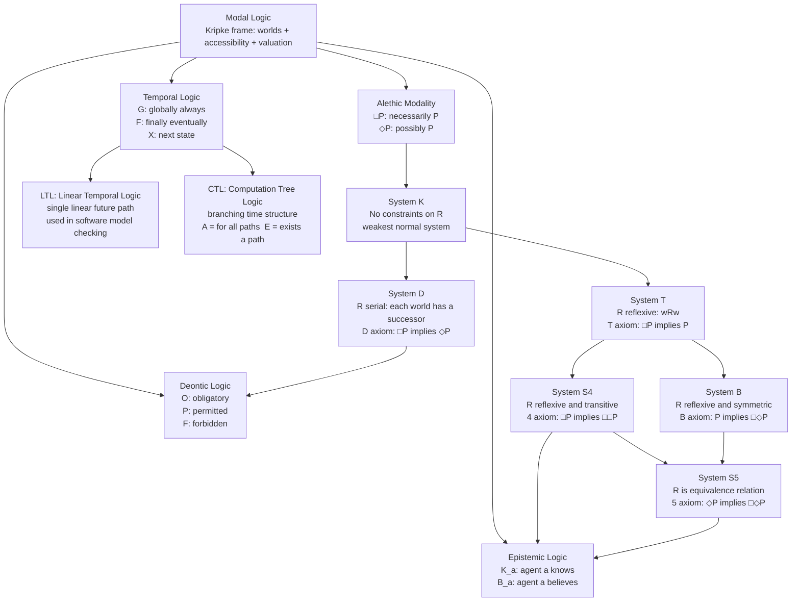

# Modal Logic

> [!abstract] TL;DR
> Modal logic extends classical propositional and predicate logic with operators for necessity (□, "must be true") and possibility (◇, "could be true"), evaluated not at a single world but across a structured space of possible worlds connected by an accessibility relation. Kripke's 1963 semantics gave the framework its mathematical foundation: different constraints on the accessibility relation yield the major modal systems (K, T, S4, S5), each validating a different set of axioms. The same machinery underpins deontic logic (obligation, permission), epistemic logic (knowledge, belief), temporal logic (always, eventually), formal software verification, and AI planning.

---

## Intuition

**Analogy:** Imagine a government regulation that says "Every vehicle *must* carry a spare tyre" and another that says "A vehicle *may* use biodiesel." The first expresses *necessity* — no permitted situation lacks a spare; the second expresses *possibility* — at least one permitted situation allows biodiesel. Now imagine the regulator writes these rules for multiple municipalities, each with slightly different bylaws. Whether "must carry a spare" is true in your city depends on which other cities' bylaws your city must respect — that relationship between cities is the *accessibility relation*.

Modal logic formalises exactly this structure. A *possible world* is any complete, consistent description of how things could be. The accessibility relation R defines which worlds can "see" which others. The box operator □P means P is true in *all* worlds accessible from here; the diamond operator ◇P means P is true in *some* accessible world. Change the shape of R and you change the logic: make every world access every other and you get the strongest system (S5, classical metaphysical necessity); restrict to worlds satisfying certain ordering properties and you get temporal or deontic variants.

---

## How It Works

### Core Mechanics

**Step 1 — The language.** Start with classical propositional variables p, q, r, … and connectives ¬, ∧, ∨, →. Add two unary operators:

- **□φ** (Box, "Necessarily φ") — φ holds in all accessible worlds
- **◇φ** (Diamond, "Possibly φ") — φ holds in at least one accessible world

The two operators are *dual*: □φ ↔ ¬◇¬φ (necessarily φ means it is not possible that ¬φ).

**Step 2 — Kripke frames.** A Kripke frame is a pair F = (W, R) where W is a non-empty set of *possible worlds* and R ⊆ W × W is a binary *accessibility relation*. A Kripke *model* adds a valuation V: W × Prop → {true, false} assigning truth values to atomic propositions at each world.

**Step 3 — Truth conditions.** A formula φ is *satisfied at world w in model M*, written M, w ⊨ φ:

| Formula | Satisfied iff |
|---------|---------------|
| p | V(w, p) = true |
| ¬φ | M, w ⊭ φ |
| φ ∧ ψ | M, w ⊨ φ and M, w ⊨ ψ |
| □φ | for every w' with wRw', M, w' ⊨ φ |
| ◇φ | there exists w' with wRw' and M, w' ⊨ φ |

A formula is *valid* in a frame if it is satisfied at every world in every model over that frame.

**Step 4 — The four alethic types.** At any world w, a proposition P falls into exactly one category:

| Type | Definition | Example |
|------|-----------|---------|
| Necessarily true | □P holds, ¬◇¬P holds | "2 + 2 = 4" |
| Necessarily false (impossible) | □¬P holds | "a bachelor is married" |
| Contingently true | P holds, but ◇¬P holds | "Paris is the capital of France" |
| Contingently false | ¬P holds, but ◇P holds | "Einstein was left-handed" |

**Step 5 — Modal systems via constraints on R.** Each constraint on R corresponds to an additional axiom:

| Constraint on R | Axiom | System |
|----------------|-------|--------|
| None | K: □(P→Q) → (□P→□Q) | K (weakest) |
| Reflexive: wRw | T: □P → P | T |
| Serial: every w has a successor | D: □P → ◇P | D |
| Reflexive + Transitive | 4: □P → □□P | S4 |
| Reflexive + Symmetric | B: P → □◇P | B |
| Equivalence relation | 5: ◇P → □◇P | S5 (strongest) |

The axiom letter names come from the axiomatic presentation: K is the *distribution axiom* (valid in all normal modal logics), T says "if something is necessary it is actual," 4 says "if something is necessary, its necessity is itself necessary," and 5 says "if something is possible, it is necessarily possible."

### Flow / Architecture



---

## Key Concepts

### Secondary Level

**What modal operators add.** Classical logic can express "it is raining" (true or false right now). But natural language regularly says "it *must* be raining" (necessary) or "it *might* be raining" (possible). These are not truth-functional: you cannot determine whether "necessarily P" is true just by looking at the current truth value of P. Modal logic adds the machinery to handle these *intensional* operators rigorously.

**Alethic modality — four grades of truth.** The term *alethic* comes from the Greek for truth. The four grades follow from the interaction of P and □:

- **Necessary truth:** □P — true in all logically or metaphysically accessible worlds. Mathematical theorems: "necessarily, every prime greater than 2 is odd."
- **Impossible:** □¬P — false in all accessible worlds. "Necessarily, no bachelor is married."
- **Contingent truth:** P ∧ ¬□P — actually true but could have been otherwise. "Paris is the capital of France" (France could have made Lyon the capital).
- **Contingent falsehood:** ¬P ∧ ◇P — actually false but could have been true. "Einstein won the 1921 Nobel in physics" is true; "Einstein won it in 1920" is false but possible in a nearby world.

**Possible worlds as a tool for meaning.** Each *possible world* is a maximally consistent way things could be — a complete specification of every fact. The *actual world* is the one we inhabit. The operator □P says P holds in every world that the current world can *see* (i.e., every world in its accessibility neighborhood). The accessibility relation models the kind of modality: metaphysical possibility, epistemic compatibility, deontic permissibility, or temporal succession.

**The modal operators are interdefinable.** Given one, you can define the other: ◇φ ≡ ¬□¬φ and □φ ≡ ¬◇¬φ. This mirrors how ∀ and ∃ are interdefinable in predicate logic: "it is necessary that P" means "it is not possible that not-P."

---

### Undergraduate Level

**System K: the base of all normal modal logics.** Every *normal* modal logic contains the classical propositional tautologies, the distribution axiom K (□(P→Q) → (□P→□Q)), and is closed under *necessitation* (if ⊢ φ then ⊢ □φ). The K axiom says: if you know an implication is necessary, and you know the premise is necessary, then the conclusion is necessary. Necessitation says: if a formula is provable, it must be necessary (provability yields necessity). System K alone is very weak — it does not validate even □P → P (the actual world might not be accessible to itself).

**Frame correspondence: the key insight.** Every additional axiom corresponds to a geometric property of R:

| Axiom | Formula | Frame property |
|-------|---------|---------------|
| T | □P → P | R is reflexive: every world accesses itself |
| 4 | □P → □□P | R is transitive: if wRv and vRu then wRu |
| B | P → □◇P | R is symmetric: if wRv then vRw |
| 5 | ◇P → □◇P | R is Euclidean: if wRv and wRu then vRu |
| D | □P → ◇P | R is serial: every world has at least one successor |

This *frame correspondence* (Van Benthem, 1976) reveals that modal logic is not just a formal language game — it is a calculus of relational structure. The logic S5 (K + T + 5) corresponds to frames where R is an equivalence relation (reflexive, symmetric, transitive), meaning all possible worlds are mutually accessible — the strongest alethic system, where there is no perspectival variation in what counts as necessary.

**Deontic logic: obligation and permission.** Replace the alethic interpretation with a normative one. Worlds become *deontically ideal* situations — how things *ought to be*. The operator O ("obligatory") is the box, P ("permitted") is the diamond: Oφ = □φ (φ is true in all ideal worlds), Pφ = ◇φ (φ is true in some ideal world). Forbidden means obligatorily not: Fφ = O¬φ.

The standard system KD uses the D axiom (□P → ◇P), ensuring every situation has at least one ideal successor — there is always some permissible action. KD validates "Ought implies Can" (Oφ → ◇φ): if you are obligated to do φ, it must be possible to do φ. The stronger system KD45 adds transitivity and Euclideanness, modeling stable normative structures where obligations are self-aware.

A famous challenge: the *Gentle Murder paradox* (Forrester 1984). If you must not kill, and you must kill gently if you kill at all, then "kill gently" should be obligatory given "you kill." Formalising this without contradiction requires careful deontic logic to handle *conditional obligations*.

**Epistemic logic: knowledge and belief (Hintikka 1962).** Replace worlds with *epistemic alternatives* — worlds an agent cannot rule out given their current information. "Agent a knows P" (written K_a P) means P is true in every world epistemically accessible to a. "Agent a believes P" (B_a P) uses a wider, non-factive accessibility.

Standard epistemic logic uses S5 for knowledge: the T axiom K_a P → P (you cannot know falsehoods — knowledge is factive), the 4 axiom K_a P → K_a K_a P (if you know, you know you know — positive introspection), and the 5 axiom ¬K_a P → K_a ¬K_a P (if you don't know, you know you don't know — negative introspection).

Belief (doxastic logic) drops the T axiom since beliefs can be false. The result is KD45: consistent (D ensures you never believe a contradiction), positively introspective (4), and negatively introspective (5).

*Common knowledge* K^C A P means every agent knows P, every agent knows every agent knows P, and so on infinitely — crucial for analysing coordination games, distributed systems, and the "muddy children" puzzle.

**Temporal logic: LTL and CTL.** Treat possible worlds as *states at times*, with the accessibility relation encoding temporal succession.

*Linear Temporal Logic* (LTL, Pnueli 1977) has one linear sequence of future states:

| Operator | Meaning | Example |
|----------|---------|---------|
| G φ | Globally: φ holds at all future states | G (request → F reply) |
| F φ | Finally: φ holds at some future state | F (system is idle) |
| X φ | Next: φ holds at the next state | X (count = count + 1) |
| φ U ψ | Until: φ holds until ψ does | (waiting U served) |

*Computation Tree Logic* (CTL, Clarke and Emerson 1981) adds branching: path quantifiers A ("for all paths") and E ("there exists a path") can prefix temporal operators: AGP (invariant — on all paths, always P), EFP (reachability — on some path, eventually P), AFG stable (leads-to — all paths eventually reach stability forever).

---

### Graduate Level

**Frame definability and Sahlqvist's theorem.** A formula φ *defines* a class of frames if it is valid in exactly the frames in that class. Not every modal formula defines a first-order class of frames — there are modally valid formulas whose frame conditions cannot be expressed in first-order logic. *Sahlqvist's theorem* (1975) identifies a large syntactic class of modal formulas that do have first-order frame correspondents and that are *canonical* — their canonicity guarantees completeness of the axiomatic system.

The Sahlqvist class includes all axioms in Table 1 above (T, 4, B, 5, D). The theorem provides an algorithm to compute the first-order correspondent from the modal formula, explaining *why* the lattice of modal systems corresponds so cleanly to geometric properties of binary relations.

**Bisimulation and expressive power.** Two models M and M' are *bisimilar* if there is a relation Z ⊆ W × W' such that (i) atomic agreement: if wZw' then for all p, V(w, p) = V(w', p); (ii) forth: if wZw' and wRv then there exists v' with w'Rv' and vZv'; (iii) back: symmetric. Modal logic cannot distinguish bisimilar models — it is precisely the *bisimulation-invariant fragment* of first-order logic (van Benthem's theorem). This characterizes the expressive power: modal logic sees exactly the structural features that survive bisimulation.

**Model checking complexity.** Formally verifying that a finite-state system M satisfies a temporal specification φ:
- LTL model checking: PSPACE-complete in |φ|, polynomial in |M|.
- CTL model checking: polynomial in both |M| and |φ| (linear time).
- CTL* (combining LTL and CTL): PSPACE-complete.
The gap between CTL and LTL is practically significant: CTL's tractability made it the workhorse of hardware verification (Intel, IBM), while LTL's expressivity (it can express fairness constraints CTL cannot) is essential for software verification. The tool SPIN uses LTL; SMV uses CTL.

**Dynamic Epistemic Logic (DEL).** Extends epistemic logic to model *information update* — how knowledge changes when agents communicate, learn, or observe. A *public announcement* !φ broadcasts φ to all agents simultaneously, contracting each agent's accessibility relation to worlds where φ holds. DEL can model the full "muddy children" puzzle, the coin-flipping protocol, and secure multi-party communication in a unified framework. DEL bridges epistemic logic with AGM belief revision theory (Alchourrón, Gärdenfors, Makinson 1985).

---

## Python Demo

```python
"""
Kripke Frame Evaluator — Modal Logic.

Defines a 4-world Kripke frame M = (W, R, V), evaluates five
modal formulas at every world, and visualises the accessibility
structure as a directed graph using matplotlib patches and
FancyArrowPatch — no networkx required.

Frame:
  W  = {w0, w1, w2, w3}
  R  = {w0→w1, w0→w2, w1→w3, w3→w3}   (w2 has no successors)
  V(P) = {w1, w3}

Key observations:
  - w2 has no accessible worlds: □-formulas are vacuously TRUE,
    ◇-formulas are vacuously FALSE
  - w0 is the "initial" world with the widest view
  - w3 is a reflexive fixpoint: it only accesses itself
"""

import numpy as np
import matplotlib.pyplot as plt
import matplotlib.patches as mpatches
from matplotlib.patches import FancyArrowPatch, Circle

# ---------------------------------------------------------------------------
# 1.  Kripke frame  M = (W, R, V)
# ---------------------------------------------------------------------------
WORLDS = ['w0', 'w1', 'w2', 'w3']

ACCESSIBILITY = {          # R: w -> set of accessible worlds
    'w0': {'w1', 'w2'},
    'w1': {'w3'},
    'w2': set(),           # isolated — no successors
    'w3': {'w3'},          # reflexive self-loop only
}

VALUATION_P = {'w1', 'w3'}     # worlds where proposition P holds

# World positions in the matplotlib figure (x, y)
POS = {
    'w0': np.array([1.5, 0.4]),
    'w1': np.array([0.4, 2.0]),
    'w2': np.array([2.6, 2.0]),
    'w3': np.array([1.5, 3.5]),
}

# ---------------------------------------------------------------------------
# 2.  Modal formula evaluators
# ---------------------------------------------------------------------------
def atom_P(w: str) -> bool:
    """Atomic proposition P."""
    return w in VALUATION_P


def box(phi, w: str) -> bool:
    """□phi — true iff phi holds at ALL worlds accessible from w."""
    succs = ACCESSIBILITY[w]
    if not succs:
        return True             # vacuously true (no successors)
    return all(phi(v) for v in succs)


def dia(phi, w: str) -> bool:
    """◇phi — true iff phi holds at SOME world accessible from w."""
    succs = ACCESSIBILITY[w]
    if not succs:
        return False            # vacuously false (no successors)
    return any(phi(v) for v in succs)


# Named formula functions
P         = atom_P
box_P     = lambda w: box(P, w)           # □P
dia_P     = lambda w: dia(P, w)           # ◇P
box_dia_P = lambda w: box(dia_P, w)       # □◇P
dia_box_P = lambda w: dia(box_P, w)       # ◇□P

FORMULAS = [
    ('P',     P),
    ('□P',    box_P),
    ('◇P',    dia_P),
    ('□◇P',   box_dia_P),
    ('◇□P',   dia_box_P),
]

# ---------------------------------------------------------------------------
# 3.  Console output
# ---------------------------------------------------------------------------
print('=== Kripke Frame M = (W, R, V) ===')
for w in WORLDS:
    succs = sorted(ACCESSIBILITY[w])
    print(f'  R({w}) = {{ {", ".join(succs) if succs else "empty"} }}')
print(f'  V(P)  = {{ {", ".join(sorted(VALUATION_P))} }}\n')

header = f"{'Formula':<10}" + ''.join(f'  {w}' for w in WORLDS)
print(header)
print('-' * len(header))
for name, fn in FORMULAS:
    row = ''.join(f'   {"T" if fn(w) else "F"}' for w in WORLDS)
    print(f'{name:<10}{row}')

print("""
Key results:
  w2 has no successors → □P and □◇P are vacuously TRUE there;
                         ◇P and ◇□P are vacuously FALSE there.
  w0 cannot necessitate P (w2 is accessible and P is false at w2)
     but it can necessitate □P (both w1 and w2 satisfy □P).
""")

# ---------------------------------------------------------------------------
# 4.  Visualisation
# ---------------------------------------------------------------------------
RADIUS    = 0.27
ARROW_C   = '#475569'
TRUE_C    = '#3b82f6'   # blue  — P is true
FALSE_C   = '#94a3b8'   # slate — P is false

fig, (ax_g, ax_t) = plt.subplots(
    1, 2, figsize=(14, 6.5),
    gridspec_kw={'width_ratios': [1.2, 1]},
)

# ---- Left panel: Kripke accessibility graph ----
ax_g.set_xlim(-0.2, 3.2)
ax_g.set_ylim(-0.2, 4.2)
ax_g.set_aspect('equal')
ax_g.axis('off')
ax_g.set_title('Kripke Frame  M = (W, R, V)\nBlue = P is true at that world',
               fontsize=11, pad=10)

# Draw accessibility arrows (beneath nodes)
for w_src in WORLDS:
    for w_dst in ACCESSIBILITY[w_src]:
        if w_src == w_dst:
            # Self-loop: draw a small arc circle offset from the node
            cx, cy = POS[w_src]
            loop_cx = cx + RADIUS * 1.1
            loop_cy = cy + RADIUS * 1.7
            loop_r  = RADIUS * 0.72
            theta = np.linspace(np.pi * 0.25, np.pi * 2.25, 150)
            xs = loop_cx + loop_r * np.cos(theta)
            ys = loop_cy + loop_r * np.sin(theta)
            ax_g.plot(xs, ys, color=ARROW_C, lw=1.6, zorder=2)
            # Arrow-head at the end of the arc
            ax_g.annotate(
                '',
                xy=(xs[-1], ys[-1]),
                xytext=(xs[-4], ys[-4]),
                arrowprops=dict(arrowstyle='->', color=ARROW_C, lw=1.5),
                zorder=2,
            )
        else:
            src_xy = POS[w_src]
            dst_xy = POS[w_dst]
            direction = dst_xy - src_xy
            length = np.linalg.norm(direction)
            unit = direction / length
            start = src_xy + unit * (RADIUS + 0.03)
            end   = dst_xy - unit * (RADIUS + 0.03)
            arr = FancyArrowPatch(
                posA=tuple(start), posB=tuple(end),
                arrowstyle='->', mutation_scale=15,
                color=ARROW_C, linewidth=1.6, zorder=2,
            )
            ax_g.add_patch(arr)

# Draw world nodes (on top of arrows)
for w in WORLDS:
    cx, cy = POS[w]
    color  = TRUE_C if w in VALUATION_P else FALSE_C
    ax_g.add_patch(Circle((cx, cy), RADIUS, color=color, zorder=5))
    ax_g.text(cx, cy, w,
              ha='center', va='center',
              fontsize=10, fontweight='bold', color='white', zorder=6)

legend_patches = [
    mpatches.Patch(color=TRUE_C,  label='P is true'),
    mpatches.Patch(color=FALSE_C, label='P is false'),
]
ax_g.legend(handles=legend_patches, loc='lower left', fontsize=9, framealpha=0.9)

# ---- Right panel: formula evaluation table ----
ax_t.axis('off')
ax_t.set_title('Modal Formula Evaluation\nat Each Possible World', fontsize=11, pad=10)

col_labels = ['Formula'] + WORLDS
table_rows = [
    [name] + ['T' if fn(w) else 'F' for w in WORLDS]
    for name, fn in FORMULAS
]

tbl = ax_t.table(
    cellText=table_rows,
    colLabels=col_labels,
    cellLoc='center',
    loc='center',
)
tbl.auto_set_font_size(False)
tbl.set_fontsize(12)
tbl.scale(1.3, 2.2)

for (row_idx, col_idx), cell in tbl.get_celld().items():
    if row_idx == 0:
        cell.set_facecolor('#1e3a5f')
        cell.set_text_props(color='white', fontweight='bold')
    elif col_idx == 0:
        cell.set_facecolor('#334155')
        cell.set_text_props(color='white', fontweight='bold')
    else:
        val = table_rows[row_idx - 1][col_idx]
        cell.set_facecolor('#bbf7d0' if val == 'T' else '#fecaca')

plt.tight_layout()
plt.savefig('modal_logic_kripke.png', dpi=120, bbox_inches='tight')
plt.show()
```

**Expected terminal output:**

```
=== Kripke Frame M = (W, R, V) ===
  R(w0) = { w1, w2 }
  R(w1) = { w3 }
  R(w2) = { empty }
  R(w3) = { w3 }
  V(P)  = { w1, w3 }

Formula     w0   w1   w2   w3
------------------------------
P            F    T    F    T
□P           F    T    T    T
◇P           T    T    F    T
□◇P          F    T    T    T
◇□P          T    T    F    T
```

Note that w2 (no successors) flips all results: box-formulas become vacuously TRUE, diamond-formulas vacuously FALSE. At w0, □P fails (w2 is accessible and P is false there), but ◇□P succeeds (w1 is accessible and □P holds there).

---

## Real-World Applications

> **Formal hardware verification — Intel's Pentium and Itanium.** After the 1994 Pentium FDIV bug (a floating-point error costing Intel $475 million), Intel adopted model checking as standard practice. Engineers write the processor's transition system as a Kripke structure and specify correctness properties in CTL: "AG (instruction issued → AF instruction completed)" (every issued instruction is eventually completed on all paths). The SMV model checker explores all reachable states and produces a counterexample trace if the property fails. This CTL-based workflow caught bugs in the Pentium Pro and Itanium designs before tape-out.

> **Software model checking — Java PathFinder and SPIN.** NASA's JPL uses Java PathFinder (JPF) to verify flight software against LTL specifications. A property like G ¬(thread_A_locked ∧ thread_B_locked) (mutual exclusion — no deadlock) is checked by exhaustive state-space search. Bell Labs' SPIN tool verified the data-link protocol in the actual spacecraft software for Mars Pathfinder. The 1997 Mars Pathfinder mission had a priority-inversion bug that caused resets; LTL model checking on the task scheduler could have found it pre-launch.

> **AI planning — STRIPS and PDDL.** Classical AI planning (Fikes and Nilsson 1971, SRI International) represents the world as a set of propositions and actions as pre/post-condition pairs. The question "is there a plan that achieves goal G?" is a *reachability* problem: does a path exist in the state-transition system from the initial state to a state satisfying G? This is ◇G in temporal logic. Modern PDDL (Planning Domain Definition Language) extends this with numeric fluents, durative actions, and preferences — effectively writing planning problems as CTL-style specifications over a state graph that the planner's search algorithm explores.

> **Epistemic logic in distributed systems — Lamport's happens-before.** In distributed computing, Lamport's happens-before relation (→) defines a partial order on events. The logical framework is epistemic: a process *knows* an event e occurred if e is in every world consistent with the process's observations. The knowledge-based protocol framework (Fagin, Halpern, Moses, Vardi 1995) derives correct distributed protocols from epistemic specifications. "Process p sends an acknowledgement only if it knows the message arrived" is formalized as K_p (received) → send_ack, and the protocol is derived by reasoning about what each agent knows at each communication step.

> **Natural language semantics — intensional contexts.** In linguistic semantics (Montague 1973), modal operators handle *intensional* contexts where substituting co-referential expressions fails. "Lois Lane believes Superman can fly" does not imply "Lois Lane believes Clark Kent can fly," because the embedded clause is evaluated at doxastically accessible worlds — worlds compatible with Lois's beliefs — where Superman and Clark Kent are distinct. The Kripke framework defines the semantics of attitude verbs (believes, knows, hopes, fears) and modal auxiliaries (must, might, could, should) in terms of accessibility, making NLP parsers and semantic interpreters more precise.

---

## Common Pitfalls

- **Confusing □P → P with □P → □□P.** The T axiom (reflexivity) says "if P is necessary, P is actually true." The 4 axiom (transitivity) says "if P is necessary, its necessity is itself necessary." These are different claims requiring different frame properties. In S4, both hold; in T alone, only the first holds. The error appears when students assume T and 4 come packaged together, then apply S4 reasoning in a T-only context.

- **Vacuous truth and falsity of box/diamond at worlds with no successors.** At a world with an empty accessibility set, □P is true for *every* formula P (vacuously) and ◇P is false for every formula P (vacuously). This sounds paradoxical: "necessarily P and necessarily ¬P both hold at w." It is not a contradiction — it just means the box quantifier ranges over the empty set. Students building model checkers often forget this edge case and introduce bugs when a state has no outgoing transitions.

- **Frame validity vs. model validity.** A formula is *valid in a frame* if it is true at every world in every model over that frame. It is *valid in a model* if it is true at every world of that particular model. The two differ: P → □P ("if P is true, it is necessarily true") is true in many specific models but is not frame-valid in K, T, S4, or S5. Students mistake a formula being true in one model for it being a logical truth of the system.

- **Deontic paradoxes from applying alethic intuitions.** The Ross Paradox: if you *ought to* post a letter (Op), then by the rule Op → O(p∨q) (alethic closure under logical implication), you ought to post the letter *or* burn it. This seems absurd. Standard deontic logic (SDL) does validate this because obligation distributes over disjunction. The paradox reveals that naive import of modal axioms into deontic contexts produces counterintuitive results; deontic logic requires additional constraints (e.g., limiting closure to non-paradoxical implications) that go beyond the K and D axioms.

- **The S5 assumption in epistemic logic.** Philosophers and logicians often default to S5 for knowledge, but S5's negative introspection axiom (¬K_a P → K_a ¬K_a P) is cognitively unrealistic: agents do not always know what they do not know. For AI and distributed systems, weaker systems (S4 for positive introspection only, or even KD45) are more appropriate. Using S5 when the modeled agents have bounded resources or partial information leads to theoretically clean but empirically wrong conclusions.

- **Confusing LTL and CTL expressivity.** LTL and CTL are *incomparable* in expressive power. CTL can express "there exists a path on which P eventually holds" (EFP) — LTL cannot make this existential statement. LTL can express "P holds infinitely often" (GFP) — CTL cannot express this without CTL* (which combines both). Engineers sometimes assume whichever tool they know is more expressive, leading to specs that cannot be verified with the chosen formalism.

---

## Related Concepts

- [[Logic_and_Critical_Thinking_Overview]] — modal logic sits within formal logic as the branch extending classical propositional logic with intensional operators; that overview positions modal logic within the landscape of deductive, inductive, and abductive reasoning
- [[Mathematical_Logic_and_Set_Theory]] — Gödel's completeness theorem applies to modal logic via canonical model constructions; Kripke frames are set-theoretic structures; the correspondence between modal axioms and first-order frame properties is proven using ZFC-standard model theory
- [[Logic_and_Proof_Techniques]] — proof-theoretic foundations; modal logic has both Hilbert-style axiomatic calculi (add K, T, 4, 5, etc. to classical propositional logic) and sequent calculi (Gentzen-style) with cut-elimination results that parallel classical logic's proof theory
- [[Formal_Semantics]] — natural language semantics uses Kripke frames directly to interpret modal auxiliaries and attitude verbs; intensional type theory (Montague) extends possible-worlds semantics to higher-order logic; that note covers de dicto/de re scope distinctions, which are precisely modal scope interactions
- [[AI_Agents_Overview]] — AI agents reason about what actions are *possible* and *necessary* to achieve goals; the planning loop implements a form of temporal reasoning; epistemic variants of modal logic underpin agent knowledge representation in multi-agent frameworks
- [[Plan_and_Execute]] — AI planning (STRIPS, PDDL) is a direct application of reachability reasoning in temporal/modal logic: does a path exist through the state space from initial state to goal? The planner's search implements CTL-style EF (exists a path, eventually) reasoning
- [[RL_Fundamentals]] — reinforcement learning explores a Markov decision process that is structurally a Kripke frame (states as worlds, transitions as accessibility); CTL-style reward shaping and safety constraints ("never enter state s") are applied in safe RL and formal verification of policies
- [[Reasoning_Models]] — large language models with chain-of-thought perform informal modal reasoning ("if X, then necessarily Y; but X is possible; so Y is possible"); formalizing LLM reasoning steps as modal arguments is an active research direction in AI alignment and interpretability

---

## Review Questions

### Secondary

1. You claim "It is impossible that a triangle has four sides." Translate this into a modal formula using □ and ◇, and identify which of the four alethic types (necessary truth, necessary falsehood, contingent truth, contingent falsehood) applies to the claim "This triangle has four sides."
2. A city ordinance says "All vehicles *must* display a valid registration." Draw a small Kripke diagram (3–4 worlds, hand-drawn or described) showing a frame in which this deontic statement is satisfied. Which modal system (K, T, D, S4, S5) most naturally models obligations in this context, and why?
3. "If it is raining, it might stop soon." Identify the modal claim, explain why truth-functional propositional logic cannot capture it, and describe what additional information a Kripke model would need to evaluate it.

### Undergraduate

1. Prove that the 4 axiom (□P → □□P) is valid on all transitive frames. Then give a specific Kripke model (define W, R, V explicitly) in which the 4 axiom fails. What property does your model's accessibility relation lack, and exactly how does the failure manifest?
2. In system S5, the accessibility relation is an equivalence relation. Using this, prove that in any S5 model, for any world w and formula φ: M, w ⊨ □φ ↔ ◇□φ. Explain intuitively why this means that in S5, "necessarily" and "necessarily possibly necessarily" collapse to the same thing — and argue whether this is metaphysically plausible for alethic necessity.
3. A distributed system has two processes, A and B, with the specification: G (A_writes → F B_acknowledges) expressed in LTL. Translate this into plain English, explain what an LTL model checker does to verify it, and then restate the same property in CTL. What, if anything, is lost or gained in the CTL translation?

### Graduate

1. Van Benthem's theorem states that modal logic is the bisimulation-invariant fragment of first-order logic. Construct two non-isomorphic Kripke models that are bisimilar and verify that every modal formula evaluates identically in both. Then exhibit a first-order sentence that distinguishes them. What does this tell you about the intrinsic limits of modal logic as a specification language for transition systems?
2. Sahlqvist's theorem guarantees that every Sahlqvist formula has a first-order frame correspondent and that the corresponding axiomatic system is complete. The 4 axiom (□P → □□P) is Sahlqvist; compute its first-order correspondent using the standard Sahlqvist algorithm (introduce nominals and follow the polarity chain). Then explain why completeness follows from canonicity — what is the canonical model and why does a Sahlqvist formula hold in it if and only if its correspondent holds in the underlying frame?
3. Dynamic Epistemic Logic (DEL) extends S5 epistemic logic with public announcements and action models. Formalise the following scenario: there are three agents (A, B, C) who all know a coin landed heads (K_A H ∧ K_B H ∧ K_C H), and agent A privately tells B that the coin is heads while C observes that a communication took place but not its content. After the update, what does C know, and how does the DEL action model (the pointed Kripke model for the communication event) transform the pre-announcement epistemic model to produce the post-announcement model? Compare this to Bayesian belief updating — where the formalisms agree and where they diverge.

---

## Sources

- [Kripke, S. A. (1963). "Semantic Considerations on Modal Logic." *Acta Philosophica Fennica* 16, 83–94.](https://www.jstor.org/stable/40978621) — the foundational paper introducing possible-worlds semantics and the Kripke frame
- [Hughes, G. E. & Cresswell, M. J. (1996). *A New Introduction to Modal Logic*. Routledge.](https://www.routledge.com/A-New-Introduction-to-Modal-Logic/Hughes-Cresswell/p/book/9780415126007) — the definitive textbook covering K through S5 with completeness proofs
- [Chellas, B. F. (1980). *Modal Logic: An Introduction*. Cambridge University Press.](https://www.cambridge.org/core/books/modal-logic/E706E3AF96FA7C4EB6E8C4B21F6A9A32) — systematic development from axiomatics to frame semantics, canonical models, and correspondence
- [Clarke, E. M., Grumberg, O. & Peled, D. A. (1999). *Model Checking*. MIT Press.](https://mitpress.mit.edu/9780262032704/model-checking/) — definitive reference for CTL, LTL, PSPACE/PTIME complexity, and practical verification tools (SMV, SPIN)
- [Fagin, R., Halpern, J. Y., Moses, Y. & Vardi, M. Y. (1995). *Reasoning About Knowledge*. MIT Press.](https://mitpress.mit.edu/9780262562003/reasoning-about-knowledge/) — epistemic logic applied to distributed systems, knowledge-based protocols, and common knowledge

---

#logic #modal-logic #possible-worlds #necessity #possibility
