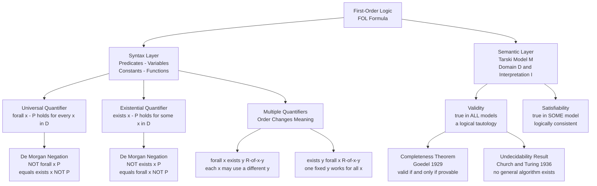

# Predicate Logic and Quantifiers

> [!abstract] TL;DR
> Predicate logic (First-Order Logic, FOL) extends propositional logic by letting statements talk about *objects* and their *properties*: it introduces predicates that hold of individuals, variables that range over a domain, and two quantifiers — ∀ ("for all") and ∃ ("there exists") — that bind those variables to turn predicate schemas into full propositions. Gödel's 1929 Completeness Theorem established that the standard proof system is exactly as strong as semantic truth in FOL; Church and Turing's 1936 Undecidability result established the hard limit — no algorithm can decide FOL validity in general, carving the boundary between logic and computation.

---

## Intuition

**Analogy:** Propositional logic is like a light switch panel — each switch is labeled (P, Q, R) and is either ON or OFF, with no internal detail. Predicate logic is like a *smart building management system*: each device in the building is an individual object, each sensor reports a property (IsOn, IsLocked, Temperature > 20), and you can issue building-wide commands — "turn off every light on floor 3" (universal quantifier) or "find any window that has been open for more than an hour" (existential quantifier). The system does not care which specific light you mean; it ranges over all objects in the domain and evaluates the property for each one. One rule covers a whole population.

In formal terms: propositional logic can only say "It is raining." Predicate logic can say "For every city x, if x is coastal, then x will receive rain this week" — quantifying over an entire domain at once, with variables playing the role of "any city whatsoever" rather than a specific named one.

---

## How It Works

### Core Mechanics

**From propositions to predicates.** A propositional atom P has no internal structure — it is either true or false, full stop. A predicate `IsStudent(x)` contains a free variable `x`; its truth value depends on which individual you substitute. `IsStudent(alice)` is true or false in a model. `Likes(x, y)` is a binary predicate — a *relation* — that takes two individuals and is true of some pairs and false of others. Predicates are the load-bearing units of FOL.

**Individual constants, variables, and function terms.**
- **Constants** (alice, pluto, 42) name specific domain elements.
- **Variables** (x, y, z) range over the entire domain of discourse.
- **Function terms** (father(x), succ(n)) map individuals to individuals without asserting truth values.

**Quantifiers bind variables and produce propositions.**
- **Universal quantifier ∀:** `∀x P(x)` is true in model M iff `P(d)` is true for *every* element d in the domain D.
- **Existential quantifier ∃:** `∃x P(x)` is true iff `P(d)` is true for *at least one* d in D.

A formula with no free variables (all variables bound by quantifiers) is a *sentence* — it has a definite truth value in any model. A formula with free variables is a predicate schema — not yet a full proposition.

**De Morgan's laws for quantifiers** allow negation to pass through quantifier symbols:
- `¬∀x P(x)` is equivalent to `∃x ¬P(x)` — "Not all birds fly" means "Some bird does not fly."
- `¬∃x P(x)` is equivalent to `∀x ¬P(x)` — "No bird flies" means "Every bird does not fly."

**Nested quantifiers and order sensitivity.** When two quantifiers appear together, their relative order critically changes meaning:
- `∀x ∃y R(x,y)` — "For every x, there exists *some* y (possibly a different y for each x) such that R holds."
- `∃y ∀x R(x,y)` — "There exists *one fixed* y that works for every x simultaneously."

The second claim is strictly stronger. If `∃y ∀x R(x,y)` is true, then `∀x ∃y R(x,y)` is also true — but the converse fails. This asymmetry underpins the distinction between pointwise and uniform convergence in analysis, and between per-request and shared resources in distributed systems.

**Tarski model-theoretic semantics.** A model M = (D, I) consists of:
- A **domain of discourse** D — a non-empty set of objects the variables range over.
- An **interpretation function** I — assigns each constant a domain element; each n-ary predicate a set of n-tuples from D (its *extension*).

A **variable assignment** s maps each variable to a domain element. Truth is defined by structural recursion:
- `M, s ⊨ P(t₁,...,tₙ)` iff the tuple of values of the terms is in I(P).
- `M, s ⊨ ∀x φ` iff for every d ∈ D, `M, s[x↦d] ⊨ φ`.
- `M, s ⊨ ∃x φ` iff there exists d ∈ D such that `M, s[x↦d] ⊨ φ`.

**Validity, satisfiability, and the major theorems.**
- **Satisfiable**: there exists some model in which φ is true.
- **Valid** (tautology): φ is true in *every* model.
- **Gödel's Completeness Theorem (1929):** Every valid FOL formula has a formal proof in the standard Hilbert-style system. The proof calculus is *complete* — it misses nothing that is semantically true.
- **Church-Turing Undecidability (1936):** There is no algorithm that, given any FOL formula φ, always halts and outputs whether φ is valid. FOL validity is *semi-decidable* at best.

### Flow / Architecture



---

## Key Concepts

### Secondary Level

**Why propositional logic is not enough.** Propositional logic treats atomic sentences like P and Q as indivisible black boxes. It cannot express "Every human is mortal" or "Some prime is even" because those sentences require ranging over a collection of objects. Predicate logic adds the internal structure — subjects (individuals), properties (predicates), and quantifiers — needed to reason about populations of objects.

**Predicates are not propositions.** `IsStudent(x)` is a predicate with a free variable; substituting a specific constant gives a proposition. Binding with a quantifier also gives a proposition. A formula with remaining free variables is still a predicate schema, not a sentence with a fixed truth value.

**The two quantifiers at a glance.**

| Quantifier | Symbol | Plain meaning | True when |
|-----------|--------|---------------|-----------|
| Universal | ∀x P(x) | "For all x, P(x)" | P holds of every element in D |
| Existential | ∃x P(x) | "There exists x such that P(x)" | P holds of at least one element in D |

**De Morgan for quantifiers — the most useful rewrite rule.**
- To negate ∀: flip to ∃ and negate the predicate. "Not every student passed" = "Some student did not pass."
- To negate ∃: flip to ∀ and negate the predicate. "Nobody passed" = "Every student did not pass."

**Scope and bound variables.** In `∀x (P(x) → Q(x))`, the quantifier ∀x binds every occurrence of `x` inside the parentheses — that `x` is *bound*. A variable not bound by any quantifier is *free*. Only sentences (no free variables) have a definite truth value in a model; open formulas express conditions that depend on which individual fills the free variable.

---

### Undergraduate Level

**Formal syntax of FOL.** The grammar has two layers:
- **Terms** — constants, variables, and function applications like `f(x, g(y))`.
- **Well-formed formulas (WFFs)** — built from atomic formulas `P(t₁,...,tₙ)` or `t₁ = t₂` by applying connectives (¬, ∧, ∨, →, ↔) and quantifiers (∀x, ∃x).

Substitution is the key operation: φ[t/x] denotes the formula φ with term t replacing all free occurrences of x. Correct substitution requires that t is *free for x in φ* — no variable in t becomes accidentally bound after substitution.

**Nested quantifier interaction — the full four-case table.**

| Formula | Natural language reading | Strength |
|---------|------------------------|----------|
| ∀x ∀y R(x,y) | R holds between *every* ordered pair | Strongest |
| ∀x ∃y R(x,y) | For each x, *some* y (may vary with x) satisfies R | — |
| ∃x ∀y R(x,y) | One fixed x relates to *every* y | — |
| ∃x ∃y R(x,y) | *Some* pair satisfies R | Weakest |

Each row implies the one below it, but not vice versa. The asymmetry between `∀x ∃y` and `∃y ∀x` is responsible for distinguishing pointwise from uniform convergence in real analysis: "for every ε, for every x, there exists δ..." vs. "for every ε, there exists δ, for every x..." give fundamentally different guarantees.

**Prenex normal form.** Any FOL formula is logically equivalent to one where all quantifiers appear as a block at the front (the *quantifier prefix*) followed by a quantifier-free *matrix*. Converting to prenex normal form simplifies proofs and is the first step in Skolemization (converting to clausal form for resolution-based theorem proving).

**Gödel's Completeness Theorem (1929) — what it says and does not say.** The theorem states: φ is valid (true in every model) if and only if φ is provable in the standard Hilbert calculus for FOL. This means the proof rules capture exactly the semantically valid formulas — no valid formula "slips through" unprovable. This is a *metatheorem* about the proof system for FOL itself. It is completely separate from Gödel's *Incompleteness Theorems* (1931), which concern specific theories like Peano Arithmetic, not FOL in isolation.

**Löwenheim-Skolem theorem.** If a FOL formula (or theory) has a model at all, it has a *countably infinite* model. A consequence: FOL cannot categorically characterize uncountable structures. Any set of FOL axioms intended to describe the real numbers will also be satisfied by a countable model that is not isomorphic to the reals. FOL is therefore *non-categorical* for rich mathematical structures.

---

### Graduate Level

**Church-Turing Undecidability in detail.** In 1936, Alonzo Church (using the lambda calculus) and Alan Turing (using Turing machines) independently proved that the *Entscheidungsproblem* — deciding FOL validity — has no algorithmic solution. The proof encodes the halting problem as a FOL validity question: for any Turing machine M and input w, one can construct a FOL formula φ_{M,w} that is valid iff M halts on w. Since the halting problem is undecidable, FOL validity is too.

FOL is *semi-decidable*: if φ is valid, a proof-search procedure (like resolution) will eventually find a proof. If φ is not valid, the procedure may run forever. There is no algorithm that always terminates with a correct answer.

**Second-order logic (SOL).** FOL quantifies over individuals. SOL additionally allows quantification over predicates and functions: `∀P ∀n (P(0) ∧ ∀k(P(k) → P(k+1))) → P(n)` is the full second-order induction axiom. SOL is strictly more expressive than FOL:
- SOL can categorically characterize the natural numbers (the Dedekind-Peano axioms have a unique model up to isomorphism).
- SOL can characterize the real numbers as the unique complete ordered field.

The price: SOL loses Gödel's Completeness Theorem and every standard deductive system is necessarily incomplete. The expressiveness-decidability trade-off is fundamental.

**Decidable FOL fragments.** Full FOL is undecidable, motivating restrictions:
- **Monadic FOL** (only one-place predicates, no function symbols): decidable.
- **Two-variable fragment FOL²** (only variables x and y): decidable, NEXPTIME-complete.
- **Description Logics** (the basis of OWL): decidable with complexity ranging from PTIME to EXPTIME depending on the logic.
- **Propositional logic**: decidable, coNP-complete.

Each restriction sacrifices some expressive power to regain computational tractability.

**Resolution and Herbrand's theorem.** Herbrand (1930) showed a FOL formula is unsatisfiable iff some finite conjunction of its *ground instances* (substituting domain elements for variables) is propositionally unsatisfiable. Robinson's *resolution* algorithm (1965) implements this: it refutes unsatisfiability by deriving the empty clause from the clausal form of ¬φ. Prolog's execution model is backward-chaining resolution restricted to Horn clauses (at most one positive literal per clause) — a fragment where resolution terminates.

**Formal software verification.** Hoare logic expresses program correctness as FOL triples `{P} C {Q}`: predicate P holds before command C; predicate Q holds after. Verifying loops requires finding a *loop invariant* — a predicate I such that {I ∧ B} body {I} and I ∧ ¬B implies the postcondition. Loop invariant discovery is undecidable in general (directly reducible to FOL validity). In practice, SMT solvers (Z3, CVC5) decide important decidable fragments — linear arithmetic, array logic, bit-vectors — covering most real verification conditions.

---

## Python Demo

```python
"""
Predicate Logic Evaluator with Quantifier Order Sensitivity Demo.

Demonstrates:
  1. Predicates as Python functions over a finite domain
  2. Universal quantifier (forall) and existential quantifier (exists) by iteration
  3. De Morgan's laws for quantifiers verified computationally
  4. Nested quantifier order: forall-x-exists-y vs exists-y-forall-x
     using R(x, y) = "x divides y" on domain {1, 2, 3, 4, 6}
     => forall x exists y R(x,y) is TRUE (each x divides itself)
     => exists y forall x R(x,y) is FALSE (need lcm=12, not in domain)
  5. Matrix heatmap of R(x,y) with row/column quantifier annotations
"""

import numpy as np
import matplotlib.pyplot as plt

# ---------------------------------------------------------------------------
# 1. Finite domain and predicates
# ---------------------------------------------------------------------------
DOMAIN = [1, 2, 3, 4, 6]
N = len(DOMAIN)

def R(x, y):
    """Binary predicate R(x,y): x divides y."""
    return y % x == 0

def IsEven(x):
    """Unary predicate: x is even."""
    return x % 2 == 0

def IsGreaterThanTwo(x):
    """Unary predicate: x > 2."""
    return x > 2

# ---------------------------------------------------------------------------
# 2. Universal and existential quantifiers over the finite domain
# ---------------------------------------------------------------------------
def forall(pred, domain=DOMAIN):
    """forall x P(x): true iff P holds for every element."""
    return all(pred(d) for d in domain)

def exists(pred, domain=DOMAIN):
    """exists x P(x): true iff P holds for at least one element."""
    return any(pred(d) for d in domain)

# ---------------------------------------------------------------------------
# 3. Single-quantifier evaluation
# ---------------------------------------------------------------------------
print("=== Single Quantifier Evaluation (D = {1,2,3,4,6}) ===\n")
print(f"  forall x IsEven(x)            = {forall(IsEven)}")
print(f"  exists x IsEven(x)            = {exists(IsEven)}")
print(f"  forall x IsGreaterThanTwo(x)  = {forall(IsGreaterThanTwo)}")
print(f"  exists x IsGreaterThanTwo(x)  = {exists(IsGreaterThanTwo)}")

# ---------------------------------------------------------------------------
# 4. De Morgan laws verified computationally
# ---------------------------------------------------------------------------
print("\n=== De Morgan for Quantifiers ===\n")

fa_even = forall(IsEven)
ex_not_even = exists(lambda x: not IsEven(x))
print(f"  NOT forall x IsEven(x)         = {not fa_even}")
print(f"  exists x NOT IsEven(x)         = {ex_not_even}")
print(f"  De Morgan verified:            {(not fa_even) == ex_not_even}\n")

not_ex_gt2 = not exists(IsGreaterThanTwo)
fa_not_gt2 = forall(lambda x: not IsGreaterThanTwo(x))
print(f"  NOT exists x IsGreaterThanTwo  = {not_ex_gt2}")
print(f"  forall x NOT IsGreaterThanTwo  = {fa_not_gt2}")
print(f"  De Morgan verified:            {not_ex_gt2 == fa_not_gt2}")

# ---------------------------------------------------------------------------
# 5. Nested quantifier order sensitivity
#    forall x exists y R(x,y): for each x, find ANY y in D with x|y
#    exists y forall x R(x,y): find ONE y such that x|y for ALL x in D
# ---------------------------------------------------------------------------
print("\n=== Nested Quantifier Order Sensitivity ===")
print("  Relation R(x,y) = 'x divides y'\n")

print("  Evaluating: forall x exists y R(x,y)")
fa_ex_result = True
for x in DOMAIN:
    witnesses = [y for y in DOMAIN if R(x, y)]
    found = bool(witnesses)
    fa_ex_result = fa_ex_result and found
    print(f"    x={x}  witnesses y: {witnesses}  -> exists y: {found}")
print(f"  Result: forall x exists y R(x,y) = {fa_ex_result}\n")

print("  Evaluating: exists y forall x R(x,y)")
ex_fa_result = False
for y in DOMAIN:
    failures = [x for x in DOMAIN if not R(x, y)]
    works_for_all = not bool(failures)
    if works_for_all:
        ex_fa_result = True
    print(f"    y={y}  x values NOT dividing y: {failures}  -> forall x: {works_for_all}")
print(f"  Result: exists y forall x R(x,y) = {ex_fa_result}")

print(f"\n  Summary:")
print(f"    forall x exists y R(x,y) = {fa_ex_result}   (each x divides itself)")
print(f"    exists y forall x R(x,y) = {ex_fa_result}  (lcm of D = 12, not in D)")
print(f"    Quantifier order changes truth value: {fa_ex_result != ex_fa_result}")

# ---------------------------------------------------------------------------
# 6. Build the relation matrix
# ---------------------------------------------------------------------------
R_matrix = np.array([[int(R(x, y)) for y in DOMAIN] for x in DOMAIN])

# Row summary: does each x have at least one witness y?
row_has_witness = R_matrix.any(axis=1)

# Column summary: does any y work for all x?
col_works_for_all = R_matrix.all(axis=0)

# ---------------------------------------------------------------------------
# 7. Visualization: heatmap + quantifier summary table
# ---------------------------------------------------------------------------
fig, axes = plt.subplots(1, 2, figsize=(14, 6))

# --- Left panel: heatmap of R(x,y) ---
ax = axes[0]
ax.imshow(R_matrix, cmap="RdYlGn", aspect="auto", vmin=0, vmax=1)

ax.set_xticks(range(N))
ax.set_xticklabels([f"y={v}" for v in DOMAIN], fontsize=10)
ax.set_yticks(range(N))
ax.set_yticklabels([f"x={v}" for v in DOMAIN], fontsize=10)
ax.set_title("Relation R(x,y): x divides y\nDomain D = {1, 2, 3, 4, 6}", fontsize=11)
ax.set_xlabel("y  (columns: candidate universal witness)", fontsize=9)
ax.set_ylabel("x  (rows: each x must find an existential witness)", fontsize=9)

# Cell text: T or F
for i in range(N):
    for j in range(N):
        val = R_matrix[i, j]
        ax.text(j, i, "T" if val else "F", ha="center", va="center",
                fontsize=11, fontweight="bold",
                color="white" if val else "#333333")

# Row annotation (right side): does exists y hold for this x?
for i, has_w in enumerate(row_has_witness):
    color = "#15803d" if has_w else "#b91c1c"
    label = "Ex.y: Y" if has_w else "Ex.y: N"
    ax.annotate(label, xy=(N - 0.5, i), xytext=(N + 0.15, i),
                va="center", ha="left", fontsize=8.5,
                color=color, fontweight="bold",
                annotation_clip=False)

# Column annotation (below): does forall x hold for this y?
for j, works in enumerate(col_works_for_all):
    color = "#15803d" if works else "#b91c1c"
    label = "Ax: Y" if works else "Ax: N"
    ax.annotate(label, xy=(j, N - 0.5), xytext=(j, N + 0.1),
                ha="center", va="top", fontsize=8.5,
                color=color, fontweight="bold",
                annotation_clip=False)

ax.set_xlim(-0.5, N + 1.1)
ax.set_ylim(N + 0.6, -0.5)

# --- Right panel: summary table ---
ax2 = axes[1]
ax2.axis("off")

rows = [
    ["Formula", "Value", "Reason"],
    ["forall x IsEven", str(forall(IsEven)), "1 and 3 are odd"],
    ["exists x IsEven", str(exists(IsEven)), "2 is even"],
    ["forall x x > 2", str(forall(IsGreaterThanTwo)), "1 and 2 fail"],
    ["exists x x > 2", str(exists(IsGreaterThanTwo)), "3, 4, 6 qualify"],
    ["NOT forall x IsEven", str(not forall(IsEven)), "= exists x NOT Even"],
    ["NOT exists x x > 2", str(not exists(IsGreaterThanTwo)), "= forall x NOT (x>2)"],
    ["forall x exists y x|y", str(fa_ex_result), "each x divides itself"],
    ["exists y forall x x|y", str(ex_fa_result), "need lcm=12, not in D"],
]

tbl = ax2.table(cellText=rows[1:], colLabels=rows[0],
                cellLoc="center", loc="center",
                colWidths=[0.42, 0.14, 0.44])
tbl.auto_set_font_size(False)
tbl.set_fontsize(8.5)
tbl.scale(1.0, 1.9)

for j in range(3):
    tbl[0, j].set_facecolor("#1d4ed8")
    tbl[0, j].set_text_props(color="white", fontweight="bold")

for i in range(1, len(rows)):
    bg = "#dcfce7" if rows[i][1] == "True" else "#fee2e2"
    for j in range(3):
        tbl[i, j].set_facecolor(bg)

ax2.set_title("Quantifier Evaluation Summary\n"
              "Green = TRUE, Red = FALSE", fontsize=11)

plt.tight_layout(pad=2.0)
plt.savefig("predicate_logic_quantifiers.png", dpi=120, bbox_inches="tight")
plt.show()
```

**Expected output (key results on domain {1, 2, 3, 4, 6}):**

```
forall x IsEven(x)            = False   (1 and 3 are odd)
exists x IsEven(x)            = True    (2, 4, 6 are even)
forall x exists y R(x,y)      = True    (each x divides itself: witness y=x always works)
exists y forall x R(x,y)      = False   (LCM(1,2,3,4,6)=12 is not in the domain)
```

The heatmap displays an upper-triangular pattern — the structure of the divisibility relation on this domain. Every row has at least one green cell (so `∀x ∃y` is TRUE), but no column is entirely green (so `∃y ∀x` is FALSE). This is the quantifier-order asymmetry made visible: each row can find its own witness, but no single column witnesses the universal claim.

---

## Real-World Applications

> **SQL as restricted First-Order Logic.** Edgar Codd designed relational algebra — the mathematical foundation of SQL — as a direct instantiation of FOL over finite domains. A `SELECT * FROM Students WHERE GPA > 3.5` query corresponds to `{x | Student(x) ∧ GPA(x) > 3.5}` — existential projection over a domain. A correlated subquery like `WHERE EXISTS (SELECT ...)` is an explicit existential quantifier. The query optimizer exploits FOL equivalences (commutativity of joins, selection pushdown) to find efficient execution plans. NULL's three-valued behavior (TRUE / FALSE / UNKNOWN) arises directly from the FOL treatment of undefined domain references.

> **Logic Programming (Prolog).** The Prolog language is a direct implementation of a FOL fragment called **Horn clauses** — implications with at most one positive literal in the head. A Prolog program is a set of FOL axioms; a query is an existential question answered by unification and backward-chaining resolution. `ancestor(X, Z) :- parent(X, Y), ancestor(Y, Z)` is the FOL axiom `∀x ∀z (∃y (Parent(x,y) ∧ Ancestor(y,z))) → Ancestor(x,z)`. Industrial uses include constraint solvers (SWI-Prolog), static analyzers (Datalog-based program analysis), and rule engines in expert systems.

> **Knowledge Representation (Description Logics, OWL).** Google's Knowledge Graph, the W3C OWL Web Ontology Language, and biomedical ontologies (SNOMED CT, Gene Ontology) are built on **Description Logics** — decidable fragments of FOL. A DL axiom like "every cardiac surgery patient has at least one infection risk" is an FOL formula; a DL reasoner (HermiT, Pellet) performs automated classification and consistency checking at scale. The trade-off between expressiveness and decidability in DL directly mirrors the general FOL undecidability result.

> **Formal Software Verification.** Tools like TLA+, Alloy, Dafny, and Why3 encode program and system specifications as FOL-style assertions. Amazon Web Services uses TLA+ to verify distributed protocols (DynamoDB, S3). A safety property "every message that is sent is eventually delivered" is a temporal extension of FOL; model checking exhaustively verifies it against all reachable states. Hoare-triple-based verifiers (Frama-C for C, Dafny for .NET) discharge verification conditions using SMT solvers (Z3) that decide important decidable FOL fragments.

> **Natural Language Semantic Parsing.** Computational systems like SEMPRE and CCG-based parsers convert natural language questions into FOL-like logical forms for execution against knowledge bases. "Which cities have more than two airports?" becomes the formula `{c | City(c) ∧ |{a | Airport(a) ∧ LocatedIn(a,c)}| > 2}`. Modern neural semantic parsers (T5, BART fine-tuned on ATIS or GeoQuery) are trained to produce SPARQL or SQL queries — a direct engineering realization of Montague's program that every natural language sentence can be given a precise FOL-style interpretation.

---

## Common Pitfalls

- **Confusing ∀x∃y with ∃y∀x** — This is the single most common error in proofs and exercises. "Every student has a teacher" (∀x∃y) does not imply "One teacher teaches all students" (∃y∀x). The inner variable in `∀x∃y` may depend on the outer; in `∃y∀x` it cannot. Always read quantifiers strictly left-to-right and ask: "Is the inner witness allowed to vary with the outer variable?"

- **Vacuous truth of universal statements** — `∀x P(x)` is automatically true when the domain is empty, or more practically when no element satisfies the quantifier's restrictor predicate. "All unicorns are purple" is vacuously true. In SQL, a `WHERE` clause that matches no rows causes aggregates to return NULL or zero rather than an error — the silent vacuous-truth behavior that masks bugs in reporting queries.

- **Scope error: free vs bound variables** — Writing `∃x P(x) ∧ Q(x)` when you mean `∃x (P(x) ∧ Q(x))`. In the first formula the second `x` is free (refers to an outer context); in the second, both occurrences of `x` are bound by ∃x. Always parenthesize the full scope of every quantifier explicitly.

- **Treating ¬∀ as the same as ∀¬** — "Not all birds fly" (¬∀x Bird(x)→Flies(x)) requires only one flightless counterexample. "All birds don't fly" (∀x Bird(x)→¬Flies(x)) claims no bird can fly. These are completely different claims. The correct De Morgan rewrite is ¬∀ → ∃¬, never ∀¬.

- **Conflating completeness with decidability** — A student who learns that FOL is complete (Gödel 1929) may expect a program can always verify any FOL property. Completeness guarantees a proof *exists* for every valid formula; undecidability guarantees no algorithm can *find* it in finite time in all cases. Real verifiers work only because practical verification conditions fall into decidable sub-theories (linear arithmetic, bit-vectors), not full FOL.

- **Second-order quantification mistaken for first-order** — Statements like "P has all the properties that the natural numbers satisfy" quantify over predicates — that is second-order logic, not FOL. Any attempt to replicate this expressiveness inside FOL produces a theory that is necessarily incomplete by Gödel's First Incompleteness Theorem. Recognizing when a statement quantifies over sets or properties rather than individuals is a crucial skill for correct formal modeling.

---

## Related Concepts

- [[Logic_and_Critical_Thinking_Overview]] — the vault's entry point for logic; covers propositional calculus, inference rules, and the historical spine (Aristotle → Frege → Gödel → Turing) that culminates in FOL
- [[Formal_Semantics]] — develops the same Tarski model-theoretic apparatus applied to natural language; covers lambda calculus, type theory, Montague grammar, generalized quantifiers, and scope ambiguity — all built on top of the FOL foundation laid here
- [[Semantic_Theory]] — surveys semantic theories from Frege's sense-reference distinction through compositionality; provides the philosophical motivation for why truth-conditional, model-theoretic meaning (i.e., FOL semantics) became the standard
- [[Relational_Model]] — Codd's relational algebra was explicitly derived from FOL restricted to finite domains; every SQL query is a restricted FOL formula; the closed-world assumption and NULL semantics both trace back to FOL design decisions
- [[SQL_Fundamentals]] — the hands-on engineering application of FOL: SELECT/WHERE implements existential projection, correlated subqueries implement nested quantification, and the logical processing order mirrors quantifier scope evaluation
- [[Time_Complexity_Classes]] — FOL validity is undecidable (sits above the computable hierarchy); decidable FOL fragments fall into PSPACE or EXPTIME; the complexity landscape directly bounds what automated reasoners can achieve in practice

---

## Review Questions

### Secondary

1. Translate these English sentences into FOL using predicates `Student(x)`, `Passed(x)`, and `Studied(x)`: (a) "Every student who studied passed." (b) "Some student passed without studying." Then apply De Morgan's laws to negate each formula and re-translate the negation back into plain English.
2. Domain D = {2, 4, 5, 7}. Predicate `IsOdd(x)`. Evaluate: (a) ∀x IsOdd(x), (b) ∃x IsOdd(x), (c) ¬∀x IsOdd(x), (d) ∀x ¬IsOdd(x). Explain clearly why (c) and (d) have different truth values.
3. "There is one password that unlocks every account" and "Every account has a password that unlocks it" — are these logically equivalent? Write both as FOL formulas and explain the difference in terms of a real security scenario.

### Undergraduate

1. Given domain D = {1, 2, 3, 4, 5} and binary predicate R(x, y) meaning "x ≤ y", determine the truth value of: (a) ∀x ∃y R(x,y), (b) ∃y ∀x R(x,y), (c) ∀x ∀y R(x,y), (d) ∃x ∃y ¬R(x,y). For each, provide a witnessing element or a specific counterexample.
2. Prove using Tarski's recursive definition of satisfaction that ¬∀x P(x) and ∃x ¬P(x) are logically equivalent: show that for every model M and variable assignment s, M,s ⊨ ¬∀x P(x) if and only if M,s ⊨ ∃x ¬P(x), using only the definitions of ⊨ for ¬ and ∀.
3. Gödel's Completeness Theorem says every valid FOL formula is provable; Church and Turing proved FOL validity is undecidable. Explain how both can be true simultaneously. What exactly does "provable" mean in the Completeness Theorem, and why does the existence of a proof not give us an algorithm for deciding validity?

### Graduate

1. The Löwenheim-Skolem theorem states that any FOL theory with an infinite model has a countably infinite model. A student argues: "We can characterize the real numbers in FOL by taking the ordered field axioms plus a completeness axiom: every bounded set has a least upper bound." Identify the precise flaw in this argument. What does the theorem say about FOL's ability to categorically characterize uncountable structures, and what does this imply about the limits of first-order axiomatizations of analysis?
2. Description Logics restrict FOL to regain decidability. Sketch the expressiveness-decidability trade-off by comparing: (a) full FOL (undecidable), (b) the two-variable fragment FOL² (NEXPTIME-complete), (c) the description logic ALC (EXPTIME-complete), (d) propositional logic (coNP-complete). For each level, name one practical system that operates at that level and identify the syntactic restriction that yields decidability.
3. Hoare-logic verification of loops requires finding a *loop invariant* — a predicate I satisfying three conditions: I holds at loop entry; {I ∧ B} body {I}; and I ∧ ¬B implies the postcondition. Prove that discovering a loop invariant is undecidable in general by reducing it to FOL validity. Then describe the three main practical strategies (abstraction interpretation, predicate abstraction, manual annotation) that production verifiers use to circumvent this undecidability, and analyze the completeness trade-offs each strategy accepts.

---

## Sources

- [Enderton, H. B. (2001). *A Mathematical Introduction to Logic* (2nd ed.). Academic Press.](https://www.elsevier.com/books/a-mathematical-introduction-to-logic/enderton/978-0-12-238452-3) — the standard undergraduate text for FOL syntax, Tarski semantics, and Gödel's completeness proof
- [Gödel, K. (1930). "Die Vollständigkeit der Axiome des logischen Funktionenkalküls." *Monatshefte für Mathematik und Physik* 37, 349–360.](https://doi.org/10.1007/BF01696781) — the original completeness theorem
- [Church, A. (1936). "A Note on the Entscheidungsproblem." *Journal of Symbolic Logic* 1(1), 40–41.](https://doi.org/10.2307/2269326) — FOL undecidability via lambda calculus
- [Tarski, A. (1936). "The Concept of Truth in Formalized Languages." In *Logic, Semantics, Metamathematics*. Hackett, 1983.](https://www.hackettpublishing.com/logic-semantics-metamathematics) — the recursive definition of satisfaction that grounds all model-theoretic semantics in this note
- [Baader, F. et al. (eds.) (2003). *The Description Logic Handbook*. Cambridge University Press.](https://doi.org/10.1017/CBO9780511711787) — comprehensive reference for decidable FOL fragments, expressiveness hierarchies, and OWL applications

---

#logic #predicate-logic #first-order-logic #quantifiers #formal-logic
