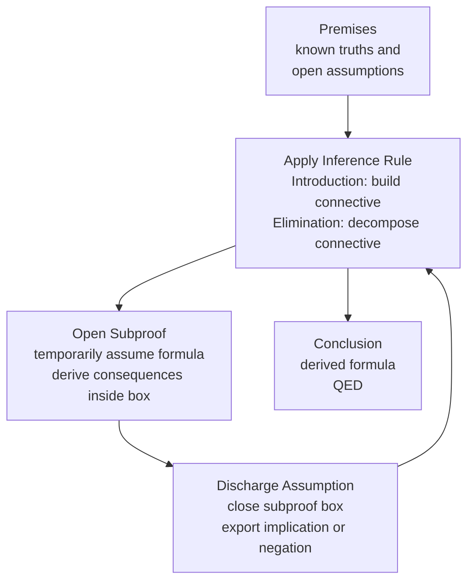

# Proof Theory and Natural Deduction

> [!abstract] TL;DR
> A formal proof is a finite, fully explicit derivation in which every line is justified by a rule — proof theory studies those rule systems. Gentzen's 1935 natural deduction gives each logical connective a symmetric pair of introduction and elimination rules that mirror how humans actually construct and deconstruct arguments, and it is both sound and complete for classical and intuitionistic logic. The Curry-Howard correspondence reveals that natural deduction proofs are secretly programs and propositions are secretly types, making proof theory the common ancestor of both mathematics foundations and type-safe programming languages.

---

## Intuition

**Analogy:** Think of building a legal case. Introduction rules are like assembling evidence — you collect a witness statement (A) and a document (B), then formally combine them into "the defendant was present AND the payment was made" (A∧B). Elimination rules are the cross-examination — given the combined claim, you can extract either piece individually. A subproof is like a hypothetical argument: "Suppose the alibi is valid. Then the timeline is impossible. Contradiction. Therefore the alibi is false." When you close that hypothetical block, you have established a conditional fact without the alibi ever actually being true.

Natural deduction captures this: every connective has exactly one way to build it (introduction) and one way to take it apart (elimination). Hilbert-style axiomatic systems, by contrast, hand you a bag of axiom schemas and a single universal rule — powerful but unreadable, like writing a legal brief by citing statute numbers with no explanation.

---

## How It Works

### Core Mechanics

**What is a formal proof?** A formal proof is a finite rooted tree of formulas where every leaf is either an axiom or a discharged assumption, and every non-leaf follows from its children by a syntactic inference rule. The root is the conclusion.

**Hilbert-style (axiomatic) systems** encode all the logical content in axiom schemas and use modus ponens as the only rule:
- Schema K: A → (B → A)
- Schema S: (A → (B → C)) → ((A → B) → (A → C))
- Schema DN: (¬A → ¬B) → (B → A)
- Rule: from ⊢ A and ⊢ A→B, derive ⊢ B

Every valid formula is provable, but the proofs are unreadable — proving A → A takes five lines.

**Natural deduction** (Gerhard Gentzen, 1935; NK = classical, NJ = intuitionistic) replaces axioms with rules that mirror natural mathematical reasoning. Each connective has an **introduction rule** (how to prove it) and an **elimination rule** (how to use it):

| Connective | Introduction | Elimination |
|---|---|---|
| **A ∧ B** | ∧I: have proofs of A and B | ∧E₁: get A from A∧B; ∧E₂: get B |
| **A → B** | →I: assume A in subproof, derive B, discharge A | →E (MP): have A→B and A, get B |
| **A ∨ B** | ∨I₁: have A, get A∨B; ∨I₂: have B | ∨E: have A∨B, A→C, B→C — get C |
| **¬A** | ¬I: assume A in subproof, derive ⊥, discharge A | ¬E (DNE): have ¬¬A, get A |
| **⊥** | — | ⊥E (ex falso): from ⊥ derive anything |

**Subproofs and assumption discharge** are the key innovation. You open a subproof by temporarily assuming a formula, derive consequences under that assumption, then close the subproof — discharging the assumption. The result is an implication (→I) or negation (¬I). The assumption is no longer "live" after discharge.

**Fitch notation** represents this as nested boxes. An assumption sits at the top of a box; the box boundary marks where the assumption is discharged:

```
1  │ P ∧ Q           [Assumption]
   ├──────────────
2  │ P               [∧E₁ from 1]
3  │ Q               [∧E₂ from 1]
   │  ┌──────────
4  │  │ R            [Assumption — subproof]
5  │  │ P ∨ R        [∨I₁ from 2]
   │  └──────────
6  │ R → P ∨ R      [→I, discharge line 4 using lines 4–5]
```

**Sequent calculus** (Gentzen's LK for classical, LJ for intuitionistic) rewrites the judgment as a sequent Γ ⊢ Δ: "from hypotheses Γ, prove some formula in Δ." This splits each connective rule into a **left rule** (using the formula as a hypothesis) and a **right rule** (proving it as a conclusion). The landmark result is **cut elimination** (Gentzen's Hauptsatz): any proof using the cut rule — invoking a lemma — can be transformed into a cut-free proof. Cut-free proofs have the subformula property, making them tractable for proof search.

**The Curry-Howard correspondence** (Howard 1969, extending Curry 1934) states:

| Logic side | Type theory side |
|---|---|
| Proposition P | Type T |
| Proof of P | Program of type T |
| →I (assume A, derive B) | λ-abstraction: λx:A. t : A → B |
| →E (modus ponens) | Function application: f a : B |
| ∧I (pair proofs A, B) | Pair constructor: (a, b) : A × B |
| ∧E (project) | fst, snd : A × B → A / B |
| ∨I | Injection: inl / inr into A + B |
| Proof normalization | Program evaluation / beta reduction |
| Cut elimination | Normalization of programs |

This isomorphism extends: NJ ↔ simply-typed lambda calculus ↔ cartesian closed categories. It is why Haskell's type system is a proof system, why Coq proofs produce runnable OCaml, and why Rust's borrow checker encodes a linear-logic proof obligation.

**Soundness and completeness** of natural deduction: NK is sound (every provable formula is a tautology) and complete (every tautology is provable). This was proved by Gentzen and independently follows from the completeness theorem for classical propositional logic. NJ is sound and complete for intuitionistic validity (truth in all Heyting algebras / Kripke models).

---

### Flow / Architecture



---

## Key Concepts

### Secondary

- **Formal proof** — A proof is not a convincing argument; it is a finite derivation where every step is licensed by a named syntactic rule. Informal proofs in mathematics are abbreviations of formal ones.
- **Inference rule** — A schema of the form "given these formulas above the line, you may write this formula below." Modus ponens is the canonical example.
- **Modus ponens (→E)** — From A→B and A, derive B. The single most important rule in all of logic.
- **Assumption** — In natural deduction, you may assume any formula at any time. The assumption is only valid within its subproof.
- **Ex falso quodlibet (⊥E)** — From a contradiction, anything follows. Formally: from ⊥, derive C. This is why inconsistent axiom sets are catastrophic.
- **Hilbert system** — The original style (Frege 1879, Hilbert-Ackermann 1928): many axiom schemas, only modus ponens as a rule. Logically minimal, humanly opaque.
- **Valid vs. provable** — A formula is valid if it is true in all interpretations (semantics); it is provable if there exists a formal derivation (syntax). Soundness says provable → valid; completeness says valid → provable.

### Undergraduate

- **Introduction and elimination rules** — Every connective in natural deduction has exactly one I-rule and at least one E-rule. The I-rule tells you how to prove a formula with that connective as its main operator; the E-rule tells you how to extract information from such a formula.
- **Subproof and assumption discharge** — The mechanism that makes →I and ¬I work. You reason from a temporary assumption A, reach B, then close the subproof, obtaining A→B. After discharge, A is no longer available as a hypothesis.
- **Fitch notation** — A 2D representation of proofs where vertical lines demarcate open assumptions. Sub-boxes show subproofs. This is the notation used in introductory logic courses (e.g., Barwise and Etchemendy's "Language, Proof and Logic").
- **Sequent calculus (LK/LJ)** — A variant of natural deduction where the judgment is a sequent Γ ⊢ Δ with sets of formulas on both sides. Left rules manipulate Γ; right rules manipulate Δ. More symmetric, more amenable to proof-search algorithms.
- **Classical vs. intuitionistic logic** — NK adds double negation elimination (¬¬A ⊢ A) or equivalently excluded middle (⊢ A ∨ ¬A). NJ does not. In NJ, a proof of A ∨ B must constructively exhibit which disjunct holds and provide its proof — this is why intuitionistic logic corresponds to computation.
- **Soundness** — Every formula provable in NK is a tautology. Proved by induction on proof structure: each rule preserves truth.
- **Completeness** — Every tautology is provable in NK. More subtle — follows from the completeness of truth-table methods.
- **Normal proof** — A proof in which no formula is first introduced and then immediately eliminated (no detour). Every NK proof can be normalized. Normal proofs have the subformula property: every formula in a normal proof is a subformula of the premises or conclusion.

### Graduate

- **Cut elimination (Hauptsatz)** — Gentzen's main theorem for LK/LJ: any proof using the cut rule (Γ ⊢ A, Γ, A ⊢ B implies Γ ⊢ B — the invocation of a lemma) can be converted to a cut-free proof. Consequences: consistency of arithmetic (via a finitistic proof using transfinite induction up to ε₀), the subformula property, and decidability of propositional logic.
- **Curry-Howard correspondence** — The precise isomorphism between NJ proofs and simply-typed lambda calculus terms, extended by Howard (1980) to dependent types (propositions-as-types for predicate logic). Extends further: LJ ↔ cartesian closed categories, linear logic ↔ linear types, modal logic ↔ comonadic types.
- **Proof normalization** — The analog of program execution. Reducing a proof that first introduces a connective and then immediately eliminates it corresponds to beta reduction. The Church-Rosser theorem (confluence) for lambda calculus is the proof-theoretic analog of determinism of computation.
- **Dependent type theory** — The Calculus of Inductive Constructions (Coq) and Martin-Löf Type Theory (Agda) extend Curry-Howard to first-order and higher-order logic: types can depend on values. Σ-types are dependent pairs encoding existential quantifiers; Π-types are dependent functions encoding universal quantifiers.
- **Linear logic** — Girard (1987) discovered that classical logic embeds in a resource-sensitive logic where each hypothesis must be used exactly once. The Curry-Howard image is linear types, on which Rust's ownership and borrow system is modeled.
- **Proof irrelevance vs. proof relevance** — In classical mathematics, once you know ⊢ A, the specific proof does not matter. In type theory with the Curry-Howard correspondence, different proofs of the same proposition may be different programs with different behaviors — proof relevance. Homotopy Type Theory (HoTT) makes this precise: proofs are paths, proof equality is homotopy.
- **Ordinal proof theory** — Gentzen (1936) proved the consistency of Peano Arithmetic by transfinite induction up to ε₀. This bounds the proof-theoretic ordinal of PA and gives a finitistic (but not purely finitary in Hilbert's sense) consistency proof.

---

## Python Demo

```python
import numpy as np
import matplotlib.pyplot as plt
import matplotlib.patches as mpatches

# ── Formula parser ─────────────────────────────────────────────────────────────
# Formulas: atomic strings like "P", "Q", compound like "P AND Q",
# "P OR Q", "P -> Q", "NOT P", "BOTTOM".
# Operators checked in order of lowest precedence: " -> ", " OR ", " AND ".

def split_top_level(formula, operator):
    """Find operator at depth-0 and return (left, right), or None."""
    depth = 0
    op_len = len(operator)
    for i in range(len(formula)):
        ch = formula[i]
        if ch == '(':
            depth += 1
        elif ch == ')':
            depth -= 1
        elif depth == 0 and formula[i:i + op_len] == operator:
            left = formula[:i].strip()
            right = formula[i + op_len:].strip()
            return (left, right)
    return None


def parse_connective(formula):
    """Return (connective, arg1, arg2). connective in {AND, OR, ->, NOT, BOTTOM, ATOM}."""
    formula = formula.strip()
    if formula.startswith('(') and formula.endswith(')'):
        formula = formula[1:-1].strip()
    if formula == 'BOTTOM':
        return ('BOTTOM', None, None)
    if formula.startswith('NOT '):
        return ('NOT', formula[4:].strip(), None)
    # Check lowest-precedence operator first so it becomes the root connective
    for op in [' -> ', ' OR ', ' AND ']:
        result = split_top_level(formula, op)
        if result is not None:
            return (op.strip(), result[0], result[1])
    return ('ATOM', formula, None)


# ── Step validator ─────────────────────────────────────────────────────────────
# Each step: (line_no: int, formula: str, rule: str, deps: tuple[int, ...])
# Rules: ASSUME  AND_I  AND_E1  AND_E2  IMP_I  IMP_E  OR_I1  OR_I2  NOT_E  EX_FALSO

def validate_step(step, step_map):
    """Validate one proof step against the step_map {line: formula}. Returns (bool, str)."""
    _, formula, rule, deps = step

    def get(n):
        return step_map.get(n, '')

    if rule == 'ASSUME':
        return True, 'Assumption open'

    if rule == 'AND_I':
        if len(deps) != 2:
            return False, f'AND_I: need 2 deps, got {len(deps)}'
        expected = f'{get(deps[0])} AND {get(deps[1])}'
        return (formula == expected, f'Expected "{expected}"' if formula != expected else 'Conjunction intro')

    if rule == 'AND_E1':
        if len(deps) != 1:
            return False, 'AND_E1: need 1 dep'
        conn, left, _ = parse_connective(get(deps[0]))
        if conn == 'AND' and formula == left:
            return True, 'Conjunction elim left'
        return False, f'AND_E1 failed on "{get(deps[0])}"'

    if rule == 'AND_E2':
        if len(deps) != 1:
            return False, 'AND_E2: need 1 dep'
        conn, _, right = parse_connective(get(deps[0]))
        if conn == 'AND' and formula == right:
            return True, 'Conjunction elim right'
        return False, f'AND_E2 failed on "{get(deps[0])}"'

    if rule == 'IMP_I':
        if len(deps) != 2:
            return False, 'IMP_I: need 2 deps (assumption, conclusion)'
        expected = f'{get(deps[0])} -> {get(deps[1])}'
        return (formula == expected, 'Implication intro' if formula == expected else f'Expected "{expected}"')

    if rule == 'IMP_E':
        if len(deps) != 2:
            return False, f'IMP_E: need 2 deps, got {len(deps)}'
        f0, f1 = get(deps[0]), get(deps[1])
        for major, minor in [(f0, f1), (f1, f0)]:
            conn, ant, cons = parse_connective(major)
            if conn == '->' and ant == minor and cons == formula:
                return True, 'Modus ponens'
        return False, f'IMP_E: no match for "{formula}"'

    if rule == 'OR_I1':
        if len(deps) != 1:
            return False, 'OR_I1: need 1 dep'
        conn, left, _ = parse_connective(formula)
        if conn == 'OR' and left == get(deps[0]):
            return True, 'Disjunction intro left'
        return False, f'OR_I1: formula must be "{get(deps[0])} OR ..."'

    if rule == 'OR_I2':
        if len(deps) != 1:
            return False, 'OR_I2: need 1 dep'
        conn, _, right = parse_connective(formula)
        if conn == 'OR' and right == get(deps[0]):
            return True, 'Disjunction intro right'
        return False, f'OR_I2: formula must be "... OR {get(deps[0])}"'

    if rule == 'NOT_E':
        if len(deps) != 1:
            return False, 'NOT_E: need 1 dep'
        conn, inner, _ = parse_connective(get(deps[0]))
        if conn == 'NOT':
            conn2, inner2, _ = parse_connective(inner)
            if conn2 == 'NOT' and inner2 == formula:
                return True, 'Double negation elim'
        return False, f'NOT_E: "{get(deps[0])}" is not a double negation'

    if rule == 'EX_FALSO':
        if len(deps) != 1:
            return False, 'EX_FALSO: need 1 dep'
        return (get(deps[0]) == 'BOTTOM',
                'Ex falso quodlibet' if get(deps[0]) == 'BOTTOM'
                else f'EX_FALSO: dep must be BOTTOM')

    return False, f'Unknown rule "{rule}"'


def check_proof(steps):
    step_map = {s[0]: s[1] for s in steps}
    return [validate_step(s, step_map) for s in steps]


# ── Visualisation ──────────────────────────────────────────────────────────────
def display_proof(steps, results):
    col_labels = ['Line', 'Formula', 'Rule', 'Deps', 'Status']
    rows = []
    for (line, formula, rule, deps), (valid, reason) in zip(steps, results):
        rows.append([str(line), formula, rule,
                     ', '.join(str(d) for d in deps) if deps else '--',
                     'OK' if valid else 'FAIL'])

    fig, ax = plt.subplots(figsize=(13, 0.55 * len(steps) + 2.0))
    ax.axis('off')
    tbl = ax.table(cellText=rows, colLabels=col_labels, cellLoc='left', loc='center')
    tbl.auto_set_font_size(False)
    tbl.set_fontsize(10)
    tbl.auto_set_column_width([0, 1, 2, 3, 4])

    HEADER   = '#1e3a5f'
    VALID    = '#d1fae5'
    INVALID  = '#fee2e2'
    for col in range(len(col_labels)):
        tbl[(0, col)].set_facecolor(HEADER)
        tbl[(0, col)].set_text_props(color='white', fontweight='bold')
    for r, (_, (valid, _)) in enumerate(zip(steps, results), start=1):
        for col in range(len(col_labels)):
            tbl[(r, col)].set_facecolor(VALID if valid else INVALID)

    ax.set_title('Natural Deduction Proof Checker — Propositional Logic',
                 fontsize=13, fontweight='bold', pad=16)
    ax.legend(handles=[mpatches.Patch(color=VALID, label='Valid step'),
                       mpatches.Patch(color=INVALID, label='Invalid step')],
              loc='lower right', fontsize=9)
    plt.tight_layout()
    plt.savefig('natural_deduction_proof.png', dpi=130, bbox_inches='tight')
    plt.show()


# ── Example proof ──────────────────────────────────────────────────────────────
# Valid block: prove Q AND P from P AND Q  (commutativity of conjunction)
# then modus ponens, disjunction intro, implication intro, double negation elim.
# Final block: three deliberately invalid steps to demonstrate error detection.
proof_steps = [
    (1,  'P AND Q',      'ASSUME',    ()),       # open assumption
    (2,  'P',            'AND_E1',    (1,)),      # extract left conjunct
    (3,  'Q',            'AND_E2',    (1,)),      # extract right conjunct
    (4,  'Q AND P',      'AND_I',     (3, 2)),    # swap: conjuction intro
    (5,  'Q -> R',       'ASSUME',    ()),        # fresh assumption
    (6,  'R',            'IMP_E',     (5, 3)),    # modus ponens: Q->R and Q give R
    (7,  'R OR P',       'OR_I1',     (6,)),      # disjunction intro on R
    (8,  'P',            'ASSUME',    ()),        # sub-assumption for ->I
    (9,  'P OR Q',       'OR_I1',     (8,)),      # P gives P OR Q
    (10, 'P -> P OR Q',  'IMP_I',     (8, 9)),    # discharge assumption 8
    (11, 'NOT NOT Q',    'ASSUME',    ()),        # double negation assumption
    (12, 'Q',            'NOT_E',     (11,)),     # double negation elimination
    # ── Deliberate errors ───────────────────────────────────────────────
    (13, 'P AND Q',      'AND_I',     (2,)),      # FAIL: AND_I needs 2 deps
    (14, 'P',            'AND_E1',    (5,)),      # FAIL: dep 5 is Q->R, not a conjunction
    (15, 'R',            'IMP_E',     (5,)),      # FAIL: IMP_E needs 2 deps
]

results = check_proof(proof_steps)

# Print text report
np.set_printoptions(linewidth=120)
print(f"{'Line':<5} {'Formula':<22} {'Rule':<14} {'OK?':<5} Reason")
print('-' * 75)
for (line, formula, rule, deps), (valid, reason) in zip(proof_steps, results):
    mark = 'OK  ' if valid else 'FAIL'
    print(f"{line:<5} {formula:<22} {rule:<14} {mark:<5} {reason}")

n_valid = sum(v for v, _ in results)
print(f"\n{n_valid}/{len(proof_steps)} steps valid")

display_proof(proof_steps, results)
```

**Expected output:** Lines 1–12 print `OK`; lines 13–15 print `FAIL`. The matplotlib table renders rows 1–12 in green and rows 13–15 in red. Saved as `natural_deduction_proof.png`.

---

## Real-World Applications

1. **Coq / Lean / Agda proof assistants** — These tools are direct implementations of dependent type theory (the Calculus of Inductive Constructions for Coq). A Coq proof of a theorem is literally a term of the corresponding type. The Lean Mathlib library contains over 150 000 formally verified theorems. Theorem proving in these systems is natural deduction in a dependent-type setting.

2. **Rust's ownership system** — Rust's borrow checker enforces a linear-logic discipline: every value has exactly one owner, borrows are temporary, and aliased mutation is forbidden. This corresponds to a proof obligation in Girard's linear logic — resources must be used exactly once. The type-checker is, in effect, checking a linear natural deduction proof at compile time.

3. **Haskell's type system** — Every well-typed Haskell expression is, via Curry-Howard, a proof of the corresponding proposition in intuitionistic propositional logic. The type `a -> b -> a` (the type of `const`) corresponds exactly to axiom K: A → (B → A). GHC's type inference is proof search in NJ.

4. **SMT solvers (Z3, CVC5)** — These tools search for proofs or refutations in quantifier-free fragments of first-order logic. Internally they operate on sequent-calculus tableaux. They are used at Microsoft, Amazon, and Meta for automatic program verification and property checking.

5. **Formal verification of cryptographic protocols** — Tools like ProVerif and Tamarin model cryptographic protocols as process calculi and verify security properties by constructing formal proofs. The proof steps they find correspond directly to derivations in a linear-logic-based inference system. This approach has found flaws in real TLS implementations.

---

## Common Pitfalls

- **Confusing introduction and elimination direction** — A classic beginner error is trying to use ∧I to prove A from A∧B (that is ∧E₁). The rule that proves A∧B is ∧I — it goes upward, combining. The rule that extracts A from A∧B is ∧E₁ — it goes downward, decomposing. The letter "I" means you are introducing a new connective into the conclusion; "E" means you are eliminating an existing one.

- **Forgetting to discharge assumptions** — After opening a subproof for →I, the assumption must be discharged when the box closes. If you use the assumption outside its box, the proof is invalid. In Fitch notation this is a scope error; in proof-assistant software, the system rejects it with a type error.

- **Applying double-negation elimination in intuitionistic settings** — ¬¬A → A is valid in classical logic (NK) but not in intuitionistic logic (NJ). NJ's rule NOT_E only applies in the form of proof by contradiction producing ⊥ — it does not let you conclude A from ¬¬A constructively. This trips up anyone moving from classical to type-theoretic reasoning.

- **Confusing ¬I with proof by contradiction** — ¬I says: assume A, derive ⊥, conclude ¬A. This is an intuitionistically valid introduction rule for negation. Classical proof by contradiction says: assume ¬A, derive ⊥, conclude A — this is NOT ¬I; it uses ¬¬A → A (DNE). The distinction matters in Coq and Lean where the classical axioms must be explicitly imported.

- **Misunderstanding cut elimination** — Cut elimination does not say "lemmas are useless." It says every proof with lemmas can be converted to a direct proof. The converted proof may be exponentially longer — which is why mathematicians use lemmas in practice. Cut elimination is a theoretical tool for metatheorems, not a programming style guide.

- **Equating soundness with consistency** — Soundness says every provable formula is valid (true in all models). Consistency says no contradiction is provable. These are different: a complete classical propositional calculus is both sound and consistent, but Gödel showed that sufficiently strong systems cannot prove their own consistency even if they are consistent.

---

## Related Concepts

- [[Logic_and_Critical_Thinking_Overview]] — Provides the informal context for formal logic; this note is the technical deep-dive into one of the formal systems surveyed there (natural deduction and sequent calculus).
- [[Arguments_Validity_and_Soundness]] — The semantic concepts of validity and soundness that natural deduction is designed to preserve; soundness of NK means every provable formula is semantically valid.
- [[Propositions_and_Truth_Values]] — Truth-functional semantics gives the model-theoretic side against which natural deduction is measured; completeness closes the loop between semantic truth and syntactic provability.
- [[Mathematical_Logic_and_Set_Theory]] — Covers Gödel's incompleteness theorems, which establish absolute limits on what formal proof systems can achieve; cut elimination (consistency of PA) is directly relevant.
- [[Logic_and_Proof_Techniques]] — The informal proof methods used in mathematics (direct proof, contradiction, induction) are informal approximations of the formal rules covered here; mathematical induction corresponds to structural induction over proof trees.
- [[Category_Theory]] — The Curry-Howard correspondence extends to a triple isomorphism with cartesian closed categories; toposes provide a categorical semantics where the internal logic is intuitionistic natural deduction.
- [[Formal_Semantics]] — Montague grammar is built on higher-order typed lambda calculus, the exact computational language that Curry-Howard identifies as the program-side of natural deduction; type theory underlies both.

---

## Review Questions

### Secondary

1. What is the difference between an axiomatic (Hilbert-style) proof system and natural deduction? Which more closely mirrors how mathematicians actually write proofs, and why?
2. State the modus ponens rule in both logical notation and plain English. Identify it as either an introduction or elimination rule, and for which connective.
3. In Fitch notation, what does it mean to "discharge" an assumption? Give an example involving →I.

### Undergraduate

1. Write a complete Fitch-style natural deduction proof of (A → B) → (¬B → ¬A) (contrapositive law) using only the classical NK rules. Which rule do you need that would not be available in intuitionistic NJ?
2. Explain cut elimination in sequent calculus. What is the "subformula property" of cut-free proofs, and why does it imply decidability of classical propositional logic?
3. Show that the Hilbert schema K: A → (B → A) is derivable in natural deduction. Write the derivation explicitly, showing which rules are used and where assumptions are discharged.

### Graduate

1. The Curry-Howard correspondence maps NJ proofs to simply-typed lambda calculus terms. What does proof normalization correspond to on the computation side, and why does confluence of lambda calculus follow from normalization of proofs?
2. Gentzen proved the consistency of Peano Arithmetic by induction up to the ordinal ε₀. Why does this not contradict Gödel's second incompleteness theorem, which says PA cannot prove its own consistency?
3. Classical propositional logic NK can be recovered from intuitionistic NJ by adding either excluded middle (A ∨ ¬A) or double-negation elimination (¬¬A → A). Under the Curry-Howard correspondence, what programming construct does excluded middle correspond to, and what does this say about classical proofs as programs?

---

## Sources

- [Gentzen, G. "Untersuchungen über das logische Schließen." *Mathematische Zeitschrift* 39 (1935)](https://link.springer.com/article/10.1007/BF01201353) — the original natural deduction and sequent calculus paper
- [Prawitz, D. *Natural Deduction: A Proof-Theoretical Study*. Almqvist and Wiksell, 1965; Dover reprint 2006](https://store.doverpublications.com/0486446557.html) — the definitive monograph on natural deduction
- [Howard, W. A. "The formulae-as-types notion of construction." In *To H. B. Curry: Essays on Combinatory Logic*, Academic Press, 1980](https://www.cs.cmu.edu/~crary/819-f09/Howard80.pdf) — the paper that made Curry-Howard precise
- [Wadler, P. "Propositions as Types." *Communications of the ACM* 58.12 (2015): 75–84](https://dl.acm.org/doi/10.1145/2699407) — a superb accessible survey of the correspondence and its history
- [Troelstra, A. S. and Schwichtenberg, H. *Basic Proof Theory*. 2nd ed. Cambridge University Press, 2000](https://www.cambridge.org/core/books/basic-proof-theory/C5E6B97E5B5FA10C3499B0B45DEDC688) — comprehensive graduate-level treatment of natural deduction and sequent calculus

---

#logic #proof-theory #natural-deduction #sequent-calculus #formal-proof
