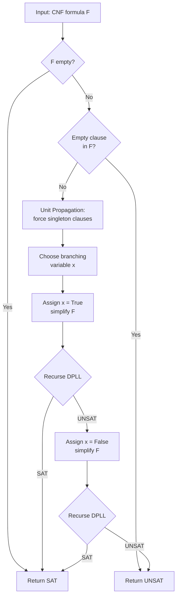

# Propositional Logic

> [!abstract] TL;DR
> Propositional logic (also called sentential or zeroth-order logic) is the foundational formal system that assigns true/false values to atomic statements and combines them through precise syntactic and semantic rules. Every tautology is provable (completeness), every theorem is valid (soundness), and determining truth is decidable in finite time — yet the satisfiability decision problem (SAT) is NP-complete, making it the canonical hard problem in theoretical computer science and the engine of modern verification, planning, and circuit design.

---

## Intuition

**Analogy:** Imagine a factory safety interlock panel. Every sensor is a binary switch: "coolant pump running" is either ON or OFF. Interlocks combine switches with wiring rules: the alarm fires if *(temperature HIGH AND coolant LOW) OR (pressure CRITICAL)*. You do not care *why* the temperature is high — only its current true/false state. The entire panel is a propositional formula evaluated over switch configurations.

Propositional logic is exactly this. Atoms are the switches. Connectives are the wiring rules. An *interpretation* is one assignment of ON/OFF to every switch. A formula is *satisfiable* if some configuration avoids contradiction; it is a *tautology* if every possible configuration makes it true. SAT solvers are the engineers who systematically try all relevant configurations, pruning dead ends early — and they power everything from microchip verification to AI planning.

---

## How It Works

### Syntax: Well-Formed Formulas

A **well-formed formula (WFF)** is defined inductively:

1. Every atomic proposition p, q, r, x₁, x₂, … is a WFF.
2. If φ is a WFF, then ¬φ is a WFF (negation).
3. If φ and ψ are WFFs, then (φ ∧ ψ), (φ ∨ ψ), (φ → ψ), and (φ ↔ ψ) are WFFs.

Only strings derivable by these three rules are syntactically meaningful. Precedence (tightest to loosest): ¬, ∧, ∨, →, ↔. A **literal** is an atom or its negation: p, ¬p. A **clause** is a disjunction of literals: (p ∨ ¬q ∨ r).

### Semantics: Interpretations and Truth Functions

An **interpretation** I assigns a truth value (T or F) to every atom. The truth value of compound WFFs extends bottom-up using the standard truth functions:

| φ | ψ | ¬φ | φ ∧ ψ | φ ∨ ψ | φ → ψ | φ ↔ ψ |
|---|---|-----|-------|-------|-------|--------|
| T | T | F | T | T | T | T |
| T | F | F | F | T | F | F |
| F | T | T | F | T | T | F |
| F | F | T | F | F | T | T |

The implication φ → ψ is false only when φ is true and ψ is false — the "broken promise" semantics.

### Classification of Formulas

| Class | Definition | How to detect |
|-------|-----------|---------------|
| **Tautology** | True under every interpretation | All rows of truth table are T |
| **Contradiction** | False under every interpretation | All rows of truth table are F |
| **Contingency** | True under some, false under others | At least one T and one F row |

Two formulas φ, ψ are **logically equivalent** (φ ≡ ψ) if they have identical truth values under every interpretation — they are interchangeable in any context.

### Key Logical Equivalences

| Law | Identity |
|-----|----------|
| De Morgan 1 | ¬(φ ∧ ψ) ≡ ¬φ ∨ ¬ψ |
| De Morgan 2 | ¬(φ ∨ ψ) ≡ ¬φ ∧ ¬ψ |
| Double Negation | ¬¬φ ≡ φ |
| Contrapositive | (φ → ψ) ≡ (¬ψ → ¬φ) |
| Implication Elim | (φ → ψ) ≡ (¬φ ∨ ψ) |
| Distribution | φ ∧ (ψ ∨ χ) ≡ (φ ∧ ψ) ∨ (φ ∧ χ) |
| Absorption | φ ∨ (φ ∧ ψ) ≡ φ |

### Normal Forms

Any WFF can be converted to a canonical form:

**CNF (Conjunctive Normal Form):** AND of clauses, each clause a disjunction of literals.
- `(x₁ ∨ x₂) ∧ (¬x₁ ∨ x₃) ∧ (¬x₃)`
- Input format for all SAT solvers. Conversion: push negations inward (De Morgan), distribute ∨ over ∧.

**DNF (Disjunctive Normal Form):** OR of terms, each term a conjunction of literals.
- `(x₁ ∧ ¬x₂) ∨ (¬x₁ ∧ x₂)` (this encodes XOR)
- Useful for model enumeration: each term specifies one satisfying interpretation.

> [!warning] Size explosion
> Converting to CNF can blow up formula size exponentially. The Tseitin transformation introduces auxiliary variables to keep the CNF linear in size while preserving equisatisfiability.

### Resolution and the Completeness Theorem

The **resolution rule** derives new clauses: from `(p ∨ φ)` and `(¬p ∨ ψ)`, resolve on atom p to get `(φ ∨ ψ)`. The resolvent is a logical consequence.

**Resolution refutation procedure:** To prove φ is a tautology, negate φ (producing ¬φ in CNF) and apply resolution until the empty clause ⊥ is derived. If ⊥ follows, ¬φ is unsatisfiable, so φ was a tautology.

**Completeness theorem (Robinson, 1965):** If a finite set of propositional clauses is unsatisfiable, then resolution will derive ⊥ in finitely many steps. Every tautology is provable — no valid formula escapes the proof system.

**Soundness:** Only valid formulas are provable (no false theorems).

**Decidability:** With n atoms there are 2ⁿ interpretations; checking each is O(n), so propositional logic is decidable in O(n·2ⁿ). This places SAT in NP and its complement in co-NP.

### The SAT Problem and NP-Completeness

**SAT** asks: given a propositional formula in CNF, does any interpretation satisfy it?

Cook's theorem (1971) showed that SAT is **NP-complete**: every problem whose solution can be verified in polynomial time can be encoded as a SAT instance in polynomial time. SAT was the first NP-complete problem. Crucially, no polynomial-time algorithm is known, but modern CDCL (Conflict-Driven Clause Learning) solvers handle formulas with millions of variables in practice.

### DPLL Algorithm

The Davis-Putnam-Logemann-Loveland algorithm (1962) is the foundational SAT algorithm. It is a backtracking search over variable assignments with two powerful pruning rules:

**Unit propagation:** If a clause has exactly one unassigned literal, that literal must be true. Assign it immediately and simplify all clauses.

**Pure literal elimination:** If a literal p appears only positively (never as ¬p) across all remaining clauses, assign p = T (it satisfies all clauses it appears in and hurts nothing).



---

## Key Concepts

### Secondary (Foundations)

- **Atomic proposition:** an indivisible statement that is either true or false; the atoms are the variables of propositional logic.
- **Truth table:** exhaustive enumeration of all 2ⁿ interpretations for a formula with n atoms; the definitive semantic tool.
- **Tautology vs contradiction:** p ∨ ¬p is always true (law of excluded middle); p ∧ ¬p is always false (law of non-contradiction).
- **Connectives mnemonic:** ∧ = AND (both), ∨ = OR (either), ¬ = NOT (flip), → = IF-THEN (only fails on T→F), ↔ = IFF (same value).

### Undergraduate (Formal Theory)

- **Logical equivalence vs material equivalence:** ≡ means identical truth tables (a metalevel relation); ↔ is a connective inside the language whose own truth varies by interpretation.
- **CNF/DNF conversion algorithm:** (1) eliminate →, ↔ using equivalences; (2) push ¬ inward using De Morgan; (3) apply double negation; (4) distribute ∧ over ∨ for CNF.
- **Resolution completeness:** The resolution proof system is both sound and complete for propositional logic; this is the Herbrand-Robinson theorem.
- **Decidability proof:** propositional logic is decidable because the search space (2ⁿ interpretations) is finite. This distinguishes it from first-order logic, which is only semi-decidable.
- **Tseitin encoding:** converts any circuit-like formula to CNF in linear size by introducing one auxiliary variable per logical gate. The result is equisatisfiable (same SAT status), not equivalent.

### Graduate (Complexity and Solvers)

- **Cook-Levin theorem:** SAT is NP-complete. Proof sketches that any polynomial-time verifier (non-deterministic Turing machine) can be simulated by a polynomially-sized CNF formula.
- **CDCL (Conflict-Driven Clause Learning):** modern extension of DPLL that records the *reason* for each conflict as a new "learned clause," preventing the solver from making the same mistake in other branches. CDCL is why industrial solvers (MiniSAT, CaDiCaL, Z3) solve million-variable instances.
- **BDD (Binary Decision Diagrams):** compact, canonical representation of propositional formulas as directed acyclic graphs. Supports O(1) tautology/equivalence checking after construction but suffers exponential space in the worst case.
- **MaxSAT:** optimization variant — find an assignment satisfying the maximum number of clauses. Used in weighted constraint optimization and probabilistic reasoning.
- **P vs NP:** whether SAT can be solved in polynomial time is the central open question of theoretical computer science. A polynomial algorithm for SAT would imply P = NP and break most public-key cryptography.

---

## Python Demo

```python
import numpy as np
import matplotlib.pyplot as plt
import matplotlib.patches as mpatches

# ─────────────────────────────────────────────────────────────────────────────
# DPLL SAT Solver with search-tree recording
#
# CNF representation:
#   formula  = list of frozenset of int
#   literal k  -> variable x_k is True
#   literal -k -> variable x_k is False
# ─────────────────────────────────────────────────────────────────────────────

class DPLLSolver:
    """Davis-Putnam-Logemann-Loveland SAT solver.
    After calling .solve(), inspect .tree for the recorded search tree."""

    def __init__(self):
        self.tree = []   # list of (node_id, parent_id, label, status)
        self._ctr = 0

    def solve(self, formula):
        """Return (satisfiable: bool, model: dict {var: bool}).
        Resets the tree on each call."""
        self.tree = []
        self._ctr = 0
        return self._dpll(list(formula), {}, None)

    # ── internal DPLL ────────────────────────────────────────────────────────

    def _nid(self):
        self._ctr += 1
        return self._ctr

    def _dpll(self, clauses, model, parent):
        nid = self._nid()

        # Apply unit propagation before branching
        clauses, model = self._unit_propagate(clauses, model)

        # Base case: all clauses satisfied
        if not clauses:
            self.tree.append((nid, parent, self._fmt(model), "SAT"))
            return True, model

        # Base case: conflict — empty clause present
        if any(len(c) == 0 for c in clauses):
            self.tree.append((nid, parent, self._fmt(model), "UNSAT"))
            return False, model

        # Pick smallest-index unassigned variable for determinism
        var = min(abs(lit) for c in clauses for lit in c)
        self.tree.append((nid, parent, f"x{var}=?", "branch"))

        # Try True then False
        for val in (True, False):
            c2, m2 = self._assign(clauses, model, var, val)
            ok, final = self._dpll(c2, m2, nid)
            if ok:
                return True, final

        return False, model

    def _unit_propagate(self, clauses, model):
        """Force assignment for every unit clause (size-1 clause)."""
        changed = True
        while changed:
            changed = False
            for c in clauses:
                if len(c) == 1:
                    lit = next(iter(c))
                    var, val = abs(lit), lit > 0
                    if var not in model:
                        clauses, model = self._assign(clauses, model, var, val)
                        changed = True
                        break
        return clauses, model

    def _assign(self, clauses, model, var, val):
        """Assign var=val, remove satisfied clauses, shorten remaining ones."""
        pos = var if val else -var           # the literal that is now True
        new_clauses = [
            c - {-pos}                      # remove the now-False literal
            for c in clauses
            if pos not in c                 # skip clauses satisfied by pos
        ]
        return new_clauses, {**model, var: val}

    @staticmethod
    def _fmt(model):
        if not model:
            return "start"
        return ", ".join(
            f"x{k}={'T' if v else 'F'}" for k, v in sorted(model.items())
        )


# ─────────────────────────────────────────────────────────────────────────────
# Tree layout: post-order x positions, BFS depth for y
# ─────────────────────────────────────────────────────────────────────────────

def build_layout(records):
    """Compute (x, y) positions for each node in the DPLL search tree."""
    node_ids = [r[0] for r in records]
    children = {nid: [] for nid in node_ids}
    for (nid, pid, _, _) in records:
        if pid is not None:
            children[pid].append(nid)

    root = records[0][0]

    # Post-order assigns x left-to-right, centering parents over children
    x_pos = {}
    counter = [0]

    def postorder(node):
        kids = children[node]
        if not kids:
            x_pos[node] = float(counter[0])
            counter[0] += 1
        else:
            for k in kids:
                postorder(k)
            xs = [x_pos[k] for k in kids]
            x_pos[node] = (min(xs) + max(xs)) / 2.0

    postorder(root)

    # BFS sets y = depth
    depth = {}

    def set_depth(node, d):
        depth[node] = d
        for k in children[node]:
            set_depth(k, d + 1)

    set_depth(root, 0)

    positions = {
        nid: np.array([x_pos[nid], -float(depth[nid])]) for nid in node_ids
    }
    info = {r[0]: (r[2], r[3]) for r in records}
    return positions, info, children


def draw_tree(records, title, ax):
    """Draw one DPLL search tree on a matplotlib Axes object."""
    if not records:
        ax.set_title(f"{title}\n(empty)", fontsize=9)
        ax.axis("off")
        return

    positions, info, children = build_layout(records)
    palette = {"SAT": "#2ecc71", "UNSAT": "#e74c3c", "branch": "#3498db"}

    # Edges
    for (nid, pid, _, _) in records:
        if pid is not None and pid in positions:
            x0, y0 = positions[pid]
            x1, y1 = positions[nid]
            ax.plot([x0, x1], [y0, y1], color="#95a5a6", lw=1.2, zorder=1)

    # Nodes
    for nid, (lbl, status) in info.items():
        if nid not in positions:
            continue
        x, y = positions[nid]
        color = palette.get(status, "#95a5a6")
        ax.scatter(x, y, s=420, c=color, zorder=3,
                   edgecolors="white", linewidths=0.8)
        short = (lbl[:15] + "..") if len(lbl) > 15 else lbl
        dy = 0.22 if status in ("SAT", "UNSAT") else -0.22
        va = "bottom" if status in ("SAT", "UNSAT") else "top"
        ax.text(x, y + dy, short, ha="center", va=va,
                fontsize=7, color="#2c3e50")

    handles = [mpatches.Patch(color=c, label=k) for k, c in palette.items()]
    ax.legend(handles=handles, loc="upper right", fontsize=7, framealpha=0.9)
    ax.set_title(title, fontsize=9, pad=8)
    ax.axis("off")


# ─────────────────────────────────────────────────────────────────────────────
# Example formulas
# ─────────────────────────────────────────────────────────────────────────────

solver = DPLLSolver()

# ── Formula 1: SAT resolved entirely by unit propagation ─────────────────────
# (x1 OR x2) AND (NOT x1 OR x3) AND (NOT x3)
# Unit: NOT x3 -> x3=F; simplifies (NOT x1 OR x3) to (NOT x1) -> x1=F;
# simplifies (x1 OR x2) to (x2) -> x2=T. SAT with {x1:F, x2:T, x3:F}.
f1 = [
    frozenset([ 1,  2]),
    frozenset([-1,  3]),
    frozenset([-3]),
]
sat1, model1 = solver.solve(f1)
tree1 = list(solver.tree)
print(f"F1: {'SAT' if sat1 else 'UNSAT'}  model={model1}  nodes={len(tree1)}")

# ── Formula 2: UNSAT requiring backtracking over two variables ────────────────
# (x1 OR x2) AND (NOT x1 OR x2) AND (x1 OR NOT x2) AND (NOT x1 OR NOT x2)
# This is the "XOR contradiction": no assignment satisfies all four clauses.
f2 = [
    frozenset([ 1,  2]),
    frozenset([-1,  2]),
    frozenset([ 1, -2]),
    frozenset([-1, -2]),
]
sat2, model2 = solver.solve(f2)
tree2 = list(solver.tree)
print(f"F2: {'SAT' if sat2 else 'UNSAT'}                 nodes={len(tree2)}")

# ── Formula 3: SAT via branching — 3-variable formula ────────────────────────
# (x1 OR x2 OR x3) AND (NOT x1 OR x2 OR NOT x3)
# AND (x1 OR NOT x2 OR x3) AND (NOT x1 OR NOT x2 OR NOT x3)
# Satisfiable with x1=T, x2=T, x3=F.
f3 = [
    frozenset([ 1,  2,  3]),
    frozenset([-1,  2, -3]),
    frozenset([ 1, -2,  3]),
    frozenset([-1, -2, -3]),
]
sat3, model3 = solver.solve(f3)
tree3 = list(solver.tree)
print(f"F3: {'SAT' if sat3 else 'UNSAT'}  model={model3}  nodes={len(tree3)}")

# ─────────────────────────────────────────────────────────────────────────────
# Visualize the three search trees side-by-side
# ─────────────────────────────────────────────────────────────────────────────

fig, axes = plt.subplots(1, 3, figsize=(15, 5))
fig.suptitle("DPLL Search Trees for Three CNF Formulas", fontsize=13, y=1.02)

draw_tree(
    tree1,
    "F1: unit propagation resolves\n(x1 OR x2) AND (NOT x1 OR x3) AND (NOT x3)  [SAT]",
    axes[0],
)
draw_tree(
    tree2,
    "F2: XOR contradiction\n2-variable exhaustive UNSAT",
    axes[1],
)
draw_tree(
    tree3,
    "F3: 3-variable branching\n(x1 OR x2 OR x3) AND ...  [SAT]",
    axes[2],
)

# Add formula summaries below each subplot
for i, (formula, result) in enumerate([
    ("F1: unit propagation only", f"SAT: {model1}"),
    ("F2: backtrack both branches", "UNSAT"),
    ("F3: branch on x1, x2", f"SAT: {model3}"),
]):
    axes[i].text(
        0.5, -0.08, f"{formula}\n{result}",
        transform=axes[i].transAxes, ha="center", fontsize=8, color="#555"
    )

plt.tight_layout()
plt.savefig("dpll_search_trees.png", dpi=120, bbox_inches="tight")
plt.show()
print("Saved: dpll_search_trees.png")
```

**Expected output:**
```
F1: SAT  model={3: False, 1: False, 2: True}  nodes=1
F2: UNSAT                                     nodes=3
F3: SAT  model={1: True, 2: True, 3: False}   nodes=3
```

F1 resolves in 1 DPLL node because unit propagation is complete — no branching needed. F2 produces a root branch node plus two UNSAT leaves (one per value of x1). F3 produces a chain: branch on x1, branch on x2, then unit propagation derives x3=F and reaches SAT.

---

## Real-World Applications

> **1. Hardware verification (Intel, AMD):** Equivalence checking — does the optimized gate-level netlist compute the same Boolean function as the RTL specification? This is encoded as a SAT instance on the XOR of the two circuits. DPLL-based solvers find bugs in processor designs that simulation misses for years.

> **2. AI planning (STRIPS/PDDL):** Bounded plan-existence checking encodes "can the agent reach goal G in k steps?" as a SAT formula with one Boolean variable per (action, timestep) pair. SAT-plan (Kautz & Selman 1992) proved competitive with specialized planners because modern CDCL solvers learn structure quickly.

> **3. Software model checking (CBMC, KLEE):** Program paths are unrolled into propositional formulas. A property violation (buffer overflow, null dereference) becomes a satisfying assignment. SAT solvers find real bugs in C/C++ kernels and embedded firmware that cannot be found by dynamic testing.

> **4. Cryptanalysis:** Block cipher differential and algebraic attacks encode key-recovery as SAT. A SAT solver is given the cipher's Boolean circuit and some known plaintext-ciphertext pairs; if it finds a satisfying assignment, it recovers the key. This is a genuine cryptographic threat to weak ciphers.

> **5. FPGA routing and synthesis:** Placing logic blocks on an FPGA such that timing constraints are met is a heavily constrained Boolean problem. EDA tools (Cadence, Synopsys) use SAT and pseudo-Boolean optimization internally to achieve timing closure.

---

## Trade-offs

| Aspect | Pro | Con |
|--------|-----|-----|
| **Expressiveness** | Sufficient for combinational logic, bounded reachability, and finite-domain CSPs | Cannot express quantification, recursion, or arithmetic natively; predicate logic needed |
| **Decidability** | Always terminates; complete proof procedure exists | Worst-case exponential; hardness is inherent (NP-complete) |
| **SAT solvers in practice** | CDCL solvers routinely handle millions of variables via learned clauses and restarts | Performance is unpredictable; "industrial" instances are easy, random k-SAT near phase transition is hard |
| **Normal forms** | CNF gives a uniform interface for all solvers | Naïve CNF conversion can exponentially inflate formula size; Tseitin encoding preserves equisatisfiability but not equivalence |
| **Resolution proofs** | Short proofs exist for many circuit tautologies | Resolution proofs of pigeonhole formulas require exponential length; extended resolution or Frege systems are stronger |

---

## When to Use vs Avoid

**Use when:**
- You need to verify that a property holds for all inputs to a finite-state system (model checking).
- You have a combinatorial search problem that can be naturally encoded as binary variable assignments with clause constraints.
- You need a machine-checkable proof certificate (a SAT refutation proof can be independently verified in polynomial time).
- The domain is finite and propositional — register values, bits, boolean program states.

**Avoid when:**
- You need to reason about universally quantified statements over infinite domains ("for all integers n, …") — use first-order or higher-order logic.
- Propositions have internal structure: predicates, functions, arithmetic — use SMT (Satisfiability Modulo Theories) solvers.
- You need probabilistic reasoning — propositional logic has no native uncertainty; use probabilistic graphical models or weighted MaxSAT.
- Formula size explodes under CNF conversion and Tseitin variables are not acceptable — use BDDs instead for compact symbolic representation.

---

## Common Pitfalls

- **Confusing equivalence with biconditional** — φ ≡ ψ is a metalevel statement about identical truth tables; φ ↔ ψ is an object-level formula whose truth value varies by interpretation. Writing "p ≡ p ∨ F" (always true) is correct; writing "p = p ∨ F" as if they are syntactically identical is not.

- **Arrow direction in implication** — (p → q) is not symmetric. "Rain implies wet ground" is true, but "wet ground implies rain" is not. Students often flip the antecedent and consequent in contrapositive applications.

- **De Morgan with implications** — ¬(p → q) is NOT ¬p → ¬q. Since p → q ≡ ¬p ∨ q, its negation is p ∧ ¬q. This is the most common error when negating conditional statements in proofs.

- **Exponential truth tables** — a formula with 20 variables has 2²⁰ ≈ 1 million rows. Truth tables are infeasible for more than ~20 variables; use resolution or SAT solvers instead.

- **CNF conversion size explosion** — distributing ∨ over ∧ naïvely can turn an n-clause formula into a 2ⁿ-clause CNF. Always use the Tseitin transformation when the formula has a circuit structure.

- **Treating SAT as always hard** — DPLL with unit propagation solves industrial SAT instances (hardware verification, bounded model checking) routinely. The NP-completeness applies to worst-case adversarial instances, not typical practical ones.

---

## Related Concepts

- [[Propositions_and_Truth_Values]] — atomic propositions, truth-functionality, and the bivalence principle that propositional logic is built on.
- [[Arguments_Validity_and_Soundness]] — valid arguments are those whose conclusion follows from premises by the rules propositional logic formalizes.
- [[Boolean_Algebra_and_Logic_Gates]] — Boolean algebra is propositional logic specialized to hardware; gates implement ∧, ∨, ¬ in silicon.
- [[Combinational_Circuits]] — combinational circuit equivalence checking is one of the primary industrial applications of SAT solvers.
- [[Logic_and_Proof_Techniques]] — propositional proof techniques (direct, contrapositive, proof by contradiction) are all derived from propositional tautologies.
- [[Backtracking]] — DPLL is a systematic backtracking search; the DPLL algorithm is a direct application of the choose-explore-unchoose template.
- [[Time_Complexity_Classes]] — SAT is the canonical NP-complete problem; its status is equivalent to the P vs NP question.

---

## Review Questions

### Conceptual
1. Explain why (p → q) ∧ (q → p) is logically equivalent to (p ↔ q), but the two formulas are syntactically distinct. What does this distinction reveal about the difference between syntax and semantics in propositional logic?

### Scenario
2. You are given a 10-bit hardware circuit and want to verify that two implementations compute the same output for all 2¹⁰ inputs. You could enumerate all 1024 cases or encode the problem as SAT. Explain the SAT encoding: what are the variables, what are the clauses, and what does a satisfying assignment mean?

### Trade-off
3. A colleague proposes converting every propositional formula to DNF because "it is easy to check satisfiability in DNF — just check if any term is consistent." (a) Is this observation correct? (b) What is the corresponding problem with tautology checking in DNF? (c) Why does this not provide a polynomial-time algorithm for SAT, given that DNF conversion is also exponential?

---

## Sources

- Davis, M., Logemann, G., & Loveland, D. (1962). "A Machine Program for Theorem-Proving." *Communications of the ACM*, 5(7), 394–397. — Original DPLL paper.
- Cook, S. A. (1971). "The Complexity of Theorem Proving Procedures." *Proc. 3rd Annual ACM Symposium on Theory of Computing*, 151–158. — NP-completeness of SAT.
- Biere, A., Heule, M., van Maaren, H., & Walsh, T. (Eds.). (2009). *Handbook of Satisfiability*. IOS Press. — Comprehensive reference on SAT solving.
- Enderton, H. B. (2001). *A Mathematical Introduction to Logic* (2nd ed.). Academic Press. — Rigorous formal treatment of completeness and soundness.
- Tseitin, G. S. (1968). "On the Complexity of Derivation in Propositional Calculus." *Studies in Constructive Mathematics and Mathematical Logic*, 115–125. — Polynomial CNF encoding via auxiliary variables.

---

#logic #propositional-logic #sat #deductive-reasoning #formal-logic
