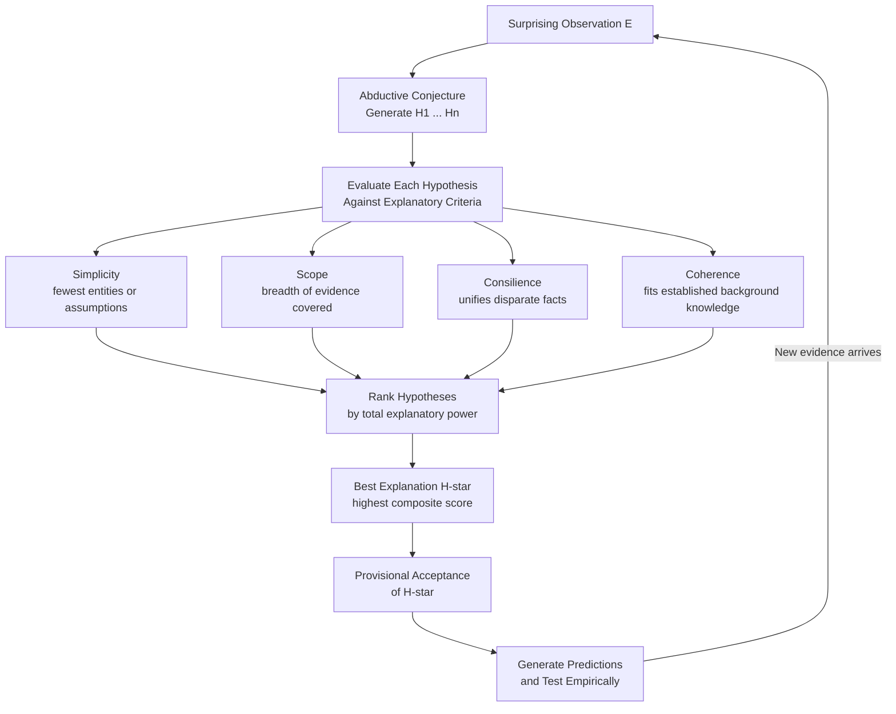

# Abductive Reasoning and Inference to the Best Explanation

> [!abstract] TL;DR
> Abductive reasoning is the inference from a surprising observation to the hypothesis that would best explain it — it is how doctors diagnose, scientists discover, and detectives solve cases. Gilbert Harman's 1965 formulation as Inference to the Best Explanation (IBE) makes the selection explicit: given competing hypotheses, infer the one that would, if true, explain the evidence most fully by scoring highest on criteria such as simplicity, scope, consilience, and coherence. Unlike deduction, the conclusion is not guaranteed; unlike simple induction, it is not a generalization from instances but a reasoned jump to the underlying cause.

---

## Intuition

**Analogy:** A doctor walks into an examination room and sees a patient with a high fever, swollen lymph nodes, and a stiff neck. She does not run every possible test for every known disease. Instead, she thinks: "What single condition would, if present, best explain all three symptoms together?" Meningitis fits. It predicts fever, lymph-node swelling, and neck stiffness simultaneously; the leading alternative — flu plus an unrelated muscle strain — requires two separate causes where one will do. The doctor infers meningitis before lab results arrive, not with certainty, but as the best available explanation, and orders a lumbar puncture.

This is abduction in its purest form: reasoning backward from observed effect to inferred cause, choosing the explanation that does the most explanatory work with the fewest assumptions. Every scientist proposing a new theory, every engineer diagnosing a production outage, every detective naming a suspect is doing exactly this.

---

## How It Works

### Core Mechanics

Charles Sanders Peirce identified three fundamental forms of inference, each answering a different question:

| Form | Schema | Direction | Guarantee |
|------|--------|-----------|-----------|
| Deduction | Rule + Case → Result | Top-down, certain | Truth-preserving |
| Induction | Case + Result → Rule | Bottom-up, generalizing | Probabilistic |
| Abduction | Rule + Result → Case | Hypothesis-generating | Provisional only |

Peirce's abductive schema: *"The surprising fact C is observed. But if H were true, C would be a matter of course. Therefore, there is reason to suspect that H is true."*

**Harman's IBE formulation (1965):** Given evidence E and competing hypotheses {H1, H2, ..., Hn}, infer the hypothesis Hi that would, if true, provide the *best explanation* of E. The inference does not merely note which hypothesis is consistent with E — it selects the one that explains E most fully.

**Criteria for "best" explanation:**

1. **Simplicity / Parsimony** — prefer hypotheses that postulate fewer entities, forces, or mechanisms. Einstein's field equations are preferred over Ptolemaic epicycles because they require no ad hoc patching; each added epicycle explains nothing new, it merely fits the data.
2. **Scope** — prefer hypotheses that explain a wider range of phenomena. Darwin's natural selection explains species diversity, vestigial structures, biogeographic patterns, and the fossil record; a hypothesis covering only one of these has narrower scope and is thus inferior.
3. **Consilience** — prefer hypotheses that unify evidence from independent domains (William Whewell's term). Newton's inverse-square gravity explained both terrestrial falling bodies and planetary orbits — two entirely separate evidence streams converging on one hypothesis.
4. **Coherence** — prefer hypotheses that cohere with well-established background knowledge rather than requiring wholesale revision of accepted science.
5. **Analogy** — prefer hypotheses that fit the structural pattern of well-confirmed theories in closely related domains; novel mechanisms that lack analogical support carry a higher burden of proof.

**Van Fraassen's Bad Lot Objection (1989):** Even if H is the best among the hypotheses *we have considered*, this gives no reason to believe H is likely true. The considered hypotheses are simply the ones we happened to think of — the best of a bad lot is still bad. IBE cannot bootstrap the quality of inference beyond the quality of the hypothesis space.

**Lipton's Response — Lovely vs. Likely (2004):** Peter Lipton distinguishes:
- The *loveliest* explanation: the one that would, if true, give the most explanatory satisfaction.
- The *likeliest* explanation: the one with the highest probability of being true.

Lipton argues IBE works because the criteria for loveliness (simplicity, scope, consilience) are also reliable indicators of likelihood — a hypothesis that explains more with less is not merely satisfying, it is more likely to have latched onto real causal structure. The lovely tends to track the likely through pragmatic and evolutionary constraints on what constitutes a good explanation.

**IBE vs. hypothetico-deductivism:** In the hypothetico-deductive model, you deduce observational consequences from a hypothesis and then test them against data. In IBE, you reason in the other direction: you start from observed data and directly infer the hypothesis that best explains it. H-D is a method for *testing* hypotheses after they exist; IBE is a method for *selecting* among competing hypotheses at any point in inquiry.

### Flow / Architecture



---

## Key Concepts

### Secondary

- **Abduction defined** — reasoning from an observation to the hypothesis that would best explain it. The conclusion is not deductively guaranteed and not a mere statistical generalization; it is a reasoned leap to a probable underlying cause.
- **The detective pattern** — Sherlock Holmes says "You have been in Afghanistan, I perceive." He has not enumerated all possible places Watson could have been; he has inferred the single hypothesis that best explains the tan line, military posture, arm injury, and bearing in combination. This is abduction, not deduction, despite Holmes's confident phrasing.
- **IBE as selection** — IBE does not generate hypotheses (that is the earlier creative step); it selects the winner from an already-generated set by asking which one explains the evidence most completely. The quality of the conclusion is bounded by the quality of the input hypothesis set.
- **Provisional acceptance** — abductive conclusions always carry a revocability flag. When better hypotheses arrive or new evidence surfaces, the current best explanation must yield. This is precisely what allows science to progress.

### Undergraduate

- **Peirce's three inference forms** — deduction applies a rule to a case to derive a result (certain); induction generalizes a rule from cases and results (probabilistic); abduction infers the case from a rule and a result (hypothesis-generating). Each answers a different question and has different epistemic properties.
- **IBE criteria in practice** — simplicity and scope can conflict: a simpler hypothesis may cover fewer phenomena. Consilience is often the strongest tie-breaker because it draws on independent evidence streams that could not have been engineered to cohere by the hypothesis itself. Applying the criteria requires judgment, not algorithm.
- **The bad lot objection** — van Fraassen's challenge: IBE can only rank the hypotheses in the set it is given. If the true explanation was never generated, IBE will confidently pick the wrong answer. This objection motivates treating hypothesis generation as a crucial prior step and maintaining genuine openness to radically different candidate explanations.
- **Lovely vs. likely** — Lipton's defense: the same features that make an explanation intellectually satisfying (it unifies, it simplifies, it coheres) are the features that track causal structure in the world. This is not a coincidence — it reflects the fact that the world has causal structure, and our explanatory virtues evolved to track it.
- **Semmelweis as case study** — Ignaz Semmelweis observed in the 1840s that childbed fever mortality was three times higher in the doctor-attended ward than in the midwife ward. He systematically eliminated competing hypotheses (crowding, delivery position, religious practices) and abductively inferred that doctors were transmitting "cadaverous particles" from the autopsy room to laboring patients. His hand-washing intervention worked — years before germ theory provided the confirming mechanism.
- **IBE vs. enumerative induction** — enumerative induction says: all F so far are G, therefore probably all F are G. IBE says: the best explanation of why I have observed G in every F case is that there is a causal connection between being F and being G. IBE thus explains *why* inductive generalizations hold, rather than merely asserting that they do.

### Graduate

- **IBE and Bayesian inference** — Bayesian posterior P(H|E) is proportional to P(E|H) times P(H). IBE can be understood as qualitative MAP estimation: the hypothesis maximizing the posterior is the one that balances prior plausibility with how well it predicts the evidence. IBE's criteria of simplicity and scope function as implicit priors and likelihood factors respectively. The advantage of IBE over explicit Bayesian computation is tractability in hypothesis-rich domains where numerical priors are unavailable or arbitrary; the disadvantage is loss of formal calibration.
- **Formal measures of explanatory power** — Schupbach and Sprenger (2011) propose a Bayesian measure: E(H, e) = [P(e|H) - P(e|not-H)] / [P(e|H) + P(e|not-H)]. This ranges from -1 (H makes e less likely) to 1 (H makes e much more likely than its negation) and formalizes the intuition that explanatory power is about the difference H makes to the probability of the evidence.
- **Underdetermination and IBE** — any finite body of evidence is logically compatible with infinitely many hypotheses. IBE applies explanatory criteria as a selection filter, but this filter does not have a truth-guarantee. The deeper philosophical worry is whether the criteria are truth-conducive at all, or merely pragmatically useful. Realists argue that the empirical success of science vindicates the truth-conduciveness of IBE criteria; anti-realists (van Fraassen) argue that empirical success only validates predictive accuracy, not truth about unobservables.
- **Abductive Logic Programming** — in AI, ALP extends logic programming with an abduction operator. Given a background theory T and observation O, find a minimal set of assumptions A such that T plus A entails O. This formalizes IBE computationally: the "best" explanation is the minimal set of assumptions that makes the observation a logical consequence of background knowledge. Systems like INTERNIST-1 and QMR-DT applied this framework to medical diagnosis.
- **Best Systems Analysis** — Lewis's account of natural laws as the axioms of the system that best balances simplicity and strength in summarizing all cosmic facts is IBE applied at the metaphysical level. The same explanatory virtues that guide scientific hypothesis selection are here projected onto the structure of reality itself, raising the question of whether IBE is an epistemic heuristic or a metaphysical principle.

---

## Python Demo

```python
# IBE Scorer: rank competing hypotheses by Bayesian posterior score
# Scenario: patient presents with fever, fatigue, and severe sore throat
# We compute P(H|E) proportional to P(E|H) * P(H) and rank as IBE would

import numpy as np
import matplotlib.pyplot as plt

hypotheses = [
    "Common Cold",
    "Influenza",
    "Strep Throat",
    "COVID-19",
    "Mononucleosis",
]

# P(H): prior probability of each condition in the presenting population
priors = np.array([0.40, 0.25, 0.15, 0.12, 0.08])

# P(E|H): likelihood that ALL observed evidence arises given each hypothesis
# Strep scores high because it strongly predicts fever + sore throat + fatigue together
likelihoods = np.array([0.28, 0.72, 0.88, 0.61, 0.55])

# Unnormalized posterior score proportional to P(H|E)
scores = likelihoods * priors

# Normalize to proper posterior probabilities summing to 1
posteriors = scores / scores.sum()

# Sort ascending so the chart reads best-at-top
sorted_idx = np.argsort(posteriors)
ranked_hyps = [hypotheses[i] for i in sorted_idx]
ranked_post = posteriors[sorted_idx]

# Green for the best explanation; blue for the rest
colors = [
    "#2ecc71" if i == len(ranked_hyps) - 1 else "#5dade2"
    for i in range(len(ranked_hyps))
]

fig, ax = plt.subplots(figsize=(10, 5))
bars = ax.barh(ranked_hyps, ranked_post, color=colors, edgecolor="white", height=0.6)

for bar, val in zip(bars, ranked_post):
    ax.text(
        bar.get_width() + 0.005,
        bar.get_y() + bar.get_height() / 2,
        f"{val:.3f}",
        va="center",
        fontsize=10,
        fontweight="bold" if val == ranked_post.max() else "normal",
    )

ax.set_xlabel("Posterior Probability  P(H | E)", fontsize=11)
ax.set_title(
    "Inference to the Best Explanation\n"
    "Evidence: fever + fatigue + severe sore throat",
    fontsize=12,
    fontweight="bold",
)
ax.set_xlim(0, ranked_post.max() * 1.3)
ax.axvline(
    x=1.0 / len(hypotheses),
    color="gray",
    linestyle="--",
    linewidth=1,
    label="Uniform baseline (no evidence)",
)
ax.legend(fontsize=9)
ax.spines["top"].set_visible(False)
ax.spines["right"].set_visible(False)

plt.tight_layout()
plt.show()

# Print ranked IBE output
print("IBE Ranking (Best Explanation first):")
for rank, (hyp, post) in enumerate(zip(ranked_hyps[::-1], ranked_post[::-1]), 1):
    orig_idx = hypotheses.index(hyp)
    tag = "  <-- BEST EXPLANATION H*" if rank == 1 else ""
    print(
        f"  {rank}. {hyp:<22s}"
        f"  prior={priors[orig_idx]:.2f}"
        f"  likelihood={likelihoods[orig_idx]:.2f}"
        f"  posterior={post:.4f}{tag}"
    )
```

The chart highlights Strep Throat in green as the IBE winner: its high likelihood of predicting the complete symptom pattern overcomes its lower prior, producing the highest posterior. Common Cold has the highest prior but its likelihood of producing *all three* symptoms together is low — IBE penalizes hypotheses that leave part of the evidence unexplained.

---

## Real-World Applications

1. **Medical diagnosis — INTERNIST-1 and QMR-DT** — the INTERNIST-1 expert system built at Pittsburgh in the 1970s operationalized IBE computationally: given a set of patient findings, it ranked disease hypotheses by how many findings they accounted for minus a parsimony penalty for invoking multiple diseases. Its successor, QMR-DT, added Bayesian posterior scoring. Both systems were early demonstrations that IBE is mechanizable, not merely a philosopher's abstraction.

2. **Scientific discovery — Darwin's consilience** — Darwin's argument in *On the Origin of Species* is paradigmatically abductive. He did not observe evolution; he inferred natural selection as the hypothesis that achieved the greatest consilience: it simultaneously explained the fossil record, the geographic distribution of species, homologous anatomical structures, vestigial organs, and the patterns of domestic breeding. No competing hypothesis explained all five evidence streams. The scope and consilience of natural selection were the evidential basis for the inference, decades before genetics provided a mechanism.

3. **Site reliability engineering — fault diagnosis** — when a microservices architecture shows elevated 503 errors, uniform latency increase across all endpoints, and normal database query times, an SRE abduces: "A bad deployment 20 minutes ago would explain errors and latency; a database problem would explain latency but not uniform errors; a DDoS would explain errors but not uniform latency without traffic spikes." The deployment hypothesis best explains the full pattern; the SRE rolls back before a postmortem is complete.

4. **Knowledge graph completion** — in systems like Google's Knowledge Graph, abductive reasoning fills structural gaps. Given that person A "was born in" city X and city X "is located in" country Y, the system infers A "is a citizen of" Y as the link that would, if true, best cohere with the surrounding graph structure. The "best" completion is scored by how well it fits the existing relational pattern — explanatory coherence applied to graph topology.

5. **Forensic evidence evaluation** — DNA profiling combined with trace evidence does not deductively prove guilt; it establishes the guilt hypothesis as the best explanation of the evidence pattern. The likelihood ratio used in forensic statistics is Bayesian IBE in formal dress: P(evidence | guilty) divided by P(evidence | innocent) measures how much better the guilt hypothesis explains the observed evidence than the innocence hypothesis does.

---

## Common Pitfalls

- **Premature closure on the hypothesis set** — the bad lot objection in practice. Analysts generate a small set of plausible hypotheses and apply IBE within that set, never considering that the correct explanation was never on the list. Semmelweis himself initially failed to consider that the *causal mechanism* was physical transfer via unwashed hands; he noticed the correlation but his initial hypotheses did not include a transmission pathway. Good abductive practice requires actively expanding the hypothesis space before scoring.

- **Confusing explanatory virtue with truth guarantee** — simplicity is truth-conducive, not truth-guaranteeing. Preferring a simpler hypothesis is rational as a heuristic; it is not a logical entitlement to treat the simpler hypothesis as established. Over-weighting any single criterion — especially simplicity without scope — produces confident but narrow explanations.

- **Treating abductive conclusions as deductive ones** — Sherlock Holmes presents his abductive conclusions with total confidence: "You have been in Afghanistan." In reality, Holmes's inference is defeasible — it could be defeated by learning that Watson tanned during a posting to Egypt instead. Treating abductive conclusions as certain forecloses the revision that is the epistemic virtue of abduction.

- **Prior neglect** — a hypothesis that perfectly explains the evidence but has an extremely low prior probability is not automatically the best explanation. A patient presenting with fever and fatigue could theoretically have a rare tropical illness that explains both symptoms — but if the patient has never left their home region, the prior probability swamps the likelihood advantage. IBE without attention to prior plausibility produces spectacular but improbable explanations.

- **Overfitting the evidence** — the hypothesis "the exact sequence of events on the morning of the outage caused the bug" perfectly fits all observed data from that morning but has zero generalization power. Good IBE criteria (simplicity, scope) function as regularizers against this overfitting. A hypothesis that explains more than just the current evidence — that has predictive scope — scores higher than one that merely accommodates what was observed.

- **Ignoring alternative generation** — the creative step of generating candidate hypotheses is often collapsed into the evaluative step of ranking them. If imagination fails at the generation stage, rigorous IBE ranking at the evaluation stage cannot compensate. Structured techniques such as fault trees, differential diagnosis frameworks, and systematic counterexample search are tools for improving hypothesis generation before IBE evaluation begins.

---

## Related Concepts

- [[Arguments_Validity_and_Soundness]] — abduction produces conclusions that are neither deductively valid nor strongly inductive in the classical sense; understanding its epistemic status requires contrast with the validity and soundness framework, particularly the distinction between truth-preserving and merely truth-conducive inference.
- [[Propositions_and_Truth_Values]] — IBE operates over propositions whose truth values are uncertain; the logical machinery of what it means for a hypothesis to "explain" evidence presupposes an understanding of propositional content and truth.
- [[Probability_and_Statistics]] — Bayesian posterior computation formalizes IBE as maximum a posteriori estimation; prior probabilities and likelihoods are the formal counterparts of IBE's qualitative explanatory criteria; the connection makes IBE's epistemological commitments precise.
- [[Hypothesis_Testing]] — frequentist hypothesis testing and IBE both address which hypothesis to accept, but with different machinery: NHST controls error rates over repeated sampling; IBE selects the hypothesis with highest explanatory power given a single evidence set. Understanding the contrast clarifies when each approach is appropriate.
- [[Problem_Solving_and_Decision_Making]] — abductive reasoning is the cognitive process underlying hypothesis generation in problem solving; dual-process theory explains why deliberate System 2 reasoning is needed to override the System 1 pattern-match that jumps to the first plausible explanation rather than the best one.
- [[Cognitive_Biases]] — availability bias, representativeness heuristic, and anchoring corrupt the abductive process by distorting which hypotheses get generated and how they are ranked; awareness of these biases is a practical prerequisite for good IBE.

---

## Review Questions

**Foundational**
1. Peirce described abduction as "the logic of discovery" and distinguished it sharply from induction. A nurse observes that patients who receive a particular drug consistently recover faster and concludes that the drug probably causes faster recovery. Is this abduction, induction, or deduction? Use Peirce's schema to justify your classification, and identify which question each inference type is answering.

**Applied**
2. You are an SRE investigating a production outage. Three hypotheses are in play: (A) a bad deployment 25 minutes ago, (B) a downstream database under heavy load, (C) a memory leak in the authentication service. Your evidence: 503 error rates spiked sharply across all service endpoints simultaneously, latency increased uniformly, and database query times remain within normal bounds. Using the IBE criteria of scope, consilience, and coherence, which hypothesis do you select as the best explanation? What single additional data point would most efficiently distinguish hypothesis A from hypothesis C?

**Advanced**
3. Van Fraassen argues that IBE cannot justify belief in unobservable theoretical entities such as electrons or quarks, because the best explanation of observable phenomena might still be false — we cannot step outside our hypothesis space to check. Lipton responds that the empirical success of theories arrived at through IBE vindicates the loveliness-tracks-likelihood claim. Evaluate both positions: does the predictive and technological success of atomic physics since Perrin's Brownian motion experiments constitute a pragmatic vindication of IBE as a truth-tracking method, or merely a record of predictive success that is compatible with anti-realism?

---

## Sources

- Harman, Gilbert. "The Inference to the Best Explanation." *The Philosophical Review* 74.1 (1965): 88–95. — Original paper introducing IBE as a named inference pattern distinct from enumerative induction.
- Lipton, Peter. *Inference to the Best Explanation*, 2nd ed. Routledge, 2004. — The definitive philosophical treatment; introduces the lovely/likely distinction and responds systematically to the bad lot objection.
- Peirce, Charles Sanders. "Abduction and Induction." In *Philosophical Writings of Peirce*, ed. Justus Buchler. Dover, 1955. — Original formulation of abduction as a third form of inference alongside deduction and induction, with the core schema.
- van Fraassen, Bas C. *The Scientific Image*. Oxford University Press, 1980. — Source of constructive empiricism and the bad lot objection; the canonical anti-IBE position.
- Schupbach, Jonah N. and Jan Sprenger. "The Logic of Explanatory Power." *Philosophy of Science* 78.1 (2011): 105–127. — Formalizes a Bayesian measure of explanatory power that bridges qualitative IBE and probabilistic confirmation theory.

---

#logic #abductive-reasoning #inference-to-best-explanation #scientific-reasoning
