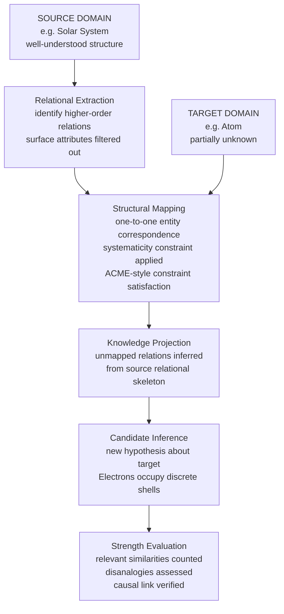

# Analogical Reasoning

> [!abstract] TL;DR
> Analogical reasoning transfers knowledge from a well-understood **source domain** to an unfamiliar **target domain** by identifying shared **relational structure** — not just surface similarity. It is the mechanism behind scientific discovery, legal precedent, everyday problem-solving, and cognitive development, and Douglas Hofstadter argued it is the single most fundamental operation of human thought.

---

## Intuition

**Analogy:** The best way to understand analogical reasoning is, fittingly, through an analogy. Imagine a master locksmith who has never seen your unusual antique lock. She does not give up — she studies a *different* lock whose mechanism she does know, identifies which **functional relationships** carry over (pin lifts tumbler, tumbler blocks bolt, tension turns cylinder), and uses that mapped structure to infer how yours works. Crucially, she ignores the irrelevant differences — the color of the brass, the age of the casing, the manufacturer — and focuses entirely on the **relational skeleton**. That is analogical reasoning in its purest form.

In formal terms: you have a **source domain** S (the known lock) and a **target domain** T (the unknown lock). Analogical reasoning finds a mapping f: S → T that preserves key relations, then projects knowledge from S into T via f to generate a new, non-obvious hypothesis about T.

---

## How It Works

### Structure of an Analogical Argument

The canonical form:

1. Source domain **S** has properties P₁, P₂, …, Pₙ and relation R.
2. Target domain **T** has analogous properties P₁', P₂', …, Pₙ'.
3. Source S additionally has property Q (or law L governing its behavior).
4. **Conclusion:** Therefore, target T probably has analogous property Q'.

The argument is **ampliative** — its conclusion goes beyond the premises. This makes it irreducibly inductive: always probable in some degree, never logically guaranteed.

### Proportional Analogy: A:B :: C:D

Aristotle formalized the simplest case in *Nicomachean Ethics* (Book V) and *Poetics*: the **four-term proportion**.

> *"Old age is to life as evening is to day."*

The structure: A stands to B in the same relation R as C stands to D. Given A, B, and C, one infers D (the unknown fourth term). This base structure underpins analogical word problems (doctor:hospital :: teacher:___), the ratio reasoning of mathematics, and the deepest forms of scientific analogy — Bohr's atom is old-age:life :: Bohr-atom:solar-system carried into physics.

### Mill's Criteria for Analogical Strength

John Stuart Mill identified the factors by which analogical arguments gain or lose evidential weight in *A System of Logic* (1843, Book III, Ch. XX):

| Criterion | Strengthens When | Weakens When |
|-----------|-----------------|--------------|
| **Number of similarities** | Many shared properties | Few shared properties |
| **Relevance of similarities** | Similarities are causally tied to Q | Similarities are incidental |
| **Number of disanalogies** | Few known differences | Many known differences |
| **Diversity of source cases** | Multiple independent sources agree | Evidence from a single source only |
| **Causal connection** | Known mechanism links similarity to Q | Correlation only, no mechanism |

The single most important criterion is **relevance**: ten irrelevant similarities are weaker evidence than one causally connected one.

### Gentner's Structure-Mapping Theory (1983)

Dedre Gentner's **Structure-Mapping Theory** — the dominant cognitive science account — distinguishes three types of cross-domain correspondences, ranked by analogical power:

- **Attribute matches** — object properties shared between domains (both the Sun and the Nucleus are "large" and "dense"). Contribute minimally to analogical reasoning quality; these are the basis of simple **similes**, not genuine analogy.
- **First-order relational matches** — shared relations between objects (Earth *orbits around* the Sun; Electron *orbits around* the Nucleus). These are the substance of most analogy.
- **Higher-order relational matches** — relations between relations (the *gravitational cause* of orbital motion in the solar system maps to the *electrostatic cause* of orbital motion in the atom). These are the most powerful and productive analogical mappings.

The **Systematicity Principle**: people — and good analogical reasoners — prefer mappings that preserve **higher-order relational structure** over mappings that match more attributes. Analogies are about *laws of behavior*, not about *how things look*.

### The Analogical Constraint Mapping Engine (ACME)

Holyoak and Thagard (1989) implemented these principles computationally in **ACME**, a connectionist model that satisfies four constraints simultaneously via parallel activation spreading:

1. **Structural consistency** — if A maps to A', then everything related to A must map to the corresponding thing related to A' in the same way.
2. **Semantic similarity** — prefer mappings between entities that share semantic properties.
3. **Pragmatic centrality** — favor mappings that serve the reasoner's actual goal.
4. **One-to-one mapping** — each element in S maps to at most one element in T, and vice versa.

ACME resolves conflicts among these constraints by allowing candidate mappings to activate and suppress each other until a globally coherent solution stabilizes. This explains why analogy comprehension is fast but not perfectly logical — it is constraint satisfaction, not exhaustive search.

### Analogy in Scientific Discovery

Two paradigmatic cases illustrate how analogy generates new scientific hypotheses:

**Bohr Model of the Atom (1913):** Niels Bohr imported the solar system analogy wholesale: Sun → Nucleus, Planet → Electron, gravitational attraction → Coulomb attraction, orbital mechanics → electron shell equations. The analogy did not just describe the atom; it **generated the hypothesis** that electrons occupy discrete energy levels. The disanalogy — classical electrons should radiate and spiral inward, but do not — was itself productive: it demanded quantum mechanics.

**Maxwell's Electromagnetic-Fluid Analogy (1855):** James Clerk Maxwell explicitly used an analogy between **incompressible fluid flow** (source) and **electrostatic field lines** (target). Fluid pressure → electric potential; fluid velocity → electric field strength; streamlines → field lines. This structural mapping allowed Maxwell to import the mathematical apparatus of fluid mechanics into electromagnetism and later, guided by the analogy, derive the displacement current and predict electromagnetic waves.

### Analogical Reasoning in Law: Precedent

Common law reasoning is institutionalized analogical reasoning. A judge confronts a new case T (target) with no directly applicable statute. She retrieves a precedent case S (source) and asks:

1. What relational structure made S legally significant (the *ratio decidendi*)?
2. Does T share that relational structure?
3. If yes, the rule from S applies to T by analogy.

The adversarial process is, in effect, a *disanalogy search*: the opposing party argues that S and T differ in a legally relevant way (a disanalogy on a causally central dimension), while the proponent argues the shared structure is what matters. The judge's ruling then advances the legal theory by deciding which similarities are legally relevant.

### Hofstadter's Thesis: Analogy as Cognitive Primitive

Douglas Hofstadter (in *Godel, Escher, Bach*, 1979, and especially *Surfaces and Essences*, 2013, with Emmanuel Sander) argued the most radical position: **analogy is not a special reasoning tool — it is the core of all cognition**. Every concept application is an analogy: calling a new round object a "ball" is mapping the new object's relational structure onto the prototype concept "ball." Every word use, every category judgment, every metaphor is an analogical act. On this view, the elaborate theories of analogical reasoning above are accounts of *explicit, consciously controlled* analogy — but implicit, automatic analogy runs beneath all thought constantly.

### Flow: From Source to Inference



---

## Python Demo

```python
# Structural mapping model for analogical reasoning.
# Two domains are encoded as feature matrices; cosine similarity
# identifies the best one-to-one entity mapping (Bohr atom analogy).

import numpy as np
import matplotlib.pyplot as plt

# ----- Domain Definitions ------------------------------------------------
# Entities: Solar System (source) and Atom (target)
# Feature dimensions encode relational roles, not surface attributes:
#   [0] centrality       -- is this entity the gravitational/binding center?
#   [1] orbital role     -- does this entity orbit another?
#   [2] force exertion   -- does this entity exert the primary binding force?
#   [3] relative mass    -- normalized mass rank within its domain
#   [4] radiates energy  -- does this entity emit energy?

source_entities = ["Sun", "Earth", "Moon"]
target_entities = ["Nucleus", "Electron", "Neutron"]

feature_names = ["Centrality", "Orbital Role", "Force Exertion", "Rel. Mass", "Radiates"]

source_matrix = np.array([
    # centrality  orbital  force  mass   radiates
    [    1.0,      0.0,    1.0,   1.0,    1.0  ],   # Sun
    [    0.0,      1.0,    0.3,   0.5,    0.0  ],   # Earth
    [    0.0,      1.0,    0.1,   0.1,    0.0  ],   # Moon
], dtype=float)

target_matrix = np.array([
    # centrality  orbital  force  mass   radiates
    [    1.0,      0.0,    1.0,   1.0,    1.0  ],   # Nucleus
    [    0.0,      1.0,    0.0,   0.0,    0.0  ],   # Electron
    [    0.0,      0.0,    0.2,   0.5,    0.0  ],   # Neutron
], dtype=float)


# ----- Structural Similarity ---------------------------------------------
def cosine_similarity_matrix(A, B):
    """Cosine similarity between every row of A and every row of B."""
    A_norm = A / (np.linalg.norm(A, axis=1, keepdims=True) + 1e-9)
    B_norm = B / (np.linalg.norm(B, axis=1, keepdims=True) + 1e-9)
    return A_norm @ B_norm.T

sim = cosine_similarity_matrix(source_matrix, target_matrix)


# ----- Greedy One-to-One Mapping (Systematicity Constraint) --------------
mapping = {}
sim_work = sim.copy()
for _ in range(min(len(source_entities), len(target_entities))):
    i, j = np.unravel_index(np.argmax(sim_work), sim_work.shape)
    mapping[source_entities[i]] = target_entities[j]
    sim_work[i, :] = -1.0
    sim_work[:, j] = -1.0


# ----- Visualisation -----------------------------------------------------
fig, axes = plt.subplots(1, 3, figsize=(17, 4))

def annotate(ax, mat):
    for r in range(mat.shape[0]):
        for c in range(mat.shape[1]):
            ax.text(c, r, f"{mat[r, c]:.1f}", ha="center", va="center",
                    fontsize=9, fontweight="bold")

# Panel 1: Source domain feature matrix
im0 = axes[0].imshow(source_matrix, cmap="Blues", vmin=0, vmax=1)
axes[0].set_xticks(range(5))
axes[0].set_xticklabels(feature_names, rotation=38, ha="right", fontsize=8)
axes[0].set_yticks(range(3))
axes[0].set_yticklabels(source_entities, fontsize=10)
axes[0].set_title("Source Domain\n(Solar System)", fontsize=11, fontweight="bold")
annotate(axes[0], source_matrix)
plt.colorbar(im0, ax=axes[0])

# Panel 2: Structural similarity heatmap (the core analogical mapping)
im1 = axes[1].imshow(sim, cmap="RdYlGn", vmin=0, vmax=1)
axes[1].set_xticks(range(len(target_entities)))
axes[1].set_xticklabels(target_entities, fontsize=10)
axes[1].set_yticks(range(len(source_entities)))
axes[1].set_yticklabels(source_entities, fontsize=10)
axes[1].set_xlabel("Target Domain (Atom)", fontsize=10)
axes[1].set_ylabel("Source Domain (Solar System)", fontsize=10)
axes[1].set_title("Structural Similarity\n(Cosine Score)", fontsize=11, fontweight="bold")
annotate(axes[1], sim)
# Highlight the selected one-to-one mapping
for src, tgt in mapping.items():
    r = source_entities.index(src)
    c = target_entities.index(tgt)
    rect = plt.Rectangle((c - 0.5, r - 0.5), 1, 1, linewidth=3,
                          edgecolor="navy", facecolor="none")
    axes[1].add_patch(rect)
plt.colorbar(im1, ax=axes[1])

# Panel 3: Target domain feature matrix
im2 = axes[2].imshow(target_matrix, cmap="Oranges", vmin=0, vmax=1)
axes[2].set_xticks(range(5))
axes[2].set_xticklabels(feature_names, rotation=38, ha="right", fontsize=8)
axes[2].set_yticks(range(3))
axes[2].set_yticklabels(target_entities, fontsize=10)
axes[2].set_title("Target Domain\n(Atom)", fontsize=11, fontweight="bold")
annotate(axes[2], target_matrix)
plt.colorbar(im2, ax=axes[2])

plt.suptitle(
    "Analogical Structural Mapping: Solar System (Source) to Atom (Target)",
    fontsize=13, fontweight="bold", y=1.02,
)
plt.tight_layout()
plt.show()

# ----- Print Results -----------------------------------------------------
print("Optimal One-to-One Structural Mapping:")
for src, tgt in mapping.items():
    i = source_entities.index(src)
    j = target_entities.index(tgt)
    print(f"  {src:<8} ->  {tgt:<10}  (cosine similarity = {sim[i, j]:.3f})")

scores = [sim[source_entities.index(s), target_entities.index(t)]
          for s, t in mapping.items()]
avg = float(np.mean(scores))
tier = "Strong" if avg > 0.75 else "Moderate" if avg > 0.45 else "Weak"
print(f"\nOverall Analogy Quality Score: {avg:.3f}  [{tier}]")
```

The heatmap in Panel 2 reveals which source-domain entities best structurally correspond to target-domain entities. Navy borders highlight the greedy one-to-one mapping selected by the systematicity constraint: Sun→Nucleus (score ~1.0), Earth→Electron (score ~0.79), Moon→Neutron (score ~0.53). The Moon→Neutron mapping is the weakest — the actual atom analogy breaks down here, which is exactly why the Bohr model is acknowledged as a *partial* analogy.

---

## Real-World Applications

**1. Scientific hypothesis generation (Bohr atom, 1913)**
Bohr imported the solar system relational structure — central mass attracting orbiting bodies — into the quantum domain. The analogy did not just describe; it *generated* the prediction of discrete energy levels. The productive disanalogy (classical electrons should radiate and collapse) forced quantum mechanics.

**2. Maxwell's electromagnetic-fluid analogy (1855)**
Maxwell explicitly mapped incompressible fluid flow onto electrostatic fields. Fluid pressure → electric potential; velocity → field strength; streamlines → field lines. This structural mapping allowed him to import fluid-mechanical mathematics wholesale into electromagnetism and later derive the displacement current, predicting light as an electromagnetic wave.

**3. Common law precedent**
Every common-law ruling creates an analogical template. Future judges ask: does this new case share the relational structure (*ratio decidendi*) of the precedent? Defense and prosecution argue over which similarities are legally relevant (relevant-similarity criterion) and which differences are legally significant (disanalogy criterion). The entire case-based reasoning tradition in AI directly models this process.

**4. Medical diagnosis by case analogy**
A clinician encountering an unusual presentation searches memory for similar past cases. This is not deduction from rules — it is analogical transfer: "Patient A three years ago had the same pattern of symptoms, and the diagnosis was X; this patient shares the relational structure; infer diagnosis X." Case-based reasoning systems (CBR) in clinical decision support codify exactly this process.

**5. Few-shot prompting in large language models**
When a prompt provides 2-3 input/output examples before a new query (few-shot prompting), the model uses analogical reasoning to infer the transformation pattern and apply it to the novel input. Chain-of-thought prompting is a form of worked-example analogy: the model maps the relational structure of the demonstration onto the new problem.

---

## Key Concepts

### Secondary

- **Source and target domains** — every analogy has a *known* domain (source) and an *unknown* domain (target). The direction matters: analogies are asymmetric. "The brain is like a computer" is not the same claim as "the computer is like a brain."
- **Proportional analogy (A:B :: C:D)** — the simplest form: A is to B as C is to D. Aristotle's formalization. Used in verbal reasoning tests, metaphor generation, and ratio reasoning.
- **Relevant vs. irrelevant similarity** — not every shared feature strengthens an analogy. Similarity must be *causally connected* to the conclusion being drawn. Two cars can both be blue without one teaching you anything about the other's engine performance.
- **Disanalogy** — a known difference between source and target that limits the scope of the inference. Identifying key disanalogies is how analogical arguments are refuted and how their conclusions are bounded.

### Undergraduate

- **Gentner's structure-mapping theory (1983)** — structural consistency and systematicity: analogies map *higher-order relational structure*, not surface attributes. The systematicity principle explains why scientists and experts prefer deep relational analogies over superficially similar cases.
- **Mill's strength criteria** — number of relevant similarities, number of disanalogies, diversity of cases, causal connection. These five criteria translate into a heuristic strength score for any analogical argument.
- **Analogical argument as inductive inference** — analogical arguments are probabilistic, not truth-preserving. They differ from deductive arguments in that the conclusion can be false even if all premises are true. They differ from simple enumerative induction in that they transfer structure, not just frequency.
- **ACME model** — four constraints (structural consistency, semantic similarity, pragmatic centrality, one-to-one mapping) resolved by parallel constraint satisfaction. Explains both the speed and the systematic biases of human analogical mapping.
- **Case-based reasoning (CBR)** — AI paradigm based on analogical inference: retrieve a similar past case, adapt its solution to the new case, apply it, then retain the result as a new case. The four-step retrieve-reuse-revise-retain cycle implements analogical strength criteria computationally.

### Graduate

- **Systematicity principle as selection pressure** — Gentner's principle predicts not just that people prefer higher-order relational mappings, but that these mappings are *epistemically superior*: they generate more novel and more correct inferences, because higher-order relations are lawful rather than accidental. This connects structural mapping theory to philosophy of science (Hesse's *Models and Analogies in Science*).
- **ACME vs. SME (Structure-Mapping Engine)** — SME (Falkenhainer, Forbus, Gentner, 1989) is a symbolic algorithm that finds the structurally deepest consistent mapping; ACME is a connectionist model that uses constraint satisfaction. They embody the same principles but differ on whether analogy comprehension is best modeled as sequential search or parallel settling. Both predict the systematicity effect.
- **Analogy in formal law (ratio decidendi and distinguishing)** — legal theorists distinguish holding/ratio from obiter dicta: only the ratio (the rule applied to the essential facts) creates precedent. Analogical extension requires argument that the essential relational structure is shared; distinguishing a precedent requires identifying a difference in that structure. MacCormick and Bankowski formalize this as a structured argument scheme.
- **Hofstadter's radical thesis** — all concepts are categories of analogy; concept application is the assignment of a new experience to a category by analogy with prior exemplars. Language itself is a frozen analogy system: words are crystallized mappings. This generalizes analogy from a reasoning *tool* to the *substrate* of cognition itself.
- **Analogy and abduction** — Peirce distinguished abduction (inference to the best explanation) from induction, but Thagard argues that analogy drives abduction: the *best* explanation for a target-domain observation is often imported from a source domain where a causal mechanism is already understood. Analogy is thus the generative engine for scientific abduction.

---

## Common Pitfalls

- **False analogy fallacy** — concluding that because S and T share some properties, they share all properties relevant to the argument, without checking whether the shared properties are causally relevant. Example: "The government is like a household; households must balance their budgets; therefore the government must balance its budget." The analogy breaks on the properties that differ (government creates currency, has intergenerational obligations, faces no bankruptcy creditor) — exactly the ones relevant to fiscal policy.

- **Irrelevant similarity** — strengthening an analogy by citing many shared features that are not causally connected to the conclusion. A red car and a red fire truck share color, brand of tire, country of manufacture, and dozens of other features — none of which support any meaningful inference from one to the other. Quantity of similarities is not a substitute for relevance.

- **Asymmetry neglect** — treating an analogy as symmetric when it is not. "A is like B" and "B is like A" support different inferences because source and target roles are different. The solar system is the source of the atom analogy; reversing it (the atom is the source for the solar system) would suggest looking for quantum mechanical effects in planetary orbits — a very different and wrong inference.

- **Ignoring disanalogies** — the Bohr model works *because* Bohr tracked the disanalogy (classical radiation collapse) and used it to identify the quantum postulate. Ignoring disanalogies produces overconfident analogical conclusions. Every analogy holds in some respects and fails in others; specifying the boundary is part of using it responsibly.

- **Single-case base** — drawing an analogy from one precedent or source case, when the conclusion actually requires a diversity of supporting cases. Legal precedent from a single jurisdiction, scientific analogy from a single domain, or medical analogy from a single patient all suffer from the same weakness: the source might be atypical.

- **Mapping surface attributes instead of relations** — common in novices. Two diseases that both cause "red rash" are not necessarily analogous in mechanism or treatment. Expert analogical reasoning maps *causal and functional relations*, not perceptual properties. This is Gentner's systematicity principle in its practical form.

---

## Related Concepts

- [[Arguments_Validity_and_Soundness]] — analogical arguments are inductive, not deductive; this note covers why they cannot be evaluated by validity/soundness criteria and must instead be assessed by strength and cogency.
- [[Logic_and_Critical_Thinking_Overview]] — parent overview of deductive, inductive, and abductive reasoning modes; analogy sits in the inductive family and bridges into abduction.
- [[Problem_Solving_and_Decision_Making]] — Gentner's structural mapping theory is a cognitive science account of how humans retrieve and apply analogical solutions during problem-solving; heuristic reasoning under dual-process theory overlaps significantly.
- [[Cognitive_Biases]] — the false analogy fallacy and irrelevant-similarity bias are systematic errors in analogical reasoning; many cognitive biases (representativeness heuristic, availability) involve over-reliance on surface-level analogical matching.
- [[Cognitive_Semantics_and_Metaphor]] — conceptual metaphor theory treats metaphor as analogical mapping frozen into language; SOURCE-PATH-GOAL, ARGUMENT IS WAR, and TIME IS MONEY are structural mappings in Gentner's sense applied to the semantic layer of language.
- [[Chain_of_Thought]] — few-shot chain-of-thought prompting works by analogical transfer: the model maps the relational structure of a worked-out example onto a new problem, projecting both the reasoning steps and the answer format.

---

## Review Questions

**Foundational**
1. Aristotle's four-term proportion states A:B :: C:D. Construct a proportional analogy from biology (not from the note). Identify the source domain, target domain, and the higher-order relation being preserved. Then identify one disanalogy that limits the inference.

**Applied**
2. A pharmaceutical company argues: "Drug X worked in mice; mice are mammals; humans are mammals; therefore Drug X will work in humans." Apply Mill's five strength criteria to evaluate this argument. What single additional piece of evidence would most substantially strengthen it? What single disanalogy most undermines it?

**Advanced**
3. Gentner's systematicity principle predicts that humans prefer deep relational analogies over shallow attribute-based ones. Design a behavioral experiment that could falsify this principle. What result would count as falsification, and what alternative cognitive theory would the result support?

---

## Sources

- Gentner, D. (1983). Structure-mapping: A theoretical framework for analogy. *Cognitive Science*, 7(2), 155–170. — The foundational paper introducing the systematicity principle and attribute vs. relational matches.
- Holyoak, K. J., & Thagard, P. (1989). Analogical mapping by constraint satisfaction. *Cognitive Science*, 13(3), 295–355. — Original ACME paper; introduces the four-constraint parallel satisfaction model.
- Mill, J. S. (1843). *A System of Logic*, Book III, Chapter XX: "Of Analogy." Longmans, Green. — The classical empiricist treatment of analogical argument strength criteria.
- Hofstadter, D. R., & Sander, E. (2013). *Surfaces and Essences: Analogy as the Fuel and Fire of Thinking*. Basic Books. — The radical thesis that analogy is the cognitive primitive underlying all concept formation and thought.
- Bartha, P. (2022). "Analogy and Analogical Reasoning." *Stanford Encyclopedia of Philosophy*. Zalta, E. N. (ed.). — The most comprehensive contemporary philosophical survey of analogical argument structure and strength criteria.

---

#logic #analogical-reasoning #analogy #cognitive-science #reasoning
