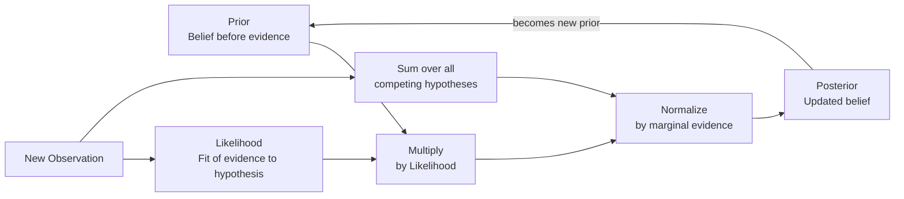

# Bayesian Reasoning

> [!abstract] TL;DR
> Bayesian reasoning is a principled method for updating degrees of belief in a hypothesis as new evidence arrives, grounded in Bayes' theorem: P(H|E) = P(E|H) · P(H) / P(E). It is simultaneously a mathematical formula, a theory of rational learning, and a philosophy of mind — treating probability not as long-run frequency but as a measure of rational credence, and formalizing how any coherent agent ought to change its beliefs when new information arrives. From spam filters and medical diagnosis to the neuroscience of perception, Bayesian reasoning underlies some of the most powerful inference engines ever built.

---

## Intuition

**Analogy:** Imagine you are a detective arriving at a crime scene. Before examining any evidence, you have background beliefs about who is likely responsible — based on motive, opportunity, and history. That is your *prior*. Then you find a shoe print. You ask: how likely would I be to find exactly this shoe print if this particular suspect were guilty? That is the *likelihood*. Combining your prior with this likelihood gives you an updated belief — the *posterior*. The next clue (a receipt, a phone record) updates the posterior again, which becomes the new prior for the following piece of evidence. Each clue does not replace your previous reasoning — it refines it.

This detective method is Bayes' theorem formalized. The key insight is that rational reasoning is not all-or-nothing: it is a continuous, cumulative process of updating degrees of belief. You never reach certainty — you approach probability.

---

## How It Works

### Core Mechanics

Bayes' theorem derives directly from the definition of conditional probability. If P(A and B) = P(A|B) · P(B) = P(B|A) · P(A), rearranging gives:

```
P(H | E)  =  P(E | H) · P(H)  /  P(E)
```

Each term has a name and a distinct role:

| Term | Symbol | Role |
|------|--------|------|
| **Prior** | P(H) | Belief in hypothesis H before observing evidence E |
| **Likelihood** | P(E\|H) | How probable evidence E is assuming H is true |
| **Marginal evidence** | P(E) | Total probability of E, summed across all competing hypotheses; normalizes the posterior |
| **Posterior** | P(H\|E) | Updated belief in H after observing E |

The evidence term P(E) is computed via the law of total probability across all mutually exclusive hypotheses:

```
P(E)  =  P(E|H) · P(H)  +  P(E|¬H) · P(¬H)
```

In the general case with K competing hypotheses H₁ … Hₖ:

```
P(E)  =  Σᵢ P(E | Hᵢ) · P(Hᵢ)
```

**Practical mnemonic — posterior is proportional to likelihood times prior:**

```
P(H | E)  ∝  P(E | H) · P(H)
```

The division by P(E) is just the normalization step ensuring all posterior probabilities sum to 1.

**Odds form (more intuitive for sequential updating):**

```
Posterior Odds  =  Likelihood Ratio  ×  Prior Odds
```

Where `Likelihood Ratio = P(E|H) / P(E|¬H)`. Each new piece of independent evidence multiplies the current odds by its own likelihood ratio — making the sequential update algorithm obvious.

### Sequential Bayesian Updating

After computing a posterior from evidence E₁, treat that posterior as the prior for the next observation E₂. Under conditional independence:

```
P(H | E₁, E₂)  =  P(E₂ | H) · P(H | E₁)  /  P(E₂ | E₁)
```

The *order* of evidence does not affect the final posterior (given independence). This composability makes Bayesian reasoning a rational online learning algorithm — beliefs accumulate evidence incrementally, never discarding history.

### Flow / Architecture



---

## Key Concepts

### Secondary

- **Prior probability** — What you believe before seeing evidence. Can stem from domain knowledge (disease prevalence in a population), symmetry (each die face is equally likely by principle of indifference), or historical data. The choice of prior is the most debated part of Bayesian analysis.

- **Likelihood** — The probability of observing the evidence *given that the hypothesis is true*. Critically, it is **not** the probability of the hypothesis. P(E|H) ≠ P(H|E). Reversing this is the **likelihood ratio fallacy** (also called the transposition of the conditional), and it underlies the prosecutor's fallacy.

- **Posterior** — The updated belief after incorporating evidence. This is the quantity of interest: given what I observed, what should I now believe?

- **Base rate neglect** — The most common failure of intuitive probabilistic reasoning: ignoring the prior P(H) when evaluating a test or argument, focusing only on the test's sensitivity and specificity. A test with 99% sensitivity and 90% specificity applied to a disease affecting 0.1% of the population has a positive predictive value of only ~9% — because the sheer volume of false positives from the healthy majority swamps the true positives from the rare sick minority. Base rate neglect causes clinicians, jurors, and policymakers to dramatically overestimate the evidential weight of accurate tests applied to rare events.

- **Prosecutor's fallacy** — Confusing P(evidence | innocent) with P(innocent | evidence). The probability that an innocent person would show a matching DNA profile is *not* the same as the probability that the defendant is innocent. Courts have convicted defendants by treating these as equivalent. The defence reply is known as the *defence attorney's fallacy* — arguing that because DNA matches many people in a large city, the DNA is irrelevant, which also ignores the proper Bayesian calculation.

### Undergraduate

- **Conjugate priors** — A prior distribution is *conjugate* to a likelihood function when the resulting posterior belongs to the same parametric family, making Bayesian updating analytically closed-form. Classic conjugate pairs:

  | Likelihood | Conjugate Prior | Posterior |
  |-----------|----------------|-----------|
  | Binomial (coin flips) | Beta(α, β) | Beta(α + successes, β + failures) |
  | Multinomial | Dirichlet | Dirichlet |
  | Normal (known variance) | Normal | Normal |
  | Poisson | Gamma | Gamma |
  | Categorical | Dirichlet | Dirichlet |

  Conjugacy matters in practice because it permits sequential updating in O(1) — just update the hyperparameters — rather than recomputing a full integral.

- **Subjective vs. objective priors** — *Subjective Bayesianism* (de Finetti, Ramsey, Savage): priors represent personal degrees of belief. Different agents may legitimately hold different priors; the only requirement is internal coherence. *Objective Bayesianism* (Jeffreys, Jaynes): priors should be derived from symmetry, invariance, or maximum entropy principles to minimize information injected by the analyst. Jeffreys' prior is invariant under reparameterization. Neither camp fully resolves the problem of prior choice, but the debate sharpens what "rational belief" means.

- **Bayesian vs. frequentist paradigm** — Frequentists treat probability as long-run frequency and do not assign probabilities to fixed unknown parameters — only to procedures (tests, confidence intervals). Bayesians assign probability to any uncertain quantity, including parameters and hypotheses. The practical consequences:

  | Dimension | Frequentist | Bayesian |
  |-----------|-------------|---------|
  | Interpretation of probability | Long-run frequency of events | Degree of rational belief |
  | Treatment of parameters | Fixed but unknown constants | Random variables with prior distributions |
  | Result of analysis | p-value + confidence interval | Posterior distribution + credible interval |
  | Small sample behavior | Can fail or be undefined | Regularized by prior (which must be justified) |
  | Intuitive interpretation | "If null were true, result this extreme arises < 5% of the time" | "Given the data, there is a 73% probability the drug is effective" |

- **Bayesian networks** — Directed acyclic graphs (DAGs) where nodes are random variables and directed edges encode conditional dependence. The joint distribution over all nodes factors as the product of each node's conditional distribution given its parents:

  ```
  P(X₁, ..., Xₙ)  =  Πᵢ P(Xᵢ | parents(Xᵢ))
  ```

  This factorization exploits conditional independences to make inference tractable. Used in medical diagnosis systems (Pathfinder, QMR-DT), spam filters, and causal inference. Judea Pearl's *do*-calculus extends Bayesian networks to distinguish observed association from the effects of interventions.

- **Likelihood ratio and evidence strength** — `LR = P(E|H) / P(E|¬H)` quantifies evidential weight independent of priors. An LR of 1 means the evidence is irrelevant. LR > 1 favors H; LR < 1 disfavors H. Forensic scientists now routinely present evidence in LR form rather than as a single probability to avoid priming jurors with implicit prior assumptions.

### Graduate

- **Jeffrey conditionalization** — Strict conditionalization requires that evidence E be observed with certainty (probability assigned to E jumps to 1). Richard Jeffrey generalized this to *soft evidence*: when observing something raises your probability of proposition E from p₀ to some new value p₁ (without making it certain), the appropriate posterior update is a mixture:

  ```
  P'(H)  =  P(H | E) · p₁  +  P(H | ¬E) · (1 − p₁)
  ```

  This handles perceptual evidence under uncertainty — a natural fit for sensory signals where the stimulus is never directly observed, only inferred from noisy sensors.

- **Dutch book arguments for probabilism** — A *Dutch book* is a set of bets that collectively guarantee a net loss regardless of which outcome occurs. Ramsey (1926) and de Finetti (1937) proved that an agent whose credences violate the Kolmogorov probability axioms is susceptible to a Dutch book — they can be made to accept a combination of bets they must lose. This gives a *pragmatic*, decision-theoretic justification for the claim that rational degrees of belief must be probabilities. *Diachronic* Dutch book arguments (against self-knowing agents who plan to update in a non-Bayesian way) justify conditionalization as the unique rational update rule, not just the axioms themselves.

- **Bayesian epistemology: Ramsey, de Finetti, Savage** — Frank Ramsey (*Truth and Probability*, 1926) was the first to propose a precise operational definition of subjective probability via betting dispositions and to prove a representation theorem: if an agent's preferences over gambles satisfy rationality axioms, their choices are describable by a probability function and a utility function. Bruno de Finetti (*La prévision*, 1937) strengthened this with the exchangeability theorem and Dutch book arguments, insisting that probability is entirely subjective — "probability does not exist" as an objective feature of the world. Leonard Savage (*Foundations of Statistics*, 1954) unified probability and utility in a full subjective expected utility framework. Together they established the Bayesian paradigm as a complete theory of rational decision-making. Key ongoing challenges: (1) *old evidence* — evidence known before a theory is proposed cannot raise the theory's prior; (2) *problem of priors* — where do priors come from in genuinely novel situations; (3) *confirmational holism* (Quine–Duhem) — experiments always test theories plus auxiliary hypotheses, making likelihoods hard to isolate.

- **Predictive processing and the Bayesian brain hypothesis** — Karl Friston, Andy Clark, and Jakob Hohwy propose that the brain is fundamentally a hierarchical Bayesian inference machine. The cortex continuously generates probabilistic predictions about incoming sensory signals; perception is the process of resolving discrepancies (*prediction errors*) between top-down predictions and bottom-up sensory signals. Friston's *free energy principle* formalizes this: the brain minimizes variational free energy, which upper-bounds the surprise (negative log evidence) of its sensory observations. Under this framework:
  - **Attention** = precision-weighting of prediction errors (modulating how much to trust sensory signals vs. prior predictions)
  - **Learning** = updating the parameters of the brain's generative model to improve future predictions
  - **Action** = changing sensory states (moving the body) to make prediction errors go to zero
  
  This framework unifies perception, action, learning, and attention under a single Bayesian principle and has generated predictions across psychopathology (hallucinations as runaway top-down predictions), motor control, and interoception.

- **KL divergence as information gained** — The Kullback–Leibler divergence from prior to posterior, D_KL(posterior || prior), quantifies how much a Bayesian update changes beliefs. It measures the information gained from the evidence. Expected information gain — averaged over possible observations — is the foundation of *Bayesian experimental design* and *active learning*: choose the experiment whose expected evidence maximally updates your current beliefs.

---

## Python Demo

```python
import numpy as np
import matplotlib.pyplot as plt

# ─── Medical test scenario ────────────────────────────────────────────────────
# Disease test with known sensitivity and specificity.
# Goal: compute P(disease | positive test) and show how the prior matters.

SENSITIVITY = 0.95   # P(positive | disease present)  — true positive rate
SPECIFICITY = 0.90   # P(negative | disease absent)   — true negative rate


def bayes_positive(prior, sensitivity, specificity):
    """Return P(disease | positive test) via Bayes theorem."""
    p_pos_given_disease    = sensitivity
    p_pos_given_no_disease = 1.0 - specificity         # false positive rate
    # Law of total probability
    p_positive = (p_pos_given_disease * prior
                  + p_pos_given_no_disease * (1.0 - prior))
    return (p_pos_given_disease * prior) / p_positive  # Bayes theorem


def bayes_negative(prior, sensitivity, specificity):
    """Return P(disease | negative test) via Bayes theorem."""
    p_neg_given_disease    = 1.0 - sensitivity         # false negative rate
    p_neg_given_no_disease = specificity
    p_negative = (p_neg_given_disease * prior
                  + p_neg_given_no_disease * (1.0 - prior))
    return (p_neg_given_disease * prior) / p_negative


# ─── Single update: population disease prevalence = 1 percent ─────────────────
prior = 0.01
posterior_pos = bayes_positive(prior, SENSITIVITY, SPECIFICITY)
print(f"Prior P(disease):                {prior:.4f}")
print(f"P(disease | positive test):      {posterior_pos:.4f}  ({posterior_pos:.1%})")
print(f"  Despite 95/90 accuracy, PPV is only {posterior_pos:.1%} because the disease is rare.")
print()

# ─── Plot 1: Posterior vs Prior curve (single positive test) ──────────────────
priors_arr = np.linspace(0.001, 0.50, 500)
posteriors_arr = bayes_positive(priors_arr, SENSITIVITY, SPECIFICITY)

fig, axes = plt.subplots(1, 2, figsize=(12, 5))

ax1 = axes[0]
ax1.plot(priors_arr, posteriors_arr, color="steelblue", linewidth=2.5)
ax1.axhline(0.5, color="crimson", linestyle="--", linewidth=1.5,
            label="50 percent posterior threshold")
ax1.fill_between(priors_arr, posteriors_arr, 0.5,
                 where=(posteriors_arr < 0.5),
                 alpha=0.12, color="crimson",
                 label="PPV below 50 percent")
ax1.set_xlabel("Prior P(disease)", fontsize=12)
ax1.set_ylabel("Posterior P(disease | positive test)", fontsize=12)
ax1.set_title("Effect of Prior on Posterior\nSensitivity=0.95, Specificity=0.90")
ax1.legend(fontsize=10)
ax1.grid(alpha=0.3)


# ─── Sequential Bayesian updating ─────────────────────────────────────────────
def sequential_update(initial_prior, test_results, sensitivity, specificity):
    """
    Update beliefs sequentially given a list of test outcomes.
    test_results: list of True (positive) or False (negative).
    Returns the full belief trajectory including the initial prior.
    """
    belief = initial_prior
    history = [belief]
    for result in test_results:
        if result:
            belief = bayes_positive(belief, sensitivity, specificity)
        else:
            belief = bayes_negative(belief, sensitivity, specificity)
        history.append(belief)
    return history


# Scenario A: three consecutive positive tests from a 1 percent prior
history_3pos  = sequential_update(0.01, [True, True, True], SENSITIVITY, SPECIFICITY)
# Scenario B: two positives then one negative
history_mixed = sequential_update(0.01, [True, True, False], SENSITIVITY, SPECIFICITY)

ax2 = axes[1]
steps = np.arange(len(history_3pos))
tick_labels = ["Prior\n0.01", "After T1", "After T2", "After T3"]

ax2.plot(steps, history_3pos, "o-", color="darkorange", linewidth=2.5,
         markersize=9, label="3 positive tests")
ax2.plot(steps, history_mixed, "s--", color="teal", linewidth=2.5,
         markersize=9, label="2 positive, 1 negative")
ax2.set_xticks(steps)
ax2.set_xticklabels(tick_labels)
ax2.set_ylabel("P(disease)", fontsize=12)
ax2.set_title("Sequential Bayesian Updating\nStarting Prior = 0.01")
ax2.set_ylim(0, 1)
ax2.legend(fontsize=10)
ax2.grid(alpha=0.3)

plt.tight_layout()
plt.savefig("bayesian_updating.png", dpi=110, bbox_inches="tight")
plt.show()

print("Sequential update — 3 positive tests:")
labels = ["  Prior      "] + [f"  After T{i+1}   " for i in range(3)]
for label, p in zip(labels, history_3pos):
    print(f"{label}: P(disease) = {p:.4f}")

print("\nSequential update — 2 positive, 1 negative:")
for label, p in zip(labels, history_mixed):
    print(f"{label}: P(disease) = {p:.4f}")
```

The key output from running this code demonstrates two critical Bayesian lessons:
- A single positive test with a 1% prior yields only ~8.7% posterior — counter-intuitive to most people (base rate neglect)
- Three positive tests compounding from 1% prior push the posterior to ~67%, showing how sequential updating accumulates evidence

---

## Real-World Applications

1. **Medical diagnosis and screening policy** — Bayesian reasoning determines when mass screening is beneficial. Mammography screening for breast cancer in women aged 40–50 yields many false positives (low prior prevalence) that cause anxiety and unnecessary biopsies. Policymakers use Bayesian calculations to set screening age thresholds where PPV becomes clinically acceptable. Bayesian updating also underlies clinical decision support systems that integrate test results sequentially as a patient is worked up.

2. **Spam filtering** — Paul Graham's 2002 essay "A Plan for Spam" introduced Naive Bayes classifiers into mainstream email filtering. The approach assigns each word a likelihood ratio for spam vs. legitimate email, then multiplies likelihood ratios across words (assuming conditional independence given label) to update a prior probability of spam. Despite the strong independence assumption, this works remarkably well in practice and shaped Google, Microsoft, and Yahoo's initial spam defenses — an early demonstration of Bayesian networks scaling to real-world data.

3. **Legal reasoning and forensic science** — DNA evidence, fingerprints, and ballistics comparisons are naturally expressed as likelihood ratios: "this evidence is X times more probable under the prosecution's hypothesis than the defence hypothesis." The UK Forensic Science Regulator now recommends LR reporting as the only logically defensible presentation of probabilistic forensic evidence. Bayesian reasoning also frames the admissibility of prior criminal convictions and the weight of expert testimony, though courts have been slow to adopt formal calculations.

4. **Scientific confirmation and model comparison** — The *Bayes factor* BF₁₂ = P(data | model₁) / P(data | model₂) compares two scientific hypotheses without arbitrary significance thresholds. A BF of 10 is moderate evidence; 100 is decisive. Bayesian model comparison is used in cosmology (comparing inflationary models), genetics (estimating phylogenetic trees), and psychology (replication crisis studies comparing null models to effect models). It naturally penalizes overfitting because more complex models must spread prior probability across more parameter space.

5. **Sensor fusion and navigation** — The Kalman filter is a recursive Bayesian estimator for linear Gaussian state-space models. It underlies GPS receivers, aircraft autopilots, spacecraft navigation (Apollo Guidance Computer used it), and robot localization (SLAM — Simultaneous Localization and Mapping). The particle filter extends this to non-Gaussian and nonlinear systems, enabling self-driving car sensor fusion combining LIDAR, radar, and camera into a coherent world model with calibrated uncertainty.

---

## Common Pitfalls

- **Base rate neglect** — Focusing on the accuracy of a test or argument while ignoring the prior probability of the hypothesis. The most pervasive failure mode in clinical, legal, and everyday probabilistic reasoning. Fix: always compute P(E) = P(E|H)·P(H) + P(E|¬H)·P(¬H) explicitly before evaluating the posterior. The rare-disease / accurate-test scenario is the canonical illustration.

- **Prosecutor's fallacy** — Treating P(evidence | hypothesis) as equivalent to P(hypothesis | evidence). A DNA match probability of 1-in-a-million is not the probability of innocence; it is P(match | innocent). The posterior probability of innocence also depends on all other evidence, the number of plausible suspects, and the quality of the forensic procedure. This fallacy has contributed to wrongful convictions in documented cases in the UK, US, and Australia.

- **Prior sensitivity in small samples** — When data are sparse, the posterior is dominated by the prior. An overly confident or misspecified prior can prevent the model from learning from weak evidence. Fix: perform prior predictive checks, use weakly informative priors, and report posterior sensitivity to prior choice.

- **Treating the posterior as a point estimate** — Computing a posterior distribution and then reading off only the mode (MAP estimate) discards uncertainty information. Decisions made from point estimates can be brittle. Fully Bayesian decision-making integrates over the entire posterior distribution to propagate uncertainty into predictions and decisions.

- **Ignoring model uncertainty** — Standard Bayesian updating conditions on a fixed model structure and only updates parameters. If the true model is not in the considered hypothesis space, the posterior will converge to the closest wrong model with false certainty. Fix: use Bayesian model averaging across a set of candidate models, or non-parametric Bayesian methods (Gaussian processes, Dirichlet processes).

- **Circular priors** — Using the data itself to choose the prior (empirical Bayes done carelessly) and then updating on the same data inflates posterior confidence and invalidates the probability calibration. Proper Bayesian analysis requires the prior to be specified before seeing the data, or to use held-out data for prior elicitation.

---

## Related Concepts

- [[Logic_and_Critical_Thinking_Overview]] — The parent framework: Bayesian reasoning is the formal treatment of *inductive* reasoning, one of the three modes of inference (deductive, inductive, abductive) covered in the overview. The graduate tier of that note explicitly introduces Bayesian epistemology.

- [[Probability_and_Statistics]] — The mathematical substrate: conditional probability, Bayes' theorem, MLE, MAP estimation, and distributional families are all covered there. This note extends those tools into epistemology, cognitive science, and law.

- [[Cognitive_Biases]] — Base rate neglect, the conjunction fallacy, and the prosecutor's fallacy are all catalogued as cognitive biases in that note. Bayesian reasoning provides the normative standard against which these biases are defined and measured.

- [[Decision_Making_and_Reward_Circuits]] — The neuroscience of how the brain implements value-based decisions. The Bayesian brain hypothesis (Friston, Clark) proposes that reward circuits implement approximate Bayesian inference over value distributions; prediction errors in the dopamine system track Bayesian surprise signals.

- [[Naive_Bayes]] — The direct ML application of Bayes' theorem to classification, assuming conditional independence of features given the class label. Demonstrates how the core theorem scales to high-dimensional text and tabular data in spam filtering, sentiment analysis, and medical coding.

- [[Hypothesis_Testing]] — The frequentist alternative paradigm. p-values, confidence intervals, and null hypothesis significance testing (NHST) are compared and contrasted with Bayesian credible intervals and Bayes factors in that note — the contrast illuminates both approaches.

- [[Information_Theory]] — KL divergence D_KL(posterior || prior) quantifies the information gained in a Bayesian update. Entropy of the prior measures uncertainty before evidence; entropy of the posterior measures remaining uncertainty after. Expected information gain is the Bayesian criterion for optimal experimental design.

---

## Review Questions

### Secondary

1. A test for a rare genetic disorder has 99% sensitivity and 98% specificity. The disorder affects 1 person in 2000. A patient tests positive. Without calculating, what would you intuitively guess the probability is that they actually have the disorder — and why would that intuition likely be wrong? Now work through the Bayes calculation. What does this reveal about the practical meaning of "test accuracy"?

2. You roll a six-sided die 20 times and never roll a 6. A Bayesian and a frequentist are each asked: "What is the probability the die is fair?" How would each frame their answer, and what information would each require that the other would dismiss as inadmissible?

3. Describe a real scenario (medical, legal, or everyday) where confusing P(evidence | innocent) with P(innocent | evidence) could lead to a serious error in judgment.

### Undergraduate

1. The Beta distribution Beta(α, β) is the conjugate prior for a Binomial likelihood. After observing k successes in n trials, the posterior is Beta(α + k, β + n − k). What is the intuition behind why this is conjugate? What hyperparameter values correspond to a flat (uninformative) prior, and how does the posterior converge as n → ∞?

2. Explain the difference between a Bayesian 95% credible interval and a frequentist 95% confidence interval. In what sense does the Bayesian interval have the more intuitive interpretation, and what assumption makes that interpretation possible?

3. A Bayesian network over variables {Rain, Sprinkler, GrassWet} encodes Rain → GrassWet and Sprinkler → GrassWet. If you observe that the grass is wet, explain how the network propagates this evidence to update beliefs about both Rain and Sprinkler simultaneously. Why does observing Sprinkler = True *reduce* your posterior on Rain even though Rain and Sprinkler are marginally independent?

### Graduate

1. Frank Ramsey and Bruno de Finetti argued that any agent whose credences violate the Kolmogorov probability axioms is susceptible to a Dutch book — a set of bets guaranteeing a net loss. Does this argument successfully establish that rational degrees of belief must be probabilities, or does it only establish that beliefs must be *coherent* in a narrow betting-behavior sense? What are the main philosophical objections, and can they be answered?

2. Karl Friston's free energy principle proposes that perception, action, and learning are all instances of minimizing variational free energy — a single Bayesian objective. Evaluate both the explanatory power of this framework and its empirical tractability. What cognitive phenomena has it illuminated, and what aspects of cognition resist this characterization?

3. Compare Bayesian model comparison via Bayes factors to frequentist null hypothesis significance testing via p-values for evaluating competing scientific theories. Under what conditions does each approach give misleading results — for instance, when does a small p-value fail to constitute strong evidence for a hypothesis, and when can a large Bayes factor reflect only weakly informative priors rather than genuine evidential support?

---

## Sources

- [Joyce, J. "Bayes' Theorem." *Stanford Encyclopedia of Philosophy*, 2021](https://plato.stanford.edu/entries/bayes-theorem/)
- [Jaynes, E. T. *Probability Theory: The Logic of Science*. Cambridge University Press, 2003](https://www.cambridge.org/core/books/probability-theory/9CA08E224FF30123304E6D8935CF1A99)
- [Friston, K. "The Free-Energy Principle: A Unified Brain Theory?" *Nature Reviews Neuroscience*, 11, 127–138, 2010](https://www.nature.com/articles/nrn2787)
- [Pearl, J. *Probabilistic Reasoning in Intelligent Systems*. Morgan Kaufmann, 1988](https://www.sciencedirect.com/book/9780080514895/probabilistic-reasoning-in-intelligent-systems)
- [Gigerenzen, G. & Hoffrage, U. "How to Improve Bayesian Reasoning without Instruction: Frequency Formats." *Psychological Review*, 102(4), 684–704, 1995](https://psycnet.apa.org/doi/10.1037/0033-295X.102.4.684)

---

#logic #bayesian-reasoning #probability #belief-updating #epistemology
