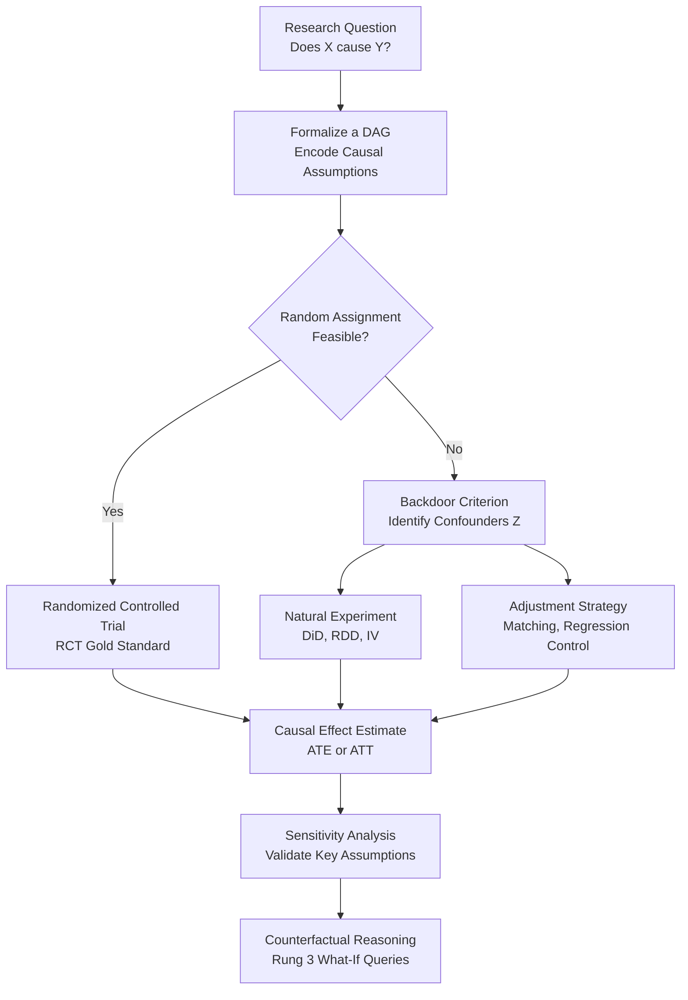

# Causal Reasoning

> [!abstract] TL;DR
> Causal reasoning asks not "are A and B associated?" but "does A *produce* B, and what would happen if we intervened?" — a distinction that determines whether a policy works, a drug heals, or an algorithm is fair. The modern theory of causation (Pearl's causal hierarchy, DAGs, do-calculus) provides formal tools to move from observed correlations to causal claims, while experimental design and natural experiments provide empirical strategies to measure causal effects when experiments are impossible or unethical.

---

## Intuition

**Analogy:** Ice cream sales and drowning rates both spike every summer. A naive data analyst might conclude that eating ice cream causes drowning. Banning ice cream would be absurd — hot weather drives both variables independently. This common cause fallacy shows why correlation, however tight, reveals nothing about causation without extra structure. Causal reasoning is the discipline of building that extra structure: you must specify not just what you observe, but what would happen under interventions you could make.

A detective never stops at "these two facts always coincide." She asks: if I removed one, would the other vanish? That counterfactual question — *what would have happened if* — is the engine of all causal thinking, from clinical trials to A/B experiments to historical counterfactuals in policy analysis.

---

## How It Works

### Core Mechanics

**Theories of causation — the philosophical backbone:**

1. **Hume's constant conjunction (1748)** — Causation is regularized contiguity: C causes E if (i) C precedes E, (ii) they are spatially/temporally contiguous, and (iii) every C is followed by an E. The deep problem: this is purely observational. We never see the causal "glue" itself — Hume concluded causation is a habit of mind imposed on sequences of events, not a mind-independent feature of reality.

2. **Counterfactual theory (Lewis 1973)** — C causes E if and only if: *had C not occurred, E would not have occurred*. This formulation aligns directly with modern causal inference: the causal effect of C is the difference between what happened and what would have happened in a world identical except for C's absence. Challenge: evaluating counterfactuals requires possible-world semantics or a structural model.

3. **Mackie's INUS conditions (1965)** — A cause is an **I**nsufficient but **N**ecessary part of an **U**nnecessary but **S**ufficient condition for the effect. Smoking is neither necessary nor sufficient for lung cancer — but it is one INUS condition: it contributes to sufficient causal packages that produce the disease. This handles over-determination and multi-cause scenarios better than simple constant conjunction.

**Pearl's Causal Hierarchy — the ladder of causation:**

| Rung | Question type | Example | Tool required |
|------|--------------|---------|---------------|
| 1. Association | P(Y given X) — what is? | "People who take aspirin have fewer headaches" | Observational data, regression |
| 2. Intervention | P(Y given do(X)) — what if I do? | "If I force everyone to take aspirin, what happens?" | RCT or do-calculus + DAG |
| 3. Counterfactual | P(Y_x given X', Y') — what if it had been? | "Would this patient have survived on a different drug?" | Structural equations, twin-world models |

The central insight: **no amount of Rung 1 data can answer a Rung 2 question**. You cannot observe your way to causation — you need a causal model.

**Directed Acyclic Graphs (DAGs):**

A DAG encodes the researcher's causal assumptions as a graph where:
- Nodes are variables (observed or latent)
- A directed edge X → Y means X is a direct cause of Y
- Acyclicity rules out instantaneous feedback loops
- The graph makes assumptions explicit and testable

**d-separation:** Sets of nodes X and Y are d-separated by Z if Z blocks every path between them. D-separated nodes are conditionally independent given Z. This bridges the graph structure to testable statistical independence constraints.

**Types of paths and blocking:**
- **Chain** (X → M → Y): blocked by conditioning on M
- **Fork / Common cause** (X ← Z → Y): blocked by conditioning on Z
- **Collider** (X → C ← Y): *opened* by conditioning on C — a notorious source of spurious associations

**Backdoor criterion:** A conditioning set Z satisfies the backdoor criterion for the effect of X on Y if: (a) no element of Z is a descendant of X, and (b) Z blocks all backdoor paths (paths that enter X through its causes). If Z satisfies this criterion, the causal effect of X on Y is identified from observational data as:

P(Y | do(X)) = sum over Z of P(Y | X, Z) * P(Z)

**Do-calculus:** Pearl's three inference rules translate expressions containing intervention operators do(X) into observational quantities. When a valid identification sequence exists, do-calculus finds it; when no such sequence exists, the effect is not identifiable from observational data without additional assumptions.

**Potential Outcomes Framework (Rubin 1974):**

For every unit i, define:
- Y_i(1) = outcome if unit i receives treatment
- Y_i(0) = outcome if unit i receives control
- Individual causal effect: tau_i = Y_i(1) - Y_i(0) — *never directly observable*
- **Fundamental problem of causal inference**: both potential outcomes are never simultaneously observed for the same unit

Average Treatment Effect: ATE = E[Y(1) - Y(0)]

Under random assignment: E[Y(0) | D=1] = E[Y(0) | D=0], so the naive difference in means recovers the ATE. Without randomization, this expectation inequality creates **selection bias**.

**Key identification strategies:**

| Strategy | Core assumption | When appropriate |
|----------|----------------|-----------------|
| RCT | Random assignment, SUTVA | When feasible and ethical |
| Difference-in-Differences | Parallel trends in absence of treatment | Panel data, policy changes |
| Regression Discontinuity | Continuity of potential outcomes at cutoff | Sharp eligibility thresholds |
| Instrumental Variables | Exclusion restriction, instrument relevance | Natural instruments available |
| Propensity Score Matching | No unmeasured confounders, overlap | Rich covariate observational data |

**Classic causal fallacies:**

- **Post hoc ergo propter hoc** — "After this, therefore because of this." The rooster crows before sunrise; therefore the rooster causes the sun to rise.
- **Common cause fallacy** — Attributing causation when both X and Y share a common cause Z. Shoe size and reading ability are correlated in children — because age drives both.
- **Reverse causation** — Assuming direction when both X→Y and Y→X are consistent with the observed correlation. Do hospitals cause illness, or do ill people go to hospitals?
- **Collider bias** — Conditioning on a common effect of X and Y opens a spurious path between them. Conditioning on "hospitalized" induces a negative association between two causes of hospitalization even if they are independent in the population.

**Causal discovery algorithms:**

- **PC algorithm** — Constraint-based: tests conditional independence in data to infer the graph skeleton, then orients edges using v-structure patterns
- **FCI (Fast Causal Inference)** — Extends PC to handle latent confounders; outputs a partial ancestral graph
- **GES (Greedy Equivalence Search)** — Score-based greedy search over Markov equivalence classes of DAGs

### Flow / Architecture



---

## Key Concepts

### Secondary

- **Correlation vs causation** — Two variables can co-vary perfectly without one causing the other. Causation requires directionality, temporal precedence, and ruling out confounders and reverse causation.
- **Post hoc ergo propter hoc** — Latin: "after this, therefore because of this." The oldest and most common causal fallacy: assuming that temporal sequence implies causation.
- **Confounding variable** — A variable Z that causally affects both the exposure X and the outcome Y, creating a spurious association between X and Y in observational data.
- **Randomized controlled trial (RCT)** — An experiment where units are randomly assigned to treatment or control. Random assignment eliminates confounding by ensuring the groups differ only by chance, making the naive comparison unbiased.
- **Counterfactual** — The hypothetical outcome that would have occurred had the cause been different. "If I had not taken this drug, would I have recovered?" Counterfactuals are logically prior to causal claims.
- **Reverse causation** — The causal relationship runs in the opposite direction from the one assumed. Poor health may cause poverty and poverty may also cause poor health — the direction matters for intervention.

### Undergraduate

- **Hume's problem of induction and causation** — Hume showed that no logical argument can derive necessary causal connections from observed regularities; causation is a mental habit, not a logical deduction from constant conjunction. This set the agenda for all subsequent philosophy of causation.
- **INUS conditions (Mackie)** — A factor is causal if it is an Insufficient but Necessary part of an Unnecessary but Sufficient condition. Better than simple necessity or sufficiency for multi-cause, real-world scenarios.
- **Potential outcomes and SUTVA** — The Stable Unit Treatment Value Assumption requires: (a) no interference between units (your treatment does not affect my outcome), and (b) there is only one version of each treatment. Violations occur in network effects, vaccine herd immunity, and market equilibria.
- **Selection bias** — When E[Y(0)|D=1] ≠ E[Y(0)|D=0]: the people who select into treatment would have had different outcomes even without treatment. Makes the naive difference-in-means a biased estimator of ATE.
- **ATE vs ATT** — Average Treatment Effect (over the whole population) vs Average Treatment Effect on the Treated (only for those who actually received treatment). They differ when treatment effect is heterogeneous.
- **Backdoor criterion** — Pearl's graphical condition for identifying causal effects from observational data by conditioning on a sufficient set of confounders without inadvertently opening collider paths.
- **Difference-in-Differences** — Uses pre/post comparisons in treated and control groups to cancel time-invariant confounders, assuming parallel counterfactual trends.
- **Collider bias** — Conditioning on a variable that is a common effect of X and Y induces spurious dependence between X and Y even when they are causally independent.

### Graduate

- **Pearl's do-calculus** — Three rules for manipulating interventional and observational probabilities: Rule 1 (insertion/deletion of observations), Rule 2 (action/observation exchange), Rule 3 (insertion/deletion of actions). Together they are complete: any identifiable effect can be derived by a finite sequence of these rules.
- **Structural Causal Models (SCMs)** — A triple of (V, U, F): endogenous variables V, exogenous noise U, and structural equations F. Each variable is a deterministic function of its parents and its noise. SCMs support all three rungs of the causal hierarchy, handle interventions via graph surgery (severing incoming edges to X and setting X = x), and support counterfactuals via abduction-action-prediction.
- **Equivalence of PO and DAG frameworks** — Rubin's potential outcomes and Pearl's SCMs are formally equivalent: every SCM generates a PO model, and vice versa under regularity conditions. The frameworks differ in notation and emphasis rather than in fundamental expressiveness.
- **Front-door criterion** — An alternative to backdoor: if a mediator M satisfies (i) all paths from X to Y go through M, and (ii) there are no unblocked backdoor paths from M to Y, the causal effect can be identified even with unmeasured confounders.
- **Instrumental Variables (IV) and LATE** — An instrument Z must satisfy: (i) relevance (Z affects X), (ii) exclusion restriction (Z affects Y only through X), and (iii) independence (Z is independent of unmeasured confounders). IV identifies the Local Average Treatment Effect for compliers, not the full population ATE.
- **Causal discovery under latent confounding** — The PC algorithm assumes causal sufficiency (no unmeasured common causes). FCI relaxes this by outputting a Partial Ancestral Graph (PAG) that represents all SCMs consistent with the data's conditional independence structure.
- **Sensitivity analysis for unobserved confounding** — Rosenbaum bounds quantify how strong an unmeasured confounder would need to be to overturn a causal conclusion. Essential for any observational study claiming causal effects.

---

## Python Demo

```python
import numpy as np
import matplotlib.pyplot as plt

# Simulate confounding bias vs a randomized experiment
# True causal effect of X on Y is 2.0
# Confounder Z affects both X (path Z->X) and Y (path Z->Y)

np.random.seed(42)
n = 1000
TRUE_EFFECT = 2.0

# Data-generating process
Z = np.random.normal(0, 1, n)          # Confounder: e.g. baseline fitness level
noise_x = np.random.normal(0, 0.5, n)
noise_y = np.random.normal(0, 0.5, n)

# Observational study: treatment X is correlated with Z (self-selection)
# People with higher fitness (Z) are more likely to join an exercise program (X)
X_obs = 0.8 * Z + noise_x
Y_obs = TRUE_EFFECT * X_obs + 1.5 * Z + noise_y

# Randomized experiment: X is assigned independently of Z
# A lottery randomly assigns people to the exercise program
X_rct = np.random.normal(0, 1, n)      # No correlation with Z
Y_rct = TRUE_EFFECT * X_rct + 1.5 * Z + noise_y

# Estimate slope via OLS (manual via np.polyfit)
obs_slope = np.polyfit(X_obs, Y_obs, 1)[0]
rct_slope = np.polyfit(X_rct, Y_rct, 1)[0]

print(f"True causal effect of X on Y:       {TRUE_EFFECT:.3f}")
print(f"Naive OLS on observational data:    {obs_slope:.3f}  <- biased by confounding")
print(f"OLS on RCT data:                    {rct_slope:.3f}  <- recovers true effect")
print(f"Confounding bias:                   {obs_slope - TRUE_EFFECT:+.3f}")
print()
print("Bias formula: Cov(X_obs, Z) * effect_of_Z_on_Y / Var(X_obs)")
cov_xz = np.cov(X_obs, Z)[0, 1]
var_x  = np.var(X_obs)
print(f"  Cov(X,Z)={cov_xz:.3f}, Var(X)={var_x:.3f}, gamma=1.5")
print(f"  Predicted bias = {cov_xz * 1.5 / var_x:.3f}")

# Visualization: side-by-side scatter plots
fig, axes = plt.subplots(1, 2, figsize=(12, 5))

scenarios = [
    (axes[0], X_obs, Y_obs, obs_slope, "Observational Study\n(Confounded by Z)", "steelblue"),
    (axes[1], X_rct, Y_rct, rct_slope, "Randomized Experiment\n(Z balanced by design)", "darkorange"),
]

for ax, X, Y, slope, title, color in scenarios:
    ax.scatter(X, Y, alpha=0.07, s=12, color=color)
    x_line = np.linspace(X.min(), X.max(), 200)
    intercept_est  = np.mean(Y) - slope * np.mean(X)
    intercept_true = np.mean(Y) - TRUE_EFFECT * np.mean(X)
    ax.plot(x_line, slope * x_line + intercept_est,
            color="red", lw=2.5, label=f"Estimated slope = {slope:.2f}")
    ax.plot(x_line, TRUE_EFFECT * x_line + intercept_true,
            color="green", lw=2.5, linestyle="--", label=f"True slope = {TRUE_EFFECT:.2f}")
    ax.set_xlabel("Treatment X", fontsize=11)
    ax.set_ylabel("Outcome Y", fontsize=11)
    ax.set_title(title, fontsize=12, fontweight="bold")
    ax.legend(fontsize=9)

plt.suptitle("Confounding Bias vs Causal Estimate: Observational vs RCT",
             fontsize=13, fontweight="bold")
plt.tight_layout()
plt.show()
```

**Expected output:** The observational slope is approximately 3.35 (true effect 2.0 inflated by ~1.35 of confounding bias), while the RCT slope recovers ~2.00. In the scatter plots, the red estimated line diverges visibly from the green true-effect line in the left panel, and the two lines overlap in the right panel.

---

## Real-World Applications

1. **Drug approval and clinical trials** — The FDA requires randomized controlled trials before approving drugs precisely because observational evidence cannot rule out confounding. People who choose to take a drug are systematically different from those who do not. The RCT eliminates this by random assignment, ensuring the two groups are comparable in all measured and unmeasured confounders.

2. **Tech industry A/B testing** — Google, Netflix, and Airbnb run thousands of randomized experiments per year to measure the causal effect of product changes on user behavior. Random assignment ensures that any observed difference in click-through rates, engagement, or revenue is causally attributable to the feature change, not to pre-existing user differences.

3. **Minimum wage policy (Card and Krueger 1994)** — Joshua Angrist and Alan Krueger pioneered natural experiments in economics. David Card used New Jersey's 1992 minimum wage increase and neighboring Pennsylvania as a control in a difference-in-differences design. The parallel trends assumption replaced the need for random assignment, yielding credible causal inference from observational policy data. This work contributed to Angrist and Card winning the 2021 Nobel Prize in Economics.

4. **Epidemiology and Bradford Hill criteria** — Richard Doll and Austin Bradford Hill established that smoking causes lung cancer in the 1950s without an RCT (ethically impossible). Bradford Hill's nine causal criteria — including strength, specificity, temporality, dose-response, and biological plausibility — remain a practical substitute for experimentation in observational epidemiology, essentially operationalizing the conditions under which correlation licenses causal inference.

5. **Causal machine learning and algorithmic fairness** — Modern fair-ML systems use Pearl's do-calculus to distinguish between spurious correlations (a model using ZIP code as a proxy for race) and genuine causal pathways. Counterfactual fairness requires that a prediction be the same in the actual world and a counterfactual world where the protected attribute was different — a Rung 3 criterion that cannot be tested with observational accuracy metrics alone.

---

## Common Pitfalls

- **Conditioning on a collider** — Adding a control variable that is a common effect of the treatment and outcome *opens* a spurious path and increases rather than decreases bias. Always check the DAG before adding controls; blindly adding covariates is not "safer."

- **Ignoring SUTVA violations** — Difference-in-means estimators assume no spillover between units. In vaccine trials (herd immunity), platform experiments (network effects), and market interventions (general equilibrium), treated units affect control units, violating SUTVA and biasing any causal estimate.

- **Extrapolating LATE as ATE** — Instrumental variable estimates identify the Local Average Treatment Effect for compliers only. Presenting a LATE as if it applies to the full population overstates external validity. Always specify precisely which population the causal estimate covers.

- **Assuming parallel trends without testing** — Difference-in-differences requires that the treatment and control groups would have evolved in parallel absent the treatment. This is untestable for the treatment period, but pre-treatment trend plots can provide supporting evidence. Analysts who skip this check often report spurious causal effects driven by pre-existing divergence.

- **Reverse causation in cross-sectional data** — When X and Y are measured simultaneously, the DAG is ambiguous about direction. Positive correlations between police presence and crime rates could mean policing deters crime, or that police are deployed in high-crime areas. Causal direction requires either experimental variation, temporal ordering, or strong domain knowledge encoded in the DAG.

- **Omitted variable bias as invisible confounding** — Not including an important confounder in a regression model does not solve the problem; the confounding bias simply remains in the coefficient estimate. The absence of a variable in the model does not mean it is absent from the data-generating process.

---

## Related Concepts

- [[Logic_and_Critical_Thinking_Overview]] — Parent framework; causal reasoning is the most practically consequential application of inductive and abductive reasoning, extending well beyond deductive certainty into empirical inference.
- [[Arguments_Validity_and_Soundness]] — A causal claim is a proposition in an argument; establishing causation requires both logical validity (the conclusion follows from the premises) and empirical soundness (the premises are actually true, e.g. the backdoor criterion is satisfied).
- [[Probability_and_Statistics]] — Probability theory is the mathematical language of causal identification; the do-calculus, Bayesian updating, and potential outcomes all rest on conditional probability and distributional assumptions.
- [[Hypothesis_Testing]] — RCTs and quasi-experiments are formally tested using hypothesis testing frameworks (t-tests, permutation tests, regression inference); p-values and confidence intervals quantify uncertainty about causal effect estimates.
- [[Potential_Outcomes_Framework]] — Rubin's counterfactual model is the statistical formalization of causal reasoning studied here; this note covers the DAG and philosophical layers that complement the Econometrics treatment.
- [[Difference_in_Differences]] — A key quasi-experimental identification strategy that exploits natural variation to estimate causal effects without full randomization.
- [[Regression_Discontinuity]] — Exploits sharp eligibility thresholds that create near-random variation in treatment assignment, enabling causal identification close to the cutoff.
- [[Instrumental_Variables]] — Identifies causal effects in the presence of unmeasured confounders by exploiting variation in treatment that is independent of the outcome's confounders.
- [[Propensity_Score_Matching]] — Adjusts for measured confounders by matching treated and untreated units on the probability of receiving treatment, making the comparison groups more comparable.
- [[Omitted_Variable_Bias]] — The econometric expression of confounding; omitting a variable causally related to both X and Y biases OLS estimates in a direction and magnitude derivable from the DAG.
- [[Data_Leakage]] — In ML, leakage creates spurious predictive associations between features and targets that are not causally meaningful; conceptually a Rung 1 phenomenon that masquerades as Rung 2 generalization.

---

## Review Questions

### Secondary

1. Ice cream sales and drowning deaths are strongly positively correlated every year. What is the most likely causal explanation for this pattern, and what experiment would you design to test whether banning ice cream would reduce drownings?
2. What is the *post hoc ergo propter hoc* fallacy? Describe a real health claim that exemplifies it, and explain what additional evidence would be needed to support a genuine causal inference.
3. Why is a randomized controlled trial considered the gold standard for establishing causation? What does random assignment accomplish that simply comparing those who chose to take a treatment against those who did not cannot accomplish?

### Undergraduate

1. A study finds that people who voluntarily enrolled in a job training program earned 30% more after completing it than those who did not enroll. Why can this not be interpreted as a causal effect of the program? What is the formal name for this problem, and what design would fix it?
2. Define the Fundamental Problem of Causal Inference in the potential outcomes framework. Given that we can never observe both Y_i(1) and Y_i(0) for the same individual, explain precisely how random assignment solves the estimation problem at the population level.
3. In a DAG where Z → X, Z → Y, and X → Y (Z is a confounder), state the backdoor criterion and identify the minimum sufficient conditioning set to estimate the causal effect of X on Y from observational data. Then explain what goes wrong if you also condition on a collider C where X → C ← Y.

### Graduate

1. Compare Pearl's structural causal models and Rubin's potential outcomes framework as foundations for causal inference. In what sense are they equivalent, and where do they differ in practical expressiveness — for instance, in handling mediation analysis or direct vs total effects?
2. Explain collider bias at a formal level: in a DAG where X → C ← Y, prove that conditioning on C induces a statistical dependence between X and Y even when they are marginally independent. Then give a real-world example where ignoring this principle led to a published causal error.
3. The PC causal discovery algorithm recovers the Markov equivalence class of a DAG from conditional independence tests. State its three key assumptions (Markov, faithfulness, causal sufficiency). Under what practically important conditions does at least one of these assumptions fail, and what algorithm is preferred in those settings?

---

## Sources

- [Pearl, J. *Causality: Models, Reasoning, and Inference*, 2nd ed. Cambridge University Press, 2009](https://doi.org/10.1017/CBO9780511803161)
- [Pearl, J., Glymour, M., and Jewell, N.P. *Causal Inference in Statistics: A Primer*. Wiley, 2016](https://www.wiley.com/en-us/Causal+Inference+in+Statistics%3A+A+Primer-p-9781119186847)
- [Angrist, J.D. and Pischke, J.S. *Mostly Harmless Econometrics*. Princeton University Press, 2009](https://press.princeton.edu/books/paperback/9780691120355/mostly-harmless-econometrics)
- [Imbens, G.W. and Rubin, D.B. *Causal Inference for Statistics, Social, and Biomedical Sciences*. Cambridge University Press, 2015](https://doi.org/10.1017/CBO9781139025751)
- [Hernán, M.A. and Robins, J.M. *Causal Inference: What If*. Boca Raton: Chapman and Hall/CRC, 2020. Free PDF at](https://www.hsph.harvard.edu/miguel-hernan/causal-inference-book/)

---

#logic #causation #causal-reasoning #counterfactuals #do-calculus
