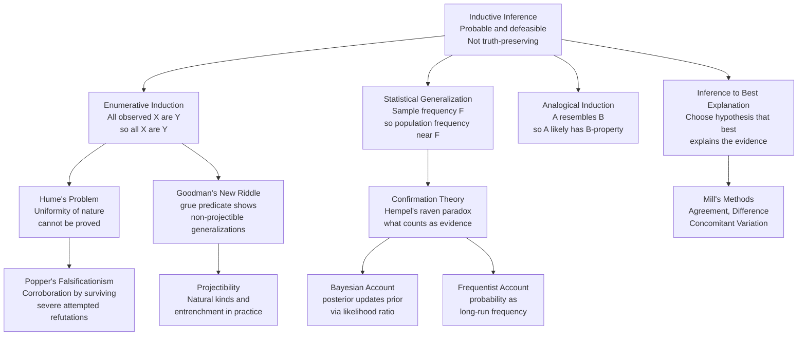

# Inductive Logic

> [!abstract] TL;DR
> Inductive logic studies inferences where premises make a conclusion probable but never certain — the fundamental mode of reasoning used by science, medicine, and everyday life. Unlike deductive arguments, an inductively strong argument can be overturned by a single new observation, which raises deep philosophical problems about how any finite body of evidence can justify a universal generalization. Understanding the strengths, limits, and competing formalizations of inductive inference is essential for scientific thinking, data science, and critical evaluation of empirical claims.

---

## Intuition

**Analogy:** A restaurant critic visits a new pizza place five times over three months. Every visit the crust is perfect, the sauce is well-balanced, and the service is attentive. She writes in her review: "This restaurant consistently delivers excellent pizza." She has not eaten every pizza they have ever made — she never could. But the pattern across five visits makes her confident enough to generalize. Now imagine on her sixth visit she discovers the head chef quit and the new pizza is mediocre. Her earlier generalization was not false when she made it — it was *well-supported by the evidence available* — but it was always provisional. That provisionality is the defining feature of inductive logic.

In formal terms: inductive inference moves from observed instances to general conclusions or predictions. Unlike deduction, a valid inductive argument does not *guarantee* its conclusion even when all premises are true. Strength comes in degrees, depends on sample size and diversity, and can always be defeated by future evidence.

---

## How It Works

### Core Mechanics

**Inductive vs. Deductive Strength:**

Deductive arguments are evaluated as valid/invalid — the conclusion either must follow or it does not, full stop. Inductive arguments are evaluated as *strong* or *weak*: a strong inductive argument is one where the premises make the conclusion highly probable, and a *cogent* inductive argument is a strong one with true premises. This shift from necessity to probability is not a weakness — it is the appropriate epistemic relationship between finite evidence and universal claims.

**Enumerative Induction:**

The simplest and most ancient form: observe a sequence of instances, then project the pattern to all cases.

> Observe: swan-1 is white, swan-2 is white, ..., swan-1000 is white.
> Conclude: All swans are white.

The inference is stronger when (a) the sample is large, (b) the sample is diverse (different regions, seasons, ages), and (c) no disconfirming instances have been observed. It is weaker when the sample is small, biased, or cherry-picked. The fatal limitation: no finite number of confirming instances logically entails the universal generalization. One black swan defeats it.

**Statistical Generalization:**

A more careful form: rather than claiming *all* X are Y, claim that a certain *proportion* of X are Y, with a confidence interval derived from sample statistics.

> In a random sample of 800 voters, 54% preferred Candidate A.
> Therefore, approximately 54% of all voters prefer Candidate A, ± 3.5 percentage points.

Statistical generalizations explicitly acknowledge uncertainty and are governed by the mathematics of sampling distributions and confidence intervals.

**Hume's Problem of Induction:**

David Hume (1748) posed the deepest challenge to inductive logic. Any justification for induction either (a) appeals to deductive logic — but no deductive argument can prove that future cases will resemble past cases — or (b) appeals to past success of inductive reasoning — but that is circular: it uses induction to justify induction. This means the *uniformity of nature* — the assumption that the future will resemble the past — cannot be given a non-circular rational foundation. We rely on it pragmatically, but it is not provable. Hume's problem has never been solved to universal satisfaction; it remains a live issue in philosophy of science.

**Goodman's New Riddle of Induction:**

Nelson Goodman (1955) showed that Hume's problem has a second, more subtle dimension. Consider the predicate *grue*: an object is grue if it is green and observed before the year 2050, or blue and not observed before 2050. Every emerald observed so far is both green and grue. So by enumerative induction, we can conclude "All emeralds are green" and equally validly conclude "All emeralds are grue." But the second prediction means emeralds observed after 2050 will be blue — an absurd conclusion.

The lesson: not all predicates support inductive projection. Green is *projectible* (it corresponds to a natural kind, picks out a stable property); grue is *non-projectible* (it is gerrymandered around an arbitrary time boundary). Goodman argued that the right account of induction must explain which predicates are legitimate for projection, appealing to the concept of *entrenchment* — how deeply embedded in our actual practice of inductive generalization a predicate is.

**Mill's Methods of Causal Induction:**

John Stuart Mill (1843) systematized how we inductively identify causes from observations:

| Method | Core Idea | Example |
|--------|-----------|---------|
| **Agreement** | If all cases of the effect share one antecedent factor, that factor is the likely cause | All cholera patients drank from the same well |
| **Difference** | Compare two cases alike in all respects except one; the differing factor is the likely cause | Identical groups except one received the drug; drug group recovered |
| **Joint Method** | Combine Agreement and Difference for stronger causal attribution | Both conditions point to the same factor |
| **Concomitant Variation** | If increasing/decreasing X covaries with increasing/decreasing Y, X causally influences Y | More cigarettes smoked correlates with higher cancer rates |
| **Residues** | Subtract known causal contributions; the remainder points to an unknown cause | Unexplained orbital perturbation → hypothesize an unknown planet |

Mill's methods are proto-scientific methodology. Their weakness: they work cleanly only when there is a single causal factor and confounders are controlled. In messy real-world data, they are starting points rather than proofs.

**Inference to the Best Explanation vs. Enumerative Induction:**

Enumerative induction accumulates confirming instances. Inference to the best explanation (IBE, also called abduction) selects the hypothesis that, if true, would best explain the observed evidence. IBE is ampliative (it goes beyond the data), explanatory (it invokes theoretical structure), and unifying (one hypothesis explains many phenomena). The two approaches differ when the best explanation is a hypothesis not yet directly observed — IBE endorses it; strict enumerative induction cannot.

> Enumerative: Patients treated with penicillin have recovered in 200 trials. Therefore penicillin works.
> IBE: The best explanation for 200 recoveries is that penicillin kills the bacterial pathogen. Therefore penicillin kills the pathogen.

IBE supports richer scientific theorizing but introduces the risk of choosing elegant-but-false theories over ugly-but-true ones.

**Hempel's Raven Paradox and Confirmation Theory:**

Carl Hempel (1945) asked: what counts as evidence for a universal generalization? Consider "All ravens are black" — logically equivalent to "All non-black things are non-ravens." A white shoe is a confirming instance of "All non-black things are non-ravens," and therefore by equivalence, a confirming instance of "All ravens are black." This seems absurd — but Hempel argued it is technically correct: observing a white shoe does provide a tiny amount of confirmation for "All ravens are black." The paradox reveals that confirmation is more complex than naive intuition suggests: evidence is always confirmation of a claim *relative to background knowledge and the sample space*.

**Bayesian Confirmation Theory:**

The Bayesian response formalizes confirmation in terms of probability:

> Evidence E confirms hypothesis H if and only if P(H | E) > P(H).

The posterior probability of H given evidence E is computed by Bayes' theorem:

```
P(H | E) = P(E | H) × P(H) / P(E)
```

Under the Bayesian framework, the raven paradox dissolves: a white shoe raises P(all ravens black) by an infinitesimal amount — technically confirming, but trivially so, because P(shoe observed | all ravens black) is effectively the same as P(shoe observed | not all ravens black).

Bayesianism accounts for the *degree* of confirmation, handles prior beliefs explicitly, and updates continuously with new evidence. Its main challenges: the choice of prior probability can be subjective; specifying the likelihood function requires modeling commitments.

**Frequentist Account:**

Frequentism grounds probability in long-run relative frequencies of outcomes in repeatable experiments. Inductive support is measured by p-values, confidence intervals, and significance tests. It avoids subjective priors but cannot naturally express degrees of belief in one-off hypotheses (e.g., "What is the probability that dark matter exists?") and does not provide a mechanism for accumulating inductive support across studies.

**Popper's Falsificationism and Corroboration:**

Karl Popper rejected the entire project of justifying induction. His solution to Hume: science does not proceed by induction at all. Scientists propose bold, falsifiable conjectures and attempt to refute them through experiments. A hypothesis that survives severe testing is *corroborated* — not confirmed. Corroboration is not a probability and does not accumulate into certainty; it is a measure of how well the hypothesis has so far withstood attempts to falsify it.

> "No number of positive outcomes at the level of experimental testing can confirm a scientific theory, but a single counterexample is logically decisive against it." — Popper

Popper's view solves Hume by eliminating induction from science, but it faces objections: scientists do make inductive predictions, prior probability influences research practice, and corroboration alone cannot explain why we should rely on well-corroborated theories for engineering decisions.

---

### Flow / Architecture



---

## Key Concepts

### Secondary

- **Inductive argument** — An argument where the premises are intended to make the conclusion probable, not certain. Contrast with deductive arguments, where valid form guarantees the conclusion.
- **Strong vs. weak induction** — A strong inductive argument is one where the premises genuinely make the conclusion highly probable. Weak inductive arguments offer little support. Strength is a spectrum, not binary.
- **Cogent argument** — A strong inductive argument all of whose premises are actually true; the inductive analogue of a sound deductive argument.
- **Enumerative induction** — The simplest form: generalize from observed instances to a universal claim. Strength depends on sample size and representativeness.
- **Hasty generalization** — The fallacy of drawing a broad inductive conclusion from an inadequate sample; one of the most common errors in everyday reasoning.
- **Uniformity of nature** — The background assumption that nature is regular enough for past patterns to license predictions about future events; presupposed by induction but not provable by it.

### Undergraduate

- **Hume's problem of induction** — Any justification for induction is either deductively invalid or viciously circular. The uniformity of nature is a habit of thought, not a rational necessity.
- **Projectible predicate** — A predicate that can legitimately be used in inductive generalizations because it corresponds to a real regularity or natural kind. "Green" is projectible; "grue" is not.
- **Grue paradox** — Goodman's demonstration that all the green emeralds we have observed equally confirm the grue hypothesis, exposing that confirmation theory must specify which predicates are eligible for projection.
- **Mill's Methods** — Five strategies for identifying causal relations from observation: Agreement, Difference, Joint Method, Concomitant Variation, and Residues. Precursor to modern experimental design.
- **Hempel's raven paradox** — Observing a white shoe technically confirms "All ravens are black" via logical equivalence; illustrates that confirmation depends on background knowledge and cannot be defined purely by instances.
- **Inference to the best explanation** — Choosing the hypothesis that best explains the evidence, balancing explanatory power, simplicity, unification, and fit. Richer than enumerative induction but introduces value judgments about what counts as a good explanation.
- **Falsifiability** — Popper's criterion for scientific hypotheses: a hypothesis is scientific only if it makes predictions that could, in principle, be shown to be false by observation.

### Graduate

- **Bayesian confirmation theory** — Treats degrees of belief as probabilities satisfying Kolmogorov's axioms; updates by Bayes' theorem; confirmation is defined as a rise in posterior probability. The framework dissolves many classical paradoxes but requires specifying priors.
- **Likelihood ratio** — The ratio P(E | H) / P(E | ¬H); the Bayesian measure of how much evidence E favors H over its negation. Values above 1 confirm H; values below 1 disconfirm it.
- **Prior sensitivity analysis** — Testing whether conclusions depend strongly on the choice of prior probability; a key diagnostic for Bayesian analyses in science and policy.
- **Corroboration** — Popper's non-probabilistic measure of how severely a hypothesis has been tested and not refuted. Corroboration is not inductive probability and should not be treated as the probability that the hypothesis is true.
- **Reference class problem** — In frequentist probability, the probability assigned to a single event depends on which reference class you use; there is no unique correct choice, undermining frequentist accounts of single-case induction.
- **Natural kinds and projectibility** — Induction works well for predicates that pick out natural kinds (electron, gold, tiger) because nature clusters properties in stable ways. Artificially gerrymandered predicates do not support reliable induction.
- **Eliminative induction** — Rather than accumulating confirming instances, systematically rule out alternatives until only one hypothesis remains. Used in controlled experiments and diagnosis; sidesteps some of Hume's challenges.
- **Enumerative vs. eliminative induction** — Enumerative accumulates positives; eliminative rules out competitors. Modern philosophy of science sees eliminative induction as more epistemically powerful in controlled settings.

---

## Python Demo

```python
import numpy as np
import matplotlib.pyplot as plt

# Demonstrate two core aspects of inductive logic empirically:
#   1. Convergence: running frequency estimate of a fair coin
#      approaches the true probability — but never certifies it
#   2. Black swan: a strong inductive generalization collapses
#      the moment a rare disconfirming instance appears

rng = np.random.default_rng(42)

# ---- Part 1: Inductive Convergence (Hume's empirical face) ----
N = 1000
true_p = 0.5
flips = rng.integers(0, 2, size=N)           # 0 = tails, 1 = heads
running_freq = np.cumsum(flips) / np.arange(1, N + 1)

# 95% confidence band via normal approximation
n_arr = np.arange(1, N + 1)
margin = 1.96 / np.sqrt(n_arr)

# ---- Part 2: Black Swan Scenario (Goodman / Hume's problem made vivid) ----
# Population: 97% white swans, 3% black swans
# Sample from this population; track running estimate of P(white)
N_swan = 300
p_black = 0.03
swans = rng.choice([0, 1], size=N_swan, p=[p_black, 1.0 - p_black])
running_white = np.cumsum(swans == 1) / np.arange(1, N_swan + 1)
black_indices = np.where(swans == 0)[0]

fig, axes = plt.subplots(1, 2, figsize=(13, 5))
fig.suptitle("Inductive Logic: Convergence and the Black Swan Problem", fontsize=13)

# Panel 1 — Coin flip convergence
axes[0].plot(n_arr, running_freq, lw=1.3, color="steelblue",
             label="Running estimate of P(Heads)")
axes[0].axhline(true_p, color="crimson", linestyle="--", lw=1.5,
                label=f"True probability = {true_p}")
axes[0].fill_between(n_arr,
                     np.clip(running_freq - margin, 0, 1),
                     np.clip(running_freq + margin, 0, 1),
                     alpha=0.15, color="steelblue", label="95% CI")
axes[0].set_xlabel("Number of coin flips")
axes[0].set_ylabel("Estimated P(Heads)")
axes[0].set_title("Hume: more data narrows uncertainty but never eliminates it")
axes[0].legend(fontsize=9)
axes[0].set_ylim(0, 1)

# Panel 2 — Black swan
axes[1].plot(np.arange(1, N_swan + 1), running_white, lw=1.3, color="goldenrod",
             label="Running P(white)")
axes[1].axhline(1.0, color="lightgray", linestyle=":", lw=1.2,
                label="Naive inductive limit: all swans are white")
if len(black_indices) > 0:
    first_black = int(black_indices[0]) + 1
    axes[1].axvline(first_black, color="black", linestyle="--", lw=1.5,
                    label=f"First black swan at obs {first_black}")
    drop_y = running_white[first_black - 1]
    axes[1].annotate(
        f"Black swan at obs {first_black}\nStrong generalization collapses",
        xy=(first_black, drop_y),
        xytext=(first_black + 25, 0.65),
        arrowprops=dict(arrowstyle="->", color="black", lw=1.2),
        fontsize=8
    )
axes[1].set_xlabel("Number of swans observed")
axes[1].set_ylabel("Estimated P(white)")
axes[1].set_title("Black Swan: inductive strength never implies truth")
axes[1].legend(fontsize=9)
axes[1].set_ylim(0.4, 1.05)

plt.tight_layout()
plt.savefig("inductive_logic_demo.png", dpi=120)
plt.show()

print(f"Coin flip | Final estimate: {running_freq[-1]:.4f}  True: {true_p}")
print(f"Swan sample | {int(np.sum(swans == 0))} black swans in {N_swan} observations")
if len(black_indices) > 0:
    print(f"First black swan at observation {first_black}; "
          f"prior to that, all {first_black - 1} observed swans were white.")
```

The left panel illustrates Hume's point: the running estimate converges toward the truth but always retains residual uncertainty — no finite sample logically entails the true value. The right panel shows the black swan: after many observations cementing a strong inductive generalization, a single disconfirming instance immediately falsifies the universal claim and forces a revision.

---

## Real-World Applications

1. **Clinical trials and evidence-based medicine.** A randomized controlled trial observes outcomes in a treatment group and a control group. The statistical generalization from the trial population to all patients is an inductive inference evaluated with confidence intervals and p-values. Mill's Method of Difference is the structural template: two groups identical except for treatment; the difference in outcomes is attributed to the treatment.

2. **Machine learning model training.** Every supervised learning algorithm is an induction machine: it generalizes from a finite training set to predictions on unseen data. Overfitting is the computational analog of hasty generalization — learning a pattern too specific to the sample; underfitting is the analog of a weak inductive conclusion. Train/test splits and cross-validation operationalize the inductive concern about whether the training instances represent the full distribution.

3. **Epidemiology and public health.** John Snow's 1854 identification of the Broad Street pump as the cholera source is a textbook application of Mill's Method of Agreement (all cases drank from that pump) and Method of Difference (those who did not drink from the pump did not contract cholera). The inference was inductive — Snow could not rule out every alternative — but it was strong enough to motivate removing the pump handle.

4. **Quality control and manufacturing.** Statistical process control uses sampling-based induction: test N items from a production batch; if the defect rate in the sample is below a threshold, accept the batch. The inference from sample defect rate to batch defect rate is a statistical generalization with explicitly quantified uncertainty.

5. **Scientific cosmology.** Conclusions about the large-scale structure of the universe, the composition of dark matter, or the rate of cosmic expansion rest on inductive generalizations from the observable universe to the whole. Popper's corroboration framework is particularly apt here: cosmological theories are assessed by how many independent, surprising predictions they have survived, not by how many confirming instances they have accumulated.

---

## Common Pitfalls

- **Hasty generalization** — Concluding from a sample that is too small, unrepresentative, or cherry-picked. Fix: demand larger and more diverse samples; ask whether the instances were randomly selected or selected to confirm.

- **Treating inductive strength as deductive certainty** — Saying "science has proven X" when the correct statement is "the evidence strongly supports X and no disconfirming evidence has been found." This conflation misleads the public and makes inductive conclusions seem fragile when they are later revised.

- **Confirmation bias masquerading as induction** — Selectively gathering confirming instances while ignoring disconfirmers. Hempel's ravens show that every non-black non-raven is technically evidence for "all ravens are black" — but genuine inductive practice requires actively searching for potential falsifiers, not just confirming instances.

- **Neglecting the reference class** — The strength of a statistical generalization depends entirely on whether the sample represents the population. Polling voters in a single city and generalizing to a country, or testing a drug only on middle-aged men and prescribing it to everyone, commits this error.

- **Using non-projectible predicates** — Building inductive generalizations around gerrymandered or arbitrary predicates produces conclusions that look valid but are not reliable. The lesson of grue: check whether the predicate picks out a stable, causally coherent kind rather than an arbitrary disjunction.

- **Mistaking corroboration for confirmation** — Popper's framework and Bayesian confirmation theory give different verdicts about what survived tests means. Treating a highly corroborated theory as certainly true runs ahead of the evidence; treating a Bayesian posterior as Popperian proof conflates distinct epistemic currencies.

- **The base rate fallacy** — Ignoring prior probability when interpreting evidence. A highly accurate diagnostic test for a rare disease produces mostly false positives because the prior probability of the disease is low. This is a failure to apply Bayesian updating correctly and is endemic in medical, legal, and intelligence reasoning.

---

## Related Concepts

- [[Logic_and_Critical_Thinking_Overview]] — The parent framework covering deduction, induction, and abduction and their roles in formal and informal logic; essential background for situating inductive logic among the modes of reasoning.
- [[Arguments_Validity_and_Soundness]] — Covers the deductive benchmarks of validity and soundness; understanding these precisely clarifies what inductive arguments deliberately fall short of and why that is appropriate rather than a defect.
- [[Propositions_and_Truth_Values]] — The logical treatment of statements and their truth conditions; inductive logic works with the same propositional units as deductive logic but changes the inferential relationship between premises and conclusion.
- [[Probability_and_Statistics]] — Bayesian and frequentist probability theory provide the formal language for measuring inductive strength; Bayes' theorem is the core update rule for Bayesian confirmation theory.
- [[Hypothesis_Testing]] — The frequentist operationalization of inductive inference in science and data analysis; p-values, confidence intervals, and power all encode inductive uncertainty about generalizations from samples.
- [[Cognitive_Biases]] — Empirical catalogue of ways human inductive reasoning systematically goes wrong: confirmation bias, availability heuristic, and representativeness heuristic are all failures of informal inductive inference that cognitive science has documented and quantified.

---

## Review Questions

### Secondary

1. What distinguishes a strong inductive argument from a valid deductive argument? Why does adding more confirming instances always increase inductive strength but never convert an inductive argument into a deductive one?
2. Give your own example of enumerative induction from everyday life. Identify the sample, the generalization, and at least one way the argument could be weakened.
3. A friend claims: "I've taken vitamin C every winter for ten years and never had the flu; therefore vitamin C prevents flu." Apply Mill's methods to explain why this is a weak inductive argument and describe what kind of evidence would make it stronger.

### Undergraduate

1. Hume argues that the uniformity of nature cannot be justified either deductively or inductively without circularity. Reconstruct his argument in two steps and explain why each possible escape route fails. Is there any satisfactory response, or must we simply accept that induction is a habit without rational foundation?
2. Goodman's grue paradox shows that not all predicates are projectible. Using the green/grue case, explain what makes a predicate projectible, and describe how Goodman's notion of "entrenchment" attempts to answer the new riddle of induction. What are the main objections to this answer?
3. Compare enumerative induction and inference to the best explanation on the following scenario: after 500 clinical trials, a drug reliably reduces symptoms. Does enumerative induction or IBE give a richer scientific conclusion? What does each framework commit you to that the other does not?

### Graduate

1. Bayesian confirmation theory says evidence E confirms hypothesis H if and only if the posterior P(H | E) exceeds the prior P(H). Explain how the Bayesian framework dissolves Hempel's raven paradox without eliminating it as a problem entirely. Does this dissolution satisfy you, or does it merely relocate the difficulty?
2. Popper claims that science proceeds by falsification rather than inductive confirmation, and that corroboration is not a probability. (a) What is the difference between corroboration and Bayesian posterior probability? (b) If Popper is right, can we rationally prefer one well-corroborated theory over another for making engineering decisions? What does this imply about the relationship between scientific knowledge and practical rationality?
3. The reference class problem undermines frequentist accounts of single-case probability. A doctor tells a patient: "Patients with your diagnosis have a 70% five-year survival rate." Explain the reference class problem in this context, describe how the Bayesian and frequentist frameworks each handle it, and argue for which framework gives a more actionable answer in clinical practice.

---

## Sources

- [Hume, D. *An Enquiry Concerning Human Understanding* (1748), Section IV — "Sceptical Doubts Concerning the Operations of the Understanding"](https://www.gutenberg.org/ebooks/9662)
- [Goodman, N. *Fact, Fiction, and Forecast*, 4th ed. Harvard University Press, 1983 — original 1955; introduces grue and the new riddle of induction](https://www.hup.harvard.edu/books/9780674290716)
- [Hempel, C.G. "Studies in the Logic of Confirmation," *Mind*, 54 (1945), pp. 1–26 and 97–121 — raven paradox and confirmation theory](https://www.jstor.org/stable/2250886)
- [Popper, K.R. *The Logic of Scientific Discovery*, Routledge, 2002 — original 1959; falsificationism, corroboration, and the asymmetry of confirmation and refutation](https://www.routledge.com/The-Logic-of-Scientific-Discovery/Popper/p/book/9780415278447)
- [Salmon, W.C. *The Foundations of Scientific Inference*, University of Pittsburgh Press, 1967 — surveys Hume's problem, frequentism, Bayesianism, and Popper's solution](https://press.uchicago.edu/ucp/books/book/distributed/F/bo28305853.html)

---

#logic #inductive-logic #induction #reasoning #probability
