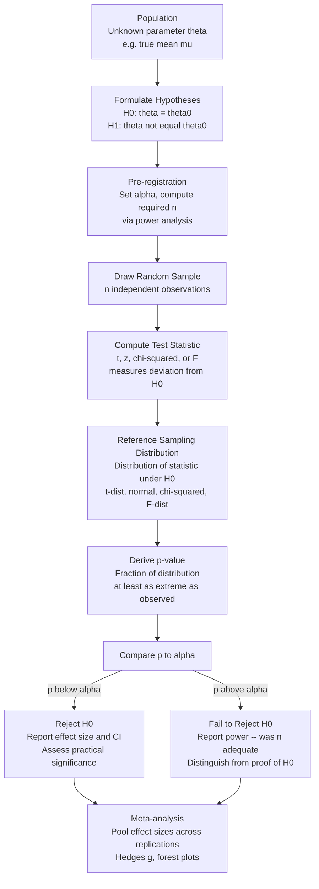

# Statistical Inference and Hypothesis Testing

> [!abstract] TL;DR
> Statistical inference is the principled process of drawing conclusions about a population from a finite sample — it is inductive reasoning formalized with probability. Null Hypothesis Significance Testing (NHST) provides a decision procedure for this process, but its p-value machinery is so widely misunderstood and misused that it has become a central contributor to the replication crisis in science. Understanding the correct interpretation, the alternatives, and the limitations is as important as knowing how the machinery works.

---

## Intuition

**Analogy:** A courtroom operates on the presumption of innocence. The prosecution does not have to prove the defendant is innocent — the defence does not have to prove innocence either. The burden of proof falls on the prosecution: they must provide evidence so strong that the jury concludes the innocent-by-default story is implausible. The jury never declares the defendant "proven innocent" — only "not guilty," meaning the evidence was insufficient to overturn the default presumption.

Statistical hypothesis testing works the same way. The null hypothesis (H₀) plays the role of the presumption of innocence: the boring, default story that nothing is happening. The data play the role of the prosecution's evidence. The p-value is the formal measure of how implausible the "nothing is happening" story becomes in light of the data. And just like a jury, you can only "reject H₀" or "fail to reject H₀" — you never "prove H₀ is true."

The critical difference from a real courtroom: the jury's verdict directly concerns the defendant. The p-value only concerns the data, not the hypothesis — a subtle distinction that trips up nearly every practitioner who encounters statistics for the first time.

---

## How It Works

### Core Mechanics

#### Population, Sample, Parameter, Statistic

The entire inferential project begins with a conceptual distinction that is easy to state but easy to blur in practice:

- **Population:** The complete set of all units of interest (every human adult, every transaction, all possible trials of an experiment). Typically unknowable in its entirety.
- **Sample:** A finite, observed subset drawn from the population.
- **Parameter:** A fixed (but unknown) numerical characteristic of the population — e.g., true mean μ, true proportion p, true standard deviation σ.
- **Statistic:** A number computed from the sample — e.g., sample mean x̄, sample proportion p̂, sample standard deviation s. Statistics are observable; parameters are not.

The fundamental problem of inference is: how much can we trust a statistic as an estimate of a parameter? The answer depends on sampling variability — the fact that different samples from the same population would produce different statistics. The **sampling distribution** of a statistic (the distribution of all values it would take across infinitely many samples) is the mathematical bridge between sample and population.

The **Central Limit Theorem** guarantees that the sampling distribution of the mean converges to a normal distribution as n grows, regardless of the population shape. This is why normal-based tests are so broadly applicable.

#### The NHST Framework

1. **State H₀ (null hypothesis):** The default, conservative claim — usually "no effect," "no difference," or "parameter equals reference value." Example: H₀: μ_A = μ_B.

2. **State H₁ (alternative hypothesis):** The claim you are investigating. H₁ can be one-sided (μ_A > μ_B) or two-sided (μ_A ≠ μ_B). The choice must be made *before* seeing the data; choosing post-hoc based on the data inflates the false-positive rate.

3. **Set α (significance level):** The probability of rejecting H₀ when it is actually true (Type I error rate). Conventional value: 0.05. This threshold must be pre-registered before data collection.

4. **Compute the test statistic:** A number that measures how far the observed data deviate from what H₀ predicts, normalized by sampling variability. For comparing two means: the Welch t-statistic t = (x̄₁ - x̄₂) / SE, where SE is the standard error of the difference.

5. **Derive the p-value:** Under the assumption that H₀ is true, what fraction of all possible samples would produce a test statistic at least as extreme as the one observed? That fraction is the p-value.

6. **Make the decision:** If p < α, reject H₀. If p ≥ α, fail to reject H₀.

> [!warning] The p-value is not what most people think
> - p-value IS: P(observing data this extreme or more extreme | H₀ is true) — a conditional probability about the data.
> - p-value is NOT: P(H₀ is true | this data) — the probability the null is true.
> - p-value is NOT: The probability the result is due to chance.
> - p < 0.05 is NOT evidence that the effect is large or important.
> - p ≥ 0.05 is NOT evidence that H₀ is true; it means only that you lack sufficient evidence to reject it.

#### Type I and Type II Errors

Every binary decision under uncertainty admits two types of error:

| | H₀ Actually True | H₀ Actually False |
|---|---|---|
| **Reject H₀** | Type I Error (False Positive) — rate = α | Correct Detection — rate = Power |
| **Fail to Reject H₀** | Correct Non-Detection — rate = 1 - α | Type II Error (False Negative) — rate = β |

- **α** (significance level): The maximum acceptable Type I error rate. Reducing α makes rejections rarer and more trustworthy, but increases β.
- **β** (Type II error rate): The probability of missing a real effect. Conventionally tolerated at 0.20 (i.e., 80% power).
- **Power (1 - β):** The probability of correctly detecting a true effect. Power depends on three quantities: effect size, sample size, and α. You can only achieve the desired power by choosing n large enough before collecting data — a **power analysis**.

#### Effect Size and the Distinction Between Statistical and Practical Significance

Statistical significance (p < α) tells you whether an effect is detectable given your sample size. It says nothing about the effect's magnitude or practical importance. A dataset of n = 1,000,000 will detect a 0.001-unit difference as statistically significant even if the difference is economically or scientifically irrelevant.

**Cohen's d** standardises the difference between two group means by the pooled standard deviation:
```
d = (μ₁ - μ₂) / s_pooled
```

Cohen's (1988) conventional benchmarks: d = 0.2 (small), 0.5 (medium), 0.8 (large). These are discipline-independent defaults; in high-stakes domains (medicine), even d = 0.2 may be practically significant.

Other effect size measures: eta-squared (η²) for ANOVA, Cramér's V for chi-square tests, Pearson r for correlations, odds ratio and risk ratio for binary outcomes.

**Always report both p-value and effect size.** A complete report states: "The difference was statistically significant (t(78) = 2.94, p = 0.004) with a medium effect size (d = 0.65, 95% CI [0.22, 1.08])."

#### Confidence Intervals

A 95% confidence interval (CI) for a parameter is a range computed so that, if you repeated the procedure across infinitely many independent samples, 95% of the intervals would contain the true parameter value.

Common misinterpretation: "There is a 95% probability the true mean falls in this interval." This is wrong. The interval either contains the true value or it does not; the probability refers to the procedure, not the specific interval in hand.

CIs and two-tailed hypothesis tests are mathematically equivalent at the same α: if the 95% CI for (μ₁ - μ₂) excludes zero, you would reject H₀: μ₁ = μ₂ at α = 0.05. CIs are generally more informative than binary p-value decisions because they display the range of plausible effect magnitudes.

### Flow / Architecture — The NHST Inference Pipeline



---

## Key Concepts

### Secondary Level

- **Population vs. sample:** You measure a sample because the full population is too large. The sample gives you an estimate; the population holds the truth.
- **Parameter vs. statistic:** The population mean μ is unknown and fixed. The sample mean x̄ is observable but varies from sample to sample.
- **Null and alternative hypotheses:** H₀ is the default sceptical claim ("no effect"). H₁ is the claim under investigation ("there is an effect").
- **p-value in plain English:** If nothing were actually going on, how surprising would your data be? A very small p means your data would be very surprising under the "nothing is going on" story.
- **α = 0.05 convention:** By convention (and not natural law), scientists typically require the data to be surprising at least 1 in 20 times before rejecting the null. This threshold is arbitrary.

### Undergraduate Level

- **Sampling distribution and the CLT:** Every statistic has a sampling distribution. The CLT guarantees that x̄ is approximately normal for large n, which is why t-tests work even on non-normal data when n is large.
- **t-statistic mechanics:** t = (x̄ - μ₀) / (s / √n). It measures observed deviation from H₀ in units of standard errors. Under H₀, it follows a t-distribution with n-1 degrees of freedom.
- **Type I and Type II errors — the trade-off:** Setting α = 0.01 instead of 0.05 reduces false positives but increases false negatives. The only way to reduce both simultaneously is to increase n or the true effect size.
- **Power analysis before data collection:** Use the formula n = 2(z_{α/2} + z_β)² σ² / δ² to determine the sample size required to detect a minimum effect δ with desired power. Running an experiment without this step is methodologically indefensible.
- **Cohen's d and practical significance:** Statistical significance is not the same as practical importance. Always compute and report d (or another effect size) alongside p.
- **Confidence intervals:** A 95% CI gives the range of parameter values compatible with the data. It is more informative than a p-value and should be the primary reported result.
- **Bonferroni correction:** When testing m hypotheses simultaneously, use α / m per test to keep the family-wise error rate at α. Running 20 tests at α = 0.05 without correction expects roughly one false positive even if all nulls are true.

### Graduate Level

- **Neyman-Pearson framework vs. Fisher's approach:** Fisher invented the p-value as a continuous measure of evidence. Neyman and Pearson developed the decision-theoretic framework with pre-specified α, β, and H₁ — the modern NHST is an uncomfortable hybrid of both views that neither founder would have endorsed fully.
- **Bayes factors as a Bayesian alternative:** Instead of p(data | H₀), compute BF₁₀ = P(data | H₁) / P(data | H₀) — how many times more probable the data are under H₁ than under H₀. BF₁₀ > 10 is considered strong evidence for H₁; BF₁₀ < 1/10 is strong evidence for H₀. Unlike p-values, Bayes factors can provide evidence *for* the null, not just fail to reject it.
- **The replication crisis and p-value criticism:** Simmons, Nelson and Simonsohn (2011) demonstrated that "researcher degrees of freedom" — undisclosed flexibility in data collection, analysis, and reporting — allow nearly any hypothesis to be supported at p < 0.05. The Open Science Collaboration (2015) found that only ~36% of 100 psychology studies replicated at p < 0.05. Root causes: publication bias toward positive results, underpowered studies, p-hacking, HARKing. Benjamin et al. (2018) proposed shifting the default threshold to α = 0.005; Lakens et al. (2018) countered that the threshold should be justified, not moved arbitrarily.
- **False Discovery Rate (FDR) vs. Family-Wise Error Rate (FWER):** Bonferroni controls FWER (probability of any false positive). Benjamini-Hochberg (1995) controls FDR (expected proportion of discoveries that are false). For large-scale discovery contexts (genomics, neuroimaging, feature selection), FDR control preserves more power while still bounding the proportion of false leads.
- **Sequential testing and the peeking problem:** Checking results at multiple time points and stopping when p < 0.05 inflates the actual false-positive rate to ~26% at α = 0.05. Alpha-spending functions (O'Brien-Fleming, Pocock) and always-valid inference (e-values, Johari et al. 2022) allow valid inference under continuous monitoring.
- **Meta-analysis and effect sizes:** Individual studies are underpowered; meta-analysis pools effect sizes (Hedges' g is the bias-corrected version of Cohen's d) across replications, weighting by precision. A forest plot displays each study's effect and CI; the diamond at the bottom shows the pooled estimate. Meta-analytic power is much higher than any single study. The I² statistic measures heterogeneity across studies: I² > 75% suggests the studies are measuring different underlying effects.
- **Statistical vs. practical significance distinction:** The American Statistical Association (2016) statement on p-values explicitly states: "Statistical significance is not equivalent to scientific, human, or economic significance." Effect sizes, confidence intervals, and cost-benefit analysis must drive decisions, not p-value thresholds alone.

---

## Python Demo

```python
import numpy as np
import matplotlib.pyplot as plt
from scipy import stats

# Demonstrate NHST: two-sample Welch t-test
# Visualise the sampling distribution with critical region shaded
# Plot a power curve showing Type II error as a function of effect size

rng = np.random.default_rng(42)

# --- 1. Generate two sample groups ---
n_per_group = 40
true_mu_A = 0.0
true_mu_B = 0.5       # Cohen's d = 0.5 (medium effect)
true_sigma = 1.0

group_A = rng.normal(true_mu_A, true_sigma, n_per_group)
group_B = rng.normal(true_mu_B, true_sigma, n_per_group)

# --- 2. Compute t-statistic manually (Welch variant) ---
x_bar_A = group_A.mean()
x_bar_B = group_B.mean()
s_A = group_A.std(ddof=1)
s_B = group_B.std(ddof=1)

se = np.sqrt(s_A**2 / n_per_group + s_B**2 / n_per_group)
t_stat_manual = (x_bar_B - x_bar_A) / se

# Welch-Satterthwaite degrees of freedom
numerator = (s_A**2 / n_per_group + s_B**2 / n_per_group)**2
denominator = ((s_A**2 / n_per_group)**2 / (n_per_group - 1) +
               (s_B**2 / n_per_group)**2 / (n_per_group - 1))
df_welch = numerator / denominator

# Two-tailed p-value from t-distribution
p_manual = 2 * stats.t.sf(abs(t_stat_manual), df=df_welch)

# Cross-check with scipy
t_scipy, p_scipy = stats.ttest_ind(group_A, group_B, equal_var=False)

# Cohen's d (effect size)
s_pooled = np.sqrt((s_A**2 + s_B**2) / 2)
cohens_d = (x_bar_B - x_bar_A) / s_pooled

print("--- Two-Sample Welch t-test ---")
print(f"Manual:  t = {t_stat_manual:.4f}, p = {p_manual:.4f}, df = {df_welch:.1f}")
print(f"scipy:   t = {t_scipy:.4f},  p = {p_scipy:.4f}")
print(f"Cohen's d = {cohens_d:.4f}  (true d = {true_mu_B / true_sigma:.2f})")
print(f"Reject H0 at alpha=0.05? {'Yes' if p_manual < 0.05 else 'No'}")

# --- 3. Visualise sampling distribution with critical region shaded ---
alpha = 0.05
t_crit = stats.t.ppf(1 - alpha / 2, df=df_welch)
t_range = np.linspace(-5.0, 5.0, 600)
pdf_vals = stats.t.pdf(t_range, df=df_welch)

fig, axes = plt.subplots(1, 2, figsize=(14, 5))
fig.suptitle("NHST: Sampling Distribution and Power Curve", fontsize=13)

ax1 = axes[0]
ax1.plot(t_range, pdf_vals, color="steelblue", lw=2.5,
         label="t-distribution under H0")

# Critical regions (rejection zones)
ax1.fill_between(t_range, pdf_vals,
                 where=(t_range >= t_crit),
                 color="crimson", alpha=0.45,
                 label=f"Critical region (alpha/2 each tail)")
ax1.fill_between(t_range, pdf_vals,
                 where=(t_range <= -t_crit),
                 color="crimson", alpha=0.45)

# Observed test statistic
ax1.axvline(t_stat_manual, color="darkgreen", lw=2.2, linestyle="--",
            label=f"Observed t = {t_stat_manual:.3f} (p = {p_manual:.3f})")
ax1.axvline(-t_crit, color="crimson", lw=1.2, linestyle=":")
ax1.axvline(t_crit, color="crimson", lw=1.2, linestyle=":")

ax1.annotate(f"t_crit = {t_crit:.2f}", xy=(t_crit, 0.02),
             xytext=(t_crit + 0.4, 0.10), fontsize=8,
             arrowprops=dict(arrowstyle="->", color="crimson"), color="crimson")

ax1.set_xlabel("t-statistic", fontsize=11)
ax1.set_ylabel("Probability Density", fontsize=11)
ax1.set_title("Sampling Distribution Under H0\n"
              "Red = rejection region; green = observed statistic", fontsize=10)
ax1.legend(fontsize=8)
ax1.set_xlim(-5, 5)

# --- 4. Power curve: power and beta as a function of Cohen's d ---
effect_sizes = np.linspace(0.0, 1.5, 200)
n_fixed = n_per_group
alpha_fixed = 0.05

# Normal approximation to power (large-sample):
# non-centrality parameter delta = d * sqrt(n/2)
z_crit = stats.norm.ppf(1 - alpha_fixed / 2)

powers = np.array([
    1 - stats.norm.cdf(z_crit - d * np.sqrt(n_fixed / 2)) +
    stats.norm.cdf(-z_crit - d * np.sqrt(n_fixed / 2))
    for d in effect_sizes
])
type_II_errors = 1 - powers

ax2 = axes[1]
ax2.plot(effect_sizes, powers, color="steelblue", lw=2.5,
         label="Power = 1 - beta (probability of detecting true effect)")
ax2.plot(effect_sizes, type_II_errors, color="crimson", lw=2.5, linestyle="--",
         label="Type II error rate = beta (missed detections)")

# Reference lines
ax2.axhline(0.80, color="gray", lw=1.5, linestyle=":",
            label="80% power threshold (conventional)")
ax2.axhline(alpha_fixed, color="orange", lw=1.5, linestyle="-.",
            label=f"alpha = {alpha_fixed} (Type I error rate)")

# Mark the current study's observed Cohen's d
ax2.axvline(abs(cohens_d), color="darkgreen", lw=1.8, linestyle="--",
            label=f"Observed d = {abs(cohens_d):.2f}")

ax2.set_xlabel("Effect Size (Cohen's d)", fontsize=11)
ax2.set_ylabel("Probability", fontsize=11)
ax2.set_title(f"Power Curve: n = {n_fixed} per group, alpha = {alpha_fixed}", fontsize=10)
ax2.legend(fontsize=8)
ax2.set_ylim(0, 1.05)
ax2.set_xlim(0, 1.5)

plt.tight_layout()
plt.savefig("nhst_demo.png", dpi=150, bbox_inches="tight")
plt.show()
```

**Reading the output:** The left panel shows the t-distribution under H₀; red shaded tails are the 5% of the distribution that would trigger rejection. If the observed t (green dashed line) falls inside the red region, H₀ is rejected. The right panel shows how power rises and Type II error falls as the true effect size grows — with n = 40 per group and α = 0.05, you have 80% power to detect d ≈ 0.63, meaning smaller true effects will frequently be missed.

---

## Real-World Applications

**1. Drug trial regulatory approval (FDA, EMA)**
A Phase III randomized controlled trial compares a new antihypertensive drug to placebo across 500 patients per arm. The primary endpoint is change in systolic blood pressure at 12 weeks. The FDA requires p < 0.05 on the primary endpoint, but the NDA (New Drug Application) must also report Cohen's d and the 95% CI. A reduction of 2 mmHg is statistically significant at n = 500 but clinically meaningless (standard threshold for clinically meaningful reduction is 5-10 mmHg). Regulatory statisticians inspect both.

**2. Google and online experiment platforms**
Google runs thousands of simultaneous A/B experiments on Search and Ads. Each experiment uses pre-computed sample sizes from power analysis, and results go through Benjamini-Hochberg FDR correction across the experiment portfolio. Google's ExP platform (and similar systems at Airbnb, Netflix, and LinkedIn) also implement always-valid inference using e-values to allow safe monitoring at any point during a running experiment without inflating the false-positive rate.

**3. Genome-Wide Association Studies (GWAS)**
A single GWAS tests whether each of ~10 million single-nucleotide polymorphisms (SNPs) is associated with a disease. Using α = 0.05 would produce 500,000 false positives. The field uses a Bonferroni-corrected threshold of p < 5 × 10⁻⁸ (accounting for ~1 million independent tests after LD pruning). Effect sizes are typically small (OR 1.05-1.2) but robust across replications due to enormous n (often > 100,000 participants).

**4. The replication crisis — psychology and social science**
The Open Science Collaboration (2015) attempted to replicate 100 published psychology studies. Only 36-39% replicated at p < 0.05. Many original studies had small n (around 30-50 per group), were underpowered for the effect sizes they sought, and were selected for publication precisely because they achieved p < 0.05 — a selection effect that inflates published effect sizes (the "winner's curse"). This prompted pre-registration platforms (AsPredicted, OSF), registered reports (journal commits to publish regardless of outcome), and a push toward larger, multi-site collaborative replications.

**5. Meta-analysis in evidence-based medicine**
A Cochrane Review of cognitive-behavioural therapy for depression might pool k = 35 randomized trials with sample sizes ranging from 20 to 300. Rather than a single p-value, the meta-analysis computes a pooled Hedges' g (bias-corrected standardized mean difference) with a 95% CI, tests for heterogeneity (I²), and examines publication bias via funnel plots and Egger's test. A pooled g = 0.40 [0.28, 0.52] with I² = 32% (low heterogeneity) is far stronger evidence than any individual study regardless of individual p-values.

---

## Common Pitfalls

- **Misinterpreting the p-value as P(H₀ is true)** — This is the prosecutor's fallacy applied to statistics. P(data | H₀) is not the same as P(H₀ | data). The latter requires Bayes' theorem and a prior over hypotheses, which NHST deliberately avoids. Treating p = 0.03 as "3% probability the null is true" leads to systematically overconfident conclusions.

- **p-hacking and researcher degrees of freedom** — Collecting data until p < 0.05 appears, trying multiple outcome variables, sub-groups, or covariate adjustments, and reporting only the version that worked. Each additional analysis is an unaccounted-for test; the nominal α = 0.05 no longer applies. Simmons et al. (2011) showed that even with just four undisclosed flexibility points, the true false-positive rate reaches 60%. Fix: pre-register the full analysis plan before seeing data.

- **Underpowered studies and the "negative result" fallacy** — A study that fails to reject H₀ at p = 0.40 with n = 15 per group is not evidence that the effect is absent; it is uninformative — the study was too small to detect most plausible effects. "Absence of evidence is not evidence of absence" (Altman and Bland, 1995). Report the achieved power and the smallest effect size the study could detect at 80% power.

- **Ignoring practical significance** — p < 0.001 with n = 500,000 and d = 0.03 is a real but negligible effect. Statistical significance is a statement about evidence strength given sample size, not about effect magnitude. Always accompany every p-value with an effect size and CI; let domain expertise define the threshold for practical importance.

- **The multiple comparisons problem — naively running many tests** — Testing 50 genetic markers, 12 questionnaire subscales, or 8 dosage groups without correction inflates the false-positive rate sharply. At α = 0.05 and m = 20 independent tests, the expected number of spurious rejections is 1, and the probability of at least one is 64%. Apply Bonferroni (conservative, controls FWER) or Benjamini-Hochberg (more powerful, controls FDR) as appropriate.

- **Treating α = 0.05 as a law of nature** — The 0.05 threshold was described by Fisher as a rough heuristic, not a universal law. In safety-critical settings (aviation, oncology), α = 0.001 or stricter is warranted. In exploratory discovery settings (early-stage feature selection), α = 0.10 or FDR = 0.20 may be more appropriate. The threshold should be chosen to balance Type I and Type II error costs in the specific context.

- **Conflating the frequentist CI with a Bayesian credible interval** — A 95% CI is not "95% probability the parameter is in this range." That statement describes a Bayesian 95% credible interval, which requires a prior. The frequentist CI is a statement about the procedure: 95% of intervals constructed this way will contain the true value. For most practical decisions the distinction is minor, but it matters when communicating uncertainty to non-statisticians.

---

## Related Concepts

- [[Logic_and_Critical_Thinking_Overview]] — NHST is a formalisation of inductive reasoning; the epistemological debate between frequentists and Bayesians mirrors broader debates in logic about the justification of inductive inference.

- [[Hypothesis_Testing]] — The practitioner-focused companion note covering test selection (t-test, ANOVA, chi-square, Mann-Whitney), multiple testing corrections, A/B testing, sequential testing, and code examples in the ML engineering context.

- [[Probability_and_Statistics]] — Foundational mathematical substrate: sampling distributions, CLT, Bayes' theorem, MLE, and MAP — all of which underpin the mechanics of every test statistic and p-value derivation.

- [[EDA_Exploratory_Data_Analysis]] — EDA precedes hypothesis testing: distributional shape, outliers, and violated assumptions (non-normality, heteroscedasticity) discovered in EDA determine which test is appropriate and whether parametric assumptions hold.

---

## Review Questions

**Conceptual:**
1. A researcher reports p = 0.048 and concludes "there is a 4.8% probability the null hypothesis is true." Identify the precise logical error, explain what the p-value actually measures, and describe what additional information would be needed to make any statement about the probability that the null is true.

**Scenario:**
2. A nutritional supplement company conducts a clinical trial with n = 30 per arm, finds p = 0.06 for their primary endpoint, then re-analyses using a one-sided test (p = 0.03), removes two "outlier" participants to get p = 0.04, and reports "marginal significance." Diagnose each methodological problem, explain how each inflates the false-positive rate, and describe how a pre-registered analysis plan would have prevented each issue.

**Trade-off:**
3. You are designing an experiment to detect whether a new UI change increases checkout conversion from 8% to 10% (an absolute difference of 2 percentage points). You have a budget that allows either 500 users per arm (quick, cheap) or 3,000 users per arm (slow, expensive). Compute or estimate the power under each scenario at α = 0.05. If the experiment with n = 500 yields p = 0.11, what would you conclude and why? What would you recommend as the next step rather than immediately re-running the test until significance appears?

---

## Sources

- [Fisher, R.A. (1925) — Statistical Methods for Research Workers](https://psychclassics.yorku.ca/Fisher/Methods/)
- [Cohen, J. (1988) — Statistical Power Analysis for the Behavioral Sciences, 2nd ed.](https://www.taylorfrancis.com/books/mono/10.4324/9780203771587/statistical-power-analysis-behavioral-sciences-jacob-cohen)
- [Simmons, J., Nelson, L., and Simonsohn, U. (2011) — False-Positive Psychology, Psychological Science](https://doi.org/10.1177/0956797611417632)
- [Open Science Collaboration (2015) — Estimating the Reproducibility of Psychological Science, Science](https://doi.org/10.1126/science.aac4716)
- [Wasserstein, R. and Lazar, N. (2016) — The ASA Statement on p-values, The American Statistician](https://doi.org/10.1080/00031305.2016.1154108)

---

#logic #statistics #hypothesis-testing #inference #p-value
