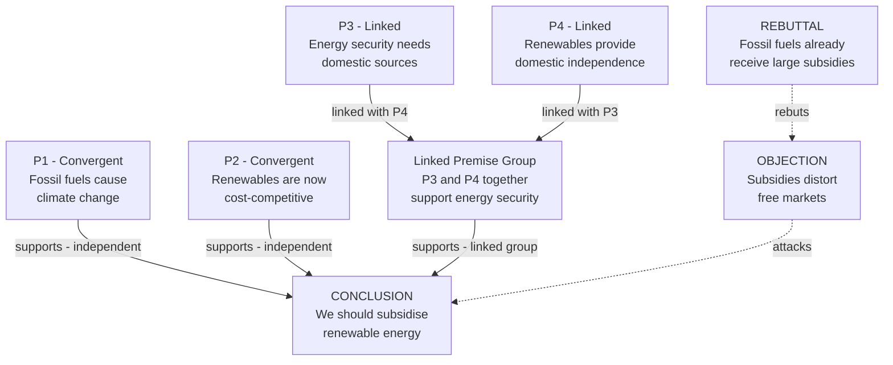

# Argument Mapping and Diagramming

> [!abstract] TL;DR
> An argument map is a visual representation of the logical structure of an argument — nodes represent claims and premises, directed edges represent support or attack relations — making invisible inferential architecture visible so that gaps, hidden assumptions, and structural weaknesses can be spotted at a glance. Developed systematically by Monroe Beardsley in 1950 and extended through Toulmin's functional model, Walton's argumentation schemes, and modern software tools, argument mapping is the most practical bridge between formal logic and everyday reasoning. It has become indispensable in legal analysis (Wigmore charts), science education (hypothesis trees), philosophy pedagogy, and AI argument mining.

---

## Intuition

**Analogy:** A city planner looking at a dense neighbourhood sees a tangle of roads, back alleys, and dead ends. A road map does not add new roads — it makes the existing network visible so the planner can immediately spot where traffic bottlenecks form, which streets are dead ends, and which intersections carry the most load. An argument map does the same thing for reasoning: the argument existed in the original text, buried in paragraphs and inference-indicator words ("because," "therefore," "however"). The map externalises it — turns it into a diagram where every claim, every premise, and every attack is a visible node or edge.

When you draw an argument map of a complex editorial, legal ruling, or scientific paper, three things happen reliably: you discover premises the author left unstated, you see which conclusion depends on the most debatable support, and you find attack points the author never addressed. The map does not evaluate the argument — it makes evaluation possible.

---

## How It Works

### Core Mechanics

**Step 1 — Identify the main conclusion.** Every argument has one (or a small number of) final claim(s) being argued for. Inference indicators signal it: *therefore, thus, hence, it follows that, so, consequently.* In argument maps, the main conclusion is conventionally placed at the top of the diagram.

**Step 2 — Identify premises.** Premises are statements offered as reasons or evidence for the conclusion. They are signalled by: *because, since, given that, for the reason that, as shown by.* Each premise becomes a separate node.

**Step 3 — Classify premise structure.** This is the most important diagramming decision:
- **Convergent (independent) premises:** each premise supports the conclusion independently. If P1 is shown to be false, P2 still provides some support. Both arrows point directly to the conclusion.
- **Linked premises:** two or more premises must *work together* to support the conclusion; neither does so alone. They are connected first to a bracket (or intermediate node) and then to the conclusion as a unit.
- **Serial (chain) structure:** the conclusion of one sub-argument becomes the premise of the next, forming a vertical chain.
- **Divergent structure:** one premise supports multiple distinct conclusions.

**Step 4 — Add objections and rebuttals.** Objections are claims that, if true, would undermine or defeat the conclusion (or a premise). Rebuttals attack objections, potentially *reinstating* the original conclusion. This mirrors Dung's abstract argumentation attack relations. Support edges are typically drawn as solid arrows; attack edges as dashed arrows.

**Step 5 — Surface hidden premises (enthymemes).** Natural language arguments suppress premises the author considers obvious. Mapping forces you to make these explicit — the map is incomplete if an arrow has no visible justification. The hidden premise is often where the argument is most vulnerable.

---

### Argument Map Notation: Beardsley's System (1950)

Monroe Beardsley introduced the first systematic notation in *Practical Logic* (1950). He used numbered propositions and arrows showing inferential direction. A circled number for each statement, arrows from supporting statements toward the supported statement:

```
  ①   ②      ③  ④
   \  /        |  |
    ③          ⑤  (linked)
     \          |
      ⑥ (main conclusion)
```

Modern software (Rationale, OVA, Argue-It) extends this with colour, node types, and explicit attack relations.

---

### Flow / Architecture



The diagram illustrates three premise structures simultaneously: P1 and P2 are **convergent** (each independently supports C, so defeating one still leaves the other standing); P3 and P4 are **linked** (neither alone establishes the energy-security argument — they route through the LP bracket node); O1 **attacks** C via a dashed edge; and R1 **reinstates** C by attacking O1, modelling Dung's reinstatement phenomenon.

---

## Key Concepts

### Secondary

- **Inference indicator words** — words that signal the direction of an inference. *Premise indicators:* because, since, given that, for the reason that, as evidenced by. *Conclusion indicators:* therefore, thus, hence, so, it follows that, consequently. These words are your first tool for parsing an argument before drawing a map.

- **Convergent vs. linked premises** — the single most important structural distinction in argument mapping. Convergent (independent) premises each provide some reason for the conclusion on their own; linked premises only jointly constitute a reason. The test: if you remove one premise, does the remaining set still give any reason for the conclusion? If yes — convergent. If no — linked.

- **Serial argument chains** — when conclusion C1 of argument A1 is used as a premise in argument A2. The map shows a vertical chain. The structural vulnerability: if any link in the chain is weakened, every conclusion above it is also weakened.

- **Objection node** — a claim that, if true, would defeat or significantly weaken the conclusion or a premise. In Beardsley-style notation, objection arrows are typically drawn in a different color or as dashed lines to distinguish them from support arrows.

- **Hidden premise (enthymeme)** — a premise the arguer left unstated but relied upon. Argument mapping makes enthymemes visible: whenever an arrow has no sufficient justification in the visible nodes, a hidden premise must be added to complete the map. The Socratic tradition calls this *the real locus of contestation* — hidden premises are where the interesting disagreement lives.

---

### Undergraduate

#### Beardsley's Diagramming Method

Beardsley's *Practical Logic* (1950) was the first textbook to present systematic argument diagramming. His method:
1. Number each statement in the argument.
2. Identify the final conclusion (typically the last numbered statement).
3. Draw arrows from supporting statements to the statements they support.
4. Use a bracket or horizontal bar above two or more linked premises to indicate they must work together.

Nolt (1984) extended Beardsley's system by distinguishing argument structure from argument evaluation, and by developing formal notation for rebuttal relations. Stephen Thomas's *Practical Reasoning in Natural Language* (1977) popularised the method across university critical thinking courses.

#### The Toulmin Diagram vs. the Tree Diagram

Two major visual traditions exist for representing argument structure:

| Feature | Tree Diagram (Beardsley/Nolt) | Toulmin Layout |
|---------|-------------------------------|----------------|
| Node types | Premises, conclusions, objections | Claim, Data, Warrant, Backing, Qualifier, Rebuttal |
| Edge types | Support, attack | Implicit (layout-based) |
| Focus | Logical structure of support relations | Functional roles of argument components |
| Strength | Shows linked vs. convergent structure cleanly | Shows how arguments are actually made in context |
| Weakness | Misses backing and qualifier | Does not readily show convergent/linked distinction |

The Toulmin layout is better for analysing a *single* complex argument in depth (especially legal and scientific claims). The tree diagram is better for mapping the *full structure* of a multi-argument debate, especially when objections and rebuttals proliferate.

#### Walton's Argumentation Schemes in Maps

Douglas Walton's 60+ argumentation schemes (e.g., argument from expert opinion, argument from analogy, argument from cause to effect) can be attached as *scheme labels* to edges in an argument map. Instead of a bare support arrow from "Dr. Chen asserts X" to "X is plausible," the edge is labelled "Expert Opinion Scheme" with the critical questions listed. This turns the map from a purely structural diagram into an evaluative tool: any unanswered critical question for a scheme is a gap in the argument.

#### MECE Analysis Applied to Arguments

The MECE (Mutually Exclusive, Collectively Exhaustive) principle from structured analytical thinking is a powerful audit tool when applied to argument maps. A MECE-complete argument has:
- **ME:** no two premises overlap — each does distinct inferential work
- **CE:** the set of premises leaves no obvious gap — no objection exploits an uncovered flank

When a map reveals non-ME premises (two premises saying essentially the same thing), the argument is weaker than it looks: apparent mass is redundant. When it reveals non-CE coverage (an obvious objection with no rebuttal), the argument is incomplete.

---

### Graduate

#### Wigmore Charts in Legal Reasoning

John Henry Wigmore's *A Treatise on the System of Evidence* (1905) developed a diagrammatic notation specifically for analysing chains of evidence in legal cases — decades before Beardsley. A Wigmore chart distinguishes:
- **Testimonial vs. circumstantial evidence** (different node shapes)
- **Corroborating vs. contradicting evidence** (different arrow styles)
- **Explanatory hypotheses** (intermediate nodes explaining the connection between evidence and fact)
- **Probandum** (the ultimate fact to be proved) at the top

Wigmore charts are *bidirectional*: they can be used both to build the prosecution's argument structure and to identify attack points for the defence. Modern computational legal reasoning systems (Carneades, implemented by Gordon and Walton) implement Wigmore-style analysis on top of abstract argumentation frameworks, enabling computer-assisted evaluation of complex evidence chains.

#### Argument Maps in Science: Hypothesis Trees

In philosophy of science, hypothesis trees (sometimes called "evidential relevance networks") map the relationship between a central scientific hypothesis, its supporting evidence, and the auxiliary hypotheses needed to connect evidence to hypothesis. The classic Duhem-Quine problem — that any hypothesis can be maintained in the face of adverse evidence by adjusting auxiliaries — becomes visible as a structural property of the map: the conclusion node (the core hypothesis) is insulated from direct attack by a buffer layer of auxiliary nodes, each of which can absorb attack without propagating it upward.

This structure explains why paradigm shifts are structurally difficult: defeating evidence attacks auxiliary nodes first, and only reaches the core when no auxiliary can plausibly absorb the attack. Lakatos's "protective belt" is the map-theoretic explanation of scientific conservatism.

#### Argument Mining as Automated Map Construction

Modern argument mining (NLP) automates the construction of argument maps from natural language text. The pipeline:
1. **Segment** the text into argument components (claims, premises, evidence spans).
2. **Classify** each component by role.
3. **Predict** support and attack relations between component pairs (link classification).
4. **Assemble** the directed graph — effectively the argument map.

The resulting map can be fed into a Dung abstract argumentation framework for semantic evaluation. IBM's Project Debater (2021) ran this pipeline at scale on 400 million newspaper articles to construct and deliver real-time rebuttals in competitive parliamentary debate. The argument map is the intermediate representation connecting NLP processing to logical evaluation.

---

## Python Demo

```python
import numpy as np
import matplotlib.pyplot as plt
import matplotlib.patches as mpatches

# Argument map renderer using matplotlib Rectangle nodes and FancyArrowPatch edges.
# Maps: "We should subsidise renewable energy"
# Demonstrates: convergent premises (P1, P2), linked premises (P3+P4 via LP),
#               an objection (O1), and a rebuttal that reinstates the conclusion (R1).

# ── Node definitions ──────────────────────────────────────────────────────────
# Each node: label text, role type, (cx, cy) center position
NODES = {
    'C':  {
        'label':  'CONCLUSION\nSubsidise\nrenewable energy',
        'type':   'conclusion',
        'pos':    (5.0, 7.0),
    },
    'P1': {
        'label':  'PREMISE 1\n(convergent)\nFossil fuels cause\nclimate change',
        'type':   'premise',
        'pos':    (1.8, 4.2),
    },
    'P2': {
        'label':  'PREMISE 2\n(convergent)\nRenewables are now\ncost-competitive',
        'type':   'premise',
        'pos':    (5.0, 4.2),
    },
    'LP': {
        'label':  'LINKED\nSUPPORT GROUP\nP3 + P4 together\nsupport energy security',
        'type':   'linked',
        'pos':    (8.2, 4.2),
    },
    'P3': {
        'label':  'PREMISE 3\n(linked with P4)\nEnergy security needs\ndomestic sources',
        'type':   'premise',
        'pos':    (6.8, 1.8),
    },
    'P4': {
        'label':  'PREMISE 4\n(linked with P3)\nRenewables provide\ndomestic independence',
        'type':   'premise',
        'pos':    (9.6, 1.8),
    },
    'O1': {
        'label':  'OBJECTION\nSubsidies distort\nfree markets',
        'type':   'objection',
        'pos':    (10.2, 7.0),
    },
    'R1': {
        'label':  'REBUTTAL\nFossil fuels already\nreceive large subsidies',
        'type':   'rebuttal',
        'pos':    (12.4, 4.2),
    },
}

# (source, target, relation_type)
# support = solid green arrow going UP to conclusion
# linked  = solid purple arrow going UP to linked group
# attack  = dashed red arrow (objection or rebuttal)
EDGES = [
    ('P1', 'C',  'support'),
    ('P2', 'C',  'support'),
    ('P3', 'LP', 'linked'),
    ('P4', 'LP', 'linked'),
    ('LP', 'C',  'support'),
    ('O1', 'C',  'attack'),   # objection attacks conclusion
    ('R1', 'O1', 'attack'),   # rebuttal attacks objection (reinstates C)
]

NODE_STYLE = {
    'conclusion': {'fc': '#1d4ed8', 'ec': '#1e40af'},
    'premise':    {'fc': '#047857', 'ec': '#065f46'},
    'linked':     {'fc': '#6d28d9', 'ec': '#5b21b6'},
    'objection':  {'fc': '#b91c1c', 'ec': '#991b1b'},
    'rebuttal':   {'fc': '#b45309', 'ec': '#92400e'},
}

EDGE_STYLE = {
    'support': {'color': '#059669', 'linestyle': '-',  'lw': 2.2},
    'linked':  {'color': '#7c3aed', 'linestyle': '-',  'lw': 1.8},
    'attack':  {'color': '#dc2626', 'linestyle': '--', 'lw': 2.0},
}

W, H = 2.1, 1.4   # node box width and height

fig, ax = plt.subplots(figsize=(15, 9))
ax.set_xlim(-0.3, 14.0)
ax.set_ylim(0.5, 8.5)
ax.set_aspect('equal')
ax.axis('off')
ax.set_facecolor('#f1f5f9')
fig.patch.set_facecolor('#f1f5f9')


def box_boundary_offset(ux, uy, w, h):
    """Return the scalar t such that (cx + ux*t, cy + uy*t) is on the box boundary."""
    tx = (w / 2) / abs(ux) if abs(ux) > 1e-9 else np.inf
    ty = (h / 2) / abs(uy) if abs(uy) > 1e-9 else np.inf
    return min(tx, ty)


# ── Draw edges (behind nodes) ─────────────────────────────────────────────────
for src, tgt, etype in EDGES:
    sx, sy = NODES[src]['pos']
    tx, ty = NODES[tgt]['pos']
    dx, dy = tx - sx, ty - sy
    dist = np.hypot(dx, dy)
    ux, uy = dx / dist, dy / dist

    t_src = box_boundary_offset(ux, uy, W, H)
    t_tgt = box_boundary_offset(ux, uy, W, H)

    start = (sx + ux * t_src, sy + uy * t_src)
    end   = (tx - ux * t_tgt, ty - uy * t_tgt)

    style = EDGE_STYLE[etype]
    arrow = mpatches.FancyArrowPatch(
        start, end,
        arrowstyle=mpatches.ArrowStyle('->', head_length=10, head_width=5),
        color=style['color'],
        linewidth=style['lw'],
        linestyle=style['linestyle'],
        mutation_scale=1,
        zorder=2,
    )
    ax.add_patch(arrow)

    # Edge label at midpoint
    mx = (start[0] + end[0]) / 2
    my = (start[1] + end[1]) / 2
    ax.text(mx, my + 0.18, etype,
            fontsize=7, ha='center', va='bottom',
            color=style['color'],
            bbox=dict(facecolor='white', edgecolor='none', alpha=0.85, pad=1.5),
            zorder=3)


# ── Draw nodes (on top of edges) ──────────────────────────────────────────────
for node_id, nd in NODES.items():
    cx, cy = nd['pos']
    nstyle = NODE_STYLE[nd['type']]

    rect = mpatches.Rectangle(
        (cx - W / 2, cy - H / 2), W, H,
        facecolor=nstyle['fc'],
        edgecolor=nstyle['ec'],
        linewidth=2,
        alpha=0.93,
        zorder=4,
    )
    ax.add_patch(rect)

    ax.text(cx, cy, nd['label'],
            ha='center', va='center',
            fontsize=7.5, fontweight='bold',
            color='white',
            multialignment='center',
            zorder=5)


# ── Legend ────────────────────────────────────────────────────────────────────
legend_handles = [
    mpatches.Patch(fc=NODE_STYLE['conclusion']['fc'], label='Conclusion node'),
    mpatches.Patch(fc=NODE_STYLE['premise']['fc'],    label='Premise node (convergent)'),
    mpatches.Patch(fc=NODE_STYLE['linked']['fc'],     label='Linked premise group'),
    mpatches.Patch(fc=NODE_STYLE['objection']['fc'],  label='Objection node'),
    mpatches.Patch(fc=NODE_STYLE['rebuttal']['fc'],   label='Rebuttal node'),
    mpatches.Patch(fc=EDGE_STYLE['support']['color'], label='Support edge (solid)'),
    mpatches.Patch(fc=EDGE_STYLE['attack']['color'],  label='Attack/rebuttal edge (dashed)'),
]
ax.legend(
    handles=legend_handles, loc='lower left', fontsize=8,
    frameon=True, title='Argument Map Key', title_fontsize=9,
)


# ── Title and structural annotations ─────────────────────────────────────────
ax.set_title(
    'Argument Map: "We should subsidise renewable energy"\n'
    'P1, P2 are CONVERGENT (each independently supports C).  '
    'P3+P4 are LINKED (neither alone is sufficient; they route through LP).\n'
    'O1 attacks C.  R1 attacks O1, reinstating C (Dung reinstatement).',
    fontsize=9.5, fontweight='bold', pad=12,
)

plt.tight_layout()
plt.savefig('argument_map_demo.png', dpi=150, bbox_inches='tight')
plt.show()
```

Running this produces a colour-coded argument map: green nodes are premises, blue is the conclusion, purple is the linked-premise bracket, red is the objection, and amber is the rebuttal. Solid green arrows are support edges; dashed red arrows are attack edges. The rebuttal (R1) attacking the objection (O1) visually demonstrates reinstatement — defeating O1 leaves C unattacked from that direction.

---

## Real-World Applications

> **Legal Evidence Analysis — Wigmore Charts:** Wigmore (1905) developed the first systematic argument diagram for legal evidence, used to map every piece of evidence as a node and every inferential step as a directed edge. Modern legal reasoning software (Carneades, ArguMed) implements Wigmore-style charts on top of Dung argumentation semantics. In complex fraud trials, prosecutors and defence attorneys are implicitly constructing competing argument maps: the verdict reflects which map's grounded extension makes guilt or innocence the accepted conclusion.

> **Philosophy Education — Rationale Software:** Tim van Gelder's *Rationale* software (2007) brought argument mapping into university philosophy and critical thinking courses. Students map existing arguments (editorials, philosophical texts, court opinions) rather than just annotating them with marginal notes. Controlled studies (Twardy 2004; Harrell 2008) consistently showed 15-30% gains in critical thinking assessment scores for students who used argument mapping software compared to traditional essay feedback — the visual externalisation forces precision that prose tolerate.

> **Scientific Hypothesis Evaluation:** Philosophy of science uses hypothesis trees to map the evidential structure of scientific theories. The auxiliary hypotheses (calibration assumptions, theoretical background conditions) needed to connect experimental observations to a core theoretical claim are made explicit as intermediate nodes. This allows researchers to see exactly which auxiliary can be modified to absorb an anomaly — the structural basis of Lakatos's "protective belt" — and when the core hypothesis itself must be abandoned.

> **Argument Mining in AI (IBM Project Debater):** IBM's Project Debater (Slonim et al., *Nature* 2021) ran a full argument mapping pipeline — claim detection, premise classification, support/attack relation prediction — on 400 million newspaper articles to generate real-time rebuttals in live parliamentary debate. The intermediate representation was an argument map: each detected claim and premise was a node, each inferred support or attack relation was an edge. The system won roughly half of judged exchanges against trained human debaters, demonstrating that automated argument mapping had matured from academic concept to deployable technology.

> **Policy Deliberation — Deliberative Democracy Tools:** Tools like Kialo and Argdown implement argument mapping for public policy deliberation. Citizens and policy analysts contribute claims as nodes and vote on support/attack relations, creating a crowd-sourced argument map of complex policy debates (climate legislation, health policy, urban planning). The structural analysis of these maps — which nodes have the most unaddressed attack edges, which premises are most contested — guides facilitators toward the actual core disagreements rather than rhetorical surface.

---

## Common Pitfalls

- **Misclassifying linked premises as convergent** — the most common structural error. If you draw two separate arrows from P3 and P4 to the conclusion when they are actually linked, you overstate the argument's strength: you imply each independently supports the conclusion when neither alone does. The test: "Would P3 alone give any reason for the conclusion?" If no, P3 and P4 are linked and must bracket.

- **Forgetting to surface hidden premises** — writing down only what the author stated and leaving arrows without adequate justification. Every arrow in an argument map is an implicit commitment to a bridging principle. If P1 supports C only via an unstated warrant W, the map must include W. Omitting W conceals the most vulnerable part of the argument.

- **Treating the map as the evaluation** — completing the map and assuming the work is done. A map is a *tool for* evaluation, not the evaluation itself. A beautifully structured map can still be filled with false premises or unsound inference patterns. The map shows you *where* to look; assessing each node's truth and each edge's logical force is the separate, subsequent task.

- **Conflating attack on the conclusion with attack on a premise** — if an objection challenges the *evidence* used for a premise rather than the conclusion directly, the attack arrow should point to that premise node, not to the conclusion. Routing all attacks to the conclusion inflates its apparent vulnerability and misrepresents the logical structure.

- **Over-complexifying serial chains** — deep vertical chains of sub-arguments look impressive but obscure more than they reveal. A chain of five nodes where each is the premise for the next should trigger a question: is the final conclusion actually this far from any empirical support? Long chains are fragile and often signal that intermediate conclusions are doing argumentative work they cannot justify.

- **Ignoring qualifier strength** — Toulmin's qualifier ("certainly," "probably," "presumably," "in most cases") changes the strength of the support arrow. A map that treats "Fossil fuels certainly cause climate change" and "Fossil fuels probably cause climate change" as identical support edges misrepresents how much inferential work each does. Where accuracy matters, annotate support edges with qualifier strength.

---

## Related Concepts

- [[Arguments_Validity_and_Soundness]] — the foundational theory underpinning every arrow in an argument map: a support edge from P to C asserts that P (together with its linked partners if any) contributes to the validity and ultimately the soundness of the argument for C; linked vs. convergent structure directly maps onto the deductive vs. cumulative support distinction
- [[Argumentation_Theory_and_Dialectic]] — argument mapping operationalises the Toulmin model (Claim, Data, Warrant, Backing, Qualifier, Rebuttal can all be read off the map nodes) and implements Dung's abstract argumentation attack semantics visually; the reinstatement phenomenon appears explicitly when a rebuttal node attacks an objection node
- [[Inductive_Logic]] — inductive support edges (where premises make the conclusion probable rather than certain) are the majority in real-world argument maps; the strength of an inductive support edge should reflect sample size, diversity, and base rate — all topics developed in inductive logic
- [[Writing_and_Composition]] — reverse-engineering argument maps from existing prose (editorials, academic papers, legal briefs) is one of the highest-leverage applications; mapping your *own* draft argument before writing the prose version reveals gaps and redundancies before they reach the reader
- [[Classical_Rhetoric_and_Aristotle]] — Aristotle's enthymeme (the rhetorical syllogism with a suppressed premise) is the classical precursor to the hidden-premise problem in argument mapping; identifying and making explicit the suppressed premise of an enthymeme is precisely the "surface hidden premises" step in modern argument mapping methodology

---

## Review Questions

**Foundational**
1. Given the following passage: "You should trust Dr. Martinez's climate report because she has a PhD in atmospheric science and has published 40 peer-reviewed papers." Draw the argument map, identify the premise structure (convergent, linked, or serial), and state the hidden premise that the map reveals.

**Applied**
2. A policy analyst presents four independent pieces of evidence (E1–E4) all supporting a central policy claim C, and her map shows all four as convergent premises. A critic then defeats E1 and E3 with strong counter-evidence. How does the convergent structure affect the remaining strength of the argument? How would your answer differ if E1–E4 had been linked? Design the maps for both cases.

**Advanced**
3. The MECE (Mutually Exclusive, Collectively Exhaustive) principle demands that the premises of an argument jointly cover all possible lines of support without redundancy. Construct a realistic policy argument where the premise set is ME but not CE (a strong objection exists with no rebuttal in the map), and one where it is CE but not ME (two premises overlap substantially). For each case, explain what the structural flaw reveals about the argument's epistemic quality — and how a Wigmore-style evidence analysis would diagnose the same flaw from the legal reasoning perspective.

---

## Sources

- Beardsley, Monroe C. *Practical Logic*. Prentice-Hall, 1950. — First systematic argument diagramming notation; introduced numbered statements and structural arrows.
- Nolt, John. *Informal Logic: Possible Worlds and Imagination*. McGraw-Hill, 1984. — Extended Beardsley's system to distinguish convergent, linked, and serial structures formally.
- Walton, Douglas. *Argument Structure: A Pragmatic Theory*. University of Toronto Press, 1996. — Unified argumentation schemes with structural diagramming; introduced the "basic argument diagram" framework.
- van Gelder, Tim. "The Rationale for Rationale." *Law, Probability and Risk* 6.1–4 (2007): 23–42. — Empirical evidence for argument mapping software improving critical thinking; foundational paper for computer-aided argument pedagogy.
- Wigmore, John Henry. *The Problem of Proof*. Little, Brown, 1913. — Introduced the Wigmore chart for legal evidence analysis; the earliest large-scale application of argument diagramming to professional practice.

---

#logic #argument-mapping #diagramming #critical-thinking #argumentation
