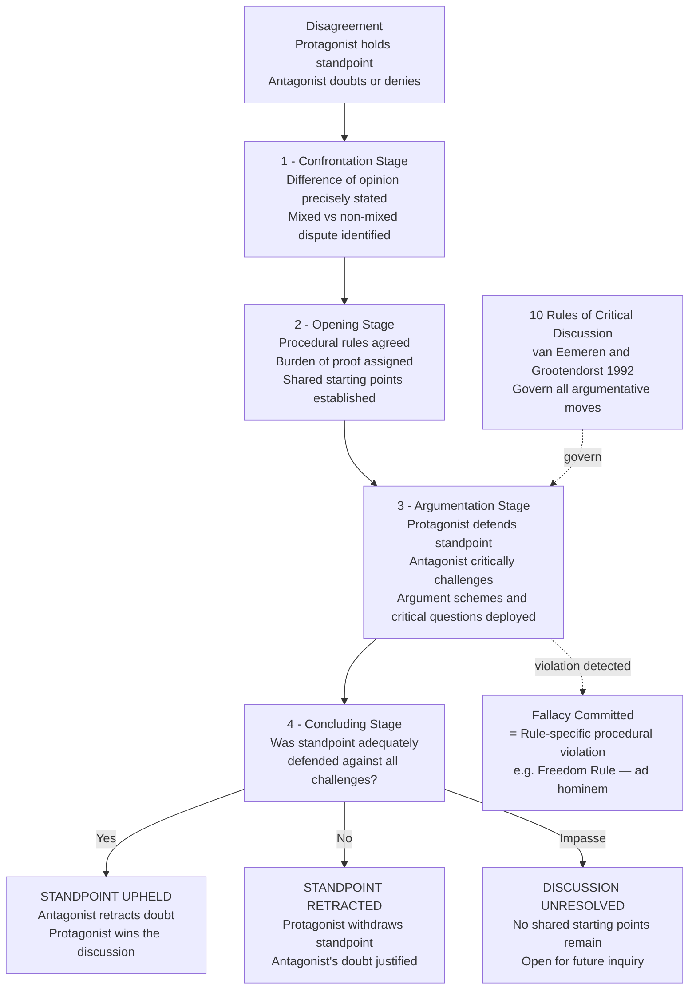

# Debate, Dialectic, and Argumentation

> [!abstract] TL;DR
> Debate is the structured adversarial exchange of arguments for and against a proposition; dialectic is the broader philosophical method of reaching truth through oppositional dialogue; together they underpin formal debate formats — parliamentary, Lincoln-Douglas, cross-examination — the pragma-dialectical theory of critical discussion with its ten rules and ten fallacy-violations, Walton's taxonomy of six dialogue types, and Habermas's ideal speech situation. All of these traditions treat productive disagreement not as a breakdown of rational discourse but as its most epistemically powerful form: we think best not alone but against a committed, skilled, honest opponent whose job is to find every flaw in our reasoning.

---

## Intuition

**Analogy:** Think of two engineers doing a code review. One has written the code and believes it is correct; the other is looking for bugs. This is not a fight — it is a structured search for the truth about the code's quality. The reviewer's job is not to win by finding bugs or to be polite and approve everything; it is to test every assumption, probe every edge case, and demand justification for every non-obvious choice. The author's job is not to defend pride but to either justify each decision with good reasons or concede that a change is needed. Both parties are bound by a shared commitment: the code either works or it doesn't, and they are both trying to find out.

This is dialectic in its purest form. The Socratic method, formal parliamentary debate, peer review, courtroom cross-examination, and scientific adversarial collaboration are all instances of the same structure: a proposition is put forward, it is subjected to systematic critical challenge, and the exchange either vindicates it (the challenges are answered) or defeats it (the challenges cannot be answered). The key insight — from Socrates through Aristotle through van Eemeren — is that this adversarial structure is not a defect in human communication but its most productive epistemic feature. The correct test of a belief is not reflection alone but exposure to the best available objections.

---

## How It Works

### Core Mechanics

Dialectical exchange has a definite internal structure regardless of the domain — courtroom, parliament, seminar, or scientific debate. The same five components recur across every formalization.

**1. A standpoint is advanced.** One party (the protagonist) commits to a position — a claim that something is true, that a policy should be adopted, that a theory explains the evidence. The standpoint is not merely expressed; it is *asserted* in a speech-act sense, which means the protagonist undertakes an obligation: to defend it when challenged.

**2. A challenge is issued.** The opposing party (the antagonist) either denies the standpoint ("that is false"), doubts it ("I am not convinced"), or requests justification ("why should I accept that?"). The nature of the challenge determines the type of dialectical exchange that follows.

**3. Burden of proof is assigned.** Who must prove what? The default principle — rooted in Roman law and formalized by Whately in the nineteenth century — is that the party advancing a departure from the status quo bears the initial burden. The protagonist who proposes a change must show it is warranted; the antagonist who defends the current state need not prove it is optimal, only that the challenge has not been met. Misassigning burden of proof is one of the most common and most consequential dialectical errors.

**4. Arguments and counter-arguments are exchanged.** The substantive phase: the protagonist offers reasons, evidence, and inferential connections; the antagonist challenges the premises, questions the inferences, and offers counter-arguments. This exchange is not unconstrained — it is governed by procedural rules that determine which moves are legitimate and which are fallacious (rule violations).

**5. A resolution is reached or the discussion is adjourned.** In the ideal case, the standpoint is either upheld (the protagonist has successfully defended it against all challenges) or retracted (the challenges were unanswerable). In practice, discussions often adjourn without resolution — which is itself informative, revealing where genuine uncertainty lies or where shared starting points are unavailable.

### Flow / Architecture



The pragma-dialectical model treats every real dispute as an approximation to this ideal structure. The four stages do not always occur in this order in real discourse — argumentation often begins before procedural rules are made explicit, and concluding is frequently ambiguous. The model is a normative standard against which real exchanges can be measured, not a prediction of how they always unfold.

---

## Key Concepts

### Secondary Level

#### Eristic vs. Dialectic — The Foundational Distinction

The distinction between *eristic* and *dialectic* originates with Plato and is the conceptual foundation of the entire field.

**Eristic** — from the Greek *eris* (strife, the goddess of discord) — is argumentation aimed at winning, by whatever means available. An eristic arguer is indifferent to truth; their goal is to defeat the opponent and secure the audience's agreement. Sophists in Plato's dialogue *Euthydemus* exemplify eristic: they deploy verbal tricks, exploit ambiguity, and score rhetorical points without advancing genuine understanding. Eristic is the pathology of debate.

**Dialectic** — from *dialegesthai* (to converse, to reason together) — is argumentation aimed at truth through systematic examination of competing positions. A dialectical arguer genuinely submits their view to the test of the best available objections. Their goal is not victory but the best-justified position that survives critical scrutiny. Dialectic is debate operating at its epistemic optimum.

The practical significance of the distinction is profound. Many real debates — political, academic, legal — mix eristic and dialectical elements. A good-faith participant can be drawn into eristic exchange by an opponent who is purely strategic; conversely, a skilled dialectician can use the formal structure of debate to pursue genuine inquiry even when the institutional context is competitive. Recognizing which mode is operative is the first critical skill in any argumentative situation.

#### The Socratic Elenchus — The Prototype

Socrates developed the first systematic method of dialectical inquiry in the fifth century BCE. The **elenchus** ("cross-examination" or "refutation") proceeds in four characteristic moves:

1. **Request for definition.** Socrates asks his interlocutor to define a concept they claim to understand — courage, piety, justice, knowledge. The interlocutor typically offers a confident answer.
2. **Elicitation of commitments.** Socrates draws out further beliefs the interlocutor holds, apparently unrelated to the definition.
3. **Demonstration of inconsistency.** Socrates shows that the initial definition is inconsistent with the elicited commitments. The definition entails something the interlocutor also denies, or the interlocutor's other commitments entail something that refutes the definition.
4. **Aporia.** The interlocutor reaches a state of genuine puzzlement — the secure confidence they began with is dissolved. They realise they do not actually know what they thought they knew.

Crucially, aporia is not a failure of the elenchus. It is its intended product. Socrates claimed to have no positive doctrine to teach; his contribution was negative — dismantling false certainty to create the conditions for genuine inquiry. A person who believes they know something are unteachable; a person in aporia knows they need to think harder and learn more. The elenchus is epistemically valuable precisely because it is uncomfortable.

#### Formal Debate Formats — Overview

Institutional debate formalizes the dialectical exchange structure with explicit roles, time limits, and judging criteria. The three most influential formats are:

**British Parliamentary (BP):** Four teams of two — Opening Government, Opening Opposition, Closing Government, Closing Opposition — each give one speech, with one protected interjection called a point of information. Teams are ranked first through fourth; the format emphasises in-round adaptability, as motions are revealed fifteen minutes before the debate begins. BP is the dominant format in international academic debate.

**Lincoln-Douglas (LD):** A one-on-one format developed in the United States, structured around value claims and criteria. The affirmative defends the resolution; the negative responds. Unlike BP's team format, LD demands direct head-to-head engagement and places greater weight on philosophical and ethical argumentation. Named after the 1858 Lincoln-Douglas debates on slavery and states' rights.

**Cross-Examination Debate (CEDA/NDT):** The dominant university-level policy debate format in the United States. Teams research a single resolution for the entire academic year, leading to deep technical expertise. Features long preparation and filing of evidence, high-speed delivery of arguments, and complex procedural rules. The tradition has generated more research on argumentation and evidence than any other format.

#### Burden of Proof and Presumption

Burden of proof determines who must provide evidence and argument to discharge an obligation, and who may remain silent without losing the exchange.

**Legal presumptions** are the clearest examples. The presumption of innocence places the burden of proof on the prosecution — the defendant need not prove they are innocent; the state must prove they are guilty beyond reasonable doubt. Reversing the burden changes the entire character of the proceeding.

**Dialectical presumption**, following Richard Whately's *Elements of Rhetoric* (1828), places the burden of proof on the party urging departure from the status quo. The rationale is epistemic: the current state of affairs is what exists; there is already some reason it is as it is; to depart from it requires affirmative justification. This is not conservatism — it is an assignment of evidential obligations that prevents the infinite regress of demanding justification for every existing state of the world before anything new can be proposed.

The burden can shift during an exchange. If the protagonist offers a strong prima facie case, the antagonist takes on a responsibility to respond; merely remaining silent or repeating doubt is no longer adequate. Tracking burden shifts is one of the skills that distinguishes skilled from novice debaters.

---

### Undergraduate Level

#### Aristotle's Topics and Sophistical Refutations

Aristotle's *Topics* and *Sophistical Refutations* constitute the first systematic theoretical account of dialectical reasoning, written around 350 BCE. Aristotle distinguishes four types of reasoning:

| Type | Premises | Goal | Used in |
|------|----------|------|---------|
| **Demonstrative** | Known truths | Prove | Science |
| **Dialectical** | Endoxa — widely accepted opinions | Test and refine | Philosophy, debate |
| **Rhetorical** | Plausible claims for an audience | Persuade | Public speech |
| **Sophistical** | Apparent proofs — fallacies | Appear to prove | Eristic combat |

**Endoxa** — "reputable opinions" held by everyone, or by the wise — are the raw material of dialectical reasoning. Unlike scientific demonstration, which begins with proven first principles, dialectical reasoning begins with what is widely accepted. The dialectician takes endoxa as provisional starting points and tests them systematically, refining or discarding them as the examination proceeds.

The *Topics* catalogues **topoi** ("places to look for arguments") — recurring argumentative patterns that can be applied across different subject matters. Aristotle provides 163 topoi covering definition, genus, property, and accident — the four predicables that structure any categorical assertion. A topos is a general strategy: for example, "if the definition of X includes Y, and Y is impossible, the definition fails." The debater who has mastered the topoi has a systematic method for generating and testing arguments rather than relying on inspiration.

*Sophistical Refutations* classifies thirteen sources of fallacious argument that appear valid but are not — the first systematic fallacy taxonomy in Western thought. Aristotle distinguishes fallacies that depend on language (equivocation, amphiboly) from those independent of language (accident, consequent, false cause). This distinction between formal and informal fallacies persists in modern argumentation theory.

#### Formal Debate Formats in Depth

**British Parliamentary** rewards three distinct skills: (1) *principled argument* — the opening teams must establish general principles, not merely case-specific observations; (2) *dynamic response* — the closing teams must add material not covered by their own side's opening, making the same case from a different angle; and (3) *point-of-information management* — accepting and deflecting interjections without losing the thread of one's own speech. The BP format is specifically designed so that the best dialectician wins, not the most exhaustively prepared researcher.

**Lincoln-Douglas** has a distinctive structure — affirmative case (6 min), negative case (7 min), cross-examination (3 min), first affirmative rebuttal (4 min), negative rebuttal (6 min), second affirmative rebuttal (3 min) — that reflects a philosophical commitment: each side must both construct a positive case *and* respond to the opponent's best arguments. The cross-examination period is explicitly dialectical in the Socratic sense: the questioner may not make speeches, only ask questions, and the goal is to establish concessions that support later arguments.

**CEDA/NDT** has a complex relationship to dialectical ideals. The high-speed delivery style that has dominated American policy debate since the 1980s — called "spreading" — maximizes the volume of arguments deployed, which some argue sacrifices genuine dialectical engagement for technical card-cutting. Critics within the community have argued that spreading is eristic — optimizing for defeating judging heuristics rather than advancing genuine understanding. Defenders argue that at the highest levels, spreading demands extreme precision and that any conceded argument constitutes a legitimate defeat.

#### The Pragma-Dialectical Model — Ten Rules and Their Violations

Frans van Eemeren and Rob Grootendorst's **pragma-dialectics** (Amsterdam School, 1984–2004) is the most developed formal theory of dialectical exchange in contemporary argumentation theory. The central normative framework is the **ten rules of critical discussion**: a set of procedural norms governing argumentation that, when followed, guarantee that any dispute can in principle be rationally resolved. Crucially, fallacies are defined as *violations of these rules* — not as suspicious-looking moves, but as specific procedural failures that obstruct rational resolution.

| Rule | Name | Content | Violation | Corresponding Fallacy |
|------|------|---------|-----------|----------------------|
| 1 | Freedom Rule | Neither party may prevent the other from advancing standpoints or doubts | Silencing, intimidating, or discrediting an opponent | Ad hominem, appeal to force |
| 2 | Burden of Proof | The party advancing a standpoint must defend it when challenged | Claiming the standpoint is self-evident; shifting burden without justification | Evading burden of proof |
| 3 | Standpoint Rule | Attacks must address the standpoint actually advanced | Misrepresenting the opponent's position to make it easier to attack | Straw man |
| 4 | Relevance Rule | Argumentation must be relevant to the standpoint at issue | Arguing beside the point; proving something other than what is disputed | Ignoratio elenchi |
| 5 | Unexpressed Premise Rule | Implicit premises may only be attributed if actually committed to | Falsely attributing premises the opponent never endorsed | False attribution |
| 6 | Starting-Point Rule | No premise may be falsely presented as a shared starting point | Assuming what is at issue; claiming false consensus | Begging the question, false dilemma |
| 7 | Validity Rule | Formally or informally invalid reasoning may not be presented as conclusive | Any formal fallacy; using non-deductive argument as if deductively certain | All formal fallacies; hasty generalization |
| 8 | Argument Scheme Rule | Argumentation schemes must be applied correctly | Using an argument scheme when its critical questions are not answered | Inappropriate appeal to authority, slippery slope without mechanism |
| 9 | Concluding Rule | Failed defenses must be retracted; successful defenses accepted | Maintaining a standpoint after it has been refuted; denying a successful defense | Refusing to concede |
| 10 | Language Use Rule | Arguments must be clear, unambiguous, and not exploiting vagueness | Deliberate obscurity; equivocation; using terms that shift meaning | Equivocation, amphiboly |

The pragma-dialectical account makes fallacy classification principled in a way that simple lists of suspicious moves do not. A fallacy is not just "looks bad" or "feels wrong" — it is a specific violation of a specific rule with a specific functional explanation of *why* that violation undermines rational dispute resolution. The freedom rule (Rule 1) exists because rational resolution requires that all relevant arguments be on the table; silencing one party prevents this. The standpoint rule (Rule 3) exists because attacking a misrepresented position leaves the real standpoint untested, no matter how decisively the straw man is demolished.

#### Walton's Dialogue Types

Douglas Walton's contribution to dialectical theory is the recognition that debate is not one thing — there are fundamentally different *types* of argumentative dialogue, each with its own goal, participant roles, and norms for good argument. Applying the wrong norms to the wrong dialogue type produces systematic misunderstanding.

Walton identifies six types:

| Dialogue Type | Initial Situation | Goal of Participant | Goal of Dialogue |
|--------------|-------------------|--------------------|--------------------|
| **Persuasion** | Conflict of opinion | Persuade the other party | Resolve the conflict |
| **Inquiry** | Need to prove something | Find and verify evidence | Prove or disprove a hypothesis |
| **Negotiation** | Conflict of interest | Get the best deal | Reach a reasonable settlement |
| **Deliberation** | A practical problem requiring a decision | Influence the decision | Reach a prudent course of action |
| **Information-seeking** | Need for information | Acquire information | Exchange information |
| **Eristic** | Personal conflict | Win, defeat, humiliate | Reveal the depths of conflict |

The critical insight is that these dialogues shift into one another. A persuasion dialogue can be derailed when one party shifts to eristic goals — pursuing victory rather than resolution. An inquiry can be corrupted when a party introduces negotiation moves — bargaining over what counts as evidence rather than evaluating it objectively. Recognizing a dialogue shift is often the key to diagnosing why an apparently reasonable exchange has broken down.

**Quarrel** — Walton's term for a degenerate dialogue where both parties have abandoned truth-seeking and are engaged in mutual denunciation — is the extreme case of eristic dialogue. Parliamentary debates frequently degrade into quarrels when both parties care more about the performance for constituents than about genuine deliberation.

#### Habermas's Ideal Speech Situation

Jürgen Habermas's theory of **communicative action** (1981) offers the most philosophically ambitious account of what rational dialectical exchange requires. Habermas distinguishes two fundamental orientations of action:

**Strategic action:** the actor's goal is to produce a desired outcome in the world, treating other actors as means or obstacles. Strategic action in argument is eristic — it uses the form of rational exchange as a vehicle for achieving victory.

**Communicative action:** the actor's goal is to reach genuine understanding through the force of better reasons alone. Communicative action is irreducibly social — it requires both parties to be genuinely oriented toward understanding, not merely performing the motions.

For communicative action to succeed, Habermas argues that every speech act implicitly raises four **validity claims** that can in principle be redeemed through discourse:

1. **Truth** — the proposition stated is true.
2. **Rightness** — the speech act is normatively appropriate in the context.
3. **Truthfulness** — the speaker is sincere; they believe what they assert.
4. **Comprehensibility** — the utterance is intelligible to the hearer.

When any validity claim is contested, the parties must shift to a higher-level discourse — **theoretical discourse** for truth claims, **practical discourse** for normative claims — in which the contested claim can be examined without the pragmatic pressures of the original context.

The **ideal speech situation** is the regulative ideal presupposed by communicative action: a dialogical context in which no speaker is prevented from participating, all assertions can be questioned, no constraints exist except the force of the better argument, and all outcomes are open to revision in principle. No real discourse meets this standard; but the standard itself is what gives real discourse its normative orientation. An exchange is *more or less* rational depending on how closely it approximates the ideal.

Habermas's theory grounds **discourse ethics**: moral norms are valid only if they could be agreed to by all affected parties under ideal speech conditions. This moves moral justification from monological reflection (what I can rationally will as a universal law — Kant) to dialogical procedure (what we could rationally agree to together in unconstrained discourse).

#### Democratic Deliberation

The connection between dialectic and democracy runs deep. The Athenian *agora* — the public space of debate and deliberation — was the institutional prototype for both. Contemporary **deliberative democracy** theory (Habermas, Rawls, Dryzek, Cohen) argues that democratic legitimacy derives not merely from voting but from the quality of public reasoning that precedes and informs it.

John Rawls's **public reason** doctrine holds that in a pluralist society, citizens reasoning together about fundamental political questions must appeal only to considerations that can in principle be accepted by all reasonable citizens — including those who do not share their comprehensive moral or religious doctrines. The requirement of public reason is a restriction on the *kind* of argument that can legitimately ground constitutional essentials, not a restriction on what citizens privately believe. It is, in effect, a constraint on argument schemes in democratic debate: arguments from divine command or sectarian revelation are excluded not because they are false but because they cannot be shared across reasonable comprehensive doctrines.

The empirical record of deliberative democracy is mixed. Experiments in **citizens' assemblies** — groups of randomly selected citizens who deliberate intensively on difficult policy questions (the Irish Citizens' Assembly on abortion, 2016-17; the UK Climate Assembly, 2020) — have produced evidence that ordinary citizens, given structured deliberative conditions, can engage with complex issues with sophistication exceeding what their prior polarized positions suggested. The dialectical structure — balanced information, adversarial presentations, facilitated exchange, time for reflection — appears to do genuine epistemic work.

---

### Graduate Level

#### Bayesian Debate and the Epistemic Value of Adversarial Collaboration

The classical justification for the adversarial method — from Mill's *On Liberty* (1859) through Popper's falsificationism to contemporary deliberative democracy — is primarily epistemic: the truth emerges more reliably from structured debate than from unilateral reasoning or consensus formation. Bayesian epistemology provides a formal framework for analysing when this claim holds and when it fails.

In a **Bayesian model of debate**, each party has a prior probability distribution over the claim at issue and updates on evidence and arguments according to Bayes' theorem. Ideal rational agents with common priors should *agree to disagree* — the Aumann theorem (1976) shows that two Bayesian agents with common priors who know each other's posteriors cannot agree to disagree. If both sides of a debate are truly rational, agreement should in principle be reachable.

Real disagreement persists for three reasons: **prior differences** (different background beliefs lead to different interpretation of shared evidence), **informational asymmetry** (one party has access to evidence the other lacks), and **motivated reasoning** (strategic distortion of prior updating in pursuit of goals other than truth). Adversarial debate structures are designed to address informational asymmetry — forcing both sides to disclose and defend their evidence — but can exacerbate prior differences and motivated reasoning.

**Adversarial collaboration** (Kahneman 2002, Mellers et al. 1984) is an empirical research methodology that directly instantiates dialectical exchange: scientists on opposite sides of a theoretical dispute agree in advance to collaborate on a study jointly designed to discriminate between their positions, with a neutral referee adjudicating the outcome. The method is designed to prevent post-hoc rationalization by committing both parties to the interpretation criteria before results are known. It has been applied to disputes about cognitive priming (Nosek & Lakens), psychic phenomena (Bem & Radin), and nutritional science. The formal structure is Whately's burden-of-proof dialectic rendered as experimental protocol.

The epistemic value of debate depends critically on the **incentive structure**. When debaters are rewarded for winning rather than for advancing truth — as in competitive debate, adversarial legal proceedings, and partisan political discourse — the eristic/dialectical tension is acute. Under competitive incentives, argumentative skill is directed toward defeating the opponent's strongest positions while obscuring one's own weakest, which is informative about the relative skills of the advocates but not necessarily about the truth of the proposition being debated. The design of debate institutions — who has standing to argue, what counts as victory, who judges — determines which epistemic properties the exchange actually has.

#### Walton's Argument Schemes — The 60-Scheme Catalogue

Walton, Reed, and Macagno's *Argumentation Schemes* (2008) catalogues 60 recurring patterns of everyday, legal, and scientific argument. Each scheme is a named inferential pattern with a formal structure (premise set → conclusion) and a set of **critical questions** (CQs) that must be answered satisfactorily for the scheme to discharge its argumentative function. The CQs are not objections that defeat the argument — they are the specific tests that the argument must pass to count as a legitimate instance of the scheme. An argument that passes all its CQs is defeasibly good; an argument that fails one or more is defeasible at that specific point.

The scheme catalogue resolves a fundamental tension in argumentation theory. Formal logic treats all non-deductive inference as defective; informal logic catalogues fallacies without a principled account of when a fallacious-seeming pattern is actually legitimate. The scheme framework occupies the middle ground: most everyday argument is neither deductively valid nor fallacious, but defeasibly reasonable when the relevant CQs are met.

Key schemes and their critical questions:

**Argument from Expert Opinion (AE)**
- *Premises:* Source E is an expert in domain D; E asserts claim C; C is within D.
- *Conclusion:* C is plausible.
- *CQs:* Is E genuinely expert in D? Does E have a conflict of interest? Is C consistent with what other experts in D say? Is E reporting within their expertise or speculating beyond it?

**Argument from Analogy (AA)**
- *Premises:* Case C1 has features F1, F2, …, Fn; Case C2 also has F1, F2, …, Fn; C1 has property P.
- *Conclusion:* C2 probably has property P.
- *CQs:* Are C1 and C2 similar in the relevant respects? Are there relevant differences that break the analogy? Is P genuinely connected to the shared features, or incidentally correlated?

**Argument from Commitment (AC)**
- *Premises:* Party X is committed to principle P; P implies action A.
- *Conclusion:* X should do A.
- *CQs:* Is the commitment genuine? Does P actually imply A in this context? Has X already retracted the commitment?

**Argument from Consequences (ACons)**
- *Premises:* Action A will lead to consequence C; C is bad (or good).
- *Conclusion:* A should not be done (or should be done).
- *CQs:* Will A actually lead to C? Is C really bad (good)? Are there other consequences that outweigh C? Are there alternative actions that achieve the good without the bad consequence?

**Slippery Slope (SS)**
- *Premises:* Action A will set in motion a chain of events leading to consequence Z; Z is extremely bad.
- *Conclusion:* A should not be done.
- *CQs:* Is the causal chain from A to Z real and specific, or merely speculative? Is there a genuine mechanism connecting the steps? At what point can the chain be arrested, and why can it not be arrested? Is the badness of Z sufficient to outweigh the value of A even granting the chain?

The slippery slope is legitimate — not fallacious — when the causal mechanism is real and the answers to its CQs are satisfactory. The fallacious version presents the chain as inevitable and the mechanism as unspecified or implausible.

Walton's catalogue is directly applicable to legal evidence evaluation (schemes for argument from physical evidence, testimony, hearsay), policy debate (consequences, precedent, authority), and scientific argument (argument from analogy in comparative biology, argument from sign in medical diagnosis). The scheme CQs function as a structured checklist for critical evaluation without requiring the evaluator to possess domain expertise — the questions identify where expertise is needed without presupposing it.

#### Presumption Doctrine — Legal and Dialectical

**Presumption** is the rule that, in the absence of contrary evidence, a proposition is to be accepted as true for the purpose of the argument. It is a *procedural* allocation of epistemic risk, not a substantive claim about probability.

In law, presumptions serve three distinct functions. **Evidential presumptions** allocate burdens: the presumption of innocence means the prosecution bears the full evidential burden; the defendant benefits from the doubt. **Legal fictions** are irrebuttable presumptions maintained for policy reasons independent of their truth — the presumption that a child under seven is incapable of criminal intent regardless of evidence. **Rebuttable presumptions** shift the evidential burden once a foundation is established: if the prosecution proves the defendant possessed a controlled substance, the law presumes intent to supply unless the defendant rebuts.

In dialectical theory, Whately's doctrine of presumption assigns the burden of proof based on where the status quo lies. The *status quo* is not always the present arrangement — sometimes it is the position that has been established by prior argument within the discussion. Crucially, the dialectical presumption in favor of the status quo is defeasible: once the protagonist establishes a *prima facie* case, the burden shifts to the antagonist. Tracking these shifts — who bears the burden at each stage of an extended exchange — is one of the core analytical skills that distinguishes trained argumentation scholars from lay participants.

The intersection of legal and dialectical presumption is clearest in **evidentiary arguments**: legal evidence law is, at bottom, a codified dialectical theory specifying which argument schemes are admissible, which critical questions must be answered before testimony can be credited, and which presumptions govern in the absence of affirmative evidence.

#### Dissent and the Adversarial Method

The adversarial method — institutionalising opposition as a structural feature of inquiry — is one of democracy's most powerful epistemic inventions. Charlan Nemeth's research (1986–2018) provides the empirical basis: **minority dissent**, even when wrong, improves the quality of group reasoning by forcing the majority to think more divergently and consider information they would otherwise dismiss. Groups with dissenting minorities make better decisions than unanimous groups, even when the dissenters are arguing for false positions.

This finding has generated several institutional applications:

**Devil's advocacy** — assigning one participant the formal role of arguing against the consensus position — was developed in the Roman Catholic Church's **Promotor Fidei** (Promoter of the Faith), the official whose job was to argue against canonization. The practice was abolished in 1983 but the underlying structure persists in any institution that formally designates a challenging role to prevent groupthink.

**Red team / blue team exercises** in intelligence analysis, military planning, and AI safety formalize the adversarial structure: the red team's job is to find every way the blue team's plan can fail, without being inhibited by institutional investment in the plan's success. The National Intelligence Council's structured analytic techniques manual (2009) identifies red teaming as one of the primary tools for overcoming confirmation bias in high-stakes analysis.

**Constitutional AI** (Anthropic 2022) applies an analogous structure to AI alignment: an AI model critiques its own outputs against a set of principles, then revises them based on the critique. The "AI feedback" component is a scaled automated version of the adversarial method — generating counter-arguments to one's own outputs and updating based on them. The epistemological underpinning is identical to Socratic elenchus: expose your own positions to the best available objections and revise those that cannot withstand scrutiny.

---

## Python Demo

Simulate a parliamentary debate scoring system. A two-team debate is modelled with six scored speeches — opening statements, rebuttals, extensions, and summaries — evaluated on three criteria with fixed weights. Running cumulative scores per team are visualized as a line chart alongside a per-round criteria breakdown.

```python
import numpy as np
import matplotlib.pyplot as plt
import matplotlib.patches as mpatches

# ── Parliamentary Debate Scoring Simulation ─────────────────────────────────
# Motion: "Democracies should ban algorithmic political advertising"
# Format: British Parliamentary simplified to 2 teams, 6 scored speeches
# Criteria weights: Relevance 30%, Logical Validity 40%, Evidence Quality 30%

rng = np.random.default_rng(seed=42)

MOTION   = "Democracies should ban algorithmic political advertising"
TEAMS    = ["Proposition", "Opposition"]
N_ROUNDS = 6

ROUND_LABELS = [
    "Opening\nStatement",
    "First\nRebuttal",
    "Constructive\nExtension",
    "Second\nRebuttal",
    "Summary\nArgument",
    "Final\nSummary",
]

CRITERIA = ["Relevance", "Logical Validity", "Evidence Quality"]
WEIGHTS  = np.array([0.30, 0.40, 0.30])   # must sum to 1.0

# ── Generate per-round, per-criterion scores ────────────────────────────────
# Proposition: stronger on evidence (topic depth); weaker on logical validity
# Opposition: stronger on logical validity; weaker on evidence
PROP_BASE = np.array([7.2, 6.8, 7.6])
OPP_BASE  = np.array([7.0, 7.8, 6.4])

PROP_RAW = rng.normal(loc=PROP_BASE, scale=1.1, size=(N_ROUNDS, 3))
OPP_RAW  = rng.normal(loc=OPP_BASE,  scale=1.1, size=(N_ROUNDS, 3))

# Clip to [0, 10] and round to 1 decimal place
PROP_RAW = np.clip(np.round(PROP_RAW, 1), 0.0, 10.0)
OPP_RAW  = np.clip(np.round(OPP_RAW,  1), 0.0, 10.0)

# Weighted round score: dot product with criteria weights
prop_round = PROP_RAW @ WEIGHTS          # shape (6,)
opp_round  = OPP_RAW  @ WEIGHTS          # shape (6,)

# Running cumulative score across rounds
prop_cumul = np.cumsum(prop_round)        # shape (6,)
opp_cumul  = np.cumsum(opp_round)         # shape (6,)

round_nums = np.arange(1, N_ROUNDS + 1)

# ── Plot ────────────────────────────────────────────────────────────────────
fig, (ax1, ax2) = plt.subplots(1, 2, figsize=(15, 6))
fig.suptitle(
    f"Parliamentary Debate Scoring Simulation\n"
    f"Motion: \"{MOTION}\"",
    fontsize=11, fontweight="bold", y=1.02,
)

PROP_COLOR = "#2563eb"
OPP_COLOR  = "#dc2626"

# -- Left panel: cumulative line chart --
ax1.plot(round_nums, prop_cumul, "o-",
         color=PROP_COLOR, linewidth=2.3, markersize=8,
         label="Proposition", zorder=4)
ax1.plot(round_nums, opp_cumul, "s-",
         color=OPP_COLOR, linewidth=2.3, markersize=8,
         label="Opposition", zorder=4)

# Shade the region where each team leads
ax1.fill_between(round_nums, prop_cumul, opp_cumul,
                 where=(prop_cumul >= opp_cumul),
                 alpha=0.12, color=PROP_COLOR)
ax1.fill_between(round_nums, prop_cumul, opp_cumul,
                 where=(prop_cumul < opp_cumul),
                 alpha=0.12, color=OPP_COLOR)

# Annotate each round's incremental score
for i in range(N_ROUNDS):
    ax1.annotate(
        f"+{prop_round[i]:.1f}",
        xy=(round_nums[i], prop_cumul[i]),
        xytext=(0, 10), textcoords="offset points",
        ha="center", fontsize=8, color=PROP_COLOR,
    )
    ax1.annotate(
        f"+{opp_round[i]:.1f}",
        xy=(round_nums[i], opp_cumul[i]),
        xytext=(0, -15), textcoords="offset points",
        ha="center", fontsize=8, color=OPP_COLOR,
    )

ax1.set_xticks(round_nums)
ax1.set_xticklabels(
    [lbl.replace("\n", " ") for lbl in ROUND_LABELS],
    rotation=20, ha="right", fontsize=8.5,
)
ax1.set_xlabel("Debate Round", fontsize=10)
ax1.set_ylabel("Cumulative Score", fontsize=10)
ax1.set_title("Running Cumulative Scores by Round", fontsize=10, fontweight="bold")
ax1.legend(fontsize=9)
ax1.grid(True, alpha=0.3)

# Final score annotations at the right edge
ax1.annotate(
    f"Final: {prop_cumul[-1]:.1f}",
    xy=(N_ROUNDS, prop_cumul[-1]),
    xytext=(8, 0), textcoords="offset points",
    fontsize=9, color=PROP_COLOR, fontweight="bold", va="center",
)
ax1.annotate(
    f"Final: {opp_cumul[-1]:.1f}",
    xy=(N_ROUNDS, opp_cumul[-1]),
    xytext=(8, 0), textcoords="offset points",
    fontsize=9, color=OPP_COLOR, fontweight="bold", va="center",
)

# -- Right panel: per-round stacked bar chart for criteria breakdown --
CRIT_COLORS = ["#60a5fa", "#34d399", "#fbbf24"]
BAR_W  = 0.35
x_prop = round_nums - BAR_W / 2
x_opp  = round_nums + BAR_W / 2

bot_p = np.zeros(N_ROUNDS)
bot_o = np.zeros(N_ROUNDS)
for ci, col in enumerate(CRIT_COLORS):
    ax2.bar(x_prop, PROP_RAW[:, ci], BAR_W, bottom=bot_p,
            color=col, alpha=0.85)
    ax2.bar(x_opp,  OPP_RAW[:, ci],  BAR_W, bottom=bot_o,
            color=col, alpha=0.45, hatch="///")
    bot_p += PROP_RAW[:, ci]
    bot_o += OPP_RAW[:, ci]

ax2.set_xticks(round_nums)
ax2.set_xticklabels(
    [lbl.replace("\n", " ") for lbl in ROUND_LABELS],
    rotation=20, ha="right", fontsize=8.5,
)
ax2.set_xlabel("Debate Round", fontsize=10)
ax2.set_ylabel("Raw Score per Criterion", fontsize=10)
ax2.set_title(
    "Per-Round Criteria Breakdown\n"
    "Solid bars = Proposition   |   Hatched bars = Opposition",
    fontsize=10, fontweight="bold",
)
ax2.grid(True, alpha=0.3, axis="y")

legend_handles = [
    mpatches.Patch(color=CRIT_COLORS[0], label="Relevance"),
    mpatches.Patch(color=CRIT_COLORS[1], label="Logical Validity"),
    mpatches.Patch(color=CRIT_COLORS[2], label="Evidence Quality"),
    mpatches.Patch(facecolor="white", edgecolor="gray",
                   hatch="///", label="Opposition side"),
]
ax2.legend(handles=legend_handles, fontsize=9)

# Winner determination and caption
winner = TEAMS[0] if prop_cumul[-1] > opp_cumul[-1] else TEAMS[1]
margin = abs(prop_cumul[-1] - opp_cumul[-1])
fig.text(
    0.5, -0.03,
    f"Result: {winner} wins  |  "
    f"Proposition {prop_cumul[-1]:.2f}  vs  Opposition {opp_cumul[-1]:.2f}  "
    f"(margin {margin:.2f} pts)\n"
    f"Scoring: Relevance 30 pct  |  Logical Validity 40 pct  |  Evidence Quality 30 pct",
    ha="center", fontsize=9, color="#374151",
)

plt.tight_layout()
plt.savefig("debate_scoring_simulation.png", dpi=150, bbox_inches="tight")
plt.show()

# ── Console summary ─────────────────────────────────────────────────────────
print("=" * 70)
print(f"PARLIAMENTARY DEBATE SCORING  —  MOTION: {MOTION}")
print("=" * 70)
print(f"{'Round':<24}  {'Prop':>8}  {'Opp':>8}  {'Round Leader':>14}")
print("-" * 60)
for i in range(N_ROUNDS):
    lbl    = ROUND_LABELS[i].replace("\n", " ")
    leader = TEAMS[0] if prop_round[i] > opp_round[i] else TEAMS[1]
    print(f"{lbl:<24}  {prop_round[i]:>8.2f}  {opp_round[i]:>8.2f}  {leader:>14}")
print("-" * 60)
print(f"{'TOTAL':<24}  {prop_cumul[-1]:>8.2f}  {opp_cumul[-1]:>8.2f}  {winner:>14}")
print(f"\nWinner: {winner}  |  Margin: {margin:.2f} pts")
```

**What the output shows:** The left panel displays the cumulative score race — shaded regions reveal which team leads at each point in the debate, and the per-round increments show where momentum shifted. The right panel decomposes each round's raw scores by criterion, revealing each team's structural strengths: the Proposition's stronger evidence quality compensates for weaker logical validity in early rounds; the Opposition's validity edge grows increasingly decisive as the debate progresses and the rebuttals become more technically demanding. The simulation uses `rng.normal` with fixed `seed=42` so every run produces identical results.

---

## Real-World Applications

> **Legal Cross-Examination — The Adversarial System as Institutionalised Dialectic:** The common law adversarial system is the most thoroughly institutionalized application of dialectical theory in human civilization. Every element of the trial — burden of proof on the prosecution, the defendant's right to silence, the exclusionary rules on hearsay, the cross-examination procedure — implements a specific dialectical principle. Cross-examination embodies the Socratic elenchus at scale: the cross-examiner may not make speeches, only ask questions; the goal is to expose inconsistencies in the witness's account; and the structure is adversarial precisely because adversarialism is epistemically superior to unchallenged testimony. The UK Law Commission's evidence reform projects and the US Federal Rules of Evidence can both be read as codified argumentation theory — determining which argument schemes are admissible in legal discourse.

> **The Irish Citizens' Assembly on Abortion, 2016-17 — Deliberative Democracy in Practice:** Ireland's constitutional prohibition on abortion had been entrenched since 1983 and appeared irresolvable through normal political channels. The Citizens' Assembly convened 99 randomly selected Irish citizens to deliberate on the issue over five weekends. Participants heard balanced expert testimony, engaged in facilitated small-group discussion following structured argumentation protocols, and were shielded from the mass media during deliberations. The assembly recommended repeal of the constitutional prohibition by a 64-percent supermajority — a position substantially more liberal than any major political party had publicly adopted. The 2018 referendum endorsed repeal 66-34. The assembly demonstrated empirically what pragma-dialectics predicts theoretically: structured dialectical procedure, with balanced information and protected deliberation, can shift positions on deeply polarized issues by operating at the level of reasons rather than identities.

> **Scientific Adversarial Collaboration — Kahneman and Klein on Expert Intuition:** Daniel Kahneman and Gary Klein — whose research programs on expert judgment reached diametrically opposed conclusions — agreed in 2009 to an adversarial collaboration designed to find the boundary conditions of each theory. Klein's naturalistic decision-making research showed that expert intuition is reliable in high-feedback, regular environments; Kahneman's heuristics-and-biases program showed that intuitive judgment is systematically biased in low-feedback, irregular environments. The adversarial collaboration produced a joint paper ("Conditions for Intuitive Expertise," *American Psychologist*, 2009) that neither investigator would have written alone. The dialectical exchange forced both to specify their claims more precisely, identify the conditions under which each was right, and acknowledge where genuine uncertainty remained. The joint paper is more epistemically valuable than either investigator's prior solo position.

> **IBM Project Debater — Computational Dialectic at Scale:** IBM Research's Project Debater demonstrated in 2019 that argument mining had matured to the point of live competitive use. Given the motion "We should subsidize space exploration," the system retrieved relevant claims from a 400-million-article corpus, constructed a four-minute opening argument, listened to a trained human debater's response, identified the opponent's key claims using argument detection models, retrieved counter-evidence, and delivered a rebuttal — all in real time. The system's architecture instantiated the pragma-dialectical model computationally: claim detection corresponds to the confrontation stage; evidence retrieval to the argumentation stage; argument ranking to the selection among competing argument schemes. The system lost the debate on audience-vote measures but produced arguments judged by independent raters to be of higher evidential quality than many competitive human debaters, illustrating that dialectical structure and rhetorical persuasion are different properties.

> **Red Teaming in AI Safety — Adversarial Method for Alignment:** Contemporary AI safety practice deploys red teaming — hiring adversarial testers to attempt to elicit harmful outputs from language models — as a systematic application of the adversarial method to capability evaluation. The red team's function is identical to the antagonist in pragma-dialectical theory: their job is not to help the system succeed but to find every way it can fail. The outcomes feed directly into training and safety interventions. Anthropic, OpenAI, and DeepMind publish red-teaming methodology papers that reveal the implicit argumentation theory: red teamers are assigned specific argument schemes to test, required to document their attacks and the system's responses, and evaluated on the breadth and severity of the failures they find. The normative standard is the ideal speech situation in reverse — an attempt to identify every deviation from safe, honest communication.

---

## Common Pitfalls

- **Mistaking competitive victory for epistemic success** — The most common failure in formal debate training. Students who learn to win debates frequently become more confident in positions they hold for strategic rather than epistemic reasons. A won debate is evidence that your side's arguments were stronger than the opponent's on that day, not that your position is true. Competitive success and truth-tracking are correlated at best, and the correlation weakens as the stakes of winning increase.

- **Failing to track burden shifts** — Most debaters assign burden of proof at the outset and treat it as fixed. In extended exchanges, burden shifts repeatedly as the protagonist establishes a prima facie case, the antagonist rebuts, the protagonist responds to the rebuttal, and so on. Missing a burden shift causes debaters to demand proof from a party that has already met their obligation, or to accept silence as a defense from a party that has taken on the burden of response.

- **Conflating dialogue types** — Applying persuasion-dialogue norms to a negotiation or vice versa. A party engaged in a negotiation who says "but that argument is logically invalid" has switched dialogue types: in negotiation, interests and concessions matter more than logical validity. The diagnostic question is always: what does the exchange actually aim to achieve, and what norms govern that type of exchange?

- **Treating the straw man as a minor technical error** — The straw man violates pragma-dialectics' standpoint rule, which makes it one of the most serious procedural failures in dialectical exchange. It does not merely weaken the exchange; it destroys it. If the protagonist's actual standpoint is not being attacked, the antagonist's "refutation" tests nothing. The entire exchange becomes eristic performance rather than genuine inquiry. Yet straw man attacks are routinely accepted in political and media discourse because they are hard to identify in real time and costly to correct.

- **Ignoring the opening stage** — Most analytical attention goes to the argumentation stage — the substance of the exchange. But van Eemeren and Grootendorst identify the opening stage as equally critical: the parties must establish shared starting points before the argumentation can be meaningful. A scientist debating a creationist, a liberal debating a deep communitarian, or a rationalist debating a fundamentalist may be unable to reach resolution not because either side's arguments are weak but because they share no starting points from which to reason jointly. Recognizing early that no shared starting points exist is not a failure of argumentation — it is an important and often neglected insight about the limits of debate as an epistemic tool.

- **Habermas's ideal as a manipulable performance** — A sophisticated eristic arguer can mimic the surface features of communicative action — appearing to be oriented toward understanding, raising validity claims, calling for further discourse — while pursuing strategic goals. The ideal speech situation cannot be identified from the outside by formal properties alone; it requires genuine commitment to the goal of mutual understanding. This is the deepest vulnerability of procedural accounts of rational discourse: procedure can be performed without substance, and sophisticated strategists perform it very well.

---

## Related Concepts

- [[Arguments_Validity_and_Soundness]] — the formal backbone of debate: an argument is only as strong as its validity and the truth of its premises; debate formats and dialectical procedures are designed to test both properties under adversarial conditions

- [[Inductive_Logic]] — most arguments deployed in debate are inductive rather than deductive — they make their conclusion probable rather than necessary; understanding inductive strength and cogency is essential for evaluating evidence-based arguments in any format

- [[Statistical_Inference_and_Hypothesis_Testing]] — the empirical arguments most frequently contested in policy debate draw on statistical evidence; understanding confidence intervals, p-values, and base rates is the modern complement to dialectical skill for evaluating evidence quality in debates on scientific topics

- [[Argumentation_Theory_and_Dialectic]] — the sibling note in Literature and Rhetoric; covers the Toulmin model, Dung's abstract argumentation framework, pragma-dialectics at a formal level, and computational argument mining — the formal theoretical machinery that this note applies in institutional and political contexts

- [[Classical_Rhetoric_and_Aristotle]] — Aristotle's *Topics* is the first systematic dialectical theory; the *Rhetoric* asks what makes arguments persuasive rather than merely dialectically sound; together they constitute the original unified theory of argument production and evaluation

- [[Persuasion_and_Audience]] — dialectic and persuasion address different questions: dialectic asks whether an argument is rationally compelling; rhetoric asks whether it will move this audience; understanding the ELM and Cialdini's influence principles explains why dialectically superior arguments frequently lose to rhetorically superior ones

- [[Political_and_Public_Rhetoric]] — the institutional contexts in which dialectic operates — legislatures, public squares, media — are shaped by rhetorical norms that constrain and often corrupt dialectical procedure; understanding how public political rhetoric works contextualizes the limits and possibilities of deliberative democracy

---

## Review Questions

### Secondary

1. Explain the difference between eristic and dialectic using an example from social media or political broadcasting. What structural features of the platform or context encourage eristic rather than dialectic? What would need to change to encourage genuine dialectic?

2. Socrates claimed that reaching aporia — genuine puzzlement about a concept you thought you understood — is a *good* outcome of the elenchus, not a failure. Do you agree? Give a specific example of a concept where inducing aporia in yourself would be epistemically valuable, and explain what you would need to do next to move beyond aporia toward genuine understanding.

3. In a parliamentary debate on school funding, the Opposition team argues: "The government has not provided any evidence that increased spending improves outcomes." Who bears the burden of proof in this exchange, and has the Opposition's move shifted it? Explain what the Government must do to discharge their burden and what would constitute a successful defense.

### Undergraduate

1. Map out a real or constructed political debate using van Eemeren and Grootendorst's four-stage critical discussion model. Identify: (a) how the standpoint is defined at the confrontation stage; (b) what shared starting points are established at the opening stage; (c) which argument schemes are deployed at the argumentation stage; and (d) what conditions would constitute a rational resolution at the concluding stage. Then identify at least two rule violations — and specify which of the ten rules each violates.

2. Walton distinguishes six types of dialogue. A government committee is conducting hearings into AI regulation. Witnesses include an industry lobbyist, an academic researcher, a civil society advocate, and a regulator. Which dialogue type best describes the committee hearing? Which type does it *risk* collapsing into, and under what conditions? What structural features of the hearing format might prevent that collapse?

3. Habermas argues that every speech act in argumentative discourse implicitly raises four validity claims. A politician says in a debate: "Independent economists agree that my tax policy will reduce inequality." Identify all four validity claims this assertion raises, specify which is most likely to be contested, and describe what would count as an adequate discursive redemption of the contested claim.

### Graduate

1. The Aumann theorem implies that two ideal Bayesian agents with common priors cannot rationally agree to disagree. Yet real experts — in economics, medicine, climate science — do persistently disagree. Analyse this discrepancy. Is the persistent disagreement evidence of irrationality, of prior differences, or of something deeper about the structure of inductive inference? What implications does your analysis have for institutional design — specifically, for how adversarial proceedings or adversarial collaborations should be structured to track truth rather than merely winning?

2. Walton's argument scheme for slippery slope requires a real causal mechanism connecting the steps. In contemporary AI policy debates, slippery slope arguments are extensively deployed — both for and against regulation. Choose one specific slippery slope argument from AI policy, reconstruct its full argument scheme, apply all its critical questions, and determine whether it is a legitimate defeasible argument or a fallacious deployment of the pattern. What evidence would change your assessment?

3. Constitutional AI and red teaming both apply the adversarial method to AI alignment. Pragma-dialectics would predict that the epistemic quality of these procedures depends on whether they instantiate a genuine critical discussion — with freedom to raise any challenge, no predetermined outcome, and rational resolution as the goal — or merely simulate its surface features. Analyse one of these methods against the ten rules of critical discussion. Which rules are structurally met by the procedure? Which are structurally violated? What follows for the epistemic status of safety evaluations produced by these methods?

---

## Sources

- Van Eemeren, F.H., & Grootendorst, R. (1992). *Argumentation, Communication, and Fallacies: A Pragma-Dialectical Perspective*. Lawrence Erlbaum.
- Walton, D., Reed, C., & Macagno, F. (2008). *Argumentation Schemes*. Cambridge University Press.
- Walton, D. (1998). *The New Dialectic: Conversational Contexts of Argument*. University of Toronto Press.
- Habermas, J. (1981). *The Theory of Communicative Action* (Vol. 1: Reason and the Rationalization of Society). Beacon Press.
- Aristotle. *Topics* and *On Sophistical Refutations*. In Barnes, J. (ed.), *The Complete Works of Aristotle*. Princeton University Press, 1984.
- Kahneman, D., & Klein, G. (2009). Conditions for intuitive expertise: A failure to disagree. *American Psychologist*, 64(6), 515–526.
- Aumann, R.J. (1976). Agreeing to disagree. *The Annals of Statistics*, 4(6), 1236–1239.
- Nemeth, C.J. (1986). Differential contributions of majority and minority influence. *Psychological Review*, 93(1), 23–32.
- Rawls, J. (1993). *Political Liberalism*. Columbia University Press.
- Whately, R. (1828). *Elements of Rhetoric*. Dunbar & Armstrong.

---

#logic #debate #dialectic #argumentation #pragma-dialectics
