# ⚠️ Fallacies of Presumption and Ambiguity

> [!abstract] TL;DR
> Fallacies of presumption corrupt an argument by smuggling an unjustified assumption into the premise structure — the logic may be formally valid, but a hidden falsehood does the load-bearing work. Fallacies of ambiguity corrupt an argument by exploiting unclear or shifting word and phrase meaning so that the argument appears to flow, but the key terms do not carry the same meaning from premise to conclusion. Together these thirteen fallacies account for the majority of errors in natural-language argumentation, from political speeches to courtroom cross-examination to everyday persuasion.

---

## Intuition

**Analogy:** Imagine two kinds of crooked contractor. The first type hands you a contract with a clause buried in paragraph 14 that presupposes you already agreed to pay for materials you never authorized — the clause is perfectly grammatical, the arithmetic adds up, but it assumes a prior agreement that never happened. That is presumption: a load-bearing assumption hidden in the scaffolding. The second type uses the word "standard" throughout the contract — sometimes meaning "industry average," sometimes meaning "basic tier," sometimes meaning "our internal benchmark" — so that every sentence is technically true, but the sentences do not connect to each other because the word keeps shifting. That is ambiguity: the same surface token carrying different semantic freight in different places.

In logic, fallacies of presumption look structurally sound but rely on a premise that smuggles in a false, unargued, or question-begging assumption. Fallacies of ambiguity look structurally sound but rely on a shift in meaning that the surface grammar conceals. Neither is a formal fallacy in the sense of violating a logical rule; both are informal fallacies that corrupt the material content from which the argument is built.

---

## How It Works

### Core Mechanics

**Formal vs. Informal Fallacies**

A *formal fallacy* violates a rule of logical form — it would remain a fallacy regardless of what the propositions say (e.g., affirming the consequent). An *informal fallacy* is an error that can only be identified by examining the content and context of the propositions, not just their form. Presumption and ambiguity fallacies are both informal: the argument's skeleton can be formally intact while the flesh of meaning is rotten.

**Fallacies of Presumption — the eight types**

1. **Begging the Question** (petitio principii) — The conclusion is hidden inside one of the premises, so the argument is circular: it assumes what it is supposed to prove. The logical form may be valid, but the premises cannot be established independently of the conclusion. *Example:* "The Bible is true because the Bible says it is the word of God, and the word of God must be true." The trustworthiness of the Bible is smuggled into the premise that establishes its trustworthiness.

2. **False Dilemma** (bifurcation, false dichotomy) — The argument presents only two options as exhaustive when in fact other possibilities exist. The either/or structure of the disjunction is artificially imposed. *Example:* "You are either with us or against us." In reality there are degrees of alignment, neutrality, and contextual opposition that the binary erases.

3. **Hasty Generalization** (converse accident) — A general conclusion is drawn from a sample that is too small, unrepresentative, or cherry-picked. The premise is about a limited set; the conclusion claims to cover all members of the class. *Example:* "I asked three economists and they all opposed the policy; clearly, economists oppose it." Three economists do not constitute a representative sample.

4. **Accident Fallacy** — A general rule is applied rigidly to a case where an exception is warranted. The premise states a valid general principle; the conclusion misapplies it to an edge case the principle was never designed to cover. *Example:* "It is wrong to take what does not belong to you — so the surgeon who takes a bullet from a patient's chest is acting wrongly." The general rule about theft was not formulated to cover medical necessity.

5. **Slippery Slope** — From one event or decision, a chain of causally or logically unwarranted consequences is predicted to follow inevitably. There are two variants: *causal slippery slope* (each step empirically causes the next, but the probability cascade is asserted without evidence) and *logical slippery slope* (the first concession logically entails all subsequent ones, but the entailment is bogus). *Example:* "If we allow assisted dying in extreme terminal cases, we will inevitably slide to euthanizing anyone deemed inconvenient." Each step in the slide requires independent empirical justification that the argument omits.

6. **False Cause** (post hoc ergo propter hoc) — A causal relationship is inferred from a mere correlation or temporal sequence. The two most common forms are: *post hoc* (X preceded Y, therefore X caused Y) and *cum hoc* (X co-varies with Y, therefore X causes Y). *Example:* "Every time I carry my lucky pen to an exam, I pass — the pen causes me to pass." The temporal sequence provides no causal mechanism.

7. **Complex Question** (loaded question) — A question is posed with a false or contested assumption built in, so that any direct answer to the question concedes the assumption. *Example:* "Have you stopped cheating on your expense reports?" Whether you answer yes or no, you admit to prior cheating. The assumption should be challenged before the question is answered.

8. **Appeal to Ignorance** (ad ignorantiam) — The absence of evidence against a claim is treated as evidence for it, or the absence of evidence for a claim is treated as evidence against it. *Example:* "No one has proved that ghosts don't exist, so they must exist." Absence of disproof is not proof.

**Fallacies of Ambiguity — the five types**

9. **Equivocation** — A word or phrase that has two or more distinct meanings is used in both senses within the same argument, so that the semantic shift does the inferential work. *Example:* "The end of everything is its perfection. Death is the end of life. Therefore death is the perfection of life." The word "end" shifts from "purpose or telos" in the first premise to "termination" in the second.

10. **Amphiboly** — The grammatical structure of a sentence is ambiguous so that it can be parsed in two different ways, each yielding a different proposition. The argument exploits this syntactic ambiguity. *Example:* "Flying planes can be dangerous." This can mean either "the act of piloting aircraft is dangerous" or "aircraft that are airborne are dangerous" — two very different claims. Oracular pronouncements classically exploited amphiboly ("You will go, you will return, you will never die in war").

11. **Accent** — The meaning of a statement shifts depending on which word receives spoken stress, or on which part of a text is quoted out of its broader context. *Example:* "I never said she stole the money" changes meaning dramatically depending on which word is stressed: stressing "never" denies the saying; stressing "she" implies someone else stole it; stressing "money" implies she stole something else.

12. **Composition** — A property of the individual parts of a whole is attributed to the whole itself. The inference from part to whole is fallacious when the property is not distributable. *Example:* "Each player on the team is the best in their position; therefore the team is the best team in the league." Teams have emergent properties — chemistry, role overlap, coaching — that are not reducible to individual excellence.

13. **Division** — The reverse of composition: a property of the whole is attributed to each of its parts. *Example:* "This university is one of the world's best research institutions; therefore every professor here is a world-class researcher." Institutional excellence does not distribute uniformly to every individual within it.

---

### Flow / Architecture

```mermaid
flowchart TD
    ROOT["Informal Fallacies<br/>Errors in content not form"] --> PRESUMP["Fallacies of Presumption<br/>Unjustified assumption<br/>smuggled into premises"]
    ROOT --> AMBIG["Fallacies of Ambiguity<br/>Unclear or shifting<br/>term meaning"]

    PRESUMP --> P1["Begging the Question<br/>Conclusion hidden in premise<br/>Circular reasoning"]
    PRESUMP --> P2["False Dilemma<br/>Artificially limits options<br/>to two when more exist"]
    PRESUMP --> P3["Hasty Generalization<br/>Sample too small<br/>or unrepresentative"]
    PRESUMP --> P4["Accident Fallacy<br/>General rule rigidly applied<br/>to an exception case"]
    PRESUMP --> P5["Slippery Slope<br/>Unwarranted chain<br/>of causal or logical steps"]
    PRESUMP --> P6["False Cause<br/>Post hoc or correlation<br/>mistaken for causation"]
    PRESUMP --> P7["Complex Question<br/>Question embeds<br/>a false presupposition"]
    PRESUMP --> P8["Appeal to Ignorance<br/>Absence of proof<br/>treated as proof"]

    AMBIG --> A1["Equivocation<br/>Key word shifts meaning<br/>across premises"]
    AMBIG --> A2["Amphiboly<br/>Grammatical structure<br/>allows two parsings"]
    AMBIG --> A3["Accent<br/>Stress or context<br/>changes what is asserted"]
    AMBIG --> A4["Composition<br/>Part property attributed<br/>to the whole"]
    AMBIG --> A5["Division<br/>Whole property attributed<br/>to each part"]
```



---

## Key Concepts

### Secondary

- **Informal vs. formal fallacy** — A formal fallacy breaks a rule of logical form (the error is visible without knowing what the words mean). An informal fallacy requires reading the content: a presumption fallacy hides a bad assumption; an ambiguity fallacy hides a meaning shift.
- **Begging the question** — The most important presumption fallacy: the argument is circular because the conclusion is assumed in a premise. The tip-off is that you cannot accept the premise without already accepting the conclusion.
- **False dilemma** — Always ask: are these really the only two options? Hidden middle positions, degrees, or entirely different alternatives almost always exist.
- **Post hoc ergo propter hoc** — "After this, therefore because of this." Temporal sequence does not establish causation. One of the most common reasoning errors in health and policy claims.
- **Equivocation** — The most important ambiguity fallacy. Find the key word; check whether it carries the same meaning in every sentence where it appears. If not, the argument has equivocated.
- **Composition and Division** — Mirror-image fallacies. Composition goes from parts to whole; division goes from whole to parts. Both fail because the relevant property may not transfer across levels of analysis.

### Undergraduate

- **The circularity problem in begging the question** — A circular argument is formally valid: if P entails C and P is true, then C is true. The problem is epistemic: circular arguments offer no independent evidence for C, and thus provide no rational grounds for belief-update. Distinguishing circular arguments from enthymemes (valid arguments with suppressed premises) requires checking whether the suppressed premise has independent justification.
- **False dilemma as suppressed disjunct** — The fallacy works by implicitly asserting an exhaustive disjunction that is not exhaustive. Exposing it requires making the disjunction explicit and then producing a counterexample — a third option that the dichotomy excludes. In persuasive rhetoric, false dilemmas are often reinforced by emotional framing that makes the excluded options seem unthinkable.
- **Causal vs. logical slippery slope** — A *causal* slippery slope claims that one event empirically triggers a cascade; this is an empirical claim that requires evidence about probabilities, not just logical possibility. A *logical* slippery slope claims that a principle applied in one case logically commits you to applying it in all subsequent cases; this requires showing either that the principle has no principled stopping point or that any proposed distinction is arbitrary.
- **Complex question and presupposition** — Linguistically, a question presupposes P if the question only makes sense if P is true. "Have you stopped X?" presupposes you have done X at some point. The correct response is to challenge the presupposition before engaging the question, not to answer directly. Pragma-dialectics classifies this as a violation of the freedom rule in argumentation.
- **Equivocation and semantic shift detection** — Formally, equivocation works by using a word W with two interpretations I1 and I2. The argument is valid when W is uniformly interpreted as I1, and the premises are true when W is read as I2, but both conditions cannot be simultaneously satisfied. Detecting it requires disambiguating every occurrence of the key word and checking whether the argument survives uniform disambiguation.
- **Composition and emergence** — The composition fallacy is most seductive when properties are extensive (wealth: a rich team of rich players) because extensive properties genuinely distribute. It fails for intensive properties (temperature: a warm room is not composed of warm molecules in the thermodynamic sense) and for emergent properties (consciousness, competitive advantage) that arise from relational organization, not individual components.

### Graduate

- **Circular reasoning and epistemic justification** — In foundationalist epistemology, circular arguments fail because they cannot ground belief in non-circular basic beliefs. Coherentists argue that moderate circularity — a large, mutually supporting network of beliefs — is not vicious because the circle is vast enough to be epistemically illuminating. The debate between foundationalism and coherentism is partly a dispute about when circularity in justification becomes genuinely objectionable.
- **Ambiguity and formal semantics** — In formal semantics, ambiguity is modeled by assigning multiple logical forms to a single surface form. Equivocation assigns different types to the same lexical item across premises; amphiboly assigns different constituent structures to the same string. Type-theoretic and proof-theoretic treatments formalize why arguments that are valid under one interpretation fail under another — the argument fails Tarski's truth-preservation condition because no single model satisfies all premises under the same interpretation.
- **Slippery slope as sorites** — The logical slippery slope is structurally related to the sorites paradox: if adding one grain of sand never converts a non-heap into a heap, then by iterated modus ponens no collection of sand grains is a heap. The resolution requires either accepting sharp (but arbitrary) thresholds, adopting supervaluationism, or embracing degrees of truth for vague predicates — all moves that undermine the slippery slope's demand that any principled line is arbitrary.
- **Hasty generalization and statistical power** — In frequentist statistics, hasty generalization corresponds to drawing conclusions from an underpowered study. The sample size required for a reliable generalization depends on the effect size, the acceptable error rates (alpha and beta), and the population variance. The formal requirement of adequate statistical power is the mathematical operationalization of "not committing a hasty generalization."
- **False cause and the interventionist account of causation** — Woodward's interventionist theory (2003) defines causation in terms of invariant relationships under interventions: X causes Y if changing X through an ideal intervention changes Y. Post hoc correlations fail this test because the intervention reveals that the apparent cause is a mere correlate. Directed acyclic graphs (DAGs) and the do-calculus provide formal tools for distinguishing genuine causes from post hoc associations in observational data.

---

## Python Demo

```python
import numpy as np
import matplotlib.pyplot as plt

# Word-ambiguity detector: given a sentence list and an ambiguity lexicon
# (Python dicts only, no NLP libraries), flag ambiguous sentences and
# visualize the distribution of fallacy types detected.

# --- Ambiguity lexicon -------------------------------------------
# Each entry: word -> {"meanings": [...], "fallacy_type": str}
# Types used: Equivocation, Amphiboly, Accent, Composition, Division
ambiguity_lexicon = {
    "bank": {
        "meanings": ["financial institution", "edge of a river", "to tilt in flight"],
        "fallacy_type": "Equivocation",
    },
    "light": {
        "meanings": ["not heavy", "visible radiation", "pale in color", "not serious"],
        "fallacy_type": "Equivocation",
    },
    "fine": {
        "meanings": ["a monetary penalty", "of high quality", "acceptable / all right"],
        "fallacy_type": "Equivocation",
    },
    "critical": {
        "meanings": ["expressing disapproval", "extremely important", "at a crisis point"],
        "fallacy_type": "Equivocation",
    },
    "interest": {
        "meanings": ["financial charge on debt", "focused attention", "stake in an outcome"],
        "fallacy_type": "Equivocation",
    },
    "right": {
        "meanings": ["morally correct", "direction opposite to left", "an entitlement"],
        "fallacy_type": "Equivocation",
    },
    "flying": {
        "meanings": ["the act of piloting aircraft", "moving at high speed", "airborne modifier"],
        "fallacy_type": "Amphiboly",
    },
    "visiting": {
        "meanings": ["the act of making a visit", "relatives who are visiting", "a modifier"],
        "fallacy_type": "Amphiboly",
    },
    "average": {
        "meanings": ["the statistical mean of a set", "a typical individual in a group"],
        "fallacy_type": "Division",
    },
    "team": {
        "meanings": ["a unit considered as a whole entity", "individual members collectively"],
        "fallacy_type": "Composition",
    },
    "best": {
        "meanings": ["superior as a collective unit", "each member is individually superior"],
        "fallacy_type": "Composition",
    },
    "only": {
        "meanings": ["exclusive qualifier", "no more than a quantity", "merely"],
        "fallacy_type": "Accent",
    },
    "never": {
        "meanings": ["emphatic absolute negation", "contextually restricted negation"],
        "fallacy_type": "Accent",
    },
}

# --- Test sentences -----------------------------------------------
sentences = [
    "She went to the bank after the interest rate changed.",
    "Flying planes can be dangerous.",
    "The light cotton dress requires only light cleaning.",
    "The fine print explained that the fine was already paid.",
    "The team is the best because every player is individually the best.",
    "The average employee earns well, so you should earn well too.",
    "Visiting relatives can be exhausting.",
    "I never said she was right about the right to remain silent.",
    "The critical system requires critical assessment from critical staff.",
    "The sunset was only beautiful to those who only arrived on time.",
    "The river bank collapsed near the bank of the town.",
    "Clean water is a fundamental right, and the right approach matters.",
]

# --- Detection logic ----------------------------------------------
def detect_ambiguity(sentence, lexicon):
    """
    Tokenize the sentence and return a list of match dicts for
    every ambiguous word found in the lexicon.
    No external libraries — pure Python string operations.
    """
    tokens = (
        sentence.lower()
        .replace(",", "")
        .replace(".", "")
        .replace("?", "")
        .replace("!", "")
        .split()
    )
    matches = []
    seen = set()
    for token in tokens:
        if token in lexicon and token not in seen:
            matches.append(
                {
                    "word": token,
                    "meanings": lexicon[token]["meanings"],
                    "fallacy_type": lexicon[token]["fallacy_type"],
                }
            )
            seen.add(token)
    return matches


results = []
for sent in sentences:
    matches = detect_ambiguity(sent, ambiguity_lexicon)
    results.append({"sentence": sent, "matches": matches, "flagged": bool(matches)})

# --- Aggregate statistics (numpy) ---------------------------------
fallacy_type_counts: dict = {}
for r in results:
    for m in r["matches"]:
        ft = m["fallacy_type"]
        fallacy_type_counts[ft] = fallacy_type_counts.get(ft, 0) + 1

match_counts = np.array([len(r["matches"]) for r in results], dtype=float)
flagged_count = int(np.sum(match_counts > 0))

# Print detection report
print("=== Ambiguity Fallacy Detector ===\n")
for i, r in enumerate(results, 1):
    status = "FLAGGED" if r["flagged"] else "clean"
    print(f"S{i:02d} [{status}]: {r['sentence']}")
    for m in r["matches"]:
        print(f"       '{m['word']}' -> {m['fallacy_type']}")
        print(f"        Meanings: {m['meanings'][:2]}")
print(f"\nSentences flagged: {flagged_count}/{len(sentences)}")
print(f"Mean ambiguous words per sentence: {np.mean(match_counts):.2f}")
print(f"Max ambiguous words in one sentence: {int(np.max(match_counts))}")

# --- Visualisation ------------------------------------------------
fallacy_palette = {
    "Equivocation": "#e74c3c",
    "Amphiboly":    "#3498db",
    "Accent":       "#2ecc71",
    "Composition":  "#f39c12",
    "Division":     "#9b59b6",
}

labels = list(fallacy_type_counts.keys())
counts = np.array([fallacy_type_counts[k] for k in labels], dtype=float)
colors = [fallacy_palette.get(k, "#95a5a6") for k in labels]

fig, axes = plt.subplots(1, 2, figsize=(14, 6))
fig.suptitle("Word-Ambiguity Fallacy Detector", fontsize=13, fontweight="bold")

# Left panel: pie chart of fallacy type distribution
wedges, texts, autotexts = axes[0].pie(
    counts,
    labels=labels,
    autopct=lambda p: f"{p:.0f}%",
    colors=colors,
    startangle=90,
    pctdistance=0.72,
    wedgeprops=dict(edgecolor="white", linewidth=1.8),
)
for at in autotexts:
    at.set_fontsize(10)
    at.set_fontweight("bold")
axes[0].set_title(
    "Fallacy Type Distribution\n(ambiguous word occurrences across corpus)",
    fontsize=10,
)

# Right panel: per-sentence ambiguity load
sent_labels = [f"S{i + 1:02d}" for i in range(len(sentences))]
bar_colors = [
    fallacy_palette.get(
        results[i]["matches"][0]["fallacy_type"] if results[i]["matches"] else "none",
        "#bdc3c7",
    )
    for i in range(len(sentences))
]
axes[1].bar(sent_labels, match_counts, color=bar_colors, edgecolor="white", linewidth=0.8)
axes[1].axhline(
    np.mean(match_counts),
    color="black",
    linestyle="--",
    linewidth=1.4,
    label=f"Mean = {np.mean(match_counts):.1f}",
)
axes[1].set_xlabel("Sentence")
axes[1].set_ylabel("Ambiguous words detected")
axes[1].set_title("Ambiguity Load per Sentence\n(bar color = primary fallacy type)", fontsize=10)
axes[1].legend(fontsize=9)
axes[1].tick_params(axis="x", rotation=45)

# Add fallacy-type labels above flagged bars
for i, r in enumerate(results):
    if r["matches"]:
        primary_type = r["matches"][0]["fallacy_type"]
        abbrev = {"Equivocation": "EQ", "Amphiboly": "AM", "Accent": "AC",
                  "Composition": "CO", "Division": "DV"}.get(primary_type, "?")
        axes[1].text(
            i, match_counts[i] + 0.04, abbrev,
            ha="center", va="bottom", fontsize=8, fontweight="bold",
            color=fallacy_palette.get(primary_type, "#555"),
        )

plt.tight_layout()
plt.savefig("ambiguity_fallacy_detector.png", dpi=120)
plt.show()
```

The left panel shows which fallacy types dominate the test corpus — equivocation usually outpaces the others because so many English words are genuinely polysemous. The right panel shows which sentences carry the highest ambiguity load; sentences with multiple ambiguous words are prime candidates for the equivocation fallacy in real argumentation. Bar color tracks the primary fallacy type detected in each sentence.

---

## Real-World Applications

1. **Political oratory — False Dilemma.** George W. Bush's post-9/11 address used the formula "You are either with us or with the terrorists" to suppress diplomatic nuance and international law as options. The false dilemma forced audiences to choose between two emotionally loaded poles while erasing a large space of alternative foreign-policy positions. Recognizing it required naming the excluded middle, not refuting either pole directly.

2. **Advertising — Equivocation.** An energy drink advertised as "scientifically proven to boost performance" equivocates on "performance": the clinical studies measured a narrow psychomotor task under controlled conditions; the advertisement implies broad athletic and cognitive enhancement. The same word carries a restricted technical sense in the evidence and an expansive popular sense in the claim.

3. **Legal cross-examination — Complex Question.** Attorneys sometimes structure questions as "When did you stop falsifying records?" rather than "Did you falsify records?" The presupposition of past falsification is embedded in the temporal framing. Rules of evidence in adversarial legal systems allow witnesses to challenge presuppositions and judges to sustain objections to this form, which is itself a procedural formalization of the informal logic norm.

4. **Health misinformation — Post Hoc False Cause.** "I started taking the supplement and my back pain improved within a week" is the paradigmatic post hoc reasoning underlying most anecdotal health claims. The temporal sequence is real; the causal attribution is not. Randomized controlled trials with placebo arms exist precisely to distinguish genuine causal effects from post hoc correlations, including the regression to the mean that makes many interventions appear effective.

5. **Financial analysis — Composition Fallacy.** A portfolio manager who reasons "Each asset in my portfolio is low-risk, therefore my portfolio is low-risk" has committed the composition fallacy. Portfolio risk is a function of asset correlations — a portfolio of individually low-volatility assets can be extremely risky if they are highly correlated and will all collapse together under the same market conditions. The 2008 mortgage-backed securities crisis exemplified this: each individual AAA-rated security appeared safe; the whole system was not.

---

## Common Pitfalls

- **Confusing begging the question with raising a question** — In popular usage "begging the question" means "inviting an obvious follow-up question." In logic it means assuming the conclusion in the premise. Misusing the phrase muddies the intellectual vocabulary and makes the actual fallacy harder to name.

- **Treating slippery slope as always fallacious** — Some slope arguments are empirically sound: medical evidence supports a genuine cascade from tobacco use to lung cancer to mortality. The fallacy is *unwarranted* slope reasoning — asserting the cascade without evidence. Always ask: what is the empirical probability of each step?

- **Missing equivocation in complex arguments** — Equivocation is easiest to spot in three-line syllogisms, but in a 10-paragraph essay the meaning shift can span many paragraphs. The diagnostic is to identify the key contested term, list every sentence in which it appears, and ask whether a single consistent definition covers all uses.

- **Answering the complex question instead of challenging the presupposition** — When someone asks "Why do you keep making such bad decisions?", responding "I don't know why" concedes the presupposition that your decisions are bad. The right first move is to surface and contest the embedded claim: "That presupposes my decisions have been bad — let's examine that first."

- **Conflating composition with induction** — Both move from instances to a general claim, but they are structurally different. Inductive generalization says: most observed Fs are G, therefore all Fs are probably G. Composition says: each part has property G, therefore the whole has property G. The first is a probabilistic inference across type members; the second is an inference from part to the composed whole — a different kind of error.

- **Ignoring the causal mechanism in false cause arguments** — The mere existence of a correlation does not prove or disprove causation. The error is in the automatic inference. The corrective is to demand a plausible causal mechanism and to rule out confounders — not simply to deny that correlations are evidence.

- **False dilemma in disguise as a definition** — "Either you support free markets fully or you are a socialist" pretends to be a definitional truth. Definitions can themselves create false dilemmas by stipulating that terms have only two values when reality admits a continuum. Scrutinize definitions as carefully as empirical claims.

---

## Related Concepts

- [[Arguments_Validity_and_Soundness]] — Formal fallacies such as affirming the consequent violate logical form; the fallacies here corrupt the material content while leaving form intact. Understanding the difference between formal and informal fallacy requires the validity/soundness framework developed in that note.
- [[Inductive_Logic]] — Hasty generalization is the canonical inductive fallacy; the standards for sample representativeness, statistical power, and legitimate generalization developed in inductive logic provide the normative baseline against which hasty generalization is defined.
- [[Causal_Reasoning]] — The false cause fallacy and the slippery slope both involve unwarranted causal claims; the interventionist account of causation, the distinction between correlation and causation, and the role of controlled experiments are all developed in that note.
- [[Argumentation_Theory_and_Dialectic]] — Pragma-dialectics and Toulmin's model provide systematic frameworks for identifying when presumption fallacies violate procedural norms of dialogue, such as the freedom rule (complex question) and the burden-of-proof rule (appeal to ignorance).
- [[Lexical_Semantics]] — Equivocation, amphiboly, and accent all exploit facts about how words encode multiple meanings (polysemy), how sentence structure assigns semantic roles, and how context modulates interpretation — the core concerns of lexical and structural semantics.
- [[Pragmatics_and_Speech_Acts]] — Complex questions and accent fallacies exploit presupposition and implicature: the background assumptions that questions carry and the contextual meaning that intonation and framing create, both analyzed in pragmatics via Grice's maxims and speech act theory.
- [[Rhetorical_Figures_and_Tropes]] — Ambiguity fallacies share structural territory with certain rhetorical figures: antanaclasis is deliberate equivocation used for effect; syllepsis is a grammatical structure simultaneously valid under two readings. The line between rhetorical device and logical fallacy is the intent to deceive rather than to illuminate.

---

## Review Questions

### Secondary

1. Explain in your own words why begging the question is considered a fallacy even when the argument is formally valid. What is wrong with a circular argument that does not involve any false statements?
2. Give an original example of the equivocation fallacy using a single three-word noun that has two distinct meanings. Write a three-sentence argument where the shift in meaning does the inferential work, and then rewrite the argument with the key term replaced by two distinct words to expose the error.
3. A parent tells a teenager: "Either you study medicine or you are throwing your life away." Identify the fallacy, name the excluded options, and explain how the false dilemma gives the parent rhetorical force that an honest presentation of options would not.

### Undergraduate

1. The complex question "Have you stopped lying to your clients?" and the leading question "Isn't it true that you were at the scene of the crime?" both embed presuppositions. Using pragma-dialectics, explain which rules of critical discussion each violates and what the procedurally correct response to each is.
2. Distinguish the causal slippery slope from the logical slippery slope, and provide one real-world policy debate where each variant is commonly deployed. For the causal version, identify what empirical evidence would be needed to make the slope argument non-fallacious.
3. The composition fallacy and the ecological fallacy in statistics are structurally related. Describe the ecological fallacy (inferring individual-level relationships from group-level data) and explain precisely where its logical structure maps onto composition or division — or whether it falls under a different category entirely.

### Graduate

1. Woodward's interventionist account of causation defines X as a cause of Y if an ideal intervention on X changes Y. Using this framework, explain precisely why the post hoc fallacy fails: what is the interventionist test, why does temporal sequence fail to pass it, and how do randomized controlled trials implement the test in practice? Are there causal claims to which the interventionist account cannot be applied, and what does this imply for the scope of the post hoc fallacy charge?
2. In formal semantics, equivocation is a failure of type uniformity across the premises of an argument. Formalize the bank/interest equivocation example using Montagovian type theory or a simpler sort-theoretic system, and show exactly which semantic rule is violated when the word "bank" receives type [financial institution] in premise one and type [geographical feature] in premise two. Does the fallacy show up as a type error, a model-theoretic inconsistency, or something else?
3. The sorites paradox and the logical slippery slope both exploit the transitivity of small differences under an iterated application of a tolerance principle. Evaluate the claim that the logical slippery slope fallacy is simply a sorites paradox in disguise. In your answer, address: (a) whether both require vague predicates, (b) whether supervaluationist or degree-theoretic responses to sorites dissolve the slippery slope argument, and (c) whether there is a form of slippery slope reasoning that is immune to the vagueness-based response.

---

## Sources

- Hurley, Patrick J. *A Concise Introduction to Logic*, 13th ed. Cengage Learning, 2018. Chapters 3–4 cover informal fallacies including all presumption and ambiguity types with canonical examples.
- Hamblin, C.L. *Fallacies*. Methuen, 1970; reprint Vale Press, 1998. The foundational scholarly study of fallacy theory, tracing presumption and ambiguity fallacies from Aristotle's *Sophistical Refutations* to twentieth-century treatments.
- Walton, Douglas N. *Informal Logic: A Pragmatic Approach*, 2nd ed. Cambridge University Press, 2008. Develops the pragma-dialectical treatment of fallacies as violations of dialogue norms rather than purely logical errors.
- Copi, Irving M., Carl Cohen, and Victor Rodych. *Introduction to Logic*, 14th ed. Routledge, 2016. Standard undergraduate coverage of the formal taxonomy, with the five ambiguity fallacies treated as a unified family.
- Woodward, James. *Making Things Happen: A Theory of Causal Explanation*. Oxford University Press, 2003. The interventionist account of causation that provides the formal basis for analyzing the false cause fallacy.

---

#logic #fallacies #presumption #ambiguity #informal-logic
