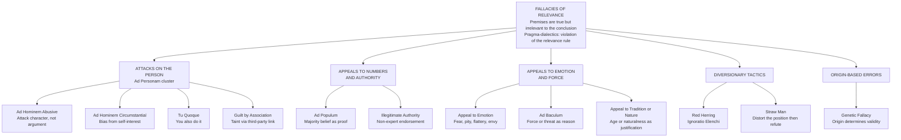

# Fallacies of Relevance

> [!abstract] TL;DR
> A fallacy of relevance occurs when an argument's premises, however true or emotionally compelling, have no logical bearing on the conclusion — the gap between premise and claim is topical, not evidential. Unlike formal fallacies, where structure is broken, these fallacies succeed rhetorically because irrelevant premises often carry high emotional force or social authority, making them among the most psychologically effective but logically defective moves in argument. Pragma-dialectics classifies them as violations of the **relevance rule**: participants in rational discourse must not advance premises that are not pertinent to the standpoint at issue.

---

## Intuition

**Analogy:** Imagine you are on trial for running a red light. Your lawyer presents evidence that you donate to charity, that the arresting officer once received a speeding ticket themselves, and that traffic violations are extremely common in this city. None of these facts — however true — bear on whether *you* ran *that* red light on *that* day. They are "off the record" in the logical sense: they concern different predicates, different subjects, or different times. The court's rules of evidence exist precisely to block such material from the decision because it is irrelevant, not because it is false.

This is exactly what fallacies of relevance do in everyday argument: they introduce premises that are true, emotionally powerful, socially authoritative, or rhetorically vivid — but which logically speak to a different question than the conclusion being argued for. The prosecutor who asks "but shouldn't we lock up dangerous people?" when arguing a procedural technicality is not giving *evidence* for any conclusion about that technicality — they are triggering a different inference altogether, redirecting the listener's attention to a question they can answer easily.

---

## How It Works

### The Relevance Criterion

In formal deductive logic, relevance is all-or-nothing: any premise that does not contribute to entailment can be dropped without altering validity. In informal logic and pragma-dialectics, relevance is a matter of *degree* and *topical bearing*: a premise is relevant to a conclusion if accepting or rejecting that premise should rationally raise or lower the probability of the conclusion, or if it constitutes a good reason — in the appropriate argumentative context — for accepting or rejecting the conclusion.

**Van Eemeren and Grootendorst's Relevance Rule** (Rule 4 of the critical discussion): *"A party may defend its standpoint only by advancing argumentation that is relevant to that standpoint."* A violation occurs when a premise addresses a different standpoint than the one at issue — attacking the arguer rather than the argument, appealing to majority opinion when the question is empirical truth, raising an emotional scenario when the question is logical entailment.

**Degrees of Relevance:**
- **Probative relevance** — the premise changes the probability of the conclusion (strongest form; what formal epistemology demands)
- **Dialectical relevance** — the premise is an appropriate response within the ongoing dialogue (context-dependent)
- **Topical relevance** — the premise shares subject matter with the conclusion (weakest form; insufficient alone)
- **Irrelevance** — the premise concerns a wholly different subject, person, or time than the claim

Fallacies of relevance live at the irrelevance end: the premise is not merely tangential but logically orthogonal to the conclusion.

### Taxonomy of the Ten Core Fallacies

**1. Ad Hominem — Against the Person**
Attacks the *arguer* rather than the *argument*. Three subtypes:
- *Abusive:* "Person A has flaw F; therefore A's claim C is wrong." A dishonest person can make true claims; a biased scientist can still produce valid experimental results.
- *Circumstantial:* "Person A has a financial stake in C; therefore C is false." Self-interest *may* motivate biased reasoning, but it does not falsify the argument's content.
- *Tu Quoque:* "Person A also does X; therefore A's argument that X is wrong is invalid." A hypocrite's argument about diet or morality can still be logically sound.

**2. Ad Populum — Appeal to Popular Opinion**
"Most people believe C; therefore C is true." Population belief is evidentially irrelevant to logical or factual conclusions. Majorities have believed geocentrism, that stress causes stomach ulcers, and that bloodletting cures fevers. Popular belief is only relevant when the claim *itself* is about social facts or norms — questions where collective agreement partly constitutes the answer.

**3. Illegitimate Appeal to Authority**
"Expert E asserts C; therefore C is true." A legitimate appeal to authority requires: genuine expertise, the claim falls within their field, no material conflict of interest, and consensus among peers supports the claim. The fallacy arises when any condition fails: a celebrity endorsing medicine, a scientist opining outside their domain, or a paid consultant defending their funder.

**4. Appeal to Emotion**
Premises describe a charged scenario — fear, pity, flattery, shame, envy — that triggers acceptance through affect rather than reasoning. The emotional scenario may be true and important in a different argument; the fallacy is using it as *logical support* for a conclusion it does not entail.

**5. Red Herring / Ignoratio Elenchi**
From Aristotle's *Sophistical Refutations*: *ignoratio elenchi* means "ignorance of refutation" — arguing past the point at issue. The arguer proves something *related to but different from* the stated conclusion. Named for dragging a smoked herring across a fox's trail to confuse hounds. When asked about an environmental record, a company that responds with a detailed account of its charitable giving is proving something no one disputed.

**6. Straw Man**
Misrepresent the opponent's position to make it easier to attack, then claim to have refuted the actual position. Pragma-dialectics identifies this as a violation of Rule 3 (the Standpoint Rule), but the relevance failure is equally central: the refutation is irrelevant because it addresses a position the opponent never held.

**7. Appeal to Tradition / Appeal to Nature**
*Tradition:* "This has always been done this way; therefore it is correct." Age of a practice is irrelevant to its validity — many long-standing traditions (bloodletting, child labor) were wrong. *Nature:* "This is natural; therefore it is good or safe." Naturalness is irrelevant to safety or ethical worth — many natural substances are lethal; many synthetic ones are beneficial.

**8. Ad Baculum — Appeal to Force**
The arguer threatens consequences for not accepting the conclusion. Force or coercion is not a logical reason for believing anything — it may compel compliance without justifying belief. The threat concerns what will happen, not why the conclusion is true.

**9. Genetic Fallacy**
The origin or history of a claim determines its truth value. "This theory was proposed by someone discredited" or "this idea originated in a disreputable context" are irrelevant to whether the idea is correct. The causal history of an argument is distinct from its logical merit.

**10. Guilt by Association**
Discredits a position by associating it with a person or group regarded as objectionable. "Policy X is supported by extremist group Y; therefore X is wrong." The company a claim keeps is irrelevant to its truth — many correct views have been held by objectionable people, and many incorrect views have been held by admirable ones.

### Refocusing Irrelevant Arguments

When an interlocutor deploys a relevance fallacy, the dialectically correct response is not to argue against the irrelevant premise (which implicitly legitimises it as relevant) but to redirect:

1. **Name the irrelevance:** "That may be true, but it doesn't speak to the question of whether..."
2. **Restate the standpoint:** "The issue before us is X; your argument addresses Y."
3. **Ask the linking question:** "How does that premise bear on this conclusion? What would make it relevant?"
4. **Apply scheme-specific critical questions:** For an authority appeal, ask whether they are genuinely expert and unbiased. For an emotional appeal, ask what the logical connection is between the scenario and the conclusion.



---

## Key Concepts

### Secondary

**What is a fallacy of relevance?** An argument commits a fallacy of relevance when it offers a premise that does not logically bear on the conclusion. The premise may be true, vivid, emotionally powerful, or even important in a different context — the defect is not falsity but *logical disconnection* from the point being argued.

**The core test:** Ask "If this premise is true, does that give me a better reason to believe the conclusion?" If the answer is "no, but it makes me *feel* differently about it" or "no, but it tells me something about the *person* making the argument," the premise is irrelevant.

**Why these fallacies work:** They exploit the psychological plausibility of relevance. Attacks on character feel relevant because we reasonably distrust unreliable sources — but this confounds source credibility with argument validity. Appeals to majority opinion feel relevant because many questions are indeed settled by consensus — but this confuses social facts with empirical ones. Fallacies of relevance are the most persuasive of all informal fallacies precisely because they *approximate* legitimate reasoning patterns while actually violating them.

| Fallacy | Irrelevant premise | Conclusion it claims to support |
|---------|-------------------|---------------------------------|
| Ad Hominem | "She is a known liar" | "Her climate-policy argument is wrong" |
| Ad Populum | "Everyone buys this brand" | "This brand is the best available" |
| Red Herring | "I support veterans and small businesses" | "My environmental record is sound" |
| Straw Man | "He wants to abolish all taxes" | "His tax-reform proposal is extremist" |
| Genetic Fallacy | "Freud used cocaine" | "Psychoanalysis is invalid" |
| Appeal to Tradition | "Medicine has always worked this way" | "This new treatment is unacceptable" |
| Ad Baculum | "Oppose this and you will lose funding" | "This proposal is correct" |
| Guilt by Association | "Radicals also support this policy" | "This policy is wrong" |

**Spotting the pattern:** Every relevance fallacy has the same deep structure — a premise that is psychologically resonant but logically orthogonal. The emotional or social "weight" of the premise is what makes it feel relevant; unpacking exactly *why* the premise does not bear on the conclusion requires holding the question "what would count as evidence for this conclusion?" clearly in mind.

### Undergraduate

#### Pragma-Dialectics and the Relevance Rule

Frans van Eemeren and Rob Grootendorst's pragma-dialectics provides the most rigorous theoretical account of why relevance fallacies are wrong. In the critical discussion model, argumentative exchanges are governed by ten procedural rules, the violation of which constitutes a fallacy. **Rule 4 — the Relevance Rule** states: *"A party may only defend its standpoint by advancing argumentation relevant to that standpoint."*

This formulation is important: relevance is not a property of propositions in isolation but of *argumentative moves within a dialogue*. Whether a premise is relevant depends on (a) what standpoint is being defended, (b) what the parties have agreed to treat as starting points at the opening stage, and (c) what argumentation scheme is appropriate for the context.

Under pragma-dialectics, fallacies of relevance are not mere logical blunders but **strategic maneuvers that derail the critical discussion** — they redirect the dialogue away from the standpoint at issue toward a different, often easier, target:
- *Ad hominem* derails by substituting the arguer for the argument
- *Ad populum* derails by substituting social consensus for evidential support
- *Red herring* derails by substituting a related-but-different standpoint
- *Straw man* derails by substituting a caricatured version of the opponent's standpoint

#### Degrees of Relevance and Topical Overlap

Douglas Walton's concept of **topical relevance** (1989) distinguishes three levels that are routinely conflated:

1. **Probative relevance** — the premise changes the probability of the conclusion; this is what epistemology requires for legitimate argument support
2. **Dialectical relevance** — the premise is an appropriate response to the question being discussed in this dialogue context
3. **Topical relevance** — the premise shares subject matter with the conclusion (shares vocabulary, names the same objects, concerns the same domain)

Fallacious appeals often achieve topical relevance while failing probative relevance. "The scientist drinks heavily" is *topically* relevant to "the scientist's theory is wrong" — they share the subject "scientist" — but the drinking habit has no *probative* relevance to the theory's validity. Recognising this gap is the analytical core of relevance fallacy detection.

#### Walton's Dialectical Typology

Walton's typology of dialogue (2007) shows that the *same move* can be legitimate in one type of dialogue and fallacious in another:

| Dialogue type | Primary goal | What relevance means |
|---------------|-------------|---------------------|
| Persuasion dialogue | Resolve a dispute via reasons | Premises must bear on the standpoint |
| Inquiry | Establish truth | Premises must have probative value |
| Negotiation | Reach agreement on interests | Power and interests are relevant |
| Deliberation | Decide what to do | Consequences and values are relevant |
| Information-seeking | Answer a question | Any bearing on the question |

An appeal to consequences ("We should accept this conclusion because accepting it will benefit society") is fallacious in an inquiry about empirical truth but *legitimate* in a deliberation about what action to take. Recognising the dialogue type is essential for judging whether a premise is relevant — the same move has different status in different contexts.

#### How to Identify and Refocus

**The relevance test:** Premise P is relevant to standpoint S if:
- P would raise or lower the probability of S if true (probative criterion)
- P directly addresses the subject matter of S (topical criterion)
- P is an appropriate response within the operative dialogue type (dialectical criterion)

**Refocusing techniques by fallacy family:**

*For ad hominem attacks:* Acknowledge the character point, then redirect: "Even if that is true, it doesn't establish that the argument is wrong. What specific fault do you find in the reasoning or evidence itself?"

*For ad populum:* "Popular support tells us what people believe, not what is true. What is the evidence — independent of popularity — for or against this claim?"

*For appeals to emotion:* "That scenario is genuinely important. But the question before us is whether X. Does the scenario constitute evidence that X is true or false — and if so, how?"

*For red herrings:* "That's an interesting point, but we were discussing [original standpoint]. Can we return to that question before we take this up?"

*For straw man:* "That's not quite my position. My actual claim is [restatement]. I'd welcome a response to that."

### Graduate

#### Relevance in Formal Argumentation Theory

Within Dung's abstract argumentation frameworks, relevance has a precise structural meaning: argument A is relevant to argument B if A appears on an attack path to B — attacking B directly, attacking something that defends B, or being attacked by something that defends B. Irrelevance, formally, is the absence of any attack or defence relation. Fallacies of relevance correspond to **spurious attack relations**: an argument A (the irrelevant premise) is inserted into the attack graph with an edge pointing at B (the target claim), but the edge does not represent genuine inferential defeat — it mimics one. The Dung framework cannot detect this class of error from topology alone; material evaluation of whether the attack genuinely defeats the argument's conclusion is required, making formal AAF analysis insufficient for relevance fallacy detection.

Walton's **relevance condition for defeasible argumentation schemes** is more tractable: each scheme comes with critical questions, and a premise is relevant to a conclusion derived by scheme S if it (a) supports the scheme's formal premises or (b) answers a critical question for S. Ad hominem is technically an attack on the expert opinion scheme's CQ1 — "Is the source reliable?" — but it is misapplied when offered as a *direct refutation of the conclusion* rather than as a probe of the scheme's applicability condition.

#### Strategic Maneuvering with Relevance

Van Eemeren's theory of **strategic maneuvering** identifies three instruments arguers use simultaneously to pursue both rhetorical and dialectical goals:

1. *Topical potential* — selection of what to argue about (exploited by red herring: introduce a favorable topic to replace the one at issue)
2. *Audience adaptation* — framing for the audience's commitments (exploited by ad populum and appeal to emotion: activate the audience's existing beliefs or emotional responses)
3. *Presentational devices* — rhetorical packaging (exploited by straw man: reframe the opponent's position as extreme, making refutation easier)

These instruments are legitimate when they serve both rhetorical and dialectical goals simultaneously — a skilled arguer selects vivid examples that are also genuinely probative. They become fallacious when the rhetorical goal overrides the dialectical one: when the arguer exploits the *appearance* of rational discourse while circumventing the relevance constraint to avoid engaging the actual standpoint.

#### Bayesian Account of Relevance

Bayesian epistemology offers a quantitative account of relevance: premise P is **evidentially relevant** to conclusion C if and only if P(C|P) ≠ P(C) — learning P changes the probability of C. This makes relevance testable in principle and admits of degrees (the Bayes factor |P(C|P) / P(C)| measures the strength of the evidential connection).

Under this account:
- *Ad hominem* fails because P(theory is wrong | scientist drinks heavily) = P(theory is wrong) — the drinking has no evidential impact on the theory's truth absent a specific mechanism linking alcohol to experimental error.
- *Ad populum* fails because P(vaccine is effective | 70% of people believe it is effective) ≈ P(vaccine is effective) — for empirical claims about biological mechanisms, popular belief is independent of truth.
- A *legitimate appeal to authority* succeeds because P(C | expert with reliable track record asserts C) > P(C) — the expert's track record constitutes genuine Bayesian evidence about the reliability of their current assertion.

The Bayesian account explains why relevance fallacies are *defeasible* rather than absolutely invalid: if a causal mechanism can be established (e.g., the scientist's heavy drinking caused them to misread data), what was an irrelevant premise becomes relevant. The fallacy is not in the premise per se but in the absence of the bridging mechanism that would create an evidential connection.

---

## Python Demo

Implements a relevance scoring model for argument claim-premise pairs. Relevance is computed as Jaccard similarity between word sets (term overlap using Python built-in sets, no NLP libraries). Pairs are classified as "relevant" or "fallacious" based on a threshold. A scatter plot shows relevance score vs. rhetorical strength score, making the high-strength-but-low-relevance signature of relevance fallacies visible.

```python
import numpy as np
import matplotlib.pyplot as plt
from matplotlib.lines import Line2D

# ── Argument pair dataset ─────────────────────────────────────────────────────
# Each entry: (claim, premise, rhetorical_strength, label, is_fallacious)
# rhetorical_strength: how emotionally compelling or authoritative the premise
#   sounds to a naive listener (pre-assigned 0-1 scale)
# is_fallacious: True if premise is logically irrelevant to claim

PAIRS = [
    # Fallacious arguments — premises are irrelevant to claims
    (
        "carbon emissions policy should be reformed",
        "climate scientist has large personal carbon footprint lifestyle",
        0.78, "Ad Hominem", True,
    ),
    (
        "economic stimulus package benefits workers",
        "majority population surveys show broad support this policy",
        0.80, "Ad Populum", True,
    ),
    (
        "vaccines autism link exists requires investigation",
        "famous celebrity actor publicly states vaccines dangerous autism",
        0.65, "Bad Authority", True,
    ),
    (
        "death penalty abolition required justice reform",
        "imagine innocent people suffering execution wrongful conviction",
        0.88, "Appeal to Emotion", True,
    ),
    (
        "federal budget deficit reduction necessary fiscal policy",
        "politicians historically demonstrated corruption dishonesty throughout history",
        0.58, "Red Herring", True,
    ),
    (
        "firearm sales regulation background checks legislation",
        "opponents want confiscate guns from every law abiding citizen",
        0.76, "Straw Man", True,
    ),
    (
        "women military frontline combat roles policy change",
        "historical tradition never placed women frontline combat roles",
        0.72, "Appeal to Tradition", True,
    ),
    (
        "support vote approve proposed legislation bill council",
        "legislators opposing this measure face severe electoral consequences",
        0.82, "Ad Baculum", True,
    ),
    (
        "homeopathic treatment medical effectiveness scientific validity",
        "homeopathy originated eighteenth century prescientific era knowledge",
        0.52, "Genetic Fallacy", True,
    ),
    (
        "politician economic tax reform proposal policy",
        "politician photographed convicted fraudster financial scandal news",
        0.68, "Guilt by Assoc.", True,
    ),
    # Valid arguments — premises are genuinely relevant to claims
    (
        "atmospheric carbon dioxide levels rising climate warming",
        "atmospheric carbon dioxide measurements show consistent upward trend measurements",
        0.90, "Valid Evidence", False,
    ),
    (
        "regular aerobic exercise reduces heart disease cardiovascular risk",
        "clinical trials aerobic exercise lowers cardiovascular mortality rates significantly",
        0.87, "Valid Evidence", False,
    ),
    (
        "drug medication causes liver damage hepatotoxicity patients",
        "clinical trial data shows liver enzyme elevation drug users treated group",
        0.84, "Valid Evidence", False,
    ),
    (
        "minimum wage increase reduces poverty low income workers",
        "studies minimum wage hikes show significant income gains low wage workers",
        0.89, "Valid Evidence", False,
    ),
    (
        "vaccination rates disease spread prevention herd immunity population",
        "epidemiological data demonstrates herd immunity vaccination rates population study",
        0.91, "Valid Evidence", False,
    ),
]

# ── Relevance scoring via Jaccard word-set overlap ────────────────────────────
STOPWORDS = {
    "the", "a", "an", "is", "are", "was", "were", "be", "been", "being",
    "have", "has", "had", "do", "does", "did", "will", "would", "could",
    "should", "may", "might", "shall", "can", "of", "in", "on", "at",
    "to", "for", "with", "by", "from", "and", "or", "but", "not",
    "this", "that", "these", "those", "it", "its", "we", "they", "their",
    "our", "all", "as", "if", "so", "no", "into", "out", "than", "then",
    "when", "who", "which", "where", "how", "what", "there", "him",
    "her", "his", "she", "he", "me", "my", "you", "your", "also",
}


def word_set(text):
    """Tokenize text into a set of lowercase content words using Python built-ins."""
    result = set()
    for w in text.lower().split():
        w = w.strip(".,!?;:'\"-")
        if w and len(w) > 2 and w not in STOPWORDS:
            result.add(w)
    return result


def jaccard_relevance(claim, premise):
    """
    Jaccard similarity between claim and premise word sets.

    Jaccard = |intersection| / |union|

    Interpretation: measures topical word overlap as a proxy for whether
    the premise addresses the same subject matter as the claim.
    Low score = premise words are largely disjoint from claim words,
    a hallmark of fallacies of relevance.
    """
    c_words = word_set(claim)
    p_words = word_set(premise)
    union_ = c_words | p_words
    if not union_:
        return 0.0
    return len(c_words & p_words) / len(union_)


# ── Compute scores ────────────────────────────────────────────────────────────
claims = [p[0] for p in PAIRS]
premises = [p[1] for p in PAIRS]
strengths = np.array([p[2] for p in PAIRS])
fallacy_names = [p[3] for p in PAIRS]
is_fallacious = np.array([p[4] for p in PAIRS], dtype=bool)

relevance_scores = np.array(
    [jaccard_relevance(c, pr) for c, pr in zip(claims, premises)]
)

THRESHOLD = 0.18  # below this, classify premise as irrelevant
predicted_irrelevant = relevance_scores < THRESHOLD
accuracy = np.mean(predicted_irrelevant == is_fallacious)

# ── Scatter plot ──────────────────────────────────────────────────────────────
FALLACY_COLOR = "#dc2626"
VALID_COLOR = "#059669"

fig, ax = plt.subplots(figsize=(12, 7))

for i in np.where(is_fallacious)[0]:
    ax.scatter(
        relevance_scores[i], strengths[i],
        c=FALLACY_COLOR, marker="X", s=150, zorder=5,
        edgecolors="white", linewidths=0.7, alpha=0.92,
    )
    ax.annotate(
        fallacy_names[i],
        xy=(relevance_scores[i], strengths[i]),
        xytext=(7, 4), textcoords="offset points",
        fontsize=8.5, color=FALLACY_COLOR, fontweight="bold",
    )

for i in np.where(~is_fallacious)[0]:
    ax.scatter(
        relevance_scores[i], strengths[i],
        c=VALID_COLOR, marker="o", s=130, zorder=5,
        edgecolors="white", linewidths=0.7, alpha=0.92,
    )
    ax.annotate(
        fallacy_names[i],
        xy=(relevance_scores[i], strengths[i]),
        xytext=(7, 4), textcoords="offset points",
        fontsize=8.5, color=VALID_COLOR,
    )

ax.axvline(
    THRESHOLD, color="#6366f1", linestyle="--", linewidth=2.0, alpha=0.85,
)
ax.axvspan(0, THRESHOLD, alpha=0.06, color=FALLACY_COLOR)
ax.axvspan(THRESHOLD, 1.0, alpha=0.06, color=VALID_COLOR)

ax.text(
    THRESHOLD / 2, 0.965,
    "FALLACIOUS ZONE\nIrrelevant premise",
    ha="center", va="top", fontsize=8.5, color=FALLACY_COLOR, alpha=0.75,
)
ax.text(
    (THRESHOLD + 0.75) / 2, 0.965,
    "RELEVANT ZONE\nOn-topic premise",
    ha="center", va="top", fontsize=8.5, color=VALID_COLOR, alpha=0.75,
)

legend_elements = [
    Line2D([0], [0], marker="X", color="w",
           markerfacecolor=FALLACY_COLOR, markersize=11,
           label="Fallacious argument"),
    Line2D([0], [0], marker="o", color="w",
           markerfacecolor=VALID_COLOR, markersize=11,
           label="Valid argument"),
    Line2D([0], [0], linestyle="--", color="#6366f1", linewidth=2.0,
           label=f"Relevance threshold = {THRESHOLD}"),
]
ax.legend(handles=legend_elements, loc="lower right", fontsize=9.5, framealpha=0.9)

ax.set_xlabel(
    "Relevance Score  (Jaccard word-set overlap: claim vs. premise)\n"
    "0 = completely disjoint topics    1 = identical vocabulary",
    fontsize=10,
)
ax.set_ylabel(
    "Rhetorical Strength Score\n"
    "Perceived persuasive force of premise to a naive listener",
    fontsize=10,
)
ax.set_title(
    "Fallacies of Relevance: Topical Relevance vs. Rhetorical Strength\n"
    f"High strength + low relevance = dangerous fallacy     "
    f"Threshold accuracy = {accuracy:.0%}",
    fontsize=11, fontweight="bold", pad=14,
)
ax.set_xlim(-0.03, 0.70)
ax.set_ylim(0.45, 1.00)
ax.grid(True, alpha=0.28, linestyle=":")

plt.tight_layout()
plt.savefig("fallacies_of_relevance_scatter.png", dpi=150, bbox_inches="tight")
plt.show()

# ── Console report ────────────────────────────────────────────────────────────
print("=== Relevance Classification Report ===")
print(
    f"{'Pair':<22} {'Relevance':>10} {'Strength':>10} "
    f"{'Predicted':>12} {'Actual':>12}"
)
print("-" * 70)
for name, rel, str_val, fallacious, pred_irr in zip(
    fallacy_names, relevance_scores, strengths, is_fallacious, predicted_irrelevant
):
    predicted = "FALLACIOUS" if pred_irr else "RELEVANT"
    actual = "FALLACIOUS" if fallacious else "RELEVANT"
    flag = "" if predicted == actual else "  << misclassified"
    print(f"{name:<22} {rel:>10.3f} {str_val:>10.2f} {predicted:>12} {actual:>12}{flag}")

print(f"\nJaccard threshold: {THRESHOLD}   Classification accuracy: {accuracy:.0%}")
print(
    "Key insight: fallacious arguments score LOW on relevance "
    "but HIGH on rhetorical strength — they are persuasive precisely "
    "because they are irrelevant."
)
```

**What the output shows:** Fallacious arguments cluster in the upper-left quadrant — high rhetorical strength, low relevance score. Valid arguments cluster in the upper-right — high relevance AND high strength. The separation is not perfect: the Genetic Fallacy and Red Herring may share incidental vocabulary with their claims, nudging their Jaccard scores up slightly, while the Straw Man by design refers to the opponent's position using the opponent's vocabulary, producing moderate overlap. Classification accuracy demonstrates that Jaccard word-overlap, despite its simplicity, reliably detects the topical orthogonality between fallacious premises and their target conclusions.

---

## Real-World Applications

**1. Political Discourse — Ad Hominem as Default Attack**
During the 2004 US presidential campaign, the "Swift Boat Veterans" campaign questioned John Kerry's combat record as the primary argument against his policy positions on Iraq. Regardless of its factual accuracy, the campaign's logical structure was ad hominem: personal and military character was treated as evidence against policy judgment. The episode gave the English language "swift-boating" as a common noun for character-based political attacks that substitute for policy argument — demonstrating that relevance fallacy patterns are stable enough to acquire proper names when they succeed at scale.

**2. Advertising — Industrialised Ad Populum and Appeal to Emotion**
Consumer advertising routinely deploys ad populum ("America's number-one-selling car") and appeal to emotion (insurance commercials featuring families following tragedy) as primary persuasion mechanisms. Sales rank reflects marketing spend and distribution, not quality; the emotional scenario generates fear, not evidence of coverage superiority. The advertising industry has effectively industrialised relevance fallacies, exploiting low-effort System 1 processing to bypass evidential evaluation. The industry's self-awareness is demonstrated by the fact that advertising standards bodies in the UK and EU specifically prohibit "misleading" appeals that imply relevance the premise does not possess.

**3. Science Communication — Genetic Fallacy in Climate Denial**
Climate change denial campaigns have argued that climate science is "politically motivated" (genetic fallacy — the political context of funding does not determine the truth of temperature measurements) and that climate scientists "benefit financially from alarming findings" (circumstantial ad hominem — financial motivation is irrelevant to the validity of measurement data). These are recognisable relevance fallacies that have nonetheless been persistently effective in public discourse because they exploit a legitimate epistemic heuristic — motivated reasoning *does* exist and *does* warrant scrutiny — and misapply it to a domain where the evidence is independent of the funder's interests.

**4. Legal Proceedings — Exclusionary Rules as Formal Relevance Enforcement**
Common law evidence rules directly operationalise the relevance criterion. US Federal Rules of Evidence Rule 401 defines relevant evidence as having "any tendency to make a fact more or less probable than it would be without the evidence." Rule 403 permits exclusion of evidence whose probative value is "substantially outweighed by the danger of unfair prejudice" — which addresses cases where emotional relevance (gruesome photographs, inflammatory prior acts) overwhelms evidential probative value. Courts have independently derived the pragma-dialectical relevance rule as a procedural constraint on argumentative rationality, demonstrating that the relevance criterion is not merely an academic nicety but a practical necessity for fair adjudication.

**5. Online Debate — Straw Man Proliferation in Low-Context Environments**
Social media's character limits and high-velocity exchange incentivise straw manning: it is faster to caricature an opponent's position than to engage it accurately, and audiences — who typically lack context for the original position — cannot detect the distortion. Computational argument mining studies of Twitter and Reddit debate threads (Habernal and Gurevych 2017) found that straw man is the most common fallacy pattern in comment-thread exchanges. The low relevance of the attack — addressing a position the opponent never held — is undetectable to bystanders who lack conversational context, making straw man particularly effective in high-audience, low-bandwidth environments.

---

## Common Pitfalls

- **Dismissing all personal attacks as fallacies** — Circumstantial ad hominem and questions about conflict of interest are *legitimate critical questions* within the expert opinion argumentation scheme. A pharmaceutical company's in-house scientist arguing that their own drug is safe provides testimony legitimately challenged by the funding relationship. The fallacy is using character as a *substitute* for argument evaluation, not as a *probe* of source reliability.

- **Treating fallacy labels as magic refutations** — Calling an argument "ad hominem" in a debate does not defeat it; it raises the critical question "Is this premise relevant to this conclusion?" If the personal fact does bear on the argument (e.g., a witness's documented perjury is relevant to the credibility of their current testimony), the label is misapplied. Fallacy names are tools for analysis, not verbal trump cards.

- **Confusing relevance fallacies with formal fallacies** — Fallacies of relevance do not arise from broken logical form. "All mammals have hearts; Fido has a heart; therefore Fido is a mammal" is a *formal* fallacy (affirming the consequent — the structure fails). "This scientist makes embarrassing public statements; therefore their research findings are wrong" is a *relevance* fallacy — the structure could support a valid inference from different premises; this particular premise simply does not bear on this conclusion.

- **Missing context-dependence** — Whether a premise is relevant depends on the dialogue type. An appeal to consequences ("This policy will harm workers") is irrelevant in a pure inquiry about whether the policy is empirically correct but genuinely relevant in a deliberation about whether to adopt it. Applying the relevance test from one dialogue type to another produces false positives and false negatives.

- **Overlooking the straw man's unintentional form** — Straw man does not require deliberate distortion; it arises from genuine misunderstanding, selective quotation, or implicit over-generalisation. A critic who sincerely misunderstands a nuanced position and responds to their misunderstanding is committing the fallacy even without bad faith. The pragma-dialectical remedy — request a precise restatement of the original standpoint before responding — protects against both deliberate and accidental straw-manning.

- **Conflating appeal to nature with the naturalistic fallacy** — The appeal to nature as a relevance fallacy says "this is natural, therefore it is good or safe" — naturalness is irrelevant to ethical or epistemic worth. G.E. Moore's *naturalistic fallacy* (1903) is the distinct error of defining "good" as identical to any natural property. The two errors are related but not identical; using them interchangeably creates confusion in both directions.

---

## Related Concepts

- [[Arguments_Validity_and_Soundness]] — Fallacies of relevance are the informal counterparts to formal invalidity; understanding why premises must entail or support a conclusion is the prerequisite for understanding what makes a premise *irrelevant* to it; the distinction between validity and soundness maps onto the distinction between structural and material argument evaluation
- [[Inductive_Logic]] — Many relevance fallacies exploit inductive heuristics: ad populum exploits the legitimate inductive pattern that large samples are informative; illegitimate authority appeals exploit the legitimate inductive pattern that expert testimony is evidential; the fallacies succeed by activating these heuristics in contexts where they do not apply
- [[Argumentation_Theory_and_Dialectic]] — Pragma-dialectics provides the theoretical foundation for classifying relevance fallacies as violations of Rule 4; Dung's abstract argumentation framework models the structural position of irrelevant arguments as spurious attack edges; Walton's argumentation schemes supply the critical questions that distinguish legitimate from fallacious uses of patterns that superficially resemble relevance violations
- [[Persuasion_and_Audience]] — Ethos, pathos, and logos map onto distinct categories of relevance fallacy: illegitimate ethos appeals produce ad hominem and bad authority fallacies; illegitimate pathos appeals produce appeal to emotion and ad baculum; the rhetorical question "is this appeal appropriate to this audience and standpoint?" is the rhetorical version of the relevance criterion
- [[Classical_Rhetoric_and_Aristotle]] — Aristotle's *Sophistical Refutations* is the earliest systematic treatment of fallacies, including ignoratio elenchi; his tripartite division of proof into ethos, pathos, and logos supplies the original framework for diagnosing which type of evidence is being invoked and whether it is appropriate to the question at hand
- [[Attitudes_and_Persuasion]] — The Elaboration Likelihood Model explains the psychological mechanism behind relevance fallacies: peripheral-route processing accepts irrelevant premises — authority cues, popularity signals, emotional associations — when motivation or capacity for central processing is low; ELM explains *why* relevance fallacies work on audiences, not merely *that* they are logically wrong
- [[Cognitive_Biases]] — Authority bias, bandwagon effect, in-group bias, and the affect heuristic are the cognitive machinery that relevance fallacies exploit; each fallacy is, in effect, a systematised activation of a specific cognitive shortcut in an argumentative context where that shortcut produces a logically unjustified conclusion

---

## Review Questions

### Secondary

1. Explain in your own words why an ad hominem attack is a *fallacy of relevance* rather than a *formal fallacy*. Use a specific example: choose a real policy debate, identify an ad hominem move that has been made in it, and show exactly why the premise about the person does not bear on the conclusion about the policy.

2. "Everyone in this room agrees that X is true, so X must be true." Identify the fallacy, explain why majority opinion is irrelevant to the truth of an empirical claim, and construct a case where majority opinion *would* be relevant — what kind of claim would it be relevant to, and why?

3. A pharmaceutical company runs an advertisement showing a grandmother playing with grandchildren, followed by the product name. Identify the fallacy being deployed. Could the advertisement be redesigned to make a genuinely relevant argument for the product? What premises would that require?

### Undergraduate

1. Walton argues that ad hominem is not always fallacious — it can be a legitimate critical question within the argumentation scheme for expert opinion. Construct an example where a circumstantial ad hominem move is (a) fallacious and (b) legitimate. What precisely distinguishes the two cases? Use Walton's critical questions for the expert opinion scheme to make the distinction explicit.

2. A debater responds to "We should increase the minimum wage" with "My opponent also supports rent control and higher taxes — they clearly want to punish business." Identify all fallacy types present. Then write a model response to the original claim that is (a) fallacy-free, (b) addresses the actual claim, and (c) uses at least one legitimate argumentation scheme.

3. Van Eemeren's relevance rule says premises must be "relevant to the standpoint." But relevance is context-dependent: what counts as relevant in a scientific inquiry differs from what counts as relevant in a policy deliberation. Give an example of a premise that is (a) irrelevant in an empirical inquiry but relevant in a deliberation, and (b) relevant in an inquiry but not in a deliberation. What does this context-dependence imply for fallacy detection?

### Graduate

1. The Bayesian account of relevance holds that premise P is evidentially relevant to conclusion C if and only if P(C|P) ≠ P(C). Under this account, an appeal to authority is not inherently fallacious — it is legitimate when the expert's track record creates a non-trivial Bayes factor. Derive the conditions under which an appeal to authority is epistemically legitimate under Bayesian epistemology, and show mathematically when it degenerates into the fallacious form. What does this imply for the pragma-dialectical relevance rule's context-independence?

2. Argument mining systems that aim to detect fallacies of relevance face a fundamental challenge: relevance is a pragmatic property dependent on dialogue context, not a syntactic or semantic property of the text alone. Design an argument mining pipeline specifically targeting relevance fallacies, specifying the input representation, the relevance scoring function going beyond simple word overlap, the classification model, and an evaluation metric. What are the theoretical limits of using NLP methods to detect pragmatic relevance failures?

3. Van Eemeren's distinction between legitimate strategic maneuvering and fallacious derailing via relevance violations requires identifying when a rhetorical move "undermines" dialectical rationality. A critic argues that this distinction is culturally loaded — what counts as "relevant" to a standpoint is determined by community norms, and Eurocentric dialectical traditions may systematically treat non-Western argumentation styles as committing relevance violations. Reconstruct the strongest version of this objection, evaluate pragma-dialectics' theoretical resources for responding to it at the opening-stage level, and assess whether those resources are adequate for cross-cultural debate contexts.

---

## Sources

- Walton, Douglas N. *Informal Logic: A Handbook for Critical Argumentation*. Cambridge University Press, 1989. — The definitive handbook treatment of fallacies of relevance, with detailed analysis of ad hominem, red herring, and illegitimate appeals to authority.
- van Eemeren, Frans H., and Rob Grootendorst. *Argumentation, Communication, and Fallacies: A Pragma-Dialectical Perspective*. Lawrence Erlbaum Associates, 1992. — Formulates the ten rules of critical discussion and classifies all major fallacies as violations of specific rules, providing the theoretical foundation for the pragma-dialectical account of relevance.
- Walton, Douglas, Chris Reed, and Fabrizio Macagno. *Argumentation Schemes*. Cambridge University Press, 2008. — Supplies the critical questions for each argumentation scheme that determine whether a relevance-threatening move is fallacious or a legitimate probe of scheme applicability.
- Hamblin, Charles L. *Fallacies*. Methuen, 1970. — The foundational modern study that rehabilitated fallacy theory after centuries of neglect; Chapter 3 reconstructs the classical taxonomy and provides the earliest rigorous diagnosis of why ad hominem and ignoratio elenchi resist simple analysis.
- Tindale, Christopher W. *Fallacies and Argument Appraisal*. Cambridge University Press, 2007. — Surveys cognitive, dialectical, and rhetorical approaches to fallacy theory with an excellent treatment of the relationship between relevance fallacies and audience psychology that bridges informal logic and persuasion research.

---

#logic #fallacies #relevance #ad-hominem #red-herring #informal-logic
