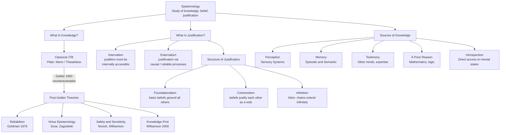

# Epistemology and Theories of Knowledge

> [!abstract] TL;DR
> Epistemology is the branch of philosophy that asks what knowledge is, how we acquire it, and how we can be justified in our beliefs. The classical answer — knowledge is justified true belief (JTB), tracing to Plato — was shattered in three pages by Edmund Gettier in 1963, who showed that a belief can be justified and true yet clearly not constitute knowledge. The half-century of post-Gettier responses — reliabilism, virtue epistemology, sensitivity/safety conditions, knowledge-first theory — collectively reveal that knowledge is not a simple logical compound but something more fundamental than any analysis yet captures.

---

## Intuition

**Analogy:** Imagine two hikers who both correctly believe there is water at the next campsite. Hiker A read it in a reliable, recently updated trail guide and formed that belief from that guide. Hiker B overheard a rumour from a stranger who was actually confused about a different campsite — but by coincidence, the campsite B believed in does indeed have water. Both hikers have a justified true belief: B is justified because overheard reports are generally reasonable evidence. Yet almost everyone's intuition says only A *knows* there is water, while B got lucky.

This gap — the space between a belief that happens to be true and justified, and genuine knowledge — is the Gettier problem. Epistemology is the project of understanding what fills that gap, where beliefs come from in the first place, and which belief-forming processes deserve the title "knowledge-producing."

---

## How It Works

### Core Mechanics

**Epistemology's central question** is the analysis of propositional knowledge: what does it mean for a person S to *know* that a proposition p is true? Three subsidiary questions structure the field:

1. **The nature of knowledge** — What is knowledge, and how does it differ from mere true belief or lucky guessing?
2. **The sources of knowledge** — Which faculties (perception, memory, reason, testimony) are capable of generating knowledge, and under what conditions?
3. **The structure of justification** — How is justification structured? Does it bottom out in basic beliefs, depend on coherence among all beliefs, or require some other architecture?

**The classical answer — Justified True Belief (JTB):** Deriving from Plato's dialogues *Meno* and *Theaetetus*, this account holds that S knows p if and only if:
- **Truth:** p is true
- **Belief:** S believes p
- **Justification:** S is justified in believing p

Each condition was thought necessary: a false belief cannot be knowledge; an unbelieved truth is not known; and a lucky guess, even if true, is not knowledge. Together they seemed sufficient — until 1963.

**Gettier's refutation (1963):** Edmund Gettier published a two-and-a-half page paper showing that JTB is not sufficient for knowledge. His canonical case (Smith/Jones, jobs and coins) can be abstracted as:

> S has a justified belief in a true proposition, but the truth of that proposition and the justification are *connected only by luck*.

In the most vivid version: you look at a clock that has always been reliable. It reads 3:47. You form the justified true belief "it is 3:47." But the clock stopped exactly 12 hours ago. It is 3:47 — but you are right by sheer coincidence, not because your belief-forming process tracked the truth.

Gettier showed that justification and truth can run in parallel without the justification being *responsible* for the truth. This decoupling is epistemic luck, and eliminating it is the unfinished project of contemporary epistemology.

---

### Flow / Architecture



---

## Key Concepts

### Secondary

- **Justified True Belief (JTB)** — The Platonic tripartite definition: S knows p iff p is true, S believes p, and S is justified in believing p. Intuitive and historically foundational, but Gettier proved it insufficient in 1963.

- **Epistemic luck** — A belief is true by epistemic luck when it is true in the actual world but could easily have been false — the agent would have formed the same belief even if p were not true. Gettier cases are paradigm instances. Nearly all post-Gettier theories are attempts to rule out epistemic luck while preserving genuine knowledge.

- **Epistemic justification** — The property that distinguishes rational, responsible belief from mere opinion. A belief is justified when the agent has adequate grounds or reasons for it. The central debate is whether those grounds must be *internally accessible* to the agent (internalism) or whether external factors (like the reliability of the process) can ground justification even without the agent knowing about them (externalism).

- **Sources of knowledge** — The canonical five:
  - *Perception* — The most basic source; direct sensory contact with the external world.
  - *Memory* — Preserves knowledge across time, but introduces the possibility of degradation and false memory.
  - *Testimony* — Much of what we know we know because someone told us; social epistemology studies its conditions and limits.
  - *A priori reason* — Knowledge that does not depend on sensory experience: mathematics, logic, analytic truths.
  - *Introspection* — Allegedly provides privileged, direct access to one's own mental states; challenged by social and cognitive psychology.

- **Epistemic internalism vs. externalism** — Internalists (Chisholm, BonJour) hold that what justifies a belief must be accessible to the agent by reflection alone — you can always examine your own reasons. Externalists (Goldman, Nozick) deny this: what matters for justification is the causal or nomological relationship between the belief and the fact, regardless of whether the agent is aware of it. A child or animal can have justified true beliefs without being able to articulate the grounds.

### Undergraduate

- **Reliabilism (Alvin Goldman, 1979)** — Knowledge is true belief produced by a *reliable cognitive process* — one that tends to produce true beliefs across the relevant range of situations. This moves justification outside the head: what matters is not whether the agent has access to good reasons but whether their belief-forming mechanism (perception, memory, inference) is in fact truth-tracking. This handles Gettier cases when reliability is specified correctly, but faces the *generality problem*: cognitive processes can be described at many levels of abstraction (vision / colour vision / peripheral colour vision at dusk), and the reliability of the same token process varies wildly across descriptions.

- **Virtue epistemology (Ernest Sosa, Linda Zagzebski)** — Knowledge is a *manifestation of intellectual virtue* — stable, reliable cognitive dispositions like perceptual acuity, open-mindedness, rigorousness in inference, and intellectual humility. Sosa distinguishes *animal knowledge* (true belief that manifests a competence) from *reflective knowledge* (additionally endorsed by the agent's own reasoning). Zagzebski's *virtue reliabilism* holds that moral and intellectual virtues are unified: knowledge is to epistemology what virtuous action is to ethics. Virtue epistemology naturally handles epistemic responsibility and the ethics of belief formation.

- **Sensitivity (Robert Nozick, 1981)** — S's belief that p is *sensitive* if: were p false, S would not believe p. This is a counterfactual condition, evaluated at close possible worlds. It rules out many Gettier cases: if the stopped clock had been showing the wrong time, you would still have believed whatever time it showed. But sensitivity generates counterintuitive results for necessary truths (you cannot believe a necessary truth differently in nearby worlds) and for closure under known entailment.

- **Safety (Timothy Williamson, Martin Pritchard)** — S's belief that p is *safe* if: S could not easily have formed a false belief in circumstances relevantly similar to actual. Safety focuses on belief-forming methods in nearby worlds rather than the truth of p itself. Unlike sensitivity it is not symmetric; it handles necessary truths and preserves closure better, though edge cases remain.

- **Foundationalism** — Justification has an architectural structure: some beliefs are *basic* — justified but not by other beliefs (e.g., present perceptual experiences, a priori intuitions) — and all other justified beliefs derive their justification from basic ones. Classical foundationalism (Descartes) requires basic beliefs to be infallible; modest foundationalism weakens this. The persistent challenge is specifying what makes a belief genuinely basic without appealing to some further justification.

- **Coherentism** — No beliefs are independently basic. Instead, a belief is justified by belonging to a mutually supporting, coherent web of beliefs (Neurath's raft: no single plank is foundational; the whole raft supports each plank). Coherentism avoids the regress problem but faces the *isolation objection*: a highly coherent but systematically disconnected web of beliefs could fail to track the external world altogether.

- **Infinitism (Peter Klein)** — The regress of justification is neither terminated in basic beliefs (foundationalism) nor circular (coherentism) but genuinely infinite. Justification is a potential that can always be actualized by giving more reasons. Humans have finite minds, but the *structure* of adequate justification is infinite. Klein argues that both foundationalism and coherentism misrepresent the normative ideal.

### Graduate

- **Knowledge-first epistemology (Timothy Williamson, *Knowledge and Its Limits*, 2000)** — Rather than analyzing knowledge as a compound of belief, truth, and justification, Williamson argues that knowledge is *the most general factive mental state* and cannot be analyzed into more primitive components. Justification, evidence, and belief are all to be explained in terms of knowledge: your evidence just *is* what you know; belief is a commitment to act as if you know. This inverts the traditional direction of analysis. The principal motivation is that all Gettier-proof analyses collapse under sufficiently ingenious counterexamples — perhaps because knowledge is not the sort of thing that has a non-circular analysis.

- **Epistemic closure and the lottery paradox** — Closure under known entailment: if S knows p, and S knows p entails q, then S knows q. This principle is intuitively compelling but generates puzzles. You know you have hands, and you know having hands entails you are not a brain in a vat — but do you know you are not a brain in a vat? Lottery cases: you know it is very unlikely your ticket won, but you do not know your ticket lost (it might be the winner). Yet you know the premise from which "my ticket lost" seems to follow. Contextualism (David Lewis, Keith DeRose) resolves this by claiming that "knows" is context-sensitive: the same claim can be true in an everyday context and false in a skeptical one.

- **Social epistemology** — Knowledge is produced and transmitted socially; individual epistemology abstracts away much of what actually shapes belief. Key topics:
  - *Testimony* — Most human knowledge is inherited from others. What licenses this? Reductionists (Hume) say testimony is justified only when we have independent track-record evidence of testifier reliability. Anti-reductionists (Thomas Reid, C. A. J. Coady) say testimony is a basic source: we are entitled to trust testimony by default, absent defeating evidence.
  - *Expertise and epistemic authority* — How should a layperson form beliefs about technical matters (vaccines, climate, economics) when they cannot evaluate the evidence themselves? Extending trust to credentialed experts is rational, but requires second-order judgment about which experts to trust.
  - *Echo chambers and epistemic bubbles* — An epistemic bubble is a network where contrary evidence simply fails to reach the agent (a filter problem). An echo chamber is worse: it actively trains agents to distrust outside sources (a trust problem). C. Thi Nguyen argues that escaping an echo chamber requires more than encountering counter-evidence, because the chamber has pre-emptively discredited the source of that evidence.

- **Feminist epistemology and standpoint theory** — Sandra Harding, Lorraine Code, Patricia Hill Collins, and Donna Haraway argue that the "view from nowhere" — the ideal of perfectly objective, disembodied knowledge — is a myth. All knowledge is *situated*: produced from a particular social, historical, and embodied position. Standpoint theory adds that the social positions of the marginalized can *epistemically privilege* certain forms of knowledge: those who live under a system understand its workings in ways those who benefit from it do not. Haraway's "situated knowledge" proposes replacing the impossible god's-eye view with an explicit acknowledgment of epistemic location — not as relativism but as a condition for more rigorous, responsible knowledge.

---

## Python Demo

```python
import numpy as np
import matplotlib.pyplot as plt

# Simulate a population of belief-forming agents.
# Each agent has a process reliability in [0.5, 1.0]:
#   - High reliability: the agent's perceptual / inferential process tracks truth well.
#   - Low reliability: the agent's beliefs are largely correct by luck.
# We then classify agents under four competing theories of knowledge.

rng = np.random.default_rng(42)
N = 2000

# Agent process reliability drawn uniformly from [0.5, 1.0]
process_reliability = rng.uniform(0.5, 1.0, N)

# Whether each agent forms a true belief (Bernoulli with p = reliability)
truth = rng.random(N) < process_reliability

# Justification: an agent is justified when their reliability exceeds the threshold.
# This models access-based justification (the agent has adequate grounds).
justification_threshold = 0.65
justified = process_reliability >= justification_threshold

# Gettier cases: the belief is true and justified, but true BY LUCK.
# Modeled as: the probability of a Gettier structure = (1 - reliability) * 0.7.
# A highly reliable agent rarely forms beliefs lucky-true for the wrong reasons.
# A lower-reliability agent's true beliefs are more often fortuitously correct.
gettier_prob = np.clip((1.0 - process_reliability) * 0.7, 0.0, 1.0)
is_gettier = rng.random(N) < gettier_prob

# ---- Knowledge under four theories ----

# 1. Classical JTB: knowledge = justified AND true
jtb = justified & truth

# 2. Anti-luck JTB (Gettier fix): knowledge = JTB AND not a Gettier case
anti_luck = jtb & ~is_gettier

# 3. Reliabilism (Goldman 1979): knowledge = true belief from a reliable process
reliabilist_threshold = 0.75
reliabilist = truth & (process_reliability >= reliabilist_threshold)

# 4. Sensitivity / Safety (Nozick 1981): agent tracks the truth across close worlds.
# Modeled as: high reliability (> 0.85) means the agent would not believe p if p were false.
sensitivity_threshold = 0.85
sensitive = truth & (process_reliability >= sensitivity_threshold)

# ---- Plot ----
fig, axes = plt.subplots(1, 3, figsize=(15, 5))

# Panel 1: Knowledge attributions under each theory
ax1 = axes[0]
theory_names = ["JTB", "Anti-Luck\nJTB", "Reliabilism\n(0.75)", "Sensitivity\n(0.85)"]
theory_counts = [jtb.sum(), anti_luck.sum(), reliabilist.sum(), sensitive.sum()]
bar_colors = ["steelblue", "teal", "darkorange", "mediumpurple"]
bars = ax1.bar(theory_names, theory_counts, color=bar_colors, alpha=0.80, edgecolor="white", linewidth=1.5)
for bar, val in zip(bars, theory_counts):
    ax1.text(bar.get_x() + bar.get_width() / 2, bar.get_height() + 8,
             str(val), ha="center", va="bottom", fontsize=10, fontweight="bold")
ax1.set_ylabel("Agents Attributed Knowledge", fontsize=11)
ax1.set_title(f"Knowledge Attributions under Four Theories\n(N={N} agents)")
ax1.set_ylim(0, N * 0.75)
ax1.grid(alpha=0.3, axis="y")

# Panel 2: Gettier rate as a function of process reliability
ax2 = axes[1]
bin_edges = np.linspace(0.5, 1.0, 16)
bin_centers = (bin_edges[:-1] + bin_edges[1:]) / 2
gettier_rates = []
for lo, hi in zip(bin_edges[:-1], bin_edges[1:]):
    mask = (process_reliability >= lo) & (process_reliability < hi) & truth
    if mask.sum() >= 5:
        gettier_rates.append(is_gettier[mask].mean())
    else:
        gettier_rates.append(np.nan)
gettier_rates = np.array(gettier_rates)

ax2.bar(bin_centers, gettier_rates, width=0.030, color="crimson", alpha=0.70,
        label="Empirical Gettier rate")
theoretical = np.clip((1.0 - bin_centers) * 0.7, 0.0, 1.0)
ax2.plot(bin_centers, theoretical, "k--", linewidth=2, label="Theoretical model")
ax2.set_xlabel("Process Reliability", fontsize=11)
ax2.set_ylabel("Gettier Rate among True Believers", fontsize=11)
ax2.set_title("Epistemic Luck Falls with Reliability\n(Gettier Problem Simulation)")
ax2.legend(fontsize=9)
ax2.grid(alpha=0.3)

# Panel 3: Reliabilism — true-belief rate vs process reliability
ax3 = axes[2]
accuracy_empirical = []
for lo, hi in zip(bin_edges[:-1], bin_edges[1:]):
    mask = (process_reliability >= lo) & (process_reliability < hi)
    if mask.sum() >= 5:
        accuracy_empirical.append(truth[mask].mean())
    else:
        accuracy_empirical.append(np.nan)
accuracy_empirical = np.array(accuracy_empirical)

ax3.plot([0.5, 1.0], [0.5, 1.0], "k--", linewidth=2, label="Theoretical (identity)")
ax3.plot(bin_centers, accuracy_empirical, "o-", color="darkorange",
         markersize=7, linewidth=2, label="Empirical accuracy")
ax3.axvline(reliabilist_threshold, color="teal", linestyle=":", linewidth=1.5,
            label=f"Reliabilist threshold ({reliabilist_threshold})")
ax3.fill_betweenx([0.4, 1.05], reliabilist_threshold, 1.0, alpha=0.08, color="teal")
ax3.set_xlabel("Process Reliability", fontsize=11)
ax3.set_ylabel("Proportion of True Beliefs", fontsize=11)
ax3.set_title("Reliabilism: Belief Accuracy\nvs Cognitive Process Reliability")
ax3.legend(fontsize=9)
ax3.set_xlim(0.5, 1.0)
ax3.set_ylim(0.4, 1.05)
ax3.grid(alpha=0.3)

plt.tight_layout()
plt.savefig("epistemology_simulation.png", dpi=110, bbox_inches="tight")
plt.show()

# ---- Summary statistics ----
print("=== Knowledge Attribution Summary ===")
for name, count in zip(theory_names, theory_counts):
    clean = name.replace("\n", " ")
    print(f"  {clean:28s}: {count}/{N} = {count/N:.1%}")

jtb_total = jtb.sum()
gettier_among_jtb = (jtb & is_gettier).sum()
print()
print("=== Gettier Problem Analysis ===")
print(f"  Total JTB agents:           {jtb_total}")
print(f"  Gettier cases within JTBs:  {gettier_among_jtb} ({gettier_among_jtb / jtb_total:.1%} of JTBs are not knowledge)")
print(f"  Genuine knowledge (JTB):    {anti_luck.sum()}")
```

The simulation demonstrates three key epistemological insights:
1. JTB over-attributes knowledge — a substantial fraction of JTB agents are Gettier cases (true by luck, not by the justifying process).
2. Epistemic luck (Gettier rate) falls monotonically with process reliability, which is why reliabilism sets a threshold.
3. Sensitivity and safety theories are the most conservative: they attribute knowledge only to agents who reliably track truth across nearby possible worlds.

---

## Real-World Applications

1. **Medical diagnosis and expert testimony** — Courts and clinical guidelines must decide when a physician's opinion constitutes *knowledge* vs well-founded belief. Reliabilist standards map directly onto evidence-based medicine: a diagnostic procedure qualifies as knowledge-producing when sensitivity and specificity data establish that it reliably discriminates true from false positives. Failure to distinguish testimony from knowledge can lead to judicial reliance on expert opinion that lacks adequate track-record validation.

2. **AI systems and epistemic justification** — Large language models generate text that is often true but the mechanism linking the output to the truth is indirect and opaque. From a reliabilist perspective, a model's output counts as a form of justified true belief only if the underlying process can be shown to reliably track the domain. The current debate over AI "hallucination" is partly an epistemological debate: is the model *knowing* or *luckily guessing*?

3. **Scientific peer review and social epistemology** — The institution of peer review is a social mechanism for filtering justified from unjustified belief. The reproducibility crisis (many published findings failing to replicate) can be analyzed epistemologically: p-value hacking and publication bias produce Gettier-like cases where published beliefs are true and methodologically licensed but true by selection, not by robust methodology. Pre-registration and registered reports are institutional responses that tighten the reliability condition.

4. **Echo chambers and public epistemology** — Social media algorithms optimize for engagement rather than truth. The resulting informational environments constitute systematic threats to reliable belief-formation: users form justified-seeming beliefs (corroborated by many sources) that are actually true by lucky congruence with fact, not because the process is reliably truth-tracking. Epistemic humility research (Whitcomb et al.) and media-literacy curricula are practical applications of virtue epistemology.

5. **Standpoint theory in social science methodology** — Feminist standpoint epistemology (Harding, Collins) informs contemporary qualitative research methodology. Participatory action research and community-based research methods require researchers to account for their epistemic location — who they are shapes what they can access and how findings are interpreted. This is now standard in public health research on marginalized communities, where the knowledge produced by insiders differs systematically from that produced by external researchers.

---

## Common Pitfalls

- **Conflating truth and justification** — Treating "I have good reasons to believe p" as equivalent to "p is true" is the core error that generates Gettier cases. Justified belief and true belief are orthogonal: a highly justified belief can be false (reasonable, but wrong); a true belief can be unjustified (lucky guess). Separating these two dimensions is the first move in any epistemological analysis.

- **Assuming introspection is infallible** — The internalist intuition that one has privileged access to one's own mental states is empirically challenged by decades of cognitive psychology (split-brain research, confabulation studies, the work of Nisbett and Wilson on unconscious inference). Introspective reports are often constructions, not direct readouts. This does not refute internalism, but it does mean that one's felt sense of justification is not itself proof of justification.

- **Ignoring the generality problem for reliabilism** — Reliabilism requires picking out the relevant type of process. Vision is reliable; vision in dim light is less reliable; peripheral colour vision at dusk is unreliable. Describing the same token process at a different type-level changes the assigned reliability. Without a principled solution to which type-description is the relevant one, reliability attributions are underdetermined. Any application of reliabilism must specify the process type explicitly.

- **Treating Gettier cases as curiosities rather than symptoms** — The Gettier problem is sometimes dismissed as a philosophical puzzle with no practical import. This is wrong. Whenever we rely on an institution (a database, an expert, a sensor) to deliver knowledge, the question is whether the truth of the delivered claim is *due to* the institution's tracking process or fortuitous. Data quality, instrument calibration, and source credibility are all engineering applications of the insight that JTB is insufficient.

- **Confusing coherentism with consensus** — Coherentism says a belief is justified by fitting into a coherent web of other beliefs. This does not mean that whatever a community agrees on is justified — a systematically distorted community (cults, propaganda environments) can have high internal coherence with no external traction. Coherentism must be supplemented with some hook to the external world or it collapses into idealism.

- **Underestimating testimonial knowledge** — Students of epistemology sometimes assume that proper knowledge requires first-hand verification. This is unreasonable: we know that the earth orbits the sun, that DNA carries genetic information, and that the Battle of Hastings was in 1066 — all by testimony, none by personal observation. The epistemological task is not to eliminate testimony-based knowledge but to understand when testimony is a reliable source and what conditions can defeat it.

---

## Related Concepts

- [[Logic_and_Critical_Thinking_Overview]] — Epistemology is the philosophical examination of the norms that logic applies: what makes reasoning not just valid but *knowledge-producing*. This overview introduces the inferential modes (deduction, induction, abduction) that epistemology evaluates as sources of justification.

- [[Arguments_Validity_and_Soundness]] — Validity and soundness are logical properties; soundness (valid + true premises) is the deductive analogue of the JTB condition. The epistemological question is what licenses asserting that premises are true — which opens directly into theories of justification.

- [[Bayesian_Reasoning]] — Bayesian epistemology is the dominant formal framework for modelling degrees of belief, justification, and evidence. Reliabilism and Bayesian inference share the externalist impulse: what matters is how well the process (or prior + update rule) tracks the world, not whether the agent has reflective access to the mechanics.

- [[Inductive_Logic]] — Inductive reasoning is the primary mechanism by which empirical knowledge is extended beyond observed instances. The problem of induction (Hume) is one of the oldest problems in epistemology; reliabilist and coherentist responses both bear directly on whether induction can generate justified belief.

- [[Memory_Systems]] — Memory is one of the five canonical sources of knowledge. The distinction between episodic and semantic memory maps onto epistemological distinctions between autobiographical knowledge claims and general knowledge claims; false memory research directly challenges the reliability of memory as a knowledge source.

- [[Cognitive_Biases]] — Cognitive biases are systematic failures of belief-forming processes. From an epistemological standpoint, they are violations of the reliabilist condition: a process that regularly generates biased outputs fails to justify the beliefs it produces. Bias debiasing research is applied virtue epistemology.

- [[Learning_and_Memory_Systems]] — The neuroscience of how the hippocampus and cortex encode and consolidate beliefs complements epistemological accounts of memory as a knowledge source. LTP and synaptic consolidation are the physical substrate of what epistemologists call memorial justification.

- [[Consciousness_and_Neural_Correlates]] — Introspection's epistemic privilege depends on whether consciousness provides transparent access to mental states. Research on neural correlates of consciousness (NCC) and the global workspace theory address whether conscious states are indeed directly self-revealing or whether even introspection involves inference.

- [[Sensory_Systems_and_Transduction]] — Perception is the paradigm knowledge source in empiricist epistemology. The neuroscience of transduction — how physical signals are converted into neural representations — reveals the layers of inference and construction between distal stimulus and conscious percept, bearing on the reliability and directness of perceptual knowledge.

---

## Review Questions

### Secondary

1. Smith and Jones both apply for the same job. Smith has strong evidence that Jones will get the job, and he knows Jones has ten coins in his pocket. He concludes: "The man who will get the job has ten coins in his pocket." In fact, Smith gets the job — and, unbeknownst to him, also has ten coins in his pocket. Smith's conclusion is justified, true, and believed. Does Smith *know* it? Why does this case unsettle the JTB analysis?

2. A weather-forecasting app correctly predicts rain tomorrow with 85% confidence, and it does rain. The forecast was generated by a reliable meteorological model. Does the app's creator *know* it will rain? Does the user who trusts the forecast *know* it will rain? What does the distinction reveal about the role of the believer versus the source in attributing knowledge?

3. Give one example of knowledge you hold that comes from perception, one from memory, one from testimony, and one from a priori reason. For each, identify what could defeat your justification — what kind of evidence would make you revise the belief?

### Undergraduate

1. Compare foundationalism and coherentism as responses to the epistemic regress argument. What is the regress, and how does each theory terminate it? What is the most damaging objection to each theory, and which do you find more defensible and why?

2. Goldman's process reliabilism holds that a belief is justified when produced by a reliable cognitive process. What is the *generality problem*, and why does it threaten to make reliabilism either too permissive or too restrictive depending on how process types are specified? Can you sketch a principled solution?

3. Robert Nozick's sensitivity condition says S knows p only if, were p false, S would not believe p. Apply this condition to the following cases: (a) You know you have hands. (b) You know you are not a brain in a vat. (c) You know your lottery ticket did not win. Which of these pass the sensitivity test, and what does the result reveal about Nozick's theory?

### Graduate

1. Timothy Williamson argues that knowledge is the most general factive mental state and that the traditional project of analyzing knowledge into belief + truth + justification (or any other combination) is fundamentally misguided. Evaluate this "knowledge-first" program. What motivates it, how does it handle Gettier cases, and what does it mean to say that evidence *just is* what one knows? Is there any remaining explanatory role for the concept of justification?

2. Social epistemology asks how knowledge is distributed, produced, and transmitted across communities. Compare the epistemological status of testimony under *reductionism* (Hume: testimony is justified only by independent track-record evidence) and *anti-reductionism* (Reid/Coady: testimony is a basic source). Which account better explains the epistemic situation of a child learning science, and how does the debate connect to the practical problem of calibrating trust in experts?

3. Standpoint theorists (Harding, Collins, Haraway) claim that epistemic privilege is sometimes conferred by social marginalization: oppressed groups have systematic access to truths that dominant groups miss. Critics (Susan Haack, Helen Longino) object that this collapses into relativism. Assess the debate. Is situated knowledge compatible with scientific objectivity? Under what conditions can standpoint theory generate stronger rather than weaker epistemic claims?

---

## Sources

- [Gettier, E. L. "Is Justified True Belief Knowledge?" *Analysis*, 23(6), 121–123, 1963](https://www.jstor.org/stable/3326922)
- [Goldman, A. I. "What Is Justified Belief?" in Pappas, G. (ed.), *Justification and Knowledge*, Springer, 1979](https://link.springer.com/chapter/10.1007/978-94-009-9493-5_1)
- [Williamson, T. *Knowledge and Its Limits*. Oxford University Press, 2000](https://global.oup.com/academic/product/knowledge-and-its-limits-9780198250432)
- [Zagzebski, L. *Virtues of the Mind: An Inquiry into the Nature of Virtue and the Ethical Foundations of Knowledge*. Cambridge University Press, 1996](https://www.cambridge.org/core/books/virtues-of-the-mind/0B8C3C88BF42BD31B9B3A5F86E8BF68E)
- [Harding, S. "Rethinking Standpoint Epistemology: What Is 'Strong Objectivity'?" *The Centennial Review*, 36(3), 437–470, 1992](https://www.jstor.org/stable/23739232)

---

#epistemology #knowledge #justification #gettier #theories-of-knowledge
