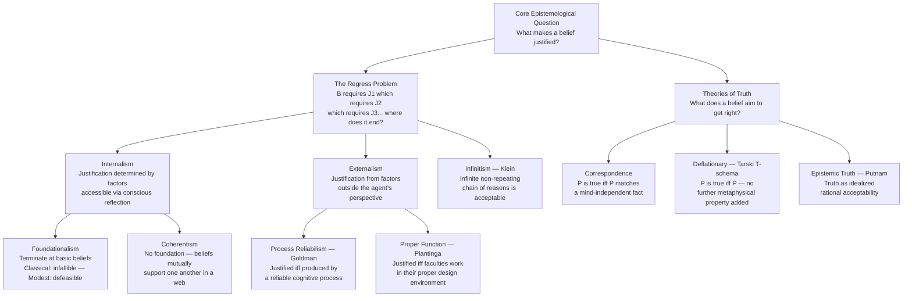

# Justification, Belief, and Truth

> [!abstract] TL;DR
> Justification, belief, and truth are the foundational triad of epistemology: a belief is a doxastic state of taking a proposition to be true; it is justified when adequate grounds support it; it is true when it satisfies whichever theory of truth is correct. The central debates concern what structure of justification avoids an infinite regress of reasons (foundationalism, coherentism, infinitism, reliabilism), whether justification depends on factors the agent can consciously access (internalism vs. externalism), and whether truth is a substantive metaphysical property or a purely logical device.

---

## Intuition

**Analogy:** A navigator using dead reckoning before GPS has only a compass, a clock, and a known starting position. She *believes* the ship is at a certain coordinate — but is that belief *justified*? She can point to her instruments, her calculation method, and the established reliability of dead reckoning as her grounds. Her belief is *true* if the ship actually is there. Now the epistemological question sharpens: what makes the belief justified is separate from whether it is true (the instruments can be working correctly and the ship still be off course due to an unexpected current), and having a justified true belief is still not quite enough — if she arrived at the right coordinate by misreading the compass but was accidentally corrected by a faulty log, something has gone epistemically wrong even though all three conditions are satisfied.

This is the core terrain of epistemology: spelling out what justification requires (good process, good grounds, coherence with other beliefs?), what truth requires (correspondence to fact, coherence, practical success?), and what additional condition — beyond both — earns the title of knowledge.

---

## How It Works

### Core Mechanics

**Doxastic states** are mental stances a subject takes toward a proposition. The classical trichotomy is:
- **Belief** — accepting a proposition as true; disposed to act as if it is true
- **Disbelief** — accepting the negation; disposed to act as if it is false
- **Suspension of judgment** — neither; the evidence is insufficient to tip either way

**Degrees of belief (credences)** extend this to a continuum. Bayesian epistemology represents a rational agent's confidence in proposition P as a real number cr(P) in the interval 0 to 1. Credences must satisfy the probability axioms, and rational updating proceeds by conditionalization when new evidence arrives.

**Doxastic voluntarism vs. involuntarism.** Can you choose to believe something at will? Involuntarism (the dominant view) says no — you cannot simply decide to believe that 2 + 2 = 5. Belief is responsive to evidence and cognitive processes, not direct volition. Voluntarism (William James, pragmatist strands) allows that when evidence is genuinely suspended, choosing to believe can be rational if the belief has self-fulfilling or practically beneficial properties.

**Propositional vs. doxastic justification.** Propositional justification is the availability of adequate grounds — the evidence or reasons make it epistemically appropriate to believe P, regardless of whether the agent actually believes for those reasons. Doxastic justification additionally requires that the agent's actual belief is grounded in and causally sustained by those reasons. A student who believes a theorem correctly but for mystical reasons has propositional but not doxastic justification. Only doxastic justification contributes to knowledge.

**The JTB analysis and its failure.** The traditional analysis defines knowledge as: S knows P if and only if (a) P is true, (b) S believes P, and (c) S is justified in believing P. Edmund Gettier (1963) showed this is insufficient: a justified true belief produced by epistemic luck is not knowledge. Classic case: you believe a disjunction "Jones owns a Ford or Brown is in Barcelona" based on strong evidence that Jones owns a Ford; Jones turns out not to own one, but Brown happens to be in Barcelona. The belief is justified and true but is not knowledge — the truth arrived via the wrong route. Post-Gettier epistemology adds conditions: sensitivity, safety, proper causation, no false lemmas, or treats knowledge as an unanalyzable primitive.

**The regress problem** is the engine of justification theory. If B is justified by B1, and B1 by B2, and B2 by B3... the chain appears to be either infinite, circular, or must terminate. Four responses:

| Response | Core claim |
|---|---|
| Foundationalism | Terminate at basic beliefs that are self-justifying or epistemically privileged |
| Coherentism | No terminus needed — beliefs justify each other through mutual coherence |
| Infinitism | The infinite non-repeating chain is fine — justification requires only that infinite reasons be available |
| Reliabilism | Terminate the chain by grounding in a reliable belief-forming process, not in further beliefs |

**Internalism vs. externalism.** Internalists hold that whether a belief is justified depends only on factors within the agent's reflective access — evidence, reasons, conscious states. Externalists allow that justification can depend on factors outside reflective access, such as the reliability of the cognitive process that produced the belief.

### Flow / Architecture



---

## Key Concepts

### Secondary

**Doxastic states and the belief-disbelief spectrum.** The classical trichotomy is the minimum taxonomy for epistemic attitudes toward a proposition. You believe it is raining if you are disposed to act accordingly: you grab an umbrella, you answer "yes" when asked. Disbelief is not merely absence of belief but a positive doxastic commitment to the negation. Suspension reserves judgment when evidence is too weak to tip either way. Real epistemic life adds gradations — mild suspicion, tentative acceptance, firm conviction — pointing toward the credence framework.

**Degrees of belief.** Contemporary formal epistemology treats beliefs as graded. A credence of 0.7 in "it will rain tomorrow" encodes 70% confidence. Rational credences obey the Kolmogorov axioms: cr(P) and cr(not-P) sum to 1; cr(P and Q) is at most cr(P). Bayesian epistemology adds dynamics: on learning evidence E, update by conditionalizing — the new credence in H equals the old conditional credence of H given E. This provides a precise normative model of rational belief revision.

**Propositional vs. doxastic justification.** The distinction concerns whether justification is a property of the belief-proposition pair or of the actual believing-act. Propositional justification is impersonal: the evidence objectively supports believing P. Doxastic justification is personal: the agent's actual belief is held because of those supporting reasons. The gap matters enormously — a clairvoyant who reliably gets correct beliefs through no recognized epistemic process has propositional justification (the proposition is epistemically appropriate to believe) only debatably, and lacks doxastic justification entirely if she cannot cite the reasons.

**Internalism vs. externalism (overview).** Internalists hold that the epistemic status of a belief is fully determined by the agent's internal perspective — what evidence she has, what reasoning she has done, what mental states she occupies. Externalists allow that justification can hinge on facts she cannot access from the armchair: whether the process that produced the belief reliably generates truths, or whether her cognitive faculties are functioning normally in their proper environment.

---

### Undergraduate

**Foundationalism and the regress argument.** Foundationalists solve the regress by terminating it. *Basic beliefs* are justified without deriving their justification from other beliefs. In *classical foundationalism* (Descartes), basic beliefs must be infallible — they cannot be false if sincerely held. The Cartesian cogito ("I am thinking") is the paradigm: doubting it requires performing it. In *modest foundationalism* (Pollock, Sosa, Pryor), basic beliefs are defeasible but epistemically privileged — perceptual beliefs such as "there appears to be a red apple before me" are prima facie justified without inference, though defeating evidence can overturn them. Derived beliefs inherit justification from basic beliefs through coherence or inference. The main objection to classical foundationalism is that very few beliefs survive the infallibility criterion; modest foundationalism raises the question of what makes a belief "basic" without circularity.

**Coherentism.** Laurence BonJour's coherentism denies that any belief can be justified in isolation. Justification derives from coherence with the entire belief system: logical consistency, explanatory integration, probabilistic support, and absence of anomaly. A belief is more justified the more it fits, predicts, and is supported by the agent's other beliefs. BonJour adds an "observation requirement" — the system must contain beliefs formed through perceptual input — to prevent a coherent but world-detached fantasy from counting as justified. The classical objection is the isolation problem: two mutually incompatible but internally coherent belief systems would both receive justification; coherence cannot discriminate reality-tracking from fiction.

**Process reliabilism (Goldman).** Alvin Goldman's externalist theory: a belief is epistemically justified if and only if it is produced by a cognitive process that reliably generates true beliefs across a wide range of cases. Paradigmatic reliable processes include normal vision, introspection, valid deductive reasoning, and calibrated expert judgment. Paradigmatic unreliable ones include wishful thinking, astrology, and unsystematic guessing. Reliability is assessed at the *type* level — how does this kind of process perform in general — not the token level. This resolves the regress: the justificatory chain terminates not in further beliefs but in a causal story about how the belief was formed.

**Theories of truth — correspondence.** The oldest view: a proposition is true if and only if it corresponds to a fact in the mind-independent world. Aristotle: "To say of what is that it is not, or of what is not that it is, is false; while to say of what is that it is, and of what is not that it is not, is true." Bertrand Russell's logical atomism articulated correspondence in terms of atomic propositions mirroring atomic facts. The main challenges are specifying the nature of facts (they seem suspiciously proposition-shaped) and the correspondence relation (resemblance? isomorphism? causal connection?).

**Theories of truth — deflationary and the T-schema.** Deflationists (Frank Ramsey, Quine, Paul Horwich) hold that "is true" is a logical device, not a substantive metaphysical predicate. Tarski's T-schema gives the whole story: `"Snow is white" is true if and only if snow is white.` Asserting "P is true" is logically equivalent to asserting P. The truth predicate earns its keep by enabling generalizations ("everything the detective said is true") rather than by attributing a substantial property. Horwich's *minimalism* makes this precise: the entire content of truth is captured by the totality of T-schema instances. A challenge for deflationists is explaining why truth is a norm of assertion and inquiry without attributing any real property to it.

**Theories of truth — pragmatist.** William James: truth is "what it is expedient for us to believe" — what works in practice, proves fruitful in action, and survives inquiry. John Dewey: truth is warranted assertibility, what passes the test of sustained inquiry and deliberate verification. The pragmatist insight is that truth-talk is embedded in purposeful practice; it cannot be understood in purely static, correspondence terms. Standard objection: many expedient beliefs are false (comforting falsehoods, useful self-deceptions), and many true beliefs are entirely useless.

**Doxastic voluntarism vs. involuntarism and epistemic deontology.** Epistemic deontology (Chisholm, Feldman, Clifford) models justification on duty: you are epistemically obligated to proportion belief to evidence, investigate actively when evidence is available, and avoid wishful thinking. This picture presupposes voluntary control over belief — you can only be obligated to do what you can choose. Involuntarism challenges this: psychological evidence shows belief formation is largely subpersonal and opaque to direct volitional control. Reconciling deontological epistemology with involuntarism requires distinguishing direct doxastic control (believing at will, which is not available) from indirect control over inquiry, attention, and the conditions that shape belief.

---

### Graduate

**Infinitism (Klein).** Peter Klein argues that the regress problem is not a problem to be solved by termination but one to be accepted. An infinite non-repeating chain of reasons is precisely what justification requires: a belief is justified for an agent if the agent has *available* an infinite series of non-repeating reasons supporting it. Klein distinguishes *having available* from *explicitly rehearsing*: a competent mathematician has infinitely many arithmetical reasons available without ever having enumerated them. Infinitism avoids foundationalism's apparent arbitrariness (why should certain beliefs be privileged terminators?) and coherentism's circularity risk. Critics press the finite-mind objection: real epistemic agents cannot traverse infinite chains even in principle; Klein's notion of "available" is not precise enough to bear the weight placed on it.

**Proper function theory (Plantinga).** Alvin Plantinga distinguishes *justification* from *warrant* — the property that, when added to true belief, yields knowledge. A belief has warrant when: the cognitive faculty that produced it is functioning properly; it is operating in its design environment; the design plan is aimed at truth; and the plan is successfully truth-aimed in the relevant module. Proper function is teleological — faculties have a design plan installed by evolution, God, or another designer. The theory is thoroughly externalist: warrant can accrue without the agent being aware that her faculties are functioning properly. Main challenges: specifying design environment non-circularly, extending warrant to testimonial knowledge, and the evolutionary challenge (if evolution "designed" faculties for survival rather than truth, the connection between proper function and truth-aptness is severed).

**Epistemic theory of truth (Putnam).** Hilary Putnam's *internal realism* rejects mind-independent correspondence while maintaining truth is not merely what we happen to accept. Truth is *idealized rational acceptability* — what any sufficiently idealized rational agent would accept at the end of inquiry. This preserves the normativity and objectivity of truth without positing a metaphysically inaccessible relation between propositions and world. Putnam distinguishes this from anti-realism: idealized acceptability is not current human acceptability. He later moved away from this position, acknowledging that the notion of "idealized" conditions remains unclear and that the view faces a dilemma: either the idealization is genuinely radical and unknowable, or it collapses back into a version of correspondence.

**Pluralism about truth (Wright and Lynch).** Crispin Wright and Michael Lynch argue that truth is not a single property but a functional role realized differently in different discourse domains. Mathematical truth may be realized by logical entailment, empirical truth by correspondence, moral truth by superassertibility. What unifies these diverse realizers is that they all play the same functional role — the role characterized by the truth platitudes: that truth is the aim of assertion, that truth is objective, that a proposition is true only if things are as it says. Lynch's *functionalist pluralism* holds that truth is a higher-order functional property, realized by different first-order properties across domains — exactly as pain is a functional state realized by different neural states in different organisms. The main challenge is specifying the truth platitudes precisely enough to constrain the realizer candidates while remaining neutral on first-order metaethics and metaphysics.

**The Gettier problem and post-Gettier epistemology.** Gettier's 1963 paper — two pages, no formal apparatus — permanently disrupted the JTB analysis. It showed that a subject can have a justified true belief via epistemic luck that falls short of knowledge. Proposed repairs include:
- **No false lemma condition** (Harman): knowledge requires the absence of any false intermediate belief in the justificatory chain.
- **Sensitivity** (Nozick): S knows P only if, were P false, S would not believe P — a counterfactual tracking condition.
- **Safety**: S knows P only if, in the nearest possible worlds, S does not believe P falsely.
- **Defeasibility** (Lehrer, Paxson): there is no true proposition that, if added to S's evidence, would undermine the justification.
- **Knowledge-first** (Williamson): knowledge is a primitive mental state; justified true belief is analyzed in terms of knowledge, not the other way around.

No fully satisfactory analysis commands consensus. Williamson's knowledge-first approach has gained traction precisely by abandoning the project of analysis.

---

## Python Demo

```python
import numpy as np
import matplotlib.pyplot as plt
import matplotlib.patches as mpatches

rng = np.random.default_rng(42)

# ============================================================
# COHERENTISM
# A belief system of N beliefs represented as a symmetric
# mutual-support matrix S where S[i,j] in [0,1].
# System coherence = mean pairwise support across all pairs.
# Belief revision: remove a belief, recompute coherence,
# measure the coherence drop to quantify each belief's contribution.
# ============================================================
N = 8

raw = rng.uniform(0.2, 1.0, (N, N))
support = (raw + raw.T) / 2
np.fill_diagonal(support, 0.0)


def system_coherence(S):
    """Mean pairwise support in the upper triangle."""
    mask = np.triu(np.ones(S.shape, dtype=bool), k=1)
    return float(S[mask].mean())


baseline_coh = system_coherence(support)

coherence_after_removal = np.zeros(N)
for i in range(N):
    S_rev = support.copy()
    S_rev[i, :] = 0.0
    S_rev[:, i] = 0.0
    coherence_after_removal[i] = system_coherence(S_rev)

belief_importance = baseline_coh - coherence_after_removal

# ============================================================
# FOUNDATIONALISM
# 8 beliefs in a hierarchy:
#   Level 0 (basic): B0, B1, B2 — self-justifying
#   Level 1 (derived): B3, B4, B5 — each requires two basic beliefs
#   Level 2 (derived): B6, B7 — each requires two Level-1 beliefs
#
# Belief revision: remove one belief, propagate unjustification
# downward, count fraction of derived beliefs still justified.
# ============================================================
BASIC = {0, 1, 2}
L1    = {3, 4, 5}
L2    = {6, 7}
ALL   = set(range(N))

DEPENDS_ON = {
    3: [0, 1],
    4: [1, 2],
    5: [0, 2],
    6: [3, 4],
    7: [4, 5],
}
DERIVED = L1 | L2


def foundationalist_stability(removed):
    """
    Remove `removed` from the justified set; propagate unjustification.
    Returns fraction of derived beliefs that survive.
    """
    justified = ALL - {removed}
    changed = True
    while changed:
        changed = False
        for b, deps in DEPENDS_ON.items():
            if b in justified and not all(d in justified for d in deps):
                justified.discard(b)
                changed = True
    surviving = sum(1 for b in DERIVED if b in justified)
    return surviving / len(DERIVED)


stability_fd = [foundationalist_stability(i) for i in range(N)]

# ============================================================
# VISUALIZATION — three subplots
# ============================================================
fig, axes = plt.subplots(1, 3, figsize=(17, 5))

# Subplot 1: Coherentism — mutual-support heatmap
ax1 = axes[0]
im = ax1.imshow(support, cmap="YlOrRd", vmin=0, vmax=1, aspect="auto")
ax1.set_xticks(range(N))
ax1.set_yticks(range(N))
ax1.set_xticklabels([f"B{i}" for i in range(N)])
ax1.set_yticklabels([f"B{i}" for i in range(N)])
ax1.set_title(
    f"Coherentist Belief Network\n"
    f"Pairwise Mutual-Support Matrix\n"
    f"System Coherence = {baseline_coh:.3f}"
)
plt.colorbar(im, ax=ax1, label="Support Score")
ax1.set_xlabel("Belief")
ax1.set_ylabel("Belief")

# Subplot 2: Coherentism — each belief's contribution to system coherence
ax2 = axes[1]
bar_colors_coh = ["#c0392b" if v > 0 else "#7fb3d3" for v in belief_importance]
ax2.bar(
    [f"B{i}" for i in range(N)],
    belief_importance,
    color=bar_colors_coh,
    edgecolor="black",
    linewidth=0.7,
)
ax2.axhline(0, color="black", linewidth=0.9)
ax2.set_xlabel("Belief Removed")
ax2.set_ylabel("Drop in System Coherence")
ax2.set_title(
    "Coherentism: Belief Contribution\n"
    "Coherence Drop on Removal\n"
    "(Higher = more central to web)"
)
ax2.grid(axis="y", alpha=0.3)

# Subplot 3: Foundationalism — stability under belief removal
ax3 = axes[2]
fd_colors = [
    "#27ae60" if i in BASIC else
    "#e67e22" if i in L1 else
    "#2980b9"
    for i in range(N)
]
ax3.bar(
    [f"B{i}" for i in range(N)],
    stability_fd,
    color=fd_colors,
    edgecolor="black",
    linewidth=0.7,
)
ax3.set_xlabel("Belief Removed")
ax3.set_ylabel("Fraction of Derived Beliefs Still Justified")
ax3.set_title(
    "Foundationalism: System Stability\n"
    "After Removing Each Belief\n"
    "(Basic removals cause cascades)"
)
ax3.set_ylim(0, 1.08)
ax3.grid(axis="y", alpha=0.3)
legend_handles = [
    mpatches.Patch(color="#27ae60", label="Basic belief"),
    mpatches.Patch(color="#e67e22", label="Level-1 derived"),
    mpatches.Patch(color="#2980b9", label="Level-2 derived"),
]
ax3.legend(handles=legend_handles, fontsize=8, loc="upper right")

plt.suptitle(
    "Coherentism vs Foundationalism — Belief-System Stability Under Belief Revision",
    fontsize=12,
    y=1.01,
)
plt.tight_layout()
plt.savefig("justification_belief_truth.png", dpi=110, bbox_inches="tight")
plt.show()

# Summary report
print("=== Coherentist System ===")
print(f"Baseline system coherence: {baseline_coh:.3f}")
print(f"Belief most central to coherence: B{int(np.argmax(belief_importance))}")
print()
print("=== Foundationalist System ===")
for i in range(N):
    level = "basic" if i in BASIC else "L1" if i in L1 else "L2"
    print(f"  Remove B{i} [{level}]: "
          f"{stability_fd[i]:.0%} of derived beliefs survive")
```

**Key insights from the output:**
- Removing any *basic* belief in the foundationalist system causes a cascade — derived beliefs that depended on it lose justification, and so do higher-order beliefs that depended on those. Removing a Level-2 derived belief causes no cascade at all.
- In the coherentist system, every belief contributes to system coherence. There is no sharp distinction between "foundational" and "derived" — removal of any belief degrades the web.
- The contrast visualizes the structural difference: foundationalism is hierarchically brittle at the base; coherentism distributes robustness across the web but cannot ground itself in anything outside.

---

## Real-World Applications

**Medical diagnosis.** A clinician's diagnostic reasoning exemplifies foundationalism: basic observational beliefs ("temperature is 39.5°C, respiratory rate is 28") ground higher-level inferences ("systemic infection is likely") that ground still higher ones ("pneumonia is the best diagnosis"). Each higher-level belief inherits justification from below. Process reliabilism maps directly onto clinical training: the goal is to shape a physician's belief-forming processes so they are reliably truth-conducive for the patient population in the intended clinical environment. Legal standards ("reasonable medical certainty") operationalize doxastic norms for expert testimony.

**Scientific peer review.** The peer review system institutionalizes epistemic justification. A finding is "justified for publication" when independent reviewers certify that the methodology — the belief-forming process — reliably produces valid results. Meta-analysis functions coherentistically: a new study is evaluated partly by how well it integrates with existing literature. Thomas Kuhn's paradigms are coherentist structures: anomalies are tolerated until their accumulation makes coherence with the paradigm untenable. The replication crisis in psychology is, at the process-reliabilist level, a failure of the publication process to select for reliable belief-generating studies.

**Legal standards of proof.** Common law distinguishes three standards: beyond reasonable doubt, clear and convincing evidence, and preponderance of evidence. These are graduated justification norms scaled to consequences. Foundationalism appears in evidence law: direct perception testimony and authenticated physical evidence are epistemically "basic" and admissible without further inferential support; hearsay is "derived" and requires corroborating grounds. The exclusionary rule reflects a reliabilist principle: evidence obtained by unreliable or coercive processes is excluded even if it happens to point at a true conclusion.

**AI systems and belief reliability.** Autonomous vehicles, fraud detection pipelines, and medical imaging AI produce outputs — effectively "beliefs" — about the world. Safety certification asks exactly Goldman's question: is this belief-forming process (the trained neural network) reliable across the intended operational domain? Edge-case failures (sensor degradation, out-of-distribution inputs) are precisely the cases where the process loses its type-level reliability. Explainability requirements in regulated AI (EU AI Act) reflect an internalist intuition: a justified output should be one the agent can in principle trace back to grounds — not just one produced by a black-box reliable process.

**Epistemology of testimony and social knowledge.** Much of what we believe, we believe on the basis of testimony — we have not personally verified it. The epistemology of testimony asks: does testimony generate independent justification (the *assurance view*), or does it piggyback on the speaker's justification (the *transmission view*)? Reliabilism handles this straightforwardly: testimony is a reliable channel when speakers are generally truthful and competent. Internalism faces a problem: the hearer often cannot verify the speaker's reliability from the armchair. Social epistemology (Goldman, Fricker) extends justification theory to communal inquiry, institutional epistemic norms, and the political dimensions of who is credited as a knower.

---

## Common Pitfalls

- **Conflating justification with truth.** A perfectly justified belief can be false and a true belief can be completely unjustified. Justification is a normative status earned by adequate grounds or a reliable process; truth is a semantic property of what the belief says about the world. The classic test: can you construct a case where justification obtains but truth does not? Yes — the reliable thermometer placed near an undetected heat source. Can you construct a case where truth obtains but justification does not? Yes — a lucky guess.

- **Assuming internalism as the neutral default.** Students often implicitly treat the view that only consciously accessible evidence counts as justification as the obvious starting point. But the majority of cognition is subpersonal and opaque to introspection. Reliabilism shows that the reliability of your visual system — which you cannot directly inspect — is epistemically relevant. Treating justification as purely internal yields wildly permissive results: a completely detached but internally coherent fiction would count as "justified."

- **Misidentifying coherence with truth-conduciveness.** A highly coherent belief system can be systematically false — historical geocentrism was internally coherent for centuries. Coherentism owes an account of why coherence is truth-conducive, not merely internally consistent. BonJour's observation requirement is the attempt; critics argue it is an ad hoc addition that implicitly borrows foundationalist structure.

- **Applying the T-schema in a self-referential language.** Tarski proved that no consistent formal language can contain its own fully general truth predicate. Applying the T-schema to the Liar sentence ("This sentence is false") produces contradiction. The T-schema is valid only within a strict object-language and metalanguage hierarchy. Natural language appears to permit self-reference, which is why the Liar is genuinely puzzling rather than merely a formal error — it reveals that natural language truth-talk is governed by pragmatic constraints that formal theories must reconstruct.

- **The generality problem for reliabilism.** Process reliabilism requires assessing reliability at the *type* level — but every token belief-forming event belongs to infinitely many types (visual perception, visual perception in daylight, visual perception in daylight at close range, perception by this observer on this day). Different type descriptions yield different reliability ratings. Goldman acknowledges the generality problem; no consensus solution identifies the epistemically relevant type without circularity.

- **Treating the Gettier problem as a technicality.** Students sometimes regard Gettier cases as philosophical parlor tricks. They are not. Gettier showed that the concept of knowledge resists the style of analysis — necessary and sufficient conditions stated in terms of simpler concepts — that dominated analytic epistemology for decades. The failure of every proposed repair to achieve consensus is evidence that knowledge may be primitive, unanalyzable, and epistemologically fundamental in ways the JTB tradition could not accommodate.

---

## Related Concepts

- [[Propositions_and_Truth_Values]] — covers Tarski's T-schema in depth, the semantic theory of truth, multi-valued logic, and propositional attitudes; the deflationary theory of truth examined here extends directly from the T-schema framework introduced there.
- [[Bayesian_Reasoning]] — operationalizes degrees of belief as credences, provides the formal Bayesian update rule for rational belief revision, and connects the internalist project of epistemic justification to probabilistic coherence; Bayesian epistemology is the quantitative wing of the tradition covered here.
- [[Arguments_Validity_and_Soundness]] — soundness requires true premises and valid inference; epistemic justification via deductive argument inherits the justification structure of each premise, connecting the theory of argument to foundationalism and the regress problem.
- [[Inductive_Logic]] — inductive justification is the paradigm case of ampliative epistemic support; Hempel's paradox of confirmation and Goodman's new riddle of induction are challenges specifically targeting the justificatory structure of non-deductive inference.
- [[Abductive_Reasoning_and_Inference_to_Best_Explanation]] — inference to the best explanation is a major non-deductive justificatory method; its epistemic standing (whether IBE is reliable, and whether it contributes to coherentist or foundationalist accounts) is directly contested in the theory of justification.
- [[Modal_Logic]] — possible worlds semantics underlies the safety and sensitivity conditions added to knowledge post-Gettier; Nozick's tracking account is stated entirely in terms of closest possible worlds where the belief-truth connection is maintained.
- [[Cognitive_Biases]] — documents systematic failures of human belief formation that violate epistemic norms; each bias can be characterized reliabilistically as a failure of process reliability, or deontologically as a violation of epistemic duty to proportion belief to evidence.
- [[Problem_Solving_and_Decision_Making]] — decision-making under uncertainty is the applied domain of credence theory; how agents actually form and revise beliefs under cognitive load connects empirical cognitive psychology to normative epistemology and calibration research.
- [[Sociology_of_Knowledge_and_Science]] — extends epistemology to communal and institutional inquiry; asks who counts as a legitimate epistemic authority, how social power shapes what beliefs get justified in practice, and whether the norms of individual justification scale to social knowledge.

---

## Review Questions

### Secondary

1. You form the belief "It will rain today" because a friend told you, and it does rain. In what sense is your belief justified, and in what sense might it not be knowledge? What additional information would you need to answer each question?
2. A stopped clock shows 3:17 PM. You glance at it at exactly 3:17 PM and form the belief "It is 3:17 PM." Your belief is justified (you have no reason to doubt the clock) and true. Is it knowledge? What principle does this case illustrate?
3. Explain the difference between propositional justification and doxastic justification in your own words. Give an example of a belief that has one but not the other.

### Undergraduate

1. Compare foundationalism and coherentism as responses to the regress problem. For each theory, identify one compelling advantage and one serious objection that has not yet been definitively answered. Could a hybrid theory capture the advantages of both?
2. Goldman's process reliabilism says a belief is justified if produced by a reliable cognitive process. Does this mean that a belief produced by a type of process that is generally reliable is always justified, even when the specific token instance of that process is malfunctioning? What does your answer reveal about the generality problem?
3. The deflationary theory holds that "is true" adds nothing beyond what is asserted by the proposition itself. If so, what work does the truth predicate do that we could not do without it? Give a concrete case where it is genuinely indispensable and evaluate whether that case forces the deflationist to admit a substantive property.

### Graduate

1. Gettier cases show that justified true belief is insufficient for knowledge. Evaluate the "no false lemmas" repair: knowledge requires that the justification chain contain no false intermediate beliefs. Construct a Gettier-style case that satisfies this condition — i.e., find a case of justified true belief with no false lemma that still intuitively falls short of knowledge.
2. Plantinga's proper function account ties warrant to teleological design. Evaluate whether the theory successfully extends to beliefs produced by natural selection. Does evolution aim at truth? If not, does this undermine the warrant of our perceptual and inferential faculties under Plantinga's framework, or can he respond?
3. Putnam's internal realism identifies truth with idealized rational acceptability. Compare it with correspondence theory and deflationism on two dimensions: whether it satisfies the platitude that truth is objective and independent of what we actually believe, and whether it avoids the metaphysical obscurity of the correspondence relation. Does Putnam's later abandonment of internal realism represent a concession that these two desiderata cannot be simultaneously met?

---

## Sources

- [Gettier, E. L. "Is Justified True Belief Knowledge?" *Analysis*, 23(6), 121–123, 1963.](https://doi.org/10.2307/3326922)
- [Goldman, A. I. "What Is Justified Belief?" in Pappas, G. (ed.) *Justification and Knowledge*. Reidel, 1979.](https://link.springer.com/chapter/10.1007/978-94-009-9493-5_1)
- [BonJour, L. *The Structure of Empirical Knowledge*. Harvard University Press, 1985.](https://www.hup.harvard.edu/catalog.php?isbn=9780674843813)
- [Klein, P. "Human Knowledge and the Infinite Regress of Reasons." *Philosophical Perspectives*, 13, 297–325, 1999.](https://doi.org/10.1111/0029-4775.00115)
- [Lynch, M. P. *Truth as One and Many*. Oxford University Press, 2009.](https://doi.org/10.1093/acprof:oso/9780199218738.001.0001)

---

#epistemology #justification #belief #truth #foundationalism #coherentism
