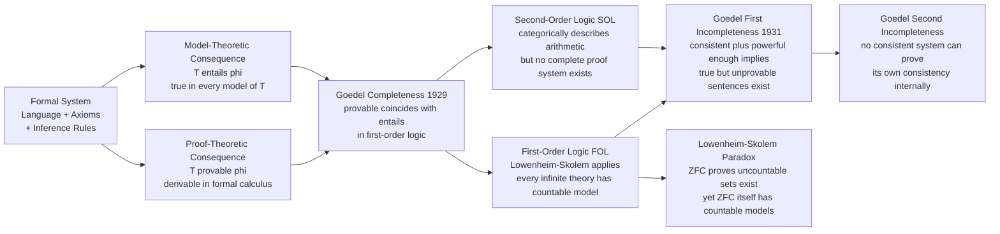

# Philosophy of Logic

> [!abstract] TL;DR
> Philosophy of logic investigates the nature, status, and foundations of logical laws themselves — asking whether logic is discovered or invented, which logic is correct, and what logical consequence really means. It encompasses the debate between psychologism and Frege's anti-psychologism, logical monism versus pluralism (Beall and Restall), and the philosophical interpretation of Gödel's incompleteness theorems, which establish that any sufficiently powerful consistent formal system contains truths it cannot prove. The answers have direct consequences for foundations of mathematics, the limits of formal verification, and the epistemology of abstract reasoning.

---

## Intuition

**Analogy:** Imagine a referee at a chess tournament who is also required to adjudicate disputes about the rulebook itself. She can cite Rule 3 to settle a board dispute — but what happens when a player challenges Rule 3? She needs a meta-rulebook. And what if someone challenges the meta-rulebook? Eventually she must appeal to something that cannot be justified by a higher rule — either brute authority, agreed convention, or discovery of something pre-existing. Philosophy of logic is what happens when mathematicians and philosophers ask exactly this question about the laws of reasoning themselves: are they empirical generalizations, arbitrary conventions, Platonic truths, or something else? And what happens when those laws try to describe themselves?

This is not idle speculation. The answer determines whether logic has one correct version or many, whether computers can in principle replicate human mathematical insight, and why no sufficiently powerful formal system can fully certify its own consistency.

---

## How It Works

### What Is Logic the Study Of?

Four distinct conceptions have dominated the debate:

**1. Laws of thought** (Kant, Boole, early Mill): logic describes the necessary form of all rational cognition. Logical laws are constitutive of what it means to think at all. A being that violated modus ponens would not be reasoning wrongly — it would not be reasoning.

**2. Norms of inference** (Frege, Russell): logic prescribes what ought to follow, independently of any mind's actual processes. Frege's decisive 1884 move was to separate logic from psychology: the number 2 does not depend on anyone's mental representation of it, and neither does the law of non-contradiction.

**3. Formal language** (Hilbert's formalism): logic studies the structure of symbolic systems under precise formation rules, entirely without regard to what those symbols mean. Logic is the grammar of thought, not its content.

**4. Mathematical structure** (model theory, Tarski): logical consequence is a relation between structures and sentences. Γ ⊨ φ iff every structure satisfying all sentences in Γ also satisfies φ. On this view, logic is a branch of mathematics about what is true in all models.

### Psychologism vs Frege's Anti-Psychologism

John Stuart Mill argued that logical laws are empirical generalizations about how human minds reason — and so, like all empirical claims, they are in principle fallible. Frege's *Grundlagen der Arithmetik* (1884) delivered the decisive rebuttal: a person who adds up a column of numbers incorrectly does not refute the law that 2 + 2 = 4; they demonstrate a failure to conform to it. Logical laws do not describe how minds work; they set the standard against which mental acts are evaluated.

Edmund Husserl held psychologistic views in his *Philosophie der Arithmetik* (1891); Frege's scathing review converted him to anti-psychologism — an unusually public reversal in the history of philosophy.

The anti-psychologist stance has dominated analytic philosophy since Frege. Its key implication: logical laws are objective in a sense that makes them resistant to both empirical revision and democratic vote.

### The Benacerraf Problem for Logic

Paul Benacerraf (1973) posed a dilemma for mathematical Platonism: if numbers are abstract objects, how do we ever come to know facts about them? Any causal epistemology requires contact between knower and known — but abstract objects have no causal powers. The same challenge applies to logical laws. Responses divide into three families:

- **Quine's naturalism**: logical laws are part of our total web of belief and are, in principle, revisable by recalcitrant experience. Logic is continuous with science, not prior to it.
- **Analyticity**: logical truths are true in virtue of the meanings of logical constants. We know them because we know what "and," "not," and "if … then" mean.
- **Inferentialism** (Dummett, Gentzen): the meanings of logical constants are fixed entirely by their introduction and elimination rules in natural deduction. Knowing logic is knowing a normative practice of inference, not grasping Platonic objects.

### Logical Monism vs Logical Pluralism

**Monism** holds that there is exactly one correct logic — most working mathematicians assume it is classical logic. The rivals (intuitionistic, paraconsistent) are either simply wrong or are studying something other than genuine logical consequence.

**Pluralism** (JC Beall and Greg Restall, 2000, 2006) holds that multiple logics can all be correct simultaneously. Their key move: the definition "Γ entails φ iff there is no case where all of Γ is true and φ is false" is legitimate, but "case" can be filled in differently by equally reasonable precisifications:
- Possible worlds (Leibnizian) → classical logic
- Constructions (Brouwerian) → intuitionistic logic
- Situations (partial, inconsistent) → relevant and paraconsistent logics

Beall and Restall argue that none of these is more "logical consequence" than the others; they are all genuine precisifications of a single pre-theoretic notion.

An earlier, more radical pluralism is Rudolf Carnap's **principle of tolerance** (*Logical Syntax of Language*, 1934): no logic is objectively correct; adopt whatever framework is most fruitful. Beall and Restall part from Carnap by requiring that each logic track genuine truth-preservation, not merely be conventionally useful.

### Classical Logic and Its Rivals

Classical logic is characterized by bivalence (every proposition is true or false), excluded middle (P ∨ ¬P is a tautology), and explosion (*ex contradictione quodlibet*: from a contradiction, derive anything). Each rival rejects one of these features:

| Logic | Feature Rejected | Core Motivation |
|-------|-----------------|-----------------|
| Intuitionistic (Brouwer, Heyting) | Excluded middle | Truth requires constructive proof; undecided propositions are neither true nor false |
| Paraconsistent (da Costa, Priest) | Explosion | Real systems contain contradictions; explosion makes all reasoning trivial |
| Relevance logic (Anderson, Belnap) | Explosion + irrelevant entailments | A conclusion should be about the same subject matter as the premises |
| Free logic (Lambert) | Existential presupposition | Empty names like "Pegasus" should not license existential quantification |

### Logical Consequence: Proof-Theoretic vs Model-Theoretic

Logical consequence has two fundamental characterizations:

- **Proof-theoretic** (syntactic): Γ ⊢ φ — there exists a formal derivation of φ from Γ in some fixed calculus. Tied to the mechanical, computational side of logic.
- **Model-theoretic** (semantic): Γ ⊨ φ — every interpretation (model) satisfying all sentences in Γ also satisfies φ. Tied to the notion of truth across all possible structures.

**Gödel's Completeness Theorem** (1929): For first-order logic (FOL), ⊢ and ⊨ coincide exactly. Every model-theoretically valid sentence is derivable in a standard proof calculus; every derivable sentence is model-theoretically valid. This is a deep and non-obvious result — it was not clear that syntactic derivation could fully capture semantic truth.

**Gödel's First Incompleteness Theorem** (1931): Any consistent, recursively axiomatizable theory powerful enough to express basic arithmetic contains a sentence G such that neither G nor ¬G is derivable — yet G is true in the standard model of arithmetic. Completeness fails for arithmetic.

The proof encodes every formula as a natural number (its **Gödel number**) and then, via the **diagonal lemma**, constructs G to assert "the formula with Gödel number g(G) is not provable in this system." If the system proves G, it derives a falsehood — inconsistency. If it does not prove G, then G is true but unprovable — incompleteness. The system cannot win.

**Gödel's Second Incompleteness Theorem**: No such system can prove the statement of its own consistency (Con(T)) within itself. This refuted Hilbert's programme of formalizing all mathematics and proving its consistency from within.

**Penrose's misreading** (*The Emperor's New Mind*, 1989): Roger Penrose claimed that because a human mathematician can *see* that the Gödel sentence G is true even though the formal system cannot prove it, human mathematical intuition must exceed what any algorithm can compute. The objection: a mathematician can see G is true only relative to the external assumption that the system is consistent — an assumption the system itself cannot certify. Penrose's argument does not establish that the mathematician is running something non-computational; it only establishes that she is using an assumption the formal system cannot internally access.

### Second-Order Logic and Ontological Commitments

First-order logic quantifies over individual objects only. Second-order logic (SOL) additionally quantifies over properties, relations, and functions of those objects.

- SOL can **categorically characterize** arithmetic: up to isomorphism, there is exactly one structure satisfying the second-order Peano axioms. FOL cannot achieve this — the Löwenheim-Skolem theorem guarantees non-isomorphic models at every infinite cardinality.
- SOL has **no complete proof system**: semantic SOL-validity is not recursively enumerable. Some second-order arithmetic sentences are true in the standard model but derivable in no formal system.
- **Quine's objection**: second-order logic is "set theory in sheep's clothing" because quantifying over all subsets of a domain presupposes the full power set. SOL thus carries heavy ontological commitments that FOL avoids.

### The Löwenheim-Skolem Theorem and Skolem's Paradox

**Löwenheim-Skolem** (downward): any first-order theory with an infinite model has a countable model. (Upward): it also has models of every larger infinite cardinality.

**Skolem's paradox**: ZFC set theory is a first-order theory. ZFC proves the existence of uncountable sets via Cantor's theorem (|ℙ(ℕ)| > |ℕ|). But by Löwenheim-Skolem, ZFC has a countable model. How can a countable model contain an "uncountable" set?

**Resolution**: uncountability is model-relative. Inside the countable model there is no bijection from ℕ to the "uncountable" set — but that bijection does exist *outside* the model. The model simply lacks the function, not the cardinality fact. This shows that first-order logic cannot pin down cardinality absolutely — a fundamental limitation.

### Formal Landscape



---

## Key Concepts

### Secondary

- **Logical law** — A universally valid sentence or inference form: one that holds regardless of what specific propositions are substituted for its atomic variables. "If P then Q; P; therefore Q" is a logical law because every substitution instance preserves truth.
- **Formal system** — A triple consisting of an alphabet, a grammar defining well-formed formulae, and inference rules specifying which formulae can be derived from which. The rules are syntactic: they manipulate symbols without regard to meaning.
- **Syntax vs semantics** — Syntax concerns the structure of symbolic expressions without regard to meaning. Semantics assigns interpretations (truth values, models, structures) to those expressions. Formal logic carefully separates them; philosophy of logic asks how they relate.
- **Tautology** — A sentence true under every possible truth-value assignment to its atomic components. Classical tautologies include P ∨ ¬P and ¬(P ∧ ¬P). In intuitionistic logic, P ∨ ¬P is NOT a tautology.
- **Bivalence** — The principle that every proposition is either true or false, with no third value. Classical logic assumes bivalence; intuitionism and many-valued logics reject it for different reasons.
- **Psychologism** — The view that logical laws are empirical generalizations about how human minds reason. Decisively rejected by Frege: logical laws are normative standards, not psychological descriptions.

### Undergraduate

- **Anti-psychologism** — Frege's position that logical laws are objective, mind-independent norms. A person who reasons incorrectly does not refute a logical law; they fail to conform to it.
- **Classical vs intuitionistic logic** — Classical logic accepts P ∨ ¬P as a tautology; intuitionistic logic requires a constructive proof of either P or ¬P before the disjunction can be asserted. Every intuitionistically valid sentence is classically valid, but not vice versa: the double-negation elimination (¬¬P → P) fails intuitionistically.
- **Paraconsistent logic** — Rejects explosion: from a contradiction, not everything follows. Allows formal reasoning to proceed locally around inconsistencies. Motivated by dialethism (the view that some contradictions are true) or by practical needs in inconsistent databases.
- **Relevance logic** — Requires that premises be relevantly connected to the conclusion. Rejects the classical theorem "P → (Q → P)" on the grounds that Q is irrelevant to the conditional. Anderson and Belnap's system R is the canonical formulation.
- **Proof-theoretic vs model-theoretic consequence** — Two definitions of Γ entails φ: via derivation in a calculus (syntactic) or via truth-preservation in all models (semantic). Gödel's Completeness Theorem shows these coincide for first-order logic.
- **Logical monism vs pluralism** — Monism: there is one correct logic. Beall and Restall's pluralism: multiple logics (classical, intuitionistic, relevant) can all correctly capture logical consequence by specifying "cases" differently. Pluralism is not relativism — each logic must still track genuine truth-preservation.

### Graduate

- **Gödel's First Incompleteness Theorem** (precise statement): If T is a consistent, recursively axiomatizable extension of Robinson arithmetic Q, then there exists a sentence G_T such that neither T ⊢ G_T nor T ⊢ ¬G_T, yet G_T is true in the standard model N. The proof uses Gödel numbering to encode syntax arithmetically and the diagonal lemma to construct G_T asserting its own unprovability.
- **Gödel's Second Incompleteness Theorem**: Under the same hypotheses, T ⊬ Con(T), where Con(T) is the canonical arithmetical sentence expressing "T is consistent." Hilbert's programme — formalizing all mathematics and proving its consistency from within — is thus definitively refuted.
- **Penrose-Lucas argument and its failure**: Lucas (1961) and Penrose (1989, 1994) argued that mathematicians can see the Gödel sentence is true, but no machine can, so minds exceed computation. The argument fails because: (i) the human sees G is true only given the assumption Con(T), which T itself cannot prove; (ii) the human may be instantiating a different (possibly inconsistent) formal system; (iii) the argument proves nothing about the substrate of the human's reasoning process.
- **Inferentialism and proof-theoretic semantics**: Gentzen showed that each logical constant can be characterized by its introduction rules (how to prove a sentence with that connective as main operator) and elimination rules (how to use such a sentence). Dummett drew the philosophical moral: the meaning of a logical constant is its inferential role, not a model-theoretic truth condition. This grounds an anti-realist, constructive semantics for logic.
- **Second-order logic and Quine's ontological objection**: SOL quantifies over all subsets/relations of the domain. This implicitly invokes the power set operation — the same operation that generates Cantor's hierarchy of infinities. Quine's charge that SOL is "set theory in sheep's clothing" is thus not merely rhetorical: SOL has the ontological weight of a full set theory, with no complete proof system to compensate.
- **Löwenheim-Skolem and the indeterminacy of first-order reference**: The theorem shows that any consistent first-order theory with an infinite model has models of every infinite cardinality. The upshot: first-order theories cannot pin down their intended interpretation. A first-order axiom system for the reals has countable models in which "uncountability" is a model-internal fiction. This is not a defect of set theory but a fundamental limitation of first-order expressiveness.
- **Carnap's principle of tolerance vs Beall-Restall pluralism**: Carnap's tolerance says there is no fact of the matter about which logic is correct — choose whichever is most fruitful. Beall and Restall's pluralism is more modest: the multiple correct logics are all tracking something real (genuine cases of truth-preservation), but they are tracking it at different levels of generality. The debate between them turns on whether "logical consequence" has a determinate pre-theoretic content or is purely a terminological convenience.

---

## Python Demo

```python
import numpy as np
import matplotlib.pyplot as plt

# =============================================================================
# PART 1: Gödel Sentence — self-reference via string encoding
# =============================================================================
# Gödel's key insight: assign every formula in a formal system a unique natural
# number (its Gödel number). The system can then make statements ABOUT formulas
# by making statements about their numbers. A Gödel sentence G asserts:
#   "The formula with Gödel number g(G) is not provable in this system."
# When G's own Gödel number is substituted, we get genuine self-reference.

def goedel_number(text):
    """
    Toy Gödel numbering via polynomial rolling hash over character codes.
    Real Gödel numbering uses prime exponentiation p1^c1 * p2^c2 * ...;
    this hash avoids overflow while illustrating the key property:
    distinct strings get distinct numbers (with overwhelming probability).
    """
    MOD = 10**9 + 7
    BASE = 31
    result = 0
    for ch in text:
        result = (result * BASE + ord(ch)) % MOD
    return result

# Template sentence with placeholder token X for the Gödel number
template = "The formula with Goedel number X is not provable in this system"
g_template = goedel_number(template)

# One round of diagonalization: substitute the template's own number for X
step1 = template.replace("X", str(g_template))
g_step1 = goedel_number(step1)

# Approximate Gödel sentence: plug g_step1 back in
# (A true fixed point requires g(G) = g_step1, guaranteed by Kleene's
# fixed-point theorem in the real construction — here we illustrate the structure)
goedel_sentence = template.replace("X", str(g_step1))
g_goedel = goedel_number(goedel_sentence)

print("=== Goedel Self-Reference Demonstration ===\n")
print(f"Template          : {template}")
print(f"Goedel# template  : {g_template}")
print(f"After one subst.  : {step1[:66]}...")
print(f"Goedel# after sub : {g_step1}")
print(f"Approx G sentence : {goedel_sentence[:66]}...")
print(f"Goedel# of G      : {g_goedel}")
print()
print("The Paradox Structure:")
print("  Let G = 'The formula with Goedel number g(G) is not provable'")
print()
print("  Case 1 — G IS provable in T:")
print("    T derives 'formula g(G) is not provable'.")
print("    But g(G) IS provable. Contradiction -> T is INCONSISTENT.")
print()
print("  Case 2 — G is NOT provable in T:")
print("    G correctly states its own unprovability -> G is TRUE.")
print("    A true sentence exists that T cannot prove -> T is INCOMPLETE.")
print()
print("Conclusion: any consistent, sufficiently powerful T is incomplete.")
print("This is Goedel's First Incompleteness Theorem (1931).")

# =============================================================================
# PART 2: Expressible vs Provable truths — the incompleteness gap (simulation)
# =============================================================================
# For a formal arithmetic system (e.g., Peano Arithmetic), as formula length L
# grows, the expressible sentences multiply exponentially while the provable
# sentences — a strict subset of the true sentences — grow more slowly.
# The widening gap is the incompleteness phenomenon made visually concrete.
#
# NOTE: for PROPOSITIONAL logic, Gödel completeness holds and there is no gap.
# Incompleteness arises specifically in arithmetic and richer systems.
# The model below is illustrative, not exact.

np.random.seed(42)
lengths = np.arange(1, 22)
ALPHABET_SIZE = 3     # minimal arithmetic alphabet: {0, successor, plus}

# All syntactic strings of length L (most are not well-formed)
expressible = np.array([ALPHABET_SIZE ** int(L) for L in lengths], dtype=np.float64)

# Well-formed formulae: a smaller subset (shorter strings parse more easily)
wff_fraction = 0.55 * np.exp(-0.06 * lengths) + 0.05
wff = expressible * wff_fraction

# True sentences among WFFs: roughly half are true in the standard model
true_sentences = wff * 0.50

# Provable sentences: in arithmetic, Goedel sentences accumulate.
# The provable fraction shrinks as formula length grows.
# Model: provable/true  ~  0.88 * exp(-0.12 * L) + 0.08
provable_fraction = 0.88 * np.exp(-0.12 * lengths) + 0.08
provable = true_sentences * provable_fraction

# Incompleteness gap: true but unprovable sentences
gap = true_sentences - provable
gap_pct = 100.0 * gap / np.maximum(true_sentences, 1.0)

# ── Plot ──────────────────────────────────────────────────────────────────────
fig, axes = plt.subplots(1, 2, figsize=(13, 5))
fig.suptitle(
    "Goedel Incompleteness — Intuitive Simulation\n"
    "(Illustrative model for arithmetic — trends matter, not exact counts)",
    fontsize=12
)

ax1 = axes[0]
ax1.semilogy(lengths, expressible,              "b-o",  markersize=4, linewidth=1.5,
             label="All formulae of length L")
ax1.semilogy(lengths, wff,                      "g--s", markersize=4, linewidth=1.5,
             label="Well-formed formulae")
ax1.semilogy(lengths, true_sentences,           color="orange", marker="^",
             markersize=4, linewidth=1.5, linestyle="-.",
             label="True sentences")
ax1.semilogy(lengths, np.maximum(provable, 0.1),"r-v",  markersize=4, linewidth=1.5,
             label="Provable sentences")
ax1.fill_between(lengths, np.maximum(provable, 0.1), true_sentences,
                 alpha=0.20, color="red", label="Incompleteness gap")
ax1.set_xlabel("Formula length L")
ax1.set_ylabel("Count (log scale)")
ax1.set_title("Expressible vs Provable Sentences\n(log scale)")
ax1.legend(fontsize=8)
ax1.grid(True, alpha=0.3)

ax2 = axes[1]
ax2.plot(lengths, gap_pct, "r-o", markersize=6, linewidth=2.5)
ax2.fill_between(lengths, 0, gap_pct, alpha=0.25, color="red")
ax2.axhline(
    y=gap_pct[-1], color="darkred", linestyle="--", alpha=0.65,
    label="Asymptote: approx {:.1f} pct unprovable".format(gap_pct[-1])
)
ax2.set_xlabel("Formula length L")
ax2.set_ylabel("True-but-unprovable as fraction of all truths x100")
ax2.set_title("Growing Incompleteness Gap\nPct of truths that escape the proof system")
ax2.set_ylim(0, 100)
ax2.legend(fontsize=9)
ax2.grid(True, alpha=0.3)

plt.tight_layout()
plt.savefig("goedel_incompleteness_simulation.png", dpi=150, bbox_inches="tight")
plt.show()

print("\nKey insight: as formula complexity grows in an arithmetic system,")
print("the fraction of true sentences the system can prove SHRINKS.")
print("Goedel's theorem makes this an exact impossibility, not a practical limit.")
```

---

## Real-World Applications

**1. Intuitionistic type theory and programming languages.** Martin-Löf type theory — the foundation of Coq, Agda, and Lean's kernel — is built on intuitionistic logic. The Curry-Howard correspondence makes every type a proposition and every program a proof. Rejecting excluded middle forces all existence proofs to be constructive: the proof of "there exists an x with property P" must *produce* an x, not just rule out its absence. Haskell's Propositions-as-Types infrastructure reflects the same foundational choice.

**2. Paraconsistent query semantics in databases.** When a distributed database accumulates inconsistent records (conflicting patient blood types from different hospital integrations), classical SQL logic triggers explosion: from a contradiction, any query returns trivially true. Besnard and Hunter's inconsistency-tolerant query framework (1995) and subsequent work by Arenas, Bertossi, and Chomicki formalize paraconsistent answers that remain reliable under local inconsistencies — a direct engineering application of rejecting explosion.

**3. Automated theorem provers and the completeness guarantee.** Resolution-based provers (Vampire, E, SPASS) are sound and refutation-complete for first-order logic: if a sentence is FOL-valid, the prover will eventually find a proof. This practical guarantee is exactly Gödel's Completeness Theorem applied. For second-order problems, no such completeness exists — the prover may diverge with no bound on when to give up, because SOL validity is not recursively enumerable.

**4. Formal verification and the limits of self-certification.** Lean 4, Isabelle/HOL, and Coq verify software against formal specifications. The Second Incompleteness Theorem sets an ultimate ceiling: no verification system can prove the consistency of its own underlying logic from within. This is not a defect of any particular tool; it is an exact mathematical impossibility. Security-critical proofs (seL4 microkernel, CompCert compiler) sidestep this by trusting the foundational logic externally while verifying everything above it.

**5. Description logics and knowledge representation in AI.** OWL (Web Ontology Language) and description logics (DLs) are decidable fragments of first-order logic chosen specifically so that reasoning is algorithmically tractable. The Löwenheim-Skolem theorem informs DL design: full FOL is undecidable, but fragments with bounded quantifier depth or restricted role structures admit decision procedures. Systems like Protégé and RDF reasoning engines operate entirely within these carefully carved subsets of FOL consequence.

---

## Common Pitfalls

- **Conflating Gödel Completeness with Gödel Incompleteness** — These are different theorems with names that sound opposite. Completeness (1929): FOL proof theory captures all FOL-semantic truth — every valid sentence is derivable. Incompleteness (1931): arithmetic proof theory cannot capture all arithmetic truth — some true sentences are underivable. Students routinely mix them up; the names describe the result from opposite perspectives.

- **The Penrose-Lucas error** — Inferring from incompleteness that human mathematical intuition exceeds Turing computation. The mathematician sees that G is true only given the *external* assumption that the system is consistent — an assumption no consistent system can provide from within. The argument establishes no more than that human reasoning involves assumptions that transcend any particular fixed formal system, which is uncontroversial and does not imply non-computability.

- **Mistaking logical pluralism for relativism** — Beall and Restall are not saying "any inference is as good as any other" or that truth is subjective. They say multiple *precise* notions of consequence can each correctly track the pre-theoretic concept by filling in "cases" differently. Each logic must still genuinely preserve truth; the pluralism is about which space of cases is relevant.

- **Assuming paraconsistency endorses contradictions** — Paraconsistent logics contain contradictions without explosion, but this does not mean they treat contradictions as *true* or desirable. They allow reasoning to proceed *around* locally inconsistent patches without inferential contamination spreading everywhere. Graham Priest's dialethism (some contradictions are true) is a separate, more radical thesis.

- **Equivocating on "true but unprovable"** — When logicians say Gödel sentences are "true," they mean true in the *standard model* of arithmetic (the actual natural numbers). There exist non-standard models in which Gödel sentences are false. "True" in the incompleteness context always carries this qualification; dropping it generates apparent paradoxes that dissolve on closer reading.

- **Assuming Löwenheim-Skolem shows set theory is inconsistent or confused** — Skolem's paradox (ZFC proves uncountability yet has countable models) does not indicate any defect in ZFC. Uncountability is a model-internal relation: inside the countable model, no bijection exists between ℕ and the "uncountable" set. The bijection exists only externally. This is a fundamental limitation of first-order expressiveness, not a contradiction in the theory.

---

## Related Concepts

- [[Logic_and_Critical_Thinking_Overview]] — the parent overview for the entire vault section; covers the deductive-inductive-abductive taxonomy that philosophy of logic takes as its starting material.
- [[Arguments_Validity_and_Soundness]] — the proof-theoretic vs model-theoretic distinction is introduced there; Gödel's Completeness Theorem appears explicitly at the Graduate tier as the result unifying the two.
- [[Paradoxes_and_Logical_Puzzles]] — Russell's paradox and the Liar Paradox are the self-referential precursors to Gödel's diagonal construction; the Liar sentence "This sentence is false" is the informal template for the Gödel sentence "This sentence is not provable."
- [[Propositions_and_Truth_Values]] — bivalence and multi-valued logics are covered there; the connection is the rivalry between classical logic (bivalence assumed) and intuitionistic/many-valued alternatives discussed here.
- [[Mathematical_Proof_Strategies]] — Cantor's diagonalization argument appears there as a proof strategy; the same technique underlies Gödel's incompleteness proof, Turing's halting problem proof, and the Löwenheim-Skolem construction.
- [[Modal_Logic]] — possible-worlds semantics informs Beall and Restall's pluralism directly; "possible worlds" are one of the three choices of "cases" that yield classical logic in their framework.
- [[Mathematical_Logic_and_Set_Theory]] — the Mathematics vault's deep-dive into ZFC axioms, Gödel's theorems, ordinals, and the Continuum Hypothesis; this note is the philosophical companion to that technical treatment.
- [[Logic_and_Proof_Techniques]] — covers formal proof calculi (natural deduction, sequent calculus) that constitute the proof-theoretic side of logical consequence.
- [[Set_Theory_and_Relations]] — Cantor's diagonalization and the uncountability of the reals are covered there; the Löwenheim-Skolem paradox becomes vivid against that background.

---

## Review Questions

### Secondary

1. Frege argued that logical laws are not psychological laws. Explain the difference between a *descriptive* claim about how minds reason and a *normative* claim about how reasoning ought to proceed. Can you give one example of each that does not involve formal logic?

2. Classical logic asserts that P ∨ ¬P is always true. Intuitionistic logic denies this for undecided propositions. If you are working on a program that tries to decide whether a given integer sequence contains a prime, at what point — if any — are you entitled to assert "either the sequence contains a prime or it does not"? Does your answer change once the program terminates?

3. Explain in plain language why a single counterexample suffices to show an argument is *invalid*, while no finite number of confirming cases suffices to show it is *valid*.

### Undergraduate

1. Beall and Restall claim that both classical logic and intuitionistic logic are "correct" because they fill in the notion of "cases" differently. State their definition of logical consequence using the word "case." Then give an example of a sentence that is classically valid but intuitionistically invalid, and explain which notion of "case" makes the difference.

2. The Gödel sentence G for system T asserts "the formula with Gödel number g(G) is not provable in T." Walk through the two-case argument for incompleteness. At which step is the assumption of *consistency* essential? What would follow if T were inconsistent?

3. A database contains the records "Patient A has blood type O" and "Patient A has blood type AB." Under classical SQL semantics, what does explosion imply about any query on this database? How does a paraconsistent semantics contain the damage, and what additional mechanism is needed to give useful query answers?

### Graduate

1. Gödel's Completeness Theorem (1929) and First Incompleteness Theorem (1931) appear to say opposite things about logic. State each theorem precisely, identify the *different systems* each applies to, and explain why they are not in tension. What precisely does completeness mean for FOL that it cannot mean for arithmetic?

2. Penrose argues: "Mathematicians can perceive the truth of the Gödel sentence G for any formal system T; no formal system can prove G; therefore mathematical intuition exceeds computation." Identify the precise logical error in this argument. Is it a non-sequitur, an equivocation, or a false premise — and in which sentence?

3. The Löwenheim-Skolem theorem implies that ZFC, which proves the existence of uncountable sets, has a countable model. Explain Skolem's paradox and its resolution in terms of the relativity of "countable." What does this reveal about the expressive power of first-order logic, and why does it motivate the use of second-order logic for categorical characterizations of arithmetic — despite Quine's objection that SOL is "set theory in sheep's clothing"?

---

## Sources

- [Shapiro, Stewart. "Classical Logic." *Stanford Encyclopedia of Philosophy*, Zalta (ed.), 2021.](https://plato.stanford.edu/entries/logic-classical/)
- [Beall, JC and Restall, Greg. "Logical Pluralism." *Stanford Encyclopedia of Philosophy*, Zalta (ed.), 2023.](https://plato.stanford.edu/entries/logical-pluralism/)
- [Raatikainen, Panu. "Gödel's Incompleteness Theorems." *Stanford Encyclopedia of Philosophy*, Zalta (ed.), 2022.](https://plato.stanford.edu/entries/goedel-incompleteness/)
- [Haack, Susan. *Philosophy of Logics*. Cambridge University Press, 1978.](https://www.cambridge.org/core/books/philosophy-of-logics/B4FCC3F4DABA9A7B69B2174B4FA13CAE)
- [Dummett, Michael. "The Philosophical Basis of Intuitionistic Logic." In *Truth and Other Enigmas*. Harvard University Press, 1978. pp. 215–247.](https://www.hup.harvard.edu/books/9780674910768)

---

#logic #philosophy-of-logic #godel #logical-pluralism #metalogic
