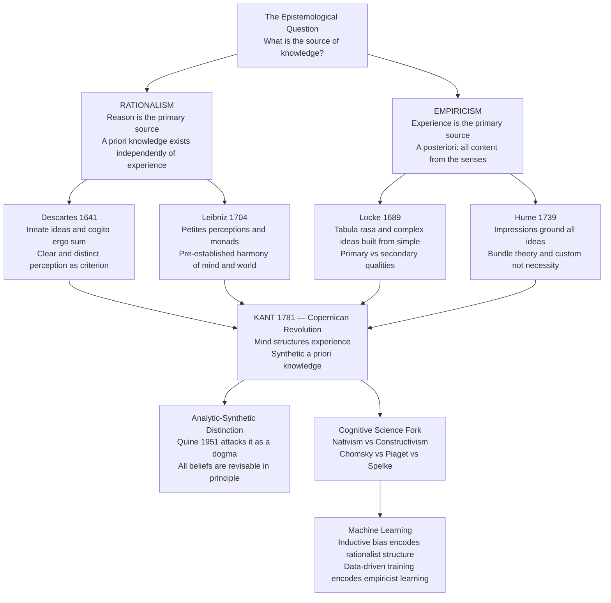

# Rationalism and Empiricism

> [!abstract] TL;DR
> Rationalism holds that reason is the primary source of knowledge, producing a priori truths independent of sensory experience (Descartes, Leibniz, Spinoza); empiricism holds that all substantive knowledge ultimately derives from sensory experience (Locke, Berkeley, Hume). Kant's critical philosophy attempts a synthesis: the mind imposes categorical structure on raw experience, yielding synthetic a priori knowledge — truths that are both genuinely informative and knowable before any specific experiment. This centuries-old debate lives on in cognitive science as nativism versus constructivism, and in AI as the question of inductive bias versus purely data-driven learning.

---

## Intuition

**Analogy:** Consider two architects assigned to understand a city they have never visited. The rationalist architect carries a blueprint — a set of geometric principles, load-bearing rules, and spatial categories built into his training. He reasons about the city from first principles before seeing a single building; his knowledge is a priori. The empiricist architect arrives with a blank notebook. She walks every street, measures every building, and builds her understanding from accumulated observation; her knowledge is a posteriori. Kant's synthesis notices something both miss: the very act of reading a city — perceiving buildings as persistent objects in space, inferring that one structure caused another to collapse — requires a framework of spatial and causal categories that the mind itself supplies. Pure reason without experience is empty; pure experience without conceptual structure is blind.

This analogy tracks the philosophical debate precisely. Descartes argued that certain ideas (God, infinity, geometric truths) cannot come from the senses because the senses are finite and fallible — these ideas must be innate. Hume countered that even causation is not directly perceived; it is a habit of mind formed by repeated experience. Kant saw that both were right about different things: experience provides the content of knowledge; reason provides the form.

---

## How It Works

### Core Mechanics

The debate turns on three interlocking distinctions.

**1. A priori vs a posteriori**
- *A priori*: knowledge justified independently of sensory experience. "All bachelors are unmarried" requires no empirical investigation. Logic and mathematics are the canonical examples.
- *A posteriori*: knowledge that depends on sensory experience for its justification. "Water boils at 100°C at sea level" requires observation.

**2. Analytic vs synthetic**
- *Analytic*: the predicate concept is contained in the subject concept. "All triangles have three angles" is true by definition; it adds no new information.
- *Synthetic*: the predicate adds information not contained in the subject concept. "The table is brown" — brownness is not part of the concept of table.

**3. The contested category: synthetic a priori**
The rationalist/empiricist dispute largely assumed that all a priori knowledge was analytic, and all synthetic knowledge was a posteriori. Kant's Copernican revolution: there is a third category that both traditions had missed. *Synthetic a priori* knowledge is genuinely informative (synthetic) yet knowable before any specific experience (a priori). His examples — "7 + 5 = 12", the geometrical propositions of Euclid, and the causal principle "every event has a cause" — expand our knowledge yet require no experiment. The explanation: the mind's own categories (space, time, causality, substance) structure experience before experience begins. These are the conditions for the possibility of any experience whatsoever, and so can be known in advance of any particular observation.

**The historical sequence** runs from Continental Rationalism (early–mid 17th century) to British Empiricism (late 17th–18th century) to Kant's synthesis (1781), then forward into Quine's holism (1951) and the cognitive science and AI debates of the 20th and 21st centuries.

### Flow / Architecture



---

## Key Concepts

### Secondary

- **A priori knowledge** — Knowledge justified independently of sensory experience. Logic, mathematics, and conceptual truths are the standard examples. Rationalists extend a priori knowledge to metaphysics and theology. To know that modus ponens is valid, no experiment is required.

- **A posteriori knowledge** — Knowledge that depends on experience for its justification. Every fact about the physical world — the boiling point of water, the mass of the sun, the population of a city — is known a posteriori. Empiricists typically claim that all substantive knowledge about reality is of this kind.

- **Innate ideas** — Descartes's doctrine that certain ideas are built into the mind at birth, not derived from the senses. The idea of God (infinite perfection), mathematical truths, and the law of non-contradiction cannot originate in finite, fallible perception — they must be innate, stamped on the mind prior to experience. Leibniz softened this: innate ideas are "virtual" tendencies latent in the mind, not fully formed concepts present from birth.

- **Tabula rasa** — Locke's counter-doctrine: the mind at birth is a blank slate with no innate content whatsoever. Every idea, from the simplest (the color red) to the most complex (justice, God, infinity), traces back to sensation or reflection on one's own mental operations. Locke's argument: if innate ideas existed, everyone would immediately recognize them — but no proposition commands universal assent.

- **Primary and secondary qualities** — Locke's distinction between qualities that genuinely belong to objects (primary: solidity, extension, motion, number, figure) and qualities that exist only as subjective experiences in the perceiver (secondary: color, taste, smell, sound). Secondary qualities are powers in objects to produce certain sensations; the sensations themselves are not features of the object.

- **The rationalist-empiricist spectrum** — The debate is not a sharp binary. Leibniz accepted that experience triggers the development of innate ideas. Hume's radical empiricism denied causation any objective standing. Modern positions range from strong nativism (Fodor's modularity, Spelke's core knowledge) through interactionist developmental views (Vygotsky) to strong empiricism in connectionist cognitive science (Elman).

### Undergraduate

- **Descartes's method of doubt** — Systematic doubt as an epistemological method: reject every belief that can possibly be doubted. The senses deceive; even mathematics could be planted by a malicious demon; but "I am doubting" cannot itself be doubted — the thinking subject must exist: *cogito ergo sum*. From the indubitability of the thinking self, Descartes reconstructs God (via the ontological argument applied to the idea of infinite perfection), and from God's non-deceptive nature, the reliability of clear and distinct perception. The entire edifice is founded on pure reason, not observation.

- **Hume's impressions and ideas** — Hume divides all mental contents into impressions (vivid, forceful perceptions: seeing red, feeling pain) and ideas (faint copies: remembering red, imagining pain). Every idea is a copy of a prior impression. The test for meaningfulness: trace any concept to its originating impression. If no such impression can be found, the concept is meaningless. Applied to causation: we never perceive necessary connection — only constant conjunction of events and the resulting habit of expectation. Causation is a feature of the mind's response to experience, not of the world itself.

- **Berkeley's immaterialism** — George Berkeley pushed empiricism to its radical limit: *esse est percipi* — to be is to be perceived. There is no material world behind appearances; only minds and their ideas exist. What we call "the table" is a stable, intersubjectively consistent bundle of co-occurring sensory ideas. Berkeley's argument: Locke's primary qualities (extension, shape, number) are just as mind-dependent as secondary ones. Material substance is either causally inert (pointless) or a self-contradiction.

- **Hume's bundle theory of self** — Introspect carefully and you find not a unified, persisting "self" but only a stream of perceptions in constant flux. There is no impression of a self; therefore the concept of a persisting, unified subject has no empirical content. The self is a bundle of perceptions, not a substance that has them. This anticipates Buddhist no-self doctrine and directly challenges Descartes's *cogito*.

- **Kant's categories of understanding** — Kant's Copernican revolution: instead of asking how the mind conforms to an independent world, ask how any possible world of experience must conform to the mind's own structure. The understanding applies twelve pure categories — including substance, causality, necessity, and reciprocity — to the raw manifold of sensory intuition provided by the forms of space and time. These categories are not derived from experience; they are the conditions for the possibility of any coherent experience. Space and time are not features of things in themselves; they are forms of sensible intuition that the mind imposes on whatever it encounters. The result: the causal principle ("every event has a cause") is synthetic — it genuinely extends our knowledge — but a priori — no specific experiment is needed, because causation is the very structure through which experience is organized.

- **Spinoza's geometric method** — Baruch Spinoza wrote his *Ethics* in the style of Euclid: definitions, axioms, propositions, corollaries, proofs. Rationalism at its most systematic: all truths about God, nature, human freedom, and the emotions are derivable by pure reasoning from first principles. Under Spinoza's monism, God and Nature are identical (*deus sive natura*); mind and body are two attributes of one single infinite substance, not two substances in causal interaction as Descartes held. This solves Cartesian mind-body dualism by eliminating the question of how two fundamentally different substances could interact.

### Graduate

- **Quine's "Two Dogmas of Empiricism" (1951)** — Quine's landmark paper attacks both the empiricist and the Kantian orthodoxy simultaneously. The first dogma: the distinction between analytic truths (true purely by meaning) and synthetic truths (true partly by fact). Quine argues there is no adequate account of analyticity that does not circularly invoke synonymy, definition, or necessity — all equally unclear. The second dogma: reductionism — the belief that every meaningful statement can in principle be translated into statements about immediate experience. Quine's alternative is holism: beliefs form a web, and any belief can be revised in response to recalcitrant experience by making adjustments elsewhere in the web. No statement — not even the laws of logic or mathematics — is unrevisable in principle. This is Quinean holism, and it collapses the a priori/a posteriori boundary along with the analytic/synthetic one.

- **Poverty of the stimulus and nativism** — Chomsky's central argument: the input children receive is too fragmentary, noisy, and logically under-specified (the primary linguistic data) to account for the full richness of adult grammar. Children never commit certain classes of error that would be expected if they were learning purely inductively — for instance, they never produce structure-independent agreement mistakes. The gap between finite impoverished input and the resulting competence is unbridgeable without positing innate linguistic knowledge: the Language Acquisition Device or Universal Grammar. This directly recapitulates the rationalist argument: no amount of finite experience could justify the universal, recursive, and structure-dependent principles of human grammar.

- **Spelke's core knowledge systems** — Elizabeth Spelke's experimental program using violation-of-expectation paradigms with newborns and pre-linguistic infants shows rich expectations about objects (persistence, cohesion, contact causality), agents (goal-directedness, rationality), number (approximate magnitude), and geometry (Euclidean layout) that are present before sufficient experience could have produced them inductively. Spelke posits four or more core knowledge systems — domain-specific, innately specified, and present across human cultures — as the rationalist scaffold on which language and formal reasoning are built. Pinker's *Language Instinct* (1994) makes a parallel argument for linguistic nativism.

- **Constructivism and connectionism** — Piaget's opposing view: knowledge is actively constructed through the child's interaction with the environment via assimilation and accommodation. No innate representations are needed; only domain-general mechanisms of learning and equilibration. Elman et al. (*Rethinking Innateness*, 1996) showed that connectionist recurrent networks can acquire apparent syntactic structure from statistical patterns in input alone, given sufficient data and the right architectural bias — reviving the empiricist program with modern tools. The Chomsky-Piaget debate at Abbaye de Royaumont (1975) remains the most famous direct confrontation in cognitive science.

- **Inductive bias as encoded rationalism** — Every machine learning algorithm embeds prior assumptions about the hypothesis space — constraints that determine what can be generalized from finite data. A convolutional neural network assumes translation-equivariance: spatial patterns matter regardless of their absolute position in an image. A graph neural network assumes relational inductive bias. These constraints are never derived from training data; they are built into the architecture before training begins. This is the computational counterpart of rationalism: the inductive bias is the algorithm's Universal Grammar. The no-free-lunch theorem formalizes this: without domain-specific bias, no algorithm outperforms random guessing across all possible learning problems. Transfer learning extends this further — a model pre-trained on one domain encodes structured knowledge that bootstraps performance on new tasks with minimal data, mirroring the rationalist claim that innate structure enables rapid learning from sparse experience.

- **Fodor's modularity and the limits of learning** — Jerry Fodor (*The Modularity of Mind*, 1983) argued that peripheral cognitive systems (perception, language parsing) are informationally encapsulated, fast, domain-specific, and innately specified — rationalist in origin. Central systems (reasoning, belief fixation) are non-modular: holistic, slow, and not domain-specific — more compatible with the Quinean picture. Fodor's later work expressed deep pessimism about explaining central cognition at all, partly because central systems violate every assumption that made peripheral systems tractable. Evolutionary psychologists (Cosmides, Tooby) extended modularity to central cognition — massive modularity — claiming that the mind is entirely composed of content-specific evolved modules, a position that goes beyond even Chomsky's nativism.

---

## Python Demo

```python
import numpy as np
import matplotlib.pyplot as plt

# Simulate the rationalism vs empiricism debate about concept acquisition.
#
# NATIVIST MODEL (Rationalism): innate prototype clusters — centroids are
#   pre-set to the true concept locations before any data is seen.
#   Represents Descartes's innate ideas, Chomsky's UG, Spelke's core knowledge.
#
# EMPIRICIST MODEL (Empiricism): online k-means from a random tabula rasa —
#   concepts emerge purely from accumulated experience.
#   Represents Locke's blank slate, Hume's impressions, Elman et al.
#
# KEY RESULT: both converge on the same concepts given enough data.
# Kant's insight: innate structure and experience are complementary, not opposed.

rng = np.random.default_rng(2024)

# ─── True concept structure ───────────────────────────────────────────────────
TRUE_CENTERS = np.array([[1.0, 1.5],   # Concept A
                          [5.5, 1.0],   # Concept B
                          [3.0, 5.5]])  # Concept C
K = 3
N = 450   # total observations fed to the empiricist learner

labels_true = rng.choice(K, size=N)
data = TRUE_CENTERS[labels_true] + rng.normal(0, 0.6, size=(N, 2))

# ─── Nativist model: innate prototypes ───────────────────────────────────────
# Centroids are already placed at the correct locations before any data arrives.
nativist_centers = TRUE_CENTERS.copy()
nativist_error_trace = np.zeros(N)   # error is 0 throughout — structure was pre-given

# ─── Empiricist model: online k-means (tabula rasa) ──────────────────────────
# Centroids initialized at random; updated via running-mean online learning.
PERMS_3 = [(0,1,2),(0,2,1),(1,0,2),(1,2,0),(2,0,1),(2,1,0)]

def min_match_error(centroids, true_centers):
    """Mean per-centroid error under the optimal centroid-to-concept assignment."""
    best = np.inf
    for perm in PERMS_3:
        cost = sum(
            np.linalg.norm(centroids[i] - true_centers[perm[i]]) for i in range(K)
        )
        if cost < best:
            best = cost
    return best / K

emp_centers = rng.uniform(0.0, 6.5, size=(K, 2))
counts = np.ones(K)
emp_error_trace = []
snap_t = [0, 14, 44, 89, 179, N - 1]
snap_centers = {}

for t in range(N):
    x = data[t]
    nearest = int(np.argmin(np.linalg.norm(emp_centers - x, axis=1)))
    counts[nearest] += 1
    emp_centers[nearest] += (x - emp_centers[nearest]) / counts[nearest]
    emp_error_trace.append(min_match_error(emp_centers, TRUE_CENTERS))
    if t in snap_t:
        snap_centers[t] = emp_centers.copy()

emp_error_trace = np.array(emp_error_trace)

# ─── Visualization ────────────────────────────────────────────────────────────
fig, axes = plt.subplots(1, 3, figsize=(15, 5))
fig.suptitle("Rationalism vs Empiricism: Concept Acquisition Models",
             fontsize=13, fontweight="bold")

palette = ["#e74c3c", "#2980b9", "#27ae60"]
concept_labels = ["Concept A", "Concept B", "Concept C"]

# Panel 1: Learning curves
ax = axes[0]
ax.axhline(0.0, color="purple", lw=2.5, label="Nativist: innate structure")
ax.plot(np.arange(N), emp_error_trace, color="darkorange", lw=2,
        label="Empiricist: online k-means")
ax.fill_between(np.arange(N), emp_error_trace, 0.0,
                alpha=0.15, color="darkorange")
ax.set_xlabel("Observations seen")
ax.set_ylabel("Mean centroid error")
ax.set_title("Learning Curves\nKant: both models converge on the same concepts")
ax.legend(fontsize=9)
ax.grid(alpha=0.25)
ax.set_ylim(bottom=-0.1)

# Panel 2: Nativist concept map
ax = axes[1]
for j in range(K):
    mask = labels_true == j
    ax.scatter(data[mask, 0], data[mask, 1],
               alpha=0.3, s=18, color=palette[j], label=concept_labels[j])
    ax.scatter(*nativist_centers[j], color=palette[j],
               s=240, marker="*", edgecolors="black", lw=1.2, zorder=6)
ax.set_title("Nativist Model\nStars = innate prototypes before any observation")
ax.set_xlabel("Feature 1")
ax.set_ylabel("Feature 2")
ax.legend(fontsize=8)
ax.grid(alpha=0.2)

# Panel 3: Empiricist concept map with centroid trajectory
ax = axes[2]
for j in range(K):
    mask = labels_true == j
    ax.scatter(data[mask, 0], data[mask, 1], alpha=0.3, s=18, color=palette[j])

snap_keys = sorted(snap_centers.keys())
traj = np.array([snap_centers[t] for t in snap_keys])   # shape (n_snaps, K, 2)
for j in range(K):
    ax.plot(traj[:, j, 0], traj[:, j, 1], "o--", color="gray", ms=5, lw=1, alpha=0.45)

ax.scatter(emp_centers[:, 0], emp_centers[:, 1],
           color="black", s=240, marker="*", zorder=6, label="Learned centroids")
ax.set_title("Empiricist Model\nGray path = centroid trajectory from random init")
ax.set_xlabel("Feature 1")
ax.set_ylabel("Feature 2")
ax.legend(fontsize=8)
ax.grid(alpha=0.2)

plt.tight_layout()
plt.savefig("rationalism_empiricism_demo.png", dpi=120, bbox_inches="tight")
plt.show()

print(f"Nativist  — final error: {nativist_error_trace[-1]:.4f}  (pre-set; always correct)")
print(f"Empiricist — initial error: {emp_error_trace[0]:.4f}")
print(f"Empiricist — final error:   {emp_error_trace[-1]:.4f}  (converged from experience)")
print(f"\nKant's synthesis: both models discover the same {K} concepts.")
print("Inductive bias (rationalism) provides head start; data (empiricism) reaches the same endpoint.")
```

---

## Real-World Applications

1. **Language acquisition research** — Chomsky's Universal Grammar hypothesis is a direct application of rationalism to cognitive science. The poverty-of-the-stimulus argument holds that no child could acquire the structure-dependent, recursive, hierarchically organized grammar of any human language from the impoverished input they actually receive — unless significant innate structure was already in place. Every linguistic nativist is, in philosophical terms, a rationalist about language. Usage-based theorists (Tomasello, Goldberg) and neural network modelers (Elman) occupy the empiricist opposing position.

2. **Deep learning architecture design** — The choice of neural network architecture encodes a domain-specific inductive bias before training begins. CNNs assume translation-equivariance and locality of features — rationalist priors about visual structure derived from geometry. Transformers assume that any token can attend to any other — a weaker but still non-trivial structural prior. The failure modes of architectures trained outside their bias domain (e.g., a CNN on graph-structured data) are the computational equivalent of rationalist categories misapplied: the innate structure is wrong for the domain.

3. **Infant cognition and core knowledge experiments** — Spelke's violation-of-expectation studies test pre-linguistic infants by showing them physically impossible events (an object passing through a solid barrier, a ball that fails to fall). Infants stare longer at impossible events — evidence that they already hold expectations about object permanence, solidity, and gravity before any verbal instruction. These experiments operationalize the rationalist claim that some knowledge must be innate, and they directly challenge the Piagetian empiricist claim that object permanence is acquired through sensorimotor experience in the first year of life.

4. **Transfer learning and foundation models** — Large language models pre-trained on internet-scale text encode structured knowledge about syntax, pragmatics, world facts, and reasoning patterns. Fine-tuning on a small task-specific dataset then achieves performance that would be impossible from scratch. This mirrors the rationalist epistemology: the pre-trained model arrives at the fine-tuning task with rich prior structure (its "innate ideas"), and only a handful of examples are needed to activate task-specific competence. The philosophical question this raises: is the pre-trained structure genuinely a priori relative to the fine-tuning task, or is it a posteriori relative to the pre-training data? The answer matters for understanding what "learning from data" means at scale.

5. **Predictive processing and Kantian neuroscience** — Karl Friston's free energy principle and Andy Clark's predictive processing framework propose that the brain is a hierarchical Bayesian prediction machine: it continuously generates predictions about incoming sensory signals, and perception is the resolution of discrepancies between top-down predictions and bottom-up sensory data. The cortical hierarchy encodes a generative model of the world — a set of priors that structure incoming experience. This is Kantian: the brain does not passively receive sensation but actively imposes categorical structure on the sensory manifold. The categories are not fixed a priori (as in Kant), but they are strongly prior relative to any individual experience.

---

## Common Pitfalls

- **Conflating a priori with analytic** — Kant's whole point is that there is a synthetic a priori. Mathematical truths are a priori (no experiment needed) but synthetic (they expand our knowledge beyond mere definitions). Assuming that every a priori claim is trivially true by definition misses the most philosophically interesting territory.

- **Treating the debate as a false binary** — The historical figures rarely held pure positions. Leibniz accepted that experience triggers the expression of innate ideas. Locke allowed for reflection on mental operations as a source of knowledge beyond pure sensation. Most contemporary cognitive scientists are interactionists: some structure is innate; much is learned. The interesting question is the relative proportion and the mechanism of their interaction.

- **Confusing the origin of a concept with its justification** — Genetic origin (where a concept comes from developmentally or evolutionarily) and epistemic justification (how we know the concept applies) are different questions. An empiricist can admit that some concepts are acquired early and easily; a rationalist can admit that innate concepts still need experience to be triggered and refined. Hume makes this distinction sharp: even if the idea of causation is innate, it still lacks any impression to ground it as knowledge of the world.

- **Dismissing poverty of the stimulus without engagement** — The argument that children could not acquire adult grammar from their actual input is an empirical claim about the information-theoretic gap between input and output. Dismissing it as merely philosophical misses that it has been tested with corpora analyses and computational models. Engaging it seriously requires showing either that the input is richer than Chomsky assumed, or that general learning mechanisms are more powerful than he allowed, or both.

- **Ignoring Quine's attack on the analytic-synthetic distinction** — Many discussions proceed as if Kant's framework is secure. Quine's argument — that no sentence is immune to revision, including logical truths, and that there is no clear principle separating analytic from synthetic truth — remains unanswered in any fully satisfying way. Anyone who builds an epistemology on the a priori/a posteriori distinction owes an account of why Quine's holism fails.

- **Underestimating inductive bias dependence in ML** — Practitioners sometimes treat neural networks as "universal learners" because they are universal function approximators. But approximation power in the limit is not the same as sample efficiency in practice. Every practical success of deep learning depends on architectural biases (locality, equivariance, attention) that encode domain-specific structure — exactly the rationalist point. Ignoring this leads to naive empiricism about AI: the belief that enough data and computation will solve any problem without careful architectural design.

---

## Related Concepts

- [[Logic_and_Critical_Thinking_Overview]] — The parent framework situating epistemology within the broader study of reasoning; the rationalist-empiricist debate defines the foundations of what counts as knowledge and justification.

- [[Inductive_Logic]] — Empiricism is grounded in inductive inference: generalizing from observed instances to universal claims. Hume's problem of induction is simultaneously a challenge to empiricism and the deepest argument against the reliability of a posteriori reasoning.

- [[Bayesian_Reasoning]] — Bayesian epistemology formalizes the empiricist update: prior beliefs plus evidence yield posterior beliefs. The choice of prior encodes rationalist structure; the likelihood update encodes empiricist learning. Bayesian epistemology is a modern synthesis of both traditions.

- [[Mathematical_Proof_Strategies]] — Mathematics is the canonical domain of a priori knowledge. Deductive proof demonstrates that mathematical truths require no sensory confirmation — the strongest evidence for rationalism. Quine's holism challenges even this by making mathematics revisable in principle.

- [[Universal_Grammar_and_Language_Acquisition]] — The primary contemporary application of rationalism in cognitive science. Chomsky's poverty-of-the-stimulus argument mirrors Descartes's argument for innate ideas, applied to the specific domain of syntactic knowledge.

- [[Piagets_Cognitive_Development]] — Piaget's constructivism is the empiricist/interactionist alternative to nativist accounts of conceptual development. Children construct knowledge through active engagement with the environment rather than unfolding innate representations.

- [[Language_Development]] — The empirical evidence base for the nativism-versus-empiricism debate in cognitive science: timelines of language acquisition, cross-linguistic data, creolization, and critical period effects all bear on whether linguistic knowledge is innate or learned.

- [[KMeans]] — The algorithmic backbone of the empiricist model in the Python demo. Online k-means is a tabula rasa learner: it builds cluster representations purely from the statistics of observed data, with no prior knowledge of concept locations.

- [[Transfer_Learning]] — Encodes a rationalist epistemology in machine learning: pre-trained representations function as structured a priori knowledge relative to the fine-tuning task, enabling rapid learning from sparse new experience.

- [[Self_Supervised_Learning]] — A powerful empiricist learning paradigm: representations emerge from predicting aspects of the data itself, with no external labels. The debate over whether self-supervised models learn genuine structured representations or merely statistical correlations mirrors the rationalist/empiricist debate at the level of AI systems.

---

## Review Questions

### Secondary

1. A doctor tells a patient that all diagnostic knowledge in medicine is a posteriori. A philosopher of mathematics replies that the statistical methods used to evaluate clinical trials depend on a priori mathematical truths. Who is right — or is there a way to hold both claims simultaneously? How would Kant's distinction between the analytic, synthetic, a priori, and a posteriori resolve the disagreement?

2. Explain the difference between an analytic truth and a synthetic a priori truth. Why does Kant's classification of "7 + 5 = 12" as synthetic a priori matter for epistemology — what would be lost if it were merely analytic?

3. Compare Descartes's argument for innate ideas with Locke's tabula rasa. What specific evidence or reasoning does each rely on, and what counterexample most seriously threatens each position?

### Undergraduate

1. Hume argued that the concept of causation cannot be derived from any impression — we observe only constant conjunction and feel the habit of expectation. Does this mean causal knowledge is unreliable? How does Kant's transcendental idealism save causal reasoning without appealing to bare induction, and does it succeed?

2. Quine attacks the analytic-synthetic distinction in "Two Dogmas of Empiricism." Reconstruct his argument in three steps. Does it successfully undermine Kant's synthetic a priori, or does it merely attack a cruder empiricist version of the analytic/synthetic distinction that Kant himself would reject?

3. Chomsky argues children could not acquire adult grammar from their actual input without innate linguistic structure. Elman et al. dispute this with connectionist models. What would a decisive experiment look like — one that could in principle settle which side is right — and what obstacles would prevent any real experiment from being truly decisive?

### Graduate

1. The no-free-lunch theorem shows that no learning algorithm outperforms random guessing across all possible problems without domain-specific inductive bias. Interpret this as a formal vindication of rationalism. What are the limits of this interpretation — does it show that all successful learning requires innate structure, or only that some assumptions must be made?

2. Kant held that the categories of understanding — including causality, substance, and necessity — are fixed, universal, and conditions for the possibility of any experience. Quine's holism implies that even these could in principle be revised by sufficiently recalcitrant evidence. Can both positions be held simultaneously in any coherent form? What would a revised category of causation look like in the context of quantum entanglement and non-local correlations?

3. Large language models trained on internet-scale data exhibit apparently systematic generalization: grammar, logical inference, analogical reasoning, and in-context learning. Is this strong empiricism vindicated — concepts and reasoning emerging from data alone — or does the architectural inductive bias and the scale of data constitute a kind of "statistical innateness" that is rationalist in function if not in origin? What would it mean for the rationalism-empiricism debate if the distinction between "innate structure" and "learned structure" dissolves at sufficient data scale?

---

## Sources

- [Markie, P. and Folescu, M. "Rationalism vs. Empiricism." *Stanford Encyclopedia of Philosophy*, 2021](https://plato.stanford.edu/entries/rationalism-empiricism/)
- [Quine, W.V.O. "Two Dogmas of Empiricism." *The Philosophical Review*, 60 (1951), pp. 20–43](https://www.jstor.org/stable/2181906)
- [Spelke, E.S. "Core Knowledge." *American Psychologist*, 55(11), 2000, pp. 1233–1243](https://psycnet.apa.org/doi/10.1037/0003-066X.55.11.1233)
- [Elman, J.L. et al. *Rethinking Innateness: A Connectionist Perspective on Development*. MIT Press, 1996](https://mitpress.mit.edu/9780262550604/)
- [Mitchison, G. and Durbin, R. "Bounds on the Learning of Edge Orientation Filters for a Convolutional Neural Network." *Biological Cybernetics*, 1989 — early formalization of inductive bias in neural architectures](https://link.springer.com/article/10.1007/BF00318996)

---

#epistemology #rationalism #empiricism #a-priori #a-posteriori
