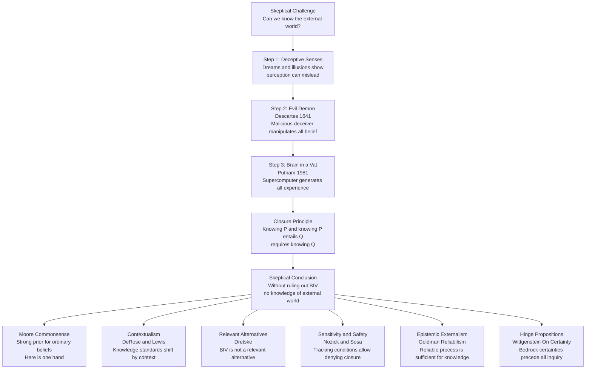

# Skepticism and Its Responses

> [!abstract] TL;DR
> Philosophical skepticism challenges whether knowledge of the external world — or of any domain — is possible, culminating in Descartes' evil demon and Putnam's brain-in-a-vat scenario, which argue that every experience could be systematically illusory. Responses range from Moore's commonsense strong prior ("Here is one hand") to Nozick's sensitivity conditions, Lewis's contextualism, Goldman's reliabilism, and Wittgenstein's hinge propositions — each locating a different place to block the skeptical argument rather than accepting its radical conclusion. Understanding these responses is not merely academic: they define what it means for a belief to be rational, justified, or knowledge, shaping epistemology, the philosophy of science, legal standards of proof, and the foundations of AI.

---

## Intuition

**Analogy:** Imagine you wake up inside a perfect simulation so realistic that every sensory experience — the warmth of sunlight, the weight of a coffee cup, the pain of stubbing your toe — is indistinguishable from the real thing. Now ask: how would you know? The simulation designers anticipated exactly that question and programmed a convincing answer for every test you could try. Every experiment confirms the simulation. Every memory is false but coherent. The point is not whether you ARE in a simulation — it is whether you could KNOW you are not, and what your certainty about ordinary things rests on when that floor is pulled away.

This is the problem of the external world. Philosophical skepticism is not a conspiracy theory but a stress-test for epistemology: it isolates the question of what justifies any belief about anything beyond the contents of your own mind, and demands an answer that does not merely reassert what is in question.

---

## How It Works

### Core Mechanics

**Ancient Skepticism** (4th century BCE onward) divided into two traditions. *Pyrrhonism*, founded by Pyrrho of Elis and codified by Sextus Empiricus in *Outlines of Pyrrhonism*, held that for any proposition one can construct equally strong arguments on both sides (*isostheneia*). The rational response is suspension of judgment (*epoché*), which Pyrrhonists claimed yields tranquility (*ataraxia*) rather than frustration. *Academic Skepticism* (Arcesilaus, Carneades) was the official position of Plato's Academy for two centuries: knowledge is impossible, but probable opinion (*pithanon*) can still guide action.

**Descartes' Method of Doubt** (1641) is the pivot of modern epistemology. In *Meditations on First Philosophy*, Descartes applies doubt systematically: senses sometimes deceive, so any sense-dependent belief is suspect. Dreams are experientially indistinguishable from waking, so the entire sensory world might be a dream. Most radically, an *evil demon* (*malin génie*) of unlimited power might be deceiving him about even mathematical truths. What survives? Only the *cogito*: the very act of doubting confirms a doubter. "I think, therefore I am" (*cogito ergo sum*) is the one foothold immune to demonic deception. But rebuilding knowledge of the external world from the cogito alone requires God's existence as a guarantor — a move most later philosophers rejected, leaving the skeptical problem alive.

**The Brain-in-a-Vat** (Hilary Putnam, *Reason, Truth and History*, 1981) is the contemporary reformulation: you are a disembodied brain in a nutrient vat connected by electrodes to a supercomputer that generates all your experiences. This is empirically unrefutable — any test you devise is exactly what the computer would simulate. Putnam's own semantic response is that if you genuinely were a BIV, the word "vat" in your language would refer to the virtual objects in your experience, not to real vats. Therefore "I am a brain in a vat" cannot be coherently asserted by a genuine BIV — it is, in that sense, self-refuting. Critics note this response blocks the BIV hypothesis but does not vindicate ordinary knowledge.

**The Closure Principle** formalises the skeptical threat:

> If S knows P, and S knows that P entails Q, then S knows Q.

This seems self-evident. But it yields: if I know I have hands, and I know having hands entails I am not a bodiless BIV, then I must know I am not a BIV. Yet I cannot know I am not a BIV — the hypothesis is unrefutable. Therefore, by *modus tollens*, I do not know I have hands. Skeptical arguments inherit their force from this closure-based inference.

**Global vs. Local Skepticism:** Global skepticism denies knowledge of everything; local skepticism targets a domain — the external world (Descartes), other minds (solipsism), the past (memory skepticism), future regularities (Hume), or moral facts (moral skepticism). Local skepticism is both more defensible and more practically troubling because it questions domains where certainty is assumed.

### The Six Main Responses

| Response | Proponent | Core Move |
|----------|-----------|-----------|
| Commonsense | G.E. Moore | Strong prior for ordinary beliefs; run the argument backwards |
| Contextualism | DeRose, Lewis | "Knows" is context-sensitive; skeptic raises standards artificially |
| Relevant Alternatives | Dretske | Knowledge only requires ruling out relevant, not all, alternatives |
| Sensitivity / Safety | Nozick, Sosa | Counterfactual tracking; deny closure without losing ordinary knowledge |
| Reliabilism | Goldman | Knowledge = true belief from a reliable cognitive process |
| Hinge Propositions | Wittgenstein | Some certainties are preconditions of inquiry, not conclusions of it |

### Flow / Architecture



---

## Key Concepts

### Secondary

**Pyrrhonism and epoché** — Pyrrho argued that for every belief, equally compelling arguments can be marshalled for and against it. Facing this equipoise, the wise person suspends judgment. The practical payoff is tranquility: anxiety arises from strong commitments; withdraw the commitment and the anxiety dissipates. Sextus Empiricus catalogued ten *modes* (tropoi) — arguments from perceptual relativity, cultural variation, circumstantial context, and so on — each designed to generate equipoise on any given question. Pyrrhonism is *not* the claim that truth does not exist but the practical refusal to assert or deny it.

**Descartes' cogito and the method of doubt** — Descartes' project is reconstructive, not nihilistic. He doubts everything that can be doubted in order to find what cannot be — and then rebuild knowledge on that foundation. The cogito survives because doubting requires thinking, and thinking requires a thinker. But the cogito yields only the existence of a thinking thing, not of a body, an external world, or other minds. Every subsequent step requires a guarantee that the faculty of reason is reliable, which Descartes grounds in God's goodness — a gap in the argument later philosophers spent centuries trying to close.

**The evil demon and the brain in a vat** — Both scenarios posit that a powerful external agent could make all your experiences qualitatively identical to genuine perception while they remain entirely false. The scenarios are not intended as likely; they are intended to probe whether knowledge requires certainty or merely reliable methods. If knowledge requires certainty, and certainty requires ruling out undetectable deceiving scenarios, then no amount of good-quality ordinary perception is enough.

**Global vs. local skepticism** — Global skepticism (we know nothing) is philosophically extreme and practically idle. Local skeptical worries are more tractable and more productive: skepticism about the external world (Descartes), about other minds (how do you know anyone else is conscious?), about induction (Hume's problem: past regularities guarantee nothing about the future), and about moral facts (are there objective moral truths, or only attitudes?). Each domain motivates a distinct epistemological literature.

**Moral skepticism** — Moral skepticism divides into epistemological (we cannot know moral facts even if they exist) and metaphysical variants. J.L. Mackie's *error theory* holds that moral claims purport to describe objective features of reality but no such features exist — so all moral claims are systematically false, a global moral error. Non-cognitivists deny that moral utterances are truth-apt at all (they express attitudes, not beliefs), which dissolves rather than answers the skeptical worry.

### Undergraduate

**The closure principle and its denial** — The closure principle is the engine of all skeptical arguments. It makes intuitive sense: if you know your house is unlocked, and you know that entails no one locked it while you were out, you know no one locked it. Fred Dretske (1970) and Robert Nozick (1981) both deny closure in order to escape the skeptical conclusion. The cost is accepting that knowledge is not closed under known entailment — a counterintuitive result that requires careful handling. If knowing A and knowing A→B does not guarantee knowing B, then knowledge is not a fully inferential matter, which has implications for the practice of reasoning.

**Moore's commonsense response** — In "Proof of an External World" (1939), Moore held up his hands and said: "Here is one hand, and here is another." He inferred: therefore at least two external things exist. Therefore an external world exists. The proof looks trivially circular — it assumes what it sets out to prove. Moore's philosophical point is subtler: the skeptic's argument runs *modus ponens* (from general principles to the denial of hand-knowledge). But we can run the same argument *modus tollens* — from the certainty of hand-knowledge to the rejection of the skeptical premises. We have more certainty about our hands than about any philosophical principle the skeptic employs. The correct conclusion is not "I don't know I have hands" but "the skeptic's premises must be wrong."

**Contextualism (DeRose, Lewis)** — Keith DeRose (1995) and David Lewis (1996) argue that "knows" is an *indexical* expression like "tall," "here," or "now": its extension shifts with conversational context. In everyday contexts where BIV is not under discussion, the standards for knowledge are low enough that "I know I have hands" is true. When a skeptic raises BIV in conversation, standards shift upward — suddenly the sentence becomes false, not because anything about the world changed, but because the word "know" now carries a higher bar. This dissolves the contradiction: the skeptic and the non-skeptic are both saying true things, just at different contextual standards. Critics object that contextualism merely describes how the word "know" behaves rather than vindicating the *actual* epistemic situation of ordinary people.

**Relevant Alternatives Theory (Dretske)** — Dretske proposes that knowing P requires only being able to rule out *relevant* alternatives — those that are genuine live possibilities given the context. To know there is a zebra at the zoo, I need to rule out "it is a cleverly disguised mule" (relevant: zoos have incentives to fake) but not "it is a hologram generated by a rogue AI" (irrelevant in an ordinary zoo visit). BIV is not a relevant alternative in any normal epistemic context; therefore ordinary knowledge claims are justified even without ruling it out. This directly denies closure: knowing I have hands does not require knowing I am not a BIV, because BIV is not a relevant alternative in ordinary life.

**Sensitivity and safety (Nozick and Sosa)** — Robert Nozick (*Philosophical Explanations*, 1981) proposes that S knows P only if S's belief *tracks* the truth: (a) if P were false, S would not believe P (*sensitivity*); (b) if P were true, S would believe P (*adherence*). I know I have hands because if I didn't have hands, I wouldn't believe I did — the belief is sensitive to the fact. But I do NOT know I am not a BIV, because if I were a BIV I would still believe I am not — the belief lacks sensitivity. This lets ordinary knowledge survive while explaining why BIV-knowledge is unattainable. Ernest Sosa reformulates this as *safety*: S knows P only if S could not easily have held the false belief that P. In nearby possible worlds, my belief in my hands is safe; a BIV world is not nearby.

**Goldman's reliabilism and epistemic externalism** — Alvin Goldman (*Epistemology and Cognition*, 1986) relocates justification from the agent's perspective to the world: a belief is justified if it was produced by a reliable cognitive process — one that tends to produce true beliefs. I don't need to be able to reflectively verify that my vision is reliable; I just need it to actually be reliable. This *externalist* move breaks the skeptical argument because the skeptic demands that the agent be able to internally certify the reliability of their faculties. Reliabilism denies that requirement. The objection is the "generality problem": how do we individuate the "process" whose reliability we are assessing? And reliabilism seems to give the wrong verdicts in Gettier-style cases.

### Graduate

**Wittgenstein's hinge propositions (*On Certainty*, 1969)** — Wittgenstein's posthumously published *On Certainty* is the most searching response to both Moore and the skeptic. Wittgenstein argues that Moore was wrong to claim *knowledge* of "here is a hand" because knowledge requires the possibility of doubt, and genuine doubt requires a framework of certainties within which doubt is intelligible. Propositions like "I have two hands," "the Earth has existed for many years," and "this is a tree" are *hinge propositions*: they form the scaffolding of our language games, not conclusions within them. They are not known — they are *held fast*. To try to doubt them is not to achieve a higher level of philosophical rigor; it is to step outside the activity of reasoning altogether. The skeptic who demands a proof of the external world has not raised the stakes — they have dissolved the context in which "proof" means anything. The world picture that includes external objects is not a hypothesis I could verify; it is the background against which verification is even possible.

**Putnam's semantic argument and its limits** — Putnam's 1981 argument is subtle. If we were BIVs, our terms would acquire their meanings through causal connections to our computational environment, not to a real external world. "Brain" in BIV-language refers to simulated brains; "vat" refers to the simulation's representation of a vat. Therefore the sentence "I am a brain in a vat" uttered by a BIV says something false (BIV-brain is not a real brain) or incoherent. This is a semantic *transcendental argument*: we use language to refer to the external world, so the external world must exist in some form as the causal grounding of our reference. Critics (e.g. Anthony Brueckner) argue the argument shows only that *our* concept of BIV does not apply to us, not that a global skeptical scenario is impossible — only that we cannot coherently formulate it, which is a different claim.

**Virtue epistemology (Zagzebski, Sosa)** — Ernest Sosa and Linda Zagzebski shift the unit of analysis from belief-properties (justified, safe, sensitive) to *agent*-properties: intellectual virtues such as careful observation, open-mindedness, intellectual humility, and truth-seeking. A piece of knowledge is true belief arising from the exercise of intellectual virtue. This reframes the skeptical problem: rather than asking "is this belief reliably produced?" one asks "would a virtuous inquirer hold this belief given this evidence?" Virtue epistemology is attractive because it handles the generality problem, naturalizes epistemic evaluation, and connects epistemology to ethics. But it faces a parallel problem: defining the virtues without circularity (a virtue is what produces knowledge; knowledge is what virtues produce).

**Scientific realism vs. constructive empiricism** — Bas van Fraassen's *constructive empiricism* (*The Scientific Image*, 1980) is a sophisticated form of local skepticism: scientific theories should be accepted as *empirically adequate* (saving the observable phenomena) but not believed as true about unobservable entities. We cannot know whether electrons, quarks, and fields exist; we can only know the observable predictions they entail. Scientific realism responds that inference to the best explanation (IBE) licenses belief in unobservables: the best explanation for the success of physics is that electrons really exist. The no-miracles argument (Putnam) says it would be a miracle if quantum electrodynamics were empirically adequate but electrons were fictional. Van Fraassen replies that successful theories are selected precisely because they are empirically adequate — there is no miracle requiring a realist explanation, only natural selection among theories.

**The problem of the criterion (Roderick Chisholm)** — A foundational puzzle: to know what we know, we need a criterion for knowledge; but to choose a criterion, we need to know which beliefs constitute knowledge. Methodists (like Descartes) begin with a criterion and derive knowledge. Particularists (like Moore) begin with particular cases of knowledge and work backward to the criterion. Most contemporary epistemologists are particularists: the data are our ordinary knowledge claims, and epistemological theory must save them, not replace them. This is a meta-epistemological stance with direct implications for how one evaluates skeptical arguments.

---

## Python Demo

```python
import numpy as np
import matplotlib.pyplot as plt

# Bayesian model of Cartesian skepticism
#
# Two competing hypotheses:
#   H_real: the agent inhabits a genuine external world
#   H_biv : the agent is a brain in a vat  (Putnam 1981)
#
# The radical-skeptic's key move: the simulation can perfectly replicate
# every possible sensory experience.  Therefore:
#   P(E | H_biv) = P(E | H_real)  for any evidence E.
# Likelihood ratio LR = P(E | H_real) / P(E | H_biv) = 1.0.
# When LR = 1, no evidence can shift the posterior from the prior.
# The prior carries ALL epistemic weight --- which is exactly Moore's point.


def posterior_real(prior_real: float, lr: float) -> float:
    """
    P(H_real | E) via Bayes theorem.
    lr = P(E|H_real) / P(E|H_biv), normalized so P(E|H_biv) = 1.
    Accepts scalars or numpy arrays via broadcasting.
    """
    numerator   = prior_real * lr
    denominator = numerator + (1.0 - prior_real) * 1.0
    return numerator / denominator


def simulate_sequential(initial_prior: float, lr: float, n_steps: int) -> np.ndarray:
    """Update belief sequentially over n_steps evidence rounds with fixed LR."""
    beliefs = np.empty(n_steps + 1)
    beliefs[0] = initial_prior
    for i in range(1, n_steps + 1):
        beliefs[i] = posterior_real(beliefs[i - 1], lr)
    return beliefs


# ── Figure layout ────────────────────────────────────────────────────────────
fig, axes = plt.subplots(1, 3, figsize=(15, 5))

# ── Panel A: posterior collapse under rising skeptical prior ─────────────────
# Fix LR = 2 (moderate perceptual evidence favoring H_real).
# Sweep the prior P(H_real) from near-0 to near-1.
# Under radical skepticism LR=1, posterior = prior for every starting point.
priors_sweep = np.linspace(0.001, 0.999, 500)
post_lr2     = posterior_real(priors_sweep, lr=2.0)
post_lr1     = posterior_real(priors_sweep, lr=1.0)   # undetectable BIV

ax = axes[0]
ax.plot(priors_sweep, post_lr2, color="steelblue",  linewidth=2.5,
        label="LR = 2: moderate perceptual evidence")
ax.plot(priors_sweep, post_lr1, color="crimson",    linewidth=2.5, linestyle="--",
        label="LR = 1: radical BIV, evidence symmetric")
ax.plot([0, 1], [0, 1], color="gray", linewidth=1.0, linestyle=":",
        label="Diagonal: posterior = prior")
# Mark the two canonical priors
ax.scatter([0.50], [posterior_real(0.50, 2.0)],
           color="darkorange", s=90, zorder=6, label="Cartesian Doubt P=0.50")
ax.scatter([0.99], [posterior_real(0.99, 2.0)],
           color="green", s=90, zorder=6, label="Moore Commonsense P=0.99")
ax.set_xlabel("Prior P(Real World)", fontsize=11)
ax.set_ylabel("Posterior P(Real World | Evidence)", fontsize=11)
ax.set_title("Posterior Collapse Under\nRising Skeptical Prior")
ax.legend(fontsize=8)
ax.grid(alpha=0.3)
ax.set_ylim(0, 1)

# ── Panel B: 50 rounds of evidence — paralysis vs. stability ─────────────────
n_steps = 50
steps   = np.arange(n_steps + 1)

# LR = 1.0: perfectly symmetric evidence (radical BIV scenario)
traj_des_sym   = simulate_sequential(0.50, lr=1.0,  n_steps=n_steps)
traj_moore_sym = simulate_sequential(0.99, lr=1.0,  n_steps=n_steps)
# LR = 1.05: weak evidence slightly favoring the real world
traj_des_weak  = simulate_sequential(0.50, lr=1.05, n_steps=n_steps)
traj_moore_weak = simulate_sequential(0.99, lr=1.05, n_steps=n_steps)

ax2 = axes[1]
ax2.plot(steps, traj_des_sym,    color="crimson",   linewidth=2.5,
         label="Cartesian P=0.50, LR=1")
ax2.plot(steps, traj_des_weak,   color="crimson",   linewidth=1.5, linestyle="--",
         label="Cartesian P=0.50, LR=1.05")
ax2.plot(steps, traj_moore_sym,  color="steelblue", linewidth=2.5,
         label="Moore P=0.99, LR=1")
ax2.plot(steps, traj_moore_weak, color="steelblue", linewidth=1.5, linestyle="--",
         label="Moore P=0.99, LR=1.05")
ax2.axhline(0.5, color="gray", linestyle=":", linewidth=1.0)
ax2.set_xlabel("Evidence Rounds", fontsize=11)
ax2.set_ylabel("P(Real World)", fontsize=11)
ax2.set_title("Cartesian Paralysis vs. Moore Stability\nOver 50 Evidence Rounds")
ax2.legend(fontsize=8)
ax2.grid(alpha=0.3)
ax2.set_ylim(0, 1)

# ── Panel C: five epistemic stances as priors and posteriors ─────────────────
stance_names  = ["Pyrrhonism\nP=0.50", "Cartesian\nDoubt P=0.50",
                 "Relevant\nAlts P=0.85", "Moore\nP=0.99", "Wittgenstein\nHinge P=0.999"]
stance_priors = np.array([0.50, 0.50, 0.85, 0.99, 0.999])
post_sym      = posterior_real(stance_priors, lr=1.0)   # undetectable BIV: LR=1
post_strong   = posterior_real(stance_priors, lr=5.0)   # strong perceptual evidence

x_pos = np.arange(len(stance_names))
w     = 0.28

ax3 = axes[2]
ax3.bar(x_pos - w, stance_priors, w, label="Prior",
        color="lightgray",  edgecolor="black", linewidth=0.8)
ax3.bar(x_pos,     post_sym,      w, label="Posterior LR=1 (BIV)",
        color="crimson",    edgecolor="black", linewidth=0.8, alpha=0.80)
ax3.bar(x_pos + w, post_strong,   w, label="Posterior LR=5",
        color="steelblue",  edgecolor="black", linewidth=0.8, alpha=0.80)
ax3.set_xticks(x_pos)
ax3.set_xticklabels(stance_names, fontsize=8)
ax3.set_ylabel("P(Real World)", fontsize=11)
ax3.set_title("Five Epistemic Stances:\nPrior and Posterior Under Evidence")
ax3.legend(fontsize=9)
ax3.grid(axis="y", alpha=0.3)
ax3.set_ylim(0, 1.05)

plt.tight_layout()
plt.savefig("skepticism_bayesian_model.png", dpi=110, bbox_inches="tight")
plt.show()

# ── Key numerical results ────────────────────────────────────────────────────
print("=== Bayesian Model of Skepticism ===\n")
print("RADICAL SKEPTICISM LR=1: posterior always equals prior.")
for p, name in zip([0.50, 0.99, 0.999], ["Cartesian", "Moorean", "Wittgenstein"]):
    post = posterior_real(p, 1.0)
    print(f"  {name:14s}: prior={p:.3f}  ->  posterior={post:.3f}  (unchanged)")

print("\nMoore vs. Descartes under LR=5 evidence (moderate perception):")
print(f"  Cartesian P=0.50 -> posterior = {posterior_real(0.50, 5.0):.4f}")
print(f"  Moore     P=0.99 -> posterior = {posterior_real(0.99, 5.0):.6f}")
print()
print("Key insight: When P(E|BIV) = P(E|Real), LR=1 and NO evidence")
print("can escape the prior. The entire epistemic load falls on the prior.")
print("Moore's commonsense response is, in Bayesian terms, a refusal to")
print("allow the skeptic to reset your prior to 0.50.")
```

---

## Real-World Applications

**1. Legal standards of proof and relevant alternatives in court** — "Beyond reasonable doubt" is not "beyond all conceivable doubt." A juror who demands to rule out BIV-style conspiracy scenarios (the defendant was framed by invisible forces indistinguishable from reality) would be applying an impossible standard. The legal system implicitly adopts Dretske's relevant alternatives: you must rule out scenarios that are genuinely plausible given the evidence — not every logically possible alternative. This is why courts restrict which hypotheses can be introduced to the jury, and why "reasonable" in "reasonable doubt" does normative work.

**2. Simulation argument and AI alignment** — Nick Bostrom's simulation argument (2003) is a probabilistic version of the brain-in-a-vat: given enough compute, simulated beings would vastly outnumber biological ones; therefore any conscious agent is probably simulated. This is taken seriously in AI safety because if we cannot distinguish a simulated training environment from deployment, trained models may behave differently in the real world than in testing — a form of distributional skepticism. Robustness research in machine learning is, in a sense, a response to this concern: designing models that behave well even if the environment is adversarially manipulated.

**3. Scientific anti-realism and technology design** — Van Fraassen's constructive empiricism — accept theories as empirically adequate, not literally true — is the implicit epistemology of many engineers. The question is not "do electrons really exist?" but "does the electron model reliably predict measurable outcomes?" Circuit designers use quantum mechanics without committing to the ontological reality of wave functions. This is practical local skepticism: sufficient certainty at the observable level, suspension of judgment about unobservables.

**4. Predictive processing and AI perception** — Karl Friston's predictive processing framework treats the brain as a Bayesian inference machine: perception is not passive receipt of sensory signals but active prediction with error correction. The brain never directly perceives the external world — only its own prediction errors. This is the cognitive science version of Descartes' problem: everything we call "experience" is a model constructed by the brain and tested against noisy sensor signals. Skepticism about the external world is thus not a bizarre philosophical thought experiment but a description of how cognition always works. Designing robust AI perception systems (for autonomous vehicles, medical imaging) requires explicit Bayesian uncertainty quantification for exactly this reason.

**5. Epistemology of AI testimony** — As language models become sources of information, the question of when to believe their outputs is a live application of reliabilism: is the process (training on internet text, fine-tuning, RLHF) reliable enough to trust the outputs? Goldman's framework predicts that trust should track measured reliability in the relevant domain, not the model's confident tone. This has direct implications for AI deployment: without calibration and domain-specific validation, treating LLM outputs as knowledge claims is epistemically unjustified even when they are often correct.

---

## Common Pitfalls

- **Treating Moore's argument as naive** — Moore's proof looks circular but is deliberately so. His philosophical claim is that ordinary knowledge claims have more certainty than abstract philosophical principles. Running the skeptical argument backwards (modus tollens) is just as valid as the skeptic running it forwards (modus ponens). The question is which premise is less certain. Dismissing Moore misses that reversal.

- **Confusing contextualism with relativism** — Contextualism (DeRose, Lewis) says "knows" is context-sensitive, not that all beliefs are equally valid. The contextualist does not deny that skeptical standards are higher — they deny that failing those standards in ordinary contexts is a problem for ordinary knowledge. Contextualism is a semantic thesis, not an epistemic free-for-all.

- **Missing that closure denial has a price** — Nozick and Dretske both escape skepticism by denying closure. But if closure fails, then knowing A and knowing A entails B does not guarantee knowing B. This has counterintuitive consequences: you can rationally know a set of propositions while being unable to infer their jointly entailed conclusions. This is a significant cost that must be weighed.

- **Conflating "cannot be refuted" with "probably true"** — BIV and evil demon scenarios are logically possible and empirically unfalsifiable. This does not make them probable. Bayesian reasoning shows that an a priori implausible hypothesis should retain a low posterior even after receiving evidence that is symmetric between the two hypotheses. The unfalsifiability of BIV does not elevate it above an astronomical prior against it.

- **Applying global skepticism in local domains** — Global skepticism is philosophically interesting but practically sterile. Local skeptical worries (about induction, other minds, moral facts) are more productive because they target specific epistemic structures with targeted responses. Treating every domain as globally uncertain is a rhetorical move, not a philosophical argument.

- **Ignoring the problem of the criterion** — Responses to skepticism that begin from ordinary cases (particularism) and those that begin from general principles (methodism) operate at different levels. Arguing past each other — one citing perceptual certainty, the other citing logical possibility — is a failure to engage the meta-epistemological question of which direction the argument should go. Recognizing Chisholm's framing prevents talking past the skeptic.

---

## Related Concepts

- [[Logic_and_Critical_Thinking_Overview]] — Parent framework: this note addresses the epistemological foundations that underpin all critical inquiry covered in the overview; the question "what counts as knowing?" precedes the question "what counts as valid argument?"

- [[Arguments_Validity_and_Soundness]] — The closure principle is a thesis about argument validity — specifically, about when a conclusion follows from premises involving knowledge claims. Moore's and Nozick's responses directly manipulate whether the skeptic's argument is sound.

- [[Modal_Logic]] — Possible worlds semantics is the formal machinery behind Nozick's sensitivity conditions (counterfactual conditionals), Sosa's safety (nearby possible worlds), and contextualism (accessibility relations between epistemic contexts). The formal apparatus of modal logic is the right language for making these positions precise.

- [[Bayesian_Reasoning]] — The Python demo models skeptical scenarios as Bayesian priors and posteriors. Moore's strong commonsense prior, the collapse of posterior under radical BIV symmetric evidence, and the role of likelihood ratios map directly onto the Bayesian framework developed in that note.

- [[Inductive_Logic]] — Hume's problem of induction is the canonical form of local epistemic skepticism: no finite set of observations can justify a universal generalization. Skepticism about induction is the direct ancestor of the external-world problem and of Goodman's new riddle of induction.

- [[Abductive_Reasoning_and_Inference_to_Best_Explanation]] — The scientific realist response to van Fraassen's constructive empiricism invokes IBE: the best explanation for the success of science is that theoretical entities are real. IBE is the epistemological engine of scientific realism and is directly contested by anti-realist skeptics about unobservables.

---

## Review Questions

### Secondary

1. Descartes concludes from his method of doubt that "I think, therefore I am" cannot be doubted even by an evil demon. Explain why the cogito survives demonic deception when "I have two hands" does not. What is the structural difference between the two claims?

2. What is the difference between global and local skepticism? Give one example of each and explain why local skepticism tends to be more philosophically fruitful than the global variety.

3. Explain Moore's "proof of an external world" in your own words. Why do philosophers consider it philosophically significant rather than dismissing it as obviously circular?

### Undergraduate

1. The closure principle states: if S knows P, and S knows P entails Q, then S knows Q. Both Dretske and Nozick deny closure. Reconstruct each philosopher's argument for denial and compare what each gives up. Which denial do you find more defensible, and why?

2. Contextualists claim that "knows" is context-sensitive: the same sentence "I know I have hands" is true in ordinary conversational contexts and false in skeptical philosophy seminars. Does this *solve* skepticism (showing ordinary knowledge is genuine) or merely *change the subject* (showing that a particular word behaves differently in different contexts)? What would have to be true for it to count as a solution?

3. Wittgenstein argues in *On Certainty* that propositions like "I have two hands" are not known but are *held fast* as hinges of our language game. How does this position differ from Moore's? Which constitutes a deeper response to Descartes, and why?

### Graduate

1. Putnam's semantic argument against the brain-in-a-vat hypothesis concludes that the sentence "I am a brain in a vat" is self-refuting when uttered by a genuine BIV, because "vat" in BIV-language refers only to simulated vats. Does this argument successfully refute the BIV hypothesis as an epistemological threat, or does it merely show we cannot coherently formulate certain skeptical scenarios in first-person terms? Assess the argument's scope and its limits.

2. Goldman's reliabilism holds that a belief is justified if produced by a reliable cognitive process. The skeptic objects that we cannot know whether our faculties are reliable without using those very faculties (the Cartesian circle problem). Evaluate whether reliabilism genuinely escapes this circularity, or whether it relocates the problem without solving it.

3. Van Fraassen's constructive empiricism argues that science should aim at empirical adequacy, not truth about unobservables. The scientific realist replies with the no-miracles argument: the predictive success of quantum field theory would be miraculous if electrons did not exist. Compare this debate with the Cartesian skeptical problem about the external world. In what sense is scientific anti-realism a form of local skepticism, and does the no-miracles argument constitute a principled response or merely a prior commitment to realism?

---

## Sources

- [Descartes, R. *Meditations on First Philosophy* (1641). Hackett Publishing, 1993](https://www.hackettpublishing.com/meditations-on-first-philosophy)
- [Moore, G.E. "Proof of an External World." *Proceedings of the British Academy* 25, 273–300, 1939](https://www.jstor.org/stable/43900401)
- [Putnam, H. *Reason, Truth and History*. Cambridge University Press, 1981 — Chapter 1: Brains in a Vat](https://www.cambridge.org/core/books/reason-truth-and-history/7D1AE6CA0A8C7CEBDA049EF6E1B86D4A)
- [Nozick, R. *Philosophical Explanations*. Harvard University Press, 1981 — Chapter 3: Knowledge and Skepticism](https://www.hup.harvard.edu/catalog.php?isbn=9780674664791)
- [Wittgenstein, L. *On Certainty*. Blackwell, 1969. Edited by G.E.M. Anscombe and G.H. von Wright](https://www.wiley.com/en-us/On+Certainty-p-9780631169215)
- [DeRose, K. "Solving the Skeptical Problem." *Philosophical Review* 104:1, 1–52, 1995](https://www.jstor.org/stable/2185939)

---

#epistemology #skepticism #descartes #external-world #knowledge
