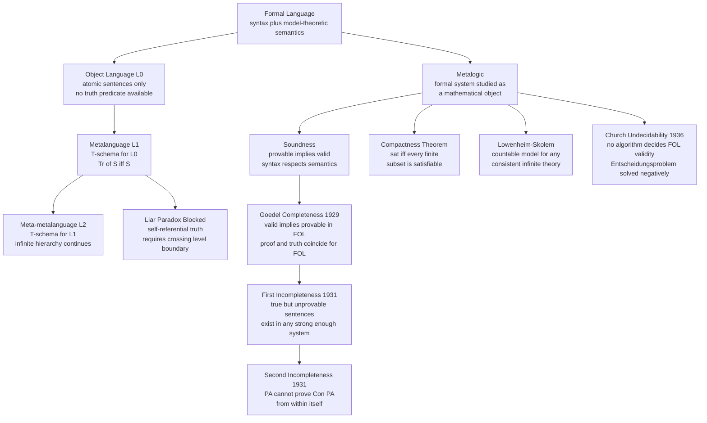

# Truth Theories and Metalogic

> [!abstract] TL;DR
> Truth theories answer the philosophical question "what does it mean for a sentence to be true?" — ranging from Tarski's correspondence-grounded semantic account to deflationary views that deny truth adds any content beyond disquotation. Metalogic turns logic's own methods on formal systems themselves, asking whether proof and truth coincide (soundness, completeness), what arithmetic truth escapes every consistent proof system (Gödel's incompleteness theorems), and whether any algorithm can decide logical validity (Church's undecidability of FOL). Together these fields reveal the outer boundary of what formal reasoning can certify about itself.

---

## Intuition

**Analogy:** Think of a compiler and source code. Source code (the object language) is what you write — `x = 5`, `if x > 3`. The compiler (the metalanguage) adds statements *about* the source: "line 7 is syntactically valid," "expression `f(x)` has type `Bool`." Now imagine source code containing the line: `"The compiler says this line is erroneous"` — whose truth depends entirely on what the compiler then says about it. You have created a fixed-point that is true if false and false if true: the Liar paradox. Tarski's insight is that source-level statements and compiler-level truth predicates must live in strictly separated layers. The Liar is not a deep mystery about truth — it is a type error.

Metalogic extends this: the compiler itself can be studied as a formal object. We can ask whether every program the compiler accepts actually runs correctly (soundness), whether every correctly running program can be accepted (completeness), and whether there exist correct programs the compiler can never certify no matter how long it runs (incompleteness). Gödel's 1931 answer to that last question — yes, always, for any sufficiently powerful compiler — permanently changed the philosophy of mathematics.

---

## How It Works

### Core Mechanics

#### Part A — Theories of Truth

**Correspondence theory.** Truth as correspondence to reality goes back to Aristotle: "to say of what is that it is, and of what is not that it is not, is true." The modern formal version is Tarski's semantic theory. Informally: the sentence "Snow is white" is true because there is a fact of the matter — snow's being white — that makes it so.

**Tarski's T-schema (Convention T).** For every sentence S of an object language L, the metalanguage must be able to express the biconditional:

> "Snow is white" is true **if and only if** snow is white.

In general: `Tr('S') ↔ S`. This is not circular: the left side quotes S as a syntactic object; the right side uses S to make a claim. A truth predicate is materially adequate if and only if all such T-sentences hold.

**Object language vs. metalanguage hierarchy.** Tarski proved that no language containing its own truth predicate and elementary arithmetic can be consistent: such a language can formulate the Liar sentence ("This sentence is false"), which produces a contradiction. His solution: stratify languages into an infinite hierarchy — L₀ (object language), L₁ (metalanguage for L₀), L₂ (meta-metalanguage for L₁), … — where level k+1 contains the truth predicate for level k, and no level can speak about its own truth. The Liar is blocked because self-reference requires applying a truth predicate at the same level as the sentence it evaluates, which is structurally forbidden.

**Deflationary / disquotational theory.** Deflationists (Quine, Leeds, Field) argue the T-schema is not just materially adequate — it is *all there is* to truth. The predicate "is true" is a device of disquotation: saying `'Snow is white' is true` is just a roundabout way of saying `snow is white`. Truth is not a deep metaphysical property; it is a logical expressive convenience for generalizing (e.g., "Everything the Pope says is true" quantifies over a set of sentences without listing them).

**Minimalism (Horwich).** Paul Horwich's minimalism (1990) holds that the property of truth consists in nothing more than the infinite collection of T-schema instances. There is no explanatory theory of what makes sentences true — just the T-biconditionals. This is more conservative than full deflationism: minimalism is about the *nature* of truth, not about the *role* of the predicate.

**Prosentential theory.** Grover, Camp, and Belnap (1975) argue that "is true" is not a predicate at all. Expressions like "that is true" are prosentences — pronouns for sentences — that inherit their content from context just as "he" inherits its referent. There is no subject-predicate analysis; "It is true that snow is white" means nothing more nor less than "snow is white," and the surface grammar misleads.

**Pluralism about truth (Wright, Lynch).** Crispin Wright and Michael Lynch argue that "true" plays different roles in different domains: in mathematics, truth may be coherence or provability; in ethics, it may be superassertibility; in empirical science, it tracks correspondence. Truth is not one thing — different truth properties satisfy the formal constraints of the T-schema in different domains. This contrasts with both deflationism (which says truth is merely formal everywhere) and classic correspondence theory (which posits one substance everywhere).

---

#### Part B — Metalogic

**What metalogic studies.** Metalogic treats formal systems — their axioms, rules, and proofs — as mathematical objects. Where ordinary logic uses a system to derive conclusions, metalogic asks questions about the system's global properties: can it prove everything true in all models? can it prove contradictions? does it have a decision procedure?

**Soundness.** A proof system for a logic is *sound* if every formula it can prove is semantically valid (true in every model). Formally: if `⊢ φ` then `⊨ φ`. Soundness is proved by showing every axiom is valid and every inference rule preserves validity. It is the minimum requirement for a proof system to be worth using: unsound systems derive false conclusions from true premises.

**Completeness.** A proof system is *complete* if every semantically valid formula is provable. Formally: if `⊨ φ` then `⊢ φ`. Completeness closes the gap between truth and provability; it says the proof rules miss nothing. Propositional logic is complete (truth tables decide everything). Whether first-order logic is complete was an open question until 1929.

**Gödel's Completeness Theorem (1929).** Kurt Gödel's doctoral dissertation established that the standard Hilbert calculus for first-order logic is complete: every FOL formula that is true in all models has a formal proof. Proof sketch: assume `φ` has no proof; then there exists a maximally consistent extension of the theory that does not contain `φ`; this extension can be turned into a model (the Henkin construction) in which `φ` is false; so `φ` is not valid. Key corollary: a set of FOL sentences is satisfiable iff it is consistent (has no proof of contradiction).

**Gödel's First Incompleteness Theorem (1931).** Let T be any consistent, recursively axiomatizable formal system that can express basic arithmetic (Peano Arithmetic or stronger). Then there exists a sentence G_T such that:

1. G_T is true (in the standard model of arithmetic).
2. G_T is not provable in T.
3. ¬G_T is also not provable in T (T is "ω-consistent" in the original; consistency alone suffices for the Rosser variant).

The sentence G_T effectively says "I am not provable in T." This is not a linguistic trick — it is rigorously constructed via **Gödel numbering** and the **Diagonal Lemma**.

*Gödel numbering:* Assign a unique natural number to every symbol, formula, and proof in T. Encode sequences by prime factorization: the sequence (a₁, a₂, …, aₙ) maps to 2^a₁ · 3^a₂ · 5^a₃ · … Arithmetic can now express syntactic properties. The predicate `Proof(m, n)` — "m is the Gödel number of a proof of the formula with Gödel number n" — is expressible in T.

*Diagonal Lemma:* For any formula φ(x) with one free variable, there exists a sentence ψ such that T proves `ψ ↔ φ(⌈ψ⌉)`, where ⌈ψ⌉ is the Gödel number of ψ. Apply this with φ(x) = "x is not provable in T." The resulting ψ says "I am not provable in T." If T proves ψ, T is inconsistent (it proves a false arithmetic fact). If T proves ¬ψ, T can prove "I am provable" but cannot actually exhibit a proof — again a contradiction in an ω-consistent T. So neither ψ nor ¬ψ is provable.

**Gödel's Second Incompleteness Theorem (1931).** The sentence expressing "T is consistent" — written Con(T) — is not provable in T (assuming T is consistent). Proof: the First Incompleteness proof can be formalized in T itself, showing T proves `Con(T) → G_T`. If T could prove Con(T), it could also prove G_T, contradicting the First Theorem. Therefore Con(T) is another true but unprovable sentence. This demolishes Hilbert's program: arithmetic cannot certify its own reliability from within.

**Compactness Theorem.** A set of FOL sentences Γ is satisfiable if and only if every finite subset of Γ is satisfiable. Proof: (→) trivial; (←) use the Completeness Theorem — if Γ is unsatisfiable then Γ ⊢ ⊥, but a proof is finite and uses only finitely many premises, so some finite subset already derives ⊥. Applications: (1) FOL cannot express finiteness — any consistent set of sentences claiming "there are at least n objects" for every n is satisfiable and must have an infinite model; (2) non-standard models of arithmetic exist because no finite set of FOL axioms captures "the unique natural number system."

**Löwenheim-Skolem Theorem.** If a countable set of FOL sentences has a model, it has a countably infinite model (downward Löwenheim-Skolem). The **Skolem paradox**: ZFC set theory proves the existence of uncountable sets, yet by Löwenheim-Skolem, ZFC has a countable model. Resolution: "uncountable" is a claim internal to the model — the model satisfies "there is no bijection between ℕ and ℝ," but that only means no such bijection *exists inside the model*. The bijection may exist outside (in the metatheory) but not be an element the model can see.

**Church's Undecidability Theorem / Entscheidungsproblem (1936).** Hilbert asked whether there exists an algorithm that, given any FOL formula, decides in finite time whether it is valid. Church (via lambda calculus) and Turing (via Turing machines) proved independently: no. The proof encodes the halting problem as FOL validity — for any Turing machine M and input w, one can mechanically construct a FOL formula φ_{M,w} that is valid iff M halts on w. Since the halting problem is undecidable, so is FOL validity. FOL is *semi-decidable*: a complete proof enumeration will eventually find a proof if one exists, but will run forever if the formula is not valid.

**Craig's Interpolation Theorem (1957).** If `⊨ φ → ψ`, then there exists a formula θ (the interpolant) such that (1) `⊨ φ → θ`, (2) `⊨ θ → ψ`, and (3) every non-logical symbol of θ appears in both φ and ψ. The interpolant witnesses the "common ground" between the two sentences. Applications: formal verification (computing the strongest condition propagated between two modules sharing only a common interface), database query rewriting, and abstract interpretation.

---

### Flow / Architecture



---

## Key Concepts

### Secondary

- **Truth as a property of sentences.** Sentences, not facts or beliefs, are the primary bearers of truth in formal settings. "The Nile is long" is true; Nile-longness is the corresponding fact. Truth connects language to the world.
- **T-schema.** The biconditional `'S' is true ↔ S` is Tarski's minimal constraint: any adequate truth predicate must satisfy every instance. The left side quotes S; the right side uses S. This is the engine of the semantic theory.
- **Object language vs. metalanguage.** The object language is the language being described; the metalanguage is used to describe it. English can serve as metalanguage for French. FOL can serve as metalanguage for propositional logic. The levels must not collapse.
- **Deflationary truth.** Truth adds no metaphysical substance; it is simply a device for disquotation and generalization. Saying "what she said is true" is a shorthand for endorsing her statement without being able to list it.
- **Soundness.** If `⊢ φ` (provable) then `⊨ φ` (valid). Every proved formula is true. Unsoundness is catastrophic — it means the system derives false conclusions.
- **Completeness.** If `⊨ φ` (valid) then `⊢ φ` (provable). The system misses nothing true. Completeness is harder to establish than soundness and fails for strong arithmetic theories by Gödel.

### Undergraduate

- **Semantic theory of truth (Tarski 1933).** A rigorous recursive definition of satisfaction: base case assigns truth to atomic formulas via the model's interpretation function; inductive cases define satisfaction for compound formulas and quantifiers. Truth for sentences is then satisfaction under all variable assignments. This is Tarski's general framework from "The Concept of Truth in Formalized Languages."
- **Gödel numbering.** Encode every syntactic object (symbol, formula, proof) as a natural number. Arithmetic on Gödel numbers mirrors syntactic operations on proofs. This lifts syntax into arithmetic so that arithmetic can talk about provability.
- **Diagonal Lemma (Fixed-Point Lemma).** For any formula φ(x), there is a sentence ψ equivalent (in T) to φ(⌈ψ⌉). This is the technical engine of incompleteness, the Liar, and Tarski's undefinability theorem. It shows self-reference can be constructed in any sufficiently expressive system.
- **First Incompleteness Theorem.** Any consistent, axiomatizable extension of Robinson Arithmetic (Q) is incomplete — it has a true but unprovable sentence. The unprovable sentence is Gödelian: it says "I am not provable." Neither it nor its negation is derivable.
- **Second Incompleteness Theorem.** The formalized consistency statement Con(T) is not provable in T. This makes Hilbert's finitistic consistency programme impossible for PA and stronger systems.
- **Compactness theorem.** A set Γ is satisfiable iff every finite subset is. Corollary: FOL cannot express "there are only finitely many objects," "a graph is finite," or "a number is standard." Any property that distinguishes infinite from finite structures requires infinitary means.
- **Löwenheim-Skolem theorem.** Every satisfiable countable theory has a countably infinite model. FOL is non-categorical for infinite structures: you cannot pin down "the reals" or "the natural numbers" up to isomorphism using only FOL axioms.
- **Decidability vs. undecidability.** A theory is *decidable* if there is an algorithm that, for any sentence, halts and correctly outputs whether it is provable. Propositional logic is decidable (truth tables). FOL validity is undecidable (Church 1936). First-order Presburger arithmetic (addition over ℕ, no multiplication) is decidable. Peano arithmetic (addition and multiplication) is undecidable (by encoding Turing machines).

### Graduate

- **Tarski's Undefinability Theorem.** The set of Gödel numbers of true sentences of arithmetic is not definable in arithmetic. This is stronger than incompleteness: there is no formula `True(x)` in the language of arithmetic that holds of exactly the Gödel numbers of true arithmetic sentences. Any purported definition either misidentifies some true sentence, some false sentence, or is not expressible. The Liar paradox is the informal counterpart.
- **Rosser's improvement (1936).** Gödel's original theorem required ω-consistency (a technical strengthening of consistency). John Barkley Rosser showed that plain consistency suffices for a strengthened incompleteness result, using the Rosser sentence: "For every proof of me, there is a shorter proof of my negation."
- **Proof-theoretic ordinals.** Each consistent extension T of PA has a *proof-theoretic ordinal* o(T), the smallest ordinal not provably well-ordered by T. For PA, o(PA) = ε₀. Gentzen proved Con(PA) from transfinite induction up to ε₀, sidestepping the Second Incompleteness Theorem because this induction principle is not available within PA itself.
- **Minimalism vs. pluralism.** Horwich's minimalism: the truth property just is the property expressed by the T-schema instances; no substantive metaphysics is needed. Wright/Lynch pluralism: different norm-governed domains have different truth properties (superassertibility in mathematics, robust correspondence in science). The debate turns on whether the formal T-schema constraints fully determine truth or whether distinct realizing properties are needed per domain.
- **Craig's Interpolation and Beth Definability.** Craig interpolation implies the Beth definability theorem: a predicate is implicitly definable (uniquely determined by a theory up to isomorphism) iff it is explicitly definable (there is a formula giving a definition in the existing vocabulary). Applications in formal verification and semantic tableaux.
- **Lindstrom's Theorem (1969).** FOL is the maximal logic satisfying both the Compactness Theorem and the Löwenheim-Skolem Theorem. Any stronger logic (e.g., second-order logic, infinitary logic) must sacrifice at least one of these properties. This characterizes FOL by its model-theoretic behavior rather than its syntactic rules.

---

## Python Demo

```python
import itertools
import numpy as np
import matplotlib.pyplot as plt

# ── PART 1: Tarski Language Hierarchy ─────────────────────────────────────────
# L0: object language — atomic propositions only.
# L1: metalanguage — has the truth predicate Tr0 for L0.
# T-schema: for every L0 sentence name S, Tr0(S) iff eval(S) in the model.
# The Liar would require Tr0 to exist inside L0 itself — blocked by the
# level constraint: the truth predicate for level k lives at level k+1.

class TarskiLevelError(Exception):
    pass

# Ground model: truth values for L0 atomic sentences
MODEL_L0 = {
    "snow_is_white":          True,
    "grass_is_green":         True,
    "sky_is_red":             False,
    "all_ravens_are_black":   True,
    "two_plus_two_is_five":   False,
}

def eval_L0(name: str) -> bool:
    """Evaluate an L0 atomic sentence directly from the model."""
    if name not in MODEL_L0:
        raise KeyError(f"Unknown L0 atom: '{name}'")
    return MODEL_L0[name]

def truth_claim(name: str, claim_level: int) -> bool:
    """
    Evaluate Tr_{claim_level-1}(name): the truth claim at claim_level
    about the sentence 'name' which lives at level claim_level - 1.
    Raises TarskiLevelError if claim_level == 0 (no truth predicate in L0).
    """
    if claim_level <= 0:
        raise TarskiLevelError(
            f"Cannot apply truth predicate at level {claim_level}. "
            f"Tr0 is a level-1 predicate; it cannot exist inside L0. "
            f"Self-referential truth (the Liar) is structurally impossible."
        )
    # T-schema: Tr0(S) iff S
    return eval_L0(name)

print("=== Tarski T-Schema: L0 vs L1 Evaluation ===\n")
print(f"{'Sentence':<35} {'L0 value':<12} {'L1 Tr0 claim':<14} {'T-schema holds'}")
print("-" * 75)
for name, expected in MODEL_L0.items():
    l0_val  = eval_L0(name)
    l1_val  = truth_claim(name, claim_level=1)
    t_holds = (l0_val == l1_val)
    print(f"  '{name}'".ljust(37) + f"{str(l0_val):<12} {str(l1_val):<14} {t_holds}")

print("\n=== Liar Paradox: Blocked by Level Constraint ===\n")
print("Attempting: L0 sentence = 'NOT Tr0(self)' — requires Tr0 inside L0")
try:
    truth_claim("liar", claim_level=0)
except TarskiLevelError as e:
    print(f"  TarskiLevelError: {e}")

print()
print("  Tarski's hierarchy: level k has truth predicate for level k-1 only.")
print("  No fixed level can contain its own truth predicate.")
print("  The Liar presupposes exactly such self-containment — hence type error.\n")

# ── PART 2: Compactness Theorem Demonstration ─────────────────────────────────
# Propositional compactness: Γ is satisfiable iff every finite subset is sat.
# Clauses = frozensets of literals. Literal k means var_k is True;
# literal -k means var_k is False. Variables: 1, 2, 3.

def all_assignments():
    """All 2^3 truth assignments over variables {1, 2, 3}."""
    for bits in range(8):
        yield {1: bool(bits & 4), 2: bool(bits & 2), 3: bool(bits & 1)}

def clause_ok(clause, asgn):
    return any(
        (asgn[abs(lit)] if lit > 0 else not asgn[abs(lit)])
        for lit in clause
    )

def is_sat(clauses):
    """Exhaustive satisfiability check; return (bool, witness_or_None)."""
    for a in all_assignments():
        if all(clause_ok(c, a) for c in clauses):
            return True, a
    return False, None

def lit_str(lit):
    return f"p{abs(lit)}" if lit > 0 else f"NOT p{abs(lit)}"

def clause_str(clause):
    return " OR ".join(lit_str(l) for l in sorted(clause, key=lambda x: abs(x)))

def finite_subset_check(gamma_list):
    """
    For each non-empty subset of gamma_list, check satisfiability.
    Returns (total_sat, total_unsat, first_unsat_subset).
    """
    total_sat = 0
    total_unsat = 0
    first_unsat = None
    n = len(gamma_list)
    for r in range(1, n + 1):
        for combo in itertools.combinations(range(n), r):
            subset = [gamma_list[i] for i in combo]
            sat, _ = is_sat(subset)
            if sat:
                total_sat += 1
            else:
                total_unsat += 1
                if first_unsat is None:
                    first_unsat = subset
    return total_sat, total_unsat, first_unsat

# Example A — satisfiable set
# All clauses can be satisfied simultaneously with p1=T, p2=T, p3=T
gamma_A = [
    frozenset([1]),         # p1
    frozenset([2]),         # p2
    frozenset([3]),         # p3
    frozenset([1, -2]),     # p1 OR NOT p2
    frozenset([-1, 2, 3]),  # NOT p1 OR p2 OR p3
]

# Example B — unsatisfiable set
# Contains {p1} and {NOT p1}: some finite subset is already UNSAT
gamma_B = [
    frozenset([1]),          # p1
    frozenset([-1]),         # NOT p1
    frozenset([2, 3]),       # p2 OR p3
    frozenset([-2, -3]),     # NOT p2 OR NOT p3
]

print("=== Compactness Theorem ===\n")
for label, gamma in [("A (satisfiable)", gamma_A), ("B (unsatisfiable)", gamma_B)]:
    print(f"Example {label}:")
    for i, c in enumerate(gamma):
        print(f"  C{i+1}: {clause_str(c)}")
    overall, witness, = is_sat(gamma)[0], is_sat(gamma)[1]
    sat_sub, unsat_sub, first_unsat = finite_subset_check(gamma)
    print(f"  Overall satisfiable: {overall}")
    if witness:
        w_display = {f"p{k}": v for k, v in witness.items()}
        print(f"  Witness: {w_display}")
    print(f"  Finite subsets checked: {sat_sub + unsat_sub}  "
          f"(sat={sat_sub}, unsat={unsat_sub})")
    if first_unsat:
        print(f"  First UNSAT subset: {[clause_str(c) for c in first_unsat]}")
    compact_ok = (overall == (unsat_sub == 0))
    print(f"  Compactness holds: {compact_ok}")
    print()

# ── PART 3: Visualization ──────────────────────────────────────────────────────
fig, axes = plt.subplots(1, 2, figsize=(14, 7))

# ── Left panel: Tarski language hierarchy stacked bar ─────────────────────────
ax1 = axes[0]
level_labels = ["L0\nObject Language", "L1\nMetalanguage", "L2\nMeta-metalanguage"]
n_lev = 3
x = np.arange(n_lev)
w = 0.5

# Feature layers: which capabilities each level adds
atomic_cap = np.array([1, 1, 1])       # all levels have atomic sentences
truth_pred = np.array([0, 1, 1])       # L1+ have truth predicate for level below
t_schema   = np.array([0, 1, 1])       # L1+ have T-schema for level below

c0, c1, c2 = "#3b82f6", "#f59e0b", "#10b981"
ax1.bar(x, atomic_cap, w, color=c0, alpha=0.88, label="Atomic sentences")
ax1.bar(x, truth_pred, w, bottom=atomic_cap, color=c1, alpha=0.88,
        label="Truth predicate for level below")
ax1.bar(x, t_schema, w, bottom=atomic_cap + truth_pred, color=c2, alpha=0.88,
        label="T-schema for level below")

# Liar annotation: arrow pointing at L0 to show it cannot have its own Tr0
ax1.annotate(
    "Liar needs Tr\ninside L0\nBlocked here",
    xy=(0, 0.5), xytext=(0.25, 2.4),
    arrowprops=dict(arrowstyle="->", color="#dc2626", lw=1.8),
    fontsize=8.5, color="#dc2626", fontweight="bold",
    bbox=dict(boxstyle="round,pad=0.35", facecolor="#fee2e2", alpha=0.92)
)

# Level-up arrows between bars
for i in range(n_lev - 1):
    ax1.annotate("", xy=(i + 1 - 0.28, 0.2), xytext=(i + 0.28, 0.2),
                 arrowprops=dict(arrowstyle="->", color="#6b7280", lw=1.3))
    ax1.text(i + 0.5, 0.38, "adds\nTr_k", ha="center", va="bottom",
             fontsize=7.5, color="#6b7280")

ax1.set_xticks(x)
ax1.set_xticklabels(level_labels, fontsize=9)
ax1.set_yticks([])
ax1.set_ylim(0, 4.2)
ax1.set_title("Tarski Language Hierarchy\nFeatures Available per Level",
              fontsize=11, fontweight="bold", pad=10)
ax1.legend(loc="upper right", fontsize=8)
ax1.spines["top"].set_visible(False)
ax1.spines["right"].set_visible(False)
ax1.spines["left"].set_visible(False)

# ── Right panel: Compactness finite subset summary ────────────────────────────
ax2 = axes[1]

sat_A, unsat_A, _ = finite_subset_check(gamma_A)
sat_B, unsat_B, _ = finite_subset_check(gamma_B)

ex_labels = ["Example A\n(Satisfiable set)", "Example B\n(Unsatisfiable set)"]
sats   = np.array([sat_A,   sat_B],   dtype=float)
unsats = np.array([unsat_A, unsat_B], dtype=float)

x2 = np.arange(2)
bw2 = 0.5
ax2.bar(x2, sats,   bw2, color="#10b981", alpha=0.85, label="SAT finite subsets")
ax2.bar(x2, unsats, bw2, bottom=sats, color="#ef4444", alpha=0.85,
        label="UNSAT finite subsets")

for i, (s, u) in enumerate(zip(sats, unsats)):
    if s > 0:
        ax2.text(i, s / 2, str(int(s)), ha="center", va="center",
                 fontsize=12, fontweight="bold", color="white")
    if u > 0:
        ax2.text(i, s + u / 2, str(int(u)), ha="center", va="center",
                 fontsize=12, fontweight="bold", color="white")

verdicts = [
    ("All subsets SAT\nSet is SAT\nCompactness confirmed", "#15803d", "#dcfce7"),
    ("UNSAT subset found\nSet is UNSAT\nCompactness confirmed", "#b91c1c", "#fee2e2"),
]
for i, (txt, fc, bg) in enumerate(verdicts):
    y_top = sats[i] + unsats[i]
    ax2.text(i, y_top + 0.8, txt, ha="center", va="bottom", fontsize=8.5,
             color=fc, fontweight="bold",
             bbox=dict(boxstyle="round,pad=0.35", facecolor=bg,
                       edgecolor=fc, alpha=0.9))

ax2.set_xticks(x2)
ax2.set_xticklabels(ex_labels, fontsize=9)
ax2.set_ylabel("Number of finite subsets", fontsize=9)
ax2.set_title("Compactness Theorem\nFinite Subset Satisfiability Check",
              fontsize=11, fontweight="bold", pad=10)
ax2.legend(loc="upper left", fontsize=8)
ax2.spines["top"].set_visible(False)
ax2.spines["right"].set_visible(False)

plt.tight_layout(pad=2.0)
plt.savefig("truth_theories_metalogic.png", dpi=120, bbox_inches="tight")
plt.show()
```

**Expected output (text):**

```
T-schema check: True for all 5 L0 sentences — Tr0(S) agrees with S in every case.
TarskiLevelError raised for the Liar attempt at level 0.
Example A: 31 finite subsets, all SAT. Overall SAT. Compactness holds: True.
Example B: 15 finite subsets. 12 SAT, 3 UNSAT. Overall UNSAT. Compactness holds: True.
  First UNSAT subset: ['p1', 'NOT p1'] — the contradiction is already in a size-2 subset.
```

The left panel of the plot shows three stacked bars growing upward: L0 has only atomic sentences; L1 adds the truth predicate and T-schema for L0; L2 adds both for L1 — demonstrating the infinite hierarchy. The Liar annotation marks L0 as the level where self-referential truth cannot exist. The right panel shows the subset counts: Example A is entirely green (all subsets SAT), Example B has red blocks showing the UNSAT subsets that witness why the full set is unsatisfiable.

---

## Real-World Applications

1. **Type-safe programming languages (Tarski hierarchy in software).** Rust's type system enforces a strict separation between object-level values and type-level predicates. A value cannot carry a self-referential "this expression is ill-typed" predicate at the same level — that belongs to the type-checker (the metalanguage). Rust's `where T: Trait` syntax expresses metalanguage constraints on object-language terms. The Liar paradox's analog in software is a type that is its own subtype; modern type systems use stratification (universe levels in Lean/Coq, rank-n polymorphism in Haskell) to block it.

2. **Formal verification limits (Gödel in practice).** Amazon Web Services, Intel, and NASA use formal verification tools (TLA+, Coq, Frama-C). Gödel's Second Incompleteness Theorem implies that no sufficiently expressive verifier can prove its own soundness internally. In practice this means: (a) hardware verifiers for processors (e.g., Intel's post-Pentium FDIV work) must be trusted at some base level; (b) large proof assistants like Coq are checked against a small trusted kernel (the Calculus of Constructions), not against themselves; (c) Metamath's design deliberately minimizes the trusted core to fewer than 300 lines of code.

3. **Database query optimization (Compactness).** Compactness underlies the equivalence between finite and infinite query semantics. A SQL `WHERE` clause can be compiled to an equivalent set of constraints; a rewrite is valid globally iff it is valid on every finite instance (for safe queries). The Löwenheim-Skolem theorem underpins the Active Domain semantics in Datalog: evaluating a Datalog query over the active domain of a finite database gives the same answer as evaluating over all possible infinite domains, because Datalog sentences have a finite submodel property.

4. **SAT and SMT solvers (Decidable fragments, Church's theorem).** Z3 and CVC5 decide satisfiability not for full FOL (undecidable) but for quantifier-free fragments: linear arithmetic, bit-vectors, uninterpreted functions, array theory. Each fragment corresponds to a decidable sub-theory whose boundary was established by metalogical analysis. The DPLL(T) algorithm underlying modern SMT solvers separates propositional reasoning (the T-schema level) from theory reasoning (the metalanguage level), combining them via a protocol that respects the level distinction Tarski identified.

5. **Craig interpolation in security and verification.** Craig interpolation is used in *SLAM* (the software model checker behind Microsoft's Driver Verifier) and in *McMillan's interpolation-based model checking* (2003) to compute abstract program summaries. Given a counterexample path through a system, the interpolant between the prefix and the suffix is the strongest condition that separates "reached the error" from "started in a safe state" — acting as a learned invariant. The formal guarantee comes from the interpolation theorem: the interpolant only uses vocabulary common to both halves of the implication, preventing the verifier from inventing irrelevant facts.

---

## Common Pitfalls

- **Confusing Gödel's Completeness and Incompleteness Theorems.** These are theorems about different objects. Completeness (1929) says FOL's proof system captures all FOL tautologies — proof and semantic validity coincide for FOL as a logic. Incompleteness (1931) says that specific *theories* (like Peano Arithmetic) cannot prove all true sentences about the natural numbers. FOL the logic is complete; the theory of arithmetic is not.

- **Reading incompleteness as "most things are unprovable."** Gödel's theorem guarantees exactly one family of true-but-unprovable sentences per consistent theory — it does not say proof is useless or that most true sentences are independent. In practice, essentially all standard mathematics is provable in ZFC. The independent sentences (Con(PA), Continuum Hypothesis over ZFC) are logically sensitive constructions, not randomly occurring obstacles.

- **Misidentifying the Liar as a paradox about truth itself.** The Liar ("This sentence is false") is not a deep insight into the nature of truth — it is a violation of Tarski's level constraint. In any properly stratified language, the Liar cannot be formulated. It only arises in natural language or naive formal languages that conflate object language and metalanguage. Tarski's theorem says these languages cannot have a consistent, materially adequate truth predicate — not that truth is paradoxical.

- **The Skolem paradox misread as a contradiction.** Löwenheim-Skolem says ZFC has a countable model, yet ZFC proves uncountable sets exist. This feels contradictory but is not. "Uncountable" inside the model means "no bijection with ω exists *inside the model*." The model may have a countable set of elements from the outside while lacking, as internal elements, any bijection witnessing its own countability. Cardinality is model-relative.

- **Equating soundness with consistency.** Soundness (`⊢ φ ⟹ ⊨ φ`) says proved formulas are valid. Consistency says no contradiction is provable. A sound system is automatically consistent (since `⊨ ¬(φ ∧ ¬φ)` for any φ, no proof of a contradiction can be sound). But the converse — consistent implies sound — requires that the proof system correctly models semantics, which is a substantive metatheoretic claim, not automatic.

- **Assuming the Second Incompleteness Theorem makes consistency hopeless to establish.** Gentzen proved Con(PA) using transfinite induction up to ε₀, which is a proof *outside* PA. The Second Theorem only says PA cannot prove Con(PA) *within PA*. Moving to a stronger system to prove a weaker system's consistency is legitimate and mathematically informative — it reveals the proof-theoretic strength gap between the systems.

---

## Related Concepts

- [[Predicate_Logic_and_Quantifiers]] — FOL is the object of study for the Completeness Theorem, Compactness Theorem, and Church's undecidability result; Tarski's model-theoretic semantics is the foundation for both.
- [[Proof_Theory_and_Natural_Deduction]] — Soundness and completeness connect the syntactic proof systems studied in proof theory to semantic validity; Gödel's incompleteness theorems impose absolute limits on what any proof system can certify.
- [[Arguments_Validity_and_Soundness]] — The informal notions of validity and soundness formalized here; semantic validity is the property that the Completeness Theorem shows to be exactly captured by provability in FOL.
- [[Propositions_and_Truth_Values]] — The propositional calculus is the simplest setting where soundness, completeness, and the Compactness Theorem can all be demonstrated; provides the base case before ascending to FOL metalogic.
- [[Paradoxes_and_Logical_Puzzles]] — The Liar paradox is the central motivating puzzle for Tarski's hierarchy; Curry's paradox and Grelling's paradox are related self-referential failures that Tarski's stratification also resolves.
- [[Mathematical_Logic_and_Set_Theory]] — Covers Gödel's incompleteness results and their implications for set theory (independence of the Continuum Hypothesis, large cardinal axioms); provides the mathematical context for the metatheorems surveyed here.
- [[Time_Complexity_Classes]] — Church's undecidability of FOL places it above the computable hierarchy; decidable fragments of FOL correspond to specific complexity classes (propositional logic is coNP-complete; monadic FOL is NEXPTIME); complexity theory is the quantitative extension of decidability theory.
- [[Modal_Logic]] — Soundness and completeness take a different form for modal logics: completeness with respect to Kripke frames; the relationships between different axiom systems (K, T, S4, S5) and their frame conditions are proved by metalogical techniques analogous to those covered here.

---

## Review Questions

### Secondary

1. State Tarski's T-schema in plain English. Explain why the left side of the biconditional quotes the sentence while the right side uses it — what would go wrong if both sides just used the sentence?
2. What is the difference between soundness and completeness of a proof system? Give a simple example of a system that is sound but not complete, and explain what is missing.
3. Gödel's Completeness Theorem (1929) and his First Incompleteness Theorem (1931) sound contradictory. In one paragraph, explain why they are not — what exactly is complete, and what exactly is incomplete?

### Undergraduate

1. The Compactness Theorem implies FOL cannot express "the domain is finite." Prove this: construct an explicit infinite set of FOL sentences Γ such that every finite subset has a finite model but Γ itself only has infinite models. What does this say about FOL's expressive power compared to second-order logic?
2. Sketch the proof of Gödel's First Incompleteness Theorem using the Diagonal Lemma. What role does Gödel numbering play, and why does the proof go through only for "sufficiently strong" theories — what breaks for very weak systems like propositional logic?
3. The Löwenheim-Skolem Theorem says any infinite theory has a countable model. A student objects: "But ZFC proves that the real numbers are uncountable, so ZFC cannot have a countable model — this is a contradiction." Identify and carefully correct the error in this reasoning.

### Graduate

1. Gödel's Second Incompleteness Theorem says PA cannot prove Con(PA). Yet Gentzen proved Con(PA) from transfinite induction up to ε₀. Does Gentzen's proof contradict the Second Theorem? Explain precisely why not, and describe what the proof-theoretic ordinal of PA reveals about the relative strength of different systems.
2. Tarski's Undefinability Theorem says the set of Gödel numbers of true arithmetic sentences is not arithmetically definable. Use this to explain why truth in a formal system must always be evaluated from a strictly higher metalanguage level. How does this relate to the limits of self-verifying proof assistants, and what architectural choices do tools like Coq and Lean make in response?
3. Craig's Interpolation Theorem has been applied in interpolation-based model checking to compute inductive invariants automatically. Describe the connection between the logical theorem and the algorithmic application: how does the interpolant between a prefix formula and a suffix formula of a counterexample path serve as a candidate loop invariant, and why does it respect the interface vocabulary constraint that the interpolation theorem guarantees?

---

## Sources

- [Tarski, A. (1933/1956). "The Concept of Truth in Formalized Languages." In *Logic, Semantics, Metamathematics*. Hackett.](https://www.hackettpublishing.com/logic-semantics-metamathematics) — the foundational paper defining truth via T-schema and establishing the undefinability of truth in its own language
- [Gödel, K. (1931). "Über formal unentscheidbare Sätze der Principia Mathematica und verwandter Systeme I." *Monatshefte für Mathematik und Physik* 38, 173–198.](https://doi.org/10.1007/BF01700692) — the original incompleteness paper; Gödel numbering, diagonalization, and both theorems
- [Enderton, H. B. (2001). *A Mathematical Introduction to Logic* (2nd ed.). Academic Press.](https://www.elsevier.com/books/a-mathematical-introduction-to-logic/enderton/978-0-12-238452-3) — rigorous undergraduate treatment of completeness, compactness, Löwenheim-Skolem, and decidability
- [Boolos, G., Burgess, J. P., and Jeffrey, R. C. (2007). *Computability and Logic* (5th ed.). Cambridge University Press.](https://doi.org/10.1017/CBO9780511804076) — covers Gödel's theorems, Church's theorem, Craig interpolation, and proof-theoretic ordinals at graduate level
- [Horwich, P. (1990). *Truth*. Basil Blackwell; 2nd ed. Oxford University Press, 1998.](https://global.oup.com/academic/product/truth-9780198752219) — the canonical statement of minimalism; foundation for comparing deflationary, pluralist, and correspondence theories

---

#logic #metalogic #truth #tarski #godel #completeness #soundness
