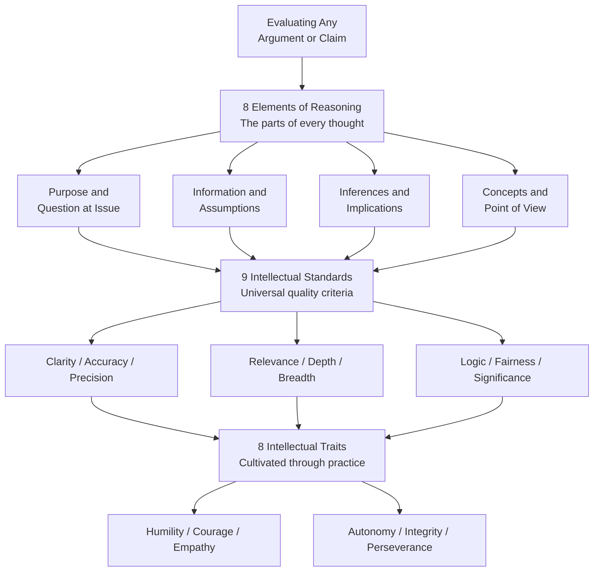

# Critical Thinking Frameworks

> [!abstract] TL;DR
> Critical thinking is reasonable, reflective thinking aimed at deciding what to believe or do (Ennis, 1985). Multiple frameworks operationalise this capacity: Paul and Elder's three-circle model ties elements of reasoning to universal intellectual standards and cultivated virtues; Bloom's revised taxonomy positions analysis, evaluation, and creation as the highest cognitive levels; Facione's Delphi consensus names six core skills and matching dispositions; and Kahneman's dual-process theory explains the cognitive substrate — critical thinking is the deliberate engagement of slow, systematic System 2 reasoning over fast, bias-prone System 1 intuition.

---

## Intuition

**Analogy:** Imagine a courtroom trial. The judge, lawyers, witnesses, and jury each play a different role in a structured process aimed at reaching a justified verdict. The defense and prosecution must make their claims clear (clarity), support them with verified facts (accuracy), address the precise charge rather than tangential matters (relevance), dig into root causes and context (depth), consider alternative explanations (breadth), reason without contradiction (logic), and treat all parties by the same evidentiary standards (fairness). A good trial is not just one that reaches a correct verdict — it is one whose *process of reasoning* is itself sound.

Critical thinking frameworks are the written rulebooks that define what a good trial looks like — applied not to courts but to every claim, argument, decision, or plan we encounter.

---

## How It Works

### Core Mechanics

#### 1. Ennis's Definition — the Normative Anchor

Robert Ennis (1985) defined critical thinking as *"reasonable reflective thinking focused on deciding what to believe or do."* Three words carry most of the weight:

- **Reasonable** — not just any thinking, but thinking that meets evaluable standards
- **Reflective** — the thinker monitors and adjusts their own reasoning process
- **Deciding** — CT is ultimately practical; it aims at justified action or belief

#### 2. Paul and Elder's Three-Circle Model — the Structural Framework

Richard Paul and Linda Elder (Foundation for Critical Thinking) articulate three interlocking components. Each must be present for thinking to be genuinely critical.

**Circle 1 — Elements of Reasoning (the "parts" of thought):**
Every act of reasoning has eight structural elements. Skilled thinkers identify all of them in any argument or decision:

| Element | The question it answers |
|---|---|
| Purpose | What is the goal or objective? |
| Question at Issue | What problem or question is being addressed? |
| Information | What evidence, data, or experience is being used? |
| Concepts | What ideas or frameworks are being employed? |
| Assumptions | What is being taken for granted without proof? |
| Inferences / Interpretations | What conclusions are being drawn from the information? |
| Implications / Consequences | If true, what follows? What are the logical results? |
| Point of View | From what perspective is the reasoning conducted? |

**Circle 2 — Intellectual Standards (the quality criteria):**
Each element is assessed against nine universal standards. Poor thinking fails at least one of them:

- **Clarity** — Could you elaborate or illustrate? Lack of clarity undermines all other standards.
- **Accuracy** — Is this actually true? Can it be checked?
- **Precision** — How specific? Vague claims evade evaluation.
- **Relevance** — Does this bear on the question? Irrelevant premises distract.
- **Depth** — Does the reasoning address complexity and root causes, or only the surface?
- **Breadth** — Has the reasoning considered all relevant viewpoints and stakeholder effects?
- **Logic** — Does the conclusion follow from the premises? Are the inferences consistent?
- **Fairness** — Is the reasoning free of self-serving distortion? Are opposing views treated symmetrically?
- **Significance** — Are the most important considerations being emphasized, not trivial ones?

**Circle 3 — Intellectual Traits / Virtues (the dispositions):**
Sustained critical thinking requires cultivated character, not just technique. Paul and Elder identify eight intellectual virtues: humility (recognising the limits of one's knowledge), courage (pursuing truth even when threatening), empathy (reasoning genuinely from other perspectives), autonomy (thinking for oneself rather than by convention), integrity (holding oneself to the same standards as others), perseverance (working through difficult problems), confidence in reason (trusting evidence over authority or emotion), and fair-mindedness (applying standards consistently across in-groups and out-groups).

The **SEEC** shorthand captures the operating loop: apply **S**tandards to **E**lements to produce **E**valuations that, with **C**onsistency, develop intellectual traits.

---

#### 3. Bloom's Revised Taxonomy — the Learning Hierarchy

Anderson and Krathwohl (2001) revised Bloom's original 1956 taxonomy into six cognitive levels, now expressed as action verbs:

| Level | Cognitive Operation | CT relevance |
|---|---|---|
| **Remember** | Recognise, recall facts | Foundation only |
| **Understand** | Interpret, classify, explain | Necessary but not sufficient |
| **Apply** | Execute, implement, use | Applying rules to new cases |
| **Analyze** | Differentiate, organise, attribute | Identifying assumptions, structure |
| **Evaluate** | Check, critique, judge | Assessing argument quality |
| **Create** | Generate, plan, produce synthesis | Constructing new justified positions |

Critical thinking is concentrated in the top three levels. Memorising a framework is not CT — using it to critique and reconstruct an argument is.

---

#### 4. Facione's Expert Consensus — the Delphi Definition

In 1990, Peter Facione led a two-year Delphi study of 46 CT experts under APA sponsorship. The consensus definition of an "ideal critical thinker" identified:

**Six core cognitive skills:**
Interpretation, Analysis, Evaluation, Inference, Explanation, Self-Regulation

**Seven core affective dispositions:**
Truth-seeking (following the evidence wherever it leads), open-mindedness (tolerating divergent views), analyticity (applying reason to all problems), systematicity (organising inquiry), CT self-confidence (trusting one's own reasoned judgments), inquisitiveness (intellectual curiosity), and cognitive maturity (understanding that good decisions are possible even under uncertainty).

The Facione model established that CT is *both* a skill (trainable, assessable) *and* a disposition (attitudinal, characterological) — neither alone is sufficient.

---

#### 5. Watson-Glaser Critical Thinking Appraisal — the Five-Component Assessment

Watson and Glaser's WGCTA (1980, revised 2012) remains one of the most widely used CT assessments in professional and educational settings. It operationalises CT as five measurable abilities:

1. **Inference** — drawing probabilistic conclusions from stated facts
2. **Recognition of Assumptions** — identifying unstated premises embedded in a claim
3. **Deduction** — determining whether conclusions necessarily follow from premises
4. **Interpretation** — weighing evidence to decide whether it justifies a conclusion beyond reasonable doubt
5. **Evaluation of Arguments** — distinguishing arguments that are strong and directly relevant from those that are weak or tangential

---

#### 6. RED Model — the Applied Three-Step

Pearson's RED model distils CT assessment into three practitioner-facing steps:

- **R — Recognize Assumptions:** What is being taken for granted that has not been proven?
- **E — Evaluate Arguments:** Does the evidence genuinely support the conclusion? Is the argument free of fallacies?
- **D — Draw Conclusions:** Given the evidence and structure of the argument, what is the most justified conclusion?

The RED model is widely used in corporate talent assessment and MBA admissions precisely because it is teachable in a short time and maps directly to business decision-making.

---

#### 7. Dual Process Theory — the Cognitive Mechanism

Kahneman (2011), building on Tversky and Kahneman's decades of work, identifies two systems of cognition that underpin all reasoning:

| | System 1 | System 2 |
|---|---|---|
| Speed | Fast, automatic | Slow, effortful |
| Processing | Parallel, associative | Sequential, rule-based |
| Effort | Low | High |
| Error type | Systematic biases | Errors of neglect |
| Relation to CT | Source of cognitive biases CT must correct | The deliberate reasoning CT develops |

Critical thinking is, at its core, the principled engagement of System 2 — not its replacement of System 1, but its structured oversight of it. Metacognition is the monitoring layer: the awareness of when System 1 is driving and System 2 should intervene.

---

#### 8. Metacognition — Thinking About Thinking

Flavell (1979) coined the term to describe knowledge about and regulation of one's own cognitive processes. For critical thinking, two components matter:

- **Metacognitive knowledge** — knowing which reasoning strategies work in which contexts, and knowing the limits of one's own expertise
- **Metacognitive regulation** — actively planning, monitoring, and evaluating one's reasoning during a task (not just after)

Metacognition is the mechanism by which practice improves CT: a thinker who monitors their reasoning in real time can catch and correct errors that a non-monitoring thinker will never notice.

---

#### 9. Dialectical Thinking — Embracing Productive Tension

Basseches (1984) and Riegel's (1973) post-formal reasoning model describe *dialectical thinking* as the capacity to hold contradictory or opposing views simultaneously and integrate them at a higher level of understanding, rather than forcing a premature resolution. This is especially important in complex social and ethical reasoning where "the truth" genuinely involves irreducible tensions (e.g., freedom vs. security, efficiency vs. fairness).

Dialectical thinkers ask: *In what context is each view correct? What is the synthesis that honours the truth in each?*

---

#### 10. The Generalist vs. Subject-Specific Debate

A persistent disagreement in CT education concerns whether CT skills transfer across domains:

- **McPeck (1981):** There are no general CT skills — all thinking is thinking *within* a domain. You can only think critically about chemistry or history, not "in general." Teaching a "generic" CT course is incoherent.
- **Siegel (1988):** CT has a domain-general "critical spirit" — a disposition to seek reasons and assess them rigorously — which is independent of subject matter. The spirit transfers; some techniques are domain-specific.
- **Ennis (1989):** A pragmatic middle: some CT skills *are* general (evaluating source credibility, identifying logical form, recognising ad hominem), while others require domain knowledge (evaluating a statistical claim in medicine requires statistical training). Both components must be taught.

The empirical evidence (Willingham, 2007) supports a modified McPeck position: CT skills acquired in one domain do not automatically transfer to others without explicit bridging instruction. Domain knowledge is not optional — it is the raw material from which good judgment is made.

---

### Flow / Architecture



---

## Key Concepts

### Secondary

- **Critical thinking (Ennis)** — Reasonable, reflective thinking aimed at deciding what to believe or do; distinguished from mere opinion or rote recall.
- **Elements of reasoning** — Paul and Elder's eight structural parts present in every act of thinking: purpose, question, information, assumptions, concepts, inferences, implications, point of view.
- **Intellectual standards** — The nine universal criteria (clarity, accuracy, precision, relevance, depth, breadth, logic, fairness, significance) used to evaluate the quality of thinking.
- **Bloom's Taxonomy** — A six-level hierarchy of cognitive operations: Remember, Understand, Apply, Analyze, Evaluate, Create. CT lives in the top three.
- **Metacognition** — Thinking about one's own thinking; the capacity to monitor and regulate reasoning in real time.
- **System 1 / System 2** — Kahneman's two cognitive modes: fast-automatic vs. slow-deliberate. CT is the structured exercise of System 2.

### Undergraduate

- **Paul and Elder's three-circle model** — Elements of Reasoning (what), Intellectual Standards (how well), and Intellectual Traits (who) form an integrated framework for both assessing and developing thinking.
- **Facione's Delphi Report (1990)** — APA-sponsored expert consensus defining CT as six cognitive skills (interpretation, analysis, evaluation, inference, explanation, self-regulation) plus seven affective dispositions.
- **Watson-Glaser WGCTA** — The five-component psychometric assessment: inference, recognition of assumptions, deduction, interpretation, and evaluation of arguments.
- **RED model** — Recognize Assumptions, Evaluate Arguments, Draw Conclusions. A practitioner-facing three-step applied in professional and business CT assessment.
- **Dispositions of good critical thinkers** — Both Facione and Paul/Elder emphasise that CT is as much dispositional (truth-seeking, open-minded, intellectually courageous) as it is skill-based.
- **Dialectical thinking** — Post-formal reasoning capacity to integrate contradictory positions rather than forcing premature resolution; essential for complex ethical and strategic problems.
- **SEEC loop** — Standards → Elements → Evaluations → Consistency; the operating loop in Paul and Elder's framework.

### Graduate

- **McPeck-Siegel-Ennis debate** — Whether general CT skills exist and can be taught independently of subject domains. McPeck's subject-specificity thesis vs. Siegel's critical-spirit thesis vs. Ennis's pragmatic middle position. Transfer research (Willingham, 2007) broadly supports a mixed model.
- **Metacognitive regulation** — Planning, monitoring, and evaluating reasoning strategies during a task. Distinguished from metacognitive knowledge (knowing *about* strategies) by its real-time, corrective character.
- **Background knowledge and CT** — Domain knowledge is not merely helpful for CT; it is the substrate on which CT operates. Experts reason better within their domains not because of superior logic skills but because of richer, more accurate domain-specific mental models.
- **Epistemic self-monitoring** — The graduate-level application of metacognition: tracking the reliability of one's own belief-formation processes, identifying domains where self-trust is and is not warranted.
- **Transfer problem** — The central challenge in CT education: skills trained in one context rarely transfer spontaneously. Deliberate bridging instruction (making the abstract principles explicit and practising them across contexts) is required.

---

## Python Demo

```python
import numpy as np
import matplotlib.pyplot as plt

# Paul and Elder's 8 Intellectual Standards assessment rubric
# Scores on 1-10 scale; weighted scoring matrix via numpy

standards = [
    "Clarity", "Accuracy", "Precision",
    "Relevance", "Depth", "Breadth",
    "Logic", "Fairness"
]

# Weights assigned to each standard (sum to 1.0)
# Logic and Accuracy carry higher weight in this rubric
weights = np.array([0.10, 0.15, 0.10, 0.12, 0.13, 0.10, 0.15, 0.15])

# Two sample arguments scored 1-10 on each standard
# Argument A: a peer-reviewed scientific claim about vaccine efficacy
scores_a = np.array([8.0, 9.0, 8.5, 9.0, 7.5, 7.0, 9.0, 8.0])
# Argument B: a political speech advocating the same conclusion
scores_b = np.array([7.0, 5.0, 4.5, 6.0, 5.0, 6.5, 5.5, 4.0])

# Weighted element-wise scores
weighted_a = scores_a * weights
weighted_b = scores_b * weights
total_a = float(np.sum(weighted_a))
total_b = float(np.sum(weighted_b))

# Print assessment table
print("Paul and Elder Intellectual Standards Assessment")
print("=" * 60)
header = f"{'Standard':<12} {'Weight':>8} {'Sci Arg':>8} {'Pol Arg':>8} {'Wt-A':>8} {'Wt-B':>8}"
print(header)
print("-" * 60)
for i, s in enumerate(standards):
    print(
        f"{s:<12} {weights[i]:>8.2f} "
        f"{scores_a[i]:>8.1f} {scores_b[i]:>8.1f} "
        f"{weighted_a[i]:>8.3f} {weighted_b[i]:>8.3f}"
    )
print("-" * 60)
print(f"{'TOTAL':<12} {'1.00':>8} {'':>8} {'':>8} {total_a:>8.3f} {total_b:>8.3f}")
print(f"\nScientific Claim:  {total_a:.3f} / 10.0")
print(f"Political Speech:  {total_b:.3f} / 10.0")

# Radar / spider chart
N = len(standards)
angles = np.linspace(0, 2 * np.pi, N, endpoint=False).tolist()
angles += angles[:1]  # close the polygon

scores_a_plot = scores_a.tolist() + [scores_a[0]]
scores_b_plot = scores_b.tolist() + [scores_b[0]]

fig, ax = plt.subplots(figsize=(7, 7), subplot_kw={"polar": True})
ax.set_theta_offset(np.pi / 2)
ax.set_theta_direction(-1)

ax.plot(angles, scores_a_plot, "o-", linewidth=2, color="#2563eb",
        label=f"Scientific Claim  {total_a:.2f}/10")
ax.fill(angles, scores_a_plot, alpha=0.20, color="#2563eb")

ax.plot(angles, scores_b_plot, "o-", linewidth=2, color="#dc2626",
        label=f"Political Speech  {total_b:.2f}/10")
ax.fill(angles, scores_b_plot, alpha=0.20, color="#dc2626")

ax.set_xticks(angles[:-1])
ax.set_xticklabels(standards, size=11)
ax.set_ylim(0, 10)
ax.set_yticks([2, 4, 6, 8, 10])
ax.set_yticklabels(["2", "4", "6", "8", "10"], size=9)
ax.set_title("Paul and Elder: Intellectual Standards Radar\n", size=13, pad=20)
ax.legend(loc="upper right", bbox_to_anchor=(1.40, 1.10))

plt.tight_layout()
plt.savefig("ct_standards_radar.png", dpi=120, bbox_inches="tight")
plt.show()
print("\nSaved to ct_standards_radar.png")
```

**What this demonstrates:** The weighted scoring matrix reveals that the political speech loses most ground on Accuracy (5.0 vs 9.0) and Fairness (4.0 vs 8.0) — exactly the standards political rhetoric most often sacrifices. The radar chart makes the profile of failure immediately visible: a collapsed interior on those axes.

---

## Real-World Applications

1. **Clinical medicine — diagnostic reasoning:** The Watson-Glaser components map directly onto clinical practice. Inference from symptoms, recognition of assumptions embedded in a referral letter, deduction of what the evidence does and does not support, and evaluation of a proposed treatment's evidence base are all CT operations. Paul and Elder's standard of *depth* corresponds to differential diagnosis; *breadth* to multi-system consideration.

2. **Intelligence analysis — structured analytic techniques (SATs):** The US intelligence community's *Tradecraft Primer* (2009) formalises CT through structured techniques — Analysis of Competing Hypotheses, Red Team Analysis, Devil's Advocacy — that directly implement Paul and Elder's intellectual standards of breadth, fairness, and accuracy. The goal is to counteract System 1 anchoring on the first plausible hypothesis.

3. **Legal argumentation:** The WGCTA's five components describe exactly what a skilled lawyer does: infers from evidence, recognises opposing counsel's unstated assumptions, tests whether their conclusion deductively follows, interprets ambiguous statutes, and evaluates the relative strength of arguments. The Paul and Elder standard of *precision* is the standard of specificity lawyers apply to every contractual term.

4. **Education — Bloom's taxonomy in curriculum design:** Bloom's revised taxonomy is the dominant framework for writing learning objectives. An objective framed as "students will recall the steps of photosynthesis" (Remember) is categorically different from "students will evaluate a proposed metabolic pathway for internal consistency" (Evaluate). CT-focused curricula deliberately weight outcomes at the Analyze/Evaluate/Create levels.

5. **Business strategy and consulting:** McKinsey, BCG, and Deloitte use structured problem-solving frameworks (issue trees, MECE decomposition) that are applied embodiments of the RED model: surface assumptions underlying the client's problem definition, evaluate each hypothesis against available data, draw conclusions that are supported rather than merely consistent with the evidence. The "pyramid principle" (Minto) operationalises clarity and logic at the communication level.

---

## Common Pitfalls

- **Equating criticism with critical thinking** — Critical thinking is not contrarianism or fault-finding. Paul and Elder's standard of *fair-mindedness* requires applying the same rigour to arguments you agree with as to those you oppose. A systematic critic who only scrutinises opposing views is not a critical thinker — they are a motivated reasoner.

- **Confusing process with product** — Following a CT framework (naming all eight elements, checking all nine standards) is not a guarantee of a correct conclusion. CT is a quality-control process, not an oracle. Bad inputs (false premises, missing data) will still yield bad outputs even through a sound process.

- **Neglecting domain knowledge** — The transfer research clearly shows that general CT skills applied to an unfamiliar domain produce worse outcomes than expert intuition in that domain. A critical thinking course is not a substitute for subject-matter expertise; it is what makes expertise reliable.

- **Applying standards unevenly (myside bias)** — The most common real-world CT failure is not ignorance of standards but selective application. Thinkers apply depth and accuracy demands to positions they dislike and accept cursory logic from positions they favour. Intellectual integrity — applying standards symmetrically — is both the hardest and most important intellectual virtue.

- **Treating metacognition as a post-hoc activity** — The power of metacognitive regulation lies in *in-process* monitoring: catching a reasoning error as it forms, not in retrospect. Thinkers who only review their conclusions after reaching them miss the corrective moment.

- **Overlooking the dispositional component** — Many CT courses teach skills (identify assumptions, evaluate arguments) while neglecting dispositions (intellectual humility, truth-seeking). A skilled arguer with poor dispositions is more dangerous, not less — they can construct compelling defences of motivated conclusions.

---

## Related Concepts

- [[Logic_and_Critical_Thinking_Overview]] — The foundations of formal and informal logic that CT frameworks apply; deductive validity and soundness are the baseline standards CT builds upon.
- [[Arguments_Validity_and_Soundness]] — Paul and Elder's intellectual standards of logic and accuracy map directly onto the formal notions of validity and soundness defined here.
- [[Cognitive_Biases]] — The empirical catalogue of systematic System 1 errors that CT frameworks are designed to identify and counteract; dual process theory links both topics.
- [[Problem_Solving_and_Decision_Making]] — Dual process theory (System 1/System 2) is treated from a cognitive psychology perspective here; CT frameworks are the normative prescription for what System 2 reasoning should look like.
- [[Bayesian_Reasoning]] — The mathematical framework underlying CT's standard of *accuracy* in probabilistic claims; recognising base rate neglect is a Facione core skill applied via Bayes.
- [[Inductive_Logic]] — CT's standard of *depth* and evaluation of evidence quality connect directly to the logical structure of inductive generalisation studied here.
- [[Analogical_Reasoning]] — Analogical arguments are a primary vehicle for the CT element of *point of view* and require the standards of relevance and precision to evaluate properly.
- [[Argumentation_Theory_and_Dialectic]] — Toulmin's model of argument structure, pragma-dialectics, and Dung's attack frameworks formalise the elements and standards of Paul and Elder's framework at a higher level of abstraction.

---

## Review Questions

### Secondary

1. Paul and Elder list nine intellectual standards. Choose any three, define them in your own words, and give a concrete example of an argument or claim that fails each one you chose.
2. How does Bloom's revised taxonomy distinguish "understanding" from "analyzing"? Why does a student who can recite the steps of the scientific method not thereby demonstrate critical thinking?
3. What is metacognition, and why is it important for critical thinking? Give an example of a metacognitive action a person might take while writing an essay.

### Undergraduate

1. Apply Paul and Elder's eight elements of reasoning to the following claim: *"Remote work increases productivity because employees report higher job satisfaction."* Identify at least two questionable assumptions and two missing elements, then explain which intellectual standard each failure violates.
2. Facione's Delphi Report distinguishes CT *skills* from CT *dispositions*. Why is the dispositional component necessary — why are skills alone insufficient? Use the concept of myside bias in your answer.
3. The Watson-Glaser appraisal includes "recognition of assumptions" as a component separate from "deduction." What is the difference between an unstated assumption and a logical inference? Give a medical diagnosis example where conflating the two leads to clinical error.

### Graduate

1. McPeck argued that critical thinking is always domain-specific and that general CT courses are therefore incoherent. Evaluate this argument using Willingham's transfer research findings. Under what pedagogical conditions, if any, can CT skills generalise across domains?
2. Kahneman's dual process model implies that System 2 reasoning is the cognitive basis for critical thinking. But System 2 can also be used to rationalise System 1 conclusions after the fact. How do Paul and Elder's intellectual standards, particularly *fair-mindedness* and *accuracy*, function as checks on this post-hoc rationalisation? What institutional or procedural mechanisms can substitute when individual discipline fails?
3. Compare Paul and Elder's framework with Facione's Delphi consensus on three dimensions: the role of dispositions, the treatment of self-regulation, and the status of domain knowledge. Which framework better supports the design of an organisational training programme for senior analysts, and why?

---

## Sources

- [Ennis, R. H. (1985). "A logical basis for measuring critical thinking skills." *Educational Leadership*, 43(2), 44–48](https://www.ascd.org/el/articles/a-logical-basis-for-measuring-critical-thinking-skills)
- [Paul, R. and Elder, L. (2020). *Critical Thinking: Tools for Taking Charge of Your Learning and Your Life*, 4th ed. Pearson](https://www.criticalthinking.org/pages/books-by-dr-richard-paul/1291)
- [Facione, P. A. (1990). *Critical Thinking: A Statement of Expert Consensus for Purposes of Educational Assessment and Instruction — The Delphi Report*. California Academic Press](https://www.insightassessment.com/article/the-delphi-report-and-critical-thinking)
- [Kahneman, D. (2011). *Thinking, Fast and Slow*. Farrar, Straus and Giroux](https://us.macmillan.com/books/9780374533557/thinkingfastandslow)
- [Willingham, D. T. (2007). "Critical thinking: Why is it so hard to teach?" *American Educator*, 31(2), 8–19](https://www.aft.org/ae/summer2007/willingham)

---

#critical-thinking #frameworks #reasoning #problem-solving #metacognition
