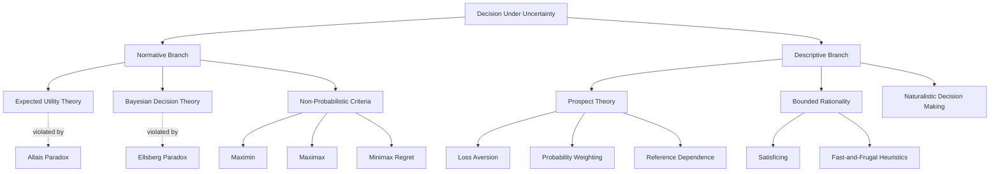

# Decision Making Under Uncertainty

> [!abstract] TL;DR
> Decision making under uncertainty is the study of how agents should (normatively) and actually do (descriptively) choose among options whose outcomes are not known in advance. Expected utility theory provides the rational benchmark — maximize the probability-weighted sum of outcome utilities — but decades of empirical work, from Allais and Ellsberg to Kahneman and Tversky, show that real humans systematically deviate from it by overweighting losses, distorting small probabilities, and anchoring judgments to arbitrary reference points. Understanding both the normative ideal and its empirical failures is prerequisite to sound individual and organizational decisions.

---

## Intuition

**Analogy:** Imagine you are a ship navigator in dense fog. You cannot see the rocks, but you still have to choose a heading right now. One strategy is to calculate the probability of each heading leading to disaster, multiply by the severity of each outcome, and pick the heading with the highest expected survival value — a clean, rational algorithm. But real navigators, especially experienced ones, do something messier and often wiser: they weight certain catastrophes far more heavily than a probability calculus would suggest, they anchor to a safe channel they remember from a previous voyage, and they will refuse an "expected-value positive" shortcut through a channel they know nothing about, preferring the slower route where risk is quantified. The normative navigator is the formal theory. The real navigator is the subject of behavioral economics. Decision science asks: when do the two diverge, why, and what should we do about it?

The fog is uncertainty. The heading is your act. The rocks are outcomes you cannot see. The question — what is the rational heading? — has absorbed philosophers, economists, and cognitive scientists for over a century.

---

## How It Works

### The Decision Matrix

Every decision under uncertainty has four components:

1. **Acts** — the options available to the decision maker.
2. **States of the world** — mutually exclusive scenarios that determine which outcome an act produces. The decision maker does not control which state obtains.
3. **Outcomes** — the consequence of each act in each state.
4. **Utilities** — a numerical measure of how much the decision maker values each outcome.

| | State S1 | State S2 | State S3 |
|---|---|---|---|
| **Act A1** | outcome O11 | outcome O12 | outcome O13 |
| **Act A2** | outcome O21 | outcome O22 | outcome O23 |

When probabilities are assigned to states, the problem becomes a **decision under risk**. When no probabilities are known, it is a **decision under strict uncertainty** (Knightian uncertainty). Expected utility theory handles risk; non-probabilistic criteria (maximin, maximax, minimax regret) handle strict uncertainty; Bayesian decision theory bridges both by requiring probabilities to always be assigned as subjective credences.

---

### Expected Utility Theory

Von Neumann and Morgenstern (1944) showed that any agent whose preferences satisfy four axioms can be represented as if they are maximizing expected utility:

1. **Completeness** — the agent can rank any two options.
2. **Transitivity** — if A is preferred to B and B to C, then A is preferred to C.
3. **Continuity** — for any three outcomes, there is a probability mix of the best and worst that is equally preferred to the middle.
4. **Independence** — substituting an identical mixture into both sides of a preference does not reverse it. Formally: if A is preferred to B, then the lottery "p chance of A plus 1-p chance of C" is preferred to "p chance of B plus 1-p chance of C" for all C and p.

Given these axioms, the EU of a lottery L with outcomes x_i and probabilities p_i is:

**EU(L) = Σ p_i · u(x_i)**

The shape of u determines risk attitude:
- **Concave u** → risk-averse (prefers a certain $50 to a 50/50 chance of $0 or $100)
- **Linear u** → risk-neutral (indifferent between certain and uncertain versions of same expectation)
- **Convex u** → risk-seeking

### Savage's Sure-Thing Principle

Leonard Savage extended EU theory to decisions under strict uncertainty using **subjective expected utility (SEU)**: even if objective probabilities are unknown, a rational agent should act as if maximizing expected utility under some coherent personal probability distribution. The **sure-thing principle** states: if you prefer act A to act B regardless of which state obtains, you should prefer A to B overall. Violations of this principle signal incoherence.

### Allais Paradox — Violation of Independence

Maurice Allais (1953) showed that real preferences violate the independence axiom. Presented with:

- **Choice 1:** Option A: $1 million for certain vs. Option B: 89% chance of $1M, 10% chance of $5M, 1% chance of $0
- **Choice 2:** Option C: 11% chance of $1M, 89% chance of $0 vs. Option D: 10% chance of $5M, 90% chance of $0

Most people choose A over B and D over C — but this violates expected utility theory's independence axiom. The certainty of $1M in Choice 1 carries a psychological premium not explained by probability calculus. The sure outcome receives excess weight beyond its probability value.

### Ellsberg Paradox — Ambiguity Aversion

Daniel Ellsberg (1961) demonstrated that people violate SEU when facing **ambiguity** — unknown probabilities. Given an urn containing 30 red balls and 60 balls that are either black or yellow (in unknown proportion):

- People prefer "bet on red" over "bet on black" (30 known reds vs. unknown blacks)
- But also prefer "bet on black or yellow" over "bet on red or yellow"

These preferences are inconsistent under any probability assignment to black/yellow, revealing that people treat known-probability risk differently from unknown-probability ambiguity. Ellsberg called this **ambiguity aversion** or, following Knight, the distinction between **risk** and **uncertainty**.

### Prospect Theory

Kahneman and Tversky (1979, 1992) built a descriptive theory accounting for systematic EU violations. It has three components:

**1. Reference Dependence** — utility is evaluated relative to a reference point (usually the status quo), not as absolute wealth levels.

**2. Loss Aversion** — losses loom larger than equivalent gains. The pain of losing $100 exceeds the pleasure of gaining $100 by approximately a factor of 2 to 2.5. Formally, the slope of the value function is steeper for losses than gains.

**3. Probability Weighting** — people replace objective probabilities with decision weights that overweight small probabilities and underweight moderate-to-high probabilities. This explains why people simultaneously buy lottery tickets (low probability of large gain, overweighted) and insurance (low probability of large loss, overweighted).

The Prospect Theory value of a two-outcome lottery is:

**V(L) = w(p) · v(gain) + w(1−p) · v(loss)**

where v(x) = x^α for gains, v(x) = −λ(−x)^β for losses, and w(p) is the nonlinear weighting function.

**4. Framing Effects** — how options are described (as gains or losses) changes choices even when outcomes are mathematically identical. The Asian disease problem is the canonical demonstration.

### Non-Probabilistic Criteria

When probabilities are entirely unknown, decision makers use heuristic criteria that make no probability assumptions:

- **Maximin (Wald criterion)** — choose the act whose worst-case outcome is best. Conservative; prioritizes avoiding catastrophe over expected performance.
- **Maximax** — choose the act whose best-case outcome is best. Optimistic; ignores downside risk entirely.
- **Minimax Regret (Savage criterion)** — construct a regret matrix (how much worse each outcome is than the best possible outcome in that state) and minimize maximum regret. Captures opportunity cost.

### Bounded Rationality and Satisficing

Herbert Simon (1955) observed that real decision makers operate under cognitive limits, time pressure, and incomplete information. Rather than optimizing, they **satisfice**: they search through options until they find one that meets a minimum aspiration threshold, then stop. Satisficing is not a failure of rationality — it is rational given the real costs of search and the impossibility of examining all alternatives.

### Fast-and-Frugal Heuristics

Gerd Gigerenzer and colleagues showed that simple heuristics — using minimal information and few cognitive steps — often outperform complex optimization strategies, especially in uncertain environments. Examples:

- **Take-the-Best** — rank cues by validity, use the single most valid cue that distinguishes between options, ignore the rest.
- **Recognition heuristic** — if one option is recognized and the other is not, infer the recognized option is superior on the criterion.

These heuristics exploit environmental structure rather than fighting uncertainty with computation. They are "ecologically rational" even when not formally optimal.

### Naturalistic Decision Making

Gary Klein's Recognition-Primed Decision model (1993) describes how experts actually decide in high-stakes, time-pressured situations: they do not compare options simultaneously. They retrieve a prototype from memory, mentally simulate it to check for problems, adjust or replace it if problems arise, and act. Option comparison is rare and often impractical in real operational contexts such as firefighting, surgery, and military command.

### Bayesian Decision Theory

Bayesian decision theory combines Bayesian probability with utility theory: maintain a prior over states of the world, update on evidence, and choose the act that maximizes posterior expected utility. It provides a normative foundation that handles both risk and uncertainty by requiring subjective probabilities everywhere. The Bayes-optimal decision rule is: act on the posterior that results from applying Bayes' theorem to all available evidence.

### Pascal's Mugging and Moral Uncertainty

**Pascal's mugging** (named by Nick Bostrom) is a decision-theoretic edge case: a stranger offers to return an astronomically large payoff if given a small amount, with a very small but non-zero probability. Under naive EU theory, sufficiently large stakes force acceptance of any positive-probability event, no matter how implausible. This reveals a tension between expected utility theory and intuitive reasonable-person standards. Proposed responses include probability floors, utility functions that do not grow without bound, and credence penalization for claims requiring complex justification.

**Moral uncertainty** — uncertainty about which ethical theory is correct — creates analogous decision problems. One should often choose acts that perform reasonably under multiple moral frameworks rather than maximizing under a single theory held with incomplete confidence.

### Multi-Criteria Decision Analysis

Real decisions often involve incommensurable objectives — cost, safety, environmental impact, equity. Multi-Criteria Decision Analysis (MCDA) frameworks such as TOPSIS, AHP, and ELECTRE construct formal weighted comparisons across criteria. The challenge is that preference weights are themselves uncertain and value-laden.

---

### Framework Landscape



---

## Key Concepts

### Secondary Level

- **Expected value** — the probability-weighted average of possible outcomes. Forms the baseline against which all decision theories are measured.
- **Risk aversion** — preference for a certain outcome over a gamble with equal expected value.
- **Maximin rule** — choose the act with the best worst-case outcome. The strategy of pessimistic safety-first reasoning.
- **Decision matrix** — a table of acts, states, and outcomes that makes the structure of a choice explicit and auditable.
- **Framing effect** — identical options presented as gains vs. losses yield different choices, violating rational invariance.

### Undergraduate Level

- **Von Neumann-Morgenstern expected utility** — EU theory requires four axioms; utility functions are ordinal representations of preference over lotteries.
- **Loss aversion** — Kahneman and Tversky's finding that losses are felt approximately 2 to 2.5 times more intensely than equivalent gains.
- **Probability weighting** — the PT insight that people replace objective probabilities with decision weights, inflating small probabilities and deflating moderate ones.
- **Satisficing vs. optimizing** — Simon's distinction between finding an acceptable solution and finding the best possible one; the former is often more adaptive under real constraints.
- **Ambiguity aversion** — the Ellsberg finding that people avoid choices with unknown probabilities even when expected value is equal to known-probability alternatives.

### Graduate Level

- **VNM independence axiom** — the axiom violated by the Allais paradox; its normative status remains contested, since it implies agents should be indifferent about certainty premiums.
- **Savage's SEU and the sure-thing principle** — subjective expected utility extends EU to strict uncertainty via personal probabilities; the sure-thing principle is the corresponding coherence constraint.
- **Prelec probability weighting function** — the psychophysically-motivated weighting function w(p) = exp(−(−ln p)^γ) that generalizes KT's original form and satisfies compound invariance.
- **Reference point dynamics** — in PT, the reference point shifts with context, adaptation level, and framing. Choice of reference point is itself a decision problem that the theory leaves underspecified.
- **Robust decision making** — formal framework for choosing strategies that perform well across a wide range of scenarios rather than maximizing for a single probability distribution.
- **Pascal's mugging and fanaticism** — normative EU is vulnerable to domination by arbitrarily low-probability high-stakes events; proposals to address this (utility boundedness, probability floors) each carry costs for the theory's completeness.

---

## Python Demo

```python
import numpy as np
import matplotlib.pyplot as plt

# ── Prospect Theory parameters (Tversky and Kahneman 1992) ───────────────────
ALPHA  = 0.88   # sensitivity exponent for gains
BETA   = 0.88   # sensitivity exponent for losses
LAMBDA = 2.25   # loss aversion multiplier
GAMMA  = 0.65   # probability weighting curvature parameter


def eu_utility(x):
    """Expected Utility: risk-neutral linear value function."""
    return x.astype(float)


def pt_value(x):
    """Prospect Theory S-shaped value function centred on reference point 0.
    Concave over gains (diminishing sensitivity), convex over losses,
    steeper for losses by factor LAMBDA (loss aversion).
    """
    return np.where(x >= 0,
                    x ** ALPHA,
                    -LAMBDA * (-x) ** BETA)


def pt_weight(p):
    """Tversky-Kahneman probability weighting function.
    Overweights small probabilities, underweights moderate-to-high ones.
    Clipped for numerical stability near 0 and 1.
    """
    p = np.clip(p, 1e-9, 1 - 1e-9)
    return p ** GAMMA / (p ** GAMMA + (1 - p) ** GAMMA) ** (1.0 / GAMMA)


# ── Lotteries: (p_win, gain, loss_if_not_winning) ────────────────────────────
# Eight two-outcome lotteries spanning a range of probability and stake levels.
lotteries = [
    (0.01,  5000,     0),   # L1 — rare jackpot, low probability high stakes
    (0.05,   500,     0),   # L2 — small rare gain
    (0.10,   200,     0),   # L3 — modest gain moderate probability
    (0.50,   100,   -50),   # L4 — classic 50-50 gamble
    (0.90,    50,   -10),   # L5 — likely gain small downside
    (0.99,    20,    -5),   # L6 — near-certain small gain
    (0.01,     0, -5000),   # L7 — rare catastrophe low probability
    (0.05,     0,  -500),   # L8 — small rare loss
]
labels = [f"L{i+1}" for i in range(len(lotteries))]


def compute_eu(p, gain, loss):
    """Risk-neutral expected utility (linear)."""
    gain_arr = np.array([gain], dtype=float)
    loss_arr = np.array([loss], dtype=float)
    return float(p * eu_utility(gain_arr) + (1 - p) * eu_utility(loss_arr))


def compute_pt(p, gain, loss):
    """Prospect theory subjective value with probability weighting."""
    w_p   = float(pt_weight(np.array([p])))
    w_1mp = float(pt_weight(np.array([1 - p])))
    return float(w_p * pt_value(np.array([gain])) + w_1mp * pt_value(np.array([loss])))


eu_vals = [compute_eu(p, g, lo) for p, g, lo in lotteries]
pt_vals = [compute_pt(p, g, lo) for p, g, lo in lotteries]

# ── Visualization ─────────────────────────────────────────────────────────────
fig, axes = plt.subplots(1, 3, figsize=(17, 5))
fig.suptitle("Expected Utility Theory vs Prospect Theory", fontsize=14, fontweight="bold")

# Panel 1 — Value functions
x_range = np.linspace(-300, 300, 600)
axes[0].plot(x_range, eu_utility(x_range),  color="steelblue", lw=2, label="EU: linear")
axes[0].plot(x_range, pt_value(x_range),    color="crimson",   lw=2, label="PT: S-curve")
axes[0].axhline(0, color="grey", lw=0.6)
axes[0].axvline(0, color="grey", lw=0.6)
axes[0].set_title("Value Functions")
axes[0].set_xlabel("Outcome (dollars)")
axes[0].set_ylabel("Utility / Subjective Value")
axes[0].legend()
# Note: PT curve is steeper for losses (loss aversion) and both curves show
# diminishing sensitivity to outcomes as magnitude grows.

# Panel 2 — Probability weighting
p_range = np.linspace(0.001, 0.999, 500)
axes[1].plot(p_range, p_range,              color="steelblue", lw=2, label="EU: w(p) = p")
axes[1].plot(p_range, pt_weight(p_range),   color="crimson",   lw=2, label="PT: w(p)")
axes[1].plot([0, 1], [0, 1], "k--", lw=0.8, alpha=0.5)
axes[1].set_title("Probability Weighting")
axes[1].set_xlabel("Objective Probability p")
axes[1].set_ylabel("Decision Weight w(p)")
axes[1].legend()
# Note: PT curve crosses the diagonal near p~0.35. Below that: overweighting
# (explains lottery purchases and insurance). Above that: underweighting.

# Panel 3 — Lottery valuations
idx   = np.arange(len(lotteries))
bw    = 0.35
axes[2].bar(idx - bw / 2, eu_vals, bw, label="EU value",  color="steelblue", alpha=0.85)
axes[2].bar(idx + bw / 2, pt_vals, bw, label="PT value",  color="crimson",   alpha=0.85)
axes[2].axhline(0, color="grey", lw=0.6)
axes[2].set_xticks(idx)
axes[2].set_xticklabels(labels)
axes[2].set_title("Lottery Valuations: EU vs PT")
axes[2].set_xlabel("Lottery  (L1=rare jackpot, L7=rare catastrophe)")
axes[2].set_ylabel("Decision Value")
axes[2].legend()
# Key divergence: L1 and L7 (low-probability extreme outcomes) show the largest
# EU-PT gaps because probability weighting inflates decision weights for
# small probabilities far beyond their objective values.

plt.tight_layout()
plt.savefig("eu_vs_pt.png", dpi=100, bbox_inches="tight")
plt.show()
```

**What the demo reveals:**

- **Panel 1** — EU's linear curve treats a $100 gain and a $100 loss as exact mirror images. PT's S-curve is shallower for gains than losses (loss aversion), and both curves flatten at extreme values (diminishing sensitivity).
- **Panel 2** — EU weights probabilities at face value. PT overweights probabilities below roughly 0.35 and underweights those above. This single distortion explains both lottery purchases and insurance purchases simultaneously.
- **Panel 3** — L1 (1% chance of $5000) and L7 (1% chance of $5000 loss): the EU and PT values diverge most sharply here because the small probability is inflated by the weighting function, making the lottery more attractive and the catastrophe more aversive than expected value would predict.

---

## Real-World Applications

**1. Insurance markets.** Insurance is a negative-expected-value purchase for the buyer. EU theory predicts risk-averse agents will buy it (concave utility). Prospect theory explains it more precisely: the small probability of a large loss is overweighted, so even risk-neutral people will insure. Loss aversion independently amplifies demand. Insurers exploit both to price policies above actuarial value.

**2. Pharmaceutical clinical trials.** Regulatory agencies like the FDA use structured decision matrices. Phase III approval requires evidence that the benefit-to-risk ratio favors the drug under uncertainty. The question is normative — what the right threshold is — and descriptive — what biases affect the reviewers assessing ambiguous evidence. Minimax regret analysis has been proposed for drug approval under uncertainty when the patient population is not yet fully characterized.

**3. Autonomous vehicle safety systems.** Engineers designing collision-avoidance systems face a version of maximin: the system must guarantee a floor on worst-case outcomes even at the expense of expected performance. A system optimized for expected harm reduction might accept rare catastrophic failures; regulators and courts enforce maximin-style constraints.

**4. Financial risk management.** Value at Risk and Expected Shortfall are decision-theoretic measures that estimate worst-case portfolio losses at a given probability threshold. The 2008 financial crisis is a canonical case of the Ellsberg problem at systemic scale: banks modeled risks using historical data (known distributions), but the tail correlations under crisis conditions were unknown unknowns, not risk but Knightian uncertainty.

**5. Climate policy.** Long-run climate decisions involve deep uncertainty over feedback loops, tipping points, and discount rates. Rawlsian maximin argues for policies that minimize catastrophic scenarios for the worst-off generations. Cost-benefit analysis using expected utility conflicts with this when the probability distribution over catastrophic tipping points is itself highly uncertain — an Ellsberg situation at civilizational scale.

---

## Common Pitfalls

- **Conflating risk and uncertainty** — applying expected value reasoning to Knightian uncertainty (where probabilities are unknown) introduces false precision. When you do not know the probability distribution, EU theory is not applicable without explicit subjective probability assignment.

- **Ignoring the reference point** — the same outcome can feel like a gain or a loss depending on what was expected. Negotiators, managers, and analysts who anchor proposals without considering the counterparty's reference point misunderstand why "fair" offers are rejected.

- **Probability neglect for extreme outcomes** — people often either fully ignore very small probabilities or treat them as certainties ("one-in-a-million events still happen"). PT's probability overweighting explains the insurance and lottery paradox, but in practice calibration is worse: 0.0001 and 0.000001 feel equally "negligible."

- **Sunk cost fallacy as loss aversion** — ongoing investment in a failing project to "recover" already-spent resources is driven by loss aversion reframing: stopping now feels like realizing a loss, continuing feels like avoiding one. The rational criterion ignores sunk costs entirely.

- **Misapplying maximin** — maximin is conservative and appropriate for strict uncertainty, but applying it where probabilities are well-estimated discards enormous expected value. Maximin applied to medical treatment choice would forbid any chemotherapy because the worst-case outcome is severe toxicity.

- **Pascal's mugging in policy** — treating astronomically unlikely but extremely large-impact scenarios as decision-dominating can paralyze policy by manufacturing infinite expected disvalue from speculative scenarios. Requiring plausibility constraints (probability mass only on empirically grounded scenarios) is a practical guard.

- **Overconfidence in Bayesian updating** — Bayesian decision theory requires a prior. Poorly chosen priors can be updated only slowly by data. When the true distribution is far from the prior (model misspecification), Bayesian decision makers can remain systematically miscalibrated for long periods.

---

## Related Concepts

- [[Bayesian_Reasoning]] — the normative foundation for updating probability assignments that feeds directly into Bayesian decision theory; rational decision making requires coherent beliefs as well as coherent preferences.
- [[Statistical_Inference_and_Hypothesis_Testing]] — frequentist hypothesis testing is itself a decision procedure under uncertainty, and its concepts of Type I and Type II errors map directly onto the decision matrix formalism.
- [[Causal_Reasoning]] — decisions aim to produce outcomes, not merely correlate with them; causal structure must be known to correctly predict which act will produce which outcome.
- [[Cognitive_Biases]] — the catalogue of systematic errors in judgment that underpin the descriptive failures of EU theory; loss aversion, the availability heuristic, and the representativeness heuristic are documented biases that prospect theory partially formalizes.
- [[Problem_Solving_and_Decision_Making]] — the cognitive psychology of how humans solve problems and make decisions; covers dual-process theory, System 1 and System 2, and the psychological mechanisms behind heuristics.
- [[Decision_Making_and_Reward_Circuits]] — the neuroscience of how the brain computes value signals in the orbitofrontal cortex and striatum; the reward prediction error mechanism implements a biological form of Bayesian updating under uncertainty.
- [[Reinforcement_Learning]] — the computational formalization of sequential decision making under uncertainty using Markov Decision Processes; RL agents learn value functions that are the algorithmic counterpart of utility functions in decision theory.
- [[Nash_Equilibrium]] — in multi-agent settings, optimal decision making under uncertainty requires reasoning about other agents' decisions simultaneously; Nash equilibrium extends EU theory to strategic interaction.

---

## Review Questions

1. **Conceptual:** The Allais paradox shows that most people prefer a certain $1 million to a lottery with a 10% chance of $5 million and an 89% chance of $1 million, yet also prefer a 10% chance of $5 million to an 11% chance of $1 million. Identify precisely which axiom of expected utility theory this violates, and explain intuitively why many decision theorists regard this as a genuine rationality failure rather than just a psychological curiosity.

2. **Scenario:** A pharmaceutical company must decide whether to continue developing a drug that has a 20% chance of becoming a blockbuster ($2 billion net present value), a 60% chance of modest success ($200 million), and a 20% chance of regulatory failure ($500 million loss). The CEO has told the board that "we cannot afford a catastrophic failure." How would an expected utility maximizer, a maximin decision maker, and a minimax regret decision maker each analyze this situation, and under what conditions would each framework be most defensible?

3. **Trade-off:** Prospect theory is the best empirically validated descriptive theory of individual decision making under risk, yet it is rarely used directly in normative policy analysis or financial regulation. What are the strongest arguments for and against using prospect theory as the basis for institutional decision making, rather than expected utility theory?

---

## Sources

- [Kahneman, D. & Tversky, A. (1979). Prospect Theory: An Analysis of Decision under Risk. *Econometrica*, 47(2), 263–291.](https://www.jstor.org/stable/1914185)
- [Von Neumann, J. & Morgenstern, O. (1944). *Theory of Games and Economic Behavior*. Princeton University Press.](https://press.princeton.edu/books/paperback/9780691130613/theory-of-games-and-economic-behavior)
- [Ellsberg, D. (1961). Risk, Ambiguity, and the Savage Axioms. *Quarterly Journal of Economics*, 75(4), 643–669.](https://www.jstor.org/stable/1884324)
- [Gigerenzer, G. & Todd, P. M. (1999). *Simple Heuristics That Make Us Smart*. Oxford University Press.](https://global.oup.com/academic/product/simple-heuristics-that-make-us-smart-9780195143416)
- [Simon, H. A. (1955). A Behavioral Model of Rational Choice. *Quarterly Journal of Economics*, 69(1), 99–118.](https://www.jstor.org/stable/1884852)

---

#decision-making #uncertainty #expected-utility #prospect-theory #rationality
