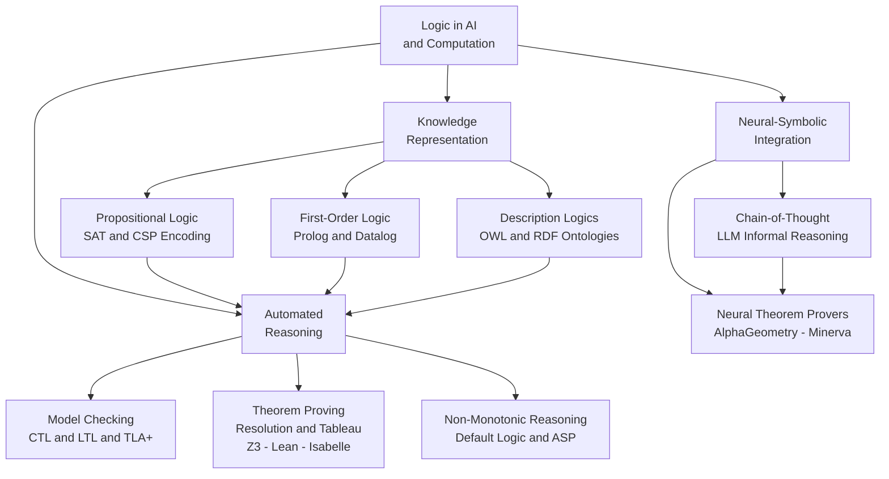

# Logic in AI and Computation

> [!abstract] TL;DR
> Logic has been the language of AI since its founding — from McCarthy's situation calculus and Prolog's SLD resolution through SAT solvers that verify billion-gate chips, model checkers that prove protocol correctness, and automated theorem provers that close open mathematical conjectures. Today, large language models operationalize informal logical reasoning via chain-of-thought, while neuro-symbolic systems like AlphaGeometry marry neural pattern recognition with formal proof, showing that the classical and statistical traditions are converging rather than competing. Every AI system that must guarantee correctness, not merely approximate it, reaches back to formal logic.

---

## Intuition

**Analogy:** Imagine a medical triage team with two types of clinicians. The first type carries a rulebook: "if fever AND cough AND body aches, then possible flu; if possible flu AND no vaccine history, then recommend antiviral." They work by chaining rules forward from observed symptoms to conclusions — slow to learn new diseases, but every diagnosis has a traceable, auditable justification. The second type is an experienced consultant who has seen thousands of cases and pattern-matches rapidly to a diagnosis without consciously enumerating rules — fast and often right, but unable to explain the chain of reasoning on demand.

Classical AI logic is the rulebook clinician. The rulebook is a knowledge base of formal axioms. Inference is a mechanical procedure — resolution, forward chaining, model checking — guaranteed to be sound. Neural networks and LLMs are the experienced consultant. The grand challenge of modern AI is getting both clinicians to work together: use the pattern matcher to propose candidates, use the rulebook to verify them. That integration — from Answer Set Programming to AlphaGeometry to chain-of-thought prompting — is the live frontier of logic in AI.

---

## How It Works

### Core Mechanics

**1. The GOFAI Foundation: Situation Calculus (McCarthy, 1963)**

John McCarthy's situation calculus encodes dynamic worlds as first-order logic. A *situation* is a snapshot of the world; an *action* maps one situation to another; *fluents* are predicates that may change across situations. The foundational axiom `Holds(f, Result(a, s))` — fluent f holds in the situation resulting from performing action a in situation s — gives AI agents a formal account of how actions change the world. This framework underlies STRIPS planning (the original robotic planner), PDDL, and all classical AI planning systems. The *frame problem* — how to efficiently represent what does *not* change after an action — occupied logicians and AI researchers for two decades and is still not fully resolved.

**2. Logic Programming: Prolog and SLD Resolution**

Prolog restricts first-order logic to *Horn clauses* — implications with at most one positive literal in the head: `ancestor(X, Z) :- parent(X, Y), ancestor(Y, Z).` This fragment has two decisive advantages. First, resolution becomes deterministic: *SLD resolution* (Selective Linear Definite) applies one simplification rule at a time, depth-first, left-to-right — the entire proof strategy is implicit in the clause structure. Second, unification handles variable binding. Prolog executes a query by working *backward* from the goal, matching it against clause heads and recursively resolving subgoals. Industrial uses persist: Datalog (a non-recursive Prolog subset) is the basis of declarative program analysis (Doop, CodeQL), and constraint logic programming underlies many scheduling and configuration tools.

**3. Expert Systems and Production Rules**

Expert systems (MYCIN for medical diagnosis, R1/XCON for VAX configuration) formalize domain expertise as *production rules*: IF-THEN pairs whose antecedents pattern-match against a working memory of facts. The inference engine applies rules in a forward-chaining (data-driven) or backward-chaining (goal-driven) loop until no new facts can be derived or the goal is proven. RETE — the standard production-rule matching algorithm — achieves efficient incremental matching by compiling rules into a network that avoids re-evaluating unchanged conditions. Expert systems were commercially dominant in the 1980s before machine learning eclipsed them; their influence persists in business rule engines (Drools, CLIPS) and regulatory compliance systems.

**4. Description Logics and the Semantic Web**

Description Logics (DL) are decidable fragments of first-order logic designed for knowledge representation. They trade the full expressiveness of FOL for tractable reasoning: a DL reasoner can classify a new concept in a hierarchy, check ontology consistency, and answer queries — all with complexity guarantees. W3C's OWL (Web Ontology Language) is grounded in the DL SROIQ; it is the formal backbone of the Semantic Web, biomedical ontologies (SNOMED CT, Gene Ontology), and Google's early Knowledge Graph. The RDF triple store `(subject, predicate, object)` is the ground-atom representation; SPARQL queries are existential FOL formulas over the triple store. The key design decision — open-world assumption — distinguishes OWL from Prolog's closed-world assumption: in OWL, something not stated is *unknown*, not false.

**5. SAT Solvers: DPLL and CDCL**

The Boolean satisfiability problem (SAT) — does a propositional formula in CNF have a satisfying assignment? — is NP-complete (Cook 1971) but practically tractable for industrial instances. The DPLL algorithm (1962) applies unit propagation and backtracking search. Modern CDCL (Conflict-Driven Clause Learning) solvers extend DPLL with *clause learning*: when a conflict is found, the solver analyzes its cause, learns a new clause that blocks the same conflict branch, and backtracks non-chronologically. CDCL solvers (MiniSAT, CaDiCaL, Z3) routinely handle instances with millions of variables in hardware equivalence checking and bounded model checking. SMT (Satisfiability Modulo Theories) generalizes SAT by adding background theories — linear arithmetic, arrays, bit-vectors — via the DPLL-T architecture: a SAT solver cooperates with a theory solver to decide rich logical queries.

**6. Model Checking: CTL and LTL**

Model checking exhaustively verifies that a *finite-state system* satisfies a *temporal property*. CTL (Computation Tree Logic) quantifies over *branching* futures: `AG safe` means "on all paths, in all future states, the system is safe." LTL (Linear Temporal Logic) quantifies over single execution traces: `G (request → F grant)` means "every request is eventually granted on every run." CTL model checking runs in O(|S| × |φ|) where |S| is the state space — polynomial, hence automatic. The state explosion problem — |S| grows exponentially with system variables — is addressed by symbolic model checking (BDDs represent state sets implicitly) and bounded model checking (unroll the transition relation k steps and ask SAT). TLA+ (Lamport) encodes distributed system specifications; AWS uses it to verify DynamoDB and S3 protocols.

**7. Automated Theorem Proving: Resolution, Tableau, and Interactive Provers**

*Resolution-based* provers (E prover, Vampire) operate on clausal first-order logic: negate the conjecture, convert to CNF, apply the resolution rule until the empty clause appears. *Tableau provers* decompose formulas by case analysis on their structure — they are especially natural for modal and description logics. *Interactive theorem provers* (Lean 4, Isabelle/HOL, Coq) require human guidance but produce machine-checked proofs of arbitrary complexity; Lean's Mathlib library contains over 100,000 formalized mathematics theorems. The Curry-Howard isomorphism underlies interactive provers: a proof of proposition P is literally a program of type P in a dependently-typed language, making proof construction identical to type-correct program construction.

**8. Non-Monotonic Reasoning and Answer Set Programming**

Classical logic is monotonic: adding an axiom can only add conclusions. Real-world reasoning is non-monotonic: "Birds fly, Tweety is a bird, therefore Tweety flies" is overridden by "Tweety is a penguin." Default logic (Reiter) adds *default rules* that fire unless contradicted. Circumscription (McCarthy) minimizes the extension of abnormality predicates. Answer Set Programming (ASP) takes a different approach: it defines the semantics of a logic program as the *stable models* — sets of facts such that the program, restricted to that set, derives exactly that set. ASP handles negation-as-failure, disjunction in heads, and constraint satisfaction naturally. Industrial ASP (Clingo, DLV) powers scheduling, planning under incomplete information, and biological pathway inference.

**9. Neural-Symbolic Integration**

LLMs exhibit striking informal logical capabilities via chain-of-thought prompting: decomposing a problem into explicit reasoning steps dramatically improves performance on arithmetic, symbolic manipulation, and multi-step inference. This is *not* formal inference — LLM reasoning is neither sound nor complete; it confabulates steps and is sensitive to framing — but it produces correct answers at rates that rival formal solvers on many benchmark tasks. At the harder end, neuro-symbolic systems use neural networks as pattern-recognition engines and formal solvers as verification oracles. AlphaGeometry (DeepMind, 2024) solves International Math Olympiad geometry problems at gold-medal level by using a language model to propose auxiliary constructions and a symbolic deduction engine to verify each step. Neural Theorem Provers learn unification and backward chaining from data, generalizing to new axiom sets. The Curry-Howard isomorphism creates another bridge: neural models can generate proof terms in Lean that are then type-checked — the neural component needs only to be *plausibly correct*, not provably so.

**10. Turing's Halting Problem as the Ultimate Limit**

Turing's 1936 proof that no Turing machine can decide whether an arbitrary program halts on a given input is the foundational result of computability theory — and the ultimate bound on what any formal system can achieve. By Rice's theorem, every non-trivial semantic property of programs is undecidable. FOL validity is undecidable (Church-Turing 1936). Loop invariant synthesis is undecidable. Full program verification over arbitrary loops is undecidable. Every practical verification tool succeeds only by restricting to a decidable fragment: bounded loops, linear arithmetic, finite-state systems. Understanding these limits guides where to invest engineering effort and where to rely on testing and probabilistic assurance instead.

### Flow / Architecture



---

## Key Concepts

### Secondary (Foundational)

**Forward chaining vs backward chaining.** A forward-chaining inference engine starts from known facts and applies rules to derive new facts until no more rules fire (data-driven). A backward-chaining engine starts from a goal and works backwards, asking what facts would make the goal true (goal-driven). Prolog uses backward chaining; expert systems typically offer both. The two strategies are complete for propositional knowledge bases but differ in practical efficiency depending on the structure of the knowledge base and query.

**Closed-world assumption vs open-world assumption.** In a closed-world system (Prolog, relational databases), anything not explicitly stated is assumed false. In an open-world system (OWL ontologies), anything not stated is simply unknown — it may be true or false. This distinction changes the semantics of negation and has profound engineering implications: a closed-world system can conclude "user Alice has no admin privileges" from the absence of a privilege record; an open-world system cannot.

**SAT vs SMT.** SAT solvers work over Boolean variables and propositional clauses. SMT (Satisfiability Modulo Theories) adds background theories — integers, reals, arrays, bit-vectors, strings — allowing queries like "does there exist an integer x such that 3x + 2 = 14 and x < 10?" SMT solvers (Z3, CVC5) are the workhorses of modern program verification because real programs manipulate typed data, not raw Booleans.

**Decidable fragments matter enormously.** Full FOL is undecidable. But propositional logic (NP-complete), linear arithmetic (polynomial), description logics (EXPTIME or lower), and monadic second-order logic over trees (decidable) are all used productively. The art of applied logic in AI is recognizing which fragment fits the problem and which solver architecture exploits it efficiently.

### Undergraduate (Technical Depth)

**SLD resolution and unification in Prolog.** Given a goal `G` and a clause `H :- B₁, ..., Bₙ`, SLD resolution unifies `G` with `H` using a most-general unifier (MGU), then replaces `G` with the instantiated body `B₁', ..., Bₙ'`. Depth-first, left-to-right search with chronological backtracking on failure constitutes Prolog's execution model. Negation-as-failure (NAF) — treating `not P` as true when all proof attempts for `P` fail — is sound under the closed-world assumption but can give counterintuitive results with circular rules. The cut operator (`!`) prunes the search tree, sacrificing completeness for efficiency.

**DPLL and CDCL mechanics.** DPLL assigns a variable, simplifies the formula, recurses, and backtracks on conflict. CDCL improves this with three techniques: (1) *Conflict analysis* derives a new clause from the *implication graph* of forced assignments that led to the conflict; (2) *Non-chronological backjumping* uses the learned clause to jump back farther than the most recent decision; (3) *Restart heuristics* periodically reset the search to escape poor variable orderings while keeping all learned clauses. The VSIDS (Variable State Independent Decaying Sum) heuristic scores variables by conflict frequency and dramatically accelerates practical solving.

**CTL vs LTL and the verification trade-off.** CTL model checking is polynomial but cannot express "on every path, eventually p" without branching-time quantifiers — it works best for branching properties like deadlock freedom. LTL captures linear properties like safety and liveness naturally but requires automata-based model checking (Büchi automata complement, then product with system automaton) — polynomial in the number of states but exponential in the formula. CTL* subsumes both but is PSPACE-complete. In practice: use CTL for reactive system properties, LTL for protocol trace properties.

**Description Logic expressiveness-decidability hierarchy.**

| Logic | Expressiveness | Complexity |
|---|---|---|
| EL | concept inclusion, conjunction | Polynomial |
| ALC | complement, universal/existential restrictions | EXPTIME |
| SROIQ | role chains, transitive roles, cardinality | NEXPTIME |
| Full OWL DL | SROIQ + concrete domains | Undecidable |

OWL Lite and OWL EL are designed for practical bio-ontologies; SROIQ covers OWL 2 DL used in most semantic web applications; adding concrete datatypes with arithmetic can push into undecidability.

**The Curry-Howard isomorphism.** There is a precise correspondence between types in a typed lambda calculus and propositions in intuitionistic logic, and between terms (programs) and proofs. The type `A → B` corresponds to the proposition "A implies B"; a function `f : A → B` is a proof of that implication. Dependent types extend this to full predicate logic: the type `Π(n : ℕ). IsEven(n) → IsEven(n + 2)` is both a type of functions and the proposition "for every natural number n, if n is even then n+2 is even." Lean 4, Agda, and Coq exploit this isomorphism to make proof construction and program construction the same activity.

### Graduate (Research Frontier)

**Stable model semantics and Answer Set Programming.** The stable model (answer set) of a logic program P with respect to a set S is the minimal model of P reduced by S — where the reduction removes all rules with a body literal that fails under S. A set S is a stable model if it equals the minimal model of its own reduction. This fixed-point semantics handles non-monotonic reasoning correctly: adding "Tweety is a penguin" removes the default "birds fly" from the program reduced by the stable model containing `penguin(tweety)`. Industrial ASP systems (Clingo, DLV2) use DPLL-T with specialized learned clauses over answer set semantics and scale to problems with millions of rules.

**Bounded model checking and Craig interpolation.** Bounded model checking (Biere et al., 1999) encodes the question "is there a path of length ≤ k in system M that violates property P?" as a SAT instance, then incrementally increases k. For hardware verification this is often more efficient than BDD-based symbolic model checking. Craig interpolation — given an unsatisfiable formula A ∧ B, find an interpolant I in the shared variables such that A → I and I ∧ B is unsatisfiable — underpins unbounded model checking via *k-induction* and *IC3/PDR* (Property-Directed Reachability), the current state-of-the-art algorithm for hardware property verification.

**Neuro-symbolic architectures.** AlphaGeometry's architecture is a precise instance of the broader neuro-symbolic pattern: a language model (trained on synthetic geometry proofs) proposes auxiliary constructions (angle bisectors, circle intersections) that are not deducible from the current fact set, while a symbolic deduction engine (DD+AR, based on classical angle-chasing rules) verifies each step with zero hallucination. The language model's role is *conjectural* — it proposes useful non-monotonic extensions to the theorem's premise set. This mirrors how human mathematicians work: intuition suggests constructions; rigor verifies them. Minerva and Gemini 1.5 Pro similarly generate proof sketches verified by Lean.

**Limits: Rice's theorem and the complexity of verification.** Rice's theorem states that every non-trivial semantic property of programs (does it halt? does it compute factorial? does it have a buffer overflow?) is undecidable. This is not a limitation of any particular technique — it is an inherent feature of Turing-complete systems. Every practical verifier escapes Rice's theorem by restricting scope: bounded unrolling (finitely many loop iterations), abstract interpretation (sound over-approximation of reachable states), or domain restriction (linear arithmetic only). The engineering insight is that useful verification is always about choosing a decidable abstraction that is precise enough to catch real bugs without generating too many false alarms.

---

## Python Demo

```python
# Forward-Chaining Inference Engine with DAG Visualization
# Demonstrates: knowledge base as (if-then) rules, iterative fact derivation,
# inference chain tracking, and matplotlib-only DAG using FancyArrowPatch.

import numpy as np
import matplotlib.pyplot as plt
import matplotlib.patches as mpatches
from matplotlib.patches import FancyArrowPatch


# ── Knowledge Base ────────────────────────────────────────────────────────────
# Medical diagnosis rules: each rule is (frozenset of antecedents, consequent)

RULES = [
    (frozenset(["fever", "cough"]),                   "possible_flu"),
    (frozenset(["possible_flu", "body_aches"]),        "likely_flu"),
    (frozenset(["fever", "rash"]),                     "possible_measles"),
    (frozenset(["likely_flu", "no_vaccine"]),          "recommend_antiviral"),
    (frozenset(["possible_measles", "no_vaccine"]),    "recommend_isolation"),
    (frozenset(["recommend_antiviral"]),               "schedule_followup"),
    (frozenset(["recommend_isolation"]),               "schedule_followup"),
]

# Two patient scenarios (initial observable facts)
FACTS_A = {"fever", "cough", "body_aches", "no_vaccine"}   # -> flu path
FACTS_B = {"fever", "rash", "no_vaccine"}                   # -> measles path


# ── Inference Engine ──────────────────────────────────────────────────────────

class ForwardChainer:
    """Iterative forward-chaining engine.

    Applies rules until no new facts can be derived (fixed point).
    Tracks the firing sequence as (rule_index, antecedents_tuple, new_fact).
    """

    def __init__(self, rules):
        self.rules = rules

    def run(self, initial_facts):
        facts = set(initial_facts)
        chain = []          # ordered list of (rule_idx, ante_tuple, new_fact)
        changed = True
        while changed:
            changed = False
            for i, (ante, cons) in enumerate(self.rules):
                if cons not in facts and ante.issubset(facts):
                    facts.add(cons)
                    chain.append((i, tuple(sorted(ante)), cons))
                    changed = True
        return facts, chain


engine = ForwardChainer(RULES)
facts_a, chain_a = engine.run(FACTS_A)
facts_b, chain_b = engine.run(FACTS_B)

print("=== Scenario A — Flu Path ===")
for rule_i, ante, cons in chain_a:
    print(f"  Rule {rule_i}: {set(ante)}  -->  {cons}")
print(f"  Final fact base: {facts_a}\n")

print("=== Scenario B — Measles Path ===")
for rule_i, ante, cons in chain_b:
    print(f"  Rule {rule_i}: {set(ante)}  -->  {cons}")
print(f"  Final fact base: {facts_b}")


# ── DAG Layout and Drawing ────────────────────────────────────────────────────

def build_dag_layout(initial_facts, chain):
    """Assign (x, y) positions to each fact node.

    Depth 0 = initial facts (bottom), increasing depth = derived facts.
    Nodes at same depth are spread evenly on x.
    """
    depth = {f: 0 for f in initial_facts}
    for _, ante, cons in chain:
        depth[cons] = max(depth.get(a, 0) for a in ante) + 1

    # Group by depth level
    by_depth = {}
    for node, d in depth.items():
        by_depth.setdefault(d, []).append(node)

    pos = {}
    for d, nodes in sorted(by_depth.items()):
        xs = np.linspace(-(len(nodes) - 1) * 0.9,
                          (len(nodes) - 1) * 0.9,
                          len(nodes))
        for node, x in zip(sorted(nodes), xs):
            pos[node] = np.array([x, float(d)])

    # Build directed edges: each antecedent -> consequent
    edges = set()
    for _, ante, cons in chain:
        for a in ante:
            edges.add((a, cons))

    return pos, edges, depth


def draw_dag(ax, initial_facts, chain, title):
    pos, edges, depth = build_dag_layout(initial_facts, chain)
    initial_set = set(initial_facts)
    R = 0.26        # circle radius in data coordinates

    ax.axis("off")
    ax.set_aspect("equal")
    ax.set_title(title, fontsize=9, pad=10)

    # Draw arrows (behind circles)
    for src, dst in edges:
        if src not in pos or dst not in pos:
            continue
        p0 = pos[src]
        p1 = pos[dst]
        direction = p1 - p0
        length = np.linalg.norm(direction)
        if length < 1e-6:
            continue
        unit = direction / length
        start = p0 + unit * R
        end   = p1 - unit * R
        arrow = FancyArrowPatch(
            posA=tuple(start), posB=tuple(end),
            arrowstyle="-|>",
            color="#95a5a6",
            linewidth=1.4,
            mutation_scale=14,
            zorder=2,
        )
        ax.add_patch(arrow)

    # Draw circles and labels
    for node, (x, y) in pos.items():
        color = "#2980b9" if node in initial_set else "#27ae60"
        circle = mpatches.Circle(
            (x, y), radius=R,
            facecolor=color, edgecolor="white",
            linewidth=1.8, zorder=3,
        )
        ax.add_patch(circle)
        label = node.replace("_", "\n")
        ax.text(x, y, label, ha="center", va="center",
                fontsize=6.2, color="white", fontweight="bold",
                zorder=4, multialignment="center", linespacing=1.2)

    # Axis limits
    all_x = [p[0] for p in pos.values()]
    all_y = [p[1] for p in pos.values()]
    ax.set_xlim(min(all_x) - R * 3, max(all_x) + R * 3)
    ax.set_ylim(min(all_y) - R * 3, max(all_y) + R * 3)

    # Depth labels on the left
    max_d = max(depth.values()) if depth else 0
    for d in range(max_d + 1):
        label = "Initial\nfacts" if d == 0 else f"Derived\ndepth {d}"
        ax.text(min(all_x) - R * 2.8, float(d), label,
                ha="right", va="center", fontsize=6.5, color="#555",
                style="italic")

    # Legend
    handles = [
        mpatches.Patch(facecolor="#2980b9", edgecolor="white", label="Initial fact"),
        mpatches.Patch(facecolor="#27ae60", edgecolor="white", label="Derived fact"),
    ]
    ax.legend(handles=handles, loc="upper right", fontsize=7.5, framealpha=0.9)


# ── Render ────────────────────────────────────────────────────────────────────
fig, axes = plt.subplots(1, 2, figsize=(13, 7))
fig.suptitle(
    "Forward-Chaining Inference Engine — Reasoning DAGs\n"
    "Arrows show which facts triggered each rule firing",
    fontsize=12, y=1.01,
)

draw_dag(
    axes[0], FACTS_A, chain_a,
    "Scenario A: Flu Diagnosis\n"
    "Facts: fever, cough, body_aches, no_vaccine",
)
draw_dag(
    axes[1], FACTS_B, chain_b,
    "Scenario B: Measles Diagnosis\n"
    "Facts: fever, rash, no_vaccine",
)

plt.tight_layout()
plt.savefig("forward_chaining_dag.png", dpi=120, bbox_inches="tight")
plt.show()
print("Saved: forward_chaining_dag.png")
```

**Expected output:**
```
=== Scenario A — Flu Path ===
  Rule 0: {'cough', 'fever'}                     -->  possible_flu
  Rule 1: {'body_aches', 'possible_flu'}          -->  likely_flu
  Rule 3: {'likely_flu', 'no_vaccine'}            -->  recommend_antiviral
  Rule 5: {'recommend_antiviral'}                 -->  schedule_followup
  Final fact base: {'fever', 'cough', 'body_aches', 'no_vaccine',
                    'possible_flu', 'likely_flu',
                    'recommend_antiviral', 'schedule_followup'}

=== Scenario B — Measles Path ===
  Rule 2: {'fever', 'rash'}                       -->  possible_measles
  Rule 4: {'no_vaccine', 'possible_measles'}      -->  recommend_isolation
  Rule 6: {'recommend_isolation'}                 -->  schedule_followup
  Final fact base: {'fever', 'rash', 'no_vaccine',
                    'possible_measles', 'recommend_isolation', 'schedule_followup'}
```

Both scenarios converge to `schedule_followup` via different diagnosis paths, demonstrating that forward chaining explores only the branch reachable from the given initial facts — the measles rules never fire in Scenario A.

---

## Real-World Applications

> **AWS TLA+ Formal Verification.** Amazon Web Services engineers write TLA+ specifications of distributed protocols (DynamoDB partition rebalancing, S3 bucket replication) and run the TLC model checker against them. The checker exhaustively verifies temporal properties like "every write that is acknowledged is eventually readable" over millions of reachable system states. AWS has published that TLA+ caught real bugs in production designs that code review and testing missed for months — including a subtle liveness bug in an atomic register protocol that only manifests under a specific three-process interleaving.

> **Z3 SMT Solver in Security and Program Analysis.** Microsoft Research's Z3 SMT solver underlies dozens of industrial tools. Pex (later IntelliTest) uses Z3 to solve path conditions symbolically and generate test inputs that exercise each branch. Microsoft's SAGE fuzzer uses Z3 to perform white-box constraint solving, finding security vulnerabilities in Windows file parsers at a rate that dwarfed conventional fuzzing. GitHub Copilot's downstream static analysis tooling uses Z3 for taint-flow queries expressed in linear arithmetic and pointer logic.

> **AlphaGeometry: Neuro-Symbolic Theorem Proving.** DeepMind's 2024 AlphaGeometry system solved 25 of 30 IMO geometry problems at gold-medal level. The architecture is a precise coupling: a language model (trained on 100 million synthetic geometry proof traces) proposes auxiliary constructions in natural language; a deterministic symbolic deduction engine (angle-chasing + algebraic rules) verifies each deduction step rigorously. The language model needs no formal training in proof theory — it learns geometric intuition from synthetic data. The symbolic engine needs no learned parameters — it just applies fixed inference rules. Neither component alone reaches gold-medal performance; the combination does.

> **Prolog and Datalog in Static Analysis.** CodeQL (GitHub) encodes security vulnerabilities as Datalog queries over a fact base representing program ASTs and data flows. The query "find all paths from user-controlled input to a SQL query string without sanitization" is a graph reachability question expressed in a few lines of QL (a Datalog variant). The underlying evaluation engine applies semi-naive bottom-up evaluation — a variant of forward chaining optimized for large relational fact bases — to compute the complete set of vulnerable paths across millions of lines of code in seconds.

> **Answer Set Programming in Bio-Network Inference.** ASP solvers (Clingo) are used to infer gene regulatory networks from partial experimental data. The problem: given partial observations of which genes are expressed and a library of known regulatory interactions, find the minimal regulatory network consistent with all observations. This is an abductive reasoning problem — adding hypothetical regulatory edges until the model explains the data — that maps naturally to stable model semantics. ASP's non-monotonic reasoning handles conflicting experimental observations gracefully, allowing "preferred" models that satisfy more constraints to be ranked above less consistent ones.

---

## Common Pitfalls

- **Confusing soundness with completeness in automated reasoning** — A sound prover never derives false conclusions; a complete prover derives all true conclusions. DPLL is both sound and complete for propositional SAT. Resolution for FOL is complete but undecidable: if the formula is valid, resolution will eventually find a proof, but if it is not, the procedure may run forever. Many practical tools are sound but incomplete by design — they report only real bugs but miss some.

- **Ignoring the frame problem in situation calculus** — McCarthy's original formulation requires explicit *frame axioms* stating what does not change after each action. With 100 actions and 100 fluents, this requires up to 10,000 frame axioms — an engineering disaster. The *successor state axiom* (Reiter 1991) is the standard fix: a fluent F holds after action A in situation S if and only if A causes F, or F already held and A does not undo it. Failing to apply this solution produces logically incomplete action models.

- **Treating LLM chain-of-thought as formal proof** — Chain-of-thought reasoning by LLMs is statistically powerful but logically unsound. Models hallucinate intermediate steps, selectively apply rules, and fail on out-of-distribution logical structures. Empirically, CoT improves accuracy on multi-step benchmarks but does not provide the formal guarantees of resolution or model checking. The engineering risk is deploying LLM-generated "proofs" in safety-critical contexts without independent formal verification.

- **State explosion in model checking** — The number of system states grows exponentially with the number of concurrent components. A system of n boolean variables has 2^n states; adding one variable doubles the state space. Symbolic model checking (BDDs) delays the explosion but does not eliminate it. The engineering discipline is designing system models at the right level of abstraction — abstracting away irrelevant details while preserving the property being checked. Over-concrete models cause state explosion; over-abstract models give vacuously true verification results.

- **Open-world vs closed-world confusion in knowledge bases** — Developers who add OWL ontologies to systems that also use Prolog or SQL frequently create inconsistencies. An OWL reasoner may conclude "it is consistent that Alice has admin privileges" because no axiom forbids it; a SQL query returns "Alice has no admin privileges" because no row exists. The two systems have fundamentally different models of what absence of information means. Explicit domain documentation of the world-assumption in use is the only reliable safeguard.

- **Non-monotonicity surprises in production rule systems** — Adding new facts to an expert system's working memory can *retract* previously derived conclusions. Rule engines that implement truth maintenance systems handle this correctly; those that do not will return stale derived facts after knowledge base updates. The classic failure mode: a loan approval system derives "approved" based on credit data; a fraud alert is added later; without truth maintenance, the approval is not retracted even though the fraud rule's antecedent is now satisfied.

---

## Related Concepts

- [[Propositional_Logic]] — the formal foundation for SAT solvers, DPLL, CDCL, and Boolean model checking; every logic-in-AI technique eventually reduces to propositional satisfiability at the hardware level.
- [[Predicate_Logic_and_Quantifiers]] — first-order logic is the native language of situation calculus, Prolog, Datalog, and description logics; Gödel's completeness and Church-Turing undecidability directly bound what automated FOL reasoning can achieve.
- [[Proof_Theory_and_Natural_Deduction]] — resolution and tableau methods are proof-theoretic; the Curry-Howard isomorphism connecting proof terms to programs is grounded in proof theory and underlies Lean, Coq, and Agda.
- [[Modal_Logic]] — temporal logics CTL and LTL used in model checking are modal logics with next-time and until operators; dynamic logic formalizes program correctness using modal box and diamond operators.
- [[Bayesian_Reasoning]] — probabilistic logic programming (ProbLog, MLNs) hybridizes first-order logic with probability distributions; Bayesian networks can be seen as a probabilistic relaxation of the closed-world assumption.
- [[Inductive_Logic]] — inductive logic programming (ILP) learns FOL rules from examples, directly bridging machine learning and knowledge representation; Muggleton's FOIL algorithm is the classical reference.
- [[Abductive_Reasoning_and_Inference_to_Best_Explanation]] — abductive inference — finding the best explanation for observations — maps directly to ASP stable-model computation and to the auxiliary construction proposals in AlphaGeometry.
- [[Chain_of_Thought]] — chain-of-thought prompting produces informal step-by-step reasoning in LLMs; its relationship to formal logical inference is a live research question in neuro-symbolic AI.
- [[Reasoning_Models]] — o1/o3 and DeepSeek-R1 models apply extended chain-of-thought with self-verification, operationalizing the detect-and-verify loop that is formally instantiated in neuro-symbolic architectures.
- [[Time_Complexity_Classes]] — SAT is NP-complete; CTL model checking is P; LTL is PSPACE-complete; FOL validity is undecidable; the complexity landscape directly determines what can be verified automatically and at what cost.

---

## Review Questions

### Conceptual

1. Prolog uses backward chaining with depth-first search under the closed-world assumption. Explain precisely why depth-first search makes Prolog *incomplete* as a theorem prover for full first-order logic, and describe one standard technique (with its trade-off) that addresses this limitation. What changes if we switch to Datalog, where only ground facts are derived?

### Scenario

2. You are verifying a new distributed consensus protocol for a database system. You have three candidate approaches: (a) exhaustive CTL model checking with an explicit state space, (b) bounded SAT-based model checking with k = 20 steps, (c) writing a formal proof in TLA+ with the TLC checker. For each approach, identify the class of bugs it *can* and *cannot* find, the computational bottleneck, and the conditions under which you would choose it in practice. What is the key difference between a bound of k = 20 finding no bugs and a full model-checking result finding no bugs?

### Trade-off

3. AlphaGeometry couples a language model (neural, statistically learned) with a symbolic deduction engine (formal, rule-based). Compare this architecture to three alternatives: (a) using only the language model, (b) using only the symbolic deduction engine, and (c) using the language model to generate Lean proof terms that are type-checked. For each, analyze the trade-off between correctness guarantees, generalization to novel problem types, and the kind of failures each architecture produces. Which architecture would you trust for safety-critical mathematical verification and why?

---

## Sources

- [McCarthy, J. (1963). "Situations, Actions, and Causal Laws." Stanford AI Memo 2.](https://www.formal.stanford.edu/jmc/situationactions.pdf) — Original situation calculus paper; the formal foundation of GOFAI action representation.
- [Biere, A., Cimatti, A., Clarke, E., & Zhu, Y. (1999). "Symbolic Model Checking without BDDs." *TACAS 1999*, LNCS 1579.](https://doi.org/10.1007/3-540-49059-0_14) — Foundational paper on bounded model checking via SAT reduction.
- [Trinh, T. H. et al. (2024). "Solving Olympiad Geometry without Human Demonstrations." *Nature*, 625, 476–482.](https://doi.org/10.1038/s41586-023-06747-5) — AlphaGeometry: the canonical neuro-symbolic theorem proving system, gold-medal IMO geometry.
- [Gebser, M., Kaminski, R., Kaufmann, B., & Schaub, T. (2012). *Answer Set Solving in Practice*. Morgan and Claypool.](https://potassco.org/book/) — Comprehensive treatment of ASP, stable model semantics, and the Clingo system.
- [de Moura, L. & Bjorner, N. (2008). "Z3: An Efficient SMT Solver." *TACAS 2008*, LNCS 4963.](https://doi.org/10.1007/978-3-540-78800-3_24) — The Z3 SMT solver; the most widely deployed automated reasoning engine in software verification.

---

#logic #ai #computation #knowledge-representation #automated-reasoning
