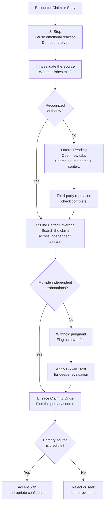

# Media Literacy and Source Evaluation

> [!abstract] TL;DR
> Media literacy is the capacity to access, analyze, evaluate, create, and act on information across media forms — the applied critical thinking skill that determines whether you consume information or information consumes you. Source evaluation frameworks like SIFT and CRAAP give that capacity a concrete, repeatable procedure. In an era of algorithmic filter bubbles, synthetic media, and AI-generated content, these skills are no longer optional refinements: they are epistemological infrastructure.

---

## Intuition

**Analogy:** Imagine you are a food inspector in a city where anyone can open a restaurant with no license, no inspections, and no requirement to disclose ingredients. Some restaurants are brilliant and safe; some use rotten produce but disguise it with heavy saucing; a few are run by people who want to actively poison their customers while looking indistinguishable from the good places. The menu itself tells you almost nothing — a beautifully printed menu with confident language is not evidence of safe food.

A trained food inspector does not taste every dish and wait to get sick. They check the kitchen, look at the licensing board's records, ask colleagues who have inspected this place before, trace where the meat was sourced. They work *around* the food, not *through* it. This is **lateral reading** — the single most important skill in information evaluation. Instead of spending more time on a suspicious page, you open new tabs and ask what the rest of the world says about the source of that page. The internet, paradoxically, is the best tool for fact-checking the internet — if you know how to use it sideways.

---

## How It Works

### Core Mechanics

Media literacy operates at four nested levels:

1. **Access** — Can you find reliable information at all? Filter bubbles and algorithmic curation systematically restrict which claims even reach you, making access itself a critical-thinking problem.
2. **Evaluation** — Is this specific claim or source credible? This is where SIFT, CRAAP, and source credibility dimensions apply.
3. **Analysis** — What purposes, framings, and omissions shape how a credible source presents information? Even trustworthy sources carry editorial agendas.
4. **Production** — Can you create and share information responsibly? Digital literacy is bidirectional.

**The epistemic threat taxonomy** distinguishes three categories that are routinely conflated:

| Type | Definition | Intent | Example |
|------|-----------|--------|---------|
| **Misinformation** | False or misleading information | No intent to deceive | Sharing a debunked study because you believed it |
| **Disinformation** | False information deliberately created to deceive | Intentional | State-sponsored fabricated news articles |
| **Malinformation** | Accurate information used to harm | Weaponized truth | Leaking true but private medical records to discredit a politician |

### The SIFT Framework

Mike Caulfield's SIFT (2019) is a lateral-reading-first protocol designed for fast, practical use in everyday information encounters:

- **S — Stop**: Before sharing or reacting, pause. Emotional resonance is not evidence. The feeling that a headline confirms what you already believe is a warning sign, not a green light.
- **I — Investigate the Source**: Who publishes this? What is their editorial charter, funding, and track record? Do this *before* reading the article in depth — prior knowledge about a source is more reliable than in-article cues.
- **F — Find Better Coverage**: For most factual claims, the question is not whether *this* article is well-written; it is whether *the claim* is corroborated by multiple independent, credible sources. Search the claim, not just the source.
- **T — Trace Claims to Origin**: Viral content routinely mutates from its source. A statistic cited in a news article may trace back to a misquoted preprint, a press release that softened research caveats, or a satirical piece that escaped its context.

### The CRAAP Test

Developed in academic library contexts (Meriam Library, CSU Chico, 2004), CRAAP provides a more systematic rubric for evaluating a specific source document:

| Criterion | Key Questions |
|-----------|--------------|
| **Currency** | When was it published? Has it been updated? Are the links still live? |
| **Relevance** | Does this source actually address your specific question? Who is the intended audience? |
| **Authority** | Who wrote this? What are their credentials in this domain? Who publishes this outlet? |
| **Accuracy** | Is the evidence cited? Can you trace the evidence independently? Has this been peer reviewed? |
| **Purpose** | Is the intent to inform, persuade, sell, or entertain? Does the framing reveal a particular agenda? |

CRAAP is thorough but slow. SIFT is fast but can miss nuance. Skilled practitioners layer both: SIFT as a first triage, CRAAP for deeper evaluation of sources that passed the triage.

### Lateral Reading vs. Vertical Reading

**Vertical reading** — staying on the page, reading it carefully, analyzing its footnotes and internal consistency — is the natural academic instinct. It is the wrong default for source evaluation online. Sophisticated disinformation is internally consistent; it has footnotes, confident tone, and attractive design. Vertical reading rewards craft, not truth.

**Lateral reading** — opening new tabs immediately and searching what other sources say *about* this source — is the practice Stanford researchers (Wineburg et al., 2022) found distinguishes professional fact-checkers from both history professors and Stanford undergraduates. Fact-checkers left the site quickly; domain experts stayed on it longest and performed worst.

### Confirmation Bias and Filter Bubbles

**Confirmation bias** (a cognitive tendency documented extensively since Wason's 1960 card experiments) leads people to seek, interpret, and remember information that confirms existing beliefs. In a high-volume, algorithm-curated environment, this tendency is amplified structurally.

**Filter bubbles** (Pariser, 2011) arise when personalization algorithms learn which content keeps a user engaged and iteratively narrow the information diet toward that content. The bubble is invisible: unlike a newspaper's editorial line, which is public, an algorithmic feed's selection criteria are opaque and individualized.

**Echo chambers** (Sunstein, 2017) are the social complement — environments where like-minded people reinforce each other's priors with decreasing friction from dissenting views. The distinction matters: filter bubbles are algorithmic and structural; echo chambers are social and self-selected. Both produce the same epistemological outcome — reduced exposure to falsifying evidence.

### Prebunking vs. Debunking

**Debunking** corrects a specific false claim after it has spread. Its core limitation is the **continued influence effect**: corrections do not erase the original claim from memory; instead they create a competing trace. The original claim, being simpler and emotionally resonant, often wins in recall. Corrections also spread far less virally than the original misinformation.

**Prebunking** (inoculation theory, van der Linden et al., 2022) exposes people to weakened doses of manipulation *techniques* — not specific false claims — before they encounter real disinformation. By naming the rhetorical move (e.g., "this uses an emotionally loaded appeal to distract from missing evidence") without the full persuasive payload, inoculation builds cognitive antibodies. Large-scale randomized trials (Cambridge, 2022) showed prebunking via short YouTube videos raised resistance to manipulative content across political affiliations.

The key insight: prebunking teaches *how to recognize manipulation*, not *what the correct facts are*. This makes it more robust to future novel disinformation than debunking specific claims.

### Source Credibility Dimensions

Source credibility is multidimensional. The classic two-factor model (Hovland et al., 1953) — **expertise** and **trustworthiness** — was later extended:

| Dimension | Definition | Proxy Indicators |
|-----------|-----------|-----------------|
| **Expertise** | Demonstrated knowledge in the domain | Credentials, institutional affiliation, track record |
| **Trustworthiness** | Honest, impartial presentation | Transparency about funding, correction policy, disclosure of conflicts |
| **Accuracy history** | Empirical record of correct claims | Fact-checker audits, retraction rates |
| **Bias** | Systematic slant in selection or framing | Third-party media bias ratings, ownership analysis |
| **Verifiability** | Claims are traceable to primary evidence | Citation practices, data availability, open methods |

### Peer Review, Preprints, and Scientific Publishing

Peer review is often misunderstood as a truth-certification stamp. It is a quality-control filter: manuscripts are reviewed by domain experts for methodological soundness, not for whether the findings are ultimately correct. It catches many errors but not all; **p-hacking**, selective reporting, and publication bias survive review routinely.

**Preprints** (arXiv, bioRxiv, medRxiv) are non-peer-reviewed manuscripts posted publicly before journal review. During COVID-19, preprints about viral transmission, treatments, and vaccine efficacy spread through mainstream media before peer review, with fatal consequences when preliminary findings were reported as settled. The responsible treatment of preprints: cite them as preliminary, note the preprint status prominently, and prioritize post-review replication evidence for claims with policy or health stakes.

### Algorithms and Information Diet

Platform recommendation systems optimize for engagement metrics — watch time, click-through rate, emotional arousal, sharing. These metrics correlate poorly with accuracy or epistemic value. Research by Huszár et al. (2022) using Twitter internal data found that across six countries, algorithmic amplification systematically favored ideologically extreme content over moderate content from the same party. The mechanism is not ideological bias in platform engineering; it is that extreme content generates more engagement signals.

The practical implication: the default information diet shaped by algorithmic curation is not neutral. Applying SIFT and seeking out sources independently — rather than following recommendation queues — is itself an act of epistemic agency.

### AI-Generated Content and Synthetic Media

Large language models and diffusion models have made it trivially easy to generate plausible-sounding text, realistic images, and convincing video at scale. The implications for source evaluation are structural:

- **Deepfakes**: Synthetic video/audio of real people saying things they never said. Detection tools lag behind generation quality in an adversarial race.
- **AI-generated text farms**: LLMs used to produce high-volume, low-cost content that mimics journalistic style without journalistic verification. This content can pass CRAAP's "authority" and "accuracy" checks superficially.
- **Astroturfing at scale**: AI enables small groups to simulate large grass-roots movements by flooding forums and social media with synthetic personas.

The SIFT response to AI content is to escalate lateral reading: check whether the domain was registered recently, whether the publication has a verifiable track record predating the AI era, and whether the claims are corroborated by outlets with established human editorial processes. Provenance metadata standards (C2PA — Coalition for Content Provenance and Authenticity) are emerging but not yet widely deployed.

### Flow / Architecture



---

## Key Concepts

### Secondary Level

- **SIFT** (Stop, Investigate, Find, Trace): a four-step lateral-reading protocol for fast source triage.
- **CRAAP Test** (Currency, Relevance, Authority, Accuracy, Purpose): a systematic checklist for evaluating a specific document.
- **Misinformation / disinformation / malinformation**: three distinct categories of harmful information, distinguished by accuracy and intent.
- **Lateral reading**: evaluating a source by searching what others say about it rather than spending more time on it directly.
- **Confirmation bias**: the tendency to seek and favor information that confirms existing beliefs.
- **Filter bubble**: algorithmic curation that narrows an individual's information diet toward self-reinforcing content.

### Undergraduate Level

- **Echo chambers** (Sunstein): social environments reinforcing shared beliefs, distinct from filter bubbles which are algorithmic.
- **Inoculation theory** (van der Linden): prebunking manipulative techniques — not specific falsehoods — builds durable cognitive resistance.
- **Source credibility dimensions**: expertise, trustworthiness, accuracy history, low bias, verifiability — each independently measurable.
- **Peer review limitations**: peer review is a quality filter, not a truth guarantee; publication bias, p-hacking, and selective reporting survive review.
- **Preprint culture**: unreviewed manuscripts should be flagged as preliminary; responsible reporting cites review status.
- **ACRL Framework** (2016): six threshold concepts for information literacy — authority is constructed, information creation as process, searching as strategic exploration, scholarship as conversation, research as inquiry, information has value.
- **UNESCO Media and Information Literacy** (MIL): five laws — all people are equal producers and consumers of information; media and information literacy encompasses critical thinking and civic engagement.

### Graduate Level

- **Continued influence effect**: corrective information reduces but does not eliminate the influence of misinformation; the original claim competes with its correction in memory.
- **Algorithmic amplification bias**: engagement-optimizing recommendation systems systematically amplify emotionally arousing, extreme content, regardless of platform engineers' ideological intent.
- **Deepfakes and synthetic media**: adversarial generation-detection dynamics; C2PA provenance standards as a partial structural solution.
- **Prebunking at scale**: randomized trials showing inoculation video campaigns raise resistance across partisan lines by teaching manipulation mechanics rather than fact-correcting specific claims.
- **Computational propaganda**: coordinated, automated, AI-assisted influence operations exploiting platform recommendation systems for political goals.
- **AI-generated content farms**: LLM-produced content that mimics journalistic authority while lacking editorial accountability; implications for CRAAP's "authority" criterion.

---

## Python Demo

```python
import numpy as np
import matplotlib.pyplot as plt
import matplotlib.colors as mcolors

# Fictional news sources — deliberately varied for demonstration
sources = [
    "The Daily Verifier",
    "Coastal Tribune",
    "TruthPulse Network",
    "InfoFlow Today",
    "Anchor Facts Global",
    "The Open Press",
    "RapidBreaking.com",
    "Global Insight Review",
]

# Five credibility dimensions: higher score = more credible
dimension_names = ["Expertise", "Transparency", "Accuracy\nHistory", "Low Bias", "Verifiability"]

# Scores matrix: shape (n_sources, n_dimensions), values in [0.0, 1.0]
# Handcrafted to produce a realistic spread from low to high credibility
scores = np.array([
    [0.90, 0.85, 0.88, 0.80, 0.92],   # The Daily Verifier  — high credibility
    [0.75, 0.70, 0.72, 0.65, 0.78],   # Coastal Tribune     — decent
    [0.40, 0.25, 0.35, 0.18, 0.30],   # TruthPulse Network  — low credibility
    [0.60, 0.55, 0.58, 0.52, 0.62],   # InfoFlow Today      — middling
    [0.85, 0.88, 0.82, 0.78, 0.80],   # Anchor Facts Global — high credibility
    [0.70, 0.75, 0.68, 0.72, 0.74],   # The Open Press      — decent
    [0.22, 0.12, 0.18, 0.08, 0.15],   # RapidBreaking.com   — very low credibility
    [0.80, 0.78, 0.76, 0.82, 0.85],   # Global Insight Rev  — high credibility
])  # shape: (8, 5)

# Weights: accuracy history and expertise are most important
weights = np.array([0.25, 0.15, 0.30, 0.15, 0.15])
assert np.isclose(weights.sum(), 1.0), "Weights must sum to 1.0"

# Compute composite credibility score via weighted matrix multiplication
composite = scores @ weights  # shape: (8,)

# Sort ascending so the highest-credibility source appears at the top of the bar chart
order = np.argsort(composite)
s_labels   = [sources[i] for i in order]
s_composite = composite[order]
s_scores    = scores[order, :]

# --- Build figure with two subplots ---
fig, (ax1, ax2) = plt.subplots(1, 2, figsize=(15, 6))
fig.suptitle("News Source Credibility Analysis", fontsize=14, fontweight="bold")

# --- Subplot 1: Horizontal bar chart sorted by composite score ---
cmap_rg   = plt.cm.RdYlGn
norm_rg   = mcolors.Normalize(vmin=0.0, vmax=1.0)
bar_colors = [cmap_rg(norm_rg(v)) for v in s_composite]

bars = ax1.barh(range(len(s_labels)), s_composite,
                color=bar_colors, edgecolor="#222222", height=0.55)
ax1.set_yticks(range(len(s_labels)))
ax1.set_yticklabels(s_labels, fontsize=9)
ax1.set_xlim(0, 1.1)
ax1.set_xlabel("Composite Credibility Score (weighted)", fontsize=10)
ax1.set_title("Overall Credibility Ranking", fontsize=11)
ax1.axvline(0.5, color="#555555", linestyle="--", linewidth=1.2, label="Credibility threshold 0.5")
ax1.legend(fontsize=9)

for bar, val in zip(bars, s_composite):
    ax1.text(val + 0.015, bar.get_y() + bar.get_height() / 2,
             f"{val:.2f}", va="center", ha="left", fontsize=8.5, color="#111111")

# --- Subplot 2: Heatmap of dimensional scores ---
im = ax2.imshow(s_scores, cmap="RdYlGn", aspect="auto", vmin=0.0, vmax=1.0)

ax2.set_xticks(range(len(dimension_names)))
ax2.set_xticklabels(dimension_names, fontsize=9)
ax2.set_yticks(range(len(s_labels)))
ax2.set_yticklabels(s_labels, fontsize=9)
ax2.set_title("Dimensional Score Heatmap", fontsize=11)

# Annotate each cell with its score value
for r in range(len(s_labels)):
    for c in range(len(dimension_names)):
        ax2.text(c, r, f"{s_scores[r, c]:.2f}",
                 ha="center", va="center", fontsize=7.5, color="#111111")

plt.colorbar(im, ax=ax2, shrink=0.85, label="Score (0.0 to 1.0)")
plt.tight_layout()
plt.savefig("credibility_analysis.png", dpi=150, bbox_inches="tight")
plt.show()

# Terminal summary
print("\nCredibility Summary (worst to best):")
print(f"{'Source':<26} {'Composite':>9}")
print("-" * 37)
for label, val in zip(s_labels, s_composite):
    bar = "#" * int(round(val * 20))
    print(f"{label:<26} {val:.2f}  {bar}")
```

---

## Real-World Applications

**1. COVID-19 Preprint Cascade (2020–2021)**
BioRxiv and medRxiv preprints about transmission routes, hydroxychloroquine efficacy, and vaccine safety were picked up by mainstream media before peer review. Several high-profile preprints were later found methodologically unsound, but corrections never reached the same audience as the original stories. This episode became the canonical illustration of why preprint status must be prominently flagged in public reporting, and why SIFT's "Trace to origin" step must include checking whether a study is peer-reviewed.

**2. Stanford Internet Observatory and Lateral Reading Research**
Sam Wineburg's research group at Stanford (Civic Online Reasoning project) ran controlled studies showing that professional fact-checkers leave the page within 30 seconds to lateral-read, while history professors and university students read the original page extensively and performed far worse at source credibility judgments. This produced the counterintuitive finding that domain expertise does not transfer to source evaluation — which is one reason SIFT was designed as a simple, transferable protocol.

**3. Google Jigsaw Prebunking Campaign**
Jigsaw (Google's internal technology incubator) partnered with Cambridge researchers to deploy six-second YouTube prebunking videos teaching specific manipulation techniques — fake urgency, emotional appeals, conspiracy theories, impersonation, discrediting. A randomized control trial across the EU found statistically significant increases in ability to identify manipulative content, persistent across partisan lines. This is the largest deployed application of inoculation theory at platform scale.

**4. IFCN Fact-Checking Network**
The International Fact-Checking Network (Poynter Institute) accredits fact-checkers globally. Member organizations — PolitiFact, Snopes, AFP Fact Check, Full Fact — institutionalize lateral reading: every claim is traced to a primary source, the source's credibility is evaluated against third-party records, and verdicts are published with full methodology. Their cross-platform distribution protocols address the asymmetric spread problem by pushing corrections through partner networks at scale.

**5. Deepfakes in the 2024 Election Cycle**
The 2024 US and EU election cycles saw the first large-scale deployment of AI-generated audio deepfakes of political candidates. Meta, TikTok, and YouTube deployed detection classifiers, but adversarial improvements to generation models meant detection lag was constant. The more durable response was C2PA (Coalition for Content Provenance and Authenticity) content credentials — cryptographic provenance metadata embedded in media at creation — which several major camera manufacturers and content platforms began implementing, though adoption remained partial by end of 2024.

---

## Common Pitfalls

- **The vertical-reading trap** — Spending more time on a suspicious page looking for internal inconsistencies rewards sophisticated disinformation, which is internally consistent by design. The correct response is to leave the page and lateral-read.

- **Mechanical CRAAP without judgment** — Applying CRAAP as a checkbox can be gamed. A sophisticated disinformation site can have recent publication dates, look authoritative, cite real-looking sources, and have a plausible-sounding "about" page. CRAAP is most useful when combined with lateral reading to verify what CRAAP's criteria claim about the source.

- **Treating peer review as truth certification** — Peer-reviewed journals publish findings that fail to replicate at rates between 30 and 60 percent depending on the field. P-hacking, publication bias, and small sample sizes survive review. A single peer-reviewed study is evidence, not proof. Systematic reviews and meta-analyses of the literature deserve more weight.

- **Correcting specific claims without teaching the technique** — Debunking one piece of misinformation from a source does not reduce belief in that source's other content. Inoculation research shows that teaching the manipulation technique generalizes; debunking a single claim does not.

- **Assuming AI-generated text fails SIFT** — Current LLMs produce text that mimics authoritative journalistic and academic style. They do not fail on tone, citation style, or structure. The distinguishing move is domain registration dates, track record of a specific publication prior to the LLM era, and whether claims are independently corroborated by verifiably human-authored sources.

- **Conflating misinformation with disinformation** — Not every false claim is a deliberate influence operation. Conflating the two overstates coordinated threat and can lead to paranoid evaluation habits that treat honest error as malicious. The distinction matters for response: misinformation is corrected; disinformation's source is labeled and discredited.

---

## Related Concepts

- [[Logical_Fallacies_Overview]] — fallacies such as appeal to authority, straw man, and ad hominem are the rhetorical machinery that powers misinformation; recognizing them is the overlap between logic and media literacy.
- [[Bayesian_Reasoning]] — updating prior credibility assessments in light of new evidence about a source is formally a Bayesian process; SIFT and CRAAP operationalize prior and likelihood estimation informally.
- [[Attitudes_and_Persuasion]] — the Elaboration Likelihood Model explains why peripheral-route persuasion via emotionally resonant misinformation can bypass careful evaluation; media literacy intervenes by forcing central-route processing.
- [[Media_Culture_and_Cultural_Industries]] — the institutional political economy of cultural production (ownership concentration, advertiser dependence, algorithmic curation) shapes the structural environment in which individual source evaluation operates.
- [[Media_Propaganda_and_Political_Communication]] — filter bubbles, agenda setting, inoculation theory, and computational propaganda are the political-science frameworks for the same phenomena covered here from an individual-skill perspective.
- [[AI_Bias_and_Fairness]] — recommendation algorithm bias intersects directly with filter bubbles and information diet shaping; understanding algorithmic unfairness informs why algorithmic curation is not epistemically neutral.
- [[Responsible_AI]] — AI-generated content and deepfakes are an application of generative AI; responsible deployment norms including provenance labeling and watermarking are the policy response side of this note's technical concerns.

---

## Review Questions

1. **Conceptual**: Explain why lateral reading makes you a better source evaluator than spending more time carefully reading the original article. What assumption about sophisticated disinformation does vertical reading fail to account for?

2. **Scenario**: A preprint posted on medRxiv claims a common supplement reduces COVID-19 severity by 40 percent. The preprint is shared widely on social media with the framing "study proves." Walk through each step of SIFT and identify at least two CRAAP criteria that would be stressed in evaluating this specific case. What would make you more or less confident in the finding?

3. **Trade-off**: Prebunking via inoculation theory is theoretically superior to debunking because it is proactive and teaches generalizable technique. Identify two conditions under which prebunking might fail or be less effective than debunking, and explain what each condition implies about the limits of inoculation theory as a population-scale intervention.

---

## Sources

- Caulfield, M. (2019). *SIFT (The Four Moves)*. Hapgood. https://hapgood.us/2019/06/19/sift-the-four-moves/
- van der Linden, S. (2022). *Foolproof: Why Misinformation Infects Our Minds and How to Build Immunity*. W. W. Norton. https://sander.substack.com/
- Pariser, E. (2011). *The Filter Bubble: What the Internet Is Hiding from You*. Penguin Press. https://www.thefilterbubble.com/
- Wineburg, S., McGrew, S., Breakstone, J., & Ortega, T. (2016). *Evaluating information: The cornerstone of civic online reasoning*. Stanford Digital Repository. https://purl.stanford.edu/fv751yt5934
- ACRL. (2016). *Framework for Information Literacy for Higher Education*. Association of College and Research Libraries. https://www.ala.org/acrl/standards/ilframework

---

#media-literacy #source-evaluation #misinformation #critical-thinking #information-literacy
