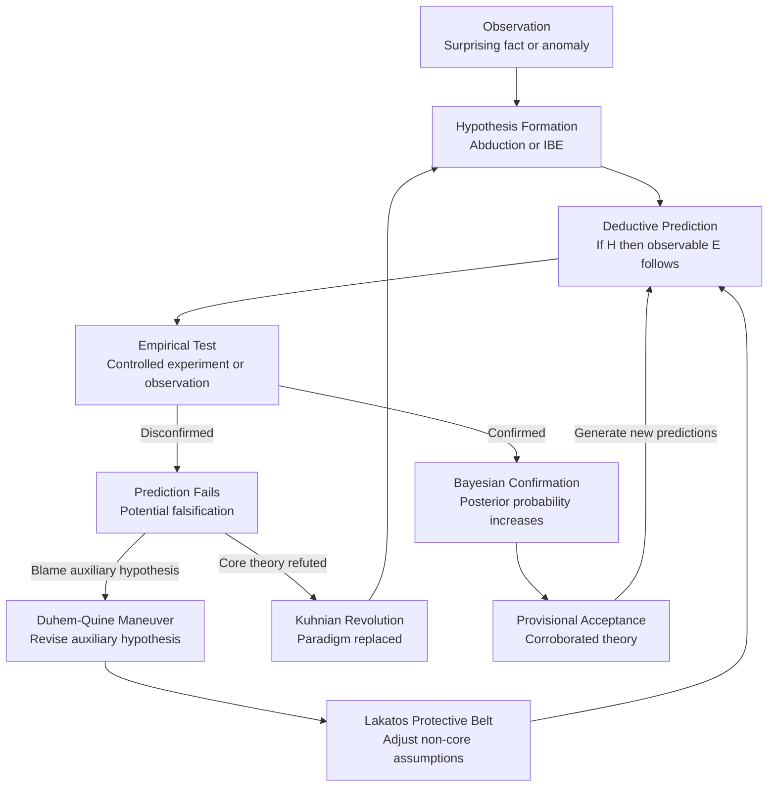

# Scientific Reasoning and Method

> [!abstract] TL;DR
> Scientific reasoning is the disciplined process of moving from observations to reliable knowledge through structured hypothesis formation, empirical testing, and rational belief revision — and the philosophy of science is the study of whether and how that process actually works. Frameworks from Bacon's inductivism to Popper's falsificationism, Kuhn's paradigms, Lakatos's research programs, and Bayesian confirmation each diagnose what makes science epistemically powerful, while the replication crisis reveals what happens when those norms break down in practice. Mastering scientific reasoning means understanding not just the canonical "scientific method" taught in schools, but the philosophical machinery underneath it and the real institutional failures that distort it.

---

## Intuition

**Analogy:** Think of science as a courtroom with a permanently open appeals process. A hypothesis enters as the defendant, presumed uncertain. Observations act as prosecution and defence witnesses. The judge (the scientific community) applies strict rules of evidence: testimony must be repeatable, cross-examinable, and falsifiable in principle. A hypothesis that cannot say anything specific enough to risk being wrong is like a defendant who claims alibi for every possible time — the court cannot evaluate it. A verdict of "not yet falsified" is not the same as "proven innocent." And crucially, no verdict is ever truly final: new evidence can reopen any case, new methodological standards can overturn old verdicts, and occasionally an entire jurisprudential system (a paradigm) turns out to have been rigged from the start.

This captures the essential tension: science is humanity's most reliable knowledge-generating machine, yet its method is philosophically contested, historically messy, and institutionally vulnerable to the same biases that corrupt any human enterprise.

---

## How It Works

### Core Mechanics

**1. Inductivism — Bacon and Mill**
Francis Bacon's *Novum Organum* (1620) proposed science as systematic induction: gather observations without preconception, tabulate instances where a phenomenon occurs, is absent, and varies in degree, then read off the underlying cause. John Stuart Mill (1843) formalized this into five methods — Agreement, Difference, Joint Method, Residues, and Concomitant Variation — that remain the template for comparative case analysis.

*The core weakness:* David Hume's problem of induction. No finite number of confirming observations logically entails a universal generalization. A thousand white swans does not prove all swans are white. Science cannot be grounded in pure induction without a further principle justifying the inference — and that principle cannot itself be justified inductively without circularity.

**2. Hypothetico-Deductive Method — Whewell and Hempel**
William Whewell (*Philosophy of the Inductive Sciences*, 1840) and Carl Hempel shifted the frame: scientists do not merely accumulate observations, they form hypotheses and then *deduce* testable observational consequences. The method:
1. Observe anomaly O
2. Hypothesize H
3. Deduce prediction E: "If H, then (under conditions C) we should observe E"
4. Run experiment; observe E or not-E
5. Confirming E raises credence in H; observing not-E disconfirms H

Hempel's *covering-law model* of explanation added precision: a scientific explanation is a valid deductive argument from laws plus initial conditions to the explanandum. The *hypothetico-deductive confirmation* schema tells us when evidence confirms a hypothesis: E confirms H if H (plus auxiliaries) predicts E and E is observed.

**3. Popper's Falsificationism and the Demarcation Problem**
Karl Popper (*Logic of Scientific Discovery*, 1934) rejected confirmation entirely as the criterion of science. His insight: no finite evidence can verify a universal law, but a single counter-instance can falsify it. Therefore the epistemically honest strategy is not to seek confirmation but to expose hypotheses to the most severe possible tests and retain only those that survive.

*Demarcation criterion:* A theory is scientific if and only if it makes *risky predictions* — predictions specific enough that they could, in principle, be shown false. Astrology, Freudian theory, and Marxist historicism fail this test because their practitioners always find a way to accommodate any result. Einstein's General Relativity passes: it predicted light deflection of exactly 1.75 arcseconds near the Sun's limb — a specific, checkable, falsifiable number.

*Corroboration:* A theory is not "confirmed" by surviving tests; it is *corroborated* — it has shown robustness under severe attempts at refutation. Corroboration is not probability; it is a record of surviving genuine risk.

**4. Kuhn's Paradigms and Scientific Revolutions**
Thomas Kuhn (*The Structure of Scientific Revolutions*, 1962) replaced Popper's logical account with a sociological-historical one. Science does not proceed by steady falsification; it operates in two alternating modes:

- *Normal science:* Research conducted within a *paradigm* — a shared framework of theories, methods, exemplars, and values. Scientists solve "puzzles" by fitting them into the paradigm. Anomalies are routinely set aside, not treated as falsifying.
- *Crisis and Revolution:* When anomalies accumulate beyond tolerance, crisis erupts. Scientists begin questioning foundational assumptions. A *paradigm shift* occurs when a new framework wins sufficient community support — not purely by logic, but by a complex mix of evidence, generational change, and sociological momentum.

Paradigm shifts (Copernican revolution, Newtonian to Einsteinian mechanics, phlogiston to oxygen theory) are *incommensurable* — rival paradigms partly disagree about what counts as evidence and what the data mean. This incommensurability is philosophically radical: it implies scientists in different paradigms partly inhabit different perceptual worlds.

**5. Lakatos's Research Programs**
Imre Lakatos (*The Methodology of Scientific Research Programmes*, 1978) synthesized Popper and Kuhn. A scientific research program has:
- *Hard core:* The central theoretical commitments that define the program and are held immune to direct falsification by methodological convention.
- *Protective belt:* Auxiliary hypotheses that absorb anomalies by being revised when predictions fail.
- *Positive heuristic:* A forward-looking strategy for developing the program.

A program is *progressive* if its modifications generate novel, confirmed predictions. It is *degenerative* if modifications are purely ad hoc — patching anomalies without predicting new phenomena. Newtonian mechanics was progressive for 200 years; classical ether theory became degenerative as each new anomaly required another arbitrary epicycle.

**6. Feyerabend's Epistemological Anarchism**
Paul Feyerabend (*Against Method*, 1975) argued that no universal methodological rule has survived the history of science intact. Every rule — "avoid ad hoc hypotheses," "require predictive novelty," "be falsifiable" — has been violated in episodes that later counted as great scientific advances. Galileo broke inductive rules. Darwin proposed a theory that had no mechanism until genetics arrived. Einstein revised the definition of simultaneity rather than accepting an anomaly.

Feyerabend's conclusion: "anything goes" — not as nihilism, but as a rejection of the claim that any fixed methodology can describe how science actually works. The most intellectually honest position is methodological pluralism.

**7. Bayesian Philosophy of Science**
Rudolf Carnap's *inductive logic* and later Howson and Urbach's *Scientific Reasoning: The Bayesian Approach* (1989) reframed confirmation probabilistically. Evidence E confirms hypothesis H if and only if P(H|E) > P(H). The degree of confirmation is the posterior/prior ratio.

Bayesian philosophy handles key problems that defeat simpler accounts:
- *Hempel's ravens paradox* (does observing a green apple confirm "all ravens are black"?) dissolves: it confirms only if the prior probability shifts, which it does, but infinitesimally.
- *Old evidence problem:* Known evidence that inspired a theory cannot raise its probability post-hoc — this captures the intuition that Newton's theory was not confirmed by explaining tides after the fact.
- *Underdetermination:* Multiple hypotheses can fit the same data, but Bayesian updating over time concentrates probability on the most predictively successful ones.

**8. Abduction in Scientific Discovery**
Scientists do not merely test hypotheses — they generate them. Charles Sanders Peirce's *abduction* is the inference from surprising fact C to hypothesis H that would, if true, explain C as a matter of course. Darwin's inference to natural selection, Wegener's inference to continental drift, Semmelweis's inference to cadaverous particles — all proceeded abductively before any formal test was possible. Abduction is the creative entry point; H-D testing is the validation step that follows.

**9. The Duhem-Quine Thesis and Underdetermination**
Pierre Duhem (1906) and W.V.O. Quine (1951) independently identified that empirical tests never target a hypothesis in isolation. Every test presupposes a network of auxiliary assumptions — calibration assumptions, background theories, instrument reliability. When a prediction fails, logic alone cannot tell you which element of the network to blame.

Consequence: *holism* — theories confront experience as a corporate body, not individually. Any hypothesis can be maintained in the face of any evidence, provided you are willing to revise enough elsewhere. This explains how Lakatos's protective belt functions: practitioners strategically shield core commitments by revising auxiliaries. Popper's simple falsification is too naive; underdetermination makes every test result ambiguous.

**10. The Replication Crisis and Methodological Lessons**
Beginning with Ioannidis's 2005 paper ("Why Most Published Research Findings Are False") and catalyzed by the Open Science Collaboration's 2015 finding that only ~36% of psychology studies replicated, the replication crisis exposed systematic methodological failure:

- *P-hacking:* Testing multiple analysis variants, outcomes, or subgroups and reporting only the significant result. This inflates the false-positive rate far above the nominal 5% α level.
- *HARKing (Hypothesizing After Results are Known):* Presenting post-hoc pattern-matching as prior hypothesis testing. The statistical protection of NHST depends on hypotheses being fixed before data collection; HARKing removes that protection without signaling it.
- *Publication bias:* Journals overwhelmingly publish significant results, creating a literature that overestimates effect sizes and underestimates null findings.
- *Low power:* Studies sized for convenience rather than statistical power report effect sizes inflated by the winner's curse (only the largest noise fluctuations cross the significance threshold).

Methodological solutions:
- *Pre-registration:* Publicly committing hypothesis, design, and analysis plan before data collection. Prevents HARKing and most forms of p-hacking.
- *Registered Reports:* Journals commit to publish based on the quality of the design, regardless of outcome. Eliminates publication bias for registered studies.
- *Meta-analysis:* Quantitative synthesis of multiple studies, applying publication-bias correction (funnel plot asymmetry, trim-and-fill, PET-PEESE). Distinguishes genuine effects from noise accumulation.
- *Open science:* Pre-registration on OSF, open data, open materials, open code — creating a verifiable audit trail. The FAIR principles (Findable, Accessible, Interoperable, Reusable) operationalize this for data.

**11. Scientific Consensus and Its Epistemic Status**
Scientific consensus is not proof, but it carries substantial epistemic weight. A consensus represents the aggregated, adversarially tested judgment of domain experts who have read the evidence, tried and failed to falsify the consensus claim, and subjected each other's work to peer scrutiny. This is epistemically far stronger than any single study. However:
- Consensus can be wrong (continental drift was rejected by consensus for decades)
- Consensus can be corrupted (tobacco industry manufacture of doubt)
- Consensus on a phenomenon can coexist with genuine uncertainty about mechanism

The correct epistemic response is not "consensus proves truth" but "consensus shifts the burden of proof substantially onto dissenters, who must show specific anomalies or methodological failures, not just assert heterodoxy."

### Flow / Architecture



---

## Key Concepts

### Secondary

- **The hypothetico-deductive schema** — Science generates hypotheses and then derives testable predictions from them, rather than reading theories off bare observations. The asymmetry is crucial: confirming a prediction does not prove the hypothesis (other hypotheses might also predict E), but a refuted prediction genuinely challenges H.
- **Hume's problem of induction** — No amount of confirming evidence logically entails a universal law. This is not a quibble: it means induction cannot be the logical foundation of science. Popper's response was to give up on confirmation altogether and rely solely on falsification.
- **Falsifiability as demarcation** — Popper's criterion distinguishes testable science from untestable metaphysics or pseudoscience. A claim must make specific, risky predictions. "Everything happens for a reason" is unfalsifiable; "the electron has a mass of 9.109×10⁻³¹ kg" is highly specific and falsifiable.
- **Paradigm** — Kuhn's term for the shared framework — theories, methods, values, and exemplary solved problems — within which normal science operates. Paradigms are not just theories; they are partly social and psychological, shaping what counts as a good problem and a good solution.
- **Normal science vs. revolution** — Normal science is puzzle-solving within a paradigm. Revolutionary science overturns the paradigm. Most scientists do normal science most of the time; revolutions are rare, disruptive, and not purely logical.

### Undergraduate

- **Mill's five methods** — Agreement (shared cause when phenomenon recurs), Difference (cause is what differs when phenomenon appears vs. disappears), Joint Method (both), Residues (subtract known causes to identify unknown remainder), Concomitant Variation (correlated variation implies causal relationship). These formalize the logic of controlled experimentation before statistical machinery existed.
- **Hempel's D-N model of explanation** — Deductive-Nomological: a fact is explained when it is the logical consequence of a universal law plus initial conditions. Criticized for allowing irrelevant explanations (the flagpole/shadow problem: deriving flagpole height from shadow length and sun angle does not explain the shadow, yet the inference is valid).
- **Popper's corroboration** — A theory that has survived many severe tests is highly corroborated. Corroboration is explicitly not a probability — it tracks boldness of predictions and severity of tests, not frequency of confirmation. The most corroborated theory can still be false.
- **Research program heuristics** — The *positive heuristic* of a Lakatos program tells scientists where to look next: what kinds of experiments to run, what mathematical extensions to develop. Newton's positive heuristic drove researchers to apply mechanics to optics, heat, and chemistry. A program without a positive heuristic has no forward momentum and is likely degenerative.
- **Incommensurability** — Kuhn's controversial claim that rival paradigms partly talk past each other because they define key terms differently and prioritize different evidence. Proponents of the Ptolemaic and Copernican systems disagreed partly about what "explaining planetary motion" meant. Full rational comparison across paradigms may be impossible in principle.
- **Carnap's inductive logic and degree of confirmation** — Rudolf Carnap attempted to build a formal inductive logic where c(H, E) quantifies the degree to which evidence E confirms hypothesis H. The project ultimately foundered on the problem of fitting a universal measure of confirmation to unbounded hypothesis spaces, but it established the probabilistic confirmation framework that Bayesian philosophy of science inherits.
- **The problem of old evidence** — A Bayesian difficulty: if evidence E is already known when hypothesis H is formulated (e.g., Newton knew about tidal phenomena before proposing gravity), then P(E) = 1 and Bayesian conditionalization cannot raise P(H). Yet intuitively, the fact that Newton's theory explains tides does support it. This problem has no fully satisfying solution within standard Bayesianism.
- **Meta-analysis** — The statistical synthesis of multiple studies investigating the same question. Provides a quantitative estimate of an effect that is more reliable than any single study, corrects for sampling variability, and can detect publication bias through funnel plot asymmetry. The Cochrane Collaboration's systematic reviews are the gold standard in clinical research.

### Graduate

- **Duhem-Quine holism in practice** — When a prediction fails, the anomaly underdetermines revision: you can save any hypothesis by adjusting auxiliaries. This is not a defeat for science — it is the engine of research program management. The methodological question is not "which hypothesis is falsified?" but "which revision generates the most novel predictions going forward?" Lakatos's progressive/degenerative distinction is the pragmatic answer.
- **Underdetermination by theory** — Even for all possible evidence, multiple incompatible theories can remain equally well-confirmed. This is Duhem-Quine generalized: not just about handling anomalies, but about the fundamental gap between any finite body of evidence and the infinite space of possible theories. Anti-realists (van Fraassen) argue this shows we cannot rationally believe theories are true about unobservables. Scientific realists respond with inference to the best explanation: the best-confirmed theory is likely approximately true because its empirical success would be miraculous otherwise.
- **Bayesian confirmation as degree of support** — The Bayes factor BF₁₂ = P(E|H₁)/P(E|H₂) measures which hypothesis better predicts the observed data, independent of priors. Unlike p-values, Bayes factors can provide evidence for a null hypothesis and naturally penalize overfitting by spreading prior probability across parameter space. A BF of 100 is decisive evidence; a BF of 1.0 means the data are equally likely under both models.
- **Inference to the Best Explanation as scientific realism** — Hilary Putnam and Richard Boyd argue that the predictive success of scientific theories is best explained by their approximate truth. The no-miracles argument: if electrons do not really exist, it would be a cosmic coincidence that assuming they do generate such accurate predictions. This argument is itself abductive — it uses IBE at the meta-level to argue for scientific realism.
- **P-hacking's statistical mechanics** — If an analyst tests k independent sub-hypotheses each at α = 0.05 significance, the family-wise error rate is 1 - 0.95^k. At k = 14 tests, there is a greater-than-50% chance of at least one false positive. Modern pre-registration and Bayesian analysis with pre-specified models are the primary defenses. Registered Reports additionally remove the incentive for p-hacking by separating the decision to publish from the result.
- **Feyerabend's historical argument** — Feyerabend's most compelling examples: (1) Galileo's telescopic observations were not initially accepted as reliable evidence because there was no theory of the telescope; he succeeded partly by bluster and rhetoric, not methodological purity. (2) The Copernican system was empirically worse than the Ptolemaic system at the time Copernicus proposed it (the Ptolemaic system had been refined over centuries). Rule-governed methodology would have kept geocentrism. The lesson is not that methodology is worthless, but that it must be applied with historical and contextual judgment, not mechanical prescription.
- **Open Science practices** — Pre-registration (osf.io), Registered Reports (committed publication regardless of outcome), data sharing under FAIR principles, open code, adversarial collaboration, multi-site replication studies, and incentive reform (crediting replication attempts rather than only novel positive findings). These are engineering solutions to the institutional failure modes that generated the replication crisis.

---

## Python Demo

```python
# Hypothetico-Deductive Model Selection and Popperian Falsification Test
# Generates noisy linear data, fits two competing hypotheses (H1: linear,
# H2: quadratic), compares by AIC/BIC, and implements a Popperian
# falsification test using the 2-sigma prediction interval.

import numpy as np
import matplotlib.pyplot as plt

np.random.seed(42)

# True data-generating process: y = 2x + 1 + Gaussian noise
n = 40
x = np.linspace(0, 10, n)
true_slope, true_intercept = 2.0, 1.0
noise_std = 2.0
y = true_slope * x + true_intercept + np.random.normal(0, noise_std, n)

# --- H1: Linear model (correct hypothesis, k=2 parameters) ---
h1_coeffs = np.polyfit(x, y, 1)
h1_pred = np.polyval(h1_coeffs, x)
h1_rss = float(np.sum((y - h1_pred) ** 2))
h1_k = 2

# --- H2: Quadratic model (incorrect hypothesis, k=3 parameters) ---
h2_coeffs = np.polyfit(x, y, 2)
h2_pred = np.polyval(h2_coeffs, x)
h2_rss = float(np.sum((y - h2_pred) ** 2))
h2_k = 3

# --- AIC and BIC (concentrated log-likelihood form, constants omitted) ---
# AIC = n * ln(RSS/n) + 2k
# BIC = n * ln(RSS/n) + k * ln(n)
def aic(rss, n_obs, k):
    return n_obs * np.log(rss / n_obs) + 2.0 * k

def bic(rss, n_obs, k):
    return n_obs * np.log(rss / n_obs) + k * np.log(n_obs)

h1_aic = aic(h1_rss, n, h1_k)
h2_aic = aic(h2_rss, n, h2_k)
h1_bic = bic(h1_rss, n, h1_k)
h2_bic = bic(h2_rss, n, h2_k)

print("=== Hypothetico-Deductive Model Selection ===")
print(f"  H1 Linear:    RSS={h1_rss:.2f}  AIC={h1_aic:.2f}  BIC={h1_bic:.2f}")
print(f"  H2 Quadratic: RSS={h2_rss:.2f}  AIC={h2_aic:.2f}  BIC={h2_bic:.2f}")
winner_aic = "H1 Linear" if h1_aic < h2_aic else "H2 Quadratic"
winner_bic = "H1 Linear" if h1_bic < h2_bic else "H2 Quadratic"
print(f"  AIC selects: {winner_aic}")
print(f"  BIC selects: {winner_bic}")
print()

# --- Popperian Falsification Test ---
# Residual standard error for H1 (degrees of freedom = n - k)
sigma = np.sqrt(h1_rss / (n - h1_k))
lower_band = h1_pred - 2.0 * sigma
upper_band = h1_pred + 2.0 * sigma

outside = (y < lower_band) | (y > upper_band)
n_outside = int(np.sum(outside))
pct_outside = 100.0 * n_outside / n

print("=== Popperian Falsification Test on H1 ===")
print(f"  Residual sigma: {sigma:.3f}")
print(f"  2-sigma band: mean +/- {2*sigma:.2f}")
print(f"  Points outside band: {n_outside} / {n}  ({pct_outside:.1f}%)")
print(f"  Expected under valid Gaussian model: ~5.0%  ({0.05*n:.1f} points)")
verdict = "NOT FALSIFIED" if pct_outside <= 10.0 else "FALSIFIED"
print(f"  Verdict: H1 is {verdict} at the 10% outlier threshold")

# --- Visualization: one figure, two subplots ---
x_fine = np.linspace(-0.3, 10.3, 300)
h1_fine = np.polyval(h1_coeffs, x_fine)
h2_fine = np.polyval(h2_coeffs, x_fine)
upper_fine = h1_fine + 2.0 * sigma
lower_fine = h1_fine - 2.0 * sigma

fig, axes = plt.subplots(1, 2, figsize=(13, 5))
fig.suptitle(
    "Hypothetico-Deductive Model Selection and Popperian Falsification",
    fontsize=12,
    fontweight="bold",
)

# Left panel — competing hypotheses scored by AIC
ax1 = axes[0]
ax1.scatter(x, y, color="dimgray", alpha=0.75, zorder=3, s=35, label="Observed data")
ax1.plot(
    x_fine, h1_fine, color="steelblue", linewidth=2.5,
    label=f"H1 Linear  (AIC={h1_aic:.1f})"
)
ax1.plot(
    x_fine, h2_fine, color="crimson", linewidth=2.0, linestyle="--",
    label=f"H2 Quadratic  (AIC={h2_aic:.1f})"
)
ax1.set_xlabel("x", fontsize=11)
ax1.set_ylabel("y", fontsize=11)
ax1.set_title("Competing Hypotheses\nH-D Model Selection by AIC/BIC")
ax1.legend(fontsize=9)
ax1.grid(alpha=0.3)
ax1.spines["top"].set_visible(False)
ax1.spines["right"].set_visible(False)

# Right panel — Popperian falsification: which points escape the 2-sigma band?
ax2 = axes[1]
ax2.fill_between(
    x_fine, lower_fine, upper_fine,
    alpha=0.18, color="steelblue", label="2-sigma prediction interval"
)
ax2.plot(x_fine, h1_fine, color="steelblue", linewidth=2.5, label="H1 Linear fit")
in_band = ~outside
ax2.scatter(
    x[in_band], y[in_band],
    color="steelblue", alpha=0.8, zorder=3, s=35,
    label=f"Inside band  (n={int(np.sum(in_band))})"
)
ax2.scatter(
    x[outside], y[outside],
    color="crimson", marker="x", zorder=4, s=80, linewidths=2,
    label=f"Outside band  (n={n_outside}) — falsification candidates"
)
ax2.set_xlabel("x", fontsize=11)
ax2.set_ylabel("y", fontsize=11)
ax2.set_title("Popperian Falsification Test\n2-sigma Prediction Interval on H1")
ax2.legend(fontsize=9)
ax2.grid(alpha=0.3)
ax2.spines["top"].set_visible(False)
ax2.spines["right"].set_visible(False)

plt.tight_layout()
plt.show()
```

The left panel shows that H1 (linear) and H2 (quadratic) both fit the data visually, but AIC and BIC penalize H2's extra parameter and select H1 — the correct model. This operationalizes the hypothetico-deductive principle that simpler models are preferred when they explain the data equally well. The right panel shows that ~5% of points fall outside the 2-sigma band of H1, consistent with the model being valid (Gaussian noise assumption holds). A model is *Popperianly falsified* when systematically too many points escape the prediction interval, signaling that the model's assumptions are violated.

---

## Real-World Applications

1. **Wegener's Continental Drift (1912)** — Alfred Wegener noticed the jigsaw-fit of continental coastlines, matching fossil records and geological strata across the Atlantic. His inference was abductive: the best explanation of this extraordinary consilience was that the continents had once been joined and drifted apart. The geophysical community rejected his hypothesis for four decades — not irrationally, because no mechanism for moving continents was known. It was only in the 1950s-60s, when seafloor spreading and paleomagnetism provided the mechanism (the Lakatos hard core found a viable positive heuristic), that the paradigm shifted. This exemplifies the Duhem-Quine dynamic: Wegener's core hypothesis was preserved by eventually finding new auxiliaries, not by initial falsification.

2. **Semmelweis and Childbed Fever (1847)** — Ignaz Semmelweis observed that mortality in the doctor-attended maternity ward was three times that in the midwife-attended ward. He systematically applied Mill's Method of Difference: the ward staffed by doctors performing autopsies had the higher mortality; the ward staffed by midwives did not. The best explanation was cadaverous transmission — an abductive inference that preceded germ theory by two decades. His intervention worked, but the medical establishment rejected his findings partly because germ theory (the mechanism) did not yet exist. The replication crisis analog: his contemporaries lacked pre-registration or standardized protocols, and opposition was driven by status considerations rather than data.

3. **The Priming Replication Failures (2011–2015)** — Social priming studies — showing that reminders of old age make people walk slower, or that holding a warm cup makes people judge a stranger as warmer — dominated social psychology in the 2000s. Beginning with Doyen et al.'s (2012) failed replication of Bargh's "old age" priming, and culminating in the Open Science Collaboration's 2015 report, it became clear that many of these effects were p-hacked, HARKed, or underpowered. Pre-registration (committing the hypothesis before data collection) has since been shown to approximately halve the positive-result rate in social psychology, which is the correct response: pre-registered studies are more likely to reflect real effects, not researcher degrees of freedom.

4. **COVID-19 Vaccine Efficacy Trials (2020–2021)** — The Pfizer-BioNTech and Moderna mRNA vaccine trials are textbook hypothetico-deductive science under time pressure. Hypotheses were pre-specified (vaccine will reduce symptomatic COVID-19 by at least 50%), randomized controlled trial designs were pre-registered, statistical analysis plans were filed with regulators before unblinding. The trials were double-blind, preventing HARKing. Meta-analyses pooling multiple trials and real-world effectiveness data then updated the Bayesian posterior on vaccine efficacy continuously as new evidence emerged. The combination of pre-registration, blinding, and pre-specified primary endpoints is the best institutional implementation of falsificationist norms in applied science.

5. **Climate Science Consensus and the Manufactured Doubt Playbook** — The scientific consensus on anthropogenic climate change is based on convergent evidence from atmospheric physics, paleoclimatology, ocean heat content, satellite data, and ice cores — a Lakatosian progressive research program with a continuously productive positive heuristic. The fossil fuel industry's deliberate creation of doubt (the "merchants of doubt" strategy documented by Oreskes and Conway) mimics legitimate scientific scepticism in form while violating it in intent: funding outlier researchers, cherry-picking anomalies, and treating the absence of 100% certainty as equivalent to no evidence. Understanding the epistemics of scientific consensus — and distinguishing genuine from manufactured uncertainty — is a critical application of scientific reasoning in public life.

---

## Common Pitfalls

- **Naive falsificationism** — Treating a failed prediction as decisive refutation of a single hypothesis. In practice, every test targets H plus a bundle of auxiliaries; the Duhem-Quine thesis means you always have the option to revise an auxiliary rather than abandon H. The practical question is not "is H falsified?" but "is revising H or revising the auxiliary the more scientifically productive response?" Lakatos's progressive/degenerative criterion is the operationalization.

- **Confirmation bias as paradigm blindness** — Within Kuhn's normal science, anomalies are routinely explained away or set aside. This is not irrational — paradigms are worth protecting from noise. But it becomes pathological when anomalies multiply and scientists suppress them by social or institutional pressure rather than engaging them. The replication crisis is partly a systemic version of this: publication bias and career incentives collectively acted like paradigm pressure against null results.

- **P-hacking and the forking paths** — Every researcher-degree-of-freedom (which outliers to exclude, which covariates to include, which time window to use, when to stop collecting data) is a potential garden of forking paths. A single "significant" result from one path out of twenty explored is not a 5% false-positive rate; it is far higher, depending on the total number of undisclosed alternatives. The fix is not to eliminate flexibility but to declare all paths pre-hoc via pre-registration or to correct for multiple comparisons.

- **Mistaking corroboration for verification** — Popper was explicit: surviving severe tests does not prove a theory true, it corroborates it. A theory that has passed a hundred tests can still be wrong about the 101st. Newtonian mechanics passed every test for 200 years before General Relativity revealed its limits. High corroboration justifies confident practical use; it does not justify metaphysical certainty.

- **Ad hoc immunization** — Revising a hypothesis specifically to handle a counter-instance, without generating any new testable predictions, is Lakatos's marker of a degenerative program. The move is logically available (Duhem-Quine permits it) but epistemically hollow. Psychoanalysis and astrology are the canonical cases: every anomaly produces a new sub-theory that explains that anomaly but predicts nothing beyond it.

- **Conflating consensus with proof** — Scientific consensus carries strong but defeasible epistemic weight. The history of science includes consensuses that were overturned (continental drift, heliocentrism, stomach ulcers being caused by stress). The correct response to consensus is strong presumption, not certainty — and strong demand for evidence from those who claim the consensus is wrong, rather than treating all dissent as equally credible.

- **Publication bias in meta-analysis** — Meta-analyses are only as good as the literature they pool. If the literature is systematically missing null results, the meta-analytic effect size estimate is biased upward. Funnel plot asymmetry and trim-and-fill corrections provide partial remedies, but the underlying problem requires systematic changes to publication incentives (registered reports, pre-registered studies).

---

## Related Concepts

- [[Inductive_Logic]] — Bacon's inductivism and Mill's methods are the historical root of systematic scientific reasoning; Hume's problem of induction is the foundational challenge that makes pure inductivism insufficient and motivates both Popper and the Bayesian response.
- [[Statistical_Inference_and_Hypothesis_Testing]] — NHST operationalizes the H-D method in quantitative science; the replication crisis is a direct consequence of NHST's misuse (p-hacking, threshold worship, HARKing), making an understanding of what p-values do and do not mean essential for evaluating scientific claims.
- [[Bayesian_Reasoning]] — Bayesian confirmation theory is the leading formal alternative to both inductivism and falsificationism; it subsumes Hempel's confirmation paradoxes, handles old evidence problems in modified form, and provides the Bayes factor as a principled model-comparison tool.
- [[Abductive_Reasoning_and_Inference_to_Best_Explanation]] — Abduction is the hypothesis-generation step that precedes H-D testing; IBE is how Darwin, Wegener, and Semmelweis identified candidate theories; the relationship between abduction and Bayesian confirmation theory maps loosely onto the relationship between prior elicitation and posterior inference.
- [[Causal_Reasoning]] — Mill's methods are the classical logic of causal inference; randomized controlled trials implement the Method of Difference under experimental control; modern causal inference theory (Pearl's do-calculus) provides the formal extension that classical scientific method lacked.
- [[Logical_Fallacies_Overview]] — Ad hoc reasoning, confirmation bias, the hasty generalization, and the appeal to nature all appear as failure modes of scientific reasoning; understanding informal fallacies clarifies why certain moves in scientific debate are epistemically defective.
- [[Hypothesis_Testing]] — The statistical machinery (Type I and Type II errors, power, effect size, confidence intervals) that implements the quantitative version of H-D confirmation; understanding its formal properties is prerequisite to understanding both its correct use and the p-hacking failure mode.
- [[Probability_and_Statistics]] — The mathematical substrate for Bayesian confirmation, AIC/BIC model selection, meta-analytic pooling, and the statistical power calculations that underlie replication crisis diagnosis.

---

## Review Questions

### Secondary

1. Popper argued that the problem with astrology and Freudian psychoanalysis is not that they have been shown wrong but that they cannot, in principle, be shown wrong. What does he mean by this, and why does unfalsifiability disqualify a claim from being scientific rather than merely untested? Give a concrete example of a claim that is falsifiable but currently unconfirmed, contrasted with one that is unfalsifiable.

2. A researcher runs an experiment, finds no significant effect, then adds a covariate, drops two outliers, restricts to a subgroup, and reports the resulting p = 0.04 as evidence for the hypothesis. Identify which methodological norm this violates, explain why it inflates the false-positive rate beyond 5%, and describe the specific institutional mechanism (name it precisely) that would have prevented this.

3. Kuhn claimed that Copernicus's heliocentric model was empirically *worse* than Ptolemy's geocentric model at the time it was proposed — it fit the available data less precisely. If that is true, why was choosing Copernicus over Ptolemy not simply irrational? What does this case reveal about how paradigm shifts actually work?

### Undergraduate

1. The Duhem-Quine thesis implies that no single experiment can definitively falsify a hypothesis, since you can always revise an auxiliary assumption instead. Does this mean Popper was simply wrong, or can falsificationism be salvaged in a weaker form? Use Lakatos's distinction between progressive and degenerative research programs to construct a modified falsificationist position that accommodates Duhem-Quine.

2. A meta-analysis of 40 studies on a dietary supplement finds an overall effect size of d = 0.35 with a 95% confidence interval of [0.18, 0.52] and significant funnel plot asymmetry suggesting publication bias. The trim-and-fill corrected estimate is d = 0.14 with CI [-0.02, 0.30]. How should you interpret the uncorrected vs. corrected estimates? What does the asymmetry tell you about the underlying literature, and what would a registered reports policy for this field have changed?

3. Newton's gravitational theory was used to discover Neptune: astronomers noticed Uranus deviated from predicted orbit and inferred (abductively) that an unknown planet was pulling it. When early observations of Mercury's perihelion precession also deviated from Newtonian predictions, the response was different — Mercury's anomaly was eventually resolved by General Relativity, not by a new planet. Using the Lakatos framework, explain why the two anomalies received different treatment and what criteria justify the difference.

### Graduate

1. The "no-miracles argument" for scientific realism holds that the predictive success of mature scientific theories would be a miracle if those theories were not approximately true. Bas van Fraassen responds that natural selection among theories (successful ones survive and proliferate) explains predictive success without truth. Evaluate both arguments: does the evolutionary analogy successfully defuse the no-miracles argument, or does it raise its own unexplained coincidence? What role does inference to the best explanation play in this debate, and can the debate itself be settled empirically?

2. Feyerabend argued that if scientists had rigorously followed methodological rules at key historical junctures — requiring theories to fit all available data, prohibiting ad hoc hypotheses, requiring predictive novelty — the history of science would have been impoverished. Construct the strongest possible response from a Lakatos or Bayesian methodologist: can a principled methodology accommodate the kind of epistemic generosity that allowed Copernicus and Wegener to succeed? Where does the Feyerabend challenge cut deepest?

3. Pre-registration is now widely advocated as the primary solution to the replication crisis. However, critics argue that pre-registration privileges confirmatory over exploratory science, creates a two-tier literature where pre-registered studies are over-trusted and unregistered ones under-trusted, and introduces perverse incentives to register vague hypotheses that cannot be failed. Evaluate these objections. Do they argue against pre-registration or for a more nuanced implementation? What additional institutional changes would be needed to restore the long-run calibration of scientific inference across confirmatory and exploratory research?

---

## Sources

- [Popper, Karl. *The Logic of Scientific Discovery*. Routledge Classics, 1959/2002](https://www.routledge.com/The-Logic-of-Scientific-Discovery/Popper/p/book/9780415278447) — Original argument for falsificationism and the demarcation criterion; the foundational text of 20th-century philosophy of science.
- [Kuhn, Thomas S. *The Structure of Scientific Revolutions*, 4th ed. University of Chicago Press, 1962/2012](https://press.uchicago.edu/ucp/books/book/chicago/S/bo13179781.html) — Paradigms, normal science, crisis, and revolution; the most influential book in 20th-century history and philosophy of science.
- [Lakatos, Imre. "Falsification and the Methodology of Scientific Research Programmes." In *Criticism and the Growth of Knowledge*, eds. Lakatos and Musgrave. Cambridge University Press, 1970](https://www.cambridge.org/core/books/criticism-and-the-growth-of-knowledge/falsification-and-the-methodology-of-scientific-research-programmes/5E3FC4E8D80A9CB5966C3B32C7EC6A2A) — The protective belt / hard core framework and the progressive/degenerative distinction.
- [Open Science Collaboration. "Estimating the Reproducibility of Psychological Science." *Science* 349.6251 (2015): aac4716](https://www.science.org/doi/10.1126/science.aac4716) — The landmark replication study finding ~36% replication rate in psychology; the empirical catalyst for open science reform.
- [Ioannidis, John P.A. "Why Most Published Research Findings Are False." *PLOS Medicine* 2.8 (2005): e124](https://journals.plos.org/plosmedicine/article?id=10.1371/journal.pmed.0020124) — Mathematical demonstration that under realistic assumptions of prior probability, statistical power, and researcher degrees of freedom, the majority of published findings are false positives.

---

#scientific-reasoning #scientific-method #falsification #demarcation #philosophy-of-science
