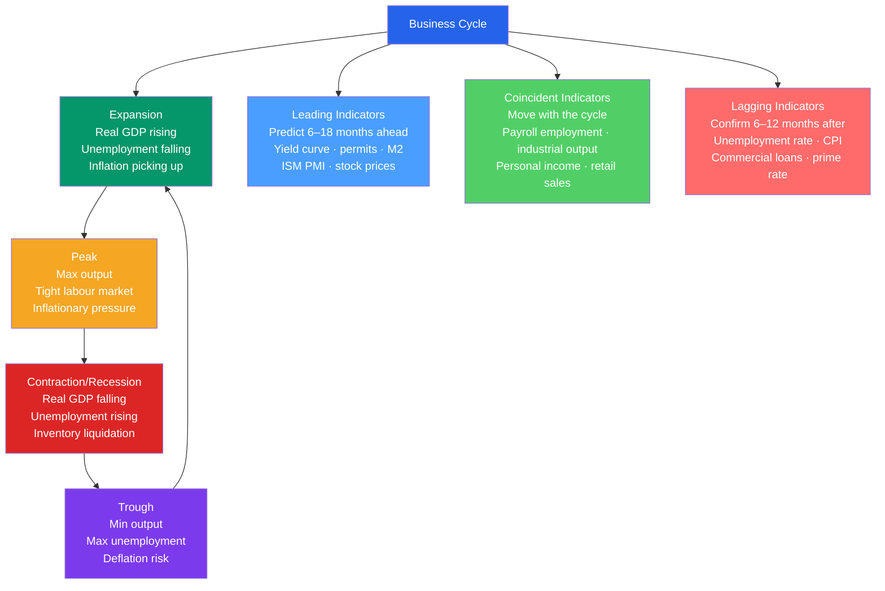

# 📉 Business Cycle Indicators

> [!abstract] TL;DR
> The business cycle describes the periodic expansion and contraction of aggregate economic activity around its long-run trend. NBER dates US recessions using a committee that looks at GDP, employment, income, and sales — not the informal "two consecutive quarters" rule. Leading indicators (yield curve, building permits, stock prices) predict turning points; lagging indicators (unemployment, business loans) confirm them.

## Intuition — analogy FIRST

Think of the economy like a patient's health. You want to know before they get sick (leading indicators — like slightly elevated blood pressure or changed heart rate), confirm they are sick (coincident indicators — fever and symptoms), and verify they've recovered (lagging indicators — bloodwork returning to normal levels weeks after feeling better).

No single indicator is reliable enough alone — that's why NBER uses a panel approach and why the Conference Board's Leading Economic Index (LEI) aggregates 10 series. The yield curve (when short-term rates exceed long-term rates, the curve "inverts") has predicted every US recession since 1955 with only one false positive.

---

## How It Works

---

## Key Concepts / Details

### NBER Recession Dating

The **National Bureau of Economic Research (NBER)** Business Cycle Dating Committee officially dates US recessions. Their definition:

> "A significant decline in economic activity that is spread across the economy and that lasts more than a few months."

They look at six monthly indicators:
1. Nonfarm payroll employment
2. Real personal income less transfers
3. Real consumer spending
4. Wholesale-retail sales
5. Employment (household survey)
6. Industrial production

The popular "**two consecutive quarters of negative real GDP growth**" rule is a useful approximation but is *not* the NBER definition. The 2001 recession involved only one quarter of negative GDP growth; COVID (2020) involved one quarter.

### Conference Board Leading Economic Index (LEI)

The 10-component LEI:

| Component | Contribution |
|-----------|-------------|
| Average weekly hours, manufacturing | Firms cut hours before laying off workers |
| Initial claims for unemployment insurance | Rising claims = trouble ahead |
| New orders, consumer goods | Demand signal |
| ISM Index of new orders | Manufacturing outlook |
| New orders, capital goods (ex-defense) | Investment intentions |
| Building permits, new private housing | Construction pipeline |
| S&P 500 stock price index | Market expectations |
| Leading Credit Index | Financial conditions |
| 10-year – fed funds interest rate spread | Yield curve |
| Average consumer expectations | Consumer confidence |

As of 2024, the LEI had declined for 24 consecutive months (the longest run since 2007-08) without triggering a recession — raising questions about its reliability in an era of services-dominated GDP.

### The Yield Curve as Recession Predictor

The **yield curve spread** (10-year Treasury minus 2-year Treasury) inverts (goes negative) before every US recession since 1955:

| Inversion date | Recession start | Lead time |
|---------------|----------------|-----------|
| Aug 2006 | Dec 2007 | 16 months |
| Feb 2000 | Mar 2001 | 13 months |
| Aug 1989 | Jul 1990 | 11 months |
| Jul 2022 | — (no recession as of mid-2024) | — |

The mechanism: short-term rates (controlled by the Fed) rise above long-term rates (set by the market) when the Fed tightens. Long rates stay low if the market expects a growth slowdown and future rate cuts — which is exactly when a recession is likely.

### Okun's Law and the Output Gap

The **output gap** ($Y - Y^*$) measures the deviation of actual GDP from potential:

$$\text{Output Gap} = \frac{Y - Y^*}{Y^*} \times 100\%$$

Okun's Law links the output gap to the unemployment gap:

$$Y - Y^* \approx -2(u - u^*) \times Y^*$$

The CBO estimates potential GDP by extrapolating the economy's non-inflationary growth capacity using capital, labour, and total factor productivity trends.

### Business Cycle Stylised Facts

Kaldor's stylised facts for the business cycle:
- Consumption is **less volatile** than GDP (households smooth consumption)
- Investment is **3× more volatile** than GDP (the accelerator effect)
- Government spending is **countercyclical** (automatic stabilisers, discretionary stimulus)
- Net exports are **countercyclical** (trade balance worsens in expansions as imports rise)
- Inflation is **procyclical** and **lagging** — rises in late expansion, falls in recession
- Unemployment is **countercyclical** and **lagging** — peaks months after the trough

---

## Real-World Notes

- **2008–09 Great Recession:** NBER dated the start as December 2007 (peak) and end as June 2009 (trough) — 18 months, the longest post-war recession. The yield curve had inverted in August 2006, 16 months early.
- **COVID-19 Recession (2020):** The shortest recession on record — just 2 months (February–April 2020). NBER dated the peak in February 2020 and the trough in April 2020. The speed of the fiscal response ($2.2 trillion CARES Act) and the V-shaped recovery were unprecedented.
- **2022-23 "immaculate disinflation":** US unemployment remained near record lows (3.4%) even as the Fed hiked 525 bps. The economy defied the traditional Phillips curve and Okun's Law predictions — suggesting supply-side improvements (labour force participation recovery, supply chain normalisation) played a major role.
- **Japan's "lost decade":** Japan entered a prolonged stagnation after its asset bubble burst in 1990. The business cycle effectively flat-lined for 10+ years, with the output gap persistently negative and monetary policy stuck at the zero lower bound — a preview of challenges many advanced economies would face post-2008.

---

## Common Pitfalls

- **Applying the "two-quarter rule" as official.** It's a heuristic, not the NBER definition. The 2020 recession lasted two months and only one quarter had negative GDP.
- **Confusing leading and lagging indicators.** The unemployment rate is a *lagging* indicator — it peaks 6–12 months *after* the recession ends. Waiting for unemployment to fall before calling recovery misses months of expansion.
- **Over-relying on any single indicator.** The LEI, yield curve, and PMI each have false positives/negatives. The NBER committee uses multiple series precisely because no single measure is sufficient.
- **Ignoring data revisions.** GDP figures are revised substantially — the "advance" estimate often changes by 1–2 percentage points. Real-time recession dating is much harder than it looks in historical data.

---

## Related Concepts

- [[_MOC_National_Accounts|↑ Section MOC]]
- [[GDP_and_Measurement]] — GDP is the primary coincident indicator
- [[Unemployment]] — NAIRU and cyclical unemployment across the cycle
- [[IS_LM_Model]] — Short-run output determination and the business cycle mechanism
- [[Aggregate_Demand]] — Demand shocks as drivers of the cycle
- [[Automatic_Stabilizers]] — Fiscal policy that automatically smooths the cycle
- [[Government_Spending_Multiplier]] — How fiscal stimulus amplifies or dampens cycles

---

## Review Questions

1. The 10-year–2-year yield spread turned negative in July 2022. A recession did not occur through mid-2024. Does this mean the yield curve is no longer a useful predictor? Discuss two reasons why the predictive relationship might have weakened.
2. NBER dates recessions using a committee rather than a mechanical rule. Explain two scenarios where the "two-quarter rule" would give the wrong answer, and describe what information the NBER committee looks at instead.
3. Using the stylised facts of the business cycle, explain why investment is typically more volatile than consumption. What mechanism (the accelerator) makes investment so procyclical?

---

## Sources

- N. Gregory Mankiw, *Macroeconomics*, 10th ed., Ch. 9 — Introduction to Economic Fluctuations
- Olivier Blanchard, *Macroeconomics*, 8th ed., Ch. 15 — Output, the Interest Rate, and the Exchange Rate
- NBER Business Cycle Dating Committee, https://www.nber.org/research/business-cycle-dating
- Conference Board, "The Conference Board Leading Economic Index," https://www.conference-board.org

#macroeconomics #economics #national-accounts #business-cycle #leading-indicators
