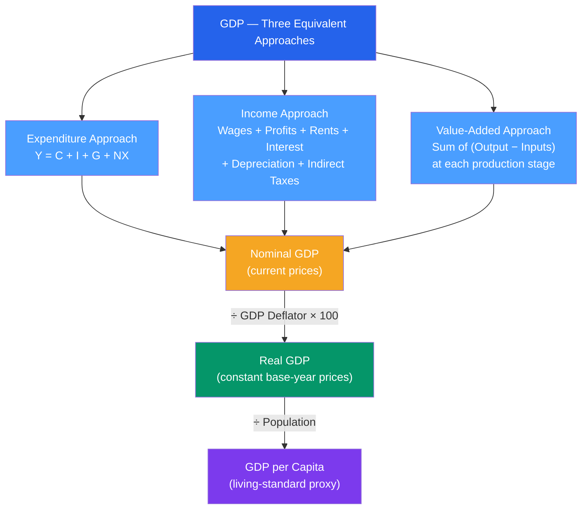

# 📊 GDP and Measurement

> [!abstract] TL;DR
> **Gross Domestic Product (GDP)** is the total market value of all final goods and services produced within a country's borders in a given period. It can be measured three equivalent ways — expenditure ($Y = C + I + G + NX$), income (wages + profits + rents + interest), and value-added (sum of each firm's contribution) — and the choice of deflator converts nominal GDP into real GDP to strip out price changes.

## Intuition — analogy FIRST

Think of the entire economy as a kitchen. Every dish served to the final customer counts as GDP — but only the *final* dish, not every ingredient that changed hands along the way. A wheat farmer sells to a miller ($1), the miller sells flour to a bakery ($2), the bakery sells bread to you ($3). GDP counts $3, not $6, because we only count *final sales* — counting intermediate goods would double-count the same value.

GDP measures output at your *borders*, not who owns the production. A Toyota plant in Kentucky adds to US GDP. A US-owned factory in Mexico adds to Mexican GDP. That is the "D" in GDP — **Domestic**.

---

## How It Works

---

## Key Concepts / Details

### The Expenditure Approach

The most widely quoted breakdown:

$$Y = C + I + G + NX$$

| Component | Definition | US share (~2023) |
|-----------|-----------|-----------------|
| $C$ — Consumption | Household spending on goods/services | ~68% of GDP |
| $I$ — Investment | Business fixed investment + residential + inventory change | ~18% |
| $G$ — Government | Federal + state/local spending on goods/services (not transfers) | ~17% |
| $NX$ — Net Exports | Exports minus imports ($X - M$) | ~−4% |

> [!warning] Government Transfers ≠ G
> Social Security, Medicare, and unemployment benefits are **transfer payments** — they are NOT counted in G because the government buys no goods or services. They show up in C when households spend the money.

### Nominal vs Real GDP

**Nominal GDP** values output at *current* prices. If prices rise 5% and real production is flat, nominal GDP rises 5% — but nothing real happened.

$$\text{Real GDP} = \frac{\text{Nominal GDP}}{\text{GDP Deflator}} \times 100$$

**GDP growth rate** (real, annualised) is the headline number released by BEA (US), ONS (UK), or Eurostat (EU).

- US GDP in 2023: ~$27.4 trillion (nominal), ~$22.4 trillion (chained 2017 dollars, real)
- China GDP in 2023: ~$17.7 trillion (nominal USD), but ~$34 trillion at PPP

### Purchasing Power Parity (PPP)

Market exchange rates distort cross-country comparisons: a haircut costs $50 in New York but $3 in Hanoi. PPP exchange rates equate the cost of a common basket of goods across countries.

$$\text{PPP GDP} = \text{GDP} \times \frac{P_{\text{reference}}}{P_{\text{local}}}$$

By PPP, **China** has the world's largest economy. By market exchange rates, the **US** still leads (as of 2023-2024).

### GNP and GNI

| Measure | Formula | What it captures |
|---------|---------|-----------------|
| GDP | Output within borders | Domestic production |
| GNP | GDP + net factor income from abroad | Production by residents |
| GNI | GNP adjusted for subsidies | National income basis |

For most large, closed economies (US, EU), GDP ≈ GNP. For Ireland (multinational-heavy), they diverge dramatically — Ireland uses GNI* as its preferred measure.

### What GDP Misses

GDP is the best single summary of economic output but excludes:
- **Household production** — cooking, childcare, home repair
- **Leisure and well-being** — working fewer hours improves welfare but shrinks GDP
- **Income distribution** — two countries can have identical GDP with very different inequality (Gini coefficient)
- **Sustainability** — resource depletion and pollution damage future GDP but boost current GDP
- **Shadow/informal economy** — the IMF estimates 15–20% of world GDP is informal

---

## Real-World Notes

- **COVID-19 shock (2020):** US real GDP fell 31.4% annualised in Q2 2020 — the sharpest single-quarter contraction on record. The rebound in Q3 2020 (+33.8% annualised) was equally unprecedented. Full-year 2020 GDP declined 2.8%.
- **China's growth miracle:** China averaged ~10% real GDP growth per year from 1980 to 2010, lifting ~800 million people out of poverty — the fastest sustained growth episode in economic history.
- **Ireland's statistical quirk:** In 2015, Ireland's GDP surged 26% in a single year when US multinationals re-domiciled IP assets there. Real economic activity barely changed. This is why Ireland publishes GNI* (modified GNI).
- **BEA revisions:** The US Bureau of Economic Analysis releases an advance GDP estimate ~30 days after quarter-end, then a preliminary revision at 60 days, and a final at 90 days. The advance estimate often moves by ±1 percentage point.

---

## Common Pitfalls

- **Double-counting intermediate goods.** Only final goods count in GDP; the value-added approach avoids this by subtracting input costs at each stage.
- **Confusing nominal and real growth.** Always specify which you mean. A country with 10% nominal growth and 8% inflation has only ~2% real growth.
- **Transfers in government spending.** Social Security and welfare payments are *not* G — they are redistributions that enter GDP only when spent by households.
- **GDP ≈ welfare.** GDP per capita correlates with living standards but ignores distribution, health, education quality, and environmental sustainability.
- **Annualised vs non-annualised.** US reports GDP growth annualised (multiply quarterly rate by 4); Europe reports actual quarterly % change. A 2% US quarterly growth = 8% annualised — don't mix conventions.

---

## Related Concepts

- [[_MOC_National_Accounts|↑ Section MOC]]
- [[National_Income_Identity]] — The $Y = C + I + G + NX$ breakdown in detail and the saving-investment identity
- [[Price_Indices_Inflation]] — The GDP deflator and how real GDP is constructed
- [[Business_Cycle_Indicators]] — How GDP growth relates to the business cycle and NBER recession dating
- [[Unemployment]] — Okun's Law: a 1% output gap ≈ 0.5% higher unemployment
- [[Solow_Growth_Model]] — Why GDP per capita grows over the long run

---

## Review Questions

1. A country's nominal GDP grew from $1 trillion to $1.05 trillion while the GDP deflator rose from 100 to 103. Calculate real GDP growth and explain whether the country is better off.
2. Why does the expenditure approach not count the steel sold by a steel mill to an auto manufacturer? What happens to that value?
3. The US has a nominal GDP larger than China's, but China's PPP-adjusted GDP is larger. Explain why PPP adjustments change the ranking and give an intuition for what a PPP exchange rate equalises.

---

## Sources

- N. Gregory Mankiw, *Macroeconomics*, 10th ed., Ch. 2 — The Data of Macroeconomics
- Olivier Blanchard, *Macroeconomics*, 8th ed., Ch. 2 — A Tour of the Book
- US Bureau of Economic Analysis (BEA) — National Income and Product Accounts, https://www.bea.gov
- IMF World Economic Outlook Database — https://www.imf.org/en/Publications/WEO

#macroeconomics #economics #national-accounts #GDP #measurement
