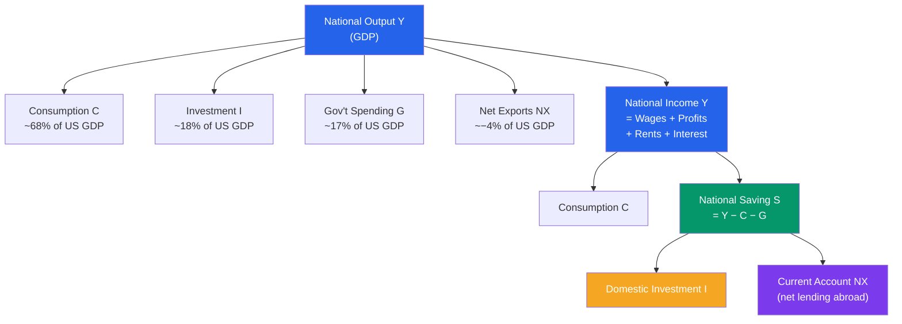

# 🔄 National Income Identity

> [!abstract] TL;DR
> The national income identity $Y = C + I + G + NX$ is an accounting tautology — it is true by definition, not by behaviour. It leads directly to the **saving-investment identity**: $S = I + NX$, or equivalently, a current account surplus equals the difference between national saving and domestic investment. Understanding these identities is the foundation for IS-LM analysis and open-economy macro.

## Intuition — analogy FIRST

Imagine the economy as a single giant pot of income. Everything produced gets sold to someone — households (C), businesses (I), government (G), or foreigners (NX). Because every dollar of output becomes a dollar of income, the spending side must equal the income side. This isn't a theory — it's double-entry bookkeeping for the whole economy.

The saving-investment identity follows just as inevitably. If households don't spend all their income, they save it. Those savings have to go somewhere — they either fund domestic investment or they finance net exports (lending to foreigners). If the US runs a trade deficit, it is borrowing from abroad to fund spending beyond its output. Always.

---

## How It Works

---

## Key Concepts / Details

### The Expenditure Identity

$$Y \equiv C + I + G + NX$$

This is an **identity** (denoted $\equiv$), not an equation that can be violated. Output produced = output sold. If firms produce goods that aren't sold, they accumulate as inventory — and inventory accumulation counts as investment ($I$). So the identity always holds.

### Deriving the Saving-Investment Identity

Start from $Y = C + I + G + NX$. Define **national saving** as income not consumed by households or government:

$$S \equiv Y - C - G$$

Substitute:

$$S = I + NX$$

Or equivalently, rearranging for the **current account**:

$$NX = S - I$$

This is the most important single equation in open-economy macro:
- **Trade surplus ($NX > 0$):** The country saves more than it invests domestically — it lends the surplus to the world.
- **Trade deficit ($NX < 0$):** The country invests more than it saves — it borrows from the world (capital inflows).

### Private vs Government Saving

Split total saving into private and public:

$$S = S_{\text{private}} + S_{\text{govt}}$$

$$S_{\text{private}} = Y - T - C \quad \text{(household income after taxes, minus consumption)}$$

$$S_{\text{govt}} = T - G \quad \text{(tax revenue minus spending = budget surplus)}$$

When government runs a **deficit** ($G > T$), $S_{\text{govt}} < 0$. If private saving doesn't rise to compensate (Ricardian Equivalence fails), the national saving $S$ falls, the current account worsens, or domestic investment is crowded out — see [[Ricardian_Equivalence]].

### The Twin Deficits Hypothesis

In the 1980s, the US ran large budget deficits (Reagan tax cuts) simultaneously with large trade deficits. The identity $NX = S - I$ implies:

$$NX = (S_{\text{private}} - I) + (T - G)$$

If the budget deficit widens ($T - G$ falls) and private saving doesn't adjust, $NX$ must fall — the "twin deficits." This is an accounting identity, not a causal mechanism, but it frames the debate.

| US 1980s Example | Level |
|-----------------|-------|
| Federal budget deficit | ~5% of GDP |
| Current account deficit | ~3% of GDP |
| Dollar appreciation (DXY peak 1985) | ~50% above 1980 levels |

### Closed Economy vs Open Economy

| Economy | Saving-Investment | Implication |
|---------|------------------|-------------|
| Closed ($NX = 0$) | $S = I$ | All saving must fund domestic investment |
| Open ($NX \neq 0$) | $S = I + NX$ | Saving can flow across borders |

In a **small open economy** (like Denmark), the interest rate is set by the world — saving and investment can diverge, with the gap filled by capital flows. In a **large open economy** (like the US), domestic saving affects the world interest rate.

---

## Real-World Notes

- **US current account deficit:** The US has run a persistent current account deficit since the mid-1980s, averaging about 2–4% of GDP. By the identity, this means the US has been a net borrower from the rest of the world — foreigners accumulate US Treasuries, equities, and real assets.
- **China's surplus:** China ran current account surpluses of 5–10% of GDP in the 2000s. By the identity, China saved far more than it invested domestically and lent the difference to the rest of the world (largely by accumulating US Treasury bonds). This "global savings glut" (Ben Bernanke, 2005) contributed to low global interest rates pre-2008.
- **Germany's structural surplus:** Germany consistently runs the world's largest nominal current account surplus (~$300 bn/year pre-COVID), reflecting high corporate saving and suppressed domestic consumption.
- **Japan's lost decade:** After 1990, Japanese private investment collapsed. The identity held via a rising current account surplus (Japan exported its excess saving) and rising government deficits (government dissaved to offset private saving).

---

## Common Pitfalls

- **Treating the identity as a behavioural theory.** $S = I + NX$ is always true — it cannot be "tested." The interesting question is what causes each component to move and in what direction causality runs.
- **Forgetting inventory investment.** If a firm produces goods that don't sell, unsold inventory is counted as investment — keeping the identity intact even in a recession.
- **Conflating current account with capital account.** The current account ($NX$) is the trade balance plus factor income and transfers. The capital/financial account records the offsetting capital flows. They sum to zero by construction.
- **Double-counting transfers.** Government transfer payments (Social Security, food stamps) are not in $G$ — they shift income from taxpayers to recipients, both of whom are already in $C$.

---

## Related Concepts

- [[_MOC_National_Accounts|↑ Section MOC]]
- [[GDP_and_Measurement]] — The components of $Y$ in detail
- [[IS_Curve]] — How the saving-investment identity becomes a downward-sloping IS curve in interest-rate/output space
- [[Balance_of_Payments]] — The current account and capital account that must sum to zero
- [[Budget_Deficits_and_Debt]] — How government deficits affect national saving and the current account
- [[Ricardian_Equivalence]] — Does a budget deficit reduce national saving or do households offset it?

---

## Review Questions

1. A closed economy has $Y = 10$, $C = 7$, $G = 1.5$, $T = 1.2$. Calculate investment $I$, private saving, and government saving. Does your answer satisfy $S = I$?
2. The US cuts taxes by $500 billion without cutting spending. Using the identity $NX = S - I$, explain the possible macroeconomic consequences if (a) private saving rises by the full $500 billion (Ricardian Equivalence holds), or (b) private saving doesn't change at all.
3. China has a large current account surplus. What must be true about the relationship between China's national saving and domestic investment? What does this imply for capital flows?

---

## Sources

- N. Gregory Mankiw, *Macroeconomics*, 10th ed., Ch. 3 — National Income: Where It Comes From and Where It Goes
- Olivier Blanchard, *Macroeconomics*, 8th ed., Ch. 3 — The Goods Market
- Ben Bernanke, "The Global Saving Glut and the U.S. Current Account Deficit," Federal Reserve Speech, March 2005

#macroeconomics #economics #national-accounts #saving-investment-identity
