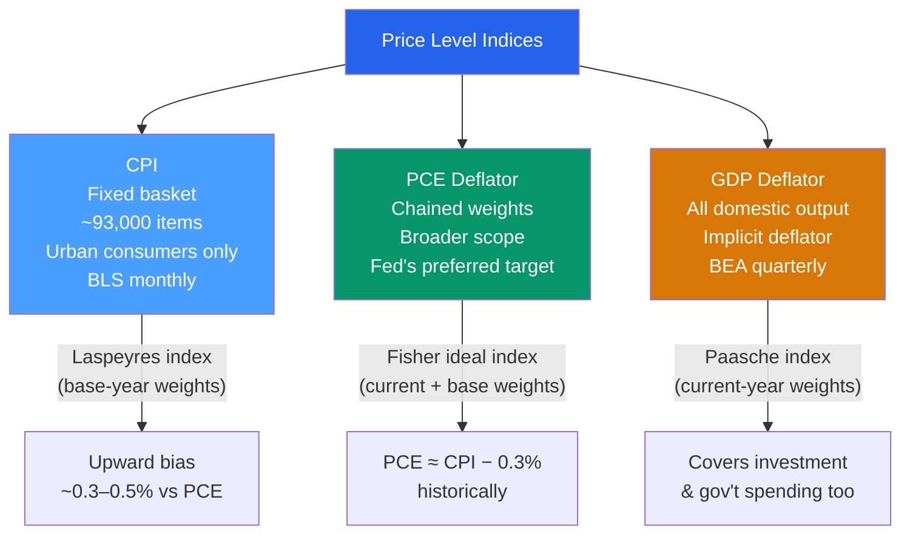

# 📈 Price Indices and Inflation

> [!abstract] TL;DR
> Inflation is the sustained rise in the general price level, measured by indices like the CPI, PCE deflator, or GDP deflator. Each index has a different basket, weighting method, and scope — the Fed targets **PCE inflation at 2%** because PCE corrects for substitution bias that inflates the CPI. Hyperinflation (>50%/month) destroys the store-of-value and unit-of-account functions of money, as seen in Weimar Germany (1923) and Zimbabwe (2008).

## Intuition — analogy FIRST

Imagine tracking the cost of your weekly grocery run over time. If apples get expensive and you switch to oranges, you're no worse off — but the CPI still reprices your original apple basket at higher prices, overstating how much your cost of living rose. That is **substitution bias**.

The GDP deflator is like asking: "What did we actually produce this year, and how much did those exact things cost last year vs this year?" It covers everything produced in the economy, not just a fixed consumer basket — so it automatically captures today's mix of spending.

The Fed prefers PCE (Personal Consumption Expenditures deflator) because it updates its basket quarterly, covers more spending categories, and corrects for substitution — giving a more accurate read on the price pressure households actually face.

---

## How It Works

---

## Key Concepts / Details

### Constructing the CPI

The Bureau of Labor Statistics (BLS) tracks prices of ~93,000 items in a fixed basket representative of urban consumer spending:

$$\text{CPI}_t = \frac{\text{Cost of base-year basket at time } t \text{ prices}}{\text{Cost of base-year basket at base-year prices}} \times 100$$

**CPI inflation rate:**

$$\pi_t = \frac{\text{CPI}_t - \text{CPI}_{t-1}}{\text{CPI}_{t-1}} \times 100\%$$

### Biases in the CPI

| Bias | Description | Estimated magnitude |
|------|-------------|---------------------|
| **Substitution bias** | Fixed basket ignores consumer substitution away from expensive goods | +0.3–0.5%/yr |
| **Quality bias** | Price improvements from better quality treated as pure inflation | +0.4%/yr |
| **New goods bias** | New products not in basket for years after introduction | +0.1%/yr |
| **Outlet bias** | CPI doesn't capture shift to discount retailers | +0.1%/yr |

The Boskin Commission (1996) estimated total CPI upward bias at ~1.1%/year — meaning real living standards improved faster than official statistics suggested.

### Core vs Headline Inflation

- **Headline CPI:** Includes all items, including food and energy.
- **Core CPI (ex-food and energy):** Removes volatile components. The Fed uses this for "signal vs noise" — energy prices are mean-reverting and don't indicate underlying inflation pressure.
- **Trimmed mean PCE:** Dallas Fed measure that strips the most volatile monthly price changes — possibly the most accurate measure of underlying trend inflation.

### PCE vs CPI — Key Differences

| Dimension | CPI | PCE |
|-----------|-----|-----|
| Scope | Urban consumers | All persons, including employer-provided |
| Medical care | Out-of-pocket spending | Includes insurance, Medicare/Medicaid |
| Weights update | Every 2 years | Quarterly |
| Formula | Laspeyres (base-year weights) | Fisher ideal (chained) |
| Typical level | Higher by ~0.3% | Lower, preferred by Fed |

The Fed's **2% inflation target** refers to **PCE inflation**, not CPI.

### The GDP Deflator

$$\text{GDP Deflator}_t = \frac{\text{Nominal GDP}_t}{\text{Real GDP}_t} \times 100$$

Unlike CPI, it covers *all* goods and services produced domestically — including capital goods, government services, and exports. It automatically updates its basket to current production patterns (Paasche index), which means it can *understate* inflation if quality improves.

### Hyperinflation

Hyperinflation is conventionally defined as >50% per *month* (Cagan 1956), equating to >13,000% per year.

| Episode | Peak monthly rate | Total collapse |
|---------|------------------|----------------|
| Weimar Germany (Nov 1923) | ~29,500%/month | Monetary reform with Rentenmark |
| Hungary (Jul 1946) | ~41.9 quadrillion%/month | Highest ever recorded |
| Zimbabwe (Nov 2008) | ~79.6 billion%/month | USD adoption ended it |
| Venezuela (2018) | ~1,700,000%/year | Ongoing dollarisation |

Hyperinflation destroys three functions of money: **store of value** (gone), **unit of account** (constantly shifting), **medium of exchange** (people resort to barter or hard currency).

---

## Real-World Notes

- **Fed's 2% target:** Adopted formally in January 2012 under Ben Bernanke. The 2% level is not zero because: (1) it provides a buffer against deflation spirals, (2) it allows for positive real interest rates even at low nominal rates, (3) it accommodates quality improvements that overstate inflation.
- **2021–2023 US inflation surge:** CPI peaked at 9.1% in June 2022 — the highest since November 1981. Causes included COVID supply-chain disruptions, massive fiscal stimulus (~$5 trillion), and the energy shock from Russia's 2022 Ukraine invasion. The Fed hiked rates 525 bps from March 2022 to July 2023.
- **Volcker disinflation (1979–1983):** Fed Chair Paul Volcker raised the federal funds rate to 20% in June 1981 to break inflation that had reached 14.8%. Inflation fell to ~3% by 1983, but the US suffered two recessions (1980 and 1981–82) with unemployment peaking at 10.8%.
- **Japan's deflation:** Japan experienced mild persistent deflation from ~1999 to 2012, with the GDP deflator falling ~1%/year. This was associated with balance sheet recession, rising real debt burdens, and delayed consumption.

---

## Common Pitfalls

- **Using CPI when the Fed means PCE.** The Fed's 2% target is PCE, not CPI. CPI typically runs 0.3–0.5% higher. Don't confuse them.
- **Confusing the inflation rate with the price level.** Inflation falling from 8% to 3% means prices are *still rising*, just more slowly. Prices only fall with *deflation* (negative inflation).
- **Ignoring real vs nominal.** A 10% wage increase with 8% inflation is only a 2% real raise. Always deflate for meaningful comparisons.
- **Assuming core inflation is always more accurate.** In periods of sustained energy price shocks (1970s, 2022), headline inflation is the relevant measure for household welfare.

---

## Related Concepts

- [[_MOC_National_Accounts|↑ Section MOC]]
- [[GDP_and_Measurement]] — The GDP deflator and converting nominal to real GDP
- [[Quantity_Theory_of_Money]] — $MV = PY$: money supply growth ultimately drives the price level
- [[Inflation_and_Interest_Rates]] — Fisher equation: $i = r + \pi^e$
- [[Taylor_Rule]] — How the Fed adjusts rates in response to inflation deviations from target
- [[Unemployment]] — The Phillips curve: short-run trade-off between inflation and unemployment

---

## Review Questions

1. The CPI basket in year 0 costs $500. The same basket costs $540 in year 1 and $560 in year 2. Calculate the inflation rate in years 1 and 2. If a pensioner's income is indexed to CPI, how much would it need to rise each year?
2. Explain three reasons why the CPI overstates the true cost of living increase. Which of these does the PCE deflator correct for?
3. A country with 5% money supply growth also has 2% real GDP growth. Using the quantity theory ($MV = PY$, assuming constant velocity), what inflation rate would you predict? What does this suggest about the Fed's ability to target inflation by controlling the money supply?

---

## Sources

- N. Gregory Mankiw, *Macroeconomics*, 10th ed., Ch. 2 — The Data of Macroeconomics
- BLS, "Consumer Price Index," https://www.bls.gov/cpi/
- Boskin Commission, "Toward a More Accurate Measure of the Cost of Living," 1996
- Michael Bryan & Brent Meyer, "The Trimmed-Mean PCE Inflation Rate," Federal Reserve Bank of Dallas

#macroeconomics #economics #national-accounts #CPI #inflation #PCE
