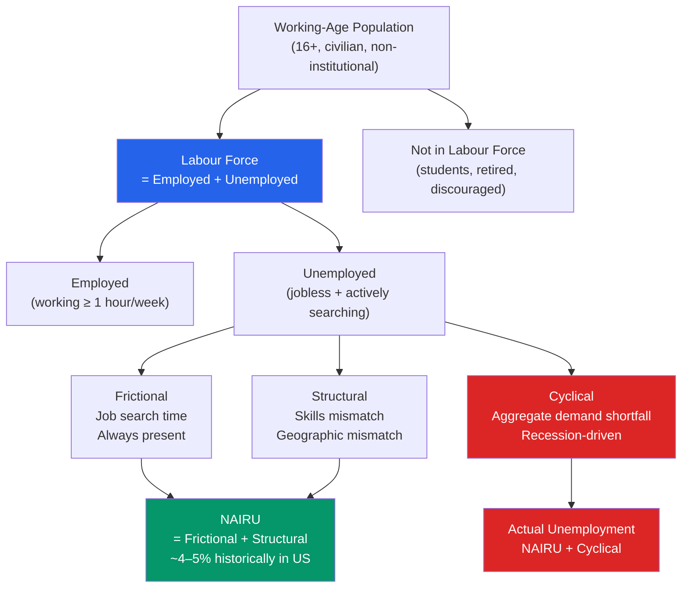

# 👷 Unemployment

> [!abstract] TL;DR
> The unemployment rate is the share of the labour force actively searching for work but unable to find it. It consists of three components — frictional (job search), structural (skills mismatch), and cyclical (demand deficiency) — and the natural rate (NAIRU) is the level consistent with stable inflation. The short-run Phillips curve trade-off states that lower unemployment comes at the cost of higher inflation, but this trade-off breaks down in the long run.

## Intuition — analogy FIRST

Imagine a city's job market as a hotel with rooms (jobs) and guests (workers). Even in a full-employment economy, some rooms are always temporarily empty — guests are checking out and checking in (frictional unemployment). Some rooms require amenities the current guests don't have (structural unemployment). Cyclical unemployment is like a city-wide convention cancellation — suddenly there are far more guests than rooms and it has nothing to do with the matching process.

The natural rate of unemployment (NAIRU) is the vacancy rate the hotel has even when the city is booming. Trying to push unemployment below it is like cramming too many guests in — things get chaotic and prices rise.

---

## How It Works

---

## Key Concepts / Details

### Measuring Unemployment

The **unemployment rate** (U-3) is the BLS headline measure:

$$u = \frac{\text{Unemployed}}{\text{Labour Force}} = \frac{\text{Unemployed}}{\text{Employed} + \text{Unemployed}} \times 100\%$$

The BLS publishes six measures of labour underutilisation:

| Measure | Definition | US (2023 avg) |
|---------|-----------|----------------|
| **U-1** | ≥15 weeks unemployed | ~1.0% |
| **U-2** | Job losers + completed temporary jobs | ~1.6% |
| **U-3** | Official unemployment rate | ~3.6% |
| **U-4** | U-3 + discouraged workers | ~3.9% |
| **U-5** | U-4 + marginally attached | ~4.3% |
| **U-6** | U-5 + part-time for economic reasons | ~6.9% |

**Labour Force Participation Rate (LFPR):**

$$\text{LFPR} = \frac{\text{Labour Force}}{\text{Civilian Non-Institutional Population 16+}} \times 100\%$$

US LFPR peaked at 67.3% in January 2000 and had declined to ~62.5% by 2023, partly due to ageing demographics.

### Three Types of Unemployment

**Frictional unemployment** arises from the time it takes to match workers with jobs. Even in a booming economy, workers change jobs, new graduates search, and firms recruit. Duration: typically 2–8 weeks. Policy: improving information flows (job boards, employment agencies) reduces it marginally.

**Structural unemployment** arises from mismatches between worker skills and available jobs. Examples: manufacturing decline and displaced factory workers who lack coding skills; geographic mismatches between Rust Belt workers and Sun Belt opportunities. Duration: months to years. Policy: retraining, relocation subsidies, education reform.

**Cyclical unemployment** (demand-deficient unemployment) arises when aggregate demand is too low to employ all available workers. It appears in recessions. Duration: varies with business cycle. Policy: fiscal stimulus, monetary easing — addressed by IS-LM and AD-AS models.

### NAIRU — The Natural Rate

**NAIRU** (Non-Accelerating Inflation Rate of Unemployment) is the unemployment rate at which inflation is stable. It equals frictional + structural unemployment.

$$u^* = u_{\text{frictional}} + u_{\text{structural}}$$

If $u < u^*$: labour markets are tight, wages rise, firms pass on costs → **inflation accelerates**.  
If $u > u^*$: spare capacity, weak wage growth → **inflation decelerates**.

NAIRU is not directly observable — it must be estimated. The CBO estimates the US NAIRU at ~4.4% in 2024. It is not constant: the 1990s US economy ran below 5% unemployment without inflation, suggesting NAIRU had fallen due to productivity gains and globalisation.

### The Phillips Curve

A.W. Phillips (1958) documented an empirical inverse relationship between wage inflation and unemployment in the UK:

$$\pi = \pi^e - \beta(u - u^*)$$

- $\pi$ = actual inflation
- $\pi^e$ = expected inflation  
- $\beta$ = sensitivity parameter (~0.5 in modern estimates)
- $u - u^*$ = unemployment gap

The **short-run Phillips curve** is downward-sloping: lower unemployment → higher inflation.  
The **long-run Phillips curve** is vertical at $u^*$: in the long run, expected inflation adjusts and the trade-off disappears.

The stagflation of the 1970s (high inflation + high unemployment simultaneously) broke the stable Phillips curve relationship and confirmed Friedman/Phelps's theoretical critique: the trade-off only exists while workers have incorrect inflation expectations.

### Okun's Law

Arthur Okun (1962) estimated the empirical relationship between the **output gap** and the **unemployment gap**:

$$\frac{Y - Y^*}{Y^*} \approx -2(u - u^*)$$

A 1 percentage point rise in the unemployment rate above NAIRU corresponds to approximately a 2% shortfall in output below potential. Modern estimates suggest a multiplier closer to 1.5–2.

| US Recession | Peak Unemployment | Estimated Output Gap |
|-------------|------------------|----------------------|
| 2008–09 | 10.0% (Oct 2009) | ~−7% of GDP |
| 2020 COVID | 14.7% (Apr 2020) | ~−11% of GDP (Q2 2020) |
| 1981–82 | 10.8% (Dec 1982) | ~−6% of GDP |

---

## Real-World Notes

- **Great Recession (2008–09):** US unemployment peaked at 10.0% in October 2009, with U-6 (broad underemployment) reaching 17.2%. The recovery was the slowest post-war recovery, with unemployment not falling below 5% until 2016.
- **COVID shock (April 2020):** Unemployment hit 14.7% in April 2020 — the highest since the Great Depression — then recovered to 3.5% by July 2023 within three years, the fastest recovery ever recorded.
- **Full employment paradox (2019 and 2022):** US unemployment fell to 3.5% in 2019 and again in 2022-2023 without triggering runaway inflation as predicted by traditional NAIRU models. This suggested either NAIRU had fallen or the Phillips curve had flattened.
- **Long-term unemployment scarring:** Research by Davis & von Wachter (2011) shows workers displaced during recessions suffer permanent earnings losses of 15–20% even decades later — unemployment has lasting effects beyond the cycle.

---

## Common Pitfalls

- **Confusing the unemployment rate with the jobless rate.** Only those *actively searching* are unemployed. Discouraged workers who've stopped searching drop out of the labour force, potentially lowering the headline rate even as conditions worsen.
- **NAIRU as fixed.** NAIRU shifts with technology, demographics, labour market institutions, and globalisation. The 1960s NAIRU of ~4% is different from the 1980s ~6%.
- **Cyclical unemployment as permanent.** Recessions cause cyclical unemployment, but hysteresis (long-term unemployment damaging skills/networks) can convert cyclical into structural.
- **Phillips curve stability.** The stable 1960s Phillips curve broke down in the 1970s. Friedman (1968) predicted this: the short-run trade-off depends on inflation expectations anchored at a fixed level.

---

## Related Concepts

- [[_MOC_National_Accounts|↑ Section MOC]]
- [[GDP_and_Measurement]] — Okun's Law: output gap ↔ unemployment gap
- [[Business_Cycle_Indicators]] — Unemployment as a lagging indicator
- [[Price_Indices_Inflation]] — Phillips curve: inflation-unemployment trade-off
- [[Aggregate_Supply]] — The long-run aggregate supply curve is vertical at the natural rate of output
- [[Automatic_Stabilizers]] — Unemployment insurance as an automatic fiscal stabiliser

---

## Review Questions

1. The US unemployment rate is 4.2% and the CBO estimates NAIRU at 4.4%. Is there cyclical unemployment or inflationary pressure? Using Okun's Law, estimate the output gap.
2. Explain why the long-run Phillips curve is vertical. Why did the 1970s stagflation demonstrate this more convincingly than any textbook argument?
3. A worker graduates from college in June and spends 8 weeks searching for a job. A steel mill closes in Ohio and the workers lack the skills needed in today's digital economy. A recession leads a retailer to lay off 200 workers. Classify each as frictional, structural, or cyclical unemployment and identify the appropriate policy response (if any).

---

## Sources

- N. Gregory Mankiw, *Macroeconomics*, 10th ed., Ch. 7 — Unemployment
- Olivier Blanchard, *Macroeconomics*, 8th ed., Ch. 6 — The Labour Market
- Milton Friedman, "The Role of Monetary Policy," *American Economic Review*, 1968
- Arthur Okun, "Potential GNP: Its Measurement and Significance," 1962

#macroeconomics #economics #national-accounts #unemployment #NAIRU #Phillips-curve
