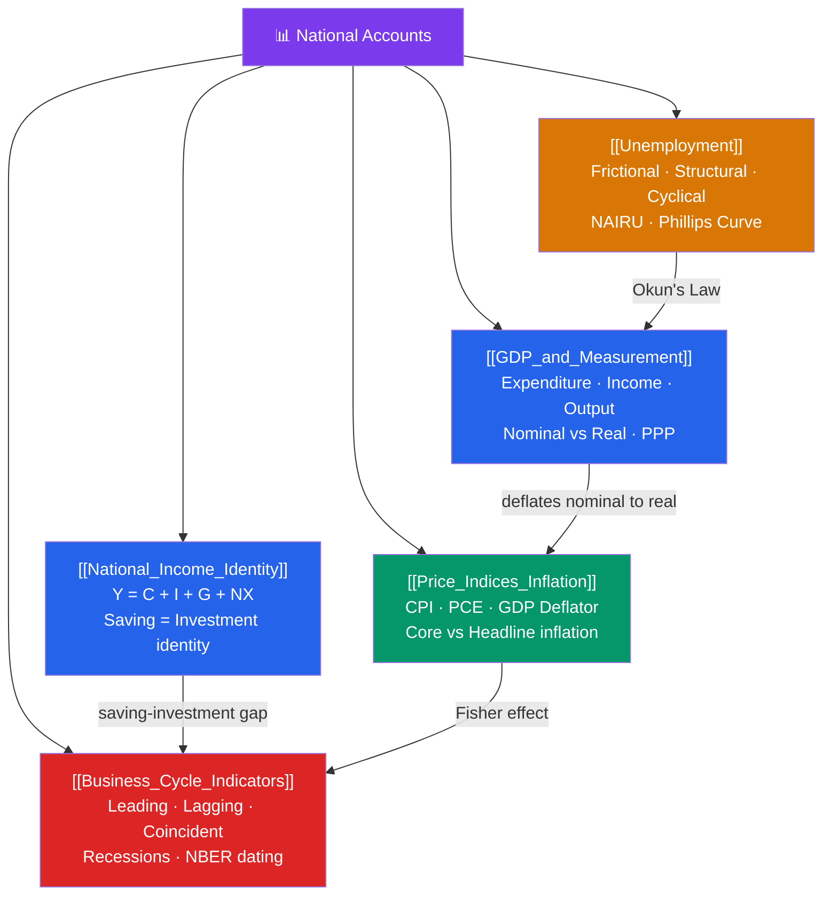

# 🗺️ National Accounts — Map of Content

> [!abstract] What This Section Covers
> National Accounts is the **scoreboard of the macroeconomy**. It answers: how do we measure total output ([[GDP_and_Measurement]])? How do spending, income, and production relate ([[National_Income_Identity]])? How do we track the price level over time ([[Price_Indices_Inflation]])? Who is employed and who is searching for work ([[Unemployment]])? And how do these indicators fluctuate together across the business cycle ([[Business_Cycle_Indicators]])? These are the data series that central banks, finance ministers, and financial analysts watch weekly — understanding how they are constructed is the prerequisite for understanding every other section in the vault.

## Concept Map

## Learning Path

1. [[GDP_and_Measurement]] — The three approaches to measuring GDP: expenditure, income, and value-added. Nominal vs real GDP, GDP deflator, and purchasing power parity.
2. [[National_Income_Identity]] — The accounting identity $Y = C + I + G + NX$ and the saving-investment identity that flows from it.
3. [[Price_Indices_Inflation]] — How the CPI, PCE, and GDP deflator are constructed, why they diverge, and how central banks target inflation.
4. [[Unemployment]] — The three types of unemployment, NAIRU, the unemployment rate as a lagging indicator, and the short-run Phillips curve trade-off.
5. [[Business_Cycle_Indicators]] — Leading, lagging, and coincident indicators; NBER recession dating; Okun's Law linking output gaps to unemployment.

## All Notes at a Glance

| Note | Difficulty | What You'll Learn |
|------|------------|-------------------|
| [[GDP_and_Measurement]] | Beginner | Three approaches to GDP; nominal vs real; PPP; GDP per capita |
| [[National_Income_Identity]] | Beginner | $Y=C+I+G+NX$; saving-investment identity; current account and capital account |
| [[Price_Indices_Inflation]] | Beginner | CPI construction; substitution bias; core vs headline; hyperinflation |
| [[Unemployment]] | Beginner | Unemployment definitions; NAIRU; Phillips curve; Okun's Law |
| [[Business_Cycle_Indicators]] | Intermediate | Business cycle phases; leading/lagging/coincident indicators; NBER dating |

## Key Questions This Section Answers

- What is the difference between GDP, GNP, and GNI?
- Why does nominal GDP growth overstate real economic progress?
- What is the saving-investment identity and why does it always hold?
- What is the difference between CPI and the PCE deflator, and why does the Fed prefer PCE?
- What is NAIRU and why can't unemployment be permanently pushed below it?
- How does NBER date recessions, and why is the "two-quarter rule" a simplification?

## Related Sections

- [[_MOC_Macroeconomics_Master|↑ Macroeconomics Master MOC]]
- [[_MOC_Economic_Growth|→ Economic Growth]]
- [[_MOC_IS_LM_AD_AS|→ IS-LM & AD-AS]]
- [[_MOC_Monetary_Economics|→ Monetary Economics]]

#MOC #Macroeconomics #NationalAccounts
