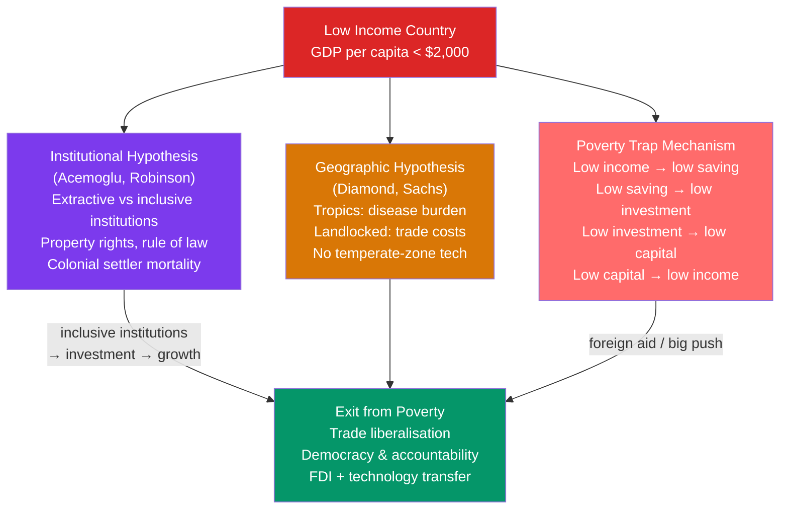

# 🌏 Development Economics

> [!abstract] TL;DR
> Development economics studies why many countries remain poor despite decades of growth models predicting convergence. The key debates: geography vs institutions as root causes (Acemoglu & Robinson vs Diamond); poverty traps from subsistence-level saving rates; the effectiveness of foreign aid (Sachs vs Easterly); and which policy packages actually work (Washington Consensus vs institutional quality emphasis). The empirical answer: institutions — property rights, rule of law, control of corruption — explain more of the income gap than geography, education, or trade openness alone.

## Intuition — analogy FIRST

The Solow model predicts poor countries should grow faster than rich ones (conditional convergence). Yet by 2024, GDP per capita in the US (~$80,000) is still ~50 times higher than in Sub-Saharan Africa (~$1,600). Why haven't poor countries converged faster?

Think of it like two cars on a highway. The Solow model says the slower car has a lighter load and should catch up. But development economics asks: what if the slower car has a flat tyre (bad institutions), is driving on a dirt road (geography), has no fuel (low saving due to poverty trap), and the driver doesn't know where to go (lack of human capital)? The barrier isn't the engine — it's everything around it.

---

## How It Works

---

## Key Concepts / Details

### The Poverty Trap

At very low income levels, households must consume nearly all their income to survive — the saving rate is near zero. With no saving, there is no investment, and capital per worker stays low. This creates a **poverty trap**: a stable equilibrium at low income.

Formally, with a Solow production function, if the saving curve $sf(k)$ lies below the break-even line $(\delta + n)k$ for all $k < k_{\text{trap}}$, there are two steady states — a low-income trap and a high-income stable equilibrium:

$$sf(k^*_{\text{low}}) = (\delta + n)k^*_{\text{low}}, \quad sf(k^*_{\text{high}}) = (\delta + n)k^*_{\text{high}}$$

Jeffrey Sachs argues that a coordinated **Big Push** of aid and investment can jump the economy over the trap into the high-income basin of attraction. His Millennium Villages Project (2004–2012) tested this in Africa.

### Geography vs Institutions

**Jeffrey Sachs's geography hypothesis:** Tropical diseases (malaria, yellow fever), poor soil quality, and landlocked positions impose structural disadvantages that persist regardless of institutions. Sub-Saharan Africa's poverty is partly due to geography — policy can only partially offset it.

**Daron Acemoglu & James Robinson's institutions hypothesis:** Institutions — property rights, rule of law, constraints on executive power — are the fundamental cause of growth differences. Their key test: former European colonies with high settler mortality (tropics) developed **extractive institutions** (designed to exploit the local population). Former colonies with low settler mortality (North America, Australia) developed **inclusive institutions** (designed to settle and build). Settler mortality is an instrument for institutions that is uncorrelated with modern geography's direct effects on income.

Result: Institutions explain ~60% of the cross-country income variation once you instrument for them properly (Acemoglu, Johnson & Robinson 2001). Geography matters, but mostly through its historical effect on institutions.

### The Washington Consensus

The IMF/World Bank 1990s policy prescription for developing countries (John Williamson, 1989):

1. Fiscal discipline — eliminate budget deficits
2. Reorder public expenditure — toward health, education, infrastructure
3. Tax reform — broaden base, reduce marginal rates
4. Liberalise interest rates — market-determined
5. Competitive exchange rates
6. Trade liberalisation
7. Privatise state enterprises
8. Deregulation
9. Property rights
10. Foreign direct investment liberalisation

**Empirical record:** Mixed at best. Latin American countries that implemented Washington Consensus policies in the 1990s had disappointing growth. East Asian economies that grew fastest (South Korea, Taiwan, China) used significant industrial policy and state intervention — violating points 7 and 10.

The "**augmented Washington Consensus**" (Rodrik et al.) adds institutional quality, governance, and targeted industrial policy, acknowledging that markets alone don't work where institutions are weak.

### Foreign Aid Debate

| View | Proponent | Argument |
|------|-----------|----------|
| Aid works | Jeffrey Sachs | Poverty traps need a Big Push; aid fills the "financing gap" |
| Aid doesn't work | William Easterly | Aid creates dependency, bypasses local institutions, funds corrupt governments |
| Evidence-based | Abhijit Banerjee & Esther Duflo | Use RCTs to identify what specific interventions work (deworming, conditional cash transfers, microfinance) |

**Duflo & Banerjee (2019 Nobel Prize):** Randomised control trials show:
- **Direct cash transfers** (GiveDirectly): effective — recipients spend on productive investments
- **Conditional cash transfers** (Bolsa Família in Brazil): effective at keeping children in school and improving health outcomes
- **Microfinance** (Grameen Bank model): modest positive effects, no evidence of escaping poverty traps at scale
- **Deworming:** Small health intervention with large returns (but later replication debates)

### Structural Transformation

As countries develop, their economic structure shifts:
- Agriculture share of GDP falls (Engel's Law: food share of spending falls as income rises)
- Manufacturing share rises, then falls (inverted U-curve, "Kuznets curve")
- Services sector grows continuously

| GDP per capita | Agriculture | Manufacturing | Services |
|----------------|-------------|---------------|---------|
| <$1,000 | 30–50% | 10–20% | 30–50% |
| $5,000–$15,000 | 5–15% | 20–30% | 50–65% |
| >$40,000 | 1–3% | 15–25% | 70–80% |

The **Lewis dual-economy model** (W. Arthur Lewis, Nobel 1979): development proceeds by transferring surplus labour from a low-productivity traditional (agricultural) sector to a high-productivity modern (industrial) sector. Growth continues until the surplus labour is exhausted (the Lewis turning point) — seen in China around 2010-2015.

---

## Real-World Notes

- **South Korea's development miracle:** From $600 GDP per capita (1960) to $30,000+ (2020). Key features: high saving rates (30%+), universal education, targeted industrial policy (chaebol system), export orientation, rapid technology adoption. Contradicts pure Washington Consensus prescriptions but consistent with institutions + openness.
- **China's poverty reduction:** China lifted ~800 million people above the $1.90/day poverty line from 1980 to 2015 — the largest reduction in history. Mechanism: land reforms, town-and-village enterprises, export-led manufacturing, and FDI-driven technology transfer. Heavy state involvement throughout.
- **Africa's divergence:** Sub-Saharan Africa's GDP per capita was similar to East Asia in 1960 (~$300). By 2020, East Asia averaged ~$12,000 vs Sub-Saharan Africa ~$1,600. Institutional quality, colonial legacy, resource curse (Dutch disease), and conflict are cited as explanations.
- **Bolivia and the resource curse:** Resource-rich countries often underperform — oil/mining booms cause exchange rate appreciation (Dutch Disease), reduce manufacturing competitiveness, and create rents that fuel corruption and conflict.

---

## Common Pitfalls

- **Assuming convergence is inevitable.** Conditional convergence requires similar institutions, policies, and steady-state determinants. Absolute convergence is not predicted by Solow and is not observed.
- **One-size-fits-all Washington Consensus.** Dani Rodrik and others show development policy must be context-specific — what works in South Korea may not work in sub-Saharan Africa.
- **Treating aid as uniformly good or bad.** The Banerjee-Duflo approach: specific interventions evaluated rigorously can be highly effective; untargeted budget support often is not.
- **Ignoring the middle-income trap.** Many countries (Malaysia, Brazil, Turkey) escape low-income status but fail to reach high-income status. This requires shifting from imitation to innovation — an institutional and educational challenge.

---

## Related Concepts

- [[_MOC_Economic_Growth|↑ Section MOC]]
- [[Solow_Growth_Model]] — Why conditional convergence doesn't imply absolute convergence
- [[Human_Capital_and_Education]] — Education as the key development investment
- [[Endogenous_Growth_Theory]] — Non-convergence is natural in endogenous growth models
- [[Technological_Progress]] — Technology diffusion as the mechanism of catch-up growth
- [[Balance_of_Payments]] — Trade and FDI channels for development

---

## Review Questions

1. The Solow model predicts conditional convergence, yet per-capita incomes between rich and poor countries show persistent divergence. Explain two mechanisms (poverty trap and institutional barriers) that could cause convergence to fail even within the Solow framework.
2. Acemoglu and Robinson use colonial settler mortality as an instrument for institutions. Explain the logic: why is settler mortality a valid instrument (relevant and exogenous)? What do they find, and what does it imply for development policy?
3. Jeffrey Sachs and William Easterly have opposing views on foreign aid. Banerjee and Duflo advocate a third approach. What is their methodological innovation, and what have RCTs revealed about which specific interventions are most effective?

---

## Sources

- Daron Acemoglu, Simon Johnson & James A. Robinson, "The Colonial Origins of Comparative Development," *American Economic Review*, 2001
- Daron Acemoglu & James A. Robinson, *Why Nations Fail*, 2012
- Jeffrey D. Sachs, *The End of Poverty*, 2005
- William Easterly, *The White Man's Burden*, 2006
- Abhijit Banerjee & Esther Duflo, *Poor Economics*, 2011
- W. Arthur Lewis, "Economic Development with Unlimited Supplies of Labour," *Manchester School*, 1954

#macroeconomics #economics #economic-growth #development #poverty-traps #institutions
