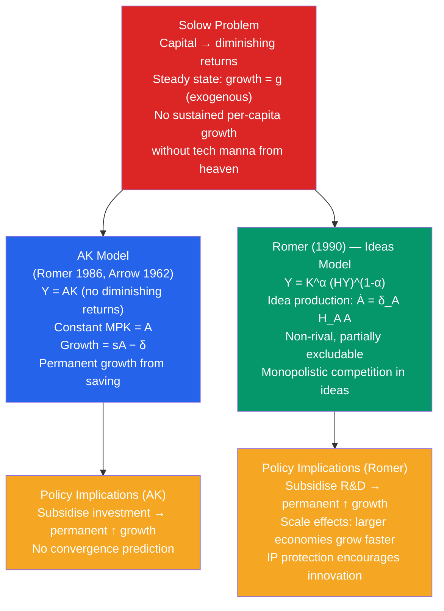

# 💡 Endogenous Growth Theory

> [!abstract] TL;DR
> Endogenous growth theory (Romer 1986, Lucas 1988, Romer 1990) makes long-run growth a product of deliberate economic decisions rather than exogenous technology. The key insight is that **ideas are non-rival** (my using an idea doesn't prevent you from using it) and may exhibit **increasing returns**, breaking the diminishing-returns assumption that limits growth in Solow. Policy implications are profound: unlike Solow, these models imply a role for subsidising R&D, education, and knowledge creation.

## Intuition — analogy FIRST

In the Solow model, growth eventually runs out of steam — each extra machine adds less and less. Like spreading butter on toast, eventually adding more butter doesn't make it taste better (diminishing returns).

Endogenous growth theory says: what if instead of physical machines, we accumulate *ideas*? A new recipe for bread can be used by every baker simultaneously — it's **non-rival**. Knowledge doesn't wear out ($\delta = 0$ for ideas). And if you teach the recipe to 10 people, you haven't lost it. This non-rivalry means the economy can potentially avoid diminishing returns and sustain growth indefinitely without needing an exogenous technology fairy.

---

## How It Works

---

## Key Concepts / Details

### The AK Model

The simplest endogenous growth model eliminates diminishing returns entirely:

$$Y = AK$$

where $A$ is a constant reflecting technology, and $K$ includes both physical and human capital.

Capital accumulation:

$$\dot{K} = sY - \delta K = sAK - \delta K$$

Growth rate:

$$g_Y = g_K = sA - \delta$$

**Key implications:**
- Growth rate depends on $s$ and $A$ — both policy-influenced
- A higher saving/investment rate *permanently* raises the growth rate (unlike Solow where it only raises the level)
- No convergence: rich and poor countries grow at the same rate if they have the same $s$ and $A$
- "Scale effects": bigger countries (more $K$) don't grow faster per capita — the model is scale-neutral

The AK model can be justified through **learning-by-doing** (Arrow 1962): as firms accumulate capital, they learn how to use it better, so knowledge externalities offset diminishing returns to private capital.

### Romer's (1990) Model of Ideas

Paul Romer's breakthrough was modelling the production of new ideas explicitly:

**Goods production:**
$$Y = K^\alpha (H_Y A)^{1-\alpha}$$

where $H_Y$ = human capital in goods production, $A$ = stock of ideas.

**Idea production:**
$$\dot{A} = \delta_A H_A A$$

where $H_A$ = human capital in R&D, $\delta_A$ = R&D productivity.

**Total human capital:**
$$H_Y + H_A = H$$

Key property of ideas:
- **Non-rival:** The design for a microchip can be used by every chip manufacturer simultaneously. Ideas don't get "used up."
- **Partially excludable:** Patents make ideas excludable for a period, allowing innovators to earn profits. Without excludability, no one has incentive to invest in R&D.

**Balanced growth path:**

$$g_Y = g_A = \frac{\delta_A H_A}{1 - (1-\alpha)\phi}$$

where $\phi$ governs the degree to which past ideas facilitate new ideas ($\phi = 1$ is Romer 1990).

**Scale effects:** Bigger $H_A$ → faster $\dot{A}$ → faster growth. Countries with larger research sectors grow faster indefinitely. This predicts growing divergence, which is partially supported by data for frontier vs developing economies.

### Lucas (1988) — Human Capital Externalities

Robert Lucas's model has growth driven by human capital accumulation with externalities:

$$Y = AK^\alpha (uh)^{1-\alpha} h_{\text{avg}}^\gamma$$

where $u$ = fraction of time working (vs studying), $h$ = individual human capital, $h_{\text{avg}}$ = average human capital (the externality), $\gamma$ > 0.

If $\gamma > 0$, there are **positive externalities** from the average skill level — working around skilled people raises everyone's productivity. The social return to education exceeds the private return, justifying subsidies.

### Semi-Endogenous Growth (Jones 1995)

Charles Jones pointed out that most developed countries have seen massive increases in R&D investment (researchers × 5 since WWII) without corresponding acceleration in productivity growth — a problem for Romer's model. His "semi-endogenous growth" model modifies ideas production:

$$\dot{A} = \delta_A H_A^\lambda A^\phi, \quad \phi < 1$$

With $\phi < 1$, each new idea is harder to find (standing on shoulders but also fishing in a thinning sea). Long-run growth is exogenous ($g \propto n^{\lambda/(1-\phi)}$, depends only on population growth) but R&D determines the *level* of income.

### Policy Implications of Endogenous Growth

| Model | Policy lever | Predicted effect on growth |
|-------|-------------|---------------------------|
| AK | Raise investment rate | Permanent ↑ in growth rate |
| Romer (1990) | Subsidise R&D | Permanent ↑ in idea production |
| Lucas (1988) | Subsidise education | Permanent ↑ via externalities |
| Jones (1995) | Raise R&D | ↑ Level of income, not growth rate |

The key controversy is Solow vs Romer: does a $1 subsidy to R&D raise long-run growth permanently (Romer) or just temporarily (Solow, Jones)? This is empirically difficult to resolve.

---

## Real-World Notes

- **Silicon Valley as an endogenous growth cluster:** Geographic concentration of high-tech firms generates R&D spillovers — ideas flow through worker mobility, spinoffs, and informal knowledge exchange. This is a real-world manifestation of Romer's non-rival ideas and Lucas externalities.
- **US R&D policy:** The US federal government spends ~$200 billion/year on R&D (~1% of GDP), with basic research subsidised through NIH, NSF, and DARPA. Romer models justify this as correcting the underinvestment that arises from the gap between social and private returns.
- **China's "indigenous innovation" strategy:** China explicitly used endogenous growth logic to justify massive R&D subsidies (3.5% of GDP target) and forced technology transfer requirements for foreign firms. Whether this generated true innovation or mainly replication is debated.
- **AI and the ideas production function:** Large language models and AI-assisted research represent a potential structural break in $\dot{A} = \delta_A H_A A$ — AI can help generate new ideas, potentially raising $\delta_A$ dramatically. Endogenous growth models predict this should accelerate long-run growth permanently.

---

## Common Pitfalls

- **AK as a literal model of the economy.** The linear production function $Y = AK$ is an approximation — diminishing returns clearly exist for any single input in isolation. The point is that externalities or broad capital (including human) can *offset* diminishing returns.
- **Confusing non-rivalry with non-excludability.** Ideas can be non-rival (unlimited use) but excludable (via patents). Most endogenous growth models require some excludability to incentivise R&D investment.
- **Scale effects are often not observed.** Romer's model predicts countries with larger research sectors grow faster permanently. But the US, UK, and Germany have roughly similar TFP growth despite very different research populations. Jones (1995) resolved this by modifying the ideas equation.
- **Assuming endogenous models are always better.** Solow remains the benchmark for empirical work because it is tractable and fits cross-country data well (especially with human capital). Romer models are better for policy prescriptions around R&D and innovation.

---

## Related Concepts

- [[_MOC_Economic_Growth|↑ Section MOC]]
- [[Solow_Growth_Model]] — Endogenous growth arose to solve Solow's reliance on exogenous technology
- [[Technological_Progress]] — The Solow residual that endogenous models explain
- [[Human_Capital_and_Education]] — Lucas's model makes human capital the engine of growth
- [[Development_Economics]] — Non-convergence is the endogenous growth prediction that fits development data better than Solow

---

## Review Questions

1. In the AK model with $A = 0.2$, $\delta = 0.05$, the saving rate rises from 25% to 30%. Calculate the growth rate before and after. Compare to the Solow model where this same saving rate increase only raises the *level* of steady-state output.
2. Ideas are non-rival but not always non-excludable. Explain this distinction with an example. Why does partial excludability (via patents) both help and hurt growth?
3. Jones (1995) documented that the number of researchers in the US grew 5-fold from 1950 to 1990 without any acceleration in GDP per capita growth. How does semi-endogenous growth theory explain this, and what does it imply for the effectiveness of R&D subsidies?

---

## Sources

- Paul M. Romer, "Increasing Returns and Long-Run Growth," *Journal of Political Economy*, 1986
- Paul M. Romer, "Endogenous Technological Change," *Journal of Political Economy*, 1990
- Robert E. Lucas Jr., "On the Mechanics of Economic Development," *Journal of Monetary Economics*, 1988
- Charles I. Jones, "R&D-Based Models of Economic Growth," *Journal of Political Economy*, 1995
- David Romer, *Advanced Macroeconomics*, 4th ed., Ch. 3 — Endogenous Growth

#macroeconomics #economics #economic-growth #endogenous-growth #Romer #AK-model
