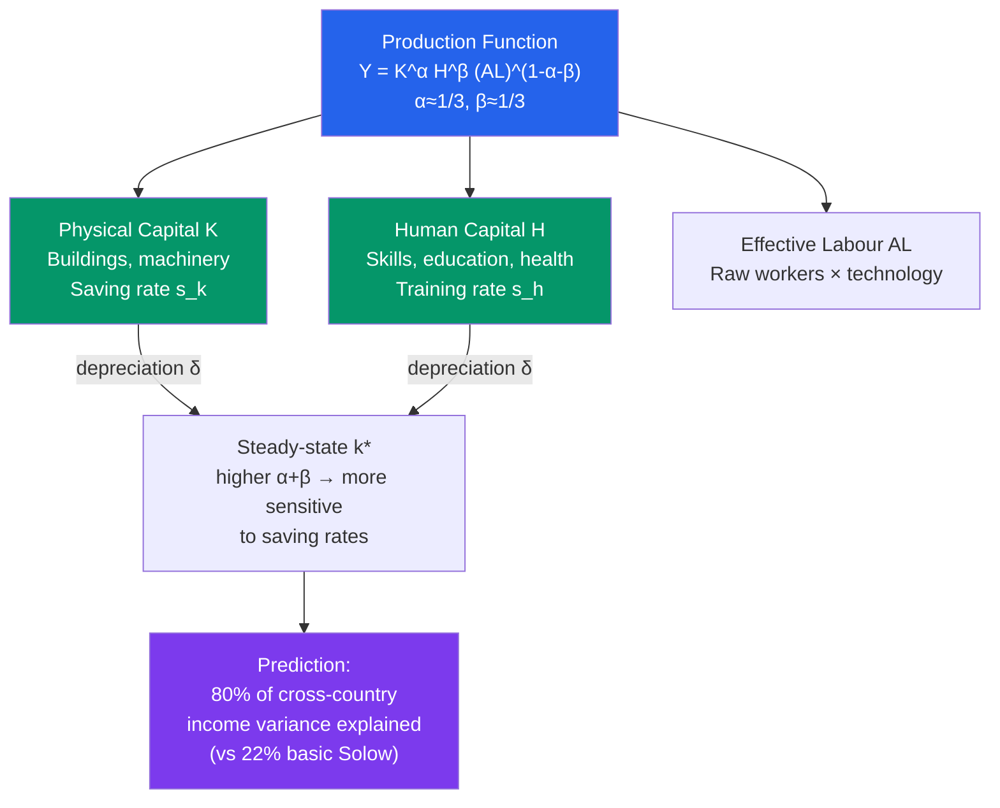

# 🎓 Human Capital and Education

> [!abstract] TL;DR
> Human capital — the accumulated skills, knowledge, and health embodied in workers — is as important as physical capital in explaining cross-country income differences. Mankiw, Romer & Weil (1992) showed that augmenting the Solow model with human capital explains ~80% of cross-country income variation. Mincerian wage equations estimate private returns to education at 8–10% per year of schooling in developed countries, higher in developing countries.

## Intuition — analogy FIRST

Physical capital is a factory machine — you can see it, buy it, and it wears out. Human capital is the knowledge and skill inside the worker's head — just as real, just as productive, but embodied in the person. A doctor who spent 12 years in medical school is not the same "unit of labour" as a recent high-school graduate.

When the Solow model assigns $\alpha \approx 1/3$ to capital's share of income, it seems like labour should be the dominant factor. But if you include human capital in the labour input — treating a PhD as multiple "efficiency units" of labour — the effective capital share rises and the model fits international data much better.

---

## How It Works

---

## Key Concepts / Details

### The Mankiw-Romer-Weil (MRW) Model

Mankiw, Romer & Weil (1992) augmented the Solow model with human capital:

$$Y = K^\alpha H^\beta (AL)^{1-\alpha-\beta}$$

Each factor is accumulated by saving a fraction of output:

$$\dot{k} = s_k y - (\delta + n + g)k$$
$$\dot{h} = s_h y - (\delta + n + g)h$$

where $k = K/(AL)$, $h = H/(AL)$, $s_k$ = physical capital saving rate, $s_h$ = human capital investment rate.

**Steady-state income per effective worker:**

$$\ln\left(\frac{Y}{L}\right)^* = \ln A_0 + gt + \frac{\alpha}{1-\alpha-\beta}\ln(s_k) + \frac{\beta}{1-\alpha-\beta}\ln(s_h) - \frac{\alpha+\beta}{1-\alpha-\beta}\ln(n+g+\delta)$$

With $\alpha = \beta = 1/3$, human capital investment has *the same* impact on income as physical capital investment.

**MRW result:** Using secondary school enrollment as a proxy for $s_h$, they explained 80% of cross-country income variance — up from 22% in basic Solow.

### Mincerian Wage Equations

Jacob Mincer (1974) estimated private returns to education using earnings equations:

$$\ln(w_i) = a + b \cdot S_i + c \cdot X_i + d \cdot X_i^2 + \varepsilon_i$$

where:
- $w_i$ = hourly wage
- $S_i$ = years of schooling
- $X_i$ = years of work experience

The coefficient $b$ estimates the **Mincerian return to education** — approximately the percentage wage increase from one additional year of schooling.

| Region | Private return per year of schooling |
|--------|--------------------------------------|
| Sub-Saharan Africa | ~12% |
| Latin America | ~12% |
| East Asia/Pacific | ~10% |
| OECD High Income | ~8% |
| Eastern Europe | ~7% |

These are *private* returns (to the individual). **Social returns** are typically higher when externalities (innovation spillovers, civic participation) are included, justifying public subsidies for education.

### Education as Investment

The human capital investment decision mirrors the physical capital investment decision:

$$\text{NPV of education} = \sum_{t=0}^{T} \frac{\Delta w_t - C_t}{(1+r)^t}$$

where $\Delta w_t$ is the wage premium from education and $C_t$ is the cost (tuition + foregone earnings).

At $r = 5\%$, an 8% annual return to schooling with a 40-year working life means education has a very high NPV — explaining high private demand even without subsidies.

### Health Capital

Becker and Grossman models of health capital: healthier workers are more productive, work more hours, and live longer. Cross-country correlations show:

- Life expectancy at birth explains ~50% of variation in GDP per capita
- A 1% increase in adult survival rates is associated with a 1.7–2.4% increase in GDP per capita (Acemoglu & Johnson 2007)

The impact is especially large through labour supply and the incentive to invest in education (why invest if you expect to die young?).

### Externalities of Human Capital

Lucas (1988) argued human capital has **positive externalities**: working around skilled people makes everyone more productive. These externalities are not captured in Mincerian returns and justify:
- Public provision of basic education
- Subsidies for higher education
- Immigration policies favouring skilled workers (brain gain vs brain drain debate)

Empirical evidence for Lucas externalities is mixed — difficult to separate individual from social returns.

---

## Real-World Notes

- **East Asian education miracle:** South Korea's average schooling years rose from 4.9 years (1960) to 12.2 years (2010) — among the fastest increases ever recorded. Combined with high physical capital investment, this drove GDP per capita from $1,200 to $22,000 (constant 2010 USD).
- **PISA scores and growth:** Hanushek & Woessmann (2012) show that a 1 standard deviation increase in PISA cognitive test scores is associated with 2% higher annual GDP growth — quality of education matters, not just quantity (years of schooling).
- **Brain drain:** Highly educated workers from low-income countries migrate to high-income countries (brain drain), potentially slowing development. The Philippines trains many nurses and doctors who emigrate to the US/UK, creating remittances but also skill gaps at home.
- **Returns to education in China:** Mincerian returns to education in China rose from ~4% in 1988 to ~10% by 2005, tracking the economy's transition from a planned economy that compressed wages to a market economy with skill premia.

---

## Common Pitfalls

- **Treating schooling years as a perfect proxy for human capital.** Quality matters enormously — 12 years of poor schooling may add less human capital than 8 years of high-quality education.
- **Ignoring the opportunity cost of education.** Students forgo wages while studying. In poor countries where families depend on child labour, this opportunity cost is substantial and suppresses school enrollment.
- **Assuming social = private returns.** If externalities are small (Acemoglu & Angrist 2001 find limited local spillovers), the case for heavy subsidies weakens. The debate is empirically unresolved.
- **MRW endogeneity.** Using school enrollment as a proxy for human capital investment is endogenous — higher income countries also invest more in education, making causality ambiguous.

---

## Related Concepts

- [[_MOC_Economic_Growth|↑ Section MOC]]
- [[Solow_Growth_Model]] — The basic model that MRW extends with human capital
- [[Technological_Progress]] — TFP and the Solow residual are also affected by the skill level of the workforce
- [[Endogenous_Growth_Theory]] — Lucas's (1988) model makes human capital accumulation the engine of sustained growth
- [[Development_Economics]] — Education as a key development intervention; returns vary with institutional quality

---

## Review Questions

1. In the MRW model with $\alpha = \beta = 1/3$, country A doubles its physical capital saving rate $s_k$. Country B instead doubles its human capital investment rate $s_h$. Compare the effect on steady-state income per worker in the two countries.
2. Mincerian returns to education are 12% in Sub-Saharan Africa vs 8% in OECD countries. Does this mean African workers should stay in school longer? What factors might explain the difference and complicate this inference?
3. Lucas (1988) argued that human capital externalities could sustain growth indefinitely, even without exogenous technology. Explain the mechanism. Why is it hard to test empirically whether these externalities exist?

---

## Sources

- N. Gregory Mankiw, David Romer & David N. Weil, "A Contribution to the Empirics of Economic Growth," *QJE*, 1992
- Jacob Mincer, *Schooling, Experience, and Earnings*, 1974
- Robert E. Lucas Jr., "On the Mechanics of Economic Development," *Journal of Monetary Economics*, 1988
- Eric Hanushek & Ludger Woessmann, "Do Better Schools Lead to More Growth?" *Journal of Economic Growth*, 2012

#macroeconomics #economics #economic-growth #human-capital #education #MRW
